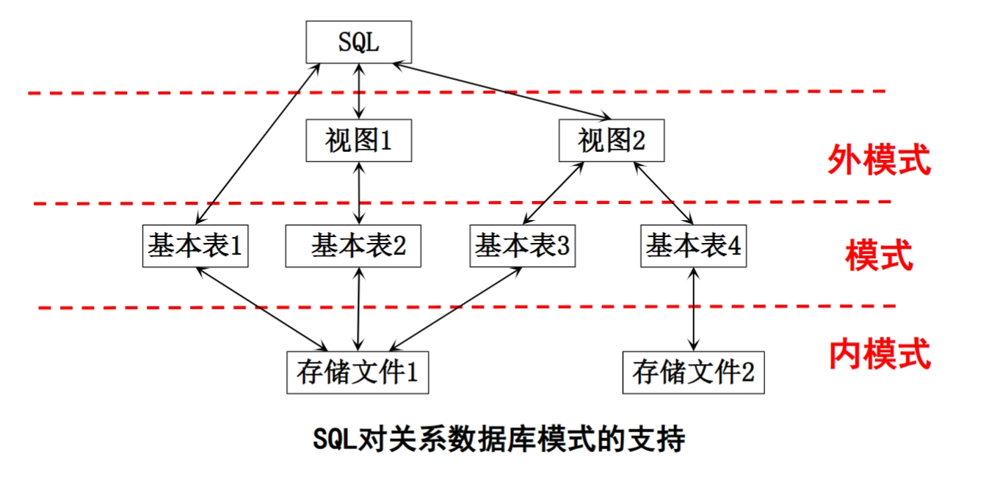

# 第四章 结构查询语言 SQL

- [Back to Course Home](index.md)

## SQL 概述

- 概述：
	- SQL（Structured Query Language）即结构化查询语言，是关系数据库的标准语言。
	- 它是一种通用的、功能极强的关系数据库语言
	- 功能涵盖查询、操纵、定义和控制，是综合的、通用的关系数据库语言，同时也是高度非过程化语言——仅要求用户指出“做什么”，无需说明“怎么做”。
	- SQL 集成实现了数据库生命周期的全部操作。
- SQL 语言的特点
	1. 综合统一
		- 集数据定义语言（DDL）、数据操纵语言（DML）、数据控制语言（DCL）功能于一体，可独立完成数据库生命周期中的全部活动：
			- 定义关系模式、插入数据、建立数据库；
			- 对数据库中的数据进行查询和更新；
			- 数据库重构、维护及安全性、完整性控制等；
		- 用户数据库运行后，可随时逐步修改模式，不影响数据运行；
		- 数据操作符统一。
	2. 高度非过程化
		- 非关系数据模型的数据操纵语言“面向过程”，需制定存取路径；
		- 而 SQL 只需提出“做什么”，**无需了解存取路径**；
		- 存取路径的选择及 SQL 操作过程由系统自动完成。
	3. 面向集合的操作方式
		- 非关系数据模型采用面向记录的操作方式，操作对象为一条记录；
		- SQL 采用集合操作方式：
			- 操作对象、查找结果可以是元组的集合；
			- 一次插入、删除、更新操作的对象也可以是元组的集合。
	4. 以同一种语法结构提供多种使用方式
		- **SQL 是独立的语言**：可独立用于联机交互的使用方式；
		- **SQL 也是嵌入式语言**：可嵌入到高级语言（如 C、C++、Java）程序中，供程序员设计程序时使用。
	5. 语言简捷，易学易用
- SQL 的基本概念
	

	- 基本表
		- 本身独立存在的表；
		- SQL 中一个关系对应一个基本表；
		- 一个（或多个）基本表对应一个存储文件；
		- 一个表可带若干索引。
	- 存储文件
		- 逻辑结构组成关系数据库的内模式
		- 物理结构任意且对用户透明。
	- 视图
		- 从一个或几个基本表导出的虚表，
		- 数据库中只存放视图的定义，不存放对应数据，
		- 用户可在视图上再定义视图。

## 数据定义
SQL 的数据定义功能包括模式定义、表定义、视图定义和索引定义，核心语句如下表所示：

| 操作对象 | 创建（CREATE）	   | 删除（DROP）		 | 修改（ALTER）		|
|----------|----------------------|----------------------|----------------------|
| 模式	 | `CREATE SCHEMA`		| `DROP SCHEMA`		  | -					|
| 表	   | `CREATE TABLE`		 | `DROP TABLE`		   | `ALTER TABLE`		  |
| 视图	 | `CREATE VIEW`		  | `DROP VIEW`			| -					|
| 索引	 | `CREATE INDEX`		 | `DROP INDEX`		   | `ALTER INDEX`		  |

### 模式的定义与删除
#### 定义数据库模式

- **语句格式**：
	```sql
	CREATE SCHEMA <模式名> AUTHORIZATION <用户名> [ <表定义子句> | <视图定义子句> | <授权定义子句> ]
	```

- 说明：
	- 若未指定 `<模式名>`，则隐含为 `<用户名>`；
	- 定义模式实质是定义一个 **命名空间**，可在其中直接 **定义该模式包含的数据库对象**，例如基本表、视图等数据库对象。

- **示例**：
	1.  为用户 WANG 定义模式 S-T：
		```sql
		CREATE SCHEMA "S-T" AUTHORIZATION WANG;
		```

	2.  隐含模式名（为 WANG 定义模式，模式名即为 WANG）：
		```sql
		CREATE SCHEMA AUTHORIZATION WANG;
		```

	3.  为用户 ZHANG 创建模式 TEST，并在其中定义表 TAB1，授权 PUBLIC 用户组对 TAB1 的查询权限：
		```sql
		CREATE SCHEMA TEST AUTHORIZATION ZHANG
		CREATE TABLE TAB1(
			COL1 SMALLINT,
			COL2 INT,
			COL3 CHAR(20),
			COL4 NUMERIC(10,3),
			COL5 DECIMAL(5,2)
		)
		GRANT SELECT ON TAB1 TO PUBLIC; -- 授权PUBLIC用户组对TAB1的查询权限
		```

#### 删除数据库模式

- **语句格式**：
	```sql
	DROP SCHEMA <模式名> <CASCADE | RESTRICT>
	```

- 说明：
	- `CASCADE`（级联）：删除模式的同时，删除该模式中所有数据库对象；
	- `RESTRICT`（限制）：若模式中存在下属对象（如表、视图等），则拒绝删除，仅当无下属对象时可执行。

- **示例**：删除模式 ZHANG 及其下属所有对象：
	```sql
	DROP SCHEMA ZHANG CASCADE;
	```

### 基本表的定义、删除与修改
#### 定义基本表

- **语句格式**：
	```sql
	CREATE TABLE <表名> (
		<列名> <数据类型> [ <列级完整性约束条件> ],
		[ <列名> <数据类型> [ <列级完整性约束条件> ] ],
		...
		[ <表级完整性约束条件> ]
	);
	```

- 说明：
	- `<表名>`：需定义的基本表名称；
	- `<列名>`：表的属性（列）；
	- `<列级完整性约束条件>`：涉及 **相应属性列** 的完整性约束条件
	- `<表级完整性约束条件>`：涉及 **一个或多个属性列** 的完整性约束条件
- **常用完整性约束**：

	| 约束条件 | 说明 |
	| --- | --- |
	| `PRIMARY KEY (PK)` | 标识该字段为该表的主码，可以唯一的标识记录，不可以为空，与 `UNIQUE + NOT NULL` 等价 |
	| `FOREIGN KEY (FK)` | 标识该字段为该表的外码，实现表与表（父表主码/子表外码）之间的关联 |
	| `NOT NULL` | 标识该字段不能为空 |
	| `UNIQUE KEY (UK)` | 标识该字段的值是唯一的，可以为空，一个表中可以有多个 `UNIQUE KEY` |
	| `AUTO_INCREMENT` | 标识该字段的值自动增长（整数类型，而且为主键） |
	| `DEFAULT` | 为该字段设置默认值 |
	| `ZEROFILL` | 使用 0 填充 |

- **示例**：
	1.  建立“学生”表 Student（学号为主码，姓名取值唯一）：
		```sql
		CREATE TABLE Student (
			Sno CHAR(9) PRIMARY KEY,  -- 列级主码约束
			Sname CHAR(20) UNIQUE,	-- 列级唯一性约束
			Ssex CHAR(2),
			Sage SMALLINT,
			Sdept CHAR(20)
		);
		```

	2.  建立“课程”表 Course（课程号为主码，课程名非空，先修课参照课程号）：
		```sql
		CREATE TABLE Course (
			Cno CHAR(4) PRIMARY KEY,   -- 列级主码约束
			Cname CHAR(40) NOT NULL,   -- 列级非空约束
			Cpno CHAR(4),
			Ccredit SMALLINT,
			FOREIGN KEY (Cpno) REFERENCES Course(Cno)  -- 表级参照约束
		);
		```

	3.  建立“学生选课”表 SC（学号+课程号为主码，分别参照 Student 和 Course 表）：
		```sql
		CREATE TABLE SC (
			Sno CHAR(9),
			Cno CHAR(4),
			Grade SMALLINT CHECK(Grade >= 0 AND Grade <= 100),  -- 列级检查约束
			PRIMARY KEY (Sno, Cno),  -- 表级主码约束（多属性主码）
			FOREIGN KEY (Sno) REFERENCES Student(Sno),  -- 表级参照约束（参照Student）
			FOREIGN KEY (Cno) REFERENCES Course(Cno)   -- 表级参照约束（参照Course）
		);
		```

#### 数据类型

- SQL 中域的概念通过数据类型实现，定义表的属性时需指明数据类型及长度
- 选择依据：
	- 属性的取值范围
	- 需执行的运算

#### 模式与表的关联

- 关系：
	- 每个基本表属于某一模式
	- 一个模式包含多个基本表
- 定义基本表所属模式的方法：
	1.  **显式指定模式名**：
		```sql
		CREATE TABLE "S-T".Student(...);  -- 模式名为S-T
		```

	2.  **创建模式时同步建表**：
		```sql
		CREATE SCHEMA "S-T" AUTHORIZATION WANG
		CREATE TABLE Student(
			Sno CHAR(9) PRIMARY KEY,
			Sname CHAR(20) UNIQUE,
			Ssex CHAR(2),
			Sage SMALLINT,
			Sdept CHAR(20)
		);
		```

	3.  **设置所属的模式**
- 创建基本表（其他数据库对象也一样）时，若没有指定模式，系统根据搜索路径来确定该对象所属的模式。
	- RDBMS 会使用模式列表中第一个存在的模式作为数据库对象的模式名。
	- 若搜索路径中的模式名都不存在，系统将给出错误。
	- 显示当前搜索路径：`SHOW search_path`（默认值：$user, PUBLIC）；
	- 设置搜索路径：`SET search_path TO "S-T", PUBLIC;`，之后创建的表默认属于路径中第一个存在的模式。
		- **示例**：
			```sql
			SET search_path TO "S-T", PUBLIC;
			CREATE TABLE Student(...);  -- 表Student属于模式S-T
			```

#### 修改基本表

- **语句格式**：
	```sql
	ALTER TABLE <表名>
		[ ADD [ COLUMN ] <新列名> <数据类型> [ 完整性约束 ] ]
		[ ADD <表级完整性约束> ]
		[ DROP [ COLUMN ] <列名> [ CASCADE | RESTRICT ] ]
		[ DROP CONSTRAINT <完整性约束名> [ CASCADE | RESTRICT ] ]
		[ RENAME COLUMN <旧列名> TO <新列名> ]
		[ ALTER COLUMN <列名> [ TYPE ] <数据类型> ];
	```

- 说明：
	- `<表名>`：要修改的基本表
	- `ADD` 子句：增加新列、新的列完整性约束条件、新的表完整性约束条件；
	- `DROP COLUMN` 子句：删除指定的列；
		- `CASCADE`（级联）：删除该列时，同时删除所有依赖该列的对象（如视图、索引等）；
		- `RESTRICT`（限制）：若存在依赖对象则拒绝删除该列。缺省情况是 `RESTRICT`。
	- `DROP CONSTRAINT` 子句：删除指定的完整性约束条件；
	- `RENAME COLUMN` 子句：修改列名；
	- `ALTER COLUMN` 子句：修改列的数据类型。
- **示例**：
	1.  向 Student 表增加“入学时间”列（日期型）：
		```sql
		ALTER TABLE Student ADD S_entrance DATE;
		```

	2.  将 Student 表的年龄列（原字符型）改为整数型：
		```sql
		ALTER TABLE Student ALTER COLUMN Sage INT;
		```

	3.  为 Course 表增加课程名称唯一的约束：
		```sql
		ALTER TABLE Course ADD UNIQUE(Cname);
		```

#### 删除基本表

- **语句格式**：
	```sql
	DROP TABLE <表名> [ RESTRICT | CASCADE ];
	```

- 说明：
	- `RESTRICT`（限制）：删除表是有限制的。
		- 欲删除的表不能被其他表的约束引用
		- 若存在依赖对象则拒绝删除
		- **缺省情况是** `RESTRICT`
	- `CASCADE`（级联）：删除该表没有限制。
		- 删除表的同时，删除所有依赖该表的对象（如索引、视图等）。
- **示例**：
	1.  级联删除 Student 表（含依赖的视图等）：
		```sql
		DROP TABLE Student CASCADE;
		-- 若存在视图IS_Student依赖Student，则一并删除该视图，返回信息：NOTICE: drop view IS_Student
		```

	2.  限制删除 Student 表（若存在依赖对象则报错）：
		```sql
		DROP TABLE Student RESTRICT;
		-- 若存在视图IS_Student依赖Student，则报错：ERROR: cannot drop table Student because other objects depend on it
		```

### 索引的建立与删除

- 索引是加快查询速度的有效手段（属于内模式范畴）
	- 顺序文件索引、B+ 树索引、hash 索引、位图索引等。
- 建立索引
	- DBA 或表的属主可根据需要建立索引
	- 部分 DBMS 会自动为 `PRIMARY KEY`、`UNIQUE` 列建立索引
- 使用索引
	- DBMS 会自动选择是否使用索引

#### 建立索引

- **语句格式**：
	```sql
	CREATE [ UNIQUE ] [ CLUSTER ] INDEX <索引名> 
	ON <表名> ( <列名> [ <次序> ] [, <列名> [ <次序> ] ]... );
	```

- 说明：
	- `<表名>` 指定要建索引的基本表名字
	- 索引可以建立在该表的一列或多列上，各列名之间用逗号分隔
	- `<次序>` 指定索引值的排列次序：`ASC`（升序，缺省值）、`DESC`（降序）。
	- `UNIQUE`：索引值对应唯一数据记录
		- 对于已含重复值的属性列不能建 `UNIQUE` 索引
		- 对某个列建立 `UNIQUE` 索引后，插入新记录时 DBMS 会自动检查新记录在该列上是否取了重复值。这相当于增加了一个 `UNIQUE` 约束
	- `CLUSTER`：建立 **聚簇索引**
		- 基表中数据也需要按指定的聚簇属性值的升序或降序存放
		- 索引项顺序与表中记录 **物理顺序一致**
- **示例**：
	1.  在 Student 表的 Sname 列上建立聚簇索引：
		```sql
		CREATE CLUSTER INDEX Stusname ON Student(Sname);
		```

	2.  为 Student、Course、SC 表建立唯一索引：
		```sql
		CREATE UNIQUE INDEX Stusno ON Student(Sno);  -- 学号升序唯一索引
		CREATE UNIQUE INDEX Coucno ON Course(Cno);  -- 课程号升序唯一索引
		CREATE UNIQUE INDEX SCno ON SC(Sno ASC, Cno DESC);  -- 学号升序、课程号降序唯一索引
		```

#### 修改索引

- **语句格式**：
	```sql
	ALTER INDEX <旧索引名> RENAME TO <新索引名>;
	```

- **示例**：将 SC 表的 SCno 索引改名为 SCSno：
	```sql
	ALTER INDEX SCno RENAME TO SCSno;
	```

#### 删除索引

- **语句格式**：
	```sql
	DROP INDEX <索引名>;
	```

- 说明：删除索引时，系统从数据字典中删去该索引的描述。
- **示例**：删除 Student 表的 Stusname 索引：
	```sql
	DROP INDEX Stusname;
	```

## 数据查询
数据查询是 SQL 的核心功能，可实现单表查询、连接查询、嵌套查询、集合查询等多种操作。

### 基本语法
```sql
SELECT [ ALL | DISTINCT ] <目标列表达式> [, <目标列表达式> ]...
FROM <表名或视图名> [, <表名或视图名>... ] | ( <SELECT语句> ) [ AS ] <别名>
[ WHERE <条件表达式> ]
[ GROUP BY <列名1> [ HAVING <条件表达式> ] ]
[ ORDER BY <列名2> [ ASC | DESC ] ];
[ LIMIT <行数> [ OFFSET <偏移量> ] ];
```

- `SELECT` 子句：指定查询结果的列；
- `FROM` 子句：指定查询的数据源；
- `WHERE` 子句：筛选满足条件的元组；
- `GROUP BY` 子句：按指定列分组；
- `HAVING` 子句：筛选满足条件的组；
- `ORDER BY` 子句：对查询结果排序。
- `LIMIT` 子句：限制查询结果的元组数。

### 单表查询
#### 选择表中的若干列

1.  **查询指定列**：
	- **语句格式**：
		```sql
		SELECT <列名1> [, <列名2> ...] FROM <表名>;
		```

	- **示例**：
		```sql
		-- 例1：查询全体学生的学号与姓名
		SELECT Sno, Sname FROM Student;
		-- 例2：查询全体学生的姓名、学号、所在系
		SELECT Sname, Sno, Sdept FROM Student;
		```

2.  **查询全部列**：
	- 使用通配符 `*` 表示查询表中的所有列
	- **语句格式**：
		```sql
		SELECT * FROM <表名>;
		```

	- **示例**：
		```sql
		-- 例3：查询全体学生的详细记录
		SELECT Sno, Sname, Ssex, Sage, Sdept FROM Student;
		-- 或使用通配符*
		SELECT * FROM Student;
		```

3.  **查询经过计算的值**：
	- 目标列表达式可为算术表达式、字符串常量、函数或列别名。
	- **语句格式**：
		```sql
		SELECT <列名> | <算术表达式> | <字符串常量> | <函数> [ AS ] <列别名> 
		FROM <表名>;
		```

	- **示例**：
		```sql
		-- 例4：查询全体学生的姓名及其出生年份（假设当前年份为2014）
		SELECT Sname, 2014 - Sage FROM Student;
		-- 例5：查询全体学生的姓名、出生年份，系名转为小写并指定列别名
		SELECT 
			Sname,
			'Year of Birth: ',
			2014 - Sage,
			LOWER(Sdept)
		FROM Student;
		-- 例5.1：使用列别名改变查询结果的列标题
		SELECT
			Sname NAME,
			'Year of Birth: ' BIRTH,
			2014 - Sage BIRTHDAY,
			LOWER(Sdept) DEPARTMENT 
		FROM Student;
		```

#### 选择表中的若干元组

1.  **消除重复行**：使用 `DISTINCT` 短语
	- **语句格式**：
		```sql
		SELECT [ DISTINCT | ALL ] <列名1> [, <列名2> ...] FROM <表名>;
		```

	- **示例**：
		```sql
		-- 例6：查询选修了课程的学生学号（去重）
		SELECT DISTINCT Sno FROM SC;
		```

	- **说明**：缺省值为 `ALL`：保留重复行
2.  **按条件筛选元组**：
	- `WHERE` 子句支持多种查询条件，如下表所示：

		| 查询条件  |  谓词   |
		|-----------|--------|
		| 比较 | `=, >, <, >=, <=, !=, <>, !>, !<`; `NOT`+上述运算符 |
		| 确定范围 | `BETWEEN AND`, `NOT BETWEEN AND`  |
		| 确定集合 | `IN`, `NOT IN`   |
		| 字符匹配 | `LIKE`, `NOT LIKE`   |
		| 空值 | `IS NULL`, `IS NOT NULL` |
		| 多重条件 | `AND`, `OR`, `NOT`  |

	- **语句格式**
		```sql
		SELECT <列名1> [, <列名2> ...] FROM <表名>
		WHERE <条件表达式>;
		```

	1. **比较大小**：
		- **语句格式**：
			```sql
			SELECT <列名1> [, <列名2> ...] FROM <表名>
			WHERE <列名> <比较运算符> <常量>;
			```

		- **示例**：
			```sql
			-- 例7：查询计算机科学系（CS）全体学生的名单
			SELECT Sname FROM Student WHERE Sdept = 'CS';
			-- 例8：查询考试成绩不及格的学生学号（去重）
			SELECT DISTINCT Sno FROM SC WHERE Grade < 60;
			```

	2. **确定范围**：
		- **语句格式**：
			```sql
			SELECT <列名1> [, <列名2> ...] FROM <表名>
			WHERE <列名> [ NOT ] BETWEEN <值1> AND <值2>;
			```

		- **示例**：
			```sql
			-- 例9：查询年龄在20-23岁（含）之间的学生姓名、系别和年龄
			SELECT Sname, Sdept, Sage FROM Student WHERE Sage BETWEEN 20 AND 23;
			-- 例10：查询年龄不在20-23岁之间的学生
			SELECT Sname, Sdept, Sage FROM Student WHERE Sage NOT BETWEEN 20 AND 23;
			```

	3. **确定集合**：
		- **语句格式**：
			```sql
			SELECT <列名1> [, <列名2> ...] FROM <表名>
			WHERE <列名> [ NOT ] IN ( <值1>, <值2>, ... );
			```

		- **示例**：
			```sql
			-- 例11：查询信息系（IS）、数学系（MA）、计算机系（CS）学生的姓名和性别
			SELECT Sname, Ssex FROM Student WHERE Sdept IN ('IS', 'MA', 'CS');
			-- 例12：查询非上述三系的学生姓名和性别
			SELECT Sname, Ssex FROM Student WHERE Sdept NOT IN ('IS', 'MA', 'CS');
			```

	4. **字符匹配**
		- **语句格式**：
			```sql
			SELECT <列名1> [, <列名2> ...] FROM <表名>
			WHERE <列名> [ NOT ] LIKE <匹配串> [ESCAPE <换码字符>];
			```

		- 匹配串：固定字符串或含通配符的字符串
			- 当匹配模板为固定字符串时，
				- 用 `=` 运算符取代 LIKE 谓词
				- 用 `!=` 或 `<>` 运算符取代 NOT LIKE 谓词
			- 当匹配模板含通配符时，必须使用 LIKE 或 NOT LIKE 谓词
				- `%` 代表任意长度（长度可以为 0）的字符串
				- `_` 代表任意单个字符
			- 若匹配串中含有通配符字符本身，则需用换码字符（如 `\`）转义
		- **示例**：
			```sql
			-- 例13：查询姓刘的学生姓名、学号和性别
			SELECT Sname, Sno, Ssex FROM Student WHERE Sname LIKE '刘%';

			-- 例14：查询名字中第2个字为“阳”的学生姓名和学号
			SELECT Sname, Sno FROM Student WHERE Sname LIKE '_阳%';
			-- 注：ASCII码中，汉字占2个字符，需要用两个下划线表示；GBK编码中，汉字占1个字符，用一个下划线表示

			-- 例15：查询DB_Design课程的课程号和学分（用\作为换码字符）
			SELECT Cno, Ccredit FROM Course WHERE Cname LIKE 'DB\_Design' ESCAPE '\';
			```

	5. **空值查询**：
		- **语句格式**：
			```sql
			SELECT <列名1> [, <列名2> ...] FROM <表名>
			WHERE <列名> IS [ NOT ] NULL;
			```

		- 说明：`IS NULL` 不能用 `= NULL` 代替
		- **示例**：
			```sql
			-- 例16：查询缺少成绩的学生学号和课程号
			SELECT Sno, Cno FROM SC WHERE Grade IS NULL;
			-- 例17：查询有成绩的学生学号和课程号
			SELECT Sno, Cno FROM SC WHERE Grade IS NOT NULL;
			```

	6. **多重条件查询**：
		- 使用 `AND`、`OR` 连接多个条件
		- **语句格式**：
			```sql
			SELECT <列名1> [, <列名2> ...] FROM <表名>
			WHERE <条件1> [ AND | OR ] <条件2> ... ;
			```

		- **示例**：
			```sql
			-- 例18：查询计算机系年龄小于20岁的学生姓名
			SELECT Sname FROM Student WHERE Sdept = 'CS' AND Sage < 20;
			```

#### 对查询结果排序

- 使用 `ORDER BY` 子句
	- 可按一个或多个属性列排序
	- 升序：`ASC`（缺省值）
	- 降序：`DESC`
- **语句格式**：
	```sql
	SELECT <列名1> [, <列名2> ...] FROM <表名>
	[ WHERE <条件表达式> ]
	ORDER BY <列名1> [ ASC | DESC ] [, <列名2> [ ASC | DESC ] ... ];
	```

- 当排序列含空值时
	- `ASC`：排序列为空值的元组最后显示
	- `DESC`：排序列为空值的元组最先显示
- **示例**：
	1.  查询选修 3 号课程的学生学号及成绩，按分数降序排列：
		```sql
		SELECT Sno, Grade FROM SC
		WHERE Cno = '3'
		ORDER BY Grade DESC;
		```

	2.  查询全体学生情况，按所在系升序排列，同系学生按年龄降序排列：
		```sql
		SELECT * FROM Student
		ORDER BY Sdept [ASC], Sage DESC;
		```

#### 使用聚集函数

- 聚集函数用于对数据进行统计，常见类型如下：

	| 函数类型 | 语法  | 功能  |
	|---------|-------|-------|
	| 计数  | `COUNT( [DISTINCT | ALL] *)` | 统计元组个数  |
	|  | `COUNT( [DISTINCT | ALL] <列名>)` | 统计一列中非空值的个数 |
	| 求和  | `SUM( [DISTINCT | ALL] <列名>)` | 计算一列值的总和（数值型）|
	| 求平均  | `AVG( [DISTINCT | ALL] <列名>)`  | 计算一列值的平均值（数值型）  |
	| 求最大值  | `MAX( [DISTINCT | ALL] <列名>)` | 求一列值中的最大值  |
	| 求最小值  | `MIN( [DISTINCT | ALL] <列名>)` | 求一列值中的最小值  |

- **语句格式**：
	```sql
	SELECT <聚集函数>( [DISTINCT | ALL] <列名> | *) FROM <表名>
	```

- **说明**：
	- 除 `COUNT(*)` 外，其他聚集函数均忽略空值
	- `SUM`、`AVG` 函数只能用于数值型列
	- `MAX`、`MIN` 函数可用于数值型、字符型和日期型列，只能求一列中的最大值或最小值
	- 聚集函数只能使用于 `SELECT` 子句和 `HAVING` 子句中
- **示例**：
	1.  查询学生总人数：
		```sql
		SELECT COUNT(*) FROM Student;
		```

	2.  查询选修了课程的学生人数（去重）：
		```sql
		SELECT COUNT(DISTINCT Sno) FROM SC;
		```

	3.  计算 1 号课程的平均成绩：
		```sql
		SELECT AVG(Grade) FROM SC WHERE Cno = '1';
		```

	4.  查询学生 201215012 选修课程的总学分数：
		```sql
		SELECT SUM(Ccredit) FROM SC, Course
		WHERE Sno = '201215012' AND SC.Cno = Course.Cno;
		```

#### 对查询结果分组

- 使用 `GROUP BY` 子句按指定列分组，按某一列或多列的值分组，值相等的为一组。
- **细化聚集函数的作用对象**：
	- 未对查询结果分组，聚集函数将作用于 **整个查询结果**
	- 对查询结果分组后，聚集函数将分别作用于 **每个组**
- `HAVING` 子句用于筛选满足条件的组
	- `WHERE` 字句作用于基本表或视图，选择满足条件的元组
	- `HAVING` 短语作用于组，从分好的组中选择满足条件的组
- **语句格式**：
	```sql
	SELECT <列名1> [, <列名2> ...] | <聚集函数>([DISTINCT | ALL] <列名> | *)
	FROM <表名>
	[ WHERE <条件表达式> ]
	GROUP BY <列名1> [, <列名2> ...]
	[ HAVING <条件表达式> ];
	```

- **示例**：
	1.  求各个课程号及相应的选课人数：
		```sql
		SELECT Cno, COUNT(Sno) FROM SC GROUP BY Cno;
		```

	2.  查询选修了 3 门以上课程的学生学号：
		```sql
		SELECT Sno FROM SC GROUP BY Sno HAVING COUNT(*) > 3;
		```

	3.  查询平均成绩大于等于 90 分的学生学号和平均成绩：
		```sql
		SELECT Sno, AVG(Grade)
		FROM SC
		GROUP BY Sno
		HAVING AVG(Grade) >= 90;
		```

#### 限制查询结果的元组数

- `LIMIT` 子句用于限制查询结果的元组数量
- **语句格式**：
	```sql
	SELECT <列名1> [, <列名2> ...] FROM <表名>
	LIMIT <行数1> [ OFFSET <行数2> ];
	```

- 说明：
	- `LIMIT <行数 1>`：限制查询结果的最大行数为 `<行数 1>`；
	- `OFFSET <行数 2>`：忽略查询结果的前 `<行数 2>` 行，从第 `<行数 2> + 1` 行开始返回结果，缺省值为 0。
	- `LIMIT` 子句经常和 `ORDER BY` 子句一起使用
- **示例**：
	1.  查询选修“数据库”课程成绩排名前 10 的学生学号：
		```sql
		SELECT Sno
		FROM SC, Course
		WHERE Course.Cname = '数据库' AND SC.Cno = Course.Cno 
		ORDER BY Grade DESC
		LIMIT 10;
		```

	2.  查询平均成绩排名 3-7 名的学生学号和平均成绩：
		```sql
		SELECT Sno, AVG(Grade)
		FROM SC
		GROUP BY Sno
		ORDER BY AVG(Grade) DESC
		LIMIT 5 OFFSET 2;  -- 忽略前2行，取5行（对应3-7名）
		```

### 连接查询

- 同时涉及多个表的查询称为连接查询
- 用来连接两个表的条件称为 **连接条件** 或连接谓词
	- 连接谓词中的列名称为连接字段；
	- 连接条件中的各连接字段类型必须是可比的，但 **不必相同**
- SQL 中连接查询主要包括等值连接、非等值连接、自身连接、外连接、复合条件连接等。
- **语句格式**：
	```sql
	-- 使用隐式连接语法：
	SELECT <目标列表达式> [, <目标列表达式> ...]
	FROM <表名1> [, <表名2> ...]
	WHERE <连接条件> [ AND | OR <其他条件> ... ];

	-- 或使用显式连接语法：
	SELECT <目标列表达式> [, <目标列表达式> ...]
	FROM <表名1> [ INNER | LEFT | RIGHT | FULL ] JOIN <表名2>
	ON <连接条件>
	```

#### 等值与非等值连接

- **等值连接**：连接运算符为 `=`，查询结果会保留重复的连接字段；
- **非等值连接**：使用除 `=` 外的比较运算符（如 `>`、`<`、`BETWEEN` 等）。
- **示例**：查询每个学生及其选修课程的情况（等值连接）：
	```sql
	SELECT Student.*, SC.* FROM Student, SC WHERE Student.Sno = SC.Sno;
	```

- **执行过程**
	- 嵌套循环连接算法（NESTED-LOOP）
		- 首先在表 1 中找到第一个元组，然后从头开始扫描表 2，逐一查找满足连接条件的元组，找到后就将表 1 中的第一个元组与该元组拼接起来，形成结果表中一个元组。
		- 表 2 全部查找完后，再找表 1 中第二个元组，然后再从头开始扫描表 2，逐一查找满足连接条件的元组，找到后就将表 1 中的第二个元组与该元组拼接起来，形成结果表中一个元组。
		- 重复上述操作，直到表 1 中的全部元组都处理完毕。
	- 索引连接（INDEX-JOIN）
		- 对表 2 按连接字段 Sno 建立索引。
		- 对表 1 中的每个元组，依次根据其连接字段值查询表 2 的索引，从中找到满足条件的元组，找到后就将表 1 中的第一个元组与该元组拼接起来，形成结果表中一个元组。

#### 自然连接

- 等值连接的特殊情况，**把目标列中重复的属性列去掉**。
- SQL 中，自然连接也需要指定连接条件
- **示例**：用自然连接查询学生及其选修课程的情况：
	```sql
	SELECT Student.Sno, Sname, Ssex, Sage, Sdept, Cno, Grade 
	FROM Student, SC WHERE Student.Sno = SC.Sno;
	```

#### 自身连接

- 一个表与自身进行连接，称为自身连接。
- 需给表起别名以示区别
- 由于所有属性名都是同名属性，因此必须使用别名前缀限定属性。
- **示例**：查询每一门课的间接先修课（先修课的先修课）：
	```sql
	SELECT FIRST.Cno, SECOND.Cpno 
	FROM Course FIRST, Course SECOND 
	WHERE FIRST.Cpno = SECOND.Cno AND SECOND.Cpno IS NOT NULL; -- 过滤掉没有先修课的课程
	```

#### 外连接

- 外连接（OUTER JOIN）与普通连接的区别：
	- 外连接以指定表为主体，将主体表中不满足连接条件的“悬浮元组”一并输出
	- 普通连接仅输出满足条件的元组。
- **左外连接（LEFT OUTER JOIN）**：保留左边表的所有元组；
- **右外连接（RIGHT OUTER JOIN）**：保留右边表的所有元组。
- **示例**：查询每个学生及其选修课程的情况（包括未选课的学生，左外连接）：
	```sql
	SELECT Student.Sno, Sname, Ssex, Sage, Sdept, Cno, Grade 
	FROM Student LEFT OUTER JOIN SC ON (Student.Sno = SC.Sno);
	```

#### 复合条件连接

- `WHERE` 子句中包含多个条件（连接条件+其他限定条件）时，称为复合条件连接。
- **示例**：查询选修 2 号课程且成绩 90 分以上的学生学号和姓名：
	```sql
	SELECT Student.Sno, Sname
	FROM Student, SC
	WHERE Student.Sno = SC.Sno  -- 连接条件
		AND SC.Cno = '2'		-- 限定条件
		AND SC.Grade > 90;	  -- 限定条件
	```

#### 多表连接

- 涉及三个及以上表的连接查询。
- 需要指定多个连接条件。
- **示例**：查询每个学生的学号、姓名、选修的课程名及成绩：
	```sql
	SELECT Student.Sno, Sname, Cname, Grade 
	FROM Student, SC, Course 
	WHERE Student.Sno = SC.Sno 
		AND SC.Cno = Course.Cno;
	```

### 嵌套查询

- 嵌套查询概述
	-  一个 `SELECT-FROM-WHERE` 语句称为一个查询块
	- 将一个查询块（子查询）嵌套在另一个查询块的 `WHERE` 子句或 `HAVING` 短语中，称为嵌套查询。
	- 外层查询称为父查询，内层查询称为子查询。
	- 子查询不能包含 `ORDER BY` 子句，且可多层嵌套
		- `ORDER BY` 子句只能对最终查询结果排序
- 嵌套查询分类
	- 不相关子查询：子查询的查询条件 **不依赖于** 父查询。
		- 处理过程：由里向外逐层处理。即每个子查询在上一级查询处理之前求解，子查询的结果用于建立其父查询的查找条件
	- 相关子查询：子查询的查询条件依赖于父查询。
		- 处理过程：
			- 首先取外层查询中表的第一个元组，根据它与内层查询相关的属性值处理内层查询，若 `WHERE` 子句返回值为真，则取此元组放入结果表；
			- 然后再取外层表的下一个元组；
			- 重复这一过程，直至外层表全部检查完为止。

#### 带有 IN 谓词的子查询

- 子查询返回多个值，父查询通过 `IN` 判断是否在子查询结果集中。
- **语句格式**：
	```sql
	SELECT <列名1> [, <列名2> ...] FROM <表名>
	WHERE <列名> [ NOT ] IN ( <子查询> );
	```

- **示例**：查询与“刘晨”在同一个系学习的学生：
	```sql
	SELECT Sno, Sname, Sdept 
	FROM Student 
	WHERE Sdept IN (
		SELECT Sdept FROM Student WHERE Sname = '刘晨'  -- 子查询：获取刘晨所在系
	);

	-- 用自身连接完成本查询要求
	SELECT S1.Sno, S1.Sname, S1.Sdept
	FROM Student S1, Student S2
	WHERE S1.Sdept = S2.Sdept AND S2.Sname = '刘晨';
	```

- 不相关子查询

#### 带有比较运算符的子查询

- 能确切知道内层查询 **返回单值** 时，可使用比较运算符（`>`、`<`、`=` 等）。
	- 与 `ANY` 或 `ALL` 谓词配合使用
- **语句格式**：
	```sql
	SELECT <列名1> [, <列名2> ...] FROM <表名>
	WHERE <列名> <比较运算符> ( <子查询> );
	```

- 注意事项：子查询一定要跟在比较符之后
- **示例**：
	- 查询与“刘晨”在同一个系学习的学生（子查询返回单值，用 `=` 代替 `IN`）：
		```sql
		SELECT Sno, Sname, Sdept 
		FROM Student 
		WHERE Sdept = (
			SELECT Sdept FROM Student WHERE Sname = '刘晨'
		);
		```

	- 找出每个学生超过他选修课程平均成绩的课程号：
		```sql
		SELECT Sno，Cno
		FROM SC x
		WHERE Grade >= (
			SELECT AVG(Grade)
			FROM SC y
			WHERE y.Sno = x.Sno
		);
		```

- 相关子查询
	- 可能的执行过程：
		1. 从外层查询中取出 SC 的一个元组 x，将元组 x 的 Sno 值（201215121）传送给内层查询。
			```sql
			SELECT AVG(Grade)
			FROM SC y
			WHERE y.Sno = '201215121';
			```

		2. 执行内层查询，得到值 88（近似值），用该值代替内层查询，得到外层查询：
			```sql
			SELECT Sno，Cno
			FROM SC x
			WHERE Grade >= 88;
			```

		3. 执行这个查询，得到：
			```bash
			（201215121，1）
			```

		4. 外层查询取出下一个元组重复做上述 1 至 3 步骤，直到外层的 SC 元组全部处理完毕。结果为:
			```bash
			（201215121，1）
			（201215121，3）
			（201215122，2）
			```

#### 带有 ANY 或 ALL 谓词的子查询

- `ANY`：表示“任意一个”，等价于“大于/小于子查询结果中的某个值”；
- `ALL`：表示“所有”，等价于“大于/小于子查询结果中的所有值”。

| 谓词 | 说明 |
|------|------|
| `> ANY` | 大于子查询结果中的某个值 |
| `> ALL` | 大于子查询结果中的所有值 |
| `< ANY` | 小于子查询结果中的某个值 |
| `< ALL` | 小于子查询结果中的所有值 |
| `>= ANY` | 大于等于子查询结果中的某个值 |
| `>= ALL` | 大于等于子查询结果中的所有值 |
| `<= ANY` | 小于等于子查询结果中的某个值 |
| `<= ALL` | 小于等于子查询结果中的所有值 |
| `= ANY` | 等于子查询结果中的某个值 |
| `= ALL` | 等于子查询结果中的所有值（无意义） |
| `!=（或<>）ANY` | 不等于子查询结果中的某个值 |
| `!=（或<>）ALL` | 不等于子查询结果中的任何一个值 |

- **示例**：
	1.  查询其他系中比计算机系某一个学生年龄小的学生姓名和年龄：
		```sql
		SELECT Sname, Sage
		FROM Student
		WHERE Sage < ANY (
			SELECT Sage
			FROM Student
			WHERE Sdept = 'CS'
		) AND Sdept <> 'CS';
		```

	2.  查询其他系中比计算机系所有学生年龄都小的学生姓名和年龄：
		```sql
		SELECT Sname, Sage
		FROM Student
		WHERE Sage < ALL (
			SELECT Sage
			FROM Student
			WHERE Sdept = 'CS'
		) AND Sdept <> 'CS';

		-- 用聚集函数完成本查询要求
		SELECT Sname，Sage
		FROM Student
		WHERE Sage < (
			SELECT MIN(Sage)
			FROM Student
			WHERE Sdept= 'CS'
		) AND Sdept <> 'CS';
		```

- `ANY` 和 `ALL` 谓词有时可以用聚集函数实现
	- `ANY` 与 `ALL` 与聚集函数（`MIN`、`MAX`）的对应关系：

		|  | = | <>或!= | < | <= | > | >= |
		|-----|-----|-----|-----|-----|-----|-----|
		| `ANY`| `IN` | | `< MAX` | `<= MAX` | `> MIN` | `>= MIN` |
		| `ALL` | | `NOT IN` | `< MIN` | `<= MIN` | `> MAX` | `>= MAX` |

#### 带有 EXISTS 谓词的子查询
##### EXISTS/NOT EXISTS —— 存在量词

- `EXISTS` 谓词:
	- 存在量词 $\exists$，判断子查询结果是否非空：
	- 带有 `EXISTS` 谓词的子查询不返回任何数据，只产生逻辑真值 `TRUE` 或逻辑假值 `FALSE`。
		- 若子查询返回元组，则为 `TRUE`；
		- 若子查询不返回元组，则为 `FALSE`。
	- 由 `EXISTS` 引出的子查询，其目标列表达式通常都用 `*` ，因为带 `EXISTS` 的子查询只返回真值或假值，给出列名无实际意义。
- `NOT EXISTS` 则相反。
- **示例**：
	1.  查询所有选修了 1 号课程的学生姓名：
		```sql
		SELECT Sname
		FROM Student
		WHERE EXISTS (
			SELECT *
			FROM SC
			WHERE Sno = Student.Sno AND Cno = '1'  -- 相关子查询
		);

		-- 用连接运算
		SELECT Sname
		FROM Student, SC
		WHERE Student.Sno=SC.Sno AND SC.Cno= '1';
		```

	2.  查询没有选修 1 号课程的学生姓名：
		```sql
		SELECT Sname 
		FROM Student 
		WHERE NOT EXISTS (
			SELECT *
			FROM SC
			WHERE Sno = Student.Sno AND Cno = '1'
		);

		-- 用谓词实现本查询要求
		SELECT Sname
		FROM Student
		WHERE Sno NOT IN (
			SELECT Sno
			FROM SC
			WHERE Cno = '1'
		);
		```

- 不同形式的查询间的替换
	- 一些带 `EXISTS` 或 `NOT EXISTS` 谓词的子查询不能被其他形式的子查询等价替换。
	- 所有带 `IN` 谓词、比较运算符、`ANY` 和 `ALL` 谓词的子查询都能用带 `EXISTS` 谓词的子查询等价替换。
	- 示例：查询与“刘晨”在同一个系学习的学生。可以用带 `EXISTS` 谓词的子查询替换：
		```sql
		SELECT Sno，Sname，Sdept
		FROM Student S1
		WHERE EXISTS (
			SELECT *
			FROM Student S2
			WHERE S2.Sdept = S1.Sdept AND
				  S2.Sname = '刘晨'
		);
		```

##### 用 EXISTS/NOT EXISTS 实现全称量词

- SQL 语言中没有全称量词 $\forall$（For all）
- 可以把 **带有全称量词的谓词** 转换为等价的 **带有存在量词的谓词**：

	$$
	(\forall x)P \equiv \neg (\exists x(\neg P))
	$$

- 示例：查询选修了全部课程的学生姓名。
	- $(\forall 课程 X)该学生选修 X \equiv \neg (\exists 课程 X (\neg 该学生选修 X))$

	```sql
	SELECT Sname -- 查询这样的学生
	FROM Student
	WHERE NOT EXISTS ( -- 不存在这样的课程
		SELECT *
		FROM Course
		WHERE NOT EXISTS ( -- 该学生没有选修该课程
			SELECT *
			FROM SC
			WHERE Sno= Student.Sno AND 
				  Cno= Course.Cno
		)
	);
	```

##### 用 EXISTS/NOT EXISTS 实现逻辑蕴函

- SQL 语言中没有蕴函（Implication）逻辑运算
- 可以利用谓词演算将逻辑蕴函谓词等价转换为：

	$$
	P \rightarrow Q \equiv \neg P \lor Q
	$$

- 示例：查询至少选修了学生 201215122 选修的全部课程的学生号码。
	- 用逻辑蕴函表达：查询学号为 x 的学生，对所有的课程 y，只要 201215122 学生选修了课程 y，则 x 也选修了 y。
	- 形式化表示：用 $p$ 表示谓词 “学生 201215122 选修了课程 y”，用 $q$ 表示谓词 “学生 x 选修了课程 y”，则上述查询为: $(\forall y) p \rightarrow q$
	- 等价变换：

		$$
		\begin{aligned} (\forall y)p \rightarrow q &\equiv \neg (\exists y (\neg (p \rightarrow q ))) \\ &\equiv \neg (\exists y (\neg (\neg p \lor q))) \\ &\equiv \neg (\exists y (p \land \neg q)) \end{aligned}
		$$

	- 变换后语义：不存在这样的课程 y，学生 201215122 选修了 y，而学生 x 没有选。
		```sql
		SELECT DISTINCT Sno -- 查询这样的学生x
		FROM SC SCX
		WHERE NOT EXISTS ( -- 不存在这样的课程y
			SELECT * -- 201215122选修了y
			FROM SC SCY
			WHERE SCY.Sno = '201215122' AND
				NOT EXISTS ( -- 而学生x没有选
					SELECT *
					FROM SC SCZ
					WHERE SCZ.Sno=SCX.Sno AND
						SCZ.Cno=SCY.Cno
				)
		);
		```

### 集合查询

- SQL 支持集合操作，包括并（UNION）、交（INTERSECT）、差（EXCEPT）
- 要求参加操作的查询结果 **列数相同**、对应项 **数据类型一致**。

#### 并操作（UNION）

- `UNION`：将多个查询结果合并起来时，系统自动去掉重复元组
- `UNION ALL`：将多个查询结果合并起来时，保留重复元组。
- **语句格式**：
	```sql
	<查询1>
	UNION [ ALL ]
	<查询2>
	[ UNION [ ALL ] <查询3> ... ];
	```

- **示例**：查询计算机系（CS）的学生或年龄不大于 19 岁的学生：
	```sql
	SELECT * FROM Student WHERE Sdept = 'CS'
	UNION
	SELECT * FROM Student WHERE Sage <= 19;

	-- 用OR连接完成本查询要求
	SELECT DISTINCT * FROM Student WHERE Sdept = 'CS' OR Sage <= 19;
	```

#### 交操作（INTERSECT）

- 返回两个查询结果的共同元组。
- 语句格式：
	```sql
	<查询1>
	INTERSECT
	<查询2>
	[ INTERSECT <查询3> ... ];
	```

- **示例**：查询既选修了 1 号课程又选修了 2 号课程的学生学号：
	```sql
	SELECT Sno FROM SC WHERE Cno = '1'
	INTERSECT
	SELECT Sno FROM SC WHERE Cno = '2';

	-- 用连接运算完成本查询要求
	SELECT Sno
	FROM SC
	WHERE Cno=' 1 ' AND Sno IN (
		SELECT Sno
		FROM SC
		WHERE Cno=' 2 '
	)；
	```

#### 差操作（EXCEPT）

- 返回第一个查询结果中不在第二个查询结果中的元组。
- 语句格式：
	```sql
	<查询1>
	EXCEPT
	<查询2>
	[ EXCEPT <查询3> ... ];
	```

- **示例**：查询计算机系中年龄大于 19 岁的学生：
	```sql
	SELECT * FROM Student WHERE Sdept = 'CS'
	EXCEPT
	SELECT * FROM Student WHERE Sage <= 19;

	-- 用AND连接完成本查询要求
	SELECT * FROM Student WHERE Sdept = 'CS' AND Sage > 19;
	```

### 派生查询

- 子查询出现在 `FROM` 子句中，生成的临时表称为临时派生表（derived table），作为主查询的查询对象。
- 基于派生表的查询称为派生查询。
- **语句格式**：
	```sql
	SELECT <目标列表达式> [, <目标列表达式> ...]
	FROM ( <子查询> ) AS <派生表别名>
	[ WHERE <条件表达式> ]
	```

- **示例**：
	1. 找出每个学生超过自己选修课程平均成绩的课程号：
		```sql
		SELECT SC.Sno, Cno
		FROM SC, (
			SELECT Sno, AVG(Grade) AS avg_grade FROM SC GROUP BY Sno  -- 派生表：学生平均成绩
		) AS Avg_sc
		WHERE SC.Sno = Avg_sc.Sno AND SC.Grade >= Avg_sc.avg_grade;

		-- 或者
		SELECT SC.Sno, Cno
		FROM SC, (
			SELECT Sno, AVG(Grade) FROM SC GROUP BY Sno
		) AS Avg_sc(avg_sno, avg_grade)  -- 指定派生表属性列名
		WHERE SC.Sno = Avg_sc.avg_sno AND SC.Grade >= Avg_sc.avg_grade;
		```

	2. 查询所有选修了 1 号课程的学生姓名。
		```sql
		SELECT Sname
		FROM Student, (
			SELECT Sno FROM SC WHERE Cno='1'
		) AS SC1
		WHERE Student.Sno = SC1.Sno;

		-- 或者使用IN谓词
		SELECT Sname
		FROM Student
		WHERE Sno IN (
			SELECT Sno FROM SC WHERE Cno='1'
		);
		```

- 如果子查询没有聚集函数，派生表可以不指定属性列，子查询 `SELECT` 子句后面的列名为其默认属性；

## 数据更新
数据更新包括插入、修改、删除三类操作，均需遵守表的完整性约束。

### 插入数据
支持插入单个元组和插入子查询结果（批量插入）。

#### 插入单个元组

- **语句格式**：
	```sql
	INSERT INTO <表名> [ ( <属性列1> [, <属性列2>... ] ) ]
	VALUES ( <常量1> [, <常量2>... ] );
	```

- 功能：将新元组插入指定表中
- 说明：
	- 如果不指定任何属性列，则新插入的元组必须在每个属性列上均有值；
	- 属性列的顺序可与表定义中的顺序不一致；
	- 如果仅指定部分属性列，则新元组在没有出现的属性列上取空值。
	- `VALUES` 子句提供的值必须与 `INTO` 子句匹配（值的个数，值的类型）。
- **示例**：插入新学生记录（学号：201215128；姓名：陈冬；性别：男；系别：IS；年龄：18）：
	```sql
	INSERT INTO Student (Sno, Sname, Ssex, Sdept, Sage)
	VALUES ('201215128', '陈冬', '男', 'IS', 18);
	```

#### 插入子查询结果

- **语句格式**：
	```sql
	INSERT INTO <表名> [ ( <属性列1> [, <属性列2>... ] ) ]
	<子查询>;
	```

- **示例**：对每一个系求学生平均年龄，并存入 Deptage 表：
	1.  先创建 Deptage 表：
		```sql
		CREATE TABLE Deptage (
			Sdept CHAR(15),  -- 系名
			Avgage SMALLINT  -- 平均年龄
		);
		```

	2.  插入子查询结果：
		```sql
		INSERT INTO Deptage (Sdept, Avgage)
		SELECT Sdept, AVG(Sage) FROM Student GROUP BY Sdept;
		```

- 说明：
	- `INTO` 子句（与插入单条元组类似）
		- 指定要插入数据的表名及属性列
		- 属性列的顺序可与表定义中的顺序不一致
		- 没有指定属性列：表示要插入的是一条完整的元组
		- 指定部分属性列：插入的元组在其余属性列上取空值
	- 子查询
		- `SELECT` 子句目标列必须与 `INTO` 子句匹配
			- 值的个数
			- 值的类型
	- DBMS 在执行插入语句时会检查所插元组是否破坏表上已定义的完整性规则
		- 实体完整性
		- 参照完整性
		- 用户定义的完整性
			- 对于有 `NOT NULL` 约束的属性列是否提供了非空值
			- 对于有 `UNIQUE` 约束的属性列是否提供了非重复值
			- 对于有值域约束的属性列所提供的属性值是否在值域范围内

### 修改数据

- **语句格式**：
	```sql
	UPDATE <表名>
	SET <列名> = <表达式> [, <列名> = <表达式>... ]
	[ WHERE <条件> ];
	```

- 说明：
	- `SET` 子句指定要修改的属性列及其新值，可以修改一个或多个属性列；
	- `WHERE` 子句指定要修改的元组，缺省将修改表中所有元组。
- 功能：修改指定表中满足条件的元组。

#### 修改元组的值

- **示例**：将学生 201215121 的年龄改为 22 岁：
	```sql
	UPDATE Student SET Sage = 22
	WHERE Sno = '201215121';
	```

#### 带子查询的修改语句

- **示例**：将计算机系全体学生的成绩置零：
	```sql
	UPDATE SC SET Grade = 0 
	WHERE Sno IN (
		SELECT Sno FROM Student WHERE Sdept = 'CS'
	);
	```

### 删除数据

- **语句格式**：
	```sql
	DELETE FROM <表名> [ WHERE <条件> ];
	```

- `WHERE` 子句指定要删除的元组，缺省将删除表中所有元组（表结构仍存在）。
- 功能：删除指定表中满足条件的元组。
- 说明：DBMS 在执行插入语句时会检查所插元组，不能破坏表上已定义的完整性规则
	- 参照完整性
		- 不允许删除
		- 级联删除

#### 删除元组的值

- **示例**：删除学号为 201215128 的学生记录：
	```sql
	DELETE FROM Student
	WHERE Sno = '201215128';
	```

#### 带子查询的删除语句

- **示例**：删除计算机系所有学生的选课记录：
	```sql
	DELETE FROM SC
	WHERE Sno IN (
		SELECT Sno FROM Student WHERE Sdept = 'CS'
	);
	```

## 空值
### 空值的概念

- 空值表示“不知道”“不存在”或“无意义”的值，并非“0”或空字符串。
- SQL 语言允许某些元组的某些属性在一定情况下取空值：
	- 该属性应该有一个值，但目前不知道它的具体值；
	- 该属性不应该有值；
	- 某种原因不便于填写；

### 空值的产生

- 可能情况：
	- 插入元组时未指定属性值；
	- 修改元组时将属性值设为 `NULL`；
	- 外连接或关系运算的结果。
- **示例**：
	1.  插入选课记录（学号：201215126；课程号：1；成绩：空）：
		```sql
		-- 插入时将成绩设为NULL
		INSERT INTO SC (Sno, Cno, Grade) VALUES ('201215126', '1', NULL);
		-- 或省略Grade列
		INSERT INTO SC (Sno, Cno) VALUES ('201215126', '1');
		```

	2.  将学号 201215200 的学生系别改为空值：
		```sql
		UPDATE Student SET Sdept = NULL WHERE Sno = '201215200';
		```

### 空值的判断

- 使用 `IS NULL` 或 `IS NOT NULL` 判断，不能用 `=` 或 `!=`。
- **示例**：查询 Student 表中漏填数据的学生信息：
	```sql
	SELECT * FROM Student 
	WHERE Sname IS NULL OR Ssex IS NULL OR Sage IS NULL OR Sdept IS NULL;
	```

### 空值的约束条件

- 属性定义（或域定义）中有 `NOT NULL` 约束的属性不能取空值；
- 含 `UNIQUE` 约束的属性不能取空值；
- 码属性不能取空值。

### 空值的运算规则

- **算术运算**：空值与任何值的算术运算结果为 **空值**；
- **比较运算**：空值与任何值的比较结果为 `UNKNOWN`；
- **逻辑运算**：遵循三值逻辑（T、F、U），真值表如下：

	| X	| Y	| X AND Y | X OR Y | NOT X |
	|------|------|---------|--------|-------|
	| T	| T	| T	   | T	  | F	 |
	| T	| U	| U	   | T	  | F	 |
	| T	| F	| F	   | T	  | F	 |
	| U	| T	| U	   | T	  | U	 |
	| U	| U	| U	   | U	  | U	 |
	| U	| F	| F	   | U	  | U	 |
	| F	| T	| F	   | T	  | T	 |
	| F	| U	| F	   | U	  | T	 |
	| F	| F	| F	   | F	  | T	 |

- **示例**：查询选修 1 号课程的不及格学生及缺考学生：
	```sql
	SELECT Sno FROM SC WHERE Cno = '1' AND (Grade < 60 OR Grade IS NULL);
	```

## 视图

### 视图的特点

- 是从一个或几个基本表（或视图）导出的 **虚表**，无实际存储数据
- 只存放视图的定义，不会出现数据冗余
- 基表中的数据发生变化，从视图中查询出的数据也随之改变

### 视图的操作
#### 建立视图

- **语句格式**：
	```sql
	CREATE VIEW <视图名> [ ( <列名> [, <列名>... ] ) ]
	AS <子查询>
	[ WITH CHECK OPTION ];
	```

- 说明：
	- 子查询可以是任意的 `SELECT` 语句，是否含有 `ORDER BY` 子句和 `DISTINCT` 短语，取决于具体系统的实现；
	- `WITH CHECK OPTION`：对视图进行更新、插入、删除操作时需要满足子查询的谓词条件；
	- 组成视图的属性列名：**全部省略或全部指定**。
		- 必须明确指定组成视图的所有列名的情况：
			1. 某个目标列不是单纯的属性名，而是聚集函数或列表达式；
			2. 多表连接时选出了几个同名列作为视图的字段；
			3. 需要在视图中为某个列启用新的更合适的名字。
	- DBMS 执行 `CREATE VIEW` 语句时只是把视图的定义存入数据字典，并不执行其中的 `SELECT` 语句

##### 行列子集视图

- 若一个视图由单个基本表导出，只是去掉某些行列，但 **保留主码**，这类视图称为行列子集视图。
- **示例**：建立信息系（IS）学生的视图，并要求透过该视图进行的更新操作只涉及信息系学生。（带 CHECK OPTION）：
	```sql
	CREATE VIEW IS_Student 
		AS
		SELECT Sno, Sname, Sage
		FROM Student
		WHERE Sdept = 'IS'
		WITH CHECK OPTION;
	```

##### 基于多个基表的视图

- **示例**：建立信息系选修了 1 号课程的学生视图。
	```sql
	CREATE VIEW IS_S1(Sno, Sname, Grade)
		AS
		SELECT Student.Sno, Sname, Grade
		FROM Student, SC
		WHERE Sdept = 'IS' AND
			  Student.Sno = SC.Sno AND
			  SC.Cno = '1';
	```

##### 基于视图的视图

- **示例**：建立信息系选修了 1 号课程且成绩在 90 分以上的学生的视图。
	```sql
	CREATE VIEW IS_S2
		AS
		SELECT Sno, Sname, Grade
		FROM IS_S1
		WHERE Grade >= 90；
	```

##### 带表达式的视图

- **示例**：定义一个反映学生出生年份的视图。
	```sql
	CREATE VIEW BT_S(Sno, Sname, Sbirth)
		AS
		SELECT Sno, Sname, 2014-Sage
		FROM Student
	``` 

- 设置一些派生属性列, 也称为虚拟列，例如 `Sbirth`；
- 带表达式的视图必须明确定义组成视图的各个属性列名；

##### 建立分组视图

- **示例**：学生的学号及他的平均成绩定义为一个视图，假设 SC 表中“成绩”列 Grade 为数字型。
	```sql
	CREATE VIEW S_G(Sno, Gavg)
		AS
		SELECT Sno, AVG(Grade)
		FROM SC
		GROUP BY Sno;
	```

##### 不指定属性列

- **示例**：将 Student 表中所有女生记录定义为一个视图
	```sql
	CREATE VIEW F_Student1(F_sno, name, sex, age, dept)
		AS
		SELECT *
		FROM Student
		WHERE Ssex='女';
	```

- 缺点：修改基表 Student 的结构后，Student 表与 F_Student1 视图的映象关系被破坏，导致该视图不能正确工作。

#### 删除视图

- **语句格式**：
	```sql
	DROP VIEW <视图名> [ CASCADE ];
	```

- 说明：
	- 该语句从数据字典中删除指定的视图定义；
	- 由该视图导出的其他视图定义仍在数据字典中，但已不能使用，必须显式删除；
	- 删除基表时，由该基表导出的所有视图定义都必须显式删除；
	- `CASCADE`：级联删除依赖该视图的其他视图；
- **示例**：级联删除视图 IS_S1 及其依赖视图：
	```sql
	DROP VIEW IS_S1 CASCADE;
	```

#### 查询视图

- 从用户角度：查询视图与查询基本表相同
- DBMS 实现视图查询的方法：
	- 实体化视图（View Materialization）
		- 有效性检查：检查所查询的视图是否存在
		- 执行视图定义，将视图临时实体化，生成临时表
		- 查询视图转换为查询临时表
		- 查询完毕删除被实体化的视图(临时表)
	- **视图消解法**（View Resolution）
		- 进行有效性检查，检查查询的表、视图等是否存在。如果存在，则从数据字典中取出视图的定义
		- 把视图定义中的子查询与用户的查询结合起来，转换成等价的对基本表的查询
		- 执行修正后的查询
		- **局限**：有些情况下，视图消解法不能生成正确查询，DBMS 会限制这类查询

- **示例**：
	1. 查询 IS_Student 视图中年龄小于 20 岁的学生：
		```sql
		SELECT Sno, Sage FROM IS_Student WHERE Sage < 20;
		```
		转换后的基本表查询：
		```sql
		SELECT Sno, Sage FROM Student WHERE Sdept = 'IS' AND Sage < 20;
		```

	2. 在 S_G 视图中查询平均成绩在 90 分以上的学生学号和平均成绩
		```sql
		SELECT * FROM S_G WHERE Gavg > 90;
		```
		转换后的基本表查询：
		```sql
		-- 正确：
		SELECT Sno, AVG(Grade) 
		FROM SC
		GROUP BY Sno
		HAVING AVG(Grade) > 90;
		-- 错误：
		SELECT Sno, AVG(Grade)
		FROM SC
		WHERE AVG(Grade) > 90 --查询出现语法错误
		GROUP BY Sno;
		```

#### 更新视图

- 用户角度：更新视图与更新基本表相同
- DBMS 实现视图更新的方法
	- 视图实体化法（View Materialization）
	- **视图消解法**（View Resolution）
- 指定 `WITH CHECK OPTION` 子句后
	- DBMS 在更新视图时会进行检查，防止用户通过视图对不属于视图范围内的基本表数据进行更新。
- **示例**：
	1. 将 IS_Student 视图中学号 201215122 的姓名改为“刘辰”：
		```sql
		UPDATE IS_Student
		SET Sname = '刘辰'
		WHERE Sno = '201215122';
		```
		转换后的基本表更新：
		```sql
		UPDATE Student
		SET Sname = '刘辰'
		WHERE Sno = '201215122' AND Sdept = 'IS';
		```

	2. 向信息系学生视图 IS_Student 中插入一个新的学生记录：201215129，赵新，20 岁
		```sql
		INSERT
		INTO IS_Student
		VALUES('201215129', '赵新', 20);
		```
		转换为对基本表的更新：
		```sql
		INSERT
		INTO Student(Sno, Sname, Sage, Sdept)
		VALUES('201215129', '赵新', 20, 'IS');
		```

	3. 删除视图 CS_S 中学号为 201215129 的记录
		```sql
		DELETE
		FROM IS_Student
		WHERE Sno = '201215129';
		```
		转换为对基本表的更新：
		```sql
		DELETE
		FROM Student
		WHERE Sno = '201215129' AND Sdept = 'IS';
		```

- **更新视图的限制**：一些视图是不可更新的，因为对这些视图的更新不能唯一地有意义地转换成对相应基本表的更新（对两类方法均如此）

### 视图的作用

1.  **简化用户操作**：当视图中数据不是直接来自基本表时，定义视图能够简化用户的操作。
	-  基于多张表连接形成的视图
	-  基于复杂嵌套查询的视图
	-  含导出属性的视图
2.  **用户能以多种角度看待同一数据**：视图机制能使不同用户以不同方式看待同一数据，适应不同种类的用户数据库共享的需要
3.  **对重构数据库提供了一定程度的逻辑独立性**：基表结构修改后，可通过重建视图保持用户查询不变；
4.  **对机密数据提供安全保护**：仅向用户开放其权限范围内的视图数据；
	- 对不同用户定义不同视图，使每个用户只能看到他有权看到的数据；
	- 通过 `WITH CHECK OPTION` 对关键数据定义操作时间限制；
5.  **适当的视图能够更清晰表达查询**：将复杂查询封装为视图，简化后续操作。