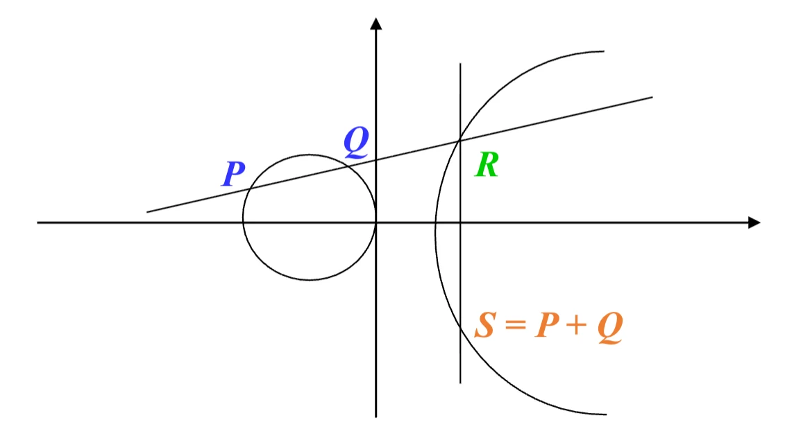
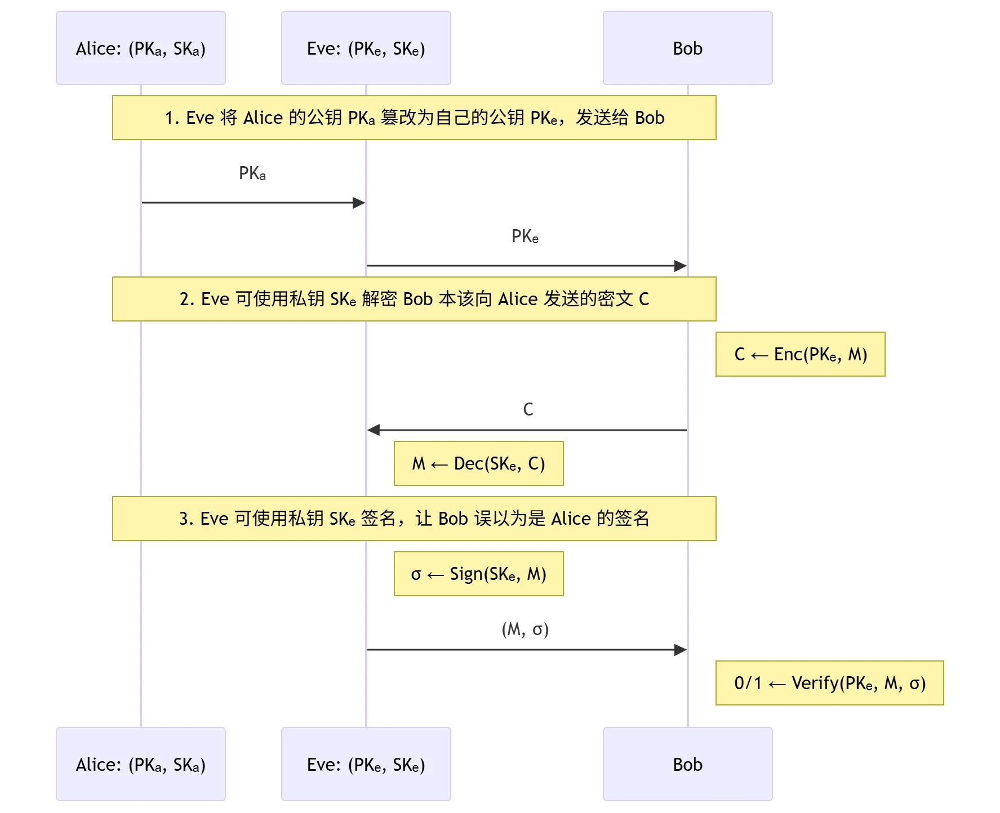

# Ch2 基于身份和属性的密码

- [Back to Course Home](index.md)

## 椭圆曲线预备知识

### 预备知识
#### 射影平面与仿射平面

- 域 $K$ 上的 **射影平面** $\mathbb{P}^2(K)$：

	$$
	\mathbb{P}^2(K)=\{(X:Y:Z):X,Y,Z\in K\}\backslash\{(0:0:0)\}
	$$

	- 定义等价关系：$(X:Y:Z)=(kX:kY:kZ),k\in K^*$

- 域 $K$ 上 $\mathbb{P}^2(K)$ 的 **仿射平面** $\mathbb{A}^2(K)$：

	$$
	\mathbb{P}^2(K) \leftrightarrow \mathbb{A}^2(K) = \{(x,y):x,y\in K\}
	$$

	- 坐标变换：

		- $(x:y:1)\leftarrow (x,y)$

		- $(X:Y:Z)\rightarrow\left(\frac{X}{Z},\frac{Y}{Z}\right), Z\neq0$

			- 无穷远点：$(1:Y:0)$ 或 $(0:1:0)$

	- $d$ 次齐次多项式: $f(rX,rY,rZ)=r^d\cdot f(X,Y,Z)$，$\forall r\in K$

		- 齐次化: $f(x,y)\rightarrow f\left(\frac{X}{Z},\frac{Y}{Z}\right)$，将非齐次的仿射方程转化为齐次的射影方程。

		- 去齐次化: $f(X,Y,Z)\rightarrow f(x,y,1)$，将齐次的射影方程转化为非齐次的仿射方程。

#### 代数曲线

- **代数曲线**：令 $C$ 为由 **齐次多项式方程** $f(X,Y,Z)=0$ 为定义的曲线。若 $f(X,Y,Z)$ 的系数属于域 $K$，称 $C$ 为定义在 $K$ 上的代数曲线。集合

	$$
	C(K)=\left\{(x:y:z)\in \mathbb{P}^2(K):f(x,y,z)=0\right\}
	$$

	称为曲线 $C$ 的有理点集。

- **奇异点与非奇异点**：令 $P\in C(K)$，如果 $\left(\frac{\partial f}{\partial x}(P),\frac{\partial f}{\partial y}(P),\frac{\partial f}{\partial z}(P)\right)=(0,0,0)$，则称 $P$ 为 $C$ 的奇异点，否则称 $P$ 为 $C$ 的非奇异点。

	- 判断是否奇异点需要先将方程齐次化。

- **切线方程**：若 $P$ 为 $C$ 上的非奇异点，则 $C$ 上过 $P$ 的切线方程为

	$$
	L:\frac{\partial f}{\partial x}(P)X+\frac{\partial f}{\partial y}(P)Y+\frac{\partial f}{\partial z}(P)Z=0.
	$$

- **光滑曲线**：若 $C$ 上所有点均为非奇异点，称 $C$ 为光滑曲线。

- **有理映射**：设齐次方程 $F_1(X;Y;Z)=0$ 和 $F_2(X;Y;Z)=0$ 定义的代数曲线分别为 $C_1$ 和 $C_2$。若存在映射

	$$
	\begin{aligned} \phi: &C_1\longrightarrow C_2 \\ &(x:y:z)\longmapsto (f_1(x,y,z):f_2(x,y,z):f_3(x,y,z)) \end{aligned}
	$$

	其中 $f_i=\frac{p_i(X,Y,Z)}{q_i(X,Y,Z)}$，且 $p_i, q_i$ 均为齐次多项式，则称 $\phi$ 是一个有理映射。

- **双有理等价**：设齐次方程 $F_1(X;Y;Z)=0$ 和 $F_2(X;Y;Z)=0$ 定义的代数曲线分别为 $C_1$ 和 $C_2$。若存在有理映射

	$$
	\begin{aligned} \phi&=(f_1,f_2,f_3):C_1\to C_2 \\ \psi&=(g_1,g_2,g_3):C_2\to C_1 \end{aligned}
	$$

	使得 $\phi\circ\psi=\mathrm{id}_{C_1}$，则称 $C_1$ 和 $C_2$ 为双有理等价。

- **Bezout 定理**：设齐次方程 $F_1(X;Y;Z)=0$ 和 $F_2(X;Y;Z)=0$ 次数分别为 $d_1$ 和 $d_2$。则 $F_1(X;Y;Z)=0$ 和 $F_2(X;Y;Z)=0$ 相交点的个数为 $d_1d_2$（重点按重数计算）。

#### 平行线公理

- **仿射平面**：$\mathbb{A}^2(K)=\{(x,y):x,y\in K\} \leftarrow$ 平面直角坐标系

	- 平行线公理：任意两条平行直线不相交

	- $\ell_1:ax+by=c_1$；$\ell_2:ax+by=c_2$；则 $\ell_1\cap\ell_2=\varnothing$

- **射影平面**：$\mathbb{P}^2(K)=\{(X:Y:Z):X,Y,Z\in K\}\backslash\{(0:0:0)\} \leftarrow$ 射影平面坐标系

	- **无** 平行线公理：射影平面中两条平行线相交，交点为 **无穷远点**

	- $L_1:aX+bY=c_1Z$；$L_2:aX+bY=c_2Z$；则

		$$
		L_1\cap L_2=\begin{cases}(1:-\frac{a}{b}:0), & b\neq0 \\ (0:1:0), & b=0\end{cases}
		$$

		- $(0:1:0)$ 为任意垂直于 $X$ 轴的直线在无穷远处的交点。

### 椭圆曲线群
#### 椭圆曲线

- **椭圆曲线**：定义域 $K$ 上的椭圆曲线是指射影平面上的一条光滑的、亏格是 1 的代数曲线，并且存在定义在 $K$ 上的点。

- **性质**：域 $K$ 上的椭圆曲线是满足以下 Weierstrass 方程并具有无穷远点 $(0:1:0)$ 的光滑代数曲线：

	$$
	\begin{aligned} & Y^2Z+a_1XYZ+a_3YZ^2=X^3+a_2X^2Z+a_4XZ^2+a_6Z^3 \\ & y^2+a_1xy+a_3y=x^3+a_2x^2+a_4x+a_6(仿射形式) \end{aligned}
	$$

	其中 $a_1,a_2,a_3,a_4,a_6\in K$ 满足某些明确的代数条件。

	- **无穷远点**：每条直线与椭圆曲线在无穷远处的交点。

	- 特别地，当 $F$ 的特征不为 2、3 时，椭圆曲线的 Weierstrass 方程双有理等价于：

		$$
		y^2=x^3+ax+b, \quad 4a^3+27b^2\neq0
		$$

	- 变换过程：

		$$
		\begin{aligned} & E:y^2+a_1xy+a_3y=x^3+a_2x^2+a_4x+a_6 \\ \xrightarrow{x'=x,\quad y'=y+\frac{a_1x+a_3}{2}} & E':y'^2=x'^3+a_2'x'^2+a_4'x'+a_6' \\ \xrightarrow{x''=x'+\frac{a_2'}{3},\quad y''=y'} & E'':y''^2=x''^3+ax''+b \end{aligned}
		$$

#### 椭圆曲线的有理点集

- **椭圆曲线的有理点集**：设 $E/\mathbb{F}:y^2+a_1xy+a_3y=x^3+a_2x^2+a_4x+a_6$，则 $E(F)$ 的有理点集为

	$$
	E(F)=\{(u,v)\in F^2 | v^2+a_1uv+a_3v=u^3+a_2u^2+a_4u+a_6\} \cup \{O\}
	$$

- 椭圆曲线密码一般定义在有限域上：$K=\mathbb{Z}_p$、$K=GF(2^n)$

- 计算有理点的步骤：

	1. 对每一 $u\in K$，计算 $a_1u+a_3$ 和 $u^3+a_2u^2+a_4u+a_6$

	2. 在 $K$ 上解二次方程：$y^2+(a_1u+a_3)y-(u^3+a_2u^2+a_4u+a_6)=0$ 得到 $v$ 的值

#### 椭圆曲线点群

- **椭圆曲线点群**：设 $E/\mathbb{F}:y^2+a_1xy+a_3y=x^3+a_2x^2+a_4x+a_6$，则 $E(F)$ 关于以下点加运算构成加法群，且无穷远点 $(0:1:0)$ 为加法单位元：
	

	- 令 $P, Q$ 为 $E(F)$ 上的任意两点

	- 过 $P$ 和 $Q$ 的直线 $L$ 与 $E$ 相交于第三个点 $R$

	- 过无穷远点和 $R$ 的直线 $L'$ 与 $E$ 相交于第三个点定义为 $P+Q$。

- **Bezout’s 定理**：每条射影直线与椭圆曲线的相交于 3 个点（重点按重数计数）。

- **性质**：**加法交换群**

	- **群性质**：

		- 零元存在：$O=(0:1:0)$，满足 $P+O=P$。

		- 单位元存在：对于每个 $P=(x,y)$，存在 $-P=(x,-y-a_1x-a_3)$ 使得 $P+(-P)=O$。

		- 结合律：对于任意 $P, Q, R\in E(F)$，满足 $(P+Q)+R=P+(Q+R)$，需要更多数学理论证明。

	- **交换性**：对于任意 $P, Q\in E(F)$，满足 $P+Q=Q+P$。

#### 椭圆曲线的基本运算

- **代数表示**：设 $P=(x_1, y_1)$，$Q=(x_2, y_2)$，计算 $S=P+Q=(x_3, y_3)$。

	- **点加运算**：$P\neq Q$

	- **倍点运算**：$P=Q$

- **计算方法**：

	1. 求过点 $P, Q(Q\neq-P)$ 的直线方程 $y=\lambda x+\mu$

		- $P\neq Q$，$\lambda=\frac{y_2-y_1}{x_2-x_1}$，$\mu=y_1-\lambda x_1$

		- $P=Q$（计算切线），$\lambda=\frac{3x_1^2+2a_2x_1+a_4-a_1y_1}{2y_1+a_1x_1+a_3}$，$\mu=y_1-\lambda x_1$

	2. 将直线方程与椭圆曲线方程联立解得 $S=(x_3, y_3)$

		$$
		x^3+a_2x^2+a_4x+a_6-(\lambda x+\mu )^2-a_1x(\lambda x+\mu )-a_3(\lambda x+\mu )=(x-x_1)(x-x_2)(x-x_3) = 0
		$$

		解得

		$$
		(x_3,y_3)=(\lambda^2+a_1\lambda -a_2-x_2-x_1, -\lambda x_3-\mu -a_1x_3-a_3)
		$$

		特别地，当椭圆曲线方程为 $y^2=x^3+ax+b$ 时，

		$$
		(x_3,y_3)=(\lambda^2 -x_2-x_1, \lambda(x_1 -x_3)-y_1)
		$$

#### 有限域上的椭圆曲线

- **点的个数**

	- **估计**（Hasse-Weil bound）：Hasse 关于有限域 $\mathbb{F}_q$ 上椭圆曲线点的个数估计：

		$$
		q+1-2\sqrt{q} \leq \# E\left(\mathbb{F}_{q}\right) \leq q+1+2\sqrt{q}
		$$

	- **计算**：求有限域 $\mathbb{F}_q$ 上椭圆曲线群元素个数的 SEA（Schoof Elkies Atkin）算法复杂度为 $O\left(log^6 q\right)$

- **点的阶数**：$P$ 是椭圆曲线 $E$ 上的一个点，若存在最小的正整数 $n$，使得 $nP=O$，则称 $n$ 是 $P$ 的阶数，或称 $P$ 为 $n$ 阶扭点（torsion）。一般取 $n$ 为大素数 $r$。

- **椭圆曲线密码体制基本运算**：多倍点运算，即标量乘（Scalar Multiplication），对 $m\in \mathbb{Z}_N$ 计算

	$$
	mP = \underbrace{P+P+\cdots+P}_{m\text{ 次}}
	$$

	计算复杂度为 $O(log m)$。

- **椭圆曲线离散对数问题**（ECDLP）：在椭圆曲线上考虑方程 $Q=kP$，$k<r$，则由 $k$ 和 $P$ 易求 $Q$，但由 $P$、$Q$ 求 $k$ 则是困难的。

### 椭圆曲线上的双线性对
#### 双线性对

- **双线性对**（Bilinear map）：设 $E_1$、$E_2$ 为有限域 $F_q$ 的两条椭圆曲线，且 $G_1 \leq E_1(F_q),G_2 \leq E_2(F_q),G_T \leq F_q^*$，则 **双线性映射**

	$$
	\begin{aligned} e: &G_1 \times G_2 \rightarrow G_T \\ &(P, Q) \mapsto e(P, Q) \end{aligned}
	$$

	满足对 $\forall P_1,P_2,P\in G_1, \forall Q_1,Q_2,Q\in G_2, \forall a, b\in \mathbb{Z}$，有：

	1. $e\left(P_1+P_2, Q\right)=e\left(P_1, Q\right)e\left(P_2, Q\right)$

	2. $e\left(P, Q_1+Q_2\right)=e\left(P, Q_1\right)e\left(P, Q_2\right)$

- **推论**：

	- $e(aP, Q)=e(P, aQ)=e(P, Q)^a$

	- $e(aP, bQ)=e(P, Q)^{ab}$

	- $e(O_1, Q)=e(P, O_2)=1_{G_T}$，其中 $O_1$ 和 $O_2$ 分别为 $G_1$ 和 $G_2$ 的零元。

- **双线性对性质**：

	- $e$ 是非退化的，即存在 $P, Q$ 使得 $e(P, Q) \neq 1_{G_T}$

	- $e$ 是有效计算的，即存在 PPT 算法可以计算 $e(P, Q)$。

	- 若 $G_1 =\langle P_1\rangle, G_2=\langle P_2\rangle, G_T=\langle g_T\rangle$ 为素数阶 $N$ 的循环群，则 $g_T=e(P_1, P_2)$ 是 $G_T$ 的生成元。

#### 配对群

- **配对群**：满足上述双线性对定义的七元组 $PG=(G_1, G_2, G_T, N, P_1, P_2, g_T, e)$ 称为配对群，其中：

	- $G_1 \leq E_1(F_q), G_2 \leq E_2(F_q), G_T \leq F_q^*$ 是三个循环群，$N$ 是它们的公共阶数

	- $P_1, P_2, g_T$ 分别是 $G_1, G_2, G_T$ 的生成元

	- $e: G_1 \times G_2 \rightarrow G_T$ 是满足双线性对定义的映射

- **配对群的分类**：

	1. **Type Ⅰ 对称配对**：$G_1=G_2$，可简记为 $PG=(G, G_T, N, P, g_T, e)$

	2. **Type Ⅱ 非对称配对**：$G_1 \neq G_2$，且存在从 $G_2$ 到 $G_1$ 的、可高效（PPT）计算的同构映射 $\psi: G_2 \to G_1$，即满足 $\forall a \in \mathbb{Z}_N, \psi(aP_2)=aP_1$

	3. **Type Ⅲ 非对称配对**：$G_1 \neq G_2$，且 $G_1$ 与 $G_2$ 之间不存在可高效（PPT）计算的同构映射 $\psi$

- **定理**：

	1. 对于 Type Ⅰ 对称配对群，$G$ 上的 DDH 问题不困难（但 $G$ 上的 CDH 问题可能仍然困难）

		- 证明：输入 $(P, xP, yP, z_bP)$，计算 $e(xP, yP)=e(P, P)^{xy}$ 和 $e(z_bP, P)=e(P, P)^{z_b}$，比较两者是否相等即可判断 $b$ 的值。

	2. 对于 Type Ⅱ 非对称配对群，$G_2$ 上的 DDH  问题不困难（但 $G_2$ 上的 CDH 问题、$G_1$ 上的 DDH 问题可能仍然困难）

		- 证明：输入 $(P_2, xP_2, yP_2, z_bP_2)$，计算 $e(\phi(xP_2), yP_2)=e(xP_1, yP_2)=e(P_1, P_2)^{xy}$ 和 $e(P_1, z_bP_2)=e(P_1, P_2)^{z_b}$，比较两者是否相等即可判断 $b$ 的值。

## 基于身份的加密
### 研究背景：公钥的安全分发和管理
#### 公钥分发

- 背景：只要获得了 Alice 的公钥 $PK_A$，Bob 就可以：

	- 通过使用公钥加密算法，与 Alice 进行秘密通信；

	- 通过使用数字签名算法，验证 Alice 的签名。

- 风险：公钥分发可能面临中间人攻击
	

#### 公钥基础设施 PKI

- **公钥基础设施**（PKI, Public-Key Infrastructures）是一个提供安全服务的基础设施，负责公钥证书的颁发、管理、存储、分发和撤销等功能。

- **认证中心**（CA）是 PKI 中的一个重要组成部分，负责验证用户真实身份并颁发数字证书，以及证书的管理和撤销。

- **数字证书**（Digital Certificate）是由 CA 颁发的电子文档，包含用户的公钥、身份信息、有效期等内容，并由 CA 的私钥进行签名。数字证书用于验证用户的身份和公钥的真实性。

#### 多用户场景下的公钥加密算法

- 流程：

	1. 安全的公钥分发：多用户各自生成公私钥对 $(PK_i, SK_i)$，并由 CA 颁发对应的证书；每个用户将自己的公钥 $PK_i$ 及对应的证书发送给 Bob。

	2. 公钥验证及存储：Bob 验证每个公钥 $PK_i$ 的证书；若验证通过则存储对应的公钥。

	3. 公钥加密：Bob 与 Alice 通信，则使用 Alice 的公钥 $PK_A$ 进行加密。

	4. 解密：Alice 使用私钥 $SK_A$ 进行解密。

- **缺点**：公钥分发与管理较为复杂，尤其在用户数量较多的情况下。

	- 分发 $N$ 个公钥及证书

	- 验证 $N$ 次公钥证书

	- 存储、管理、维护 $N$ 个公钥

### 基于身份的加密及其安全性
#### 基于身份的公钥

- **基于身份的公钥**（Identity-Based Public Keys）：一种特殊的公钥生成方式，其中用户的公钥直接由其身份信息（如电子邮件地址、学号/工号、手机号等）派生而来，无需通过 CA 颁发公钥证书。

- **私钥生成中心**（PKG, Private-Key Generator）：一个可信的实体，负责为每个用户生成并派发用户私钥。

#### 基于身份的加密算法

- **基于身份的加密算法**（Identity-Based Encryption, IBE）：一种公钥加密算法，可信方生成一对主密钥，根据用户身份信息派生用户私钥，用户使用基于身份的公钥进行加密，使用派生的私钥进行解密。

- **流程**：
	

- **优点**：公钥分发与管理更为简化

	- PKG 分发 $1$ 个公钥及证书

	- 验证 $1$ 次公钥证书

	- 存储、管理、维护 $1$ 个公钥

#### 基于身份加密算法的语义及正确性要求

- **语义**：一个基于身份的加密算法 $IBE$ 包含四个概率多项式时间 （PPT）算法 $(\mathrm{Gen}, \mathrm{Derive}, \mathrm{Enc}, \mathrm{Dec})$：

	1. **主密钥生成算法**：$(PK,SK)\leftarrow \mathrm{Gen}(1^\lambda)$，一般为概率性算法

	2. **私钥派生算法**：$SK_{id}\leftarrow \mathrm{Derive}(SK,id)$，其中 $id$ 为身份信息

	3. **加密算法**：$C\leftarrow \mathrm{Enc}(PK,id,M)$，$M\in\mathbb{M}$，其中 $\mathbb{M}$ 为消息空间

	4. **解密算法**：$M'\leftarrow \mathrm{Dec}(SK_{id},C)$，一般为确定性算法，$M'\in\mathbb{M}\cup\{\bot\}$，其中 $\bot$ 代表解密失败

- **正确性要求**：对于 $\forall (PK,SK)\leftarrow \mathrm{Gen}(1^\lambda)$，$\forall id$，$\forall SK_{id}\leftarrow \mathrm{Derive}(SK,id)$，$\forall M\in\mathbb{M}$，$\forall C\leftarrow \mathrm{Enc}(PK,id,M)$，一定有

	$$
	\mathrm{Dec}(SK_{id},C)=M
	$$

#### 基于身份加密算法的 IND-ID-CPA 安全性

- **基于身份的选择明文攻击**（Identity-based Chosen-Plaintext Attacks, ID-CPA）安全模型：
	

- **ID-CPA 敌手攻击能力**：

	- 输入：公开信道中的 $PK$ 及挑战密文 $C^{*}$

	- 运行时间：概率多项式时间 PPT

	- 攻击方式：

		1. **基于身份的选择明文攻击**：敌手可以提供/决定/影响加密使用的身份 $id^*$，以及加密使用的明文

		2. **选择派生私钥攻击**：敌手可以获得除 $id^*$ 外任意身份的派生私钥

- **IND 安全目标**：**不可区分性**（Indistinguishability）── 敌手无法区分密文 $C^{*}$ 加密的是 $M_{0}$ 还是 $M_{1}$（即如果 $\mathrm{output} = b$，则攻破该目标）

- **IND-ID-CPA 安全性定义**：任意 PPT 敌手在 ID-CPA 安全模型中攻破 IND 安全目标的优势是可忽略的，即

	$$
	\mathrm{Adv} = \left|\Pr(\mathrm{output} = b) - \frac{1}{2}\right| = \mathrm{negl}(\lambda)
	$$

### Boneh-Franklin 基于身份的加密算法
#### 具有双线性配对运算的椭圆曲线群

- **双线性配对群**（bilinear pairing group）：一个具有 **双线性配对运算** 的椭圆曲线群，简称为双线性配对群或配对群，是由多元组 $PG=(G_1,G_2,G_T,P_1,P_2,g_T,e)$ 所刻画，其中

	- $G_1=\langle P_1\rangle$，$G_2=\langle P_2\rangle$，$G_T=\langle g_T\rangle$ 均是循环群，阶均为素数 $N$.

	- $e:G_1\times G_2\to G_T$ 为一个 PPT 的 **双线性配对运算**，满足

		1. 双线性性：$\forall a,b\in\mathbb{Z}_N$，$e(aP_1,bP_2)=e(P_1,P_2)^{ab}$。

		2. 非退化性：$e(P_1,P_2)=g_T$ 为 $G_T$ 的生成元。

- **对称配对群**：当 $G_1=G_2$ 时，称为对称配对群，可简记为 $PG=(G,G_T,N,P,g_T,e)$。

#### 椭圆曲线对称配对群上的 Bilinear DDH (BDDH) 问题

- **定理**：对于椭圆曲线 **对称配对群** $G$，$G$ 上的 DDH 问题不困难。

- **BDDH 问题**：假设 $PG=(G,G_T,N,P,g_T,e)$ 为对称配对群，则

	1. 均匀选取 $x,y,z\leftarrow\mathbb{Z}_N$，计算 $T_0:=(g_T)^{xyz}$

	2. 均匀选取 $T_1\leftarrow G_T$，均匀选取 $\beta\leftarrow\{0,1\}$

	3. 输入：$(PG,xP,yP,zP,T_\beta)$

	4. 输出：$\mathrm{output}$

- **判定性 BDDH 问题困难**：任意 PPT 敌手的优势是可忽略的，即

	$$
	\begin{aligned} \mathrm{Adv} &= \left|\Pr(\mathrm{output}=\beta) - \frac{1}{2}\right| \\ &= \frac{1}{2} \left|\Pr(\mathrm{output}=0 \mid \beta=0) - \Pr(\mathrm{output}=0 \mid \beta=1)\right| \\ &= \mathrm{negl}(\lambda) \end{aligned}
	$$

#### BF 基于身份加密算法（椭圆曲线对称配对群）

- **组件**：Hash Function $\mathrm{H}: \{0,1\}^* \to G$

- **密钥生成算法** $(PK,SK) \leftarrow \mathrm{Gen}(1^\lambda)$：

	1. 选择椭圆曲线对称配对群 $PG=(G,G_T,N,P,g_T,e)$

	2. 均匀选取 $s\leftarrow\mathbb{Z}_N$，计算 $Q:=sP\in G$

	3. 输出 $PK=(PG,Q)$，$SK=s$

- **私钥派生算法** $SK_{id} \leftarrow \mathrm{Derive}(SK,id)$，身份空间为 $\{0,1\}^*$

	1. 计算并输出 $SK_{id}:=s\mathrm{H}(id)\in G$

- **加密算法**：$C \leftarrow Enc(PK,id,M)$，消息空间为 $\mathbb{M}=G_T$

	1. 均匀选取 $r\leftarrow\mathbb{Z}_N$

	2. 计算 $C_1:=rP\in G$

	3. 计算 $C_2:=e(Q,\mathrm{H}(id))^r\cdot M\in G_T$

	4. 输出 $C:=(C_1,C_2)$

- **解密算法**：$M' \leftarrow Dec(SK_{id},C=(C_1,C_2))$

	1. 计算并输出 $M':=C_2/e(C_1,SK_{id})$

#### BF 基于身份加密算法的 IND-ID-CPA 安全性

- **定理**：**BDDH 问题困难** + **$\mathrm{H}$ 为 RO** $\Rightarrow$ **BF 加密算法 IND-ID-CPA 安全**

	- **思路**：由攻破 IND-ID-CPA 安全性的敌手 $\mathcal{A}$ 来构造解决 BDDH 问题的敌手 $\mathcal{B}$

	???+ info "Proof"

		- **证明**：安全性规约

			- **假设结论错误**：BF 加密算法不是 IND-ID-CPA 安全的，即存在一个概率多项式时间敌手 $\mathcal{A}$，以不可忽略的概率在 BF 加密算法 ID-CPA 安全模型中攻破 IND 安全目标，即

				$$
				\mathrm{Adv}_\mathcal{A} = \left| \Pr(\mathrm{output}_\mathcal{A} = \beta) - \frac{1}{2} \right| = \text{non-negl}(\lambda)
				$$

			- **证明前提错误**：构造一个概率多项式时间敌手 $\mathcal{B}$，在 BDDH 安全模型中攻破 BDDH 安全目标。

				- $\mathcal{B}$ 的输入：$PG = (G, G_T, N, P, g_T, e), xP, yP, zP, T_\beta$，其中 $x,y,z \leftarrow \mathbb{Z}_N$，$T_0 = (g_T)^{xyz}$，$T_1 \leftarrow G_T$，$\beta \leftarrow \{0,1\}$

				- $\mathcal{B}$ 的策略：

					- $\mathcal{B}$ 将 $PK = (PG, Q = xP)$ 发送给 $\mathcal{A}$，并模拟 $\mathcal{A}$ 的环境；设 $\mathcal{A}$ 进行的哈希查询次数为 $Q_H(\lambda)$，加密查询次数为 $Q_E(\lambda)$，则 $\mathcal{B}$ 随机选择 $j \in [1, Q_H(\lambda)]$ 赌 $\mathcal{A}$ 最终输出的消息 $M^{*} = M_j$。

					- 当 $\mathcal{A}$ 使用 $id_i$ 进行第 $i$ 次 **派生私钥查询** 时：$\mathcal{B}$ 假设自己的私钥为 $SK = xP$，计算 $SK_{id_i} = x\mathrm{H}(id_i) = xPh_{id_i} = h_{id_i}Q$ 返回给 $\mathcal{A}$，并自身记录 $\mathrm{H}(id_i) = h_{id_i}P$。

						- 此时若 $\mathcal{A}$ 要对派生私钥查询进行验证，计算时需要 $\mathrm{H}(id_i)$，只能向 $\mathcal{B}$ 查询哈希结果，必然能通过检验

					- 当 $\mathcal{A}$ 使用 $id_i$ 进行第 $k$ 次 **哈希查询** 时：

						- 若 $k = j$ 且 $id_j \notin \{id_i\}$，即 $\mathcal{A}$ 的第 $j$ 次哈希查询的身份 $id_j$ 没有在之前的派生私钥查询中出现过，则 $\mathcal{B}$ 将 $\mathrm{H}(id_j) = zP$ 作为自己的哈希输出，并记录 $\mathrm{H}(id_j) = zP$。

						- 若 $k = j$ 且 $id_j \in \{id_i\}$，则重新选择 $j\in [1, Q_H(\lambda)]$，直到满足 $id_j \notin \{id_i\}$。

						- 若 $k \neq j$，则 $\mathcal{B}$ 查询是否有 $\mathrm{H}(id_k)$ 的记录：

							- 若有则直接返回

							- 若没有则均匀选取 $h_{id_k} \leftarrow \mathbb{Z}_N$ 返回并记录 $\mathrm{H}(id_k) = h_{id_k}P$。

					- 最终当 $\mathcal{A}$ 输出挑战 $(id^*, M_0, M_1)$ 时，若 $id^* = id_j$，则 $\mathcal{B}$ 将 $C_1 = yP, C_2 = T_\beta M_\beta$ 作为挑战密文返回给 $\mathcal{A}$：

						- 若 $\beta = 1$，则 $C_2 = T_1 M_1$ 是一个随机元素，$\mathcal{A}$ 无法区分 $M_0$ 和 $M_1$，只能随机猜测 $\beta$ 的值，因此 $\Pr(\mathrm{output}_\mathcal{A} = \beta) = \frac{1}{2}$。

						- 若 $\beta = 0$，则 $C_2 = T_0 M_0 = g_T^{xyz} M_0 = e(P, P)^{xyz} M_0 = e(xP, yP)^{z} M_0 = e(Q, yP)^{z} M_0 = e(Q, \mathrm{H}(id^*))^{z} M_0$ 是一个合法的挑战密文，$\mathcal{A}$ 可以以不可忽视概率正确区分 $M_0$ 和 $M_1$，因此 $\Pr(\mathrm{output}_\mathcal{A} = \beta) = \text{non-negl}(\lambda)$。

				- $\mathcal{B}$ 的输出：

					$$
					\mathrm{output}_\mathcal{B} = \begin{cases} 0 & \mathrm{output}_\mathcal{A} = 0 \\ 1 & \mathrm{output}_\mathcal{A} = 1 \end{cases}
					$$

				- $\mathcal{B}$ 的优势：

					$$
					\begin{aligned} \mathrm{Adv}_{\mathcal{B}} &\geq \Pr\left[ \begin{array}{l} (1)\ \mathcal{A} \text{ 成功攻破 IND-ID-CPA 安全目标} \\ (2)\ \mathcal{A} \text{ 查询过 } id_j \text{ 的 Hash 值} \\ (3)\ \mathcal{B} \text{ 赌对了 } j \text{(即 } id^* = id_j \text{)} \end{array} \right] \\ &\geq \text{non-negl}(\lambda) \cdot \text{non-negl}(\lambda) \cdot \frac{1}{Q(\lambda)} \\ &= \text{non-negl}(\lambda) \end{aligned}
					$$

