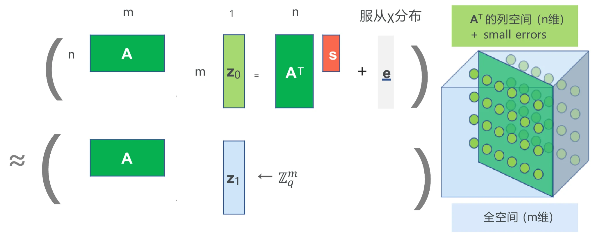
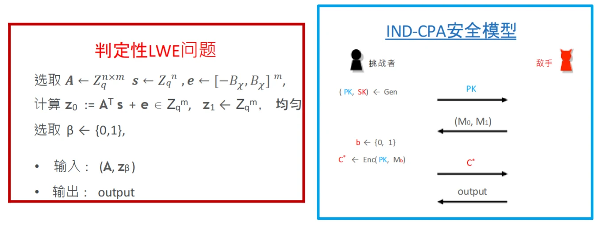

# Ch3 后量子密码

- [Back to Course Home](index.md)

## 格理论以及基于格困难问题的密码学

### 格理论简介
#### 格的定义

- **格**（Lattice）：格 $\mathcal{L}$ 是 $\mathbb{R}^m$ 空间中离散的具有加法运算的子群。
	- $\mathbb{R}^m$ 空间：由 $m$ 维实数向量组成的空间。
		- 向量的范式：$\| \mathbf{x}\| =\sqrt{\sum_{i=1}^{m} x_i^2}$
		- 向量的距离：$\mathrm{dist}(\mathbf{x},\mathbf{y})=\| \mathbf{x}-\mathbf{y}\|$
	- 离散（Discrete）：每一个格点 $\mathbf{x} \in \mathcal{L}$，存在 $\mathbb{R}^{m}$ 中的一个领域仅包含 $\mathbf{x}$ 唯一格点;
	- 加法：
		- $(0,\cdots, 0) \in \mathcal{L}$
		- $\forall \mathbf{x},\mathbf{y} \in \mathcal{L}, \mathbf{x}-\mathbf{y} \in \mathcal{L}$
- 示例：$\mathbb{Z}^{m}$、$(q\mathbb{Z})^{m}$ 是格，但 $\mathbb{Q}^{m}$，$2\mathbb{Z}+ 1$ 以及 $\mathbb{Z}+\mathbb{Z}\sqrt{2}$ 都不是格。
- **格基**：设 $\mathcal{L}$ 是 $\mathbb{R}^{m}$ 中的格，则存在 $\mathbb{R}$-线性无关的向量 $\mathbf{b}_{1}, \mathbf{b}_{2}, \cdots, \mathbf{b}_{n} \in \mathbb{R}^{m}$，使得

	$$
	\mathcal{L}=\left\{z_{1} \mathbf{b}_{1}+z_{2} \mathbf{b}_{2}+\cdots+z_{n} \mathbf{b}_{n} \mid z_{i} \in \mathbb{Z}\right\}
	$$

	- **维数**：$m$
	- **秩**：$n$
	- **满秩格**：当 $m=n$ 时称 $\mathcal{L}$ 是满秩格
	- **格基**：$B=(\mathbf{b}_{1}, \mathbf{b}_{2}, \cdots, \mathbf{b}_{m})$
	- **格点**：向量 $\mathbf{v}=z_{1} \mathbf{b}_{1}+z_{2} \mathbf{b}_{2}+\cdots+z_{n} \mathbf{b}_{n} \in \mathcal{L}$
- **性质**：两组基 $B=\{\mathbf{b}_{1}, \cdots, \mathbf{b}_{n}\}$ 与 $B'=\{\mathbf{b}_{1}', \cdots, \mathbf{b}_{n}'\}$ 生成同一个格当且仅当存在一个幺模矩阵 $U \in \mathbb{Z}^{n\times n}$ 使得 $B=B' U$。
	- 幺模矩阵：$U$ 是一个整数矩阵，且 $\det U=\pm 1$。
- **基本平行多面体**（Fundamental parallelepipeds）：设 $\mathcal{L}$ 为满秩格，则格 $\mathcal{L}$ 的基本平行多面体定义为

	$$
	\mathcal{F}(B):= \mathbb{R}^{m}/\mathcal{L} = \{ \sum _{i=1}^{m}x_{i}\mathbf{b}_{i} \mid x_{i}\in [0,1)\}
	$$

	- $\mathcal{F}(B)$ 的体积为

		$$
		\mathrm{vol}(\mathcal {F}(B))=|\det M(B)|,\quad M(B)=\begin{pmatrix}\mathbf{b}_{1} & \mathbf{b}_{2} & \cdots & \mathbf{b}_{m}\end{pmatrix}
		$$

- **定理**：
	1. 设 $\mathbf{b}_{1}, \mathbf{b}_{2}, \cdots, \mathbf{b}_{m} \in \mathcal{L}$ 且整线性无关，则 $B=\{\mathbf{b}_{1}, \mathbf{b}_{2}, \cdots, \mathbf{b}_{m}\}$ 为格基当且仅当

		$$
		\mathcal{F}(B) \cap \mathcal{L}=\{(0, \cdots, 0)\}
		$$

	2. 设 $B=\{\mathbf{b}_{1}, \mathbf{b}_{2}, \cdots, \mathbf{b}_{m}\}$ 和 $B'=\{\mathbf{b}_{1}', \mathbf{b}_{2}', \cdots, \mathbf{b}_{m}'\}$ 为两组格基，则

		$$
		\mathrm{vol}(\mathcal{F}(B))=\mathrm{vol}\left(\mathcal{F}\left(B'\right)\right)
		$$

	3. 设 $B=\{\mathbf{b}_{1}, \mathbf{b}_{2}, \cdots, \mathbf{b}_{m}\}$ 为格基，定义 $\mathcal{L}$ 的行列式为

		$$
		\det(\mathcal{L}):=\mathrm{Vol}(\mathcal{F}(B))=|\det(B)|
		$$

#### 格上定义的问题

- **格的最小距离**：设 $\mathcal{L}$ 是 $\mathbb{R}^{m}$ 中的格，则 $\mathcal{L}$ 的最小距离定义为

	$$
	\lambda_{1}(\mathcal{L})=\min\{\| \mathbf{v}\| : \mathbf{v} \in \mathcal{L} \setminus\{0\}\}=\min\{\| \mathbf{x}-\mathbf{y}\| : \mathbf{x} \neq \mathbf{y} \in \mathcal{L}\}
	$$

- **Minkowski’s first theorem**：设 $\mathcal{L}$ 为秩是 $m$ 的格，则

	$$
	\lambda_{1}(\mathcal{L}) \leq \sqrt{m}(\det \mathcal{L})^{1/m}
	$$

	- 示例：$\mathbf{b}_{1}=(0,2^{-100})$，$\mathbf{b}_{2}=(2^{100}, 0)$ 那么 $\lambda_{1}(\mathcal{L}(\mathbf{b}_{1}, \mathbf{b}_{2}))=2^{-100} \ll \sqrt{2}$。

- **最短向量问题** $(SVP)$：给定格 $\mathcal{L}$ 的任意格基 $B$，找到 $\mathbf{v} \in \mathcal{L}\setminus\{0\}$ 使得

	$$
	\| \mathbf{v}\| =\lambda_{1}(\mathcal{L})
	$$

- **最近向量问题** $(CVP)$：给定格 $\mathcal{L}$ 的任意格基 $B$，以及 $t \in \mathbb{R}^{m}$，找到 $\mathbf{v} \in \mathcal{L}$ 使得

	$$
	\forall \mathbf{y} \in \mathcal{L}, \| \mathbf{v}-\mathbf{t}\| \leq \| \mathbf{y}-\mathbf{t}\|
	$$

- **近似最短向量问题** $(SVP_{\gamma})$：给定格 $\mathcal{L}$ 的任意格基 $B$，找到 $\mathbf{v} \in \mathcal{L}\setminus\{0\}$ 使得

	$$
	\| \mathbf{v}\| ≤\gamma(m) \cdot \lambda_{1}(\mathcal{L})
	$$

- **近似最近向量问题** $(CVP_{\gamma})$：给定格 $\mathcal{L}$ 的任意格基 $B$，以及 $t \in \mathbb{R}^{m}$，找到 $\mathbf{v} \in \mathcal{L}$ 使得

	$$
	\forall \mathbf{y} \in \mathcal{L}, \| \mathbf{v}-\mathbf{t}\| \leq \gamma(m) \cdot\| \mathbf{y}-\mathbf{t}\|
	$$

- **判定性近似最短向量问题** $(GapSVP_{\gamma})$：假设 $\mathcal{L}$ 是满足 $\lambda_{1}(\mathcal{L})\leq1$ 或 $\lambda_{1}(\mathcal{L})>\gamma(n)$ 的格，给定格 $\mathcal{L}$ 的任意格基 $B$，判断 $\mathcal{L}$ 属于哪种情况。
- **近似最短独立向量问题** $(SIVP_{\gamma})$：给定格 $\mathcal{L}$ 的任意格基 $B$，找到 $n$ 个线性无关向量 $s_{i}\in \mathcal{L}$，使得

	$$
	\|s_{i}\|\leq\gamma(n)\cdot\lambda_{n}(\mathcal{L})
	$$

	其中 $\lambda_{n}(\mathcal{L})$ 表示 $\mathcal{L}$ 的第 $n$ 小距离。

- **有界距离解码问题** $(BDD_{\delta})$：给定格 $\mathcal{L}$ 的任意格基 $B$，以及 $\mathbf{t} \in \mathbb{R}^{m}$，满足 $\mathrm{dist}(\mathcal{L}, \mathbf{t}) \leq\delta<\frac{\lambda_{1}(\mathcal{L})}{2}$，找到唯一的格向量 $\mathbf{w} \in \mathcal{L}$，使得

	$$
	\| \mathbf{w}-\mathbf{t}\| _{2} \leq \delta
	$$

	- $BDD_{\delta} \subset CVP_{\delta}$
	- $BDD_{\delta}$ 的计算复杂度随着维度 $n$ 和参数 $\delta$ 的增大而增加。
- **定理**：$SVP_{\gamma(m)} \leq_{P} CVP_{\gamma(m)}$。

### LWE 问题（Learning with Errors）

- **参数**：LWE 参数 $(n,m,q,B_{\chi},\chi)$ 满足：
	1. $m \cdot B_{\chi} < q/4$
	2. $m \geq 2n \cdot \log q$
- **计算性 LWE 问题**（CLWE）：$n,m$ 为整数，$q$ 为素数，$\chi$ 为区间 $[-B_{\chi}, B_{\chi}]$ 上的概率分布。均匀选取 $\mathbf{A} \leftarrow \mathbb{Z}_{q}^{n\times m}$，$\mathbf{s} \leftarrow \mathbb{Z}_{q}^{n}$，根据 $\chi$ 分布选取 $\mathbf{e} \leftarrow[-B_{\chi}, B_{\chi}]^{m}$，计算 $\mathbf{z}:=\mathbf{A}^{\top} \mathbf{s}+\mathbf{e} \in \mathbb{Z}_{q}^{m}$。
	- **输入**：$(\mathbf{A}, \mathbf{z})$
	- **输出**：$\mathbf{s}$
	- **计算性 LWE 问题困难**：任意 PPT 敌手的优势是可忽略的，即

		$$
		\mathrm{Adv} = \left|\Pr(\mathrm{output}=\mathbf{s}) - \frac{1}{q^{n}}\right| = \mathrm{negl}(\lambda)
		$$

	- 直觉：定义格 $\mathcal{L}(\mathbf{A})=\{\mathbf{x} \in \mathbb{Z}^{m} \mid \mathbf{x}=\mathbf{A}^{T} \mathbf{s} \pmod q, \mathbf{s} \in \mathbb{Z}_{q}^{n}\}$，则 $\mathbf{z}$ 是 $\mathcal{L}(\mathbf{A})$ 中某个格点附近的一个点，$\mathbf{e}$ 是噪声。
		

- **判定性 LWE 问题**（DLWE）：$n,m$ 为整数，$q$ 为素数，$\chi$ 为区间 $[-B_{\chi}, B_{\chi}]$ 上的概率分布。均匀选取 $\mathbf{A} \leftarrow \mathbb{Z}_{q}^{n\times m}$，$\mathbf{s} \leftarrow \mathbb{Z}_{q}^{n}$，根据 $\chi$ 分布选取 $\mathbf{e} \leftarrow[-B_{\chi}, B_{\chi}]^{m}$，计算 $\mathbf{z}_{0}:=\mathbf{A}^{\top} \mathbf{s}+\mathbf{e} \in \mathbb{Z}_{q}^{m}$，$\mathbf{z}_{1} \leftarrow \mathbb{Z}_{q}^{m}$，均匀选取 $\beta \leftarrow\{0,1\}$。
	- **输入**：$(\mathbf{A}, \mathbf{z}_{\beta})$
	- **输出**：$\beta$
	- **判定性 LWE 问题困难**：任意 PPT 敌手的优势是可忽略的，即

		$$
		\mathrm{Adv} = \left|\Pr(\mathrm{output}=\beta) - \frac{1}{2}\right| = \mathrm{negl}(\lambda)
		$$

	- 
- **定理（Regev05）**：**DLWE 问题困难** $\iff$ **CLWE 问题困难**

	???+ info "Proof"

		- **充分性证明** $\implies$：假设存在 PPT 敌手 $\mathcal{A}$ 能够以不可忽略的优势攻破 CLWE 问题，构造 PPT 敌手 $\mathcal{B}$ 来攻破判定性 LWE 问题：
			- $\mathcal{B}$ 的输入：$(\mathbf{A}, \mathbf{z}_{\beta})$
			- 调用子敌手：将 $(\mathbf{A}, \mathbf{z}_{\beta})$ 作为输入传递给 $\mathcal{A}$
				- 当 $\beta=0$ 时，$\mathbf{z}_{0}=\mathbf{A}^{\top} \mathbf{s}+\mathbf{e}$ 满足 LWE 问题形式，$\mathcal{A}$ 以不可忽略的优势输出 $\mathbf{s}$。
				- 当 $\beta=1$ 时，$\mathbf{z}_{1}\leftarrow \mathbb{Z}_{q}^{m}$ 是均匀分布的。考虑若 $\mathcal{A}$ 仍可以输出有效的 $\mathbf{s}$，则 $\exists \mathbf{s}' \in \mathbb{Z}_{q}^{n}$ 使得 $\mathbf{z}_{1} - \mathbf{A}^{\top} \mathbf{s}' \in [-B_{\chi}, B_{\chi}]^{m}$，计算这个概率：

					$$
					\begin{aligned} P &= \frac{\#\{\mathbf{z}_{1} \in \mathbb{Z}_{q}^{m} \mid \mathbf{z}_{1} - \mathbf{A}^{\top} \mathbf{s}' \in [-B_{\chi}, B_{\chi}]^{m}\}}{\mathbb{Z}_{q}^{m}} \\ &\leq \frac{q^n\cdot (2B_{\chi}+1)^{m}}{q^{m}} < \frac{q^n\cdot (q/m)^{m}}{q^{m}} \\ &= \frac{q^n}{m^m} \leq \frac{2^{n \cdot \log q}}{2^{m\cdot \log m}} \\ &\leq \frac{2^{\frac{m}{2}}}{2^{m\cdot \log m}} = 2^{-\frac{m}{2}\cdot \log m} = \mathrm{negl}(\lambda) \end{aligned}
					$$

					因此 $\mathcal{A}$ 输出有效的 $\mathbf{s}$ 的概率是可忽略的。

			- $\mathcal{B}$ 的输出：假设 $\mathrm{output}_\mathcal{B} = \mathbf{s}'$

				$$
				\mathrm{output}_\mathcal{B} = \begin{cases} 0 & \mathcal{A} \text{ 输出有效的 } \mathbf{s} \\ 1 & \text{otherwise} \end{cases}
				$$

			- $\mathcal{B}$ 的优势

				$$
				\begin{aligned} \mathrm{Adv}_\mathcal{B} &= \left|\Pr(\mathrm{output}_\mathcal{B}=\beta) - \frac{1}{2}\right| \\ &= \frac{1}{2} \cdot \left|\Pr(\mathrm{output}_\mathcal{B}=0 \mid \beta=0) - \Pr(\mathrm{output}_\mathcal{B}=0 \mid \beta=1)\right| \\ &= \frac{1}{2} \cdot \left|\text{non-negl}(\lambda)-\mathrm{negl}(\lambda) \right| \\ &= \text{non-negl}(\lambda) \end{aligned}
				$$

			- 因此 $\mathcal{B}$ 以不可忽略的优势攻破判定性 LWE 问题，与假设矛盾。
		- **必要性证明** $\impliedby$：假设存在 PPT 敌手 $\mathcal{B}$ 能够以不可忽略的优势攻破 DLWE 问题，构造 PPT 敌手 $\mathcal{A}$ 来攻破计算性 LWE 问题。
			- $\mathcal{A}$ 的输入：$(\mathbf{A}, \mathbf{z})$，其中 $\mathbf{A} \leftarrow \mathbb{Z}_q^{n \times m}$，$\mathbf{z} =\mathbf{A}^\top \mathbf{s} + \mathbf{e} \in \mathbb{Z}_q^m$。
			- 考虑要求解的 $\mathbf{s} = (s_1, s_2, \ldots, s_n)^\top$，$\mathcal{A}$ 逐一求解每个分量 $s_i$：
				- 猜测分量 $s_i=k\in\{0,1,\ldots,q-1\}$，构造新的矩阵 $\mathbf{A}'$ 和向量 $\mathbf{z}'$：
					1. 均匀随机选取一个向量 $\mathbf{v} \leftarrow \mathbb{Z}_q^m$。
					2. 构造 $\mathbf{A}' = \mathbf{A} + \mathbf{e}_i \mathbf{v}^\top$，其中 $\mathbf{e}_i = \{0, \ldots, 0, 1, 0, \ldots, 0\}$ 是第 $i$ 个标准基向量。
					3. 构造 $\mathbf{z}' = \mathbf{z} + k \cdot \mathbf{v}$。
					4. 则有

						$$
						\begin{aligned} \mathbf{z}' - \mathbf{A}'^\top \mathbf{s} &= (\mathbf{z} + k \cdot \mathbf{v}) - (\mathbf{A} + \mathbf{e}_i \mathbf{v}^\top)^\top \mathbf{s} \\ &= \mathbf{z} + k \cdot \mathbf{v} - \mathbf{A}^\top \mathbf{s} - s_i\cdot \mathbf{v} \\ &= \mathbf{e} + (k - s_i) \cdot \mathbf{v} \end{aligned}
						$$

				- 将 $(\mathbf{A}', \mathbf{z}')$ 作为输入传递给 $\mathcal{B}$：
					- 若猜测正确，即 $k = s_i$，则 $\mathbf{z}' - \mathbf{A}'^\top \mathbf{s} = \mathbf{e}$ 满足 LWE 问题形式，$\mathcal{B}$ 以不可忽略的优势输出 $0$。
					- 若猜测错误，则 $\mathbf{z}'' = \mathbf{z}' - (k - s_i) \cdot \mathbf{v}$ 是 $\mathbb{Z}_q^m$ 上均匀分布的，$\mathcal{B}$ 以不可忽略的优势输出 $1$。
			- 因此，只要遍历 $s_i=k\in\{0,1,\ldots,q-1\}$，就可以以不可忽略的优势正确求解 $s_i$；再对所有 $i \in \{1,2,\ldots,n\}$ 重复上述过程，即可以不可忽略的优势求解 $\mathbf{s}$。
			- $\mathcal{A}$ 的复杂度：上述过程需要 $n \cdot q$ 次调用 $\mathcal{B}$，由 $q=\mathrm{poly}(n)$ 以及 $\mathcal{B}$ 的 PPT 性质可知 $\mathcal{A}$ 也是 PPT 算法。因此 $\mathcal{A}$ 以不可忽略的优势攻破计算性 LWE 问题，与假设矛盾。

- **LWE 问题的困难性**：LWE 问题可以归约到格中的困难问题，因此 LWE 被公认为是抗量子的。
	- 对于任意 $m=\mathrm{poly}(n)$，任意模数 $q \leq 2^{\mathrm{poly}(n)}$，以及任何（离散化的）参数为 $\alpha q \geq 2\sqrt{n}$ 的高斯误差分布 $\chi$，解决判定性 LWE 问题至少和量子地解决任意 $n$ 维格上的 $GapSVP_{\gamma}$ 和 $SIVP_{\gamma}$ 一样困难，其中 $\gamma = \tilde{O}(n/\alpha)$。

### Regev 公钥加密算法
#### Regev 公钥加密算法（加密 1 比特）

- **密钥生成算法** $(PK,SK)\leftarrow \mathrm{Gen}(1^{\lambda})$：
	1. 均匀选取 $\mathbf{A}\leftarrow\mathbb{Z}_{q}^{n\times m}$
	2. 均匀选取 $\mathbf{s}\leftarrow\mathbb{Z}_{q}^{n}$，$\mathbf{e}\leftarrow[-B_{\chi},B_{\chi}]^{m}$，计算 $\mathbf{h}:=\mathbf{A}^{\top}\mathbf{s}+\mathbf{e}\in\mathbb{Z}_{q}^{m}$
	3. 输出 $PK=(\mathbf{A},\mathbf{h})$，$SK=\mathbf{s}$
- **加密算法** $C\leftarrow \mathrm{Enc}(PK,M)$：消息空间为 $\mathbb{M}=\{0,1\}$
	1. 均匀选取 $\mathbf{r}\leftarrow\{0,1\}^{m}$
	2. 计算 $\mathbf{c}_{1}:=\mathbf{A}\cdot \mathbf{r}\in\mathbb{Z}_{q}^{n}$
	3. 计算 $c_{2}:=\mathbf{r}^{\top}\mathbf{h}+M\cdot\lfloor q/2\rceil\in\mathbb{Z}_{q}$
	4. 输出 $C:=(\mathbf{c}_{1},c_{2})$
- **解密算法** $M'\leftarrow \mathrm{Dec}(SK,C=(\mathbf{c}_{1},c_{2}))$:
	1. 计算 $d:=c_{2}-\mathbf{c}_{1}^{\top}\mathbf{s}\in\mathbb{Z}_{q}$
	2. 如果 $d\approx0$，输出 $M':=0$；如果 $d\approx\lfloor q/2\rceil$，输出 $M':=1$
- **正确性分析**：对于 $\forall PK=(\mathbf{A},\mathbf{h})=(\mathbf{A},\mathbf{A}^{\top}\mathbf{s}+\mathbf{e})$，其中 $\mathbf{e}\leftarrow[-B_{\chi},B_{\chi}]^{m}$；$\forall C=(\mathbf{c}_{1},c_{2})=(\mathbf{A}\mathbf{r},\mathbf{r}^{\top}\mathbf{h}+M\cdot\lfloor q/2\rceil)$，其中 $\mathbf{r}\leftarrow\{0,1\}^{m}$：
	- 解密时，有

		$$
		\begin{aligned} d &=\mathbf{c}_{2}-\mathbf{c}_{1}^{\top}\mathbf{s} \\ &=\mathbf{r}^{\top}\mathbf{h}+M\cdot\lfloor q/2\rceil-(\mathbf{A}\mathbf{r})^{\top}\mathbf{s} \\&=\mathbf{r}^{\top}(\mathbf{A}^{\top}\mathbf{s}+\mathbf{e})+M\cdot\lfloor q/2\rceil-(\mathbf{A}\mathbf{r})^{\top}\mathbf{s} \\ &=\mathbf{r}^{\top}\mathbf{e}+M\cdot\lfloor q/2\rceil \end{aligned}
		$$

	- 由于 $\mathbf{e}\leftarrow[-B_{\chi},B_{\chi}]^{m}$，$\mathbf{r}\leftarrow\{0,1\}^{m}$，因此 $\mathbf{r}^{\top}\mathbf{e}\in[-mB_{\chi},mB_{\chi}]\subseteq(-q/4,q/4)$
		- 如果 $M=0$，则 $d=\mathbf{r}^{\top}\mathbf{e}\in(-q/4,q/4)=[0,q/4)\cup(3q/4,q-1]$
		- 如果 $M=1$，则 $d=\mathbf{r}^{\top}\mathbf{e}+\lfloor q/2\rceil\in(-q/4,q/4)+\lfloor q/2\rceil=(q/4,3q/4)$
	- 综上：
		- 当 $M=0$ 时，$d\approx0$，则 $M'=0$
		- 当 $M=1$ 时，$d\approx\lfloor q/2\rceil$，则 $M'=1$

#### Regev 公钥加密算法（加密 $\ell$ 比特）

- 设计思想：
	1. Regev 算法（加密 1 比特）
	2. 并行 $\ell$ 次（共用 $A$ 和 $r$）
- **密钥生成算法** $(PK,SK)\leftarrow \mathrm{Gen}(1^{\lambda})$：
	1. 均匀选取 $\mathbf{A}\leftarrow\mathbb{Z}_{q}^{n\times m}$
	2. 均匀选取 $\mathbf{S}\leftarrow\mathbb{Z}_{q}^{n\times\ell}$，$\mathbf{E}\leftarrow[-B_{\chi},B_{\chi}]^{m\times\ell}$，计算 $\mathbf{H}:=\mathbf{A}^{T}\mathbf{S}+\mathbf{E}\in\mathbb{Z}_{q}^{m\times\ell}$
	3. 输出 $PK=(\mathbf{A},\mathbf{H})$，$SK=\mathbf{S}$
- **加密算法** $C\leftarrow \mathrm{Enc}(PK, \mathbf{M}=(M_{1},\cdots,M_{\ell}))$：消息空间为 $\mathbb{M}=\{0,1\}^{\ell}$
	1. 均匀选取 $\mathbf{r}\leftarrow\{0,1\}^{m}$
	2. 计算 $\mathbf{c}_{1}:=\mathbf{A}\cdot \mathbf{r}\in\mathbb{Z}_{q}^{n}$
	3. 计算 $\mathbf{c}_{2}:=\mathbf{r}^{\top}\mathbf{H}+(M_{1}\cdot\lfloor q/2\rceil,\cdots,M_{\ell}\cdot\lfloor q/2\rceil)\in\mathbb{Z}_{q}^{1\times\ell}$（简记为 $M\cdot\lfloor q/2\rceil$）
	4. 输出 $C:=(\mathbf{c}_{1},\mathbf{c}_{2})$
- **解密算法** $M'\leftarrow \mathrm{Dec}(SK,C=(\mathbf{c}_{1},\mathbf{c}_{2}))$：
	1. 计算 $\mathbf{d}:=\mathbf{c}_{2}-\mathbf{c}_{1}^{\top}\mathbf{S}\in\mathbb{Z}_{q}^{1\times\ell}$；将 $\mathbf{d}$ 按分量展开为 $(d_{1},\cdots,d_{\ell})$
	2. $\forall i\in\{1,\cdots,\ell\}$：如果 $d_{i}\approx0$，$M_{i}':=0$；如果 $d_{i}\approx\left\lfloor\frac{q}{2}\right\rceil$，$M_{i}':=1$
	3. 输出 $\mathbf{M}':=(M_{1}',\cdots,M_{\ell}')$

#### 1 比特 Regev 算法的 IND-CPA 安全性

- **定理**：**判定性 LWE 问题困难** $\implies$ **1 比特 Regev 算法是 IND-CPA 安全的**
	- **思路**：正向证明，给定任意 PPT 敌手 $\mathcal{A}$，证明其攻破 IND-CPA 安全性的优势是可忽略的

		$$
		\mathrm{Adv}_{\mathcal{A}}=\left|\Pr(\mathrm{output}=b)-\frac{1}{2}\right|=\mathrm{negl}(\lambda)
		$$

	???+ info "Proof"

		- **证明**：采用混合论证（Hybrid Arguments）与三角不等式。
			

			- **定义混合游戏**：
				- **Game 0**：IND-CPA 安全模型
					1. $\mathrm{Gen}: \mathbf{A}\leftarrow\mathbb{Z}_{q}^{n\times m}$，$\mathbf{s}\leftarrow\mathbb{Z}_{q}^{n}$，$\mathbf{e}\leftarrow[-B_{\chi},B_{\chi}]^{m}$，$\mathbf{h}:=\mathbf{A}^\top \mathbf{s}+\mathbf{e}$，输出 $PK=(\mathbf{A},\mathbf{h})$
					3. $\mathrm{Enc}(PK,M_b): \mathbf{r}\leftarrow\{0,1\}^m$，$\mathbf{c}_1:=\mathbf{A}\mathbf{r}$，$c_2:=\mathbf{r}^\top\mathbf{h}+M_b\cdot\lfloor q/2\rceil$，输出 $C^*=(\mathbf{c}_1,c_2)$
				- **Game 1**：$PK$ 中的 $h\leftarrow\mathbb{Z}_{q}^{m}$
					1. $\mathrm{Gen}': \mathbf{A}\leftarrow\mathbb{Z}_{q}^{n\times m}$，$\mathbf{h}\leftarrow\mathbb{Z}_{q}^{m}$，输出 $PK=(\mathbf{A},\mathbf{h})\leftarrow\mathbb{Z}_{q}^{n\times m}\times\mathbb{Z}_{q}^{m}$
					2. 其余算法与 Game 0 一致
				- **Game 2**：$C^*\leftarrow\mathbb{Z}_{q}^{n}\times\mathbb{Z}_{q}$
					1. $\mathrm{Enc}'(PK,M_b): \mathbf{c}_1\leftarrow\mathbb{Z}_{q}^{n}$，$c_2\leftarrow\mathbb{Z}_{q}$，$C^*=(\mathbf{c}_1,c_2)\leftarrow\mathbb{Z}_{q}^{n}\times\mathbb{Z}_{q}$
					2. 其余算法与 Game 1 一致
			- **混合游戏性质**：
				1. Game 0 与 Game 1 的区别只在于 $PK$ 中的 $\mathbf{h}$ 的生成：
					- Game 0 中 $\mathbf{h}=\mathbf{A}^{\top}\mathbf{s}+\mathbf{e}$
					- Game 1 中 $\mathbf{h}\leftarrow\mathbb{Z}_{q}^{m}$
				2. 由 **引理 1**：$(\mathbf{A},\mathbf{A}^{\top}\mathbf{s}+\mathbf{e})$ 与 $(\mathbf{A},\mathbf{u}\leftarrow\mathbb{Z}_{q}^{m})$ 不可区分，即 Game 0 与 Game 1 不可区分，即

					$$
					|\Pr(\mathrm{output}=b\mid \text{Game 0}) - \Pr(\mathrm{output}=b\mid \text{Game 1})| = \mathrm{negl}(\lambda)
					$$

				2. Game 1 与 Game 2 的区别只在于密文 $C^{*}=(\mathbf{c}_{1},c_{2})$ 的生成：
					- Game 1 中 $(\mathbf{c}_{1},c_{2})=(\mathbf{A}\mathbf{r},\mathbf{r}^{\top}\mathbf{h}+M_b\cdot\lfloor q/2\rceil)$
					- Game 2 中 $(\mathbf{c}_1,c_2)\leftarrow\mathbb{Z}_{q}^{n}\times\mathbb{Z}_{q}$
				3. 由 **引理 2（剩余哈希引理）推论**：$\begin{pmatrix}\begin{pmatrix}\mathbf{A} \\ \mathbf{h}^\top \end{pmatrix},\begin{pmatrix}\mathbf{Ar} \\ \mathbf{h}^\top\mathbf{r} \end{pmatrix} \end{pmatrix}$ 与 $\begin{pmatrix}\begin{pmatrix}\mathbf{A} \\ \mathbf{h}^\top \end{pmatrix},\begin{pmatrix}\mathbf{u}_1 \\ \mathbf{u}_2 \end{pmatrix} \end{pmatrix}$ 不可区分，即 Game 1 与 Game 2 不可区分，即

					$$
					|\Pr(\mathrm{output}=b\mid \text{Game 1}) - \Pr(\mathrm{output}=b\mid \text{Game 2})| = \mathrm{negl}(\lambda)
					$$

				4. Game 2 中，$C^{*}=(\mathbf{c}_{1},c_{2})$ 中已经不含 $b$ 的信息，因此

					$$
					\Pr(\mathrm{output}=b\mid \text{Game 2})=\frac{1}{2}
					$$

			- **由三角不等式**：

				$$
				\begin{aligned} \mathrm{Adv}_{A} =& \left| \Pr(\mathrm{output}=b\mid \text{Game 0}) - \frac{1}{2} \right| \\ \leq& \left| \Pr(\mathrm{output}=b\mid \text{Game 0}) - \Pr(\mathrm{output}=b\mid \text{Game 1}) \right|+ \\ & \left| \Pr(\mathrm{output}=b\mid \text{Game 1}) - \Pr(\mathrm{output}=b\mid \text{Game 2}) \right|+ \\ & \left| \Pr(\mathrm{output}=b\mid \text{Game 2}) - \frac{1}{2} \right| \\ =& \mathrm{negl}(\lambda) + \mathrm{negl}(\lambda) + 0 \\ =& \mathrm{negl}(\lambda) \end{aligned}
				$$

			- 因此 $\mathrm{Adv}_{A}=\mathrm{negl}(\lambda)$，得证 IND-CPA 安全性。

- **引理 1**：**判定性 LWE 问题困难** $\implies$ Game 0 与 Game 1 不可区分，即

	$$
	|\Pr(\mathrm{output}=b\mid \text{Game 0}) - \Pr(\mathrm{output}=b\mid \text{Game 1})| = \mathrm{negl}(\lambda)
	$$

	- 证明思路：采用反证法（安全性归约），由区分 Game 0 与 Game 1 的敌手 $\mathcal{A}$ 来构造解决判定性 LWE 问题的敌手 $\mathcal{B}$。
- **引理 2**：
	- **剩余哈希引理**（Leftover Hash Lemma）: 当 $q$ 为素数且 $m\geq n\log q+2\log(1/\epsilon)$ 时，任意敌手区分下面两个分布的优势为可忽略的

		$$
		(\mathbf{H},\mathbf{Hr})\approx_s(\mathbf{H},\mathbf{u})
		$$

		其中 $\mathbf{H}\leftarrow\mathbb{Z}_{q}^{n\times m}$，$\mathbf{r}\leftarrow\{0,1\}^{m}$，$\mathbf{u}\leftarrow\mathbb{Z}_{q}^{n}$。

	- **推论**：当 $q$ 为素数且 $m\geq2n\cdot\log q$ 时，任意敌手区分下面两个分布的优势为可忽略的

		$$
		\begin{pmatrix}\begin{pmatrix}\mathbf{A} \\ \mathbf{h}^\top \end{pmatrix},\begin{pmatrix}\mathbf{Ar} \\ \mathbf{h}^\top\mathbf{r} \end{pmatrix} \end{pmatrix} \approx_s \begin{pmatrix}\begin{pmatrix}\mathbf{A} \\ \mathbf{h}^\top \end{pmatrix},\begin{pmatrix}\mathbf{u}_1 \\ \mathbf{u}_2 \end{pmatrix} \end{pmatrix}
		$$

		其中 $\mathbf{A}\leftarrow\mathbb{Z}_{q}^{n\times m}$，$\mathbf{h}\leftarrow\mathbb{Z}_{q}^{m}$，$\mathbf{r}\leftarrow\{0,1\}^{m}$，$\mathbf{u}_{1}\leftarrow\mathbb{Z}_{q}^{n}$，$\mathbf{u}_{2}\leftarrow\mathbb{Z}_{q}$。

#### $\ell$ 比特 Regev 算法的 IND-CPA 安全性

- **定理**：**判定性 LWE 问题困难** $\implies$ **$\ell$ 比特 Regev 算法是 IND-CPA 安全的**
	- 思路：采用混合论证，结合剩余哈希引理与 LWE 假设。
		- 混合论证：
			- **Game 0**（IND-CPA 安全模型）中：$\mathbf{H}=\mathbf{A}^{\top}\mathbf{S}+\mathbf{E}$，$\mathbf{c}_1=\mathbf{A}\mathbf{r}$，$\mathbf{c}_2=\mathbf{r}^{\top}\mathbf{H}+\mathbf{M}\cdot\lfloor q/2\rceil$
			- **Game 1** 中：$\mathbf{H}\leftarrow\mathbb{Z}_{q}^{m\times\ell}$
			- **Game 2** 中：$\mathbf{c}_{1}\leftarrow\mathbb{Z}_{q}^{n}$，$\mathbf{c}_{2}\leftarrow\mathbb{Z}_{q}^{1\times\ell}$
		- 通过 LWE 假设（每次换 $H$ 的第 $i$ 列，共混合论证 $\ell$ 次）证明 Game 0 与 Game 1 不可区分。
		- 通过剩余哈希引理证明 Game 1 与 Game 2 不可区分，最终得证 IND-CPA 安全性。

### SIS 困难问题与 GPV 签名算法
#### SIS 问题（Short Integer Solution）

- **SIS 问题**：$n,m$ 为整数，$q$ 为素数，$B_{s}$ 为整数。均匀选取 $\mathbf{A} \leftarrow\mathbb{Z}_{q}^{n\times m}$。
	- **输入**：$\mathbf{A}$
	- **输出**：$\mathbf{x}\in\mathbb{Z}_{q}^{m}$ 满足
		1. $\mathbf{Ax}=\mathbf{0}\in\mathbb{Z}_{q}^{n}$
		2. $\mathbf{x}\neq\mathbf{0}$
		3. $\mathbf{x}\in[-B_{s},B_{s}]^{m}$（Short）
	- **SIS 问题困难**：任意 PPT 敌手的优势是可忽略的，即

		$$
		\Pr(\text{find such } \mathbf{x}) = \mathrm{negl}(\lambda)
		$$

	- 观察:
		1. 如果没有对于 $\mathbf{x}$ 的限制，使用高斯消元法很容易求解 $\mathbf{x}$。
		2. 对于 SIS 问题，$m$ 越大越容易，$n$ 越大越困难。
	- 直觉：定义正交格 $\Lambda^\bot(\mathbf{A}) =\{\mathbf{x}\in\mathbb{Z}^{m} \mid \mathbf{Ax}\equiv\mathbf{0}\pmod q\}$，SIS 问题要求找到 $\mathcal{L}(\mathbf{A})$ 中一个非零的短向量。
		

- **定理**：如果 $m\cdot B_{\chi}\cdot B_{s}<q/4$，则 **判定性 LWE 问题 $(n,m,q,\chi)$ 困难** $\implies$ **SIS 问题 $(n,m,q,B_{s})$ 困难**

	???+ info "Proof"

		- **证明**：由解决 SIS 问题的敌手 $\mathcal{A}$ 来构造解决判定性 LWE 问题的敌手 $\mathcal{B}$。
			- 若存在 PPT 敌手 $\mathcal{A}$ 能够以不可忽略的优势解决 SIS 问题 $(n,m,q,B_{s})$，则输入 $\mathbf{A}$，$\mathcal{A}$ 以不可忽略的优势输出 $\mathbf{x}\in[-B_{s},B_{s}]^{m}$ 满足 $\mathbf{Ax}=\mathbf{0}\in\mathbb{Z}_{q}^{n}$。
			- 此时考虑 $\mathbf{z}_\beta^\top \cdot \mathbf{x}$：
				- 当 $\beta=0$ 时，$\mathbf{z}_{0}=\mathbf{A}^{\top}\mathbf{s}+\mathbf{e}$，因此

					$$
					\begin{aligned} \mathbf{z}_{0}^{\top}\cdot \mathbf{x}&=\mathbf{s}^{\top}\mathbf{A}\mathbf{x}+\mathbf{e}^{\top}\mathbf{x}=\mathbf{e}^{\top}\mathbf{x}=\sum_{i=1}^{m} e_i x_i \\ &\in[-mB_{\chi}B_{s},mB_{\chi}B_{s}] \subseteq(-q/4,q/4) \end{aligned}
					$$

				- 当 $\beta=1$ 时，$\mathbf{z}_{1}\leftarrow\mathbb{Z}_{q}^{m}$，因此 $\mathbf{z}_{1}^{\top}\cdot \mathbf{x}$ 在 $\mathbb{Z}_{q}$ 上均匀分布，则 $\mathbf{z}_{1}^{\top}\cdot \mathbf{x} \in(-q/4,q/4)$ 的概率为 $1/2$。
			- $\mathcal{B}$ 的输出：

				$$
				\mathrm{output}_\mathcal{B} = \begin{cases} 0 & \mathbf{z}^\top\cdot \mathbf{x} \in(0,\frac{q}{4})\cup(\frac{3q}{4},q) \\ 1 & \text{otherwise} \end{cases}
				$$

			- $\mathcal{B}$ 的优势

				$$
				\begin{aligned} \mathrm{Adv}_\mathcal{B} &= \left|\Pr(\mathrm{output}_\mathcal{B}=\beta) - \frac{1}{2}\right| \\ &= \frac{1}{2} \cdot \left|\Pr(\mathrm{output}_\mathcal{B}=0 \mid \beta=0) - \Pr(\mathrm{output}_\mathcal{B}=0 \mid \beta=1)\right| \\ &= \frac{1}{2} \cdot \left|\left(\mathrm{Adv}_\mathcal{A} + \frac{1}{2}(1 - \mathrm{Adv}_\mathcal{A}) \right) - \frac{1}{2} \right| \\ &= \frac{1}{4} \cdot \mathrm{Adv}_\mathcal{A} = \text{non-negl}(\lambda) \end{aligned}
				$$

			- 因此 $\mathcal{B}$ 以不可忽略的优势攻破判定性 LWE 问题，与假设矛盾。

#### 原像可采样函数 PSF（Preimage Sampleable Function）

- PSF 参数：$(n,m,q,B)$
- **矩阵 A 的带陷门采样算法**：$(\mathbf{A},td)\leftarrow \mathrm{SampleA}(1^{\lambda})$
	- 矩阵 $\mathbf{A}$ 在 $\mathbb{Z}_{q}^{n\times m}$ 上均匀分布，$td$ 为陷门信息（trapdoor）
	- 定义函数

		$$
		\begin{aligned} f_{A}:\mathbb{Z}_{q}^{m}&\to\mathbb{Z}_{q}^{n} \\ \mathbf{x} &\mapsto \mathbf{Ax} \end{aligned}
		$$

		则给出 $x$ 计算 $f_{A}(x)$ 是高效的；给出 $y$ 和陷门信息 $td$ 计算 $x$ 满足 $f_{A}(x)=y$ 是高效的；但给出 $y$ 没有陷门信息 $td$ 计算 $x$ 满足 $f_{A}(x)=y$ 是困难的。

- **正向采样算法**：$(\mathbf{x}\in\mathbb{Z}_{q}^{m},\mathbf{y}\in\mathbb{Z}_{q}^{n})\leftarrow \mathrm{SampleTuple}(\mathbf{A})$
	- 向量 $\mathbf{x}$ 满足 $\mathbf{x}\in[-B,B]^{m}$
	- 向量 $\mathbf{y}$ 满足 $\mathbf{y}=\mathbf{A}\mathbf{x}$ 且在 $\mathbb{Z}_{q}^{n}$ 上均匀分布
- **原像采样算法**：$\mathbf{x}\in\mathbb{Z}_{q}^{m}\leftarrow \mathrm{SamplePre}(td,\mathbf{A},\mathbf{y}\in\mathbb{Z}_{q}^{n})$:
	- 向量 $\mathbf{x}$ 满足 $\mathbf{x}\in[-B,B]^{m}$ 且 $\mathbf{Ax}=\mathbf{y}$
- **关键性质**（GPV08）：下面两种 $(\mathbf{x}\in\mathbb{Z}_{q}^{m},\mathbf{y}\in\mathbb{Z}_{q}^{n})$ 的分布一样:
	- $(\mathbf{x}\in\mathbb{Z}_{q}^{m},\mathbf{y}\in\mathbb{Z}_{q}^{n})\leftarrow \mathrm{SampleTuple}(\mathbf{A})$
	- 先均匀选取 $\mathbf{y}\leftarrow\mathbb{Z}_{q}^{n}$，再调用 $\mathbf{x}\leftarrow \mathrm{SamplePre}(td,\mathbf{A},\mathbf{y})$

#### MP12 陷门生成算法
##### 目标

- 给定 $\mathbf{A} \leftarrow \mathbb{Z}_q^{n \times m}$，求解 $\mathbf{T}_A \in \mathbb{Z}^{m \times m}$ 满足：
	1. $\mathbf{A} \cdot \mathbf{T}_A \equiv \mathbf{0} \pmod q$
	2. $\mathbf{T}_A \in [-B_s, B_s]^{m \times m}$
	3. $\mathbf{T}_A$ 满秩
- 寻找陷门 $\mathbf{T}_A$ 本质上就是为正交格 $\Lambda^\bot(\mathbf{A}) =\{\mathbf{x}\in\mathbb{Z}^{m} \mid \mathbf{Ax}\equiv\mathbf{0}\pmod q\}$ 寻找一组短基（Short Basis）
- 如果得到了陷门，那么 SIS 问题、LWE 问题都不再困难！

##### 构造 Gadget 矩阵 $G$ 及其陷门 $T_G$

- **思路**：由于直接为一个随机矩阵 $A$ 寻找陷门困难的，因此人为构造一个结构极度规律的特殊矩阵 $G$，它的陷门可以直接写出。
- **构造方法**：
	1. 二进制拆分
		- 定义二进制位宽 $k = \lceil \log q \rceil$，则 $2^{k-1} < q \leq 2^k$
		- 对于任意整数 $x \in \mathbb{Z}_q$，它可以被唯一拆分为二进制表示 $x = x_0 + 2\cdot x_1 + \dots + 2^{k-1}\cdot x_{k-1} \quad (x_i \in \{0, 1\})$，定义提取函数：$x \mapsto \langle x \rangle _{BE} = (x_0, x_1, \dots, x_{k-1})^\top$
	2. 定义 $\mathbf{g} = (1, 2, 2^2, \dots, 2^{k-1})_{1 \times k}$，则有 $x = \mathbf{g} \cdot \langle x \rangle _{BE}$
	3. 通过张量积将 $\mathbf{g}$ 扩展为 $n \times nk$ 维的对角块矩阵：

		$$
		\mathbf{G} := \mathbf{I}_n \otimes \mathbf{g} = \begin{pmatrix} \mathbf{g} & \mathbf{0} & \dots & \mathbf{0} \\ \mathbf{0} & \mathbf{g} & \dots & \mathbf{0} \\ \vdots & \vdots & \ddots & \vdots \\ \mathbf{0} & \mathbf{0} & \dots & \mathbf{g} \end{pmatrix}_{n \times nk}
		$$

	4. 构造针对 $\mathbf{g}$ 的一维陷门 $\mathbf{T}_g$：

		$$
		\mathbf{T}_g = \begin{pmatrix} 2 & 0 & 0 & \dots & 0 \\ -1 & 2 & 0 & \dots & 0 \\ 0 & -1 & 2 & \dots & 0 \\ \vdots & \vdots & \vdots & \ddots & \vdots \\ 0 & 0 & 0 & \dots & 2 \\ \end{pmatrix}_{k \times k}
		$$

		易证 $\mathbf{g} \cdot \mathbf{T}_g = \mathbf{0} \pmod q$

	5. 扩展到全维，得到针对 $\mathbf{G}$ 的陷门 $\mathbf{T}_G$：

		$$
		\mathbf{T}_G := \mathbf{I}_n \otimes \mathbf{T}_g = \begin{pmatrix} \mathbf{T}_g & & \\ & \ddots & \\ & & \mathbf{T}_g \end{pmatrix}_{nk \times nk}
		$$

		- $\mathbf{G} \cdot \mathbf{T}_G = \mathbf{0} \pmod q$ 显然成立
		- $\mathbf{T}_G$ 内部元素仅包含 $2, -1, 0$，满足短矩阵要求
		- $\mathbf{T}_G$ 是下三角矩阵，主对角线不为 0，满秩。

##### 定义逆向操作函数 $\mathbf{G}^{-1}(\cdot)$

- 定义：给定任意目标向量 $\mathbf{y} \in \mathbb{Z}_q^n$，求解 $\mathbf{x} \in \{0, 1\}^{nk}$ 使得 $\mathbf{G} \cdot \mathbf{x} = \mathbf{y} \pmod q$，即

	$$
	\mathbf{x} = \mathbf{G}^{-1}(\mathbf{y})
	$$

	- 实际上解决了一个特定于 $\mathbf{G}$ 的 SIS 问题。
- **计算方法**：将向量 $\mathbf{y} = (y_1, y_2, \dots, y_n)^\top$ 的每一个元素分别进行二进制拆分，得到 $\langle y_i \rangle _{BE~n\times 1}$，然后将它们竖着拼接起来：

	$$
	\mathbf{x} := \mathbf{G}^{-1}(\mathbf{y}) = \begin{pmatrix} \langle y_1 \rangle _{BE} \\ \langle y_2 \rangle _{BE} \\ \vdots \\ \langle y_n \rangle _{BE} \end{pmatrix}_{nk \times 1} \in \{0, 1\}^{nk}
	$$

- **正确性验证**：因为 $\mathbf{G} = I_n \otimes \mathbf{g}$，并且根据前面的定义有 $\mathbf{g} \cdot \langle y_i \rangle _{BE} = y_i$，所以：

	$$
	\mathbf{G} \cdot \mathbf{x} = \begin{pmatrix} \mathbf{g} & \mathbf{0} & \dots & \mathbf{0} \\ \mathbf{0} & \mathbf{g} & \dots & \mathbf{0} \\ \vdots & \vdots & \ddots & \vdots \\ \mathbf{0} & \mathbf{0} & \dots & \mathbf{g} \end{pmatrix} \cdot \begin{pmatrix} \langle y_1 \rangle _{BE} \\ \langle y_2 \rangle _{BE} \\ \vdots \\ \langle y_n \rangle _{BE} \end{pmatrix} = \begin{pmatrix} \mathbf{g} \cdot \langle y_1 \rangle _{BE} \\ \mathbf{g} \cdot \langle y_2 \rangle _{BE} \\ \vdots \\ \mathbf{g} \cdot \langle y_n \rangle _{BE} \end{pmatrix} = \begin{pmatrix} y_1 \\ y_2 \\ \vdots \\ y_n \end{pmatrix} = \mathbf{y}
	$$

##### 生成随机公钥及其陷门

1. **密钥生成**：
	- 掩码矩阵：$\mathbf{B} \leftarrow \mathbb{Z}_q^{n \times m^*}$
	- **生成私钥**：$\mathbf{R} \leftarrow \{0, 1\}^{m^* \times nk}$
	- **构造公钥**：$\mathbf{A} := \begin{pmatrix} \mathbf{B} & \mathbf{BR} + \mathbf{G} \end{pmatrix}_{n \times (m^* + nk)}$
		- 基于剩余哈希引理：由于 $\mathbf{R}$ 是未知的短矩阵，$\mathbf{B}$ 是随机的，因此 $\mathbf{BR}$ 看起来也是完全随机的；$\mathbf{BR}+\mathbf{G}$ 完美地掩盖了 $\mathbf{G}$ 的痕迹。在外界看来，$\mathbf{A}$ 只是一个普通的随机矩阵。
2. **利用私钥提取 $G$**：拥有私钥 $\mathbf{R}$ 的人，可以通过右乘一个特殊矩阵提取出 $\mathbf{G}$：

	$$
	\mathbf{A} \cdot \begin{pmatrix} -\mathbf{R} \\ \mathbf{I} \end{pmatrix} = \begin{pmatrix} \mathbf{B} \quad \mathbf{BR}+\mathbf{G} \end{pmatrix} \cdot \begin{pmatrix} -\mathbf{R} \\ \mathbf{I} \end{pmatrix} = -\mathbf{BR} + (\mathbf{BR}+\mathbf{G}) = \mathbf{G}
	$$

3. **构造随机公钥陷门 $\mathbf{T}_A$**：利用私钥 $\mathbf{R}$、公开的工具陷门 $\mathbf{T}_G$、以及操作函数 $\mathbf{G}^{-1}$，构造如下的分块矩阵 $\mathbf{T}_A$：

	$$
	\mathbf{T}_A := \begin{pmatrix} \mathbf{I} & -\mathbf{R} \\ \mathbf{0} & \mathbf{I} \end{pmatrix}\cdot \begin{pmatrix} \mathbf{I} & \mathbf{0} \\ -\mathbf{G}^{-1}(\mathbf{B}) & \mathbf{T}_G \end{pmatrix} = \begin{pmatrix} \mathbf{I} + \mathbf{R} \cdot \mathbf{G}^{-1}(\mathbf{B}) & -\mathbf{R} \cdot \mathbf{T}_G \\ -\mathbf{G}^{-1}(\mathbf{B}) & \mathbf{T}_G \end{pmatrix}
	$$

	- 满足 $\mathbf{A} \cdot \mathbf{T}_A = \mathbf{0}$：

		$$
		\begin{aligned} \mathbf{A} \cdot \mathbf{T}_A &= \begin{pmatrix} \mathbf{B} & \mathbf{BR}+\mathbf{G} \end{pmatrix} \cdot \begin{pmatrix} \mathbf{I} + \mathbf{R} \mathbf{G}^{-1}(\mathbf{B}) & -\mathbf{R} \mathbf{T}_G \\ -\mathbf{G}^{-1}(\mathbf{B}) & \mathbf{T}_G \end{pmatrix} \\ &= \begin{pmatrix} \mathbf{B}-\mathbf{G}\mathbf{G}^{-1}(\mathbf{B}) & \mathbf{G}\mathbf{T}_G \end{pmatrix} \\ &= \begin{pmatrix} \mathbf{0} & \mathbf{0} \end{pmatrix} \\ &= \mathbf{0} \end{aligned}
		$$

	- $\mathbf{T}_A$ 的四个分块：单位阵 $\mathbf{I}$、私钥 $\mathbf{R} \in \{0,1\}^{m^* \times nk}$、拆分矩阵 $\mathbf{G}^{-1}(\mathbf{B}) \in \{0,1\}^{nk \times n}$、工具陷门 $\mathbf{T}_G \in \{-1,0,2\}^{nk \times nk}$。由于所有基础构件都是极小的数字，它们相乘相加后依然是多项式级别的小数字。
	- 由于 $\mathbf{T}_A$ 可以分解为两个分块满秩三角阵的乘积，因此 $\mathbf{T}_A$ 本身也是满秩的。

#### GPV 数字签名算法（Gentry-Peikert-Vaikuntanathan）

- 组件：
	1. PSF：参数 $(n,m,q,B)$
	2. Hash Function $\mathrm{H}:\{0,1\}^{*}\to\mathbb{Z}_{q}^{n}$
- **密钥生成算法** $(PK,SK)\leftarrow \mathrm{Gen}(1^{\lambda})$：
	1. 调用 $(\mathbf{A},td)\leftarrow \mathrm{SampleA}(1^{\lambda})$，其中 $\mathbf{A}$ 在 $\mathbb{Z}_{q}^{n\times m}$ 上均匀分布
	2. 输出 $PK=\mathbf{A}$，$SK=td$
- **签名算法** $\sigma\leftarrow \mathrm{Sign}(SK,M)$：消息空间为 $\mathbb{M}=\{0,1\}^{*}$
	1. 计算 $\mathrm{H}(M)\in\mathbb{Z}_{q}^{n}$
	2. 调用并输出 $\sigma\in\mathbb{Z}_{q}^{m}\leftarrow \mathrm{SamplePre}(td,\mathbf{A},\mathrm{H}(M))$
- **验证算法** $0/1\leftarrow \mathrm{Verify}(PK,M,\sigma)$：
	1. 验证  $\sigma\in[-B,B]^{m} \land \mathbf{A}\sigma = \mathrm{H}(M)$
	2. 如果验证通过，输出 $1$；否则输出 $0$

#### GPV 数字签名算法的 EUF-CMA 安全性

- **定理**：**SIS 问题 $(n,m,q,B_{s}=2B)$ 困难** + **$\mathrm{H}$ 为 RO** $\implies$ **GPV 签名算法 EUF-CMA 安全**

	???+ info "Proof"

		- **证明**：安全性规约，由攻破 EUF-CMA 安全性的敌手 $\mathcal{A}$ 来构造解决 SIS 问题的敌手 $\mathcal{B}$。
			

			- **$\mathcal{B}$ 的输入**：$\mathbf{A}\in\mathbb{Z}_{q}^{n\times m}$
			- **$\mathcal{B}$ 的策略**：
				- $\mathcal{B}$ 将公钥 $PK=\mathbf{A}$ 作为输入提供给 $\mathcal{A}$
				- $\mathcal{B}$ 维护一个哈希查询表 $\mathcal{T}$ 记录 $\mathrm{H}(M)$ 与 $\sigma$ 的对应关系
				- 当 $\mathcal{A}$ 使用 $M_i$ 进行 **签名查询** 时：$\mathcal{B}$ 首先检查 $\mathcal{T}$ 中是否存在 $M_i$ 的记录
					- 若存在，$\mathcal{B}$ 将记录的 $\sigma_i$ 返回给 $\mathcal{A}$
					- 否则，$\mathcal{B}$ 随机生成一个签名 $\sigma_i$ 返回给 $\mathcal{A}$，同时记录 $\mathrm{H}(M_i) = \mathbf{A}\sigma_i$ 到 $\mathcal{T}$ 中
				- 当 $\mathcal{A}$ 使用 $M_j$ 进行 **哈希查询** 时：$\mathcal{B}$ 首先检查 $\mathcal{T}$ 中是否存在 $M_j$ 的记录
					- 若存在，$\mathcal{B}$ 将记录的 $\mathrm{H}(M_j)$ 返回给 $\mathcal{A}$
					- 否则，$\mathcal{B}$ 随机生成一个签名 $\sigma_j$，计算 $\mathrm{H}(M_j) = \mathbf{A}\sigma_j$ 并将 $\mathrm{H}(M_j)$ 返回给 $\mathcal{A}$，同时记录 $\mathrm{H}(M_j) = \mathbf{A}\sigma_j$ 到 $\mathcal{T}$ 中
				- $\mathcal{A}$ 最终以不可忽略优势输出一对有效的消息签名对 $(M^*,\sigma^*)$，则 $\mathcal{A}$ 以不可忽略概率查询过 $\mathrm{H}(M^*)$，因此 $\mathcal{B}$ 已经记录了 $\mathrm{H}(M^*)$ 与某个签名 $\sigma$ 的对应关系
					- 若 $\sigma^* = \sigma$，则失败
					- 若 $\sigma^* \neq \sigma$，则有

						$$
						\begin{cases} \mathbf{A}(\sigma^* - \sigma) = \mathrm{H}(M^*) - \mathrm{H}(M^*) = \mathbf{0} \\ \|\sigma^* - \sigma\| \leq \|\sigma^*\| + \|\sigma\| \leq 2B = B_s \implies \sigma^* - \sigma \in [-B_s,B_s]^{m} \end{cases}
						$$

						因此 $\sigma^* - \sigma$ 是 $\mathbf{A}$ 的一个非零的短整数解。可以证明当 $m \gg n \log q$ 时，$\sigma^* \neq \sigma$ 的概率为不可忽略的。

			- **$\mathcal{B}$ 的输出**：$\mathbf{x} = \sigma^* - \sigma$
			- **$\mathcal{B}$ 的优势**：

				$$
				\begin{aligned} \mathrm{Adv}_{\mathcal{B}} &\geq \Pr\left[ \begin{array}{l} (1)\ \mathcal{A} \text{ 成功攻破 GPV 签名算法的 EUF-CMA 安全性} \\ (2)\ \mathcal{A} \text{ 查询过 } M^{*} \text{ 的 Hash 值} \\ (3)\ \sigma^{*} \neq \sigma \end{array} \right] \\ &= \text{non-negl}(\lambda) \end{aligned}
				$$

#### 基于 GPV 的身份基加密算法

- 组件：
	1. PSF：参数 $(n,m,q,B)$
	2. Hash Function $\mathrm{H}:\{0,1\}^{*}\to\mathbb{Z}_{q}^{n}$
- **密钥生成算法** $(PK,SK) \leftarrow \mathrm{Gen}(1^{\lambda})$：类似于 GPV
	1. 调用 $(\mathbf{A},td) \leftarrow \mathrm{SampleA}(1^{\lambda})$
	2. 输出 $PK = \mathbf{A}$, $SK = td$
- **私钥派生算法** $SK_{id} \leftarrow \mathrm{Derive}(SK,id)$：身份空间为 $\{0,1\}^*$
	1. 计算并输出 $SK_{id} := \mathrm{SamplePre}(td,\mathbf{A},H(id)) \in\mathbb{Z}_{q}^{m}$
- **加密算法** $C \leftarrow \mathrm{Enc}(PK,id,M)$：消息空间为 $\mathbb{M}=\{0,1\}$
	1. 均匀选取 $\mathbf{r} \leftarrow \mathbb{Z}_{q}^{n}$，$\mathbf{e}_{1} \leftarrow_{\chi}[-B_{x},B_{x}]^{m}$，$\mathbf{e}_2 \leftarrow_{\chi}[-B_x,B_x]$
	2. 计算 $\mathbf{c}_{1}:=\mathbf{A}^{\top}\mathbf{r}+\mathbf{e}_{1} \in \mathbb{Z}_{q}^{m}$
	3. 计算 $c_{2}:=\mathbf{r}^{\top}H(id)+\mathbf{e}_{2}+M\cdot\lfloor q/2\rceil \in \mathbb{Z}_{q}$
	4. 输出 $C:=(\mathbf{c}_{1},c_{2})$
- **解密算法** $M' \leftarrow \mathrm{Dec}(SK_{id},C=(\mathbf{c}_{1},c_{2}))$：
	1. 计算 $d:=c_{2}-\mathbf{c}_{1}^{\top}\cdot SK_{id} \in \mathbb{Z}_{q}$
	2. 如果 $q/4<d<3q/4$，输出 $M':=1$；否则，输出 $M':=0$

## 纠错码理论以及基于编码困难问题的密码学

### 通信系统模型与误差模型

- **通信系统的基本模型**：
	- 信源：产生长度为 $k$ 的消息 $m \in \sum^{k}$
	- 编码器：将消息 $m$ 编码为长度为 $n$ 的码字 $c \in \sum^{n}$（$m$ 与 $c$ 一一映射：增加冗余）
	- 信道：码字被错误 $e \in \sum^{n}$ 干扰，即 $r=c+e$
	- 译码器：仅根据接收字 $r$ 重构码字 $c$，从而恢复消息 $m$。
- **误差模型与可译码性**：
	- 通信系统中，采用随机替换误差模型，即已知比特位置存在未知错误值
	- 存储系统中，采用擦除误差模型，即已知错误位置且该位置值直接丢失
	- 密码学中，采用随机替换误差模型

### 有限域（Finite Field）
#### 有限域

- 消息的元素来自有限域（字母表 $\sum$），因此需要了解有限域的相关知识。
- **域**：集合 $F$ 上定义了加法和乘法两种运算，满足：
	1. $(F, +)$ 是阿贝尔群，零元素记为 $0$；
	2. $(F \backslash\{0\}, \cdot)$ 是阿贝尔群，单位元素记为 $1$；
	3. 分配律：对所有 $a, b, c \in F$，有 $a \cdot(b+c)=a \cdot b+a \cdot c$。
- **有限域**：$F_{q}$ 为包含有限个 $q$ 个元素的域
	- 实际构造：$F_{q}$ 存在当且仅当 $q=p^{\ell}$ 为素数的幂
- **素域**（$p$ 为素数）：$F_{p}=\{0,\cdots,p-1\}$，运算为模 $p$ 的加法/乘法，例如 $F_{2}=\{0,1\}$；
- **扩域**（$F_{p}$ 为基域）：设 $f(x)$ 为 $F_{p}$ 上的首一不可约多项式，次数为 $\ell$，则

	$$
	\begin{aligned} F_{p^{\ell}}&=F_{p}[x]/(f(x)) \\ &=\left\{a(x) \pmod{f(x)} \mid a(x) \in F_{p}[x]\right\} \\ &=\left\{a(x) \in F_{p}[x]:\deg(a)<\ell\right\} \\ &=\left\{a_{0}+a_{1} x+\cdots+a_{\ell-1} x^{\ell-1}: a_{i} \in F_{p} \right\} \end{aligned}
	$$

	- 运算：
		- 加法：按分量进行，各项系数模 $p$ 加法
		- 乘法：模 $f(x)$ 乘法
	- 性质：
		- $\# F_{p^{\ell}}=p^{\ell}$
		- $F_{p} \subseteq F_{p^{\ell}}$
		- $F_{p^{\ell}} \cong F_{p}^{\ell}$
	- 同理，可以以 $F_q =F_{p^{\ell}}$ 为基域构造扩域 $F_{q^m}$，满足 $F_{q^m} \cong F_{q}^{m}$。
- 任意两个同阶的有限域都是同构的。

#### 有限域上的向量空间

- **有限域上的向量空间**：设 $F_{q}$ 为 $q$ 阶有限域，阿贝尔群 $V$ 被称为 $F_{q}$ 上的向量空间，若存在 $F_{q}$ 在 $V$ 上的数乘运算

	$$
	\begin{aligned} F_{q} \times V &\to V \\ (\lambda, x) &\mapsto \lambda x \end{aligned}
	$$

	满足以下公理：

	1. 对所有 $\lambda \in F_{q}$ 和 $x,y \in V$，有 $\lambda(x+y)=\lambda x+\lambda y$；
	2. 对所有 $\lambda,\mu \in F_{q}$ 和 $x \in V$，有 $(\lambda+\mu) x=\lambda x+\mu x$；
	3. 对所有 $\lambda,\mu \in F_{q}$ 和 $x \in V$，有 $(\lambda \mu) x=\lambda(\mu x)$；
	4. 对所有 $x \in V$，有 $1x=x$。
- **线性张成**：设 $\mathcal{V}$ 为 $F_{q}$ 上的向量空间，$S=\{\mathbf{v}_{1},\cdots,\mathbf{v}_{k}\}$ 为 $\mathcal{V}$ 的子集，$S$ 的线性张成定义为

	$$
	\langle S\rangle _{q}=\{\lambda_{1}\mathbf{v}_{1}+\cdots+\lambda_{k}\mathbf{v}_{k}:\lambda_{i}\in F_{q}\}
	$$

	特别地，$\langle\emptyset\rangle _{q}:=\{0\}$。则 $\langle S\rangle _{q}$ 是 $\mathcal{V}$ 的线性子空间。

- **向量空间的基与维数**：设 $\mathcal{V}$ 为 $F_{q}$ 上的向量空间，$B=\{\mathbf{v}_{1},\cdots,\mathbf{v}_{k}\}$ 为 $\mathcal{V}$ 的子集，若 $B$ 线性无关且 $\langle B\rangle _{q}=\mathcal{V}$，则称 $B$ 是 $\mathcal{V}$ 的一组基。基中的向量个数称为 $\mathcal{V}$ 的维数，记为 $\dim(\mathcal{V})$。
- $F_{q^{m}}$ 是 $F_{q}$ 上维数为 $m$ 的向量空间。

### 线性码（Linear Code）
#### 线性码的定义与表示

- **线性码**：设 $F_{q}$ 为 $q$ 阶有限域，$\mathcal{C} \subseteq F_{q}^{n}$ 是 $F_{q}$ 上的 $k$ 维线性子空间，则称 $\mathcal{C}$ 是 $[n, k]_{q}$ 线性码。
	- $\mathcal{C}$ 的长度为 $n$
	- $\mathcal{C}$ 的维数为 $k \leq n$，即 $\mathcal{C}$ 可以由 $k$ 个线性无关的向量生成
	- $\mathcal{C}$ 的码率为 $\frac{k}{n} \leq 1$，即存在冗余
	- $\mathcal{C}$ 中的元素称为码字，表示为列向量 $\mathbf{c}=(c_{1},\cdots,c_{n})^{\top}$ 或行向量 $\mathbf{c}^{\top}$。
- **线性码的表示与生成矩阵**：设 $\mathbf{G} \in F_{q}^{k \times n}$ 的行向量 $\mathbf{g}_{1},\cdots,\mathbf{g}_{k}$ 构成 $\mathcal{C}^{\perp}$ 的一组基，则 $\mathcal{C}$ 可表示为

	$$
	\mathcal{C}=\left\{\mathbf{c} \in F_{q}^{n}: \mathbf{c}=\mathbf{G}^{\top} m, m \in F_{q}^{k}\right\},\quad \mathbf{G}=\begin{pmatrix} \mathbf{g}_{1} \\ \vdots \\ \mathbf{g}_{k} \end{pmatrix}_{k \times n}
	$$

	反之，任意秩为 $k$ 的矩阵 $\mathbf{G} \in F_{q}^{k\times n}$ 都定义了一个 $[n, k]_{q}$ 码，称 $\mathbf{G}$ 为 $\mathcal{C}$ 的生成矩阵。

#### 线性码的对偶码与校验矩阵

- **内积**：设 $\mathbf{x}=(x_{1},\cdots,x_{n})$ 和 $\mathbf{y}=(y_{1},\cdots,y_{n})$ 是 $F_{q}^{n}$ 中的两个向量，则它们的内积定义为

	$$
	\langle \mathbf{x}, \mathbf{y}\rangle :=x_{1} y_{1}+\cdots+x_{n} y_{n} = \sum_{i=1}^{n} x_{i} y_{i}
	$$

- **对偶码**：设 $\mathbf{g}_{1},\cdots,\mathbf{g}_{k}$ 是 $\mathcal{C} \subseteq F_{q}^{n}$ 的一组基，则 $\mathcal{C}$ 的对偶码定义为

	$$
	\begin{aligned} \mathcal{C}^{\perp}:=&\{ \mathbf{c}^{*}\in F_{q}^{n} \mid \forall \mathbf{c}\in \mathcal{C}, \langle \mathbf{c},\mathbf{c}^{*}\rangle =0\} \\ =&\{\mathbf{c}^{*} \in F_{q}^{n} \mid \forall i, \langle \mathbf{c}^{*}, \mathbf{g}_{i}\rangle =0\} \\ =&\{\mathbf{c}^{*} \in F_{q}^{n} \mid \mathbf{c}^{*} \mathbf{G}^{\top}=0\} \end{aligned}
	$$

	- **性质**：由于 $\dim(\mathcal{C}^{\perp})=n-\dim(\mathcal{C})$，因此 $[n, k]_{q}$ 码 $\mathcal{C}$ 的对偶码 $\mathcal{C}^{\perp}$ 是 $[n, n-k]_{q}$ 码，且满足 $(\mathcal{C}^{\perp})^{\perp}=\mathcal{C}$。
	- 说明：$\mathcal{C}$ 与 $\mathcal{C}^{\perp}$ 可能不构成直和，$\mathcal{C}$ 的核定义为 $\mathcal{C} \cap \mathcal{C}^{\perp}$。
- **自对偶码**：$\mathcal{C}=\mathcal{C}^{\perp}$，则 $\mathcal{C}$ 的维数为 $\frac{n}{2}$。
- **线性码的另一种表示与校验矩阵**：设 $\mathbf{H} \in F_{q}^{(n-k) \times n}$ 的行向量 $\mathbf{h}_{1},\cdots,\mathbf{h}_{n-k}$ 构成 $\mathcal{C}^{\perp}$ 的一组基，则 $\mathbf{H}\mathbf{G}^{\top}=0$，线性码 $\mathcal{C}$ 可表示为

	$$
	\mathcal{C}=\left\{\mathbf{c} \in F_{q}^{n}: \mathbf{H} \mathbf{c}=0\right\},\quad \mathbf{H}=\begin{pmatrix} \mathbf{h}_{1} \\ \vdots \\ \mathbf{h}_{n-k} \end{pmatrix}_{(n-k) \times n}
	$$

	反之，任意秩为 $n-k$ 的矩阵 $\mathbf{H} \in F_{q}^{(n-k) \times n}$ 都定义了一个 $[n, k]_{q}$ 码，称 $\mathbf{H}$ 为 $\mathcal{C}$ 的校验矩阵。

#### 汉明度量

- **汉明重量**：对于 $\mathbf{x}=(x_{1},\cdots,x_{n}) \in F_{q}^{n}$，其汉明重量定义为非零分量的个数，即

	$$
	\mathrm{wt}_{H}(\mathbf{x}):=\# \{ x_{i}\neq 0 \mid 1\leq i\leq n\}
	$$

- **汉明距离**：两个向量 $\mathbf{x}$ 和 $\mathbf{y}$ 之间的汉明距离定义为

	$$
	d(\mathbf{x}, \mathbf{y}):=\mathrm{wt}_{H}(\mathbf{x}-\mathbf{y})
	$$

	- **注**：汉明度量是一种仅能取 $n+1$ 个值 $(0,1,\cdots,n)$ 的度量，且与欧几里得度量不同，它不区分“大”和“小”的分量。例如在 $F_{11}^{3}$ 中，$\mathrm{wt}_{H}(5, 3, 0) = \mathrm{wt}_{H}(1, 0, 1) = 2$。
- **极小汉明距离**：线性码 $\mathcal{C}$ 的极小汉明距离定义为非零码字的最小汉明重量，即

	$$
	d_{min}(\mathcal{C}):=\min\left\{\mathrm{wt}_{H}(\mathbf{c}): \mathbf{c} \in \mathcal{C} \backslash\{0\}\right\}.
	$$

	- **定理**:
		1. $d_{min}(\mathcal{C})\leq t \iff \mathbf{H}$ 存在 $t$ 个线性相关的列
		2. $d_{min}(\mathcal{C})\geq t \iff \mathbf{H}$ 的任意 $t-1$ 个列都线性无关
	- **推论（Singleton 界）**：极小汉明距离满足 $d_{min}(\mathcal{C}) \leq n-k+1$。
	- **推论**：若 $\mathbf{H}$ 是线性码 $\mathcal{C}$ 的校验矩阵，设 $\mathcal{C}$ 的极小汉明距离为 $d$，则 $\mathbf{H}$ 的任意 $d-1$ 列线性无关，且存在 $d$ 个线性相关的列。

#### 线性码的等价性

- **约化**：通过初等行变换将两个矩阵转化为行简化阶梯形矩阵
	- $\mathbf{G} \to \mathbf{G}'=\begin{pmatrix} \mathbf{I}_{k} & \mathbf{P} \end{pmatrix}$
	- $\mathbf{H} \to \mathbf{H}'=\begin{pmatrix} -\mathbf{P}^{\top} & \mathbf{I}_{n-k} \end{pmatrix}$
- **线性码的等价性**：设 $\mathcal{C}_{1}, \mathcal{C}_{2} \subseteq F_{q}^{n}$ 是两个线性码，若存在一个 $n \times n$ 的置换矩阵 $\mathbf{P}$ 和一个 $n \times n$ 的可逆对角矩阵 $\mathbf{D}$，使得 $\mathcal{C}_{2}=\{\mathbf{P} \mathbf{D} \mathbf{c}: \mathbf{c} \in \mathcal{C}_{1}\}$，则称 $\mathcal{C}_{1}$ 与 $\mathcal{C}_{2}$ 是等价的。
	- 相当于对码字进行位置置换和分量缩放，保持码字之间的距离不变。
	- **性质**：等价的线性码具有相同的参数 $[n, k, d]$，但不一定具有相同的生成矩阵或校验矩阵。
- **定理**：设 $\mathcal{C}$ 是 $[n, k]_{q}$ 码，则存在一个等价的 $[n, k]_{q}$ 码 $\mathcal{C}'$，使得 $\mathcal{C}'$ 的生成矩阵为系统矩阵，即 $\mathbf{G}'=\begin{pmatrix} \mathbf{I}_k & \mathbf{P} \end{pmatrix}$。

### 纠错码（Error-Correcting Code）
#### 纠错码示例
##### 汉明码

- **定义**：设 $r \geq 2$，汉明码 $\mathcal{C}_{r}=[2^{r}-1,2^{r}-1-r]_{2}$ 由 $r \times(2^{r}-1)$ 的校验矩阵构造，其第 $i$ 列是 $1 \leq i \leq 2^{r}-1$ 的二进制表示，该码的维数为 $2^{r}-1-r$，极小汉明距离为 $r$。
- **示例**：取码长 $n=7$、码维数 $k=4$ 的汉明码（$r=3$），其生成矩阵为

	$$
	\mathbf{G}=\begin{pmatrix} 1 & 0 & 0 & 0 & 1 & 1 & 0 \\ 0 & 1 & 0 & 0 & 1 & 0 & 1 \\ 0 & 0 & 1 & 0 & 0 & 1 & 1 \\ 0 & 0 & 0 & 1 & 1 & 1 & 1 \end{pmatrix}
	$$

	则 $\mathbf{c}^{\top}=\begin{pmatrix} 1 & 0 & 0 & 1 \end{pmatrix} \cdot \mathbf{G}=\begin{pmatrix} 1 & 0 & 0 & 1 & 1 & 1 & 1 \end{pmatrix}$ 是该码的一个码字。

	其校验矩阵为

	$$
	\mathbf{H}=\begin{pmatrix} 1 & 1 & 0 & 1 & 1 & 0 & 0 \\ 1 & 0 & 1 & 1 & 0 & 1 & 0 \\ 0 & 1 & 1 & 1 & 0 & 0 & 1 \end{pmatrix}
	$$

	满足 $\mathbf{H}\mathbf{c}=\mathbf{0}$，且满足 $\mathbf{G}=\begin{pmatrix} \mathbf{I} & \mathbf{Q} \end{pmatrix}$、$\mathbf{H}=\begin{pmatrix} \mathbf{Q}^{T} & \mathbf{I} \end{pmatrix}$。

##### Reed-Solomon 码

- **广义 Reed-Solomon 码**（GRS）：设 $\mathbf{z} \in(F_{q}^{*})^{n}$，$\{\alpha_{1},\cdots,\alpha_{n}\}$ 为 $F_{q}$ 中 $n$ 个两两不同的元素，$k \leq n$，广义 Reed-Solomon 码 $\mathcal{C}_{GRS}(n, k)$ 定义为

	$$
	\mathcal{C}_{GRS}(n, k)=\{(z_{1} f(\alpha_{1}), \cdots, z_{n} f(\alpha_{n})) \mid f \in F_{q}[x],\deg(f)<k\}
	$$

	- $\mathcal{C}_{GRS}(n,k)$ 是 $[n, k]_{q}$ 码。
		- 是线性码：
			- $F_{q}[x]_{\deg(f)<k}$ 构成一个 $k$ 维的 $F_{q}$ 线性空间
			- 映射 $f(x) \in F_{q}[x]_{\deg(f)<k} \mapsto (f(\alpha_{1}), \cdots, f(\alpha_{n})) \in F_{q}^{n}$ 为单射，则 $(f(\alpha_{1}), \cdots, f(\alpha_{n}))$ 也是一个 $k$ 维的 $F_{q}$ 线性空间
			- 乘以 $z$ 后仍是一个 $k$ 维的 $F_{q}$ 线性空间
		- 码长：$n$
		- 码维数：$k$
		- 极小汉明距离：$d = n-k+1$
	- **生成矩阵**：

		$$
		\begin{aligned} \mathbf{G} &=\begin{pmatrix} z_{1} & z_{2} & \cdots & z_{n} \\ z_{1} \alpha_{1} & z_{2} \alpha_{2} & \cdots & z_{n} \alpha_{n} \\ \vdots & \vdots & \ddots & \vdots \\ z_{1} \alpha_{1}^{k-1} & z_{2} \alpha_{2}^{k-1} & \cdots & z_{n} \alpha_{n}^{k-1} \end{pmatrix}_{k\times n} \\ &=\begin{pmatrix} 1 & 1 & \cdots & 1 \\ \alpha_{1} & \alpha_{2} & \cdots & \alpha_{n} \\ \vdots & \vdots & \ddots & \vdots \\ \alpha_{1}^{k-1} & \alpha_{2}^{k-1} & \cdots & \alpha_{n}^{k-1} \end{pmatrix} \cdot \operatorname{diag}(z_{1}, z_{2}, \cdots, z_{n}) \end{aligned}
		$$

	- **校验矩阵**：

		$$
		\begin{aligned} \mathbf{H} &=\begin{pmatrix} z_{1}' & z_{2}' & \cdots & z_{n}' \\ z_{1}' \alpha_{1} & z_{2}' \alpha_{2} & \cdots & z_{n}' \alpha_{n} \\ \vdots & \vdots & \ddots & \vdots \\ z_{1}' \alpha_{1}^{n-k-1} & z_{2}' \alpha_{2}^{n-k-1} & \cdots & z_{n}' \alpha_{n}^{n-k-1} \end{pmatrix}_{(n-k)\times n} \\ &=\begin{pmatrix} 1 & 1 & \cdots & 1 \\ \alpha_{1} & \alpha_{2} & \cdots & \alpha_{n} \\ \vdots & \vdots & \ddots & \vdots \\ \alpha_{1}^{n-k-1} & \alpha_{2}^{n-k-1} & \cdots & \alpha_{n}^{n-k-1} \end{pmatrix} \cdot \operatorname{diag}(z_{1}', z_{2}', \cdots, z_{n}') \end{aligned}
		$$

	- **对偶码**：$\mathcal{C}_{GRS}^{\perp}(n, k)$ 仍是 GRS 码，其对应的 $z_{i}'=\frac{1}{z_{i} \prod_{j ≠i}(\alpha_{j}-\alpha_{i})}$（由拉格朗日插值可得）。
	- **编码复杂度**：对任意消息 $m \in F_{q}^{k}$，按 $\mathbf{c}=\mathbf{G}^{\top}m$ 编码的复杂度为 $O(kn) \to O(k(n-k))$；若对 $n$ 和 $F_{q}$ 加以限制，可通过 FFT 实现 $O(n \log n)$ 的快速编码。
- **Reed-Solomon 码**：特别地，RS 码是所有 $z_{1}=\cdots=z_{n}=1$ 的 GRS 码。

##### Goppa 码

- **子域子码**（Subfield Subcode）：给定定义在扩域 $F_{q^m}$ 上的线性码 $\mathcal{C}[n,k,d]_{q^m}$，其相对于基域 $F_q$ 的子域子码定义为：

	$$
	\mathcal{C}'[n, k' \geq n - m(n - k), d' \geq d] = \mathcal{C} \cap F_q^n
	$$

	- 核心优势：常用于基于码的密码学，可隐藏原码 $\mathcal{C}$ 的代数结构，提升安全性。
- **Goppa 码**：$\alpha_i \in F_{q^m}$ 为两两不同的元素，$g(x) \in F_{q^m}[x]$ 为 $r$ 次多项式，且对所有 $i$ 满足 $g(\alpha_i) \neq 0$，则定义 Goppa 码 $\mathcal{C}_\mathbf{G}$ 是 GRS 码在 $F_q$ 上的子域子码

	$$
	\mathcal{C}_\mathbf{G} = \left\{ (c_0, c_1, \dots, c_{n-1}) \in F_q^n ~\middle|~ \sum_{i=0}^{n-1} \frac{c_i}{x - \alpha_i} \equiv 0 \pmod{g(x)} \right\}
	$$

- **校验矩阵**：

	$$
	\mathbf{H} = \begin{pmatrix} 1 & 1 & \dots & 1 \\ \alpha_0 & \alpha_1 & \dots & \alpha_{n-1} \\ \vdots & \vdots & \ddots & \vdots \\ \alpha_0^{r-1} & \alpha_1^{r-1} & \dots & \alpha_{n-1}^{r-1} \end{pmatrix} \cdot \operatorname{diag}\left(\frac{1}{g(\alpha_0)}, \frac{1}{g(\alpha_1)}, \dots, \frac{1}{g(\alpha_{n-1})}\right)
	$$

- **性质**
	1.  继承大最小距离：继承了 RS 码的高最小距离，具备优秀的纠错能力
	2.  隐藏 RS 码结构：通过子域子码构造，掩盖了原 GRS/RS 码的代数结构，是后量子密码学（如 McEliece 密码系统）的核心候选方案
	3.  高效译码：译码复杂度与 RS 码相当，可实现多项式时间快速译码

#### 纠错码译码

- **译码问题**：设发送码字 $\mathbf{c} \in F_{q}^{n}$ 在信道中被错误向量 $\mathbf{e} \in F_{q}^{n}$ 干扰，得到接收字 $\mathbf{r}=\mathbf{c}+\mathbf{e}$，译码问题是在 $\mathrm{wt}_{H}(\mathbf{e}) \le t$ 较小的假设下，从 $\mathbf{r}$ 恢复原始码字 $\mathbf{c}$。
- **译码条件**：设 $\mathcal{C}$ 的极小汉明距离为 $d$，则要求 $t<d$，否则 $\mathbf{e}+\mathcal{C} \cap \mathcal{C} \neq \emptyset$，无法唯一确定 $\mathbf{c}$。
- **译码模式**：
	- 唯一译码：输出 $B_H(\mathbf{r}, t) \cap \mathcal{C}=\{\mathbf{c}\}$ 中唯一的码字 $\mathbf{c}$，其中汉明球 $B_H(\mathbf{r}, t)=\{\mathbf{x} \in F_{q}^{n} \mid \mathrm{wt}(\mathbf{x}-\mathbf{r}) \le t\}$
	- 最近邻译码：输出距离 $\mathbf{r}$ 最近的码字
	- 列表译码：输出所有满足给定汉明距离约束的码字
- **唯一译码定理**：若 $\mathrm{wt}(\mathbf{e}) \leq\left\lfloor\frac{d-1}{2}\right\rfloor$，则总能从 $\mathbf{r}=\mathbf{c}+\mathbf{e}$ 中唯一译码出 $\mathbf{c} \in \mathcal{C}$。

##### 伴随式

- **伴随式**：设 $\mathbf{H} \in F_{q}^{(n-k) \times n}$，接收字 $\mathbf{r} \in F_{q}^{n}$ 关于 $\mathbf{H}$ 的伴随式定义为

    $$
    S(\mathbf{r}) = \mathbf{H}\mathbf{r}\in F_{q}^{n-k}
    $$

	- **性质**：设 $\mathcal{C}$ 是一个 $[n,k,d]$ 线性码，$\mathbf{H}$ 是 $\mathcal{C}$ 的校验矩阵。对任意 $\mathbf{u},\mathbf{v} \in F_q^n$，有：
		1.  $S(\mathbf{u}+\mathbf{v}) = S(\mathbf{u}) + S(\mathbf{v})$。
		2.  $S(\mathbf{u}) = 0 \iff \mathbf{u} \in \mathcal{C}$。
		3.  $S(\mathbf{u}) = S(\mathbf{v}) \iff \mathbf{u}-\mathbf{v} \in \mathcal{C} \iff \mathbf{u},\mathbf{v}$ 属于同一个陪集。
	- **说明**：
		- 设 $\mathcal{C}$ 为 $[n, k]_{q}$ 码，则 $F_{q}^{n}=\sqcup_{s \in F_{q}^{n-k}}(s+\mathcal{C})$。
		- 一方面，伴随式属于向量空间 $F_q^{n-k}$，另一方面，$\mathcal{C}$ 共有 $q^{n-k}$ 个陪集，即共有 $q^{n-k}$ 个不同的伴随式。因此，$F_q^{n-k}$ 中的所有向量都可以作为某个向量的伴随式出现。
- **陪集**（coset）：线性码 $\mathcal{C}$ 对加法群 $F_q^n$ 的陪集，形式为 $\mathbf{e} + \mathcal{C}$，其中 $\mathbf{e}$ 为陪集代表元，同一陪集内的所有码字具有相同的伴随式。
- **陪集首**（coset leader）：每个陪集 $\mathbf{e}+\mathcal{C}$ 中汉明重量最小的向量 $\mathbf{e}$，称为该陪集的陪集首。
- **标准阵列**（standard array）：将 $F_q^n$ 中的所有向量按照陪集划分成 $q^{n-k}$ 行，每行以一个陪集首开头，称为线性码 $\mathcal{C}$ 的标准阵列。
- **伴随式译码问题（二者等价）**：
	- **带噪码字译码**：给定秩为 $k$ 的矩阵 $\mathbf{G} \in F_{q}^{k\times n}$、整数 $t \in[0, n]$、向量 $\mathbf{y}=\mathbf{c}+\mathbf{e} \in F_{q}^{n}$，其中 $c = \mathbf{G}^\top m$，$\mathrm{wt}_{H}(\mathbf{e}) \leq t$，求错误向量 $\mathbf{e}$。
	- **伴随式译码**：给定秩为 $n-k$ 的矩阵 $\mathbf{H} \in F_{q}^{(n-k) \times n}$、整数 $t \in[0, n]$、伴随式 $\mathbf{s}=\mathbf{H}\mathbf{e} \in F_{q}^{n-k}$，其中 $\mathrm{wt}_{H}(\mathbf{e}) \leq t$，求错误向量 $\mathbf{e}$。

	???+ info "Proof"

		- $G$ 和 $H$ 的相互转化是容易的
		- $\implies$：若存在一个解决伴随式译码问题的算法 $\mathcal{A}$，则对于带噪码字译码问题的输入 $\mathbf{y}$，计算伴随式 $\mathbf{s}=\mathbf{H}\mathbf{y}=\mathbf{H}(\mathbf{c}+\mathbf{e})=\mathbf{H}\mathbf{e}$，调用 $\mathcal{A}$ 输出 $\mathbf{e}$。
		- $\impliedby$：若存在一个解决带噪码字译码问题的算法 $\mathcal{B}$，则对于伴随式译码问题的输入 $\mathbf{s}$，求解线性方程组 $\mathbf{H}\mathbf{x}=\mathbf{s}$ 得到一个解 $\mathbf{y}$，调用 $\mathcal{B}$ 输出 $\mathbf{e}$。

##### 纠错码译码算法

- **伴随式查找表译码算法**（syndrome lookup table）：通过查找将所有陪集首与其对应的伴随式进行匹配的表格来实现译码的算法。
	- **输入**：$\mathbf{r}=\mathbf{c}+\mathbf{e} \in F_{q}^{n}$，其中 $\mathbf{c} \in \mathcal{C}$，$\mathrm{wt}_{H}(\mathbf{e}) < d$
	- **输出**：$\mathbf{c} \in \mathcal{C}$
	- **算法步骤**：
		1. 列出码 $\mathcal{C}$ 的所有陪集，找出每个陪集的陪集首。
		2. 求出码 $\mathcal{C}$ 的一个校验矩阵 $\mathbf{H}$。
		3. 计算每个陪集首的伴随式 $S(\mathbf{e})=\mathbf{H}\mathbf{e}$，建立伴随式查找表。
		4. 设 $\mathbf{r} \in F_q^n$ 为接收码字，计算其伴随式 $S(\mathbf{r})$。
		5. 查找伴随式查找表，找到满足 $S(\mathbf{e}) = S(\mathbf{r})$ 的陪集首 $\mathbf{e}$。
		6. 将 $\mathbf{r}$ 译码为 $\mathbf{r} - \mathbf{e}$。
	- **译码复杂度**
		- 空间复杂度：$O(q^{n-k})$
		- 计算复杂度：$O(n(n-k))$
- **Reed-Solomon 码的唯一译码算法**：BERLEKAMP-WEL\mathcal{C}H 算法可在译码半径 $\frac{d-1}{2}$ 内对 RS 码进行唯一译码。
	- **输入**：$\mathbf{r}=(r_{1}, r_{2}, \cdots, r_{n})^{\top}=\mathbf{c}+\mathbf{e} \in F_{q}^{n}$，其中 $\mathbf{c} \in \mathcal{C}_{RS}(n, k)$，$\mathrm{wt}(\mathbf{e}) \leq t = \lfloor\frac{d-1}{2}\rfloor$
	- **输出**：$f(x) \in F_{q}[x]_{<k}$，满足 $(f(\alpha_{1}), \cdots, f(\alpha_{n}))=\mathbf{c}$
	- **算法步骤**：
		1. 设 **错误定位多项式** $e(x)=\prod_{e_{i} \neq 0}(x-\alpha_{i})$，则有

			$$
			r_{i}e(\alpha_{i})=e(\alpha_{i})f(\alpha_{i}), \quad i=1,2, \ldots, n
			$$

		2. 设 $E(x)=\sum_{i=0}^{t} u_{i} x^{i}$，$Q(x)=\sum_{i=0}^{t+k-1} v_{i} x^{i}$，则下面的线性方程组是可解的

			$$
			r_{i} E\left(\alpha_{i}\right)=Q\left(\alpha_{i}\right), \quad i=1,2, \ldots, n
			$$

		3. 输出 $f(x)=Q(x) / E(x)$
	- **译码复杂度**：$O(n^{3})$

### 随机线性码（Random linear Codes）
#### 随机线性码的定义

- **随机线性码**：校验矩阵或生成矩阵均匀随机选取的线性码。具体而言，$[n, k]_q$ 码 $\mathcal{C}$ 定义为：
	1. **G 模型**：随机选取秩为 $k$ 的矩阵 $\mathbf{G} \in F_q^{k \times n}$，则 $\mathcal{C} = \{\mathbf{G}^\top \mathbf{m} \mid \mathbf{m} \in F_q^k\}$。
	2. **H 模型**：随机选取秩为 $n-k$ 的矩阵 $\mathbf{H} \in F_q^{(n-k) \times n}$，则 $\mathcal{C} = \{\mathbf{c} \in F_q^n \mid \mathbf{H}\mathbf{c} = 0\}$。
- **引理**：设 $\mathbf{H}$ 在 $F_q^{r \times n}$ 中均匀随机分布，则

	$$
	\Pr{}_{\mathbf{H}}(\mathrm{rank}(\mathbf{H}) < r) = \frac{1}{q^{n-r}}
	$$

	- G 模型随机选取 $\mathbf{G} \in F_q^{k \times n}$ ，以 $1-O(q^{-(n-k)})$ 的概率生成维数为 $k$ 的码。
	- H 模型随机选取 $\mathbf{H} \in F_q^{(n-k) \times n}$ ，以 $1-O(q^{-k})$ 的概率生成维数为 $k$ 的码。

#### Gilbert-Varshamov 界

- **定义**：设 $V_q^n(t)$ 为 $F_q^n$ 中重量 $\mathrm{wt}_H \le t$ 的向量个数，即

	$$
	V_q^n(t) = \sum_{i=0}^t \binom{n}{i} (q-1)^i \le \binom{n}{t} q^t
	$$

- **GV 界**：设 $q$ 为素数幂，$n, d$ 为正整数。设 $A(d, n, q)$ 为 $F_q^n$ 中最小距离至少为 $d$ 的任意码的最大容量，则

	$$
	\begin{aligned} A(d, n, q) &= \#\{\mathcal{C} \subseteq F_q^n \mid d_{\min}(\mathcal{C}) \ge d\} \\ &\ge \frac{q^n}{V_q^n(d-1)} \end{aligned}
	$$

- **渐近 GV 界**：对任意素数幂 $q$ 与 $\delta \in [0, 1-\frac{1}{q}]$，存在一个无限的码族 $\mathfrak{C} = \{\mathcal{C}_n\}_{n=1}^\infty$，其码的相对最小距离 $\frac{d_{\min}(\mathcal{C})}{n} \ge \delta$，相对码率

	$$
	R_\delta = \lim_{n \to \infty} \frac{\log_q A(\delta n, n, q)}{n} \ge 1 - H_q(\delta)
	$$

	其中 $q$ 元熵函数 $H_q(x)$ 为

	$$
	H_q(x) = x \log_q(q-1) - x \log_q x - (1-x) \log_q(1-x)
	$$

	且有

	$$
	\lim_{n \to \infty} \frac{\log_q V_q^n(\lfloor xn \rfloor)}{n} = H_q(x),\quad V_q^n(\lfloor xn \rfloor) \leq q^{nH_q(x)}
	$$

- $H_q(x)$ 性质：
	1. $H_q(0) = H_q(1) = 0$，$H_q(x)$ 在 $[0, 1-\frac{1}{q}]$ 上单调递增，在 $[1-\frac{1}{q}, 1]$ 上单调递减。
	2. $\lim_{x \to 0} H_q(x) = \lim_{x \to 1} H_q(x) = 0$，$\lim_{x \to (1-\frac{1}{q})} H_q(x) = 1$。
- **定理：随机线性码达到 GV 界**：设 $q$ 为素数幂，$\delta \in [0, 1-\frac{1}{q}]$，$\varepsilon>0$，$n$ 为正整数。$\mathcal{C} \subseteq F_q^n$ 为维数 $k \le n(1-H_q(\delta)-\varepsilon)$ 的随机线性码。则当 $n$ 增大时，$\mathcal{C}$ 的最小汉明距离满足 $\Pr(d_{\min}(\mathcal{C}) < \delta n) \to 0$。

	???+ info "Proof"

		$$
		\begin{aligned} \Pr(d_{\min}(\mathcal{C}) < \delta n) &= \Pr(\exists m \in F_q^k \backslash \{0\}, \text{ s.t. } \mathrm{wt}_H(G^\top m) < \delta n) \\ &\le \sum_{m \in F_q^k \backslash \{0\}} \Pr(\mathrm{wt}_H(G^\top m) < \delta n) \\ &= (q^k - 1) \cdot \frac{V_q^n(\delta n - 1)}{q^n} \\ &\le q^k \cdot \frac{q^{nH_q(\delta)}}{q^n} \\ &\le q^{n(1-H_q(\delta)-\varepsilon)} \cdot q^{nH_q(\delta)-n} \\ &= q^{-n\varepsilon} \to 0 \quad (n \to \infty) \end{aligned}
		$$

- **渐近好码**：若码族 $\mathfrak{C} = \{\mathcal{C}_n\}_{n=1}^\infty$ 满足下列条件时，称其为渐近好码：

	$$
	\begin{cases} R(\mathfrak{C}) = \lim_{n \to \infty} R(\mathcal{C}_n) > 0 \quad (R(\mathcal{C}_n) := \frac{k}{n}) \\ \delta(\mathfrak{C}) = \lim_{n \to \infty} \delta(\mathcal{C}_n) > 0 \quad (\delta(\mathcal{C}_n) := \frac{d_{\min}(\mathcal{C}_n)}{n}) \end{cases}
	$$

	- 随机线性码是渐近好码
	- 汉明码不是渐近好码
	- 广义 Reed-Solomon 码是渐近好码（需 $q \to \infty$）

#### 随机线性码的伴随式译码问题（SDP）难度

- **SDP 问题**：给定参数为 $[n, k, d]_q$ 的码 $\mathcal{C}$，校验矩阵 $\mathbf{H} \in F_q^{(n-k) \times n}$，伴随式 $\mathbf{s} \in F_q^{n-k}$，错误向量重量上限 $t$，求 $\mathbf{e} \in F_q^n$，使得 $\mathbf{H}\mathbf{e} = \mathbf{s}$ 且 $\mathrm{wt}_H(\mathbf{e}) \le t$。
	- **解的数量**：

		$$
		\#\{\mathbf{e} \in F_q^n \mid \mathbf{H}\mathbf{e} = \mathbf{s}, \mathrm{wt}_H(\mathbf{e}) \le t\} = \frac{V_q^n(t)}{q^{n-k}}
		$$

	???+ info "Proof"

		- 定义 $I_x =\begin{cases} 1 & \mathbf{H}\mathbf{x}=\mathbf{s} \\ 0 & \text{else} \end{cases}$，则 $\Pr(I_x = 1) = \frac{1}{q^{n-k}}$，令 $|X| = \#\{\mathbf{x} \in F_q^n \mid \mathbf{H}\mathbf{x} = \mathbf{s}, \mathrm{wt}_H(\mathbf{x}) \le t\}$，则

			$$
			E[|X|] = E[\sum_{x\in F_q^n\atop \mathrm{wt}(x) \le t} I_x] = \sum_{x\in F_q^n\atop \mathrm{wt}(x) \le t} E[I_x] = \sum_{x\in F_q^n\atop \mathrm{wt}(x) \le t} \frac{1}{q^{n-k}} = \frac{V_q^n(t)}{q^{n-k}}
			$$

### McEliece 加密算法

- **核心思路**:
	1. 生成可纠正 $t$ 个错误的码及其生成矩阵 $\mathbf{G}$，作为私钥。
	2. 用其他可逆矩阵左右乘 $\mathbf{G}$ 进行扰乱，使其看似随机，得到公钥 $\mathbf{G}_{pub}$。
	3. 用 $\mathbf{G}_{pub}$ 加密消息并添加重量为 $t$ 的随机错误，得到密文。
	4. 仅掌握 $\mathbf{G}_{pub}$ 分解结构（即 $\mathbf{G}$）才可解密，解密等价于纠正 $t$ 个错误。

#### McEliece 加密算法的语义

- **密钥生成算法** $(PK,SK)\leftarrow \mathrm{Gen}(q, k, n, t)$
	1. 选取可纠正 $t$ 个错误的码的生成矩阵 $\mathbf{G}_{k \times n}$（码类型公开，如 Goppa 码，$F_q, n, k$ 公开，$\alpha_i$ 保密）
	2. 随机选取满秩矩阵 $\mathbf{S}_{k \times k}$
	3. 随机选取满秩置换矩阵 $\mathbf{P}_{n \times n}$
	4. 计算 $\mathbf{G}_{pub} = \mathbf{S} \cdot \mathbf{G} \cdot \mathbf{P}$
	5. 输出 $PK = (\mathbf{S}, \mathbf{P}, \mathbf{G})$，$SK = \mathbf{G}_{pub}$
- **加密算法** $\mathbf{c} \leftarrow \mathrm{Enc}(PK, \mathbf{m})$，消息空间为 $\mathbb{M}= F_q^k$。
	1. 生成重量为 $t$ 的随机向量 $\mathbf{e} \in F_q^n$
	2. 计算 $\mathbf{c} = \mathbf{G}_{pub}^\top \cdot \mathbf{m} + \mathbf{e}$
	3. 输出密文 $\mathbf{c}$，密文长度是消息长度的 $\frac{1}{R} = \frac{n}{k}$ 倍
- **解密算法** $\mathbf{m} \leftarrow \mathrm{Dec}(SK, \mathbf{c})$
	1. 计算 $\mathbf{c}' = \mathbf{c} \cdot \mathbf{P}^{-1}$。
	2. 用 $\mathbf{G}$ 对应码纠正 $t$ 个错误，得到 $\mathbf{m}'$。
	3. 计算 $\mathbf{m} = \mathbf{m}' \cdot \mathbf{S}^{-1}$。
	4. 输出明文 $\mathbf{m}$。

#### McEliece 安全性

- **码的选取是核心关键**：
	- 给定参数 $[n, k, d]_q$，码族需足够大以抵御枚举攻击。
	- 码的结构决定密钥尺寸：生成/校验矩阵通常较大；结构化码可缩小密钥，但可能引入攻击漏洞。
	- 编码效率高（矩阵乘法）。
	- 解密需高效译码算法。
- **攻击类型**:
	- 消息/译码攻击：从密文 $\mathbf{c}$ 恢复 $\mathbf{m}$（假设 $\mathbf{G}_{pub}$ 随机，采用信息集译码）。
	- 密钥攻击：从 $\mathbf{G}_{pub}$ 恢复 $\mathbf{G}$（利用码结构弱点，如 Reed–Solomon 码）。
	- Goppa 码：检验所有 Goppa 码与 $\mathbf{G}$ 生成码的等价性，复杂度 $O(mr2^{m(r-2)})$，安全。

#### McEliece 的 IND-CPA 安全性

- **原始 McEliece 不满足 IND-CPA 安全**：
	1. 敌手输出 $\mathbf{m}_0 \in F_{q^m}^k$、$\mathbf{m}_1 \in F_{q^m}^k$。
	2. 挑战者随机选 $b \in \{0,1\}$，返回 $\mathbf{c} = \mathbf{G}_{pub}^\top \mathbf{m} + \mathbf{e}$。
	3. 敌手计算 $\mathbf{c}' = \mathbf{c} - \mathbf{G}_{pub}^\top \mathbf{m}_0$，若 $\mathrm{wt}(\mathbf{c}')=t$ 输出 $b'=0$，否则输出 $b'=1$。
- **随机填充可实现 IND-CPA 安全**：从 $F_{q^m}^{k_1}$ 均匀选 $\mathbf{r}$，消息 $\mathbf{m} \in F_{q^m}^{k_2}$，满足 $k_1 + k_2 = k$。令 $\mathbf{m}' = \begin{pmatrix} \mathbf{r} \\ \mathbf{m} \end{pmatrix} \in F_{q^m}^k$，密文为：

	$$
	\mathbf{c} = \mathbf{G}_{pub}^\top \mathbf{m}' + \mathbf{e} = \mathbf{G}_{pub}^\top \begin{pmatrix} \mathbf{r} \\ \mathbf{m} \end{pmatrix} + \mathbf{e}
	$$

	在随机码有界最小距离译码困难、$\mathbf{G}_{pub}$ 与随机矩阵不可区分的假设下，填充版 McEliece 可证明 IND-CPA 安全。

### Niederreiter 密码体制

- **核心思路**：将信息编码为重量 $t$ 的错误向量，密文为消息的伴随式，可视为 McEliece 的对偶版本。

#### Niederreiter 密码体制的语义

- **密钥生成算法** $(PK,SK)\leftarrow \mathrm{Gen}(q, k, n, t)$
	1. 选取可纠正 $t$ 个错误的码的校验矩阵 $\mathbf{H}_{(n-k) \times n}$（码类型公开，如 Goppa 码，$F_q, n, k$ 公开，$\alpha_i$ 保密）
	2. 随机选取满秩矩阵 $\mathbf{S}_{(n-k) \times (n-k)}$
	3. 随机选取满秩置换矩阵 $\mathbf{P}_{n \times n}$
	4. 计算 $\mathbf{H}_{pub} = \mathbf{S} \cdot \mathbf{H} \cdot \mathbf{P}$
	5. 输出 $PK = \mathbf{H}_{pub}$，$SK = (\mathbf{S}, \mathbf{P}, \mathbf{H})$
- **加密算法** $\mathbf{c} \leftarrow \mathrm{Enc}(PK, \mathbf{m})$，消息空间为 $\mathbb{M} = \{\mathbf{m} \in F_q^l \mid l = \log_q \bigl( \binom{n}{t}(q-1)^t \bigr)\}$
	1. 将消息 $\mathbf{m}$ 编码为长度 $n$、重量 $t$ 的向量 $\mathbf{e}$
	2. 计算 $\mathbf{c} = \mathbf{H}_{pub} \cdot \mathbf{e}$
	3. 输出密文 $\mathbf{c}$，长度为 $n-k$
- **解密算法** $\mathbf{m} \leftarrow \mathrm{Dec}(SK, \mathbf{c})$
	1. 计算 $\mathbf{c}' = \mathbf{S}^{-1} \cdot \mathbf{c}$
	2. 对 $\mathbf{c}'$ 做伴随式译码，得到 $\mathbf{e}' = \mathbf{P} \cdot \mathbf{e}$
	3. 计算 $\mathbf{e}= \mathbf{P}^{-1} \cdot \mathbf{e}'$
	4. 将重量 $t$ 的向量 $\mathbf{e}$ 映射回消息 $\mathbf{m}$
	5. 输出明文 $\mathbf{m}$

#### McEliece 与 Niederreiter 对比
| | McEliece | Niederreiter |
|:---:|:---:|:---:|
| 传输速率 | $\frac{k}{n}$  | 二元 Goppa 码：$\frac{\log_2 \binom{n}{t}}{n-k}$  |
| 消息长度 | $k$ | $\lfloor \log_q \bigl( \binom{n}{t}(q-1)^t \bigr) \rfloor$   |
| 密文长度 | $n$  | $n-k$ |
| 加密开销 | $\mathbf{c} = \mathbf{m} \cdot \mathbf{G}_{pub} + \mathbf{e}$：$\mathcal{O}(kn)$ | $\mathbf{c} = \mathbf{H}_{pub} \cdot \mathbf{e}^T$：$\mathcal{O}((n-k)n)$ |
| 解密开销 | 伴随式：$\mathcal{O}((n-k)n)$；矩阵求逆：$\mathcal{O}(n^3)$ | 矩阵求逆：$\mathcal{O}(n^3)$ |
| 密钥尺寸（系统/非系统） | $\text{size}(\mathbf{G}_{pub})=k(n-k)$；$\text{size}(\mathbf{G}_{pub})=kn$ | $\text{size}(\mathbf{H}_{pub})=k(n-k)$ |

#### 安全性结论

- McEliece 与 Niederreiter 安全性等价。
- 原始版本均不满足 IND-CPA 安全。