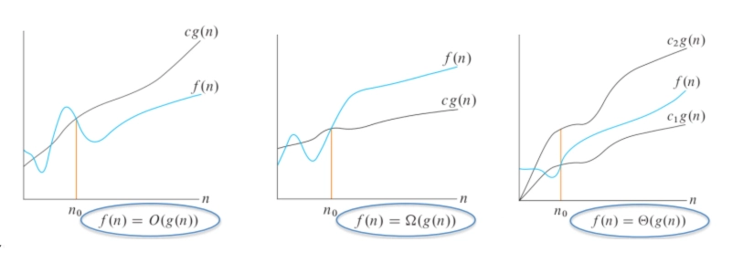
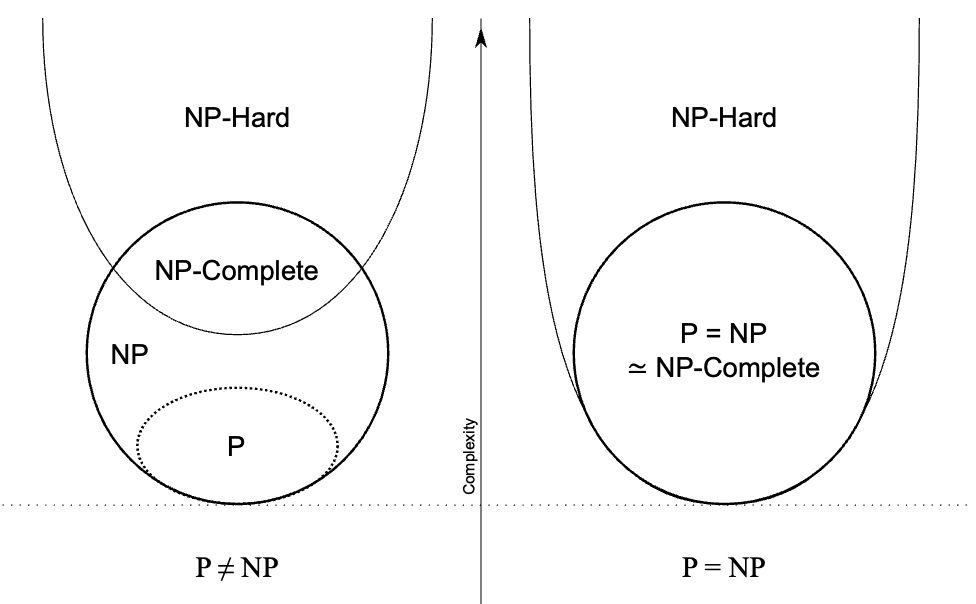
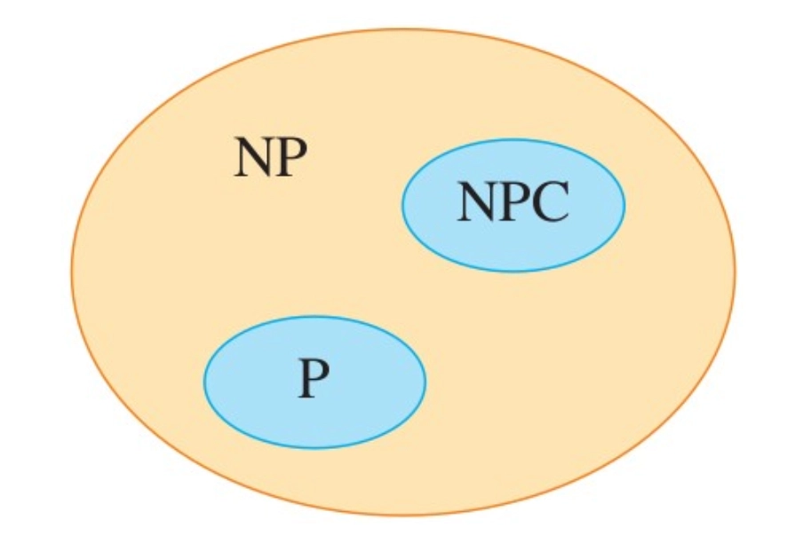
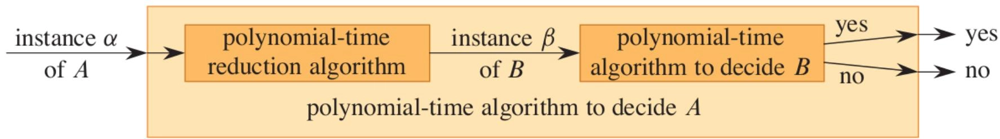
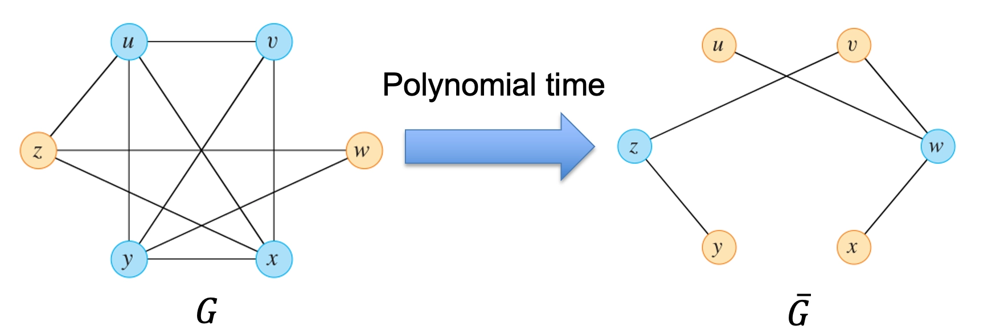
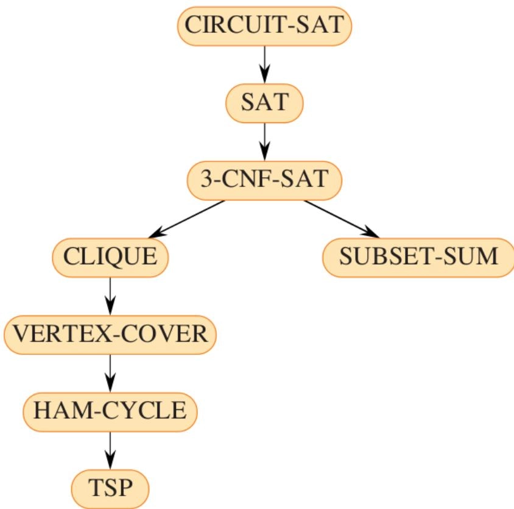

# 算法（计算）复杂度分析概论

- [Back to Course Home](index.md)

## 基本概念
### 算法定义

- An algorithm is any well-defined computational **procedure** that takes some value, or set of values, as input and produces some value, or set of values, as output in a finite amount of time（算法是指任何明确定义的计算过程，该过程在有限时间内将某个值或一组值作为输入，并产生某个值或一组值作为输出）

- An algorithm is a sequence of computational steps that transform the input into the output（算法是将输入转化为输出的一系列计算步骤）

### 算法正确性

- An algorithm for a computational problem is correct if,

	- for every problem instance provided as input, it halts -- finishes its computing in finite time (liveness)（对于每个作为输入提供的问题实例，算法都能在有限时间内停止计算——完成其计算）

	- and outputs the correct solution to the problem instance (safety)（并输出问题实例的正确解决方案）

### 算法效率

- Complexity analysis: determines the amount of resources required to execute an algorithm（决定了执行算法所需的资源量）

	- Computational time

	- Memory

	- Communication bandwidth （communication complexity）

	- Energy consumption

- Goal: finding the "best" solution among a group of candidates

## 算法分类
### 顺序算法 (Sequential Algorithms)

- An algorithm that is executed sequentially - once through, from start to finish, without other processing（顺序执行的算法——从开始到结束一次性执行，没有其他处理）

- No concurrency（无并发）

- Techniques

	- Divide-and-Conquer（分治法）

	- Dynamic Programming（动态规划）

	- Greedy Algorithms（贪心算法）

- Algorithms

	- Graph Algorithms（图算法）

		- Minimum Spanning Trees（最小生成树）

		- (Single-source) Shortest Paths（单源最短路径）

- NP-Completeness problems（NP 完全性问题）

	- Traveling-salesperson problem（旅行商问题）

### 分布式算法 (Distributed Algorithms)

- Algorithms used in distributed systems（分布式系统中使用的算法）

	- In contrast to sequential algorithms for centralized systems（与集中式系统的顺序算法相对）

	- distributed system: a set of processes/nodes seeking to achieve some common goal by communicating with each other（分布式系统：一组进程/节点通过相互通信寻求实现某个共同目标）

- 常见分布式系统类型

	- Client - server interactions（客户端-服务器交互）

	- Peer-to-peer systems（点对点系统）

	- Cloud computing systems（云计算系统）

- Basic abstractions

	- Timing assumption（时序假设）

		- Synchronous systems（同步系统）

		- Asynchronous systems（异步系统）

	- Fault detection（故障检测）

	- Leader election（领导者选举）

- Broadcast

	- Reliable broadcast（可靠广播）

	- Causal-order broadcast（因果顺序广播）

- Consensus（共识）

	- Paxos

## 算法复杂度分析 (Complexity Analysis)
### 增长量级 (Order of growth)

- To ease the analysis of any algorithm, consider **only the leading term** of a formula（为了简化对算法的分析，仅考虑公式的最高阶项）

- Ignore the leading term's constant coefficient（忽略最高阶项的常数系数）

- Consider one algorithm to be more efficient than another if its worst-case running time has a lower order of growth（如果一个算法的最坏情况运行时间具有较低的增长量级，则认为它比另一个算法更高效）

### 渐进符号 (Asymptotic Notations)

#### 上界 (Upper Bound)

- $O$ notation: characterizes an **upper bound** on the asymptotic behavior of a function（描述函数渐近行为的上界）

	- a function grows no faster than a certain rate（函数的增长速度不超过某个速率）

- 符号表示:

	$$
	f (n) = O (g (n))
	$$

- 定义：

	$$
	\exists c > 0, n_0 > 0, \forall n \geq n_0,~ 0 \leq f(n) \leq cg(n)
	$$

#### 下界 (Lower Bound)

- $\Omega$ notation: characterizes a **lower bound** on the asymptotic behavior of a function（描述函数渐近行为的下界）

	- a function grows at least as fast as a certain rate（函数的增长速度至少与某个速率一样快）

- 符号表示:

	$$
	f(n) = \Omega (g(n))
	$$

- 定义：

	$$
	\exists c > 0, n_0 > 0, \forall n \geq n_{0}, ~0 \leq cg(n) \leq f(n)
	$$

#### 紧确界 (Tight Bound)

- $\Theta$ notation: characterizes a **tight bound** on the asymptotic behavior of a function（描述函数渐近行为的紧确界）

	- a function grows precisely at a certain rate on the highest-order term（函数在最高阶项上以某个速率精确增长）

- 符号表示:

	$$
	f(n) = \Theta (g(n))
	$$

- 定义：

	$$
	\exists c_{1} > 0, c_{2} > 0, n_0 > 0, \forall n \geq n_{0}, ~0 \leq c_{1}g(n) \leq f(n) \leq c_{2}g(n)
	$$

- For any two functions  $f(n)$  and  $g(n)$, we have

	$$
	f (n) = \Theta (g (n)) \Leftrightarrow \begin{cases} f (n) = O (g (n))\\ f (n) = \Omega (g (n)) \end{cases}
	$$

## NPC 问题（NP-Complete Problems）
### 定义

- **P**: The class P consists of those problems that are **solvable** in polynomial time（多项式时间内可解的问题类）

- **NP**: The class NP consists of those problems that are **verifiable** in polynomial time（多项式时间内可验证的问题类）

	- Given a certificate, verify that the certificate is correct in polynomial time（给定一个解答，在多项式时间内验证该解答是否正确）

	- Any problem in P also belongs to NP：$P \subseteq NP$（P 类中的任何问题也属于 NP 类）

- **NP-hard**: A problem belongs to NP-hard if it is at least as hard as any problem in NP（可以不是 NP 问题，至少和 NP 问题中最难的问题一样难）

	- Intractable problems（难解问题）

- **NP-complete**: A problem belongs to NP-complete (NPC) if it belongs to NP and is NP-hard（属于 NP 且是 NP-hard 的问题：NP 类问题中最难的问题）

- 关系

	- If any problem in NP is **not polynomial-time solvable**, then no NP-complete problem is polynomial-time solvable（如果 NP 中存在问题不是多项式时间可解的，那么没有 NPC 问题是多项式时间可解的）

	- If any NP-complete problem is **polynomial-time solvable**, then every problem in NP has a polynomial-time algorithm, i.e.,  $P = NP$（如果任何 NPC 问题是多项式时间可解的，那么 NP 中的每个问题都有一个多项式时间算法，即 P = NP）

	$$
	\begin{cases} \exists~p \in \mathrm{NP}, p \notin \mathrm{P} &\Rightarrow \forall q \in \mathrm{NPC}, q \notin \mathrm{P} \\ \exists~q \in \mathrm{NPC}, q \in \mathrm{P} &\Rightarrow \forall p \in \mathrm{NP}, p \in \mathrm{P} \quad \Rightarrow \mathrm{P} = \mathrm{NP} \end{cases}
	$$

	

- The relationship most theoretical computer scientists believe: $P \neq NP$（大多数理论计算机科学家相信的关系：$P \neq NP$）
	

### 规约 (Reductions)

- **Reductions**（归约）

	- Reduction is a procedure transforms **any** instance $\alpha$ of $A$ into **some** instance $\beta$ of $B$（一个过程将 $A$ 的任何实例 $\alpha$ 转换为 $B$ 的某个实例 $\beta$）

		- The transformation takes **polynomial** time（转换需要多项式时间）

		- The answers are the **same**（答案是相同的）

	- If such a reduction exists, we say that $A$ is polynomial-time reducible to $B$, denoted by $A \leq_{\mathrm{P}} B$（如果存在这样的归约，我们说 $A$ 在多项式时间内可归约为 $B$，记为 $A \leq_{\mathrm{P}} B$）

		- B is at least as hard as A（B 至少和 A 一样难）

- Using reductions to solve problems（使用归约来解决问题）

	1. Given an instance $\alpha$ of problem $A$, use a polynomial-time reduction algorithm to transform it to an instance $\beta$ of problem $B$（给定问题 $A$ 的实例 $\alpha$，使用多项式时间归约算法将其转换为问题 $B$ 的实例 $\beta$）

	2. Run the polynomial-time decision algorithm for $B$ on the instance $\beta$（在实例 $\beta$ 上运行问题 $B$ 的多项式时间决策算法）

	3. Use the answer for $\beta$ as the answer for $\alpha$（将 $\beta$ 的答案用作 $\alpha$ 的答案）

		- if we have a polynomial-time algorithm for $B$, we can solve $A$ in polynomial time too（如果我们有一个多项式时间算法用于 $B$，我们也可以在多项式时间内解决 $A$）

	

### 证明 NPC

- Decision problems vs. optimization problems（决策问题 vs. 优化问题）

	- **Decision** problems: the answer is simply yes or no（决策问题：答案仅为是或否）

		- PATH (Decision problem): Given an undirected graph $G$, vertices $u$ and $v$, and an integer $k$, does a path exist from $u$ to $v$ consisting of at most $k$ edges?（无向图中是否存在从 $u$ 到 $v$ 的最多由 $k$ 条边组成的路径？）

	- **Optimization** problems: the answer is some optimal value（优化问题：答案是某个最优值）

		- SHORTEST-PATH (Optimization problem): Given an undirected graph $G$, vertices $u$ and $v$, what is the length of the shortest path from $u$ to $v$?（无向图中从 $u$ 到 $v$ 的最短路径长度是多少？）

	- If a decision problem is hard, its related optimization problem is hard

	- We usually use reductions to transform a decision problem $A$ to an optimization problem $B$（我们通常使用归约将决策问题 $A$ 转换为优化问题 $B$）

- Using polynomial-time reductions in the **opposite** way to show that a problem $B$ is NP-complete（以相反的方式使用多项式时间归约来证明问题 $B$ 是 NPC 的）

	1. Show that $B$ belongs to NP（证明 $B$ 属于 NP）

	2. Select a known NP-complete problem $A$（选择一个已知的 NP-complete 问题 $A$）

	3. Show that $A \leq_{\mathrm{P}} B$（证明 $A \leq_{\mathrm{P}} B$）

	4. Conclude that $B$ is NP-complete（得出结论 $B$ 是 NPC 的）

### 示例

- 哈密顿回路与旅行商问题

	- 哈密顿回路 (Hamiltonian cycles)

		- A hamiltonian cycle of an undirected graph $G = (V, E)$ is a cycle that visits each vertex exactly once（一个无向图的哈密顿回路是一个恰好访问每个顶点一次的回路）

			$$
			\langle v_{1},v_{2},\ldots,v_{|V|}\rangle \quad \forall i, (v_{i},v_{i+1})\in E, (v_{|V|},v_{1})\in E
			$$

		- Decision problem: whether a hamiltonian cycle exists in a given graph（决策问题：给定图中是否存在哈密顿回路）

	- 旅行商问题 (The traveling salesman problem, TSP)

		- Given a set of cities and the distances between each pair of cities, what is the shortest possible route that visits each city exactly once and returns to the origin city?（给定一组城市以及每对城市之间的距离，访问每个城市恰好一次并返回原始城市的最短可能路线是什么？）

		- Optimization problem: find the shortest hamiltonian cycle（优化问题：找到最短的哈密顿回路）

	- Reduction: HAM-CYCLE $\leq_{\mathrm{P}}$ TSP

- 电路可满足性问题 (The circuit-satisfiability problem)

	- Given a boolean circuit $C$ with $n$ inputs and one output, is there an assignment of the inputs such that the output is 1?（给定一个具有 $n$ 个输入和一个输出的布尔电路 $C$，是否存在输入的赋值使得输出为 1？）

	- The first NP-complete problem

	- Cook-Levin Theorem: any problem in NP can be reduced in polynomial time to the circuit-satisfiability problem（Cook-Levin 定理：NP 中的任何问题都可以在多项式时间内归约为电路可满足性问题）

- 团问题与顶点覆盖问题

	- 团问题 (The clique problem)

		- Clique: a subset of vertices of an undirected graph $G = (V, E)$ such that every two distinct vertices are adjacent.（团：无向图 $G = (V, E)$ 的一个顶点子集，其中每两个不同的顶点都是相邻的。）

		- Optimization problem: find a clique of maximum size（优化问题：找到最大规模的团）

		- Decision problem: whether a clique of a given size $k$ exists（决策问题：是否存在给定大小 $k$ 的团）

		- Naive solution: lists all $k$ -subsets of $V$ and checks each one to see whether it forms a clique（暴力解法：列出 $V$ 的所有 $k$ 子集，并检查每个子集是否形成一个团）

			- Time complexity:  $O\left(\binom{|V|}{k} \cdot k^{2}\right)$

	- 顶点覆盖问题 (The vertex-cover problem)

		- A vertex cover of an undirected graph $G = (V, E)$ is a subset $V^\prime \subseteq V$ such that if $(u,v)\in E$, then $u\in V^{\prime}$ or $v\in V^{\prime}$ (or both)（无向图 $G = (V, E)$ 的顶点覆盖是一个满足如果 $(u,v)\in E$，则 $u\in V^{\prime}$ 或 $v\in V^{\prime}$ 或两者皆是的顶点子集 $V^\prime \subseteq V$）

		- Optimization problem: find a vertex cover of minimum size（优化问题：找到最小规模的顶点覆盖）

		- Decision problem: whether a graph has a vertex cover of a given size $k$（决策问题：图是否具有给定大小 $k$ 的顶点覆盖）

	- CLIQUE $\leq_{\mathrm{P}}$ VERTEX-COVER

		- Assume CLIQUE is an NP-hard problem

		- Given an undirected graph $G = (V, E)$, the complement of $G$ is a graph $\bar{G} = (V, \bar{E})$, where（给定无向图 $G = (V, E)$，$G$ 的补图是图 $\bar{G} = (V, \bar{E})$，其中）

			$$
			\bar {E} = \{(u, v) \colon u, v \in V, u \neq v, (u, v) \notin E \}
			$$

		

		- The graph $G$ contains a clique of size $k$ **if and only if** the graph $\bar{G}$ has a vertex cover of size $|V| - k$（图 $G$ 包含大小为 $k$ 的团当且仅当图 $\bar{G}$ 具有大小为 $|V| - k$ 的顶点覆盖）

			- Assume $G$ contains a clique $V^\prime$ of size $|V^\prime| = k$, we try to show that $V - V^\prime$ is a vertex cover of size $|V| - k$ in $\bar{G}$

			- $\forall (v, w) \in \bar{E}$, we have $(v, w) \notin E$

			- Since $V^\prime$ is a clique in $G$, at least one of $v$ and $w$ is not in $V^\prime$

			- That means, at least one of $v$ and $w$ is in $V - V^{\prime}$

			- $V - V^{\prime}$ is a vertex cover

		- Conversely,

			- Assume that $\bar{G}$ has a vertex cover $V^\prime \subseteq V$ of size $|V^\prime| = k$, we try to show that $V - V^\prime$ is a clique of size $|V| - k$ in $G$

			- $\forall (v, w) \in \overline{E}$, we have $(v, w) \notin E$

			- Since $V^\prime$ is a vertex cover in $\bar{G}$, at least one of $v$ and $w$ is in $V^\prime$

			- That means, at most one of $v$ and $w$ is in $V - V^{\prime}$

			- $V - V^{\prime}$ is a clique

		- The reduction can be done in polynomial time by constructing the complement graph $\bar{G}$（通过构造补图 $\bar{G}$ 可以在多项式时间内完成归约）

- More NP-complete problems
	