# 顺序算法

- [Back to Course Home](index.md)

## 分治法 (Divide and Conquer)
### 分治法概述

- **Divide** the problem into one or more subproblems that are smaller instances of the same problem（将问题划分为一个或多个更小的同类子问题）
- **Conquer** the subproblems by solving them recursively（通过递归地解决子问题来解决它们）
- **Combine** the subproblem solutions to form a solution to the original problem（将子问题的解决方案组合成原始问题的解决方案）

### 归并排序 (Merge sort)
#### 基本思想

- **Divide** the subarray  $A[p, r]$ to be sorted into two adjacent subarrays, each of half the size（将要排序的子数组  $A[p, r]$ 分成两个相邻的子数组，每个子数组大小为一半）
	- Compute the midpoint  $q$ of  $A[p, r]$（计算  $A[p, r]$ 的中点  $q$ ）
	- Divide  $A[p,r]$ into subarrays  $A[p,q]$ and  $A[q + 1,r]$（将  $A[p,r]$ 分成子数组  $A[p,q]$ 和  $A[q + 1,r]$）
- **Conquer** by sorting each of the two subarrays  $A[p, q]$ and  $A[q + 1, r]$ recursively using merge sort（通过使用归并排序递归地排序两个子数组  $A[p, q]$ 和  $A[q + 1, r]$ 来解决）
- **Combine** by merging the two sorted subarrays  $A[p, q]$ and  $A[q + 1, r]$ back into  $A[p, q]$, producing the sorted answer（通过将两个已排序的子数组  $A[p, q]$ 和  $A[q + 1, r]$ 合并回  $A[p, q]$ 来组合，生成排序后的答案）

#### 算法伪代码
```
MERGE-SORT(A, p, r)
	if p < r then				   // 当前子数组至少有两个元素时
		q = ⌊(p + r) / 2⌋			// 中点
		MERGE-SORT(A, p, q)		 // 递归排序左半部分
		MERGE-SORT(A, q + 1, r)	 // 递归排序右半部分
		MERGE(A, p, q, r)		   // 合并两个已排序的子数组

MERGE(A, p, q, r)
	nL = q - p + 1				  // 左子数组的大小
	nR = r - q					  // 右子数组的大小
	let L[0:nL - 1] and R[0:nR - 1] be new arrays
	for i = 0 to nL - 1
		L[i] = A[p + i]
	for j = 0 to nR - 1
		R[j] = A[q + 1 + j]
	i = 0						   // i 为 L 中最小未处理元素的索引
	j = 0						   // j 为 R 中最小未处理元素的索引
	k = p						   // k 为 A 中待填充位置的索引
	while i < nL and j < nR		 // 合并 L 和 R 到 A 中
		if L[i] ≤ R[j]
			A[k] = L[i]
			i = i + 1
		else
			A[k] = R[j]
			j = j + 1
		k = k + 1
	while i < nL
		A[k] = L[i]
		i = i + 1
		k = k + 1
	while j < nR
		A[k] = R[j]
		j = j + 1
		k = k + 1
```

$$
T (n) = 2 T\left(\frac{n}{2}\right) + \Theta (n)
$$

- 示例：
	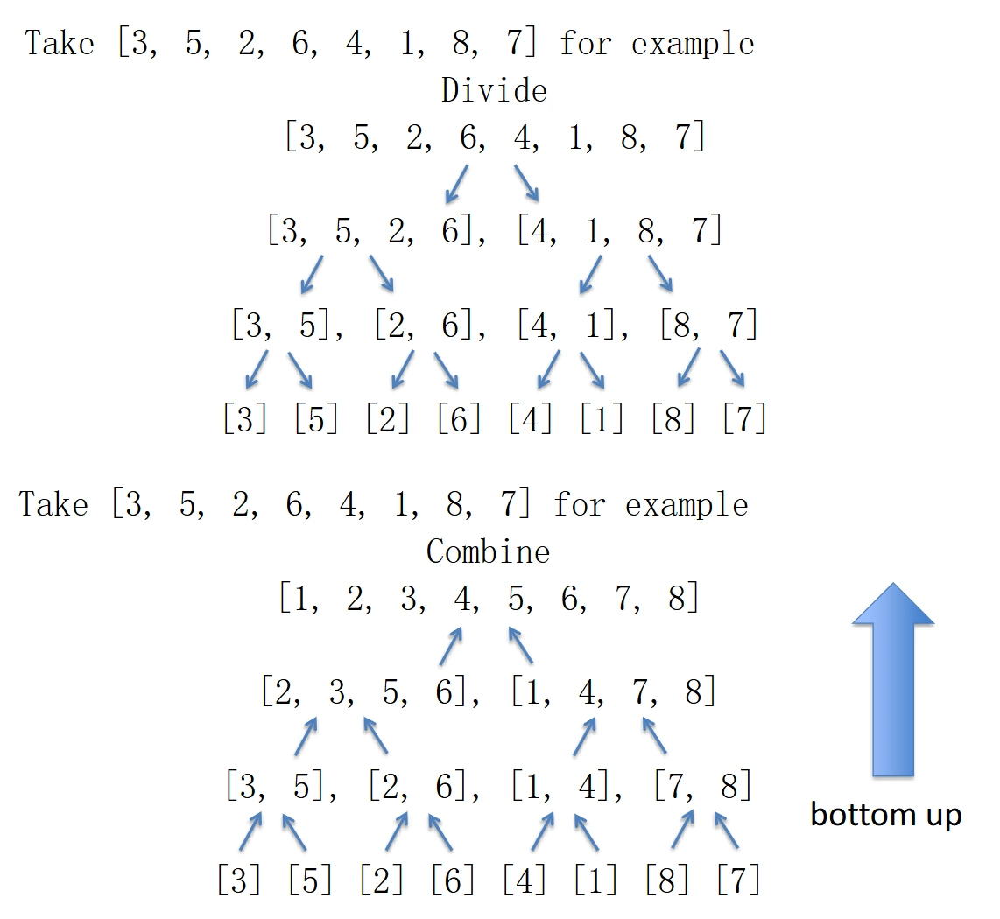

- 复杂度分析
	- Recurrence equation（递归方程）
		- For simplicity, we assume  $n = 2^m$ for some integer  $m \geq 0$

			$$
			\quad T (n) = \left\{ \begin{array}{c} c_{1}, &~n = 1 \\ 2T \left(\frac {n}{2}\right) + c_{2} n, &~n > 1 \end{array} \right.
			$$

	- Recurrence tree: $T(n) = 2 T\left(\frac{n}{2}\right) + c_{2} n$
		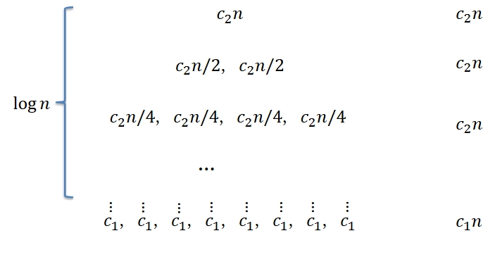

		$$
		T(n) = c_{2} n \log n + c_{1} n = \Theta (n \log n)
		$$

### 复杂度分析方法

- 分析分治算法的时间复杂度通常涉及解决递归关系（recurrence relations）
- 三种常用的方法:
	1. 代入法 (The substitution method)
	2. 递归树法 (The recursion-tree method)
	3. 公式法 (The master method)

#### 代入法 (The substitution method)

- 步骤:
	1. Guess the form of the solution using symbolic constants（使用符号常数猜测解决方案的形式）
	2. Use **mathematical induction** to show that the solution works, and find the constants（使用数学归纳法证明解决方案有效，并找到常数）
- 示例：
	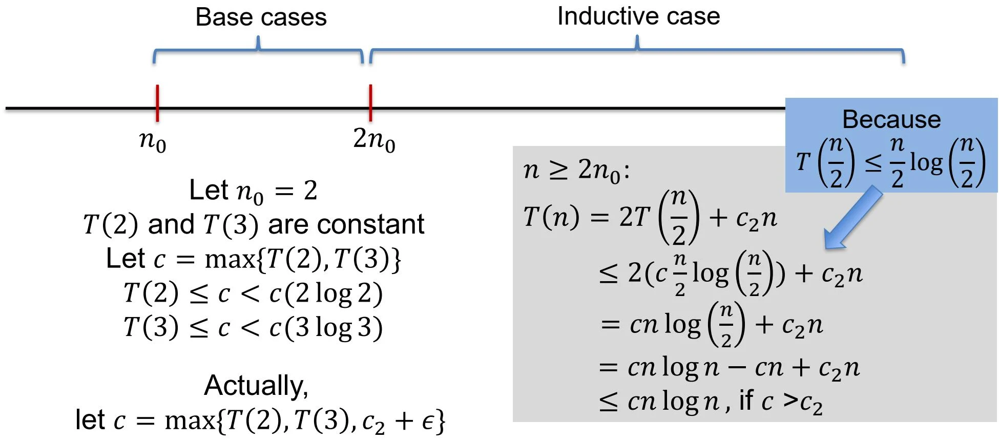

- Avoiding pitfalls（避免陷阱）
	- We must prove  $T(n) \leq f(n)$ for some  $f(n)$, but not  $T(n) \leq O(n)$,（我们必须证明  $T(n) \leq f(n)$ 对于某些  $f(n)$ ，而不是  $T(n) \leq O(n)$ ）
	- E.g., if we intend to prove  $T(n) \leq O(n)$, then we must assume  $T(n) \leq cn$ for some  $c$ and all  $n \geq n_0$, and prove it by induction（例如，如果我们打算证明  $T(n) \leq O(n)$ ，那么我们必须假设  $T(n) \leq cn$ 对于某些  $c$ 和所有  $n \geq n_0$ ，并通过归纳法证明它）

#### 递归树法 (The recursion-tree method)

- 步骤:
	1. Visualize the recurrence as a tree（将递归可视化为一棵树）
	2. Compute the total cost by summing the costs at each level of the tree（通过对树的每一层的成本求和来计算总成本）
- 示例：
	- **Example 1**: $T(n) = 3T\left(\frac{n}{4}\right) + \Theta (n^{2})= 3T \left(\frac{n}{4}\right) + c_{2} n^{2}$
		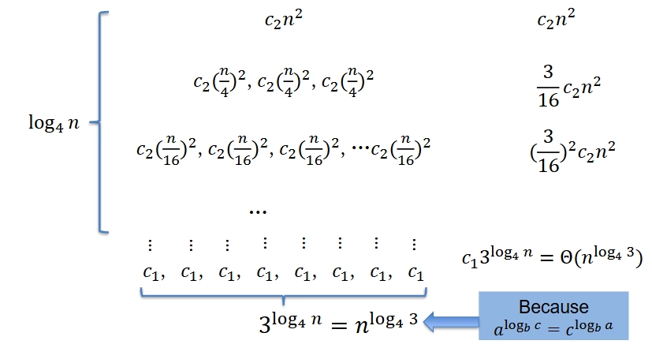

		$$
		\begin{aligned} &c_{2} n^{2} + \frac{3}{16} c_{2} n^{2} + \left(\frac{3}{16}\right)^{2} c_{2} n^{2} + \dots \left(\frac{3}{16}\right)^{\log_{4} n} c_{2} n^{2} \\ =& \sum_{i=0}^{\log_{4} n} \left(\frac{3}{16}\right)^{i} c_{2} n^{2} < \sum_{i=0}^{\infty} \left(\frac{3}{16}\right)^{i} c_{2} n^{2}\\ =& \frac{1}{1 - \frac{3}{16}} c_{2} n^{2} = \frac{16}{13} c_{2} n^{2} \\\\ \therefore &\sum_{i=0}^{\log_{4} n} \left(\frac{3}{16}\right)^{i} c_{2} n^{2} + \Theta \big (n^{\log_{4} 3} \big) = O (n^{2}) \end{aligned}
		$$

	- **Example 2:** $T(n) = 8 T\left(\frac{n}{2}\right) + c_{2} n$
		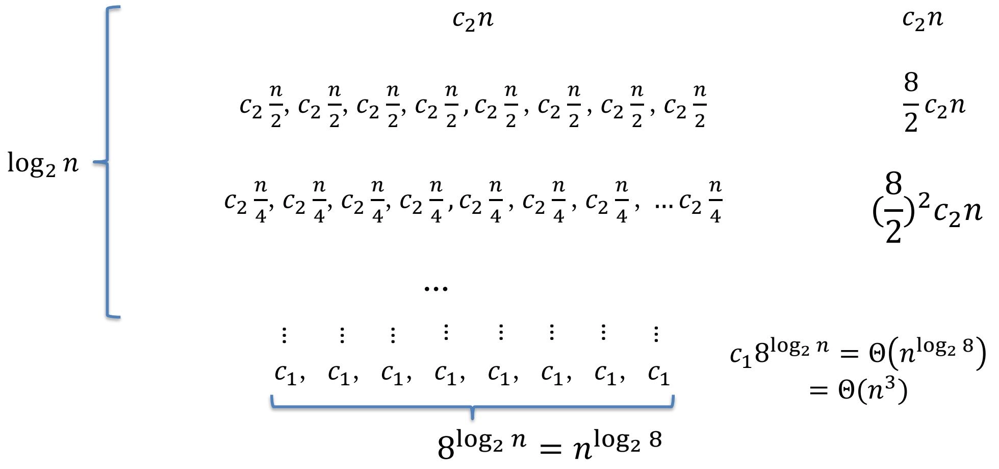

		$$
		\begin{aligned} &c_{2} n + 4 c_{2} n + 4^{2} c_{2} n + \dots 4^{\log_{2} n} c_{2} n \\ =& \sum_{i=0}^{\log_{2} n} 4^{i} c_{2} n \\ =& \frac{4^{(\log_{2} n) + 1} - 1}{4 - 1} c_{2} n \\ =& \frac{4 n^{\log_{2} 4} - 1}{3} c_{2} n \\ =& \Theta (n^{3}) \\\\ \therefore &\sum_{i=0}^{\log_{2} n} 4^{i} c_{2} n + \Theta (n^{3}) = \Theta (n^{3}) \end{aligned}
		$$

#### 公式法 (The master method)

- Solving algorithmic recurrences of the form（解决以下形式的算法递归）

	$$
	T(n) = aT \left(\frac{n}{b}\right) + f (n),\quad a > 0, b > 1
	$$

	- $f(n)$ is a driving function, the costs for dividing and combining（$f(n)$ 是驱动函数，表示划分和合并的成本）
	- $a$ is the number of subproblems（$a$ 是子问题的数量）
	- $n/b$ is the size of each subproblem（$n/b$ 是每个子问题的大小）

##### Case I

- If there exists a constant $\epsilon > 0$ such that

    $$
    f(n) = O(n^{\log_{b} a - \epsilon})
    $$

    Then

    $$
    T(n) = \Theta (n^{\log_b a})
    $$

	- $n^{\log_b a}$ is the watershed function （$n^{\log_b a}$ 是分水岭函数）
	- The watershed function grows polynomially faster than the driving function by a factor of  $\Theta (n^{\epsilon})$（分水岭函数的增长速度比驱动函数快 $\Theta (n^{\epsilon})$ 倍）
- 示例：$T(n) = 8T\left(\frac{n}{2}\right) + c_2 n = \Theta (n^{3})$
	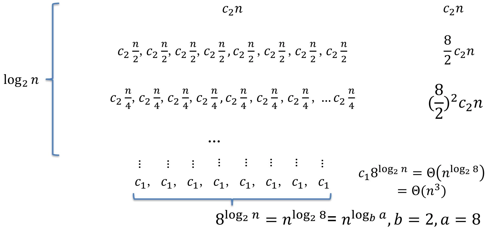

##### Case II

- If there exists a constant  $K \geq 0$ such that

    $$
    f (n) = \Theta \left(n ^ {\log_ {b} a} (\log n) ^ {K}\right)
    $$

    Then

    $$
    T(n) = \Theta (n^{\log_b a}(\log n)^{K + 1})
    $$

-  The driving function grows faster than the watershed function only by a factor of  $(\log n)^{K}$（案例 II：驱动函数的增长速度仅比分水岭函数快  $(\log n)^{K}$ 倍）
- 示例：$T(n) = 2T\left(\frac{n}{2}\right) + c_2 n = \Theta (n \log n)$
	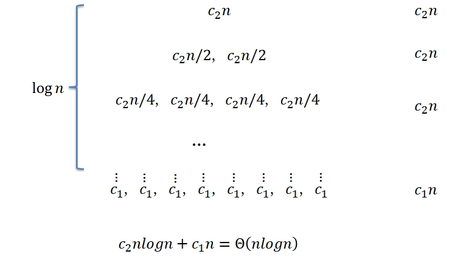

##### Case III

- If there exists a constant  $\epsilon > 0$ such that

    $$
    f (n) = \Omega (n ^ {\log_ {b} a + \epsilon})
    $$

    And

    $$
    \exists c < 1, \forall n \geq n_0, a f\left(\frac{n}{b}\right) \leq c f(n)
    $$

    Then

    $$
    T(n) = \Theta (f(n))
    $$

- The driving function grows polynomially faster than the watershed function by a factor of  $\Theta (n^{\epsilon})$（驱动函数的增长速度比分水岭函数快 $\Theta (n^{\epsilon})$ 倍）
- 示例：$T(n) = 3T\left(\frac{n}{4}\right) + c_2 n^{2} = \Theta (n^{2})$
	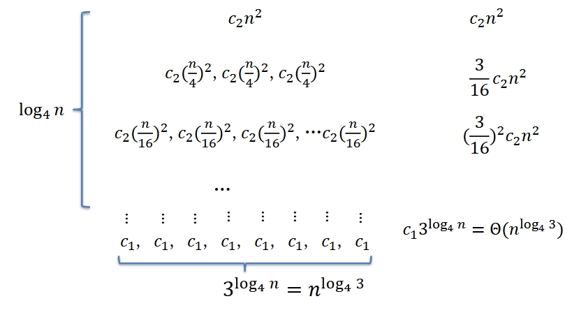

## 动态规划 (Dynamic Programming)
### 动态规划概述

- DP typically applies to **optimization** problems（DP 通常应用于优化问题）
	- Find a solution with the optimal value（找到具有最佳值的解决方案）
- 动态规划与分治法的异同
	- 相同：Solves problems by combining the solutions to subproblems（通过组合子问题的解决方案来解决问题）
	- 不同：
		- The subproblems overlap（子问题重叠）
		- Subproblems share subproblems（子问题共享子问题）
		- Solves each subproblem only once and saves the result for future reference（每个子问题只解决一次，并保存结果以供将来参考）

#### 主要步骤

1. Characterize the structure of an optimal solution（描述最优解的结构）
2. Recursively define the value of an optimal solution（递归定义最优解的值）
3. Compute the value of an optimal solution, typically in a bottom-up fashion（通常以自底向上的方式计算最优解的值）
4. (Optional) Construct an optimal solution from computed information（从计算得出的信息中构造最优解）

#### 实现方法

1. **Top-down with memoization**（自顶向下的备忘录法）
	- Write the procedure recursively（递归编写过程）
	- Store the results of each subproblem in a table（将每个子问题的结果存储在表中）
	- Before solving a subproblem, check whether its result is already in the table（在解决子问题之前，检查其结果是否已在表中）
2. **Bottom-up**（自底向上）
	- Sort the subproblems in some order such that when we are about to solve a subproblem, we have already solved all of its subproblems（以某种顺序对子问题进行排序，以便在我们即将解决子问题时，我们已经解决了它的所有子问题）
		- Typically implemented using iteration（通常使用迭代实现）

#### 基本要点

- **Optimal substructure**（最优子结构）
	- An optimal solution to the problem contains within it optimal solutions to subproblems（问题的最优解包含其子问题的最优解）
		- a solution to the problem consists of making a choice（解决问题的方案包括做出选择）
		- the solutions to the subproblems must be optimal（子问题的解决方案必须是最优的）
	- Often uses optimal substructure in a bottom-up fashion（通常以自底向上的方式使用最优子结构）
- **Overlapping subproblems**（重叠子问题）
	- The space of subproblems must be small（子问题的空间必须很小）
		- the total number of distinct subproblems is a polynomial（不同子问题的总数是多项式）
		- solve each subproblem **only once**（每个子问题只解决一次）
		- store the solutions in a table for future reference（将解决方案存储在表中以供将来参考）
	- Saving subproblem solutions comes with a cost: the additional memory needed to store solutions（保存子问题解决方案是有代价的：存储解决方案所需的额外内存）
		- a time-memory trade-off（时间-内存权衡）

### 杆切割问题 (Rod cutting)
#### 问题描述
| length $i$ | 1 | 2 | 3 | 4 | 5 | 6 | 7 | 8 | 9 | 10 |
|-------------|---|---|---|---|---|---|---|---|---|----|
| **price** $p_i$ | 1 | 5 | 8 | 9 | 10| 17| 17| 20| 24| 30 |

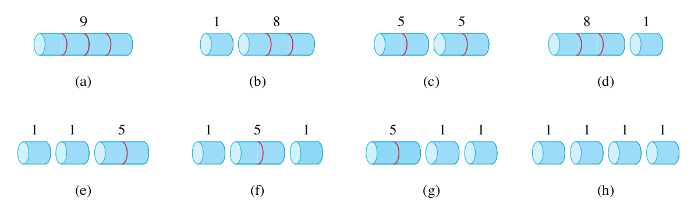

- Given a rod of length  $n$ and a table of prices  $p_{i}$ for  $i = 1, 2, \ldots, n$, determine the maximum revenue  $r_{n}$ obtainable by cutting up the rod and selling the pieces（给定长度为  $n$ 的杆和价格表  $p_{i}$ ，其中  $i = 1, 2, \ldots, n$ ，确定通过切割杆并出售零件可以获得的最大收入  $r_{n}$）
- An optimal solution cuts the rod into  $k$ pieces:  $i_1, i_2, \ldots, i_k$, where  $1 \leq k \leq n$ and  $\sum_{j=1}^{k} i_j = n$, obtaining revenue  $r_n = \sum_{j=1}^{k} p_{i_j}$ （最优解将杆切成  $k$ 个部分： $i_1, i_2, \ldots, i_k$ ，其中  $1 \leq k \leq n$ 且  $\sum_{j=1}^{k} i_j = n$ ，获得收入  $r_n = \sum_{j=1}^{k} p_{i_j}$）

#### 最优子结构

- Let $r_n$ be the optimal revenue for a rod of length  $n$. Suppose that in an optimal solution the first piece cut from the rod has length  $i$, where  $1 \leq i \leq n$. Then the revenue $r_n$ is given by（设  $r_n$ 为长度为  $n$ 的杆的最佳收入。假设在最优解中，从杆上切下的第一块的长度为  $i$ ，其中  $1 \leq i \leq n$ 。则收入  $r_n$ 由下式给出）

	$$
	r_n = p_i + r_{n - i}
	$$

- $r_n = \max \{p_n, r_1 + r_{n-1}, r_2 + r_{n-2}, \ldots, r_{\left\lfloor \frac{n}{2} \right\rfloor} + r_{\left\lceil \frac{n}{2} \right\rceil}\} = \max \{p_i + r_{n - i} : 1 \leq i \leq n\}$
- recursive formula for optimal revenue  $r_n$ :

	$$
	r_n = \left\{ \begin{array}{ll} 0 & n = 0 \\ \max_{1 \leq i \leq n} (p_i + r_{n - i}) & n \geq 1 \end{array} \right.
	$$

#### 递归解法 (recursive solution)

- Trivial solution: try to cut up a rod of length $n$ in $2^{n - 1}$ different ways（简单解法：尝试以  $2^{n - 1}$ 种不同方式切割长度为  $n$ 的杆）
	- Less than  $2^{n - 1}$ if in order of monotonically increasing size（如果按单调递增的顺序，则少于  $2^{n - 1}$ ）

```
CUT_ROD(p, n) // p: 价格表, n: 杆长度
	if n == 0
		return 0
	q = -∞
	for i = 1 to n
		q = max(q, p[i] + CUT_ROD(p, n - i))
	return q
```

- $T(n)$ : The total number of calls made to CUT-ROD（$T(n)$ 为对 CUT-ROD 进行的总调用次数）

	$$
	T(n) = 1 + \sum_{j = 0}^{n - 1} T(j) = 2^{n}
	$$

- 存在大量重叠子问题
	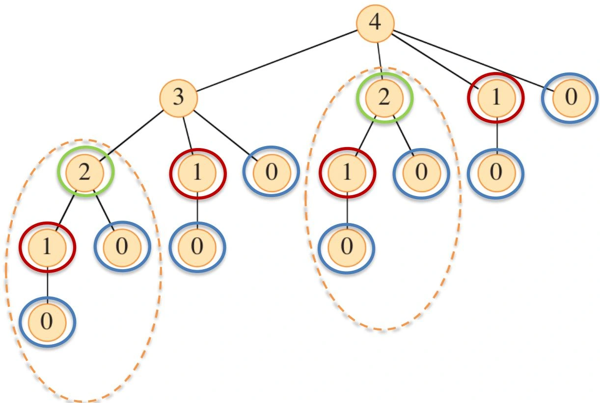

#### 动态规划 (dynamic programming)

- Often uses optimal substructure in a bottom-up fashion（通常以自底向上的方式使用最优子结构）
	1. The subproblems of determining optimal ways to cut up rods of length  $i$ for  $i \in \{0, 1, \ldots, n-1\}$（确定切割长度为  $i$ 的杆的最佳方法的子问题，其中  $i \in \{0, 1, \ldots, n-1\}$）
	2. Determine which of these subproblems yielded an optimal solution for a rod of length  $n$（确定这些子问题中哪些为长度为  $n$ 的杆产生了最优解）
		- making a choice among subproblems（在子问题之间做出选择）

```
BOTTOM_UP_CUT_ROD(p, n)		 // p: 价格表, n: 杆长度
	let r[0:n] be a new array   // r[j]存储长度为j的杆的最大收益
	r[0] = 0
	for j = 1 to n			  // j 为当前杆长度
		q = -∞
		for i = 1 to j		  // i 为当前切割长度
			q = max(q, p[i] + r[j - i])
		r[j] = q
	return r[n]
```
```
EXTENDED_BOTTOM_UP_CUT_ROD(p, n)
	let r[0:n] and s[0:n] be new arrays // r[j]: 最大收益, s[j]: 第一次切割位置
	r[0] = 0
	for j = 1 to n
		q = -∞
		for i = 1 to j
			if q < p[i] + r[j - i]
				q = p[i] + r[j - i]
				s[j] = i
		r[j] = q
	return r, s

PRINT_CUT_ROD_SOLUTION(p, n)
	r, s = EXTENDED_BOTTOM_UP_CUT_ROD(p, n)
	while n > 0:
		print(s[n]) // first cut location
		n = n - s[n] // remaining length
```

$$
T(n) = \Theta (n^{2})
$$

- 示例：
	- Input：

		| length $i$ | 1 | 2 | 3 | 4 | 5 | 6 | 7 | 8 | 9 | 10 |
		|-------------|---|---|---|---|---|---|---|---|---|----|
		| **price** $p_i$ | 1 | 5 | 8 | 9 | 10| 17| 17| 20| 24| 30 |

	- Output：

		| **length** $i$ | 0 | 1 | 2 | 3 | 4 | 5 | 6 | 7 | 8 | 9 | 10 |
		|-------------|---|---|---|---|---|---|---|---|---|---|----|
		| **r[i]** | 0 | 1 | 5 | 8 | 10 | 13 | 17 | 18 | 22 | 25 | 30 |
		| **s[i]** |  | 1 | 2 | 3 | 2 | 2 | 6 | 1 | 2 | 3 | 10 |

### 最长公共子序列 (LCS-Longest Common Subsequence)
#### 问题描述
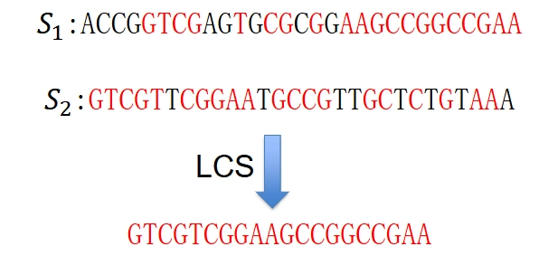

- Given two sequences $X =\langle x_{1}, x_{2}, \ldots, x_{m}\rangle$ and  $Y = \langle y_{1}, y_{2}, \ldots, y_{n} \rangle$, find a longest common subsequence of  $X$ and  $Y$（给定两个序列  $X$ 和 $Y$，找到他们的最长公共子序列）
- A subsequence of a sequence is a new sequence formed from the original sequence by deleting some (can be none) of the elements without disturbing the relative positions of the remaining elements（序列的子序列是从原始序列中删除某些元素而不干扰剩余元素的相对位置而形成的新序列）

#### 最优子结构

- Let $X =\langle x_{1~~}, x_{2}, \ldots, x_{m}\rangle$ and $Y = \langle y_{1}, y_{2}, \ldots, y_{n} \rangle$ be sequences, and let  $Z = \langle z_{1}, z_{2}, \ldots, z_{k} \rangle$ be any LCS of  $X$ and $Y$
	1. If  $x_{m} = y_{n}$, then  $z_{k} = x_{m} = y_{n}$ and  $Z_{k-1}$ is an LCS of  $X_{m-1}$ and  $Y_{n-1}$
	2. If  $x_{m} \neq y_{n}$ and  $z_{k} \neq x_{m}$, then  $Z$ is an LCS of  $X_{m-1}$ and  $Y$
	3. If  $x_{m} \neq y_{n}$ and  $z_{k} \neq y_{n}$, then  $Z$ is an LCS of  $X$ and  $Y_{n-1}$
- recursive formula of LCS length $c[i, j]$

	$$
	c[i,j] = \left\{ \begin{array}{ll} 0 & i = 0 ~or~ j = 0 \\ c[i-1,j-1] + 1 & i, j > 0 ~and~ x_{i} = y_{j}\\ \max \{c[i,j-1], c[i-1,j] \} & i, j > 0 ~and~ x_{i} \neq y_{j}\end{array} \right.
	$$

#### 算法伪代码
```
LCS_LENGTH(X, Y, m, n)
	let b[1:m, 1:n] and c[0:m, 0:n] be new tables   // b: 方向表, c: 长度表
	for i = 0 to m
		c[i][0] = 0
	for j = 0 to n
		c[0][j] = 0
	for i = 1 to m
		for j = 1 to n
			if x[i] == y[j]
				c[i][j] = c[i-1][j-1] + 1
				b[i][j] = "↖"	  // diagonal
			else if c[i-1][j] >= c[i][j-1]
				c[i][j] = c[i-1][j]
				b[i][j] = "↑"	  // up
			else
				c[i][j] = c[i][j-1]
				b[i][j] = "←"	  // left
	return b, c
```

$$
T (m, n) = \Theta (m n)
$$

```
PRINT_LCS(b, X, i, j)
	if i == 0 or j == 0
		return
	if b[i][j] == "↖"
		PRINT_LCS(b, X, i - 1, j - 1)
		print(X[i - 1])
	elif b[i][j] == "↑"
		PRINT_LCS(b, X, i - 1, j)
	else:
		PRINT_LCS(b, X, i, j - 1)
```

$$
T (m, n) = \Theta (m + n)
$$

- 示例：
	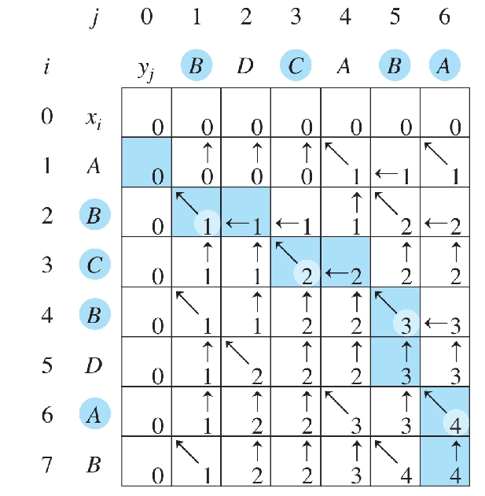

### 最优二叉搜索树 (Optimal binary search trees)
#### 问题描述
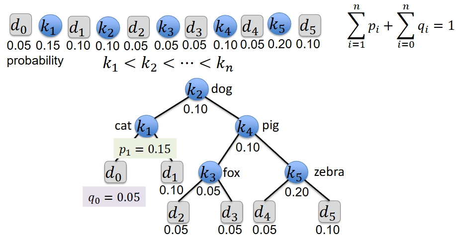

- Given a sequence of $n$ keys $k_{1} < k_{2} < \ldots < k_{n}$, with associated search probabilities  $p_{1}, p_{2}, \ldots, p_{n}$, build a binary search tree of all  $n$ keys that minimizes the expected search cost（给定一系列 $n$ 个键 $k_i$ 以及相关的搜索概率 $p_i$，构建包含所有  $n$ 个键的二叉搜索树，以最小化预期搜索成本）
- Additionally, there are  $n + 1$ dummy keys  $d_{0}, d_{1}, \ldots, d_{n}$,  with associated search probabilities  $q_{0}, q_{1}, \ldots, q_{n}$, representing values not in the tree（此外，还有 $n + 1$ 个虚拟键 $d_i$ ，表示树中不存在的值）
	- each dummy key  $d_{i}$ corresponds to the interval  $(k_{i-1}, k_{i})$ （每个虚拟键  $d_{i}$ 对应于区间  $(k_{i-1}, k_{i})$ ）
- The probabilities satisfy（这些概率满足）

	$$
	\sum_{i=1}^{n} p_{i} + \sum_{i=0}^{n} q_{i} = 1
	$$

- The expected cost of a search is

	$$
	\operatorname{E}(\text{search cost in } T) = \sum_{i=1}^{n} (\operatorname{depth}_T(k_i) + 1) \times p_i + \sum_{i=0}^{n} (\operatorname{depth}_T(d_i) + 1) \times q_i
	$$

- 示例
	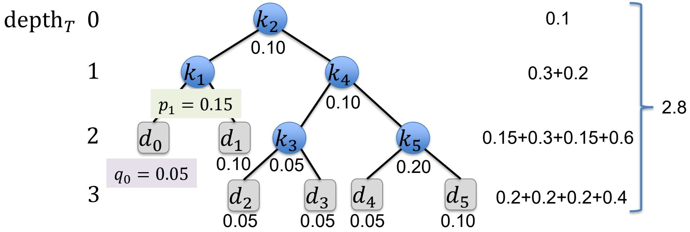
	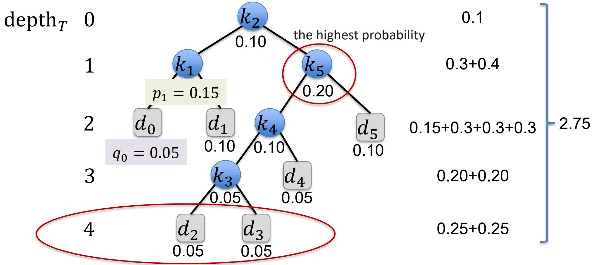
	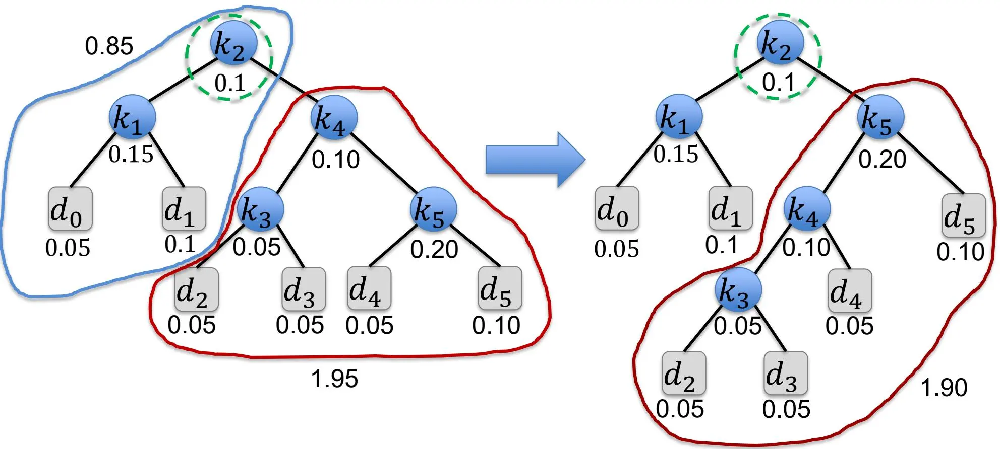

#### 最优子结构

- Let $e(i,j)$ denote the expected cost of searching an optimal binary search tree containing the keys  $k_{i},\ldots,k_{j}$（令 $e(i,j)$ 表示包含键  $k_{i},\ldots,k_{j}$ 的最优二叉搜索树的预期搜索成本）
- Let $w(i, j)$ denote the sum of the probabilities between $k_{i}$ and  $k_{j}$（令 $w(i, j)$ 表示 $k_{i}$ 到 $k_{j}$ 之间的概率和）

	$$
	w(i, j) = \sum_ {l = i} ^ {j} p _ {l} + \sum_ {l = i - 1} ^ {j} q _ {l} = \left\{ \begin{array} {ll} q _ {i - 1} & j = i - 1 \\ w(i, j - 1) + p _ {j} + q _ {j} & i \leq j \end{array} \right.
	$$

	- 示例
		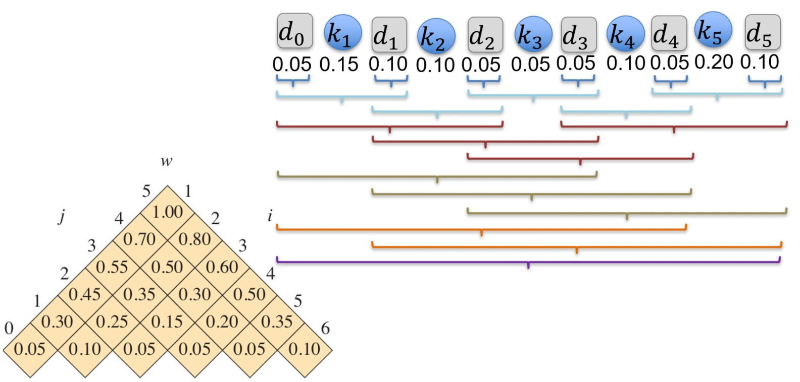

- Let $k_{r}$ be the root of an optimal binary search tree containing the keys  $k_{i}, \ldots, k_{j}$, where  $i \leq r \leq j$（令 $k_{r}$ 为包含键  $k_{i}, \ldots, k_{j}$ 的最优二叉搜索树的根，其中  $i \leq r \leq j$）

	$$
	e(i, j) = e(i, r - 1) + e(r + 1, j) + w(i, j)
	$$

- We thus have the following recursive formulation:

	$$
	e(i, j) = \left\{ \begin{array}{ll} q_{i - 1} & ~j = i - 1 \\ \min \{e(i, r - 1) + e(r + 1, j) + w(i, j) \colon i \leq r \leq j \} & ~i \leq j \end{array} \right.
	$$

- Our goal: compute $e(1, n)$

#### 算法伪代码
```
OPTIMAL_BST(p, q, n)
	let e[1:n+1, 0:n], w[1:n+1, 0:n], root[1:n, 1:n] be new tables				// e: 期望搜索成本表, w: 概率和表, root: 根表
	for i = 1 to n + 1
		e[i][i - 1] = q[i - 1]
		w[i][i - 1] = q[i - 1]
	for l = 1 to n						  // l: 子问题长度
		for i = 1 to n - l + 1			  // i: 子问题起始位置
			j = i + l - 1				   // j: 子问题结束位置
			e[i][j] = ∞
			w[i][j] = w[i][j - 1] + p[j] + q[j]
			for r = i to j				  // r: 根位置
				t = e[i][r - 1] + e[r + 1][j] + w[i][j]
				if t < e[i][j]
					e[i][j] = t
					root[i][j] = r
	return w, e, root
```

$$
T(n) = \Theta (n^{3})
$$

- 示例
	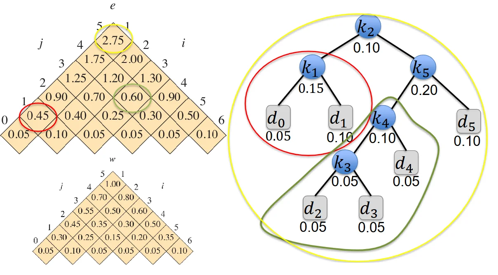

- 根据 $e$ 和 $w$ 表格反推最优二叉搜索树（以上图为例）
	- 根：$e[1,5] - w[1,5] = 1.75 = e[1,1] + e[3,5] \Rightarrow k_{2}$
		- 左子树：$k_{1}$
			- 左子树：$d_{0}$
			- 右子树：$d_{1}$
		- 右子树：$e[3,5] - w[3,5] = 0.7 = e[3,4] + e[6,5] \Rightarrow k_{5}$
			- 左子树：$e[3,4] - w[3,4] = 0.3 = e[3,3] + e[5,4] \Rightarrow k_{4}$
				- 左子树：$k_{3}$
					- 左子树：$d_{2}$
					- 右子树：$d_{3}$
				- 右子树：$d_{4}$
			- 右子树：$d_{5}$

## 贪心算法 (Greedy Algorithms)
### 贪心算法概述

- A greedy algorithm always makes the choice that looks **best at the moment**（贪心算法总是做出在当前时刻看起来最好的选择）
	- A locally optimal choice $\rightarrow$ a globally optimal solution
- 应用：
	- Minimum-spanning-tree algorithms
	- Dijkstra's algorithm for shortest paths

#### 基本要点

- A **top-down** approach: make a sequence of choices（自顶向下的方法：做出一系列选择）
- At each decision point, the algorithm makes the choice that seems **best at the moment**（在每个决策点，算法做出当时看起来最好的选择）
- Two ingredients（两个要素）
	1. greedy-choice property（贪心选择属性）
		- Assemble a globally optimal solution by making locally optimal (greedy) choices（通过做出局部最优选择来组装全局最优解）
			- **Without** considering results from subproblems（不考虑子问题的结果）
			- Make the first choice before solving any subproblems（在解决任何子问题之前做出第一个选择）
	2. optimal substructure（最优子结构）
		- An optimal solution to the problem contains within it optimal solutions to subproblems（问题的最优解包含其子问题的最优解）
		- For greedy algorithms, an optimal solution to the subproblem, combined with the greedy choice already made, yields an optimal solution to the original problem（对于贪心算法，子问题的最优解与已经做出的贪心选择相结合，产生原始问题的最优解）

#### 贪心 vs DP

- 贪心算法与动态规划的区别
	- Greedy: make a choice and then solve a subproblem（做出选择然后解决子问题）
	- DP: solving all subproblems before making a choice（在做出选择之前解决所有子问题）
- 背包问题 (The Knapsack Problem)
	- 问题描述
		- take the most valuable load with at most $W$ pounds（以不超过 $W$ 磅的重量携带最有价值的负载）
		- the $i$ th item is worth $v_{i}$ dollars and weighs $w_{i}$ pounds（第 $i$ 件物品价值 $v_{i}$ 美元，重量为 $w_{i}$ 磅）
	- 两种变体
		- The 0-1 knapsack problem
			- can only take whole items（只能取完整的物品）
			- **DP**
		- The fractional knapsack problem
			- can take fractions of items（可以取物品的部分）
			- **Greedy**
	- 示例
		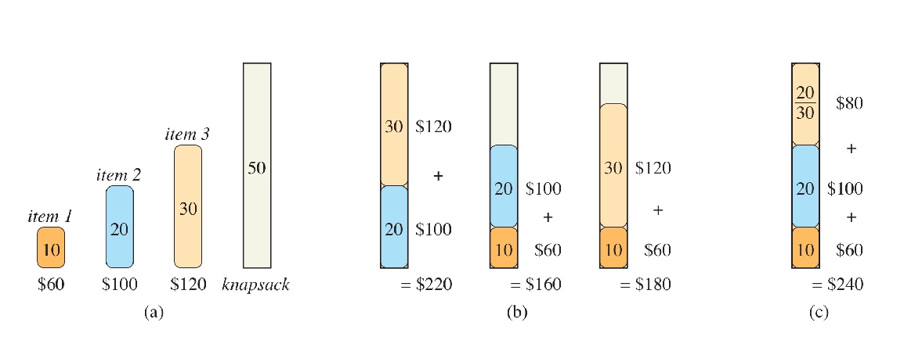

### 活动选择问题 (Activity Selection Problem)
#### 问题描述

- Schedule several competing activities $S = \{a_{1}, a_{2}, \ldots, a_{n}\}$ that require exclusive use of a common resource（安排几个需要独占使用公共资源的竞争活动）
- Each activity $a_i$ has a start time $s_i$ and a finish time $f_i$

	$$
	s_{i} < f_{i}
	$$

- Activities $a_{i}$ and $a_{j}$ are compatible if the intervals $[s_{i}, f_{i})$ and $[s_{j}, f_{j})$ do not overlap（如果区间  $[s_{i}, f_{i})$ 和  $[s_{j}, f_{j})$ 不重叠，则活动  $a_{i}$ 和  $a_{j}$ 是兼容的）

	$$
	s _ {i} \geq f _ {j} ~or~ s _ {j} \geq f _ {i}
	$$

- Goal: to select a maximum-size subset of mutually compatible activities（目标：选择一个最大规模的相互兼容的活动子集）
- Assume $f_{1} \leq f_{2} \leq \dots \leq f_{n}$

	| i | 1 | 2 | 3 | 4 | 5 | 6 | 7 | 8 | 9 | 10 | 11 |
	|---|---|---|---|---|---|---|---|---|---|----|----|
	| $s_i$ | 1 | 3 | 0 | 5 | 3 | 5 | 6 | 8 | 8 | 2 | 12 |
	| $f_i$ | 4 | 5 | 6 | 7 | 9 | 9 | 10 | 11 | 12 | 14 | 16 |

	-  $\{a_{1}, a_{4}, a_{8}, a_{11}\}$ is an optimal solution

#### DP solution

- 定义：
	- $S_{ij}$: The set of activities that start after activity $a_i$ finishes and that finish before activity $a_j$ starts（在活动  $a_i$ 结束后开始并在活动 $a_j$ 开始前结束的活动集合）
		- $S_{ij} = \{a_k\in S\colon f_i\leq s_k < f_k\leq s_j\}$
		- Activities that are compatible with $a_i$ and $a_j$（与活动  $a_i$ 和  $a_j$ 兼容的活动）
	-  $A_{ij}$ : The corresponding maximum-size set（相应的最大规模集合）
	- $c[i,j] = \left|A_{ij}\right|$ : the number of activities in $A_{ij}$（ $A_{ij}$ 中的活动数量）
- The recurrence:

	$$
	c[i,j] = \left\{ \begin{array}{ll} 0 & S_{ij} = \emptyset \\ \max \{c[i,k] + c[k,j] + 1\colon a_k\in S_{ij}\} & S_{ij}\neq \emptyset \end{array} \right.
	$$

- A bottom-up approach

#### Greedy solution

- Intuition: we maximize the number of compatible activities（直觉：我们最大化兼容活动的数量）
	- choose an activity that leaves the resource available for as many other activities as possible（选择一项活动，使剩余资源可用于尽可能多的其他活动）
- Choose the activity with the earliest finish time（选择最早完成时间的活动）
	- Once you make the greedy choice, you have only one remaining subproblem to solve（一旦你做出了贪心选择，你就只有一个剩下的子问题要解决）
	- Let $S_{k} = \{a_{i} \in S : s_{i} \geq f_{k}\}$ be the set of activities that start after activity $a_{k}$ finishes（让 $S_{k}$ 是在活动 $a_{k}$ 结束后开始的活动集合）
		- If we select $a_1$, then $S_1$ remains as the only subproblem to solve（如果我们选择  $a_1$ ，那么  $S_1$ 就是唯一需要解决的子问题）
- Consider any nonempty subproblem $S_{k}$, and let $a_{m}$ be an activity in $S_{k}$ with the earliest finish time. Then $a_{m}$ is included in some maximum-size subset of mutually compatible activities of $S_{k}$,（考虑任何非空子问题  $S_{k}$ ，并让  $a_{m}$ 是  $S_{k}$ 中具有最早完成时间的活动。然后  $a_{m}$ 被包含在  $S_{k}$ 的某个最大规模的相互兼容活动子集中。）
- A top-down approach

##### 基本思想

1. Choose the activity $a_{m}$ that finishes first（选择最先完成的活动  $a_{m}$ ）
2. Keep only the activities compatible with $a_{m}$（只保留与  $a_{m}$ 兼容的活动）
3. Repeat until no activities remain（重复直到没有活动剩下）

##### 算法伪代码

- Assume that the input activities are ordered by monotonically increasing finish time（假设输入活动按完成时间单调递增排序）

```
GREEDY_ACTIVITY_SELECTOR(s, f, n)
	A = {a_1}				   // 选择第一个活动
	k = 1
	for m = 2 to n do
		if s_m >= f_k then	  // 如果活动 a_m 与 a_k 兼容
			A = A ∪ {a_m}	   // 将活动 a_m 添加到选择的活动集合 A 中
			k = m			   // 更新最后选择的活动索引 k 为 m
	return A
```

$$
T(n) = \Theta(n)
$$

- 示例
	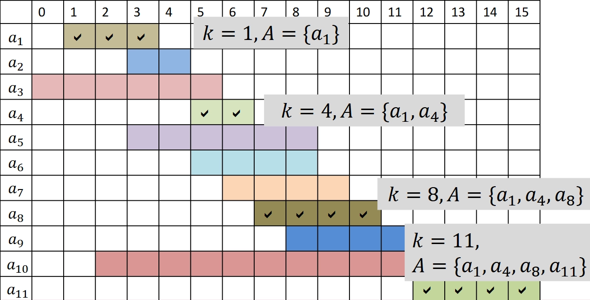

### 缓存置换问题 (The Cache Replacement Problem)
#### 问题描述

- There are a sequence of $n$ memory requests to data in blocks $b_{1}, b_{2}, \ldots, b_{n}$（有一系列对块 $b_i$ 中数据的内存请求）
- The cache starts out empty, and can hold up to some fixed number $k$ of cache blocks（缓存初始为空，最多可以容纳 $k$ 个缓存块）
- Each request causes at most one block to enter the cache and at most one block to be evicted from the cache（每个请求最多导致一个块进入缓存，最多一个块从缓存中被驱逐）
	1. Block $b_{i}$ is already in the cache (cache hit)（块  $b_{i}$ 已经在缓存中（缓存命中））
	2. Block $b_{i}$ is not in the cache at that time, but the cache contains fewer than $k$ blocks (cache misses)（块  $b_{i}$ 当时不在缓存中，但缓存中包含少于  $k$ 个块（缓存未命中））
	3. Block $b_{i}$ is not in the cache at that time and the cache is full (cache misses)（块  $b_{i}$ 当时不在缓存中，且缓存已满（缓存未命中））
- Goal: minimize the number of cache misses（目标：最小化缓存未命中的次数）
- **Offline version**: the entire request sequence is known in advance（离线版本：整个请求序列事先已知）

#### 贪心策略

- The solution is simple: **furthest-in-future**（未来最远）
	- Evict the block in the cache whose next access in the request sequence comes furthest in the future（驱逐缓存中下一个访问请求序列中最远的块）
- 示例：$k = 3$ and the request sequence is：s, q, s, p, r, s, q, p, r, q
	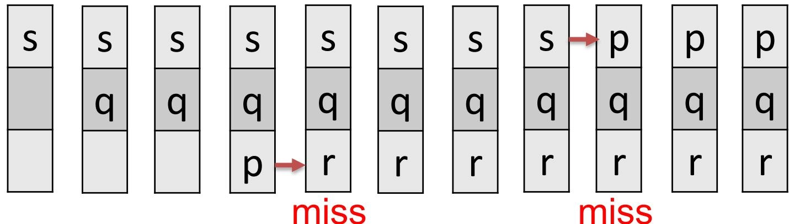

#### 最优子结构

- Subproblem $(C, i)$ : processing requests for blocks $b_{i}, b_{i+1}, \ldots, b_{n}$ with cache configuration $C$（子问题 $(C, i)$：请求序列 $b_{i}, b_{i+1}, \ldots, b_{n}$，缓存状态 $C$）
- A solution to subproblem $(C, i)$ is a sequence of decisions that specifies which blocks to evict（子问题  $(C, i)$ 的解决方案是一系列决策，指定要驱逐哪些块）
	- An optimal solution $S$ minimizes the number of cache misses（最优解使得缓存未命中的次数最少）
- Consider an optimal solution $S$ to subproblem $(C, i)$（考虑子问题  $(C, i)$ 的最优解  $S$ ）
	- let $C^\prime$ be the contents of the cache after processing the request for block $b_i$（让  $C^\prime$ 是处理块  $b_i$ 请求后的缓存内容）
	- Let $S^\prime$ be the sub-solution of $S$ for the resulting subproblem $(C^\prime, i + 1)$（让  $S^\prime$ 是子问题  $(C^\prime, i + 1)$ 的 $S$ 的子解）
- 分情况讨论
	- Case I: cache hit
		- the cache remains unchanged,  $C = C^{\prime}$
	- Case II: cache miss
		- $C \neq C^{\prime}$
		- $S^\prime$ is an optimal solution to subproblem $(C^\prime, i + 1)$

#### 贪心选择性质

- Consider a subproblem $(C, i)$ when the cache $C$ contains $k$ blocks (it is full) and a cache miss occurs（考虑子问题  $(C, i)$ ，当缓存  $C$ 包含  $k$ 个块（已满）并且发生缓存未命中时）
- When block $b_{i}$ is requested, let $z = b_{m}$ be the block in $C$ whose next access is furthest in the future（当请求块  $b_{i}$ 时，让 $z = b_{m}$ 是位于 $C$ 中的下一个访问最远的块）
	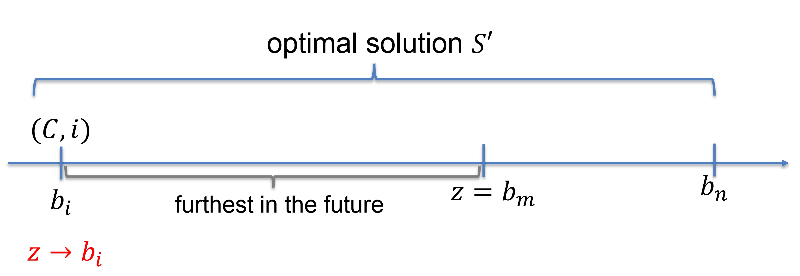

- Theorem: Evicting block $z$ upon a request for block $b_{i}$ is included in some optimal solution for the subproblem $(C, i)$（在请求块  $b_{i}$ 时驱逐块  $z$ 包含在子问题  $(C, i)$ 的某个最优解中）
- Let $S$ be an optimal solution to subproblem $(C, i)$
	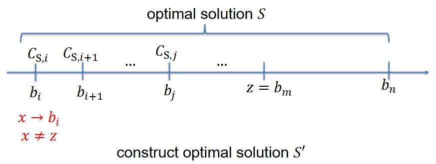

- 基本思想
	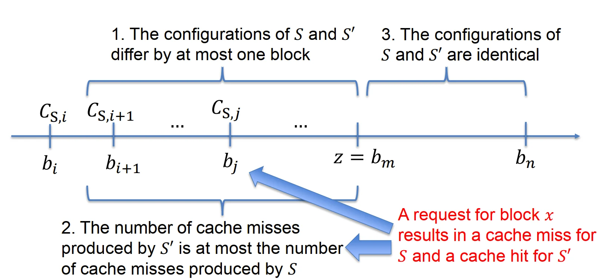

	1. Before $z$:
		- the configurations of $S$ and $S^{\prime}$ differ by at most one block（ $S$ 和  $S^{\prime}$ 的配置最多相差一个块）
		- The number of cache misses in $S^{\prime}$ is at most the number of cache misses in $S$（ $S^{\prime}$ 中的缓存未命中次数最多为 $S$ 中的缓存未命中次数）
	2. after $z$:
		- $S$ and $S^{\prime}$ have the same configuration（ $S$ 和  $S^{\prime}$ 具有相同的配置）