# 顺序算法──图算法

- [Back to Course Home](index.md)

## 最小生成树 (Minimum Spanning Trees)
### 最小生成树概述

- 应用
	- Telecommunications networks（电信网络）
	- Computer networks（计算机网络）
	- Electronic circuit designs（电子电路设计）
	- Others

#### 基本定义

- A connected, undirected graph $G(V,E)$, where $V$ is the set of nodes and $E$ is the set of possible interconnections between pairs of nodes（一个连通的无向图 $G(V,E)$，$V$ 是节点集合，$E$ 是节点对之间可能的连接集合）
	- $E$ can be an adjacency list or an adjacency matrix（ $E$ 可以是邻接表或邻接矩阵）
- For each edge $(u, v) \in E$, a weight $w(u, v)$ specifies the cost to connect $u$ and $v$ (distance, amount of wires, etc.)（对于每条边  $(u, v) \in E$, 权重  $w(u, v)$ 指定连接  $u$ 和  $v$ 的成本）
- Goal: Find an acyclic subset $T \subseteq E$ that connects all of the vertices and whose total weight $w(T)$ is minimized（寻找一个无环子集  $T \subseteq E$ ，连接所有顶点且总权重最小）

	$$
	w (T) = \sum_ {(u, v) \in T} w (u, v)
	$$

-  $T$ is acyclic and connects all of the vertices（$T$ 无环且连接所有顶点）
	- $T$ must form a tree (a spanning tree)（$T$ 必须形成一棵树（生成树））
	- $T$ has $|V|-1$ edges（$T$ 有 $|V|-1$ 条边）
- 示例：
	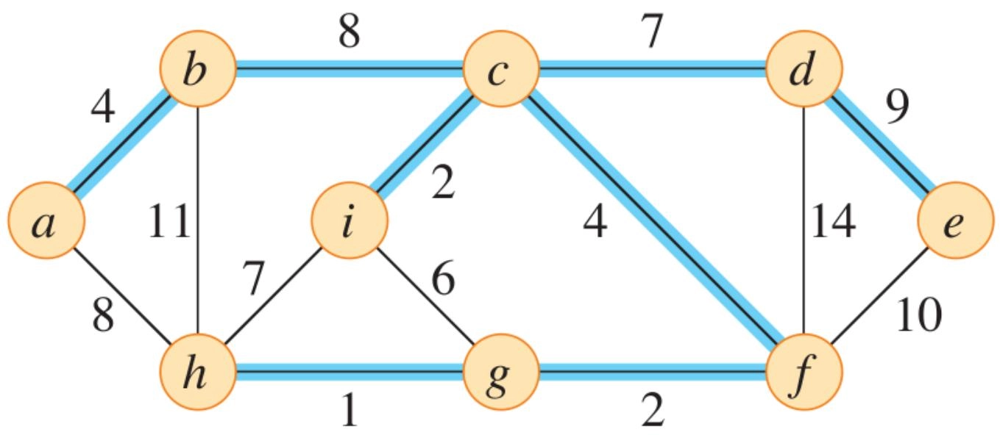

#### 最小生成树通用算法 (MST Generic Method)

- **Greedy**
	- Intuition: grows the minimum spanning tree one edge at a time（直觉：每次增长最小生成树的一条边）
	- select edges based on their weights and handle cycles（根据权重选择边并处理环）
- 通用算法：
	```
	GENERIC-MST(G, w)
		A = ∅  # 初始化边集A为空
		while A does not form a spanning tree
			find an edge (u, v) that is safe for A
			A = A ∪ {(u, v)}
		return A
	```

- How do you find a safe edge?
	- An edge $(u, v)$ is safe for a set $A$ of edges if $A \cup \{(u, v)\}$ is also a subset of some minimum spanning tree（如果  $A \cup \{(u, v)\}$ 也是某个最小生成树的子集，则边  $(u, v)$ 对于边集  $A$ 是安全的）
	- To find a safe edge, we use the cut property of minimum spanning trees（为了找到一条安全边，我们使用最小生成树的割属性）

#### 安全边定理
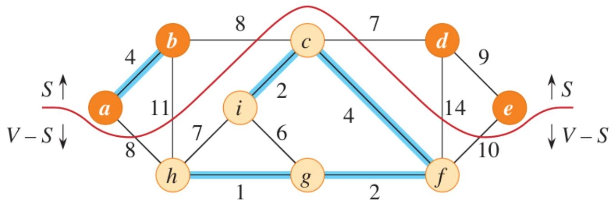

- 基本定义
	- A cut $(S, V - S)$ of an undirected graph $G(V, E)$ is a **partition** of $V$（无向图 $G(V, E)$ 的割 $(S, V - S)$ 是 $V$ 的一个划分）
	- An edge $(u, v) \in E$ **crosses** the cut $(S, V - S)$ if one of its endpoints belongs to $S$ and the other belongs to $V - S$（如果边 $(u, v) \in E$ 的两个端点分别属于  $S$ 和 $V - S$ ，则该边跨越割 $(S, V - S)$）
	- A cut **respects** a set $A$ of edges if no edge in $A$ crosses the cut（如果 $A$ 中没有边跨越该割，则称该割尊重边集 $A$ ）
	- An edge is a **light edge** crossing a cut if its weight is the minimum of any edge crossing the cut（如果一条边的权重是跨越该割的任何边的最小值，则该边是跨越该割的轻边）
- **安全边定理**：Edge $(u,v)$ is safe for $A$ if,
	1. Let $G(V, E)$ be a connected, undirected graph with a real-valued weight function $w$ defined on $E$ ;（设  $G(V, E)$ 是一个连通的无向图，实值权重函数  $w$ 定义在  $E$ 上）
	2. let $A$ be a subset of $E$ that is included in some minimum spanning tree for $G$ ;（设  $A$ 是  $E$ 的一个子集，包含在  $G$ 的某个最小生成树中）
	3. let $(S,V - S)$ be any cut of $G$ that respects $A$ ;（设 $(S,V - S)$ 是 $G$ 的任意尊重  $A$ 的割）
	4. let $(u, v)$ be a light edge crossing $(S, V - S)$,（令 $(u, v)$ 是跨越  $(S, V - S)$ 的轻边）

- 证明：
	- Assume $T$ is a minimum spanning tree (MST) that includes $A$ and $(u, v) \notin T$,（假设  $T$ 是包含  $A$ 的最小生成树，且  $(u, v) \notin T$。）
	- We now construct another MST $T^\prime$ that includes $A \cup \{(u, v)\}$（我们现在构造另一个包含  $A \cup \{(u, v)\}$ 的最小生成树 $T^\prime$。）
	- At least one edge $(x, y)$ in $T$ in the path $p$ crosses the cut $(S, V - S)$（在路径  $p$ 中，$T$ 中至少有一条边  $(x, y)$ 跨越割 $(S, V - S)$）
	- $T^{\prime} = (T - \{(x,y)\})\cup \{(u,v)\}$
		- Since $w(u,v)\leq w(x,y)$, we have $w(T^{\prime}) \leq w(T)$（由于  $w(u,v)\leq w(x,y)$ ，我们有  $w(T^{\prime}) \leq w(T)$ ）
		- Since $T$ is a minimum spanning tree, we have $w(T^{\prime}) = w(T)$（由于  $T$ 是最小生成树，我们有  $w(T^{\prime}) = w(T)$ ）
		- Thus, $T^{\prime}$ is also a minimum spanning tree that contains $A \cup \{(u, v)\}$（因此，$T^{\prime}$ 也是最小生成树，且包含 $A \cup \{(u, v)\}$）

	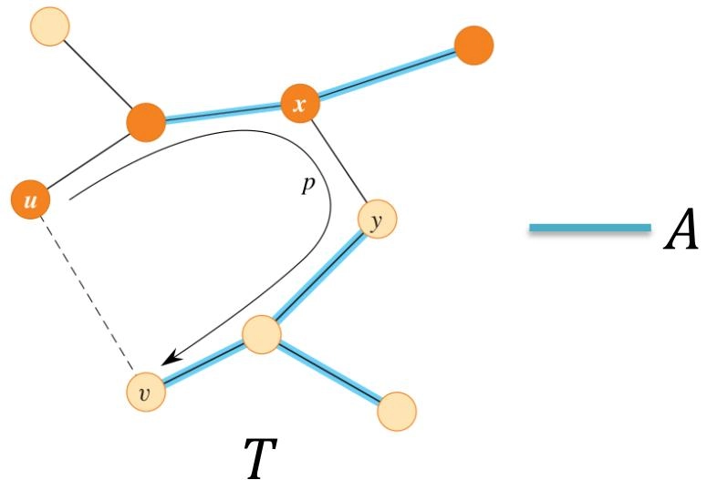

### Prim 算法
#### 概述

- 概述：
	- The edges in the set $A$ always form a single tree（边集  $A$ 总是形成一棵单一的树）
	- The tree starts from an arbitrary root vertex $r$ and grows until it spans all the vertices in $V$（树从任意根节点  $r$ 开始生长，直到覆盖  $V$ 中的所有顶点）
	- Each step adds to the tree $A$ an edge that connects $A$ to an **isolated** vertex with the minimum weight（每一步向树 $A$ 添加一条具有最小权重的边，将 $A$ 连接到孤立顶点）
		- This rule adds only edges that are safe for $A$ （该规则仅添加对  $A$ 安全的边）
- A **greedy** algorithm
- 示例：
	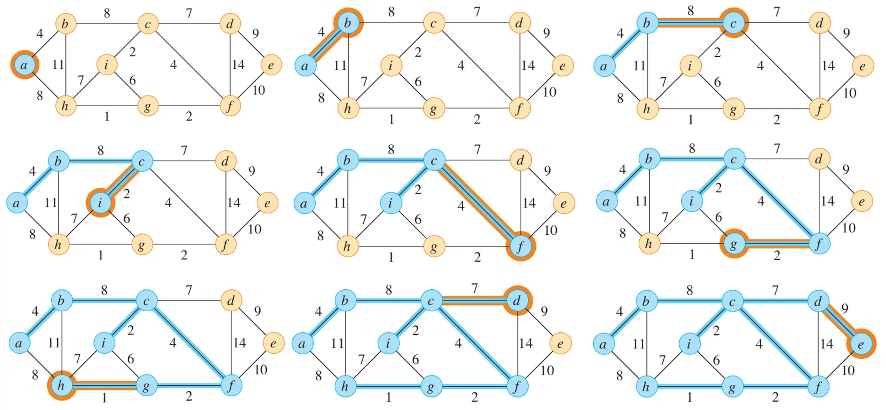

- Maintain a min-priority queue $Q$ of all vertices that are not in the tree（维护一个包含所有不在树中的顶点的最小优先队列  $Q$ ）
	- The minimum weight of any edge connecting $v$ to a vertex in the tree（连接  $v$ 到树中顶点的任何边的最小权重）

#### 算法伪代码
```
MST_PRIM(G, w, r)						   // Prim 最小生成树算法
	for each u in G.V					   // 初始化所有顶点
		u.key = ∞
		u.parent = NIL
	r.key = 0
	Q = ∅
	for each u in G.V
		INSERT(Q, u)
	while Q is not empty
		u = EXTRACT-MIN(Q)				  // 从优先队列中提取最小 key 的顶点 u
		for each v in G.Adj[u]			  // 遍历 u 的所有邻接顶点 v
			if v in Q and w(u, v) < v.key   // 如果 v 在队列中且边 (u, v) 的权重小于 v 的当前 key
				v.parent = u				// 更新 v 的父节点为 u
				v.key = w(u, v)			 // 更新 v 的 key 为边 (u, v) 的权重
				DECREASE-KEY(Q, v, v.key)   // 按 key 下降更新优先队列 Q 中顶点 v 的位置
```

#### 最小/最大优先队列 (Min/Max-Priority Queue)
##### 定义
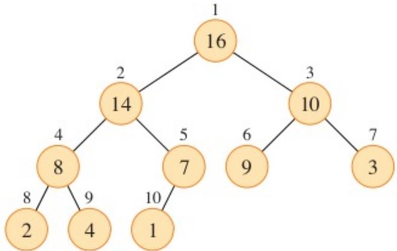

- (Binary) heap: a nearly complete binary tree（二叉堆：一个近似完全二叉树）
- The value of a node is at most (at least) the value of its parent（节点的值小于等于（大于等于）其父节点的值）

##### 算法伪代码
###### Basic Heap Operations
```
PARENT(i)
	return floor(i / 2)				 // 返回节点 i 的父节点索引
LEFT(i)
	return 2 * i						// 返回节点 i 的左子节点索引
RIGHT(i)
	return 2 * i + 1					// 返回节点 i 的右子节点索引
```

###### Max-Heap Operations
```
MAX-HEAP-MAXIMUM(A)					 // 返回堆中的最大元素
	if A.heap_size < 1
		error "heap underflow"
	return A[1]						 // 堆顶元素即为最大值
```
```
MAX-HEAPIFY(A, i)					   // 维护最大堆性质
	l = LEFT(i)						 // 获取左子节点索引
	r = RIGHT(i)						// 获取右子节点索引
	if l <= A.heap_size and A[l] > A[i]
		largest = l					 // 左子节点较大
	else
		largest = i					 // 当前节点较大
	if r <= A.heap_size and A[r] > A[largest]
		largest = r					 // 右子节点较大
	if largest != i
		exchange A[i] with A[largest]   // 交换当前节点与较大子节点
		MAX-HEAPIFY(A, largest)		 // 递归调整子树
```

$$
T(n) = O(\log n)
$$

```
MAX-HEAP-EXTRACT-MAX(A)				 // 从堆中提取并返回最大元素
	max = MAX-HEAP-MAXIMUM(A)		   // 获取堆中的最大元素
	A[1] = A[A.heap_size]			   // 用堆的最后一个元素替换堆顶
	A.heap_size = A.heap_size - 1	   // 减小堆的大小
	MAX-HEAPIFY(A, 1)				   // 从堆顶开始调整堆
	return max						  // 返回最大值
```

$$
T(n) = O(\log n)
$$

```
MAX-HEAP-INCREASE-KEY(A, x, k)		  // 把堆中元素 x 的值增加到 k
	if k < A[x].key
		error "new key is smaller than current key"
	A[x].key = k						// 更新元素 x 的值为 k
	while x > 1 and A[PARENT(x)].key < A[x].key // 向上调整堆
		exchange A[x] with A[PARENT(x)] // 交换当前节点与其父节点
		x = PARENT(x)				   // 移动到父节点位置
```

$$
T(n) = O(\log n)
$$

```
MAX-HEAP-INSERT(A, key)				// 向堆中插入新元素 key
	A.heap_size = A.heap_size + 1	   // 增加堆的大小
	A[A.heap_size] = -∞				 // 在堆的末尾插入一个极小值
	MAX-HEAP-INCREASE-KEY(A, A.heap_size, key) // 将新元素的值增加到 key
```

$$
T(n) = O(\log n)
$$

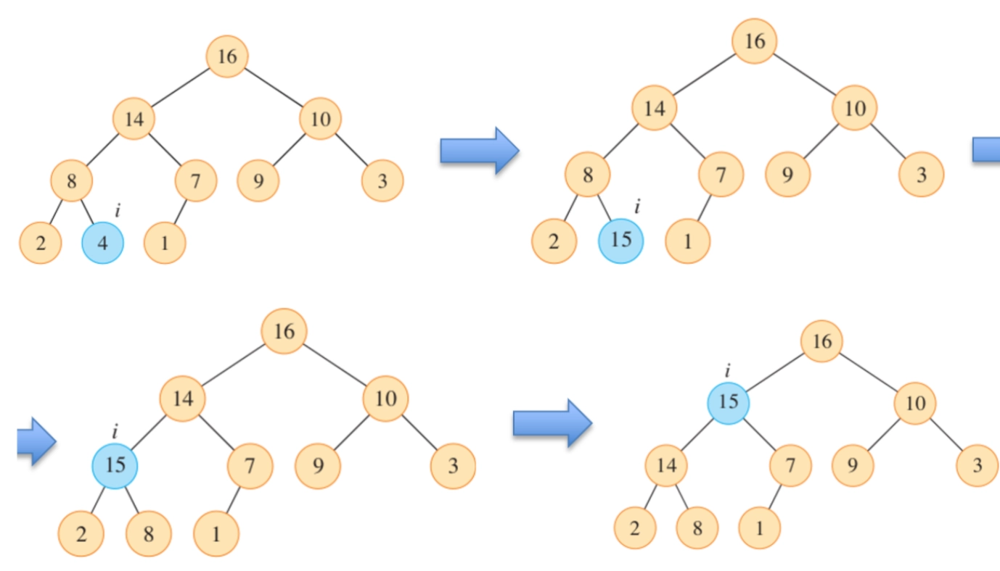

#### 时间复杂度

- The total time for Prim's algorithm is $O(E \log V)$
	- Initialization for all vertices: $O(V)$
	- `EXTRACT-MIN` operations: $|V|$ times, $O(V \log V)$
	- Update keys: $O(E)$ times, $O(E \log V)$

### Kruskal 算法
#### 概述

- 概述
	1. Initially, $|V|$ trees in the forest（最初，森林中有  $|V|$ 棵树）
	2. Find a **safe** edge to add by finding, of all the edges that **connect any two trees** in the forest, an edge $(u, v)$ with the minimum weight（通过在森林中连接任意两棵树的所有边中找到权重最小的边  $(u, v)$ 来找到一条安全边进行添加）
	3. Repeat until there is only one tree（重复直到只有一棵树）
- A **greedy** algorithm
- 示例
	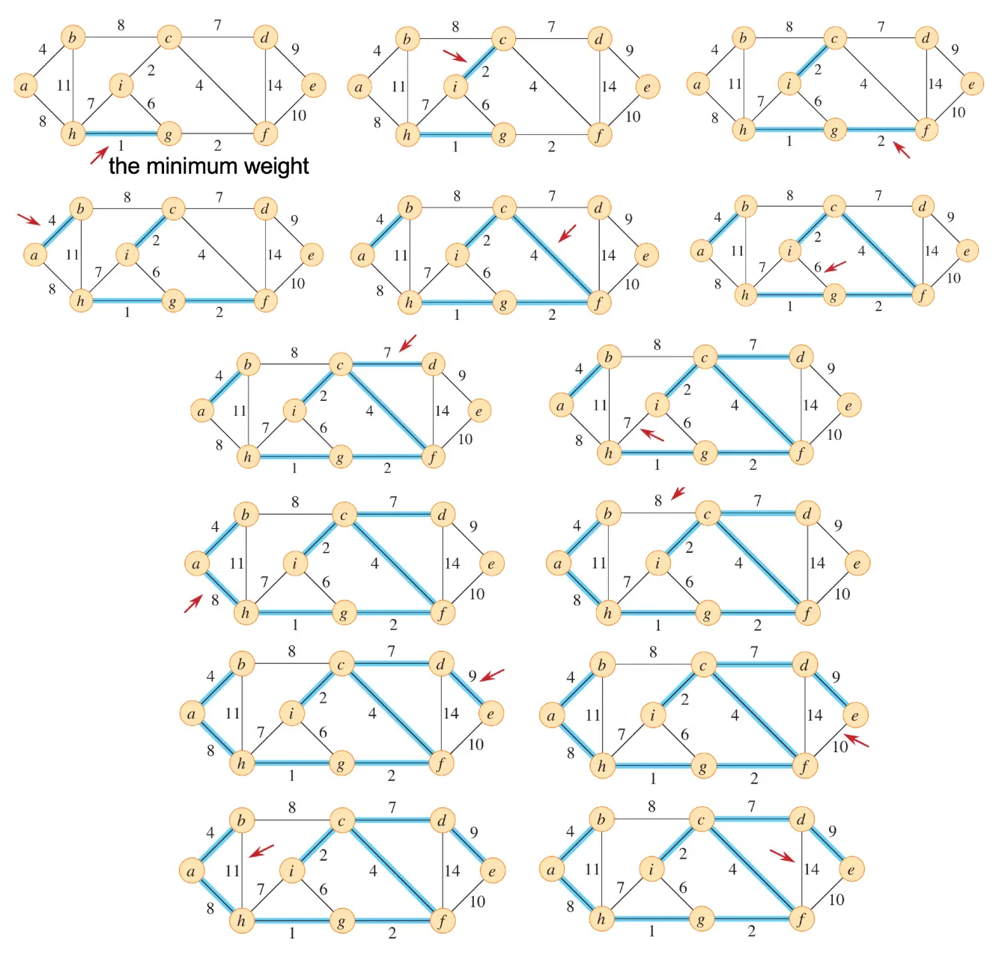

#### 算法伪代码
```
MST_KRUSKAL(G, w)							   // Kruskal 最小生成树算法
	A = ∅									  // 初始化边集 A 为空
	for each vertex v in G.V					// 初始化每个顶点为单独的集合
		MAKE-SET(v)
	edges = all edges in G.E sorted by weight   // 按权重排序所有边
	for each edge (u, v) in edges			   // 遍历排序后的边
		if FIND-SET(u) ≠ FIND-SET(v)			// 如果边 (u, v) 的两个端点属于不同集合
			A = A ∪ {(u, v)}				   // 将边 (u, v) 添加到边集 A 中
			UNION(u, v)						 // 合并两个集合
	return A									// 返回最小生成树的边集 A
```

#### 不相交集数据结构 (Disjoint-set data structure)

- Group $n$ distinct elements into a collection of disjoint sets（将  $n$ 个不同的元素分组为不相交的集合）
	- with no elements in common（没有共同元素）
- A collection of $S = \{S_1, S_2, \ldots, S_n\}$ of disjoint **dynamic** sets（不相交动态集合的集合  $S = \{S_1, S_2, \ldots, S_n\}$ ）
- To identify each set, choose a representative, which is some member of the set（为了识别每个集合，选择一个代表，它是集合中的某个成员）
	- E.g., choosing the smallest member in the set（例如，选择集合中最小的成员）
- Three operations:
	1. `MAKE-SET(x)`: creates a new set whose only member is $x$（创建一个新集合，其唯一成员是  $x$ ）
		- Also the representative（也是集合的代表）
	2. `UNION(x, y)`: unites two disjoint, dynamic sets that contain $x$ and $y$ into a new set that is the union of these two sets（联合包含  $x$ 和  $y$ 的两个不相交的动态集合，形成一个新的集合，该集合是这两个集合的并集）
	3. `FIND-SET(x)`: returns a pointer to the representative of the unique set containing $x$ （返回指向包含  $x$ 的唯一集合的代表的指针）
- There are $n$ `MAKE-SET` operations and at most $n - 1$ `UNION` operations（有  $n$ 个 MAKE-SET 操作和最多  $n - 1$ 个 UNION 操作）

##### 不相交集森林 (Disjoint-set forests)

- A fast implementation of disjoint sets represents sets by trees（不相交集的快速实现：通过树来表示集合）
	- **Each tree represents one set**（每棵树代表一个集合）
	- Each member points only to its parent（每个成员只指向其父节点）
	- The root contains the representative（根节点包含代表）
- Heuristic #1: union by rank（启发式方法＃1：按秩联合）
	- Rank: an upper bound on the height of the node（秩：节点高度的上限）
	- The root with smaller rank points to the root with larger rank（较小秩的根指向较大秩的根）
- Heuristic #2: path compression（启发式方法＃2：路径压缩）
	- The `FIND-SET` procedure updates each node to point directly to the root（FIND-SET 过程更新每个节点以直接指向根节点）

##### 算法伪代码
###### Union by Rank
```
UNION(x, y)						 // 合并包含 x 和 y 的两个集合
	LINK(FIND-SET(x), FIND-SET(y))

LINK(x, y)						  // 按秩联合两个集合的根节点 x 和 y
	if x.rank > y.rank			  // 如果 x 的秩大于 y 的秩
		y.p = x					 // y 指向 x
	else:
		x.p = y					 // 反之 x 指向 y，并更新秩
		if x.rank == y.rank
			y.rank = y.rank + 1
```

- `UNION(c, f)`
	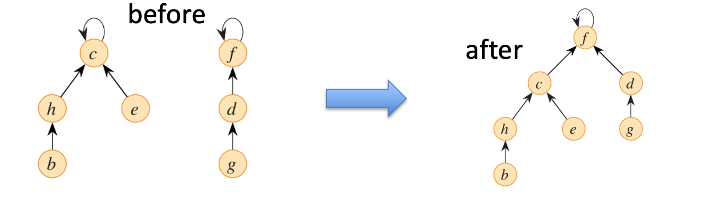

###### Path Compression
```
MAKE-SET(x)					 // 创建一个新集合，包含唯一成员 x
	x.p = x
	x.rank = 0				  // 初始化秩为 0

FIND-SET(x)
	if x != x.p				 // 如果 x 不是根节点
		x.p = FIND-SET(x.p)	 // 更新父节点为树的根节点
	return x.p				  // 返回集合的代表：根节点
```

- `FIND-SET(a)`
	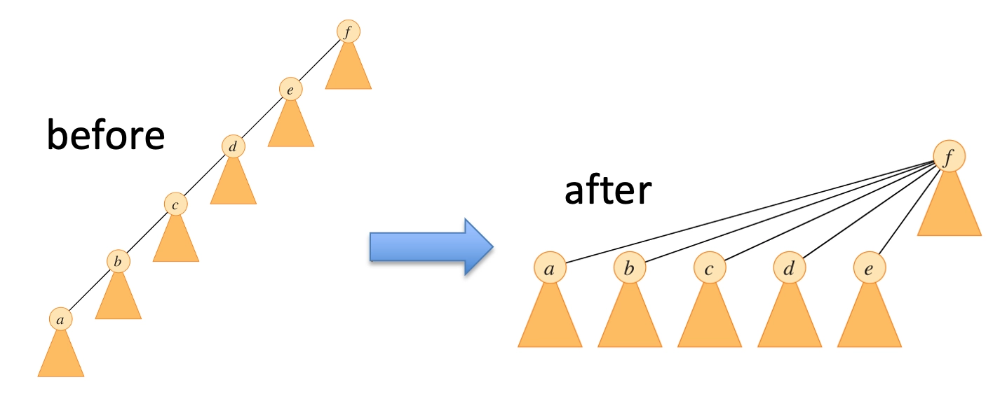

##### 时间复杂度

- The worst-case running time of the disjoint-set-forest:  $O(m\alpha(n))$
	- $n$ is the number of elements（元素数量）
	- $m$ is the total number of operations（操作总数）
	- $\alpha (n)$ is a very slowly growing function（增长极慢的反阿克曼函数）
	- $\alpha (n)\leq 4$ for all practical purposes（在所有实际应用中，$\alpha (n)$ 不超过 4）

#### 时间复杂度

- The running time of Kruskal's algorithm:  $O(E \log V)$
	- `MAKE-SET` operations: $O(V)$
	- Sorting:  $O(E \log E) = O(E \log V)$
	- `FIND-SET` operations: $O(E)$
	- `UNION` operations: $O(V)$
	- The worst-case running time of the disjoint-set-forest: $O\big ((E + V) \alpha (V) \big)$

## 最短路径 (Shortest Paths)
### 最短路径概述

- 应用
	- Road networks（道路网络）
	- Logistics（物流）
	- Communications（通信）
	- Others
- 分类
	- **Single-source shortest-paths problem**（单源最短路径问题）
	- Single-destination shortest-paths problem（单目的地最短路径问题）
		- reversing the direction of each edge in the graph（通过反转图中每条边的方向，将其转换为单源最短路径问题）
	- Single-pair shortest-path problem（单对最短路径问题）
		- a part of the single-source shortest-paths problem（单源最短路径问题的一部分）
	- All-pairs shortest-paths problem（全源最短路径问题）

#### 基本定义

- A weighted, directed graph $G(V,E)$（加权有向图）
- For each edge $(u, v) \in E$, a weight $w(u, v)$ specifies the cost to connect $u$ and $v$
	- $w \colon E \to \mathbb{R}$ mapping edges to real-valued weights（将边映射到实值权重）
- The weight $w(p)$ of path $p = \langle v_0, v_1, \dots, v_k \rangle$ is the sum of the weights of its constituent edges（路径的权重是其组成边的权重之和）

	$$
	w (p) = \sum_{1}^{k} w(v_{i - 1}, v_{i})
	$$

- The shortest-path weight from $u$ to $v$ is（从  $u$ 到  $v$ 的最短路径权重是）

	$$
	\delta (u, v) = \left\{ \begin{array}{ll} \min \{w (p) \colon u \xrightarrow {p} v \} & \exists~p: u \xrightarrow {p} v \\ \infty & \text{otherwise} \end{array} \right.
	$$

- A shortest path from vertex $u$ to vertex $v$ is then defined as any path $p$ with weight $w(p) = \delta(u, v)$(从顶点  $u$ 到顶点  $v$ 的最短路径被定义为权重为  $w(p) = \delta(u, v)$ 的任何路径  $p$ )

#### 负权边与负权环 (Negative-weight edges and cycles)

- A graph is well-defined if no negative-weight cycle reachable from the source $s$ exists（如果不存在从源 $s$ 可达的负权环，则图是良定义的）
	- Not well-defined $\rightarrow \delta (u,v) = -\infty$
- Any shortest path contains at most $|V| - 1$ edges（任何最短路径最多包含  $|V| - 1$ 条边）
	- No positive-weight cycle

### Dijkstra 算法

- Solves the **single-source shortest-paths problem** for a graph with nonnegative edge weights（解决具有非负边权的图的单源最短路径问题）
- a Greedy algorithm（贪心算法）

#### 最优子结构

- Let $p = \langle v_0, v_1, \dots, v_k \rangle$ be a shortest path from vertex $v_0$ to vertex $v_k$,（设  $p$ 是从顶点  $v_0$ 到顶点  $v_k$ 的最短路径）
- For any $i$ and $j$ such that $0 \leq i \leq j \leq k$, let $p_{ij} = \left\langle v_i, v_{i+1}, \ldots, v_j \right\rangle$ be the subpath of $p$ from vertex $v_i$ to vertex $v_j$（对于  $0 \leq i \leq j \leq k$ 的任何  $i$ 和  $j$ ，设  $p_{ij}$ 是从顶点  $v_i$ 到顶点  $v_j$ 的子路径）
- Then $p_{ij}$ is a shortest path from $v_i$ to $v_j$,（则  $p_{ij}$ 是从  $v_i$ 到  $v_j$ 的最短路径）

#### 松弛 (Relaxation)

- Relaxation is the process of continually decreasing the shortest-path estimates by finding better paths（松弛是通过寻找更好的路径不断降低最短路径估计值的过程）
- Attribute $v.d$ : a shortest-path estimate（属性  $v.d$ ：最短路径估计值）
	- An upper bound on the weight of a shortest path to $v$（到 $v$ 的最短路径权重的上限）
- Attribute $v.\pi$: a predecessor（属性  $v.\pi$ ：前驱）
	- The chain of predecessors runs backward along a shortest path（前驱链沿着最短路径向后运行）
- The process of relaxing an edge $(u, v)$ consists of testing whether going through vertex $u$ improves the shortest path to vertex $v$（松弛边  $(u, v)$ 的过程包括测试通过顶点  $u$ 是否改善了到顶点  $v$ 的最短路径）
- 算法伪代码:
	```
	INITIALIZE-SINGLE-SOURCE(G, s)  // 单源初始化
		for each vertex v in G.V
			v.d = ∞
			v.pi = NIL
		s.d = 0

	RELAX(u, v, w)				  // 松弛操作，u 是起点，v 是终点，w 是权重函数
		if v.d > u.d + w(u, v)
			v.d = u.d + w(u, v)
			v.pi = u
	```
	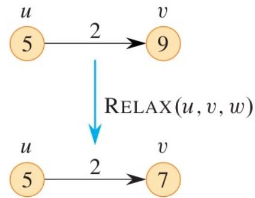

#### 基本思路

- Assume nonnegative weights on all edges（假设所有边的权重均为非负）

	$$
	\forall (u,v) \in E, w(u,v) \geq 0
	$$

- Generalizing breadth-first search (**BFS**) to weighted graphs（将 BFS 泛化为加权图）
- The algorithm maintains a set of vertices $S$, whose final shortest-path weights have already been determined（该算法维护一个顶点集  $S$ ，其最终最短路径权重已确定）
- 主要步骤
	1. Selects the vertex $u \in V - S$ with the minimum shortest-path estimate（从 $V - S$ 中选择具有最小最短路径估计值的顶点 $u$）
		- Using a min-priority queue $Q$ instead of a FIFO queue（使用最小优先队列  $Q$ 代替 FIFO 队列）
		- The key of each vertex $v$ in $Q$ is the shortest-path estimate $v.d$ （队列中每个顶点  $v$ 的键是最短路径估计值  $v.d$ ）
	2. Relaxes all edges leaving $u$（松弛 $u$ 的所有出边）
	3. Repeat the above procedure $|V|$ times（重复上述过程  $|V|$ 次）

#### 算法伪代码
```
DIJKSTRA(G, w, s)					   // G 是图，w 是权重函数，s 是源顶点
	INITIALIZE-SINGLE-SOURCE(G, s)
	S = ∅							   // 已确定最短路径权重的顶点集
	Q = ∅							   // 最小优先队列
	for each vertex v in G.V			// 将所有顶点插入最小优先队列 Q
		INSERT(Q, v)
	while Q ≠ ∅
		u = EXTRACT-MIN(Q)			  // 从 Q 中提取具有最小 d 值的顶点 u
		S = S ∪ {u}					 // 将 u 添加到 S 中
		for each vertex v in Adj[u]	 // 松弛 u 的所有出边
			RELAX(u, v, w)
	return
```
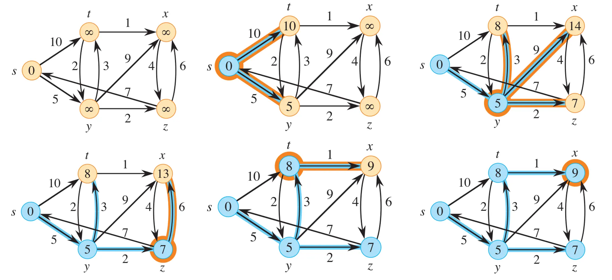

#### 正确性

- 每次从未确定最短路径的顶点集合中选出 $d$ 最小的顶点 $u$，而一旦 $u$ 被取出，就认为 $u.d$ 已经是最短距离，不再更新。
- 我们要证明：这个“一旦取出就确定”的做法是正确的。

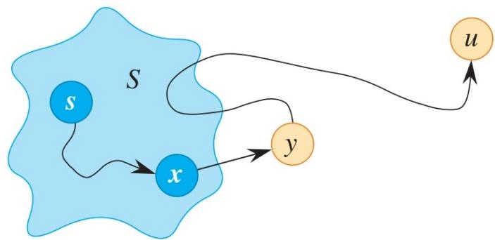

##### 收敛性质

- Convergence property: if $s \xrightarrow{p} x \to y$ is a shortest path for some $x, y \in V$, and if $x.d = \delta(s, x)$ at any time prior to relaxing edge $(x, y)$, then $y.d = \delta(s, y)$ at all times afterward（收敛性质：如果 $s \xrightarrow{p} x \to y$ 是某些 $x, y \in V$ 的最短路径，并且如果在松弛边 $(x, y)$ 之前的任何时间 $x.d = \delta(s, x)$ ，那么在之后的所有时间 $y.d = \delta(s, y)$ ）
	- after relaxing edge $(x, y)$, we have $y.d \leq x.d + w(x,y) = \delta(s,x) + w(x,y) = \delta(s,y)$
		- Optimal substructure: $\delta(s,x) + w(x,y) = \delta(s,y)$
	- and $y.d \geq \delta(s,y)$
	- Thus, $y.d = \delta(s,y)$

##### 边权重均为正的情况

$$
\forall (u,v) \in E, w(u,v) > 0
$$

- 我们需要证明在每次迭代开始时，对于所有 $v\in S$，都有 $v.d = \delta(s,v)$（数学归纳法）
	- 对于初始状态，$S = \{s\}$，$s.d = 0 = \delta(s,s)$，显然成立
	- 假设第 $k$ 次迭代开始前，对于所有 $v\in S$，都有 $v.d = \delta(s,v)$ 成立
	- 在第 $k$ 次迭代开始前，算法将 $u$ 添加到 $S$，我们需要证明 $u.d = \delta (s,u)$（反证法）
		- 假设 $u.d \neq \delta (s,u)$，则 $u.d > \delta (s,u)$，则存在一条从 $s$ 到 $u$ 的最短路径 $s \xrightarrow{p} u$，且 $w(p) = \delta (s,u)$
		- 设 $y$ 是从 $s$ 到 $u$ 的最短路径 $p$ 上第一个不在 $S$ 中的顶点，即 $s \xrightarrow{p} x \to y$，若 $y \neq u$
			1. $y$ 在 $s$ 到 $u$ 的最短路径上，有 $\delta (s,y) < \delta (s,u)$
			2. 在这轮迭代中我们选择了 $u$，则 $u.d \leq y.d$
			3. 此前当 $x$ 被添加时，边 $(x, y)$ 被松弛，根据收敛性质， $y.d = \delta (s,y)$
		- 综上，$\delta (s,y) < \delta (s,u) < u.d \leq y.d = \delta (s,y)$，矛盾，故 $u.d = \delta (s,u)$

##### 边权重均为非负的情况

$$
\forall (u,v) \in E, w(u,v) \geq 0
$$

- We prove that at the start of each iteration $v.d = \delta(s,v)$ for all $v\in S$（我们证明在每次迭代开始时，对于所有 $v\in S$ ，都有 $v.d = \delta(s,v)$ ）
	- Proof by induction
- In each iteration, the algorithm adds $u$ into $S$（在每次迭代中，算法将 $u$ 添加到 $S$ ）
	- we prove that $u.d = \delta(s,u)$（我们证明 $u.d = \delta(s,u)$ ）
- Let $y$ be the first vertex on a shortest path from $s$ to $u$ that is not in $S$（设 $y$ 是从 $s$ 到 $u$ 的最短路径上第一个不在 $S$ 中的顶点）
	- Thus, $\delta (s,y)\leq \delta (s,u)$
- Also, $\delta (s,u)\leq u.d$ and $u.d\leq y.d$
	- because we add $u$
- $\delta (s,y)\leq \delta (s,u)\leq u.d\leq y.d$
- Edge $(x, y)$ was relaxed when $x$ was added（当 $x$ 被添加时，边 $(x, y)$ 被松弛）
- Convergence property: if $s \xrightarrow{p} x \to y$ is a shortest path for some $x, y \in V$, and if $x.d = \delta(s, x)$ at any time prior to relaxing edge $(x, y)$, then $y.d = \delta(s, y)$ at all times afterward
	- Proof: $y.d \leq x.d + w(x,y) = \delta(s,x) + w(x,y) = \delta(s,y)$
	- Optimal substructure
- Since $\delta (s,y)\leq \delta (s,u)\leq u.d\leq y.d$ and $y.d \leq \delta (s,y)$
	- $\delta (s,y) = \delta (s,u) = u.d = y.d$

#### 时间复杂度

- The algorithm calls both `INSERT` and `EXTRACT-MIN` once per vertex（算法对每个顶点调用 INSERT 和 EXTRACT-MIN）
	- `INSERT` and `EXTRACT-MIN` operations: $|V|$ times
- Each edge in the adjacency list $Adj[u]$ is examined and relaxed once. Thus, the algorithm calls `RELAX` $|E|$ times, which may lead to calls to `DECREASE-KEY`（邻接表 $Adj[u]$ 中的每条边都被检查和松弛一次。因此，算法调用 RELAX $|E|$ 次，这可能会导致调用 DECREASE-KEY）
	- `DECREASE-KEY`: $O(|E|)$ times
- Simple implementation of min-priority queue $Q$（最小优先队列 $Q$ 的简单实现）
	- Store $v.d$ in the $v$ th entry of an array（将 $v.d$ 存储在数组的第 $v$ 个条目中）
	- $T(n) = O(V^{2})$
		- $O(1)$ time for each `INSERT` and `DECREASE-KEY` operation: $O(|V|+|E|)$
		- $O(V)$ time for each `EXTRACT-MIN` operation: $O(V^{2})$
- Binary min-heap implementation of min-priority queue（最小优先队列的二进制最小堆实现）
	- $O(\log V)$ time for each `INSERT`, `EXTRACT-MIN` and `DECREASE-KEY` operation: $O((|V|+|E|)\log V)$

### Floyd-Warshall 算法

- Can we solve an all-pairs shortest-paths problem by running Dijkstra's algorithm $|V|$ times?（我们能否通过运行 Dijkstra 算法 $|V|$ 次来解决全源最短路径问题？）
	- Yes
	- $O(V^3)$ if implementing the min-priority queue with a linear array（使用线性数组实现最小优先队列的时间复杂度）
	- $O(V^2 \log V + VE \log V)$ if implementing the min-priority queue with a binary min-heap（使用二进制最小堆实现最小优先队列的时间复杂度）
- Use Floyd-Warshall algorithm to solve the **all-pairs shortest-paths problem**（使用 Floyd-Warshall 算法解决全源最短路径问题）
	- Negative-weight edges may be present（允许负权边）
	- But no negative-weight cycle exists（不允许负权环）
- a Dynamic programming algorithm（动态规划算法）

#### 基本思路

- Dynamic programming: the algorithm considers shortest paths from $i$ to $j$ with all intermediate vertices in the set $\{1,2,\ldots,k\}$（动态规划：该算法考虑从  $i$ 到  $j$ 的所有中间顶点在集合  $\{1,2,\ldots,k\}$ 中的最短路径）
	- If $k$ is not an intermediate vertex, then all intermediate vertices belong to the set $\{1,2,\ldots,k-1\}$（如果  $k$ 不是中间顶点，则所有中间顶点属于集合  $\{1,2,\ldots,k-1\}$ ）
	- If $k$ is an intermediate vertex, then decompose the path into $i \xrightarrow{p_1} k \xrightarrow{p_2} j$（如果  $k$ 是中间顶点，则将路径分解为  $i \xrightarrow{p_1} k \xrightarrow{p_2} j$ ）
		- $p_1$ is a shortest path from $i$ to $k$
		- $p_2$ is a shortest path from $k$ to $j$

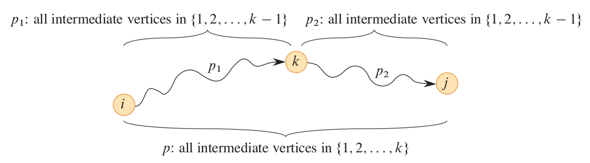

#### 最优子结构

-  $d_{ij}^{(k)}$ : the weight of a shortest path from vertex $i$ to vertex $j$ for which all intermediate vertices belong to the set $\{1,2,\ldots,k\}$（从顶点  $i$ 到顶点  $j$ 的最短路径的权重，其中所有中间顶点属于集合  $\{1,2,\ldots,k\}$ ）

	$$
	d_{ij}^{(k)} = \left\{ \begin{array}{ll} w_{ij} & k = 0 \\ \min \{d_{ij}^{(k - 1)},d_{ik}^{(k - 1)} + d_{kj}^{(k - 1)}\} & k\geq 1 \end{array} \right.
	$$

- Final answer:  $D^{(n)} = (d_{ij}^{(n)})$

#### 算法伪代码

- The **bottom-up** procedure（自底向上过程）

```
FLOYD-WARSHALL(W, n)					// W 是权重矩阵，n 是顶点数
	let D^(0) = W					   // 初始化 D^(0)
	for k = 1 to n
		let D^(k) be a new n x n matrix
		for i = 1 to n
			for j = 1 to n
				D_ij^(k) = min{D_ij^(k - 1), D_ik^(k - 1) + D_kj^(k - 1)}
	return D^(n)						// 返回最终结果
```

$$
T(n) = \Theta (n^3)
$$

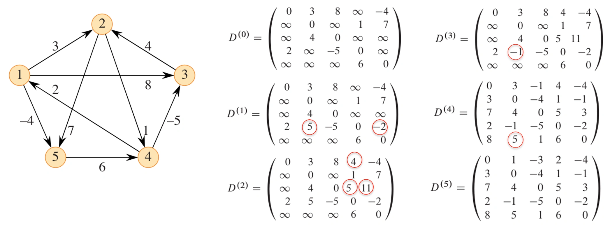

#### 构造最短路径

- Construct the **predecessor matrix** $\Pi$（构造前驱矩阵  $\Pi$ ）
	-  $\pi_{ij}^{(k)}$ : the predecessor of vertex $j$ on a shortest path from vertex $i$ to vertex $j$ for which all intermediate vertices belong to the set $\{1,2,\ldots,k\}$（从顶点  $i$ 到顶点  $j$ 的最短路径上顶点  $j$ 的前驱，其中所有中间顶点属于集合  $\{1,2,\ldots,k\}$ ）
- $k=0$

	$$
	\pi_{ij}^{(0)} = \left\{ \begin{array}{ll} \mathrm{NIL} & i = j~or~w_{ij} = \infty \\ i & i\neq j~and~w_{ij} < \infty \end{array} \right.
	$$

- For $k\geq 1$

	$$
	\pi_{ij}^{(k)} = \left\{ \begin{array}{ll} \pi_{kj}^{(k - 1)} & \text{k~is~an~intermediate~vertex} \\ \pi_{ij}^{(k - 1)} & \text{k~is~not~an~intermediate~vertex} \end{array} \right.
	$$

- The **modified** Floyd-Warshall algorithm（修改后的 Floyd-Warshall 算法）
	```
	FLOYD-WARSHALL-MODIFIED(W, n)		  // W 是权重矩阵，n 是顶点数
		let D^(0) = W					  // 初始化 D^(0)
		let Π^(0) = n x n matrix		   // 初始化前驱矩阵 Π^(0)
		for i = 1 to n
			for j = 1 to n
				if i = j or w_ij = ∞
					π_ij^(0) = NIL
				else
					π_ij^(0) = i
		for k = 1 to n
			let D^(k) be a new n x n matrix
			let Π^(k) be a new n x n matrix
			for i = 1 to n
				for j = 1 to n
					if D_ij^(k - 1) ≤ D_ik^(k - 1) + D_kj^(k - 1)
						D_ij^(k) = D_ij^(k - 1)
						π_ij^(k) = π_ij^(k - 1)
					else
						D_ij^(k) = D_ik^(k - 1) + D_kj^(k - 1)
						π_ij^(k) = π_kj^(k - 1)
		return D^(n), Π^(n)				 // 返回最终结果

	PRINT-PATH(Π, i, j)					 // 打印从 i 到 j 的最短路径
		if i == j
			print i
		else if π_ij == NIL
			print "no path from" i "to" j "exists"
		else
			PRINT-PATH(Π, i, π_ij)
			print j
	```