# 分布式算法

- [Back to Course Home](index.md)

## 分布式计算 (Distributed Computation)
### 进程 (Processes)

- Abstract clusters, physical/virtual machines, processors, cores, threads, etc. as processes（将集群、物理/虚拟机、处理器、内核、线程等抽象为进程）
- We assume (unless stated otherwise):
	- Finite set of processes（有限的进程集）
		- the set of processes in the system is denoted by $\Pi$, where $N = |\Pi|$（系统中的进程集表示为 $\Pi$ ，其中 $N = |\Pi|$ ）
		- each process is modeled as a state machine（每个进程都被建模为一个状态机）
		- covers most scenarios (except permissionless settings such as Bitcoin)（涵盖大多数场景（除比特币等无权限设置外））
	- Processes have unique identities and know each other（进程具有唯一标识符并相互了解）
	- (Message passing) bidirectional point-to-point links（（消息传递）双向点对点链接）
		- Pairs of processes are connected by a link (or channel)through which the processes exchange messages（进程对通过链接（或通道）连接，通过该链接（或通道）交换消息）

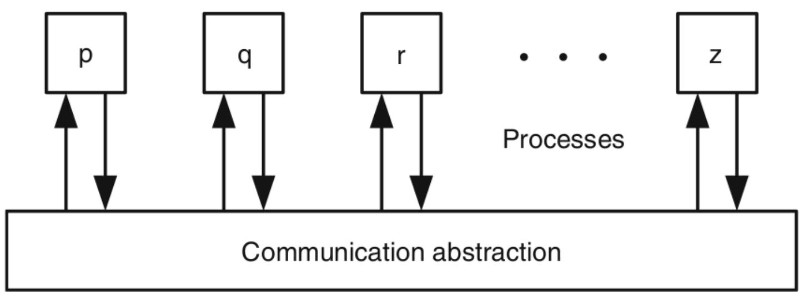

### 本地步骤 (Local steps)

- Process $p_i$ computation proceeds in steps（进程 $p_i$ 的计算按步骤进行）
	1. Send event: put a message in $\mathrm{outbuf}_i[j]$, for every neighbor $p_j$（发送事件：将消息放入 $\mathrm{outbuf}_i[j]$，对于每个邻居 $p_j$ ）
	2. Receive event: get messages m from $\mathrm{inbuf}_i[*]$（接收事件：从 $\mathrm{inbuf}_i[*]$ 中获取消息 m）
	3. Computation event: Perform local computation $\rightarrow$ Change state（计算事件：执行本地计算 $\rightarrow$ 更改状态）

		- Local state changes from current state S to new state $S^{\prime}$ as $S^{\prime} = f(S, m)$（本地状态从当前状态 S 更改为新状态 $S^{\prime} = f(S, m)$ ）
			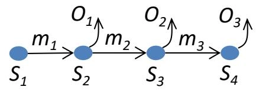

### 消息传递 (Message passing)

- $\mathrm{Inbuf}_i[j]$
	- Holds messages sent by $p_j$ delivered to (but not processed by) $p_i$（保存由 $p_j$ 发送并交付给 $p_i$，且 $p_i$ 未处理的消息）
- $\mathrm{Outbuf}_i[j]$
	- Holds messages sent by $p_i$ not delivered to $p_j$（保存由 $p_i$ 发送但尚未未交付给 $p_j$ 的消息）
- Message $m$ sent by $p_i$ to $p_j$:
	1. First in $\mathrm{Outbuf}_i[j]$
	2. Upon delivery, in $\mathrm{Inbuf}_j[i]$

### 执行和配置 (Executions and configurations)

- The execution of a distributed algorithm is represented by a sequence of steps executed by the processes.（分布式算法的执行由进程执行的一系列步骤表示。）
- Configuration $C$ is a vector of individual process states（配置 $C$ 是各个进程状态的向量）

    $$
    C = \left(S^{1}, S^{2}, \dots S^{n}\right)
    $$

- The execution captures the evolution of the global state（执行捕获全局状态的演变）

	$$
	C_0 \xrightarrow{s_1} C_1 \xrightarrow{s_2} C_2 \xrightarrow{s_3} C_3 \cdots
	$$

	- $s_k$ is a step taken by some process（其中 $s_k$ 是某个进程采取的步骤）
- A configuration is a global state（配置是全局状态）
	- Not accessible to processes!（进程无法访问！）
	- We need it for reasoning about algorithms（我们需要它来推理算法）

### 进程的步骤和分层 (Step of a process and layering)
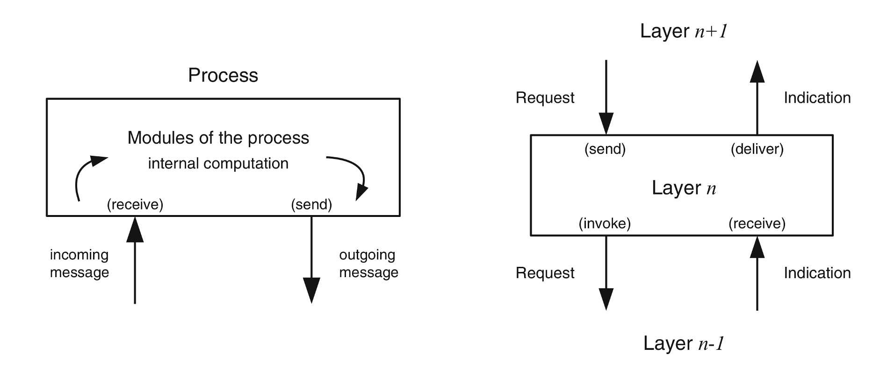

### 分布式算法栈 (Distributed Algorithm Stack)
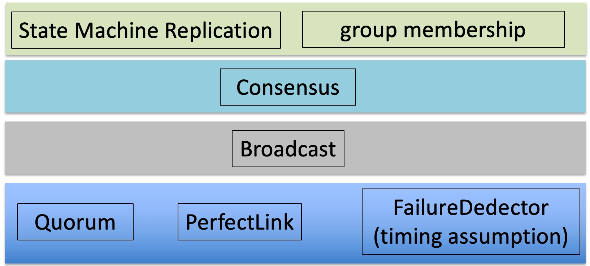

## 任务处理器 (Job Handlers)
### 规范

- Name: JobHandler, instance $jh$.
- Request: `<jh, Submit | job>`: Requests a job to be processed.（请求处理作业）
- Indication: `<jh, Confirm | job>`: Confirms that the given job has been (or will be) processed.（确认给定的作业已被（或将被）处理）
	- Think of indication as a **callback** function（可以将指示视为回调函数）
- Properties:
	- JH1. **Guaranteed response**: Every submitted job is eventually confirmed.（保证响应：每个提交的作业最终都会得到确认。）

### 算法：同步作业处理程序 (Synchronous JobHandler)

- Implements: JobHandler, instance $jh$.
- Get familiar with the event-driven style（熟悉事件驱动风格）

```
upon event <jh, Submit | job> do
	process (job);
	trigger <jh, Confirm | job>;
```

### 算法：异步作业处理程序 (Asynchronous JobHandler)

- Implements: JobHandler, instance $jh$.

```
upon event <jh, Init> do
	buffer := ∅;

upon event <jh, Submit | job> do
	buffer := buffer ∪ {job};
	trigger <jh, Confirm | job>;

upon buffer ≠ ∅ do
	job := select job(buffer);
	process (job);
	buffer := buffer \ {job};
```

## 故障 (Failures)
### 进程故障 (Process Failures)

- A failure occurs when a process does not behave according to the algorithm（当进程未按照算法运行时，就会发生故障）
	- A process that does not fail is called correct（未发生故障的进程称为正确进程）
	- A process that fails is called faulty（发生故障的进程称为故障进程）
- Faulty processes:
	- **Crash** (crash-stop)（崩溃）
		- Process stops execution of the algorithm: crashes（进程停止算法的执行：崩溃）
		- Process may crash in the middle of a step. Notably, of a send event（进程可能在步骤中间崩溃。特别是发送事件）
	- Crash-recovery（崩溃恢复）
		- Process might temporarily crash, but then recover its state and proceed taking steps（进程可能会暂时崩溃，但随后恢复其状态并继续采取步骤）
		- Process may crash and recover for an infinite number of times（进程可能会无限次崩溃并恢复）
	- Omission（遗漏）
		- The process omits to send/receive messages it is supposed to send/receive（进程省略了它应该发送/接收的消息）
		- Due to, e.g., buffer overflows or network congestion（例如，由于缓冲区溢出或网络拥塞）
	- Byzantine（拜占庭故障）
		- Unrestricted, arbitrary（不受限制的，任意的）
		- Malicious behavior allowed, models intrusions, bugs, etc.（允许恶意行为，模拟入侵、错误等。）
		- Special case: Authenticated Byzantine fault（特殊情况：经过身份验证的拜占庭故障）
			- Faulty process cannot subvert cryptographic primitives (e.g., digital signatures)（故障进程无法颠覆加密原语（例如数字签名））

### 过程故障层次结构 (Process failures hierarchy)
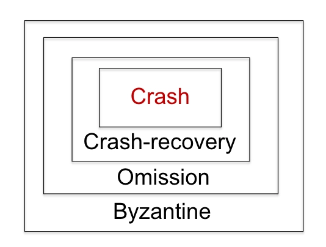

## 通信 (Communication)
### 链路故障 (Link failures)

- It is possible for messages to be lost（消息可能会丢失）
	- Due to, e.g., best-effort delivery at the Internet layer（例如，由于互联网层的尽力交付）
- But, the probability for a message to reach its destination is nonzero（但是，消息到达其目的地的概率非零）
- Keep on retransmitting messages until they reach their destinations（继续重传消息，直到它们到达目的地）
	- At a higher layer, end-to-end argument（在更高的层次上，端到端论证）

### 公平丢弃链路 (Fair-loss links)
#### 规范

- Name: FairLossPointToPointLinks, instance $fll$.
- Request: `<fll, Send | q, m >`: Requests to send message $m$ to process $q$.（请求将消息 $m$ 发送到进程 $q$）
- Indication: `<fll, Deliver | p, m >`: Delivers message $m$ sent by process $p$.（交付由进程 $p$ 发送的消息 $m$）
- Properties:
	- FLL1. **Fair-loss**: If a correct process $p$ infinitely often sends a message $m$ to a correct process $q$, then $q$ delivers $m$ an infinite number of times.（公平丢弃：如果正确进程 $p$ 无限次地将消息 $m$ 发送到正确进程 $q$ ，则 $q$ 无限次地交付 $m$ 。）
	- FLL2. **Finite duplication**: If a correct process $p$ sends a message $m$ a finite number of times to process $q$, then $m$ cannot be delivered an infinite number of times by $q$,（有限重复：如果正确进程 $p$ 将消息 $m$ 有限次地发送到进程 $q$ ，则 $m$ 不能被 $q$ 无限次地交付。）
	- FLL3. **No creation**: If some process $q$ delivers a message $m$ with sender $p$ then $m$ was previously sent to $q$ by process $p$.（无创建：如果某个进程 $q$ 交付了带有发送者 $p$ 的消息 $m$ ，则该消息 $m$ 先前已由进程 $p$ 发送给 $q$ 。）
- Correspond to **UDP**（对应于 UDP）

### 顽固链路 (Stubborn links)
#### 规范

- Name: StubbornPointToPointLinks, instance $sl$.
- Request: `<sl, Send | q, m>`: Requests to send message $m$ to process $q$.（请求将消息 $m$ 发送到进程 $q$）
- Indication: `<sl, Deliver | p, m>`: Delivers message $m$ sent by process $p$.（交付由进程 $p$ 发送的消息 $m$）
- Properties:
	- SL1. **Stubborn delivery**: If a correct process $p$ sends a message $m$ once to a correct process $q$, then $q$ delivers $m$ an infinite number of times.（顽固交付：如果正确进程 $p$ 向正确进程 $q$ 发送一次消息 $m$ ，则 $q$ 无限次地交付 $m$。）
	- SL2. **No creation**: If some process $q$ delivers a message $m$ with sender $p$, then $m$ was previously sent to $q$ by process $p$.（无创建：如果某个进程 $q$ 交付了 $p$ 发送的消息 $m$，则该消息 $m$ 先前已由进程 $p$ 发送给 $q$。）
- I.e., retransmission mechanism（即，重传机制）

#### 算法：无限重传 (Retransmit Forever)

- Implemented: StubbornLink, instance $sl$.
- Uses: FairLossLink, instance $fll$.

```
// 初始化 sl，sent 保存已发送但可能未被接收的消息（以备重传），设置定时器 △
upon event <sl, Init> do
	sent := ∅;
	starttimer(△);

// 定时器到期时，重传所有已发送的消息
upon event <Timeout> do
	forall (q, m) ∈ sent do
		trigger <fll, Send | q, m>;
	starttimer(△);

// 发送消息时，使用下层 fll 发送，并将消息加入 sent 集合以备重传
upon event <sl, Send | q, m> do
	trigger <fll, Send | q, m>;
	sent := sent ∪ {(q, m)};

// 当下层 fll 交付消息时，sl 也直接交付该消息
upon event <fll, Deliver | p, m> do
	trigger <sl, Deliver | p, m>;
```

### 可靠链路 (Perfect/Reliable links)
#### 规范

- Name: PerfectPointToPointLinks, instance $pl$.
- Request: `<pl, Send | q, m>`: Requests to send message $m$ to process $q$.（请求将消息 $m$ 发送到进程 $q$）
- Indication: `<pl, Deliver | p, m>`: Delivers message $m$ sent by process $p$.（交付由进程 $p$ 发送的消息 $m$）
- Properties:
	- PL1. **Reliable delivery**: If a correct process $p$ sends a message $m$ to a correct process $q$, then $q$ eventually delivers $m$.（可靠交付：如果正确进程 $p$ 向正确进程 $q$ 发送消息 $m$，则 $q$ 最终会交付 $m$ 。）
	- PL2. **No duplication**: No message is delivered by a process more than once.（无重复：进程不会多次交付同一条消息。）
	- PL3. **No creation**: If some process $q$ delivers a message $m$ with sender $p$, then $m$ was previously sent to $q$ by process $p$.（无创建：如果某个进程 $q$ 交付了 $p$ 发送的消息 $m$，则该消息 $m$ 先前已由进程 $p$ 发送给 $q$ 。）
- Correspond to **TCP**（对应于 TCP）

#### 算法：消除重复 (Eliminate Duplicates)

- Implemented: PerfectPointToPointLinks, instance $pl$.
- Uses: StubbornPointToPointLinks, instance $sl$.

```
// 初始化 pl，delivered 保存已交付的消息
upon event <pl, Init> do
	delivered := ∅;

// 发送消息时，直接使用下层 sl 发送
upon event <pl, Send | q, m> do
	trigger <sl, Send | q, m>;

// 当下层 sl 交付消息时，检查消息是否已交付，若未交付则记录并交付
upon event <sl, Deliver | p, m> do
	if m ∉ delivered then
		delivered := delivered ∪ {m};
		trigger <pl, Deliver | p, m>;
```

> - 本课程中默认可靠链路
>	 - Asynchronous message passing:（异步消息传递）
>		 - Perfect links + Fully connected network（完美链接 + 全连接网络）
>		 - Unless stated otherwise（除非另有说明）
>	 - Perfect links
>		 - Roughly, guarantee that a message sent between two correct processes will not be lost（大致上，保证在两个正确进程之间发送的消息不会丢失）
>		 - i.e., eventual delivery is guaranteed（即，保证最终交付）
>	 - NB: Perfect links $\neq$ FIFO（注意：完美链接 $\neq$ FIFO）
>		 - Messages may be delivered out of order（消息可能会乱序交付）

## 时序假设 (Timing Assumptions)

- Whether or not we can make any assumption about time bounds on（我们是否可以对以下内容做出任何时间界限的假设）
	- communication delays（通信延迟）
	- process speeds（进程速度）
	- clock drifts（时钟漂移）

### 同步消息传递 (Synchronous message passing)

- Stronger model, makes timing assumptions（更强的模型，做出时间假设）
	- **Propagation delays**（传播延迟）
		- there is a known upper bound limit $\Delta_{delay}$ on the time it takes for a message to be delivered（消息交付所需时间有一个已知的上限）
	- **Process speed**（进程速度）
		- the time it takes to execute a step is bounded and known, say $\Delta_{proc}$（执行一个步骤所需的时间是有界且已知的）
	- **Clocks**（时钟）
		- the drift $\Delta_{drift}$ between a local clock and the global real time clock is bounded and known（本地时钟与全球实时时钟之间的漂移是有界且已知的）
		- the global real time clock is a fictional device（全球实时时钟是一个虚构的设备）
- Simplifies communication model（简化通信模型）
	- Rounds: $\Delta_{delay} + \Delta_{proc} + \Delta_{drift}$ per round
	- In every round, every process executes one step (send, receive, compute)（在每一轮中，每个进程执行一个步骤（发送、接收、计算））
		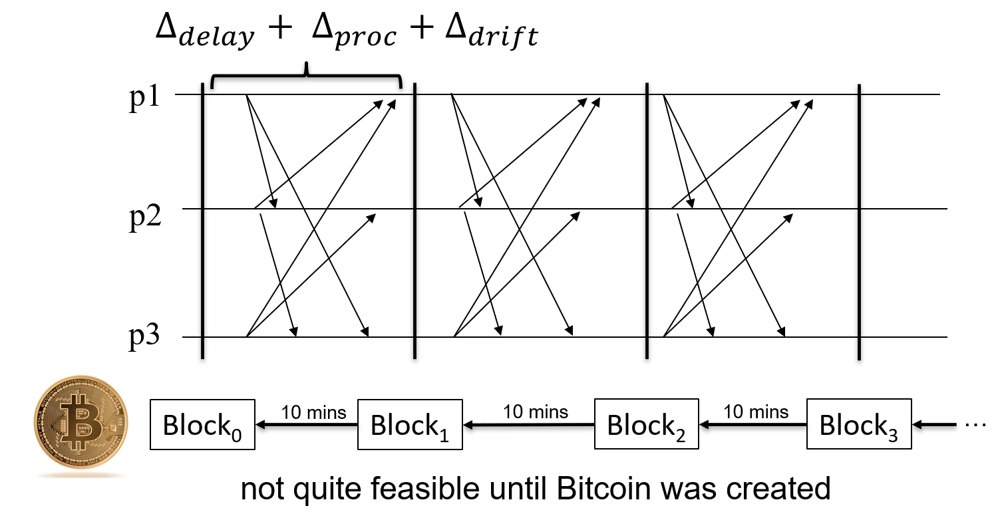

### 异步消息传递 (Asynchronous message passing)

- Much simpler, no timing assumptions（进一步简化，无时间假设）
	- messages can be delayed arbitrarily long（消息可以被任意长时间延迟）
	- processes can be arbitrarily slow or fast（进程可以任意慢或快）
	- clocks can drift arbitrarily（时钟可以任意漂移）

### 最终同步消息传递 (Eventually synchronous message passing)

- **Eventually synchronous**: models “in between”（最终同步： 模型“介于两者之间”）
- In practice, distributed systems are synchronous most of the time（在实践中，分布式系统大部分时间是同步的）
	- Formally, propagation delay $(\Delta_{delay})$ and process speed $(\Delta_{proc})$ are bounded after some **unknown** time（正式地说，在某个未知时间之后，传播延迟和进程速度是有界的）
	- $\Delta = \Delta_{delay} + \Delta_{proc}$
	- Or, $\Delta$ is not known a priori（或者 $\Delta$ 事先未知）

	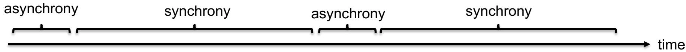

## 故障检测器 (Failure detectors, FDs)

- When a process in a distributed system fails (say crashes), how can we tell?（当分布式系统中的进程发生故障（例如崩溃）时，我们如何判断？）
	- Asynchronous message passing（异步消息传递）
		- detecting a process failure (with the help of timing assumptions) is unreliable!（在异步消息传递中，借助时间假设检测进程故障是不可靠的！）
			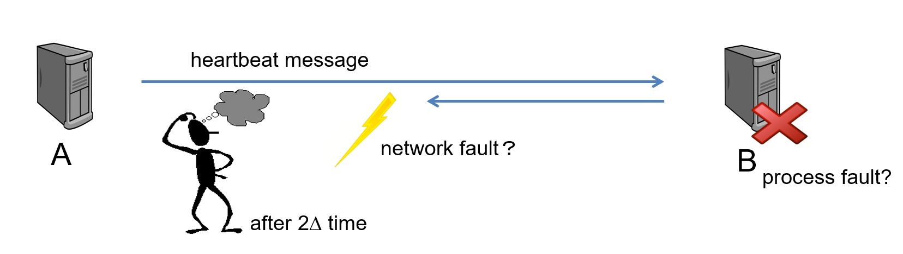

	- Synchronous message passing（同步消息传递）
		- detecting a process failure is reliable（检测进程故障是可靠的）
- Failure detectors (FDs)（故障检测器）
	- Provide processes with information about crashed processes（为进程提供有关崩溃进程的信息）
	- Implemented using (or encapsulating) timing assumptions（使用（或封装）时间假设实现）
	- Depending on the timing assumptions, the output of a FD can be accurate or not（根据时间假设，FD 的输出可以是准确的也可以是不准确的）
		- FDs often give “hints” about failures rather than reliable information（FDs 通常提供有关故障的“提示”，而不是可靠的信息）
		- Unreliable FDs（不可靠的 FD）

### 故障检测器 (Failure detector)

- Indication: `<P, Crash | p>`: Detects that process $p$ has crashed.（检测进程 $p$ 已崩溃）
- Properties:
	- Completeness（完备性）
	- Accuracy（准确性）

### 完美故障检测器 (Perfect failure detector)
#### 规范

- Name: PerfectFailureDetector, instance $P$.
- Indication: `<P, Crash | p>`: Detects that process $p$ has crashed.（检测进程 $p$ 已崩溃）
- Properties:
	- PFD1. **Strong completeness**: Eventually, every process that crashes is permanently detected by every correct process.（强完备性：最终，每个崩溃的进程都会被每个正确进程永久检测到。）
	- PFD2. **Strong accuracy**: If a process $p$ is detected by any process, then $p$ has crashed.（强准确性：如果进程 $p$ 被任何进程检测到，则 $p$ 已崩溃。）

#### 算法：超时排除 (Exclude on Timeout)

- Implements: PerfectFailureDetector, instance $P$.
- Uses: PerfectPointToPointLinks, instance $pl$.

```
// 初始化 P，alive 保存被认为存活的进程集合
// detected 保存已检测到崩溃的进程集合，设置定时器 2Δ
upon event <P, Init> do
	alive := Π;
	detected := ∅;
	starttimer(2Δ);

// 定时器到期时，检查所有进程并发送心跳请求
// 若某个进程未存活且未检测到，则标记为已检测崩溃并触发崩溃事件
// 最后清空 alive 集合并重置定时器
upon event <Timeout> do
	forall p ∈ Π do
		if (p ∉ alive) ∧ (p ∉ detected) then
			detected := detected ∪ {p};
			trigger <P, Crash | p>;
		trigger <pl, Send | p, [HEARTBEAT_REQUEST]>;
	alive := ∅;
	starttimer(2Δ);

// 当收到心跳请求时，回复心跳应答
upon event <pl, Deliver | q, [HEARTBEAT_REQUEST]> do
	trigger <pl, Send | q, [HEARTBEAT_REPLY]>;

// 当收到心跳应答时，将发送者添加到 alive 集合
upon event <pl, Deliver | p, [HEARTBEAT_REPLY]> do
	alive := alive ∪ {p};
```

- Example
	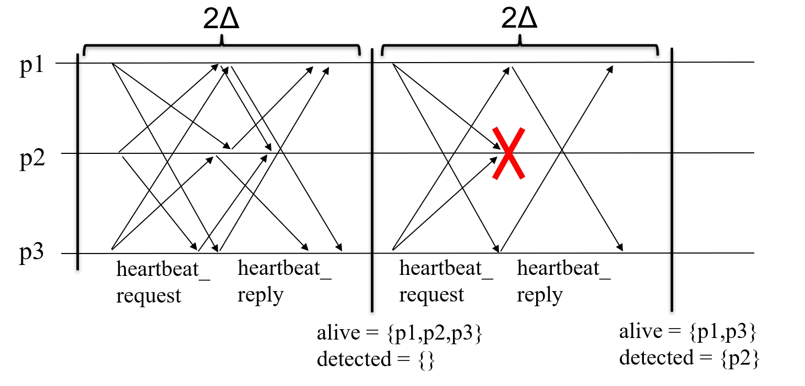

### 最终完美故障检测器 (Eventually perfect failure detector)
#### 规范

- Name: Eventually Perfect Failure Detector, instance $\diamondsuit P$,
- Indication:
	- `<◇P, Suspect | p>` : Notifies that process $p$ is suspected to have crashed.（通知进程 $p$ 被怀疑已崩溃）
	- `<◇P, Restore | p>` : Notifies that process $p$ is not suspected anymore.（通知进程 $p$ 不再被怀疑）
- Properties:
	- EPFD1. **Strong completeness**: Eventually, every process that crashes is permanently suspected by every correct process.（强完备性：最终，每个崩溃的进程都会被每个正确进程永久怀疑。）
	- EPFD2. **Eventual strong accuracy**: Eventually, no correct process is suspected by any correct process.（最终强准确性：最终，没有正确进程被任何正确进程怀疑。）

#### 基本思想：通用故障检测器实现 (Generic FD implementation (sketch))

1. Processes periodically exchange heartbeat messages（进程定期交换心跳消息）
2. A process sets a timeout based on worst case round trip of a message exchange ($2\Delta$ time)（进程根据消息交换的最坏情况往返时间（$2\Delta$ 时间）设置超时）
3. A process suspects another process if it timeouts that process（进程如果超时未收到另一个进程的响应，则怀疑该进程）
4. A process that delivers a message from a suspected process revises its suspicion and increases its timeout（进程收到被怀疑的进程交付消息，会修改其怀疑并增加其超时）

#### 算法：增加超时 (Increasing Timeout)

- Implements: EventuallyPerfectFailureDetector, instance $\diamondsuit P$.
- Uses: PerfectPointToPointLinks, instance pl.

```
// 初始化 ◇P，alive 保存被认为存活的进程集合
// suspected 保存被怀疑崩溃的进程集合，设置初始延迟为 2Δ' 并启动定时器
upon event <◇P, Init> do
	alive := Π;
	suspected := ∅;
	delay := 2Δ';
	starttimer(delay);

// 定时器到期时，若有存活进程被怀疑，则延迟增加 2Δ'
// 接着检查所有进程，若某个进程未被认为存活且未被怀疑，则将其加入怀疑集合并触发怀疑事件
// 反之若某个进程被认为存活且被怀疑，则将其从怀疑集合中移除并触发恢复事件
// 最后清空 alive 集合并重置定时器
upon event <Timeout> do
	if alive ∩ suspected ≠ ∅ then
		delay := delay + 2Δ';
	forall p ∈ Π do
		if (p ∉ alive) ∧ (p ∉ suspected) then
			suspected := suspected ∪ {p};
			trigger <◇P, Suspect | p>;
		else if (p ∈ alive) ∧ (p ∈ suspected) then
			suspected := suspected \ {p};
			trigger <◇P, Restore | p>;
	alive := ∅;
	starttimer(delay);

// 当收到心跳请求时，回复心跳应答
upon event <pl, Deliver | q, [HEARTBEAT_REQUEST]> do
	trigger <pl, Send | q, [HEARTBEATReply]>;

// 当收到心跳应答时，将发送者添加到 alive 集合
upon event <pl, Deliver | p, [HEARTBEAT_REPLY]> do
	alive := alive ∪ {p};
```

- $\Delta$ is not known a priori! Eventually, delay $>2\Delta$.
- Example
	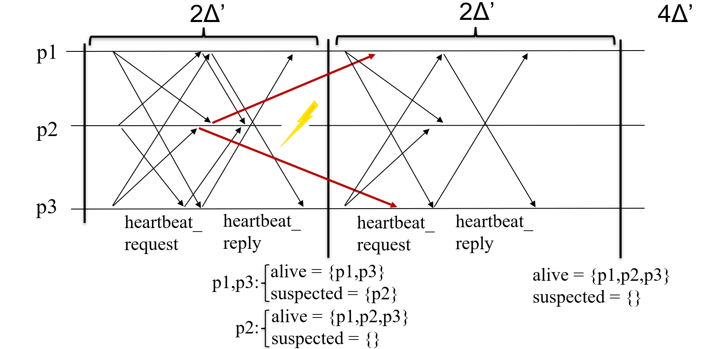

	- 在第一轮中，$p_2$ 未能在超时时间内回复心跳请求，因此被 $p_1$ 和 $p_3$ 怀疑崩溃。
	- 在第二轮中，$p_2$ 成功回复了心跳请求，$p_1$ 和 $p_3$ 将其加入 alive 集合。
	- 在第二轮结束时，$p_1$ 和 $p_3$ 发现 $p_2$ 既在 alive 集合中又在 suspected 集合中，因此将延迟增加了 $2\Delta^\prime$（从第三轮开始，延迟为 $4\Delta^\prime$）；然后 $p_2$ 被从怀疑集合中移除。

## 领导者 (Leaders)

- Identifies one process that has not failed（识别一个未发生故障的进程）
	- Each process eventually elects itself as the leader or a follower, such that there is exactly one leader（每个进程最终选举自己为领导者或追随者，以确保只有一个领导者）
- 优点
	- Synchronization/coordination tasks become much simpler（同步/协调任务变得简单得多）
	- We can use the leader to “centralize” the algorithm（我们可以使用领导者来“集中”算法）
		- Data processing, Resource allocation, Scheduling（数据处理、资源分配、调度）
		- Coordinating consensus（协调共识）
- 缺点
	- Stability?: Leader fails $\rightarrow$ must reelect one（稳定性：领导者失败则必须重新选举一个）
	- Bottleneck（瓶颈）

### 领导者选举 (Leader election)
#### 规范

- Name: LeaderElection, instance $le$.
- Indication: `<le, Leader | p>`: indicates that process $p$ is elected as leader.（表示进程 $p$ 被选为领导者）
- Properties:
	- LE1. **Eventual detection**: either there is no correct process, or some correct process is eventually elected as the leader.（最终检测：要么没有正确进程，要么某个正确进程最终被选为领导者。）
	- LE2. **Accuracy**: If a process is leader, then all previously elected leaders have crashed.（准确性：如果一个进程是领导者，则所有先前选举的领导者都已崩溃。）

#### 算法：君主制领导选举 (Monarchical Leader Election)

- Implements: LeaderElection, instance $le$.
- Uses: PerfectFailureDetector, instance $P$.

```
// 初始化 le，suspected 保存被怀疑崩溃的进程集合，leader 保存当前领导者
upon event <le, Init> do
	suspected := ∅;
	leader := ⊥;

// 当收到进程 p 崩溃的事件时，将其加入怀疑集合
upon event <P, Crash | p> do
	suspected := suspected ∪ {p};

// 如果当前领导者不等于未被怀疑崩溃的进程中排名最高的进程，则更新领导者，并触发换主事件
upon leader ≠ maxrank(Π \ suspected) do
	leader := maxrank(Π \ suspected);
	trigger <le, Leader | leader >;
```

- Example
	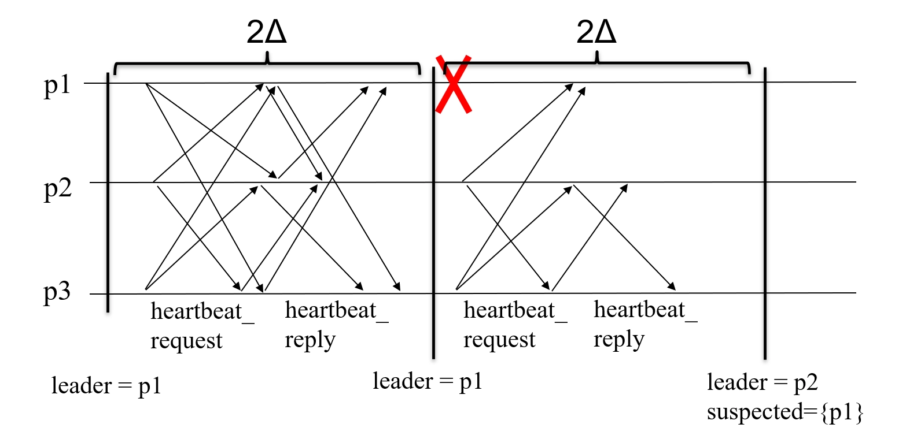

### 最终领导者检测器 (Eventual Leader Detector)
#### 规范

- Name: EventualLeaderDetector, instance $\Omega$
- Indication: `<Ω, Trust | p>`: Indicates that process $p$ is trusted to be leader.（表示进程 $p$ 被信任为领导者）
- Properties:
	- ELD1. **Eventual accuracy**: There is a time after which every correct process trusts some correct process.（最终准确性：在某个时间之后，每个正确进程都信任某个正确进程。）
	- ELD2. **Eventual agreement**: There is a time after which no two correct processes trust different correct processes.（最终一致性：在某个时间之后，没有两个正确进程信任不同的正确进程。）

#### 算法：君主制最终领导者检测 (Monarchical Eventual Leader Detection)

- Implemented: EventualLeaderDetector, instance $\Omega$,
- Uses: Eventually Perfect Failure Detector, instance $\diamondsuit P$.

```
// 初始化 Ω，suspected 保存被怀疑崩溃的进程集合，leader 保存当前领导者
upon event <Ω, Init> do
	suspected := ∅;
	leader := ⊥;

// 当收到怀疑进程 p 崩溃的事件时，将其加入怀疑集合
upon event <◇P, Suspect | p> do
	suspected := suspected ∪ {p};

// 当收到恢复进程 p 的事件时，将其从怀疑集合中移除
upon event <◇P, Restore | p> do
	suspected := suspected \ {p};

// 如果当前领导者不等于未被怀疑崩溃的进程中排名最高的进程，则更新领导者，并触发信任事件
upon leader ≠ maxrank(Π \ suspected) do
	leader := maxrank(Π \ suspected);
	trigger <Ω, Trust | leader>;
```

- Example
	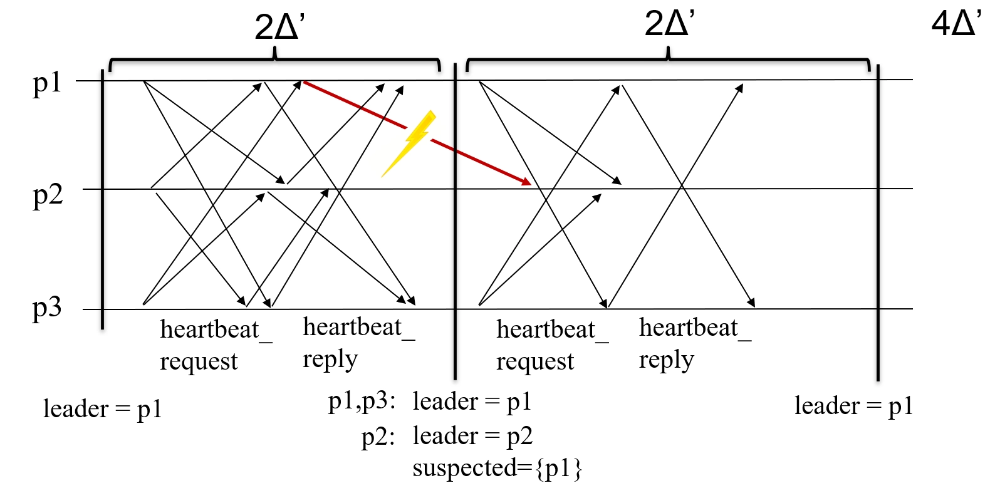

## 广播 (Broadcast)

- Broadcast: an information dissemination method（信息传播方法）
	- When more than two processes need to operate in a coordinated manner（当两个以上的进程需要协调工作时）
	- E.g., shared register, consensus, multi-party computation
- A process sends a message within a group of processes $\Pi$, such that processes in $\Pi$ agree on the messages they deliver（一个进程在一组进程 $\Pi$ 中发送消息，使得 $\Pi$ 中的进程对它们交付的消息达成一致）
	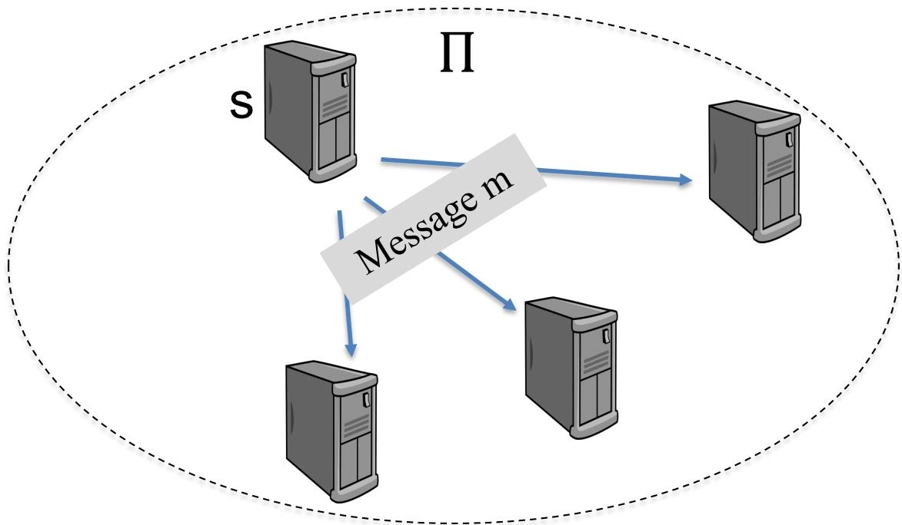

- This course: Best-effort broadcast $\to$ regular broadcast $\to$ uniform broadcast（本课程：尽力广播 $\to$ 常规广播 $\to$ 统一广播）

### 尽力广播 (Best-effort broadcast)
#### 规范

- Name: BestEffortBroadcast, instance $beb$.
- Request: `<beb, Broadcast | m>`: Broadcasts a message $m$ to all processes.（广播消息 $m$ 给所有进程）
- Indication: `<beb, Deliver | p, m>`: Delivers a message $m$ broadcast by process $p$.（交付由进程 $p$ 广播的消息 $m$）
- Properties:
	- BEB1. **Validity**: If a **correct** process broadcasts a message $m$, then every correct process eventually delivers $m$.（有效性：如果一个正确的进程广播消息 $m$，那么每个正确的进程最终都会交付 $m$。）
	- BEB2. **No duplication**: No message is delivered more than once.（无重复：没有消息会被交付多次。）
	- BEB3. **No creation**: If a process delivers a message $m$ with sender $s$, then $m$ was previously broadcast by process $s$.（无创建：如果一个进程交付了一个由发送者 $s$ 发送的消息 $m$，那么 $m$ 之前是由进程 $s$ 广播的。）
- bebBroadcast
	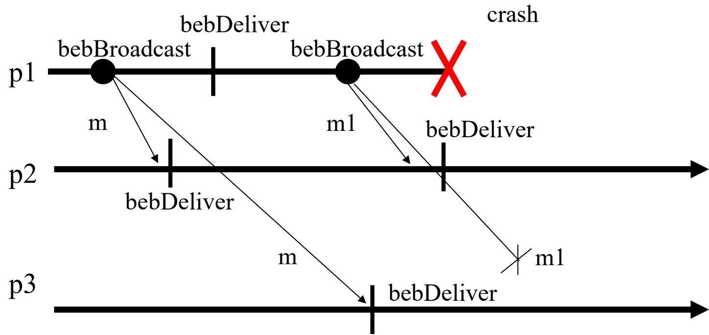

	- $p_1$ 广播 $m$ 给所有进程，此时一切正常，所有进程最终都会收到 $m$，符合有效性
	- $p_1$ 广播 $m_1$ 时崩溃，此时只有部分进程收到 $m_1$，没有正确完成广播，因此不违反有效性

#### 算法：基础广播 (Basic broadcast)

- Implemented: BestEffortBroadcast, instance $beb$.
- Uses: PerfectPointToPointLinks, instance $pl$.

```
// 使用 beb 进行广播时，用 pl 向所有进程发送消息 m
upon event <beb, Broadcast | m> do
	forall p in Π do
		trigger <pl, Send | p, m>;

// 当 pl 交付消息 m 时，触发 beb 的交付事件
upon event <pl, Deliver | p, m> do
	trigger <beb, Deliver | p, m>;
```

- Correctness
	- The no creation and no duplication properties follow directly from the corresponding properties of perfect links.（无创建和无重复属性直接来自完美链接的相应属性。）
	- Validity is derived from the reliable delivery property and the fact that the sender sends the message to every other process.（有效性源自可靠交付属性以及发送者向每个其他进程发送消息的事实。）
- Complexity
	- A single communication step, $O(N)$ messages.（单个通信步骤，$O(N)$ 消息。）

### 常规可靠广播 (Regular Reliable Broadcast)
#### 规范

- Name: ReliableBroadcast, instance $rb$.
- Request: `<rb, Broadcast | m>`: Broadcasts a message $m$ to all processes.（广播消息 $m$ 给所有进程）
- Indication:  `<rb, Deliver | p, m>`: Delivers a message $m$ broadcast by process $p$.（交付由进程 $p$ 广播的消息 $m$）
- Properties:
	- RB1 - RB3: Same as properties BEB1 - BEB3 in best-effort broadcast.
	- RB1. Validity: If a correct process broadcasts a message $m$, then every correct process eventually delivers $m$.（有效性：如果一个正确的进程广播消息 $m$，那么每个正确的进程最终都会交付 $m$。）
	- RB2. No duplication: No message is delivered more than once.（无重复：没有消息会被交付多次。）
	- RB3. No creation: If a process delivers a message $m$ with sender $s$, then $m$ was previously broadcast by process $s$.（无创建：如果一个进程交付了由发送者 $s$ 发送的消息 $m$，那么 $m$ 之前是由进程 $s$ 广播的。）
	- RB4. **Agreement**: If a message $m$ is delivered by some **correct** process, then $m$ is eventually delivered by **every correct process**.（一致性：如果某个正确的进程交付了消息 $m$，那么每个正确的进程最终都会交付 $m$。）
- rbBroadcast
	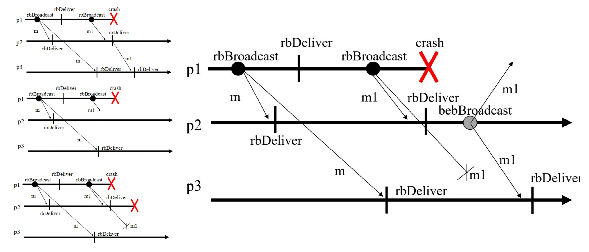

	- 左一/右：$p_1$ 广播 $m_1$ 后崩溃，只有 $p_2$ 收到并交付，于是 $p_2$ 继续广播 $m_1$，$p_3$ 最终也交付 $m_1$，符合一致性
	- 左二：$p_1$ 广播 $m_1$ 后崩溃，所有进程都没有收到 $m_1$，所以都没有交付，符合一致性
	- 左三：$p_1$ 广播 $m_1$ 后崩溃，只有 $p_2$ 收到并交付，但 $p_2$ 也崩溃了，$p_3$ 没有收到 $m_1$，此时没有正确进程交付 $m_1$，符合一致性

#### 算法：懒惰可靠广播 (Lazy Reliable Broadcast)

- Implemented: ReliableBroadcast, instance $rb$.
- Uses:
	- BestEffortBroadcast, instance $beb$
	- PerfectFailureDetector, instance $P$

```
// 初始化 rb，设置正确进程集合 correct 为所有进程集合 Π
// 设置已交付消息集合 delivered 为空，设置所有进程 p 的消息来源集合 from[p] 为空
upon event <rb, Init> do
	correct := Π;
	delivered := ∅;
	forall p in Π do
		from[p] := ∅;

// 使用 rb 进行广播时，用 beb 广播消息 m，附加消息来源 self 为自己
upon event <rb, Broadcast | m> do
	trigger <beb, Broadcast | [DATA, self, m]>;

// 当 beb 交付消息 [DATA, s, m] 时，检查消息 m 是否已交付
// 如果未交付，则将 m 加入已交付集合 delivered，触发 rb 的交付事件，并记录消息来源 s 和 m 到 from[p] 中
// 如果进程 p 不在正确进程集合 correct 中（p 已崩溃），则重新用 beb 广播消息 [DATA, s, m]
upon event <beb, Deliver | p, [DATA, s, m]> do
	if m ∉ delivered then
		delivered := delivered ∪ {m};
		trigger <rb, Deliver | s, m>;
		from[p] := from[p] ∪ {(s, m)};
		if p ∉ correct then
			trigger <beb, Broadcast | [DATA, s, m]>;

// 当检测到进程 p 崩溃时，从正确进程集合 correct 中移除 p
// 然后对 from[p] 中的所有消息 (s, m) 重新用 beb 广播消息 [DATA, s, m]
//（这是因为 p 崩溃了，可能有消息未被其他正确进程接收）
upon event <P, Crash | p> do
	correct := correct \ {p};
	forall (s, m) in from[p] do
		trigger <beb, Broadcast | [DATA, s, m]>;
```

- Complexity
	- Best case: if the initial sender does not crash（最佳情况：初始发送者没有崩溃）
		- a single communication step and $O(N)$ messages（单个通信步骤和 $O(N)$ 消息）
	- Worst case: if the processes crash in sequence（最坏情况：进程按顺序崩溃）
		- $O(N)$ steps and $O(N^{2})$ messages（$O(N)$ 步骤和 $O(N^{2})$ 消息）

#### 算法：积极可靠广播 (Eager Reliable Broadcast)

- Implemented: ReliableBroadcast, instance $rb$.
- Uses: BestEffortBroadcast, instance $beb$.

```
// 初始化 rb，设置已交付消息集合 delivered 为空
upon event <rb, Init> do
	delivered := ∅;

// 使用 rb 进行广播时，用 beb 广播消息 m，附加消息来源 self 为自己
upon event <rb, Broadcast | m> do
	trigger <beb, Broadcast | [DATA, self, m]>;

// 当 beb 交付消息 [DATA, s, m] 时，检查消息 m 是否已交付
// 如果未交付，则将 m 加入已交付集合 delivered，触发 rb 的交付事件
// 然后用 beb 广播消息 [DATA, s, m]
upon event <beb, Deliver | p, [DATA, s, m]> do
	if m ∉ delivered then
		delivered := delivered ∪ {m};
		trigger <rb, Deliver | s, m>;
		trigger <beb, Broadcast | [DATA, s, m]>;
```

- Complexity
	- Best case: no process crashes（没有进程崩溃）
		- A single communication step and $O(N^{2})$ messages（单个通信步骤和  $O(N^{2})$ 消息）
	- Worst case: the processes crash in sequence（进程按顺序崩溃）
		- $O(N)$ steps and $O(N^{2})$ messages（$O(N)$ 步骤和  $O(N^{2})$ 消息）

### 统一可靠广播 (Uniform reliable broadcast)
#### 规范

- Name: UniformReliableBroadcast, instance $urb$.
- Request: `<urb, Broadcast | m>`: Broadcasts a message $m$ to all processes.（广播消息 $m$ 给所有进程）
- Indication: `<urb, Deliver | p, m>`: Delivers a message $m$ broadcast by process $p$.（交付由进程 $p$ 广播的消息 $m$）
- Properties:
	- URB1 - URB3: Same as properties RB1 - RB3 in (regular) reliable broadcast.
	- URB1. Validity: If a correct process broadcasts a message $m$, then every correct process eventually delivers $m$.（有效性：如果一个正确的进程广播消息 $m$，那么每个正确的进程最终都会交付 $m$。）
	- URB2. No duplication: No message is delivered more than once.（无重复：没有消息会被交付多次。）
	- URB3. No creation: If a process delivers a message $m$ with sender $s$, then $m$ was previously broadcast by process $s$.（无创建：如果一个进程交付了由发送者 $s$ 发送的消息 $m$，那么 $m$ 之前是由进程 $s$ 广播的。）
	- URB4: **Uniform agreement**: If a message $m$ is delivered by some process (**whether correct or faulty**), then $m$ is eventually delivered by every correct process.（统一一致性：如果某个进程（无论是正确的还是错误的）交付了消息 $m$，那么每个正确的进程最终都会交付 $m$。）
- urbBroadcast
	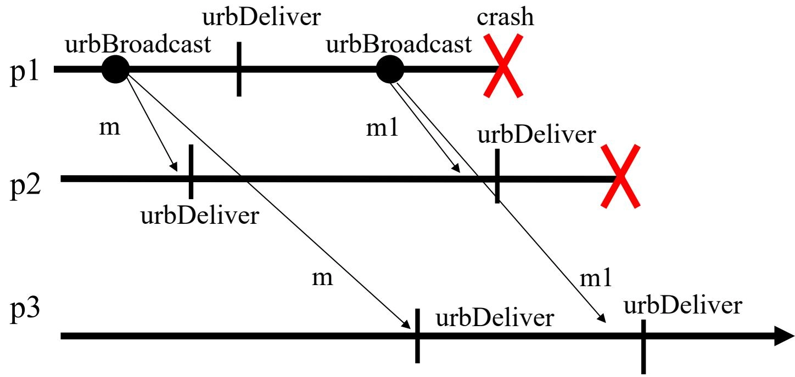

	- $p_1$ 广播 $m_1$ 后崩溃，$p_2$ 收到并交付 $m_1$，如果此时 $p_2$ 也崩溃了，为满足统一一致性，$p_3$ 最终也必须交付 $m_1$

#### 算法：全确认统一可靠广播 (All-Ack Uniform Reliable Broadcast)

- Implemented: UniformReliableBroadcast, instance $urb$.
- Uses:
	- BestEffortBroadcast, instance $beb$
	- PerfectFailureDetector, instance $P$

```
// 初始化 urb，设置已交付消息集合 delivered 为空，待交付消息集合 pending 为空
// 设置正确进程集合 correct 为所有进程集合 Π，并为每个消息 m 初始化确认集合 ack[m] 为空
upon event <urb, Init> do
	delivered := ∅;
	pending := ∅;
	correct := Π;
	forall m do
		ack[m] := ∅;

// 使用 urb 进行广播时，将消息 (self, m) 加入待交付集合 pending
// 然后用 beb 广播消息 [DATA, self, m]
upon event <urb, Broadcast | m> do
	pending := pending ∪ {(self, m)};
	trigger <beb, Broadcast | [DATA, self, m]>;

// 当 beb 交付消息 [DATA, s, m] 时，将发送者 p 加入消息 m 的确认集合 ack[m]
// 如果消息 (s, m) 不在待交付集合 pending 中，则将其加入 pending，并用 beb 广播
upon event <beb, Deliver | p, [DATA, s, m]> do
	ack[m] := ack[m] ∪ {p};
	if (s, m) ∉ pending then
		pending := pending ∪ {(s, m)};
		trigger <beb, Broadcast | [DATA, s, m]>;

// 当检测到进程 p 崩溃时，从正确进程集合 correct 中移除 p
upon event <P, Crash | p> do
	correct := correct \ {p};

// 检查消息 m 是否可以交付（即确认集合 ack[m] 包含所有正确进程）
function candeliver(m) returns Boolean is
	return (correct ⊆ ack[m]);

// 对于待交付集合 pending 中的每个消息 (s, m)，如果可以交付且未交付过
// 则将 m 加入已交付集合 delivered，并触发 urb 的交付事件
upon exists (s, m) ∈ pending such that candeliver(m) ∧ m ∉ delivered do
	delivered := delivered ∪ {m};
	trigger <urb, Deliver | s, m>;
```

- All-Ack Uniform Reliable Broadcast
	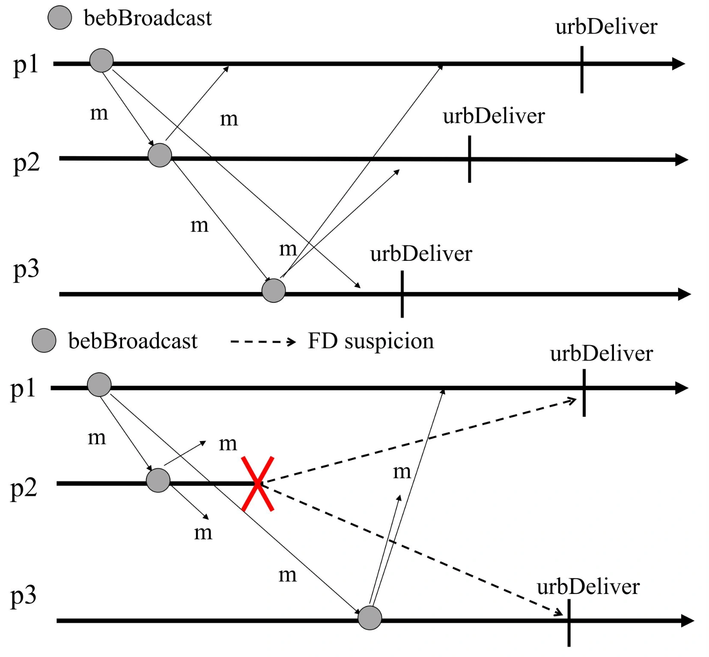

	- 上图：$p_1$ 广播 $m$，$p_2$ 和 $p_3$ 收到后广播确认，当每个节点各自收到所有节点的确认后交付消息 $m$，满足统一一致性
	- 下图：$p_1$ 广播 $m$，$p_2$ 收到后崩溃，未进行确认，$p_3$ 收到后广播确认，但由于 $p_2$ 未确认，$p_1$ 和 $p_3$ 都无法交付消息 $m$，直到故障检测器检测到 $p_2$ 崩溃并将其移除，此时 $p_1$ 和 $p_3$ 收到所有正确进程的确认后交付消息 $m$，满足统一一致性
- Complexity
	- Best case
		- two communication steps and $O(N^{2})$ messages（两个通信步骤和  $O(N^{2})$ 消息）
	- Worst case
		- $O(N)$ steps and $O(N^{2})$ messages（$O(N)$ 步骤和 $O(N^{2})$ 消息）

#### 算法：多数确认的统一可靠广播 (Majority-Ack Uniform Reliable Broadcast)

- Based on **[Quorum](#quorum)** (基于法定人数的思想)
- Implemented: UniformReliableBroadcast, instance $urb$.
- Uses: BestEffortBroadcast, instance $beb$.

```
upon event <urb, Init> do
	delivered := ∅;
	pending := ∅;
	forall m do
		ack[m] := ∅;

upon event <urb, Broadcast | m> do
	pending := pending ∪ {(self, m)};
	trigger <beb, Broadcast | [DATA, self, m]>;

upon event <beb, Deliver | p, [DATA, s, m]> do
	ack[m] := ack[m] ∪ {p};
	if (s, m) ∉ pending then
		pending := pending ∪ {(s, m)};
		trigger <beb, Broadcast | [DATA, s, m]>;

// 检查消息 m 是否可以交付（即确认集合 ack[m] 的大小超过 N/2，达到法定人数要求的“多数”）
function candeliver(m) returns Boolean is
	return #(ack[m]) > N / 2;

upon exists (s, m) ∈ pending such that candeliver(m) ∧ m ∉ delivered do
	delivered := delivered ∪ {m};
	trigger <urb, Deliver | s, m>;
```

- Majority-Ack Uniform Reliable Broadcast
	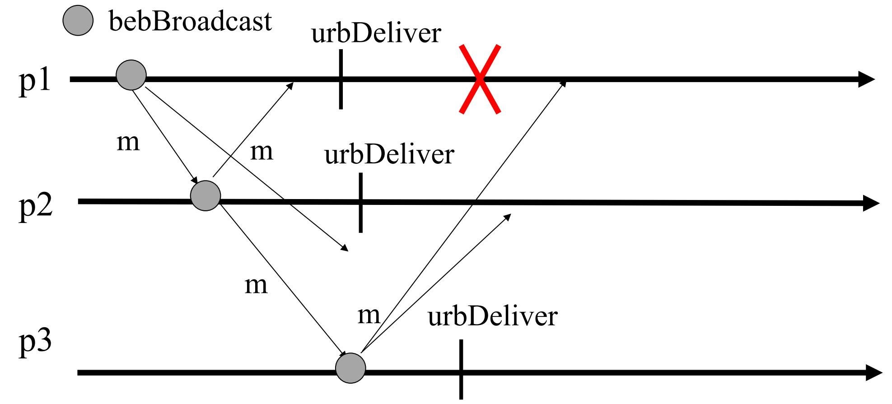

	- $N = 3$ 时，$p_1$ 广播 $m$，$p_2$ 收到后广播确认，此时他收到 $p_1$ 和自己的确认，达到法定人数，交付消息 $m$
	- $p_1$ 收到 $p_2$ 的确认时，也达到法定人数，交付消息 $m$
	- $p_3$ 收到 $p_2$ 的确认时，广播确认，此时他收到 $p_2$ 和自己的确认，达到法定人数，交付消息 $m$
- Correctness
	- **Validity**: if the sender is **correct**, then（有效性）
		- Every correct process receives a DATA message（每个正确的进程都会接收到一个 DATA 消息）
		- Every correct process broadcasts a DATA message（每个正确的进程都会广播一个 DATA 消息）
		- Every correct process receives more than N/2 DATA messages（每个正确的进程都会接收到超过 N/2 个 DATA 消息）
			- Since a majority of processes are correct（因为大多数进程是正确的）
		- Every correct process eventually delivers $m$（每个正确的进程最终都会交付消息 $m$）
	- **No duplication**, **no creation**（无重复，无创建）
		- Straightforward from the properties of best-effort broadcast（直接来自尽力广播的属性）
	- **Uniform agreement**（统一一致性）
		- Assume $N = 2f + 1$（假设共有 $N = 2f + 1$ 个进程）
		- Suppose a process $p_1$ urb-delivers $m$, that means $p_1$ has received at least $f + 1$ DATA messages for $m$（假设一个进程 $p_1$ 用 urb 交付了消息 $m$，这意味着 $p_1$ 至少收到了 $f + 1$ 个关于消息 $m$ 的 DATA 消息）
		- Since there are at most $f$ faulty processes, at least one of these messages is from a correct process $p_2$（由于最多有 $f$ 个故障进程，这些消息中至少有一个来自正确的进程 $p_2$）
		- So all correct processes will receive the DATA message from $p_2$ and broadcast it（因此所有正确的进程都会收到来自 $p_2$ 的 DATA 消息并进行广播）
		- Thus, every correct process will receive at least $f + 1$ DATA messages for $m$ and urb-deliver $m$（因此，每个正确的进程都会收到至少 $f + 1$ 个关于消息 $m$ 的 DATA 消息并用 urb 交付消息 $m$）
- Complexity
	- Best case
		- two communication steps and $O(N^{2})$ messages（两个通信步骤和  $O(N^{2})$ 消息）
	- Worst case
		- $O(N)$ steps and $O(N^{2})$ messages（$O(N)$ 步骤和 $O(N^{2})$ 消息）

### 全序广播 (Total Order Broadcast)
#### 规范

- Name: TotalOrderBroadcast, instance $tob$.
- Request: `<tob, Broadcast | m>`: Broadcasts a message $m$ to all processes.（将消息 $m$ 广播给所有进程）
- Indication: `<tob, Deliver | p, m>`: Delivers a message $m$ broadcast by process $p$.（交付由进程 $p$ 广播的消息 $m$）
- Properties:
	- TOB1. **Validity**: If a correct process $p$ broadcasts a message $m$, then $p$ eventually delivers $m$.（有效性：如果一个正确的进程 $p$ 广播了一条消息 $m$，那么 $p$ 最终会交付 $m$。）
	- TOB2. **No duplication**: No message is delivered more than once.（无重复：没有消息会被交付多次。）
	- TOB3. **No creation**: If a process delivers a message $m$ with sender $s$, then $m$ was previously broadcast by process $s$.（无创建：如果一个进程交付了一条由发送者 $s$ 发送的消息 $m$，那么 $m$ 之前是由进程 $s$ 广播的。）
	- TOB4. **(Uniform) agreement**: If a message $m$ is delivered by some (correct) process, then $m$ is eventually delivered by every correct process.（（统一）一致性：如果某个（正确的）进程交付了一条消息 $m$，那么每个正确的进程最终都会交付 $m$。）
	- TOB5. **Total order**: Let $m_1$ and $m_2$ be any two messages and suppose $p$ and $q$ are any two (correct) processes that deliver $m_1$ and $m_2$. If $p$ delivers $m_1$ before $m_2$, then $q$ delivers $m_1$ before $m_2$.（全序：对于任意两条消息 $m_1$、$m_2$ 和交付它们的任意两个（正确的）进程 $p$、$q$，如果 $p$ 在 $m_2$ 之前交付了 $m_1$，那么 $q$ 也会在 $m_2$ 之前交付 $m_1$，即 **交付顺序一致。**）
- TOB VS RB
	- Reliable broadcast: the processes are free to deliver messages in any order they wish（进程可以自由地以它们希望的任何顺序交付消息）
		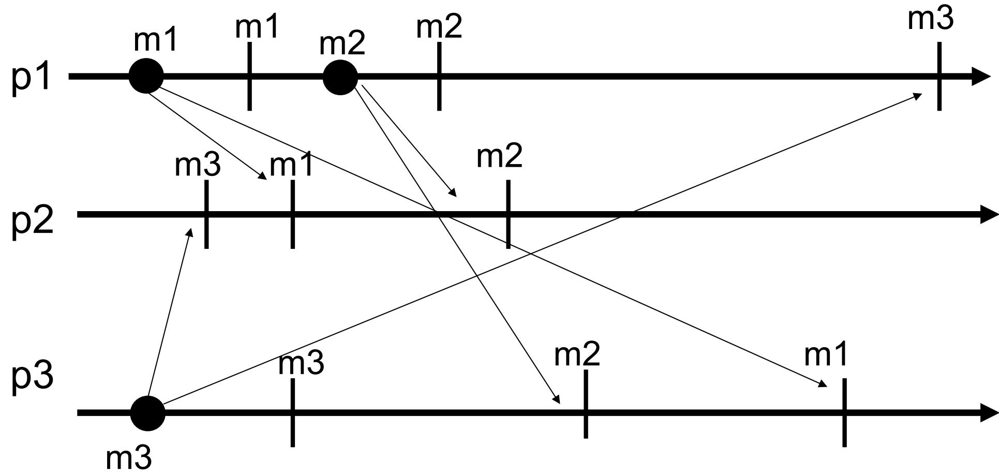

	- Total order broadcast: The processes must deliver all messages according to the same order（进程必须按照相同的顺序交付所有消息）
		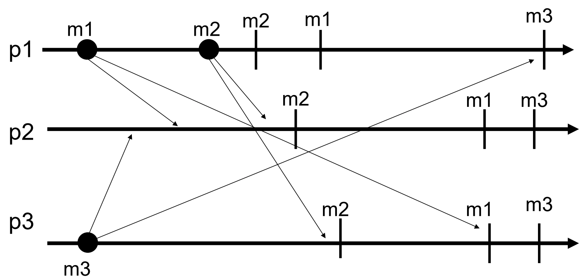

#### 算法：基于共识的全序广播 (Consensus-Based Total-Order Broadcast)

- Based on **[Consensus](#consensus)** (基于共识的思想)
- Implemented: TotalOrderBroadcast, instance $tob$.
- Uses:
	- ReliableBroadcast, instance $rb$
	- Consensus, multiple instances $c.r$ for round $r$（注意：这里的 round 与共识中的 round 不同）

```
// 初始化 tob，设置未排序消息集合为空，已交付消息集合为空，当前共识实例编号为 1，等待标志为 FALSE
upon event <tob, Init> do
	unordered := ∅;
	delivered := ∅;
	round := 1;
	wait := FALSE;

// 使用 tob 广播消息 m 时，用 rb 广播该消息
upon event <tob, Broadcast | m> do
	trigger <rb, Broadcast | m>;

// 当 rb 交付消息 m 时，如果 m 未被交付过，则将 (p, m) 加入未排序消息集合
upon event <rb, Deliver | p, m> do
	if (p, m) ∉ delivered then
		unordered := unordered ∪ {(p, m)};

// 如果未排序消息集合非空且不在等待状态，则标记进入等待状态
// 然后初始化一个新的共识实例 c.round，并触发该实例的提案事件，提案内容为未排序消息集合
upon unordered ≠ ∅ ∧ wait = FALSE do
	wait := TRUE;
	Initialize a new instance c.round of consensus;
	trigger <c.round, Propose | unordered>;

// 当共识实例 c.round 做出决定时，对决定的消息集合进行排序，然后按顺序触发 tob 的交付事件
// 然后将已决定的消息加入已交付集合，从未排序集合中移除，共识实例编号加 1，退出等待状态
upon event <c.r, Decide | decided> such that r = round do
	forall (s, m) ∈ sort(decided) do
		trigger <tob, Deliver | s, m>;
	delivered := delivered ∪ decided;
	unordered := unordered \ decided;
	round := round + 1;
	wait := FALSE;
```

#### 状态机复制 (State Machine Replication, SMR)

- SMR method mimics a reliable central server by replicating client requests to a group of processes, in such a way that（SMR 方法通过将客户端请求复制到一组进程来模拟可靠的中央服务器，以确保）
	- **safety**: all correct processes execute the same requests in the same order（安全性：所有正确的进程以相同的顺序执行相同的请求）
	- **liveness**: eventually every request is executed（活跃性：最终每个请求都会被执行）
- From Consensus to SMR (or Blockchain)
	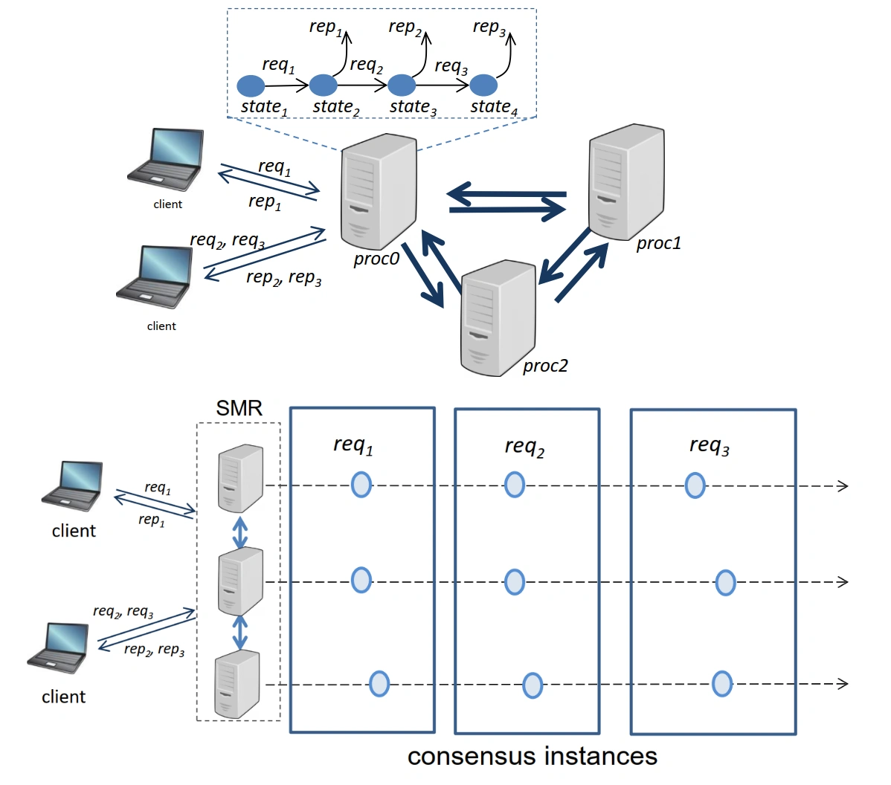

- Industry deployment
	- Meta-data (configuration) management（元数据（配置）管理）
	- Large-scale database systems（大规模数据库系统）
	- Blockchain systems（区块链系统）

## 法定人数 (Quorum)

- Quorum works in distributed computing only if we know $\Pi$ a priori（法定人数仅在我们事先知道 $\Pi$ 的情况下在分布式计算中工作）

### 法定人数系统在分布式计算中的应用

- Quorums: a collection of subsets of processes（法定人数：一组进程的子集集合）

	$$
	QS = \{Q_{1}, Q_{2}, \cdots \}\quad \forall Q \in QS: Q \subseteq \Pi
	$$

- Each pair of quorums have a non-empty intersection（每对法定人数都有一个非空交集）

	$$
	\forall Q_{1}, Q_{2} \in QS: Q_{1} \cap Q_{2} \neq \emptyset
	$$

- For simplicity, we only consider **symmetric** case, i.e.,（为了简单起见，我们只考虑对称情况，即）

	$$
	\forall Q_{1}, Q_{2} \in QS: | Q_{1} | = | Q_{2} |
	$$

	- Asymmetric case: Google Megastore*, write-all, read-one
- E.g., when $N = 3$ and $\Pi = \{p_1, p_2, p_3\}$,  $QS = \{\{p_1, p_2\}, \{p_1, p_3\}, \{p_2, p_3\}\}$,
	- $\{p_2,p_3\} \cap \{p_1,p_2\} = \{p_2\}$
	- $\{p_2,p_3\} \cap \{p_1,p_3\} = \{p_3\}$
	- $\{p_1,p_2\} \cap \{p_1,p_3\} = \{p_1\}$

### 对称法定人数系统 (Symmetric quorum system)

- Quorum is a key abstraction for ensuring consistency (safety)（法定人数是确保一致性（安全性）的关键抽象）
- Any quorum can make progress despite failures of other processes（任何法定人数都可以在其他进程失败的情况下取得进展）

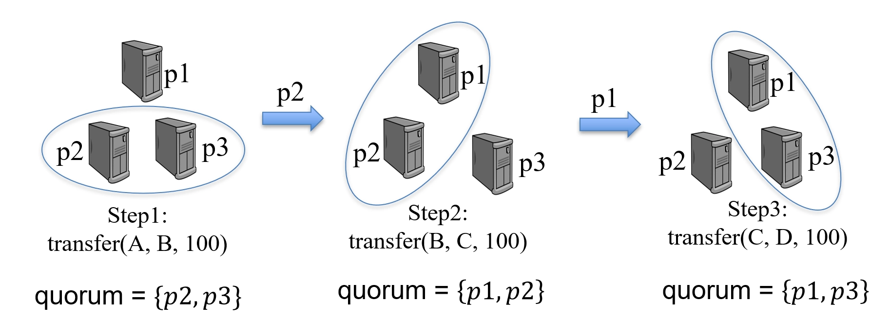

### 安全性与活性 (Safety and liveness)

- **Safety**: a quorum must be any **majority** of processes（安全性：法定人数必须是任何大多数进程）
	- Otherwise, split-brain problem may occur（否则，可能会发生脑裂问题）
	- 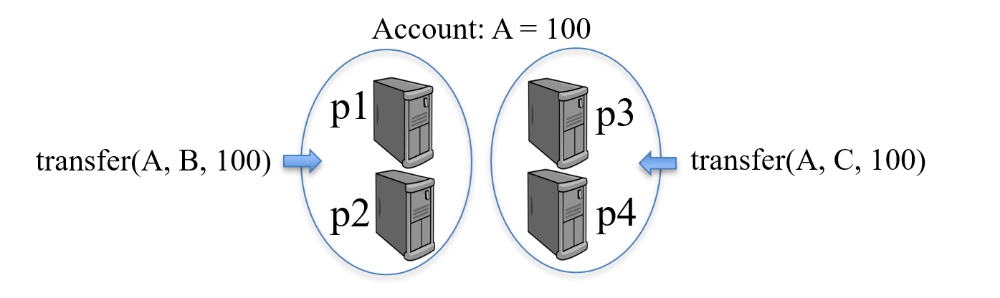

- **Liveness**: even if a minority of processes fail, there is always a quorum that contains only correct processes（活性：即使少数进程失败，总有一个法定人数只包含正确进程）
	- Thus can proceed, i.e., ensuring liveness（因此可以继续，即确保活性）
- Assume there are $f$ crash faults
	- Safety: any two quorums intersect in one correct process（安全性：任何两个法定人数在一个正确的进程中相交）
	- Liveness: $N - f$ processes can make progress (quorum size)（活性：$N - f$ 进程可以取得进展，即满足法定人数大小）
	- Therefore, we have

		$$
		\begin{aligned} &2(N - f) > N \\ \therefore~ & N > 2f \\ \therefore~ & N \geq 2f + 1 \end{aligned}
		$$

## 共识 (Consensus)

- (One of) the most fundamental problem(s) in distributed computing（分布式计算中最基础的问题之一）
- Key to solving many other problems in distributed computing（解决分布式计算中许多其他问题的关键）
	- total order broadcast（[全序广播](#total-order-broadcast)）, (state machine) replication（[状态机复制 SMR](#state-machine-replication-smr)）
	- atomic commit（原子提交）
	- terminating reliable broadcast（终止可靠广播）
- In the consensus problem, the processes propose values and have to agree on one among these values（在共识问题中，进程提出值并必须就这些值中的一个达成一致）

### 基本概念

- A group of $N$ processes, among which some (usually $f$) may crash (Crash fault)（一组个进程，其中一些可能会崩溃）
- The problem is for correct processes to agree on a value（问题是让正确的进程就一个值达成一致）
- Every process can propose, finally every correct process decides（每个进程都可以提出，最后每个正确的进程都决定）
- 二元共识 (binary consensus/agreement)
	- Request: propose(v1)
	- Indication: decide(v2)

	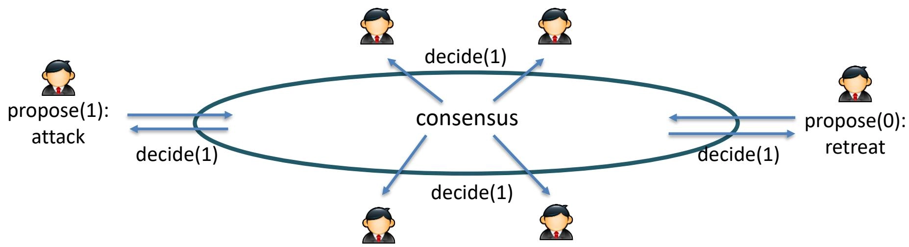

### 共识 (Consensus)
#### 规范

- Name: Consensus, instance $c$.
- Request: `<c, Propose | v>`: Proposes value $v$ for consensus.（提出值 $v$ 以达成共识）
- Indication: `<c, Decide | v>`: Outputs a decided value $v$ of consensus.（输出共识的决定值 $v$）
- Properties:
	- C1. **Termination**: Every correct process eventually decides some value.（终止性：每个正确的进程最终决定某个值。）
	- C2. **Validity**: If a process decides $v$, then $v$ was proposed by some process.（有效性：如果一个进程决定了 $v$，那么 $v$ 是由某个进程提出的。）
	- C3. **Integrity**: No process decides twice.（完整性：没有进程会决定两次。）
	- C4. **Agreement**: No two **correct** processes decide differently.（一致性：没有两个正确的进程会做出不同的决定。）
- Consensus
	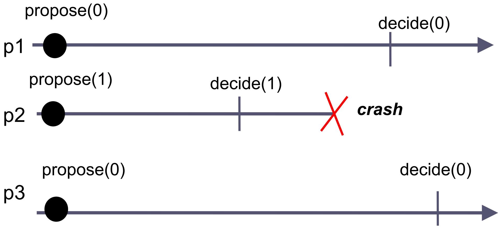

#### 算法：分层共识 (Hierarchical Consensus)
##### 基本思想

- The processes go through rounds incrementally ($1 \to N$): in each round, the process with the id corresponding to that round is the leader of the round（进程按顺序经历轮次，在每一轮中，id 与该轮对应的进程是该轮的领导者）
	- The leader of a round **decides** its current proposal and broadcasts it to all（一轮的领导者决定其当前提议并将其广播给所有人）
- A process that is not leader in a round waits（不是一轮领导者的进程等待）
	1. to deliver the proposal of the leader in that round to adopt it, or（交付该轮领导者的提案以采用它，或者）
	2. to suspect the leader（怀疑领导者）
- Hierarchical Consensus（分层共识）
	- The process with the smallest id among correct processes decides first（正确进程中 id 最小的进程首先做出决定）
	- Its proposal is adopted by all other correct processes（它的提案被所有其他正确的进程采用）
	- Then, the process with the second smallest id decides, and so on（然后，id 第二小的进程决定，依此类推）

##### 算法伪代码

- Implemented: Consensus, instance $c$.
- Uses:
	- BestEffortBroadcast, instance $beb$
	- PerfectFailureDetector, instance $P$

```
// 初始化 c，设置检测到崩溃的序号集合为空，当前轮次为 1，当前提案为空，提案者为 0
// 设置 N 个进程的已交付状态为 FALSE，广播状态为 FALSE
upon event <c, Init> do
	detectedranks := ∅;
	round := 1;
	proposal := ⊥;
	proposer := 0;
	delivered := [FALSE]N;
	broadcast := FALSE;

// 当检测到进程 p 崩溃时，将其序号加入崩溃序号集合
upon event <P, Crash | p> do
	detectedranks := detectedranks ∪ {rank(p)};

// 当收到提案 v 且当前提案为空时，设置当前提案为 v
upon event <c, Propose | v> such that proposal = ⊥ do
	proposal := v;

// 如果当前轮次自己是领导者，当前提案不为空且未广播，则广播通知决定当前提案，并触发自身决定事件
upon round = rank(self) ∧ proposal ≠ ⊥ ∧ broadcast = FALSE do
	broadcast := TRUE;
	trigger <beb, Broadcast | [DECIDED, proposal]>;
	trigger <c, Decide | proposal>;

// 当收到来自进程 p 的已决定提案 v 时，比较 p 的序号与自己的序号和当前提案者的序号
// 如果小于自己的序号且大于当前提案者的序号（还没轮到自己领导，且提案者是比自己早的进程）
// 则更新当前提案和提案者，并标记 p 的广播已交付
upon event <beb, Deliver | p, [DECIDED, v]> do
	r := rank(p);
	if r < rank(self) ∧ r > proposer then
		proposal := v;
		proposer := r;
	delivered[r] := TRUE;

// 如果当前轮次的领导者在崩溃序号集合中，或当前轮次领导者的广播已交付，则进入下一轮
upon round ∈ detectedranks ∨ delivered[round] = TRUE do
	round := round + 1;
```

##### 示例
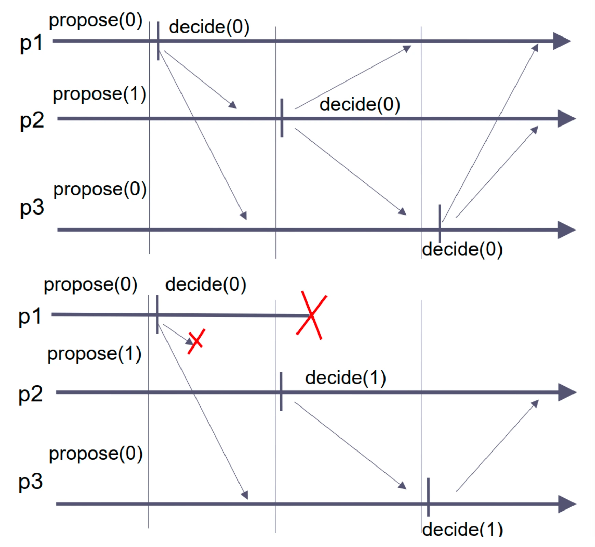

- 上图：三个进程均无故障
	- 轮次 1：进程 $p_1$ 作为领导者决定其提案 0 并广播该决定
	- 轮次 2：进程 $p_2$ 作为领导者，由于上一轮中 $p_1$ 决定了 0 并广播，该值被 $p_2$ 采用，所以决定 0 并广播该决定
	- 轮次 3：进程 $p_3$ 与 $p_2$ 类似，决定 0 并广播该决定
- 下图：进程 $p_1$ 在轮次 2 崩溃
	- 轮次 1：进程 $p_1$ 作为领导者决定其提案 0，但在广播时崩溃，只有 $p_3$ 收到该决定
	- 轮次 2：进程 $p_2$ 作为领导者，由于没有收到 $p_1$ 的决定，且检测到 $p_1$ 崩溃，$p_2$ 决定其提案 1 并广播该决定
	- 轮次 3：进程 $p_3$ 作为领导者，由于上一轮中 $p_2$ 决定了 1 并广播，该值被 $p_3$ 采用，所以决定 1 并广播该决定

##### 正确性论证：一致性

- Let $p_i$ be the correct process with the smallest rank in an execution $ex$（让 $p_i$ 成为执行 $ex$ 中排名最小的正确进程）
- Assume $p_i$ decides $v$, so we have（假设 $p_i$ 决定了 $v$）
	- $i = N$ : $p_n$ is the only correct process（$p_n$ 是唯一正确的进程）
	- $i < N$ : in round $i$, all correct processes receive $v$ and will not decide anything different from $v$（在第 $i$ 轮中，所有正确的进程都接收到了 $v$，并且不会决定与 $v$ 不同的任何东西）

#### 算法：基于全序广播的共识 (TOB-Based Consensus)

- Implemented: Consensus, instance $c$.
- Uses: TotalOrderBroadcast, instance $tob$.

```
// 初始化 c，设置当前提案为空，决定标志为 FALSE
upon event <c, Init> do
	proposal := ⊥;
	decided := FALSE;

// 当收到提案 v 且当前提案为空时，设置当前提案为 v，并使用 tob 广播该提案
upon event <c, Propose | v> such that proposal = ⊥ do
	proposal := v;
	trigger <tob, Broadcast | proposal>;

// 当 tob 交付来自进程 p 的提案 v 时，如果尚未决定，则设置当前提案为 v，标记决定为 TRUE，并触发 c 的决定事件
upon event <tob, Deliver | p, v> do
	if decided = FALSE then
		proposal := v;
		decided := TRUE;
		trigger <c, Decide | proposal>;
```

### 统一共识 (Uniform consensus)
#### 规范

- Name: UniformConsensus, instance $uc$.
- Request: `<uc, Propose | v>`: Proposes value $v$ for consensus.（提出值 $v$ 以达成共识）
- Indication: `<uc, Decide | v>`: Outputs a decided value $v$ of consensus.（输出共识的决定值 $v$）
- Properties:
	- UC1 - UC3: Same as properties C1 - C3 in consensus.
	- UC1. **Termination**: Every correct process eventually decides some value.（终止性：每个正确的进程最终决定某个值。）
	- UC2. **Validity**: If a process decides $v$, then $v$ was proposed by some process.（有效性：如果一个进程决定了 $v$，那么 $v$ 是由某个进程提出的。）
	- UC3. **Integrity**: No process decides twice.（完整性：没有进程会决定两次。）
	- UC4. **Uniform Agreement**: No two processes decide differently.（一致协议：没有两个进程会做出不同的决定，**不管它们是否正确**。）
- Uniform consensus
	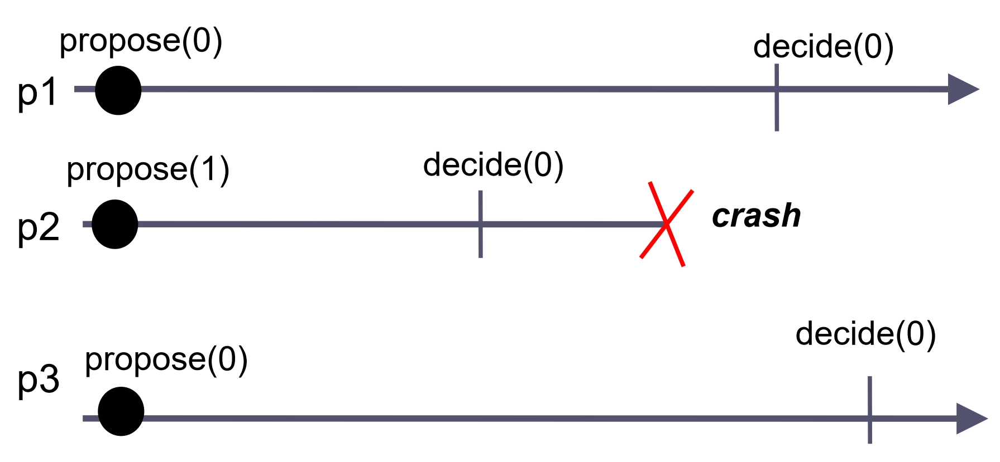

#### 算法：基于 P 的统一共识 (P-Based Uniform Consensus)
##### 基本思想

- Idea
	- The processes exchange and update proposals in rounds（进程在轮次中交换和更新提案）
	- After $N$ rounds decide on the current proposal value（在 $N$ 轮后决定当前的提案值）
- The processes go through rounds incrementally ($1 \to N$): in each round $i$, process $p_i$ sends its proposal to all（进程按顺序经历轮次，在每一轮 $i$ 中，进程 $p_i$ 将其提案发送给所有人）
- A process adopts any proposal it receives if the proposal is sent in previous round and more recent than its current proposal（如果收到的提案是在自己轮数之前发送的并且比当前保存的提案更新，则进程采用该提案）
- Process decide on their proposal **at the end of round** $N$（进程在第 $N$ 轮结束时决定其提案）

##### 算法伪代码

- Implemented: UniformConsensus, instance $uc$.
- Uses:
	- BestEffortBroadcast, instance $beb$
	- PerfectFailureDetector, instance $P$

```
upon event <uc, Init> do
	detectedranks := ∅;
	round := 1;
	proposal := ⊥;
	proposer := 0;
	delivered := [FALSE]N;
	broadcast := FALSE;

upon event <P, Crash | p> do
	detectedranks := detectedranks ∪ {rank(p)};

upon event <uc, Propose | v> such that proposal = ⊥ do
	proposal := v;

// 如果当前轮次自己是领导者，当前提案不为空且未广播，则广播当前提案
// 与前面的分层共识算法的区别在于：不立刻决定当前提案
upon round = rank(self) ∧ proposal ≠ ⊥ ∧ broadcast = FALSE do
	broadcast := TRUE;
	trigger <beb, Broadcast | [PROPOSAL, proposal]>;

upon event <beb, Deliver | p, [PROPOSAL, v]> do
	r := rank(p);
	if r < rank(self) ∧ r > proposer then
		proposal := v;
		proposer := r;
	delivered[r] := TRUE;

// 如果当前轮次的领导者在崩溃序号集合中，或当前轮次领导者的广播已交付，则检查是否为最后一轮
// 如果是最后一轮则决定当前提案，否则进入下一轮
upon round ∈ detectedranks ∨ delivered[round] = TRUE do
	if round = N then
		trigger <c, Decide | proposal>;
	else
		round := round + 1;
```

##### 示例
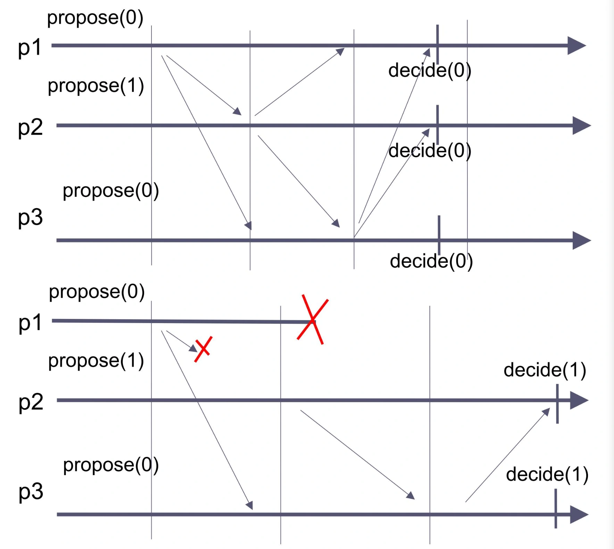

- 上图：三个进程均无故障
	- 轮次 1：进程 $p_1$ 作为领导者广播其提案 0，其他进程采用该提案
	- 轮次 2：进程 $p_2$ 作为领导者，由于采用了 $p_1$ 的提案 0，因此广播该提案
	- 轮次 3：进程 $p_3$ 作为领导者，与上一轮类似，广播提案 0
	- 在第 3 轮结束时，所有进程决定提案 0
- 下图：进程 $p_1$ 在轮次 2 崩溃
	- 轮次 1：进程 $p_1$ 作为领导者广播其提案 0，但在广播时崩溃，只有 $p_3$ 收到该提案并采用它
	- 轮次 2：进程 $p_2$ 作为领导者，由于没有收到 $p_1$ 的广播，且检测到 $p_1$ 崩溃，$p_2$ 广播其提案 1，此时 $p_3$ 采用该提案代替之前的提案 0
	- 轮次 3：进程 $p_3$ 作为领导者，由于采用了 $p_2$ 的提案 1，因此广播该提案
	- 在第 3 轮结束时，存活的进程 $p_2$ 和 $p_3$ 决定提案 1

##### 正确性论证：统一一致性

- Consider the process with the lowest id which decides, say $p_i$（考虑做出决定的 id 最小的进程，假设为 $p_i$）
	- Hence, $p_i$ completes round $N$（因此，$p_i$ 完成了第 $N$ 轮）
- In round $i$, every $p_j$ with $j > i$ receives the proposal of $p_i$ and adopts it（在第 $i$ 轮中，每个 $p_j$（$j > i$）都接收到了 $p_i$ 的提案并采用了它）
- Hence, every process which sends a message after round $i$ has the same proposal at the end of round $i$,（因此，在第 $i$ 轮结束时，在第 $i$ 轮之后发送消息的每个进程都有相同的提案。）

#### 算法：基于 ♢P 和法定人数的统一共识 (♢P & Quorum-Based Uniform Consensus)

- Uniform consensus using
	- Correct majority (**Quorum**)
	- Eventually perfect Failure Detector ($\diamondsuit P$)
- Idea: processes alternate in the role of a leader (coordinator) until one of them succeeds in imposing a decision（想法：进程轮流担任领导者（协调者）的角色，直到其中一个成功地强加了一个决定）
- Prioritize safety (agreement) rather than liveness (termination)（优先考虑安全性（一致性）而不是活跃性（终止性））
- $\diamondsuit P$ do make a difference?
	- Correct processes might be falsely suspected finitely many times（正确的进程可能会被错误地怀疑有限次）
	- False suspicion of a correct process by $\diamondsuit P$ makes algorithms I and II break（$\diamondsuit P$ 对正确进程的错误怀疑使算法 I 和 II 失败）
		- Alg. I: Agreement violation with $\diamondsuit P$
			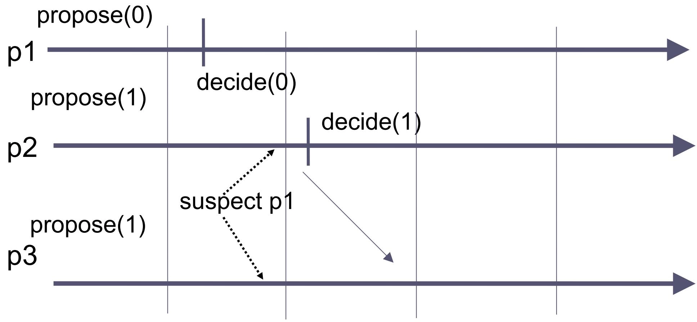

			- 轮次 1：$p_1$ 决定值 0 并广播，但被 $p_2$ 和 $p_3$ 的 $\diamondsuit P$ 错误怀疑为崩溃
			- 轮次 2：$p_2$ 决定新的值 1 并广播，此时 $p_1$ 与 $p_2$ 决定不同的值，导致一致性被破坏
		- Alg. II: Agreement violation with $\diamondsuit P$
			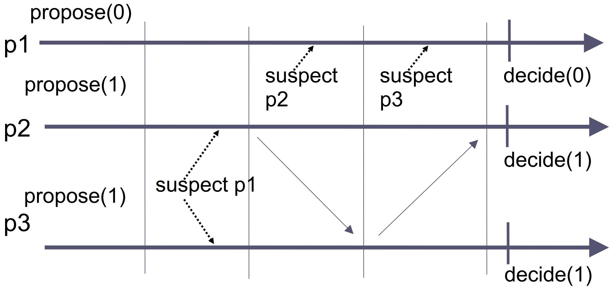

			- 轮次 1：$p_1$ 提出值 0 并广播，但被 $p_2$ 和 $p_3$ 的 $\diamondsuit P$ 错误怀疑为崩溃
			- 轮次 2：$p_2$ 提出新的值 1 并广播，$p_3$ 接收该值并采用它，而 $p_1$ 的 $\diamondsuit P$ 误判 $p_2$ 崩溃
			- 轮次 3：$p_3$ 使用其采用的值 1 作为提案并广播，而 $p_1$ 的 $\diamondsuit P$ 误判 $p_3$ 崩溃
			- 最终，$p_1$ 决定值 0，而 $p_2$ 和 $p_3$ 决定值 1，导致一致性被破坏

##### 基本思想

- The processes go through rounds incrementally: in each round $k$, such that $k \bmod N = i$, $p_i$ is the leader（进程按顺序经历轮次：在每一轮 $k$ 中，如果 $k \bmod N = i$，则 $p_i$ 是领导者）
- In such a round $k$, $p_i$ tries to **decide**（在这样的第 $k$ 轮中，$p_i$ 试图做出决定）
	- $p_i$ succeeds if it is not suspected（如果 $p_i$ 没有被怀疑，则 $p_i$ 成功）
	- Otherwise, processes that suspect $p_i$ inform all processes including $p_i$ and move to the next round（否则，怀疑 $p_i$ 的进程通知包括 $p_i$ 在内的所有进程进入下一轮）
- To decide, $p_i$ does the following（为了做出决定，$p_i$ 执行以下操作）
	1. $p_i$ **reads** the proposals of a majority of processes and **selects** the latest adopted value (latest with respect to the round in which the value is adopted - see step 2)（$p_i$ 读取大多数进程的提案并选择最新采用的值（根据采用该值的轮次 - 见步骤 2））
		- if no value was adopted by any process in a given majority, $p_i$ imposes its own initial (proposal) value in step 2（如果在给定多数中没有任何进程采用任何值，则 $p_i$ 在步骤 2 中强加其自己的初始（提议）值）
	2. $p_i$ **imposes** that value at a majority: any process in that majority adopts that value - $p_i$ fails if it is suspected（$p_i$ 在多数中强加该值：该多数中的任何进程都采用该值 - 如果 $p_i$ 被怀疑则失败）
	3. $p_i$ **decides** and **broadcasts** the decision to all （$p_i$ 做出决定并将决定广播给所有人）
- $\diamondsuit P$ and Quorum-based Uniform Consensus
	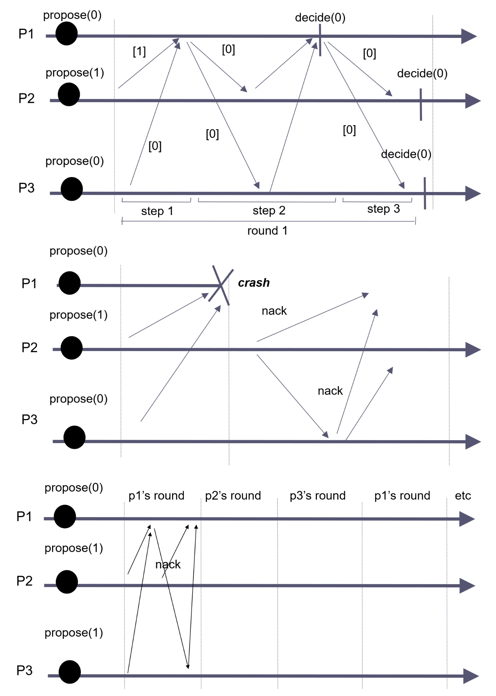

	- 上、中两图是下图中一个 round 内的三个步骤
	- 上图：
		- Step 1 - Read/Gather：$p_1$ 作为领导者，向 $p_2$ 和 $p_3$ 发送 READ 请求以收集它们的提案，发现没有进程采用任何值，因此选择自己的提案 0
		- Step 2 - Impose/Ack：$p_1$ 向 $p_2$ 和 $p_3$ 发送 IMPOSE 请求以强加值 0，$p_2$ 和 $p_3$ 采用该值并发送 ACK 确认
		- Step 3 - Decide：$p_1$ 收到足够的 ACK 后决定值 0 并广播该决定，$p_2$ 和 $p_3$ 接收该决定并也决定值 0
	- 中图：如果 $p_1$ 崩溃，则 $p_2$ 和 $p_3$ 发送 nack 并进入下一轮

##### 算法伪代码

- Implemented: UniformConsensus, instance $uc$.
- Uses:
	- BestEffortBroadcast, instance $beb$
	- EventuallyPerfectFailureDetector, instance $\diamondsuit P$
	- PerfectPointToPointLinks, instance $pl$
	- ReliableBroadcast, instance $rb$

```
// 初始化 uc，设置怀疑进程集合为空，nacked 集合为空，当前轮次为 1，已提案标志为 FALSE
// 设置当前提案为空，潜在共识值为 nil，潜在共识轮次为 0，N 个进程的状态为 [nil, 0]，确认计数为 0
upon event <uc, Init> do
	suspected := Ø;
	nacked := Ø;
	round := 1;
	proposed := false;
	proposal := ⊥;
	estimate := nil;
	estround := 0;
	states := [nil, 0]N;
	acks := 0;

// 当收到 ◇P 对进程 p 的怀疑时，将 p 加入怀疑进程集合
upon event <◇P, Suspect | p> do
	suspected := suspected ∪ {p};

// 当收到 ◇P 对进程 p 的恢复通知时，将 p 从怀疑进程集合中移除
upon event <◇P, Restore | p> do
	suspected := suspected \ {p};

// 当收到提案 v 且当前提案为空时，设置当前提案为 v
upon event <uc, Propose | v> such that proposal = ⊥ do
	proposal := v;

// 如果当前轮次自己是领导者，且未提出过提案，且当前提案不为空，则开始提出提案
// 标记已提出提案，重置状态数组和确认计数，然后广播 READ 请求以收集进程状态
upon rank(self) = round and proposed = false and proposal ≠ ⊥ do
	proposed := true;
	states := [nil, 0]N;
	acks := 0;
	trigger <beb, Broadcast | [READ, round]>;

// 当收到来自当前轮次领导者进程 p 的 READ 请求时，回复 GATHER 响应
// 响应内容包含当前轮次、潜在共识值和潜在共识轮次
upon event <beb, Deliver | p, [READ, round]> and rank(p) = round do
	trigger <pl, Send | p, [GATHER, round, estimate, estround]>;

// 当收到来自进程 p 的 GATHER 响应时，更新状态数组，记录 p 的潜在共识值和潜在共识轮次
upon event <pl, Deliver | p, [GATHER, round, est, estrnd]> do
	states[p] := [est, estrnd];

// 当状态数组中有来自多数进程的状态时，从中选择最新的潜在共识值作为提案（如果全空就用自己原有的）
// 然后重置状态数组，广播 IMPOSE 请求以强加该值
upon #states ≥ majority do
	if ∃ states[p] ≠ [nil, 0] then
		select states[p]=[est, estrnd] with highest estrnd
		proposal := est;
	states := [nil, 0]N;
	trigger <beb, Broadcast | [IMPOSE, round, proposal]>;

// 当收到来自当前轮次领导者进程 p 的 IMPOSE 请求时，更新估计值和估计轮次，然后回复 ACK 确认
upon event <beb, Deliver | p, [IMPOSE, round, v]> and rank(p) = round do
	estimate := v;
	estround := round;
	trigger <pl, Send | p, [ACK, round]>;

// 当收到来自进程 p 的 ACK 确认时，增加确认计数
// 当确认计数达到多数时，广播 DECIDE 决定消息
upon event <pl, Deliver | p, [ACK, round]> do
	acks := acks + 1;
	if acks ≥ majority then
		trigger <beb, Broadcast | [DECIDE, proposal]>;

// 当收到来自进程 p 的 DECIDE 决定消息时，触发 uc 的决定事件
upon event <beb, Deliver | p, [DECIDE, v]> do
	trigger <uc, Decide | v>;

// 若当前轮次的领导者被怀疑时，发送 NACK 消息以进行换主
upon rank(p) = round and p ∈ suspected do
	trigger <rb, Broadcast | [NACK, round]>;

// 当收到来自进程 p 的 NACK 消息时，将该轮次加入 nacked 集合
upon event <rb, Deliver | p, [NACK, rnd]> do
	nacked := nacked ∪ {rnd};

// 若当前轮次在 nacked 集合中，重置已提出提案标志，进入下一轮
upon round ∈ nacked do
	proposed := false;
	round := round + 1;
```
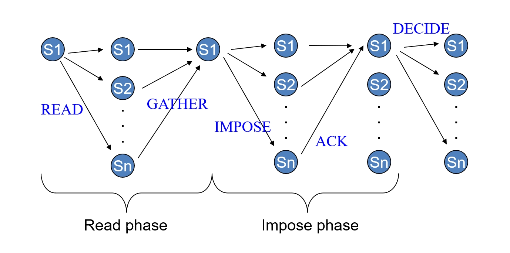

##### 示例

- 无故障
	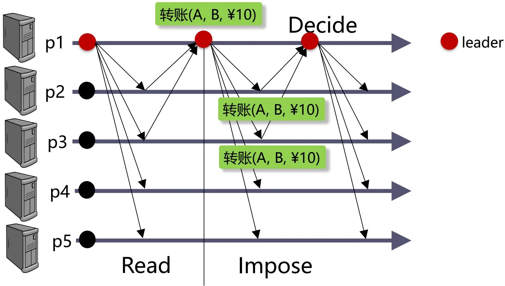

- 完成共识后故障，未触发换主
	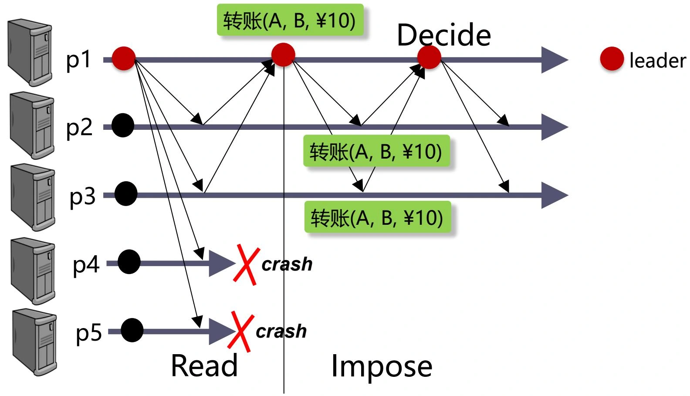

- 完成共识后故障，触发换主，由于满足法定人数，可以通过 READ 读取潜在的共识值，最终仍能达成一致
	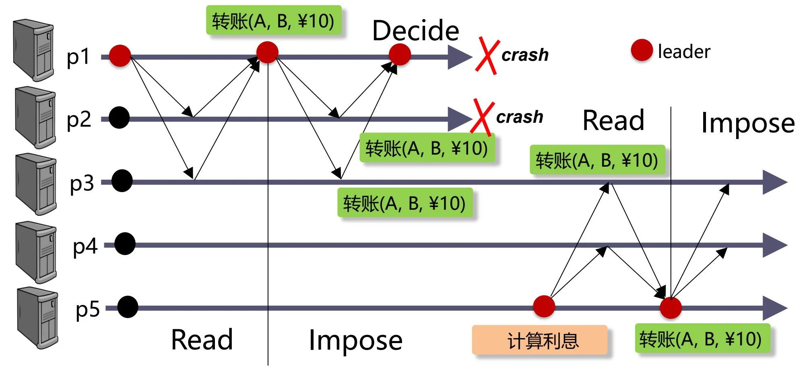

- 故障且未完成共识，触发换主，此时第一个提案被放弃，新的领导者提出自己的提案并达成一致
	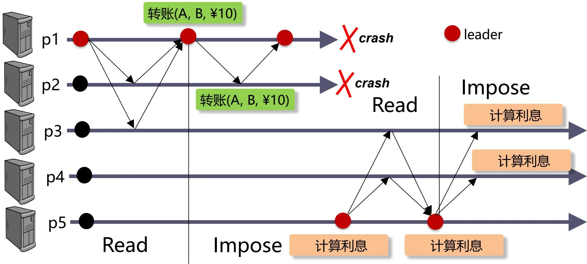

	- 如果 $p_1$ 只是被错误怀疑崩溃，且在 $p_5$ 与 $p_3$、$p_4$ 达成共识后恢复，则在下一轮中 $p_1$ 的 READ 请求会读取到新的潜在共识值（计算利息），由于比自己的（转账）更新，因此 $p_1$ 会采用该值并最终达成一致

##### 正确性论证：终止性和一致性

- We skip validity and integrity
- **Termination**（终止性）
	- if a correct process decides, it broadcasts the decision to all: every correct process decides（如果一个正确的进程做出决定，它会将决定广播给所有人：每个正确的进程都会做出决定）
	- Assume by contradiction that some process is correct and no correct process decides. We argue that this is impossible.（反证法：假设某个正确进程没有做出决定，证明这是不可能的。）
		- By
			- correct majority assumption（正确进程的多数假设）
			- Strong completeness property of $\diamondsuit P$（$\diamondsuit P$ 的强完整性：最终所有崩溃的进程都会被所有正确进程永久怀疑）
			- no correct process remains blocked forever in some round（没有正确的进程会永远阻塞在某一轮中）
		- By the eventual accuracy property of $\diamondsuit P$（$\diamondsuit P$ 的最终准确性：最终，没有正确的进程会被任何进程怀疑）
			- some correct process p reaches a round where it is the leader and it is not suspected（在某一轮，某个正确的进程 p 成为领导者且不被怀疑）
			- p reaches a decision in that round: a contradiction（p 在那一轮必然能做出决定：与假设矛盾！）
- **Agreement**（一致性）
	- Let $k$ be the first round in which some process $p_i$ decides some value $v$, $p_i$ is the leader of round $k$ and $p_i$ decides $v$ in $k$（设 $k$ 是某个进程 $p_i$ 决定某个值 $v$ 的第一轮，即 $p_i$ 是第 $k$ 轮的领导者并且 $p_i$ 在第 $k$ 轮中决定了 $v$）
		- This means that, in round $k$, a majority of processes adopt $v$（这意味着，在第 $k$ 轮中，大多数进程采用了 $v$）
		- The algorithm guarantees that no value other than $v$ will be imposed (and hence decided) by any process in a round higher than $k$ (Quorum)（该算法保证，在高于 $k$ 的轮次中，任何进程都不会强加（因此决定）除 $v$ 之外的任何值（法定人数））
			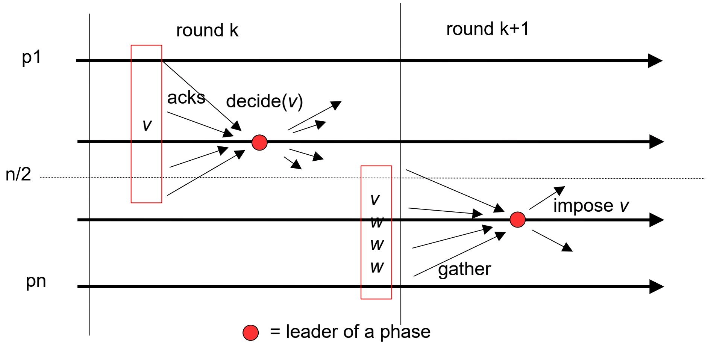

	- Agreement does not depend on FD（一致性不依赖于 FD）
		- Consider a bogus FD (provides no guarantees)（考虑一个错误的 FD（不提供任何保证））
			- may always suspect everybody（可能总是怀疑每个人）
			- may never suspect anybody（可能从不怀疑任何人）
		- Agreement is never violated（一致性从未被违反）
			- Can use the same correctness argument as before（可以使用与之前相同的正确性论证）
			- **Agreement depends on majority assumption (Quorum)**（一致性取决于多数假设（法定人数））
		- However, Termination not ensured（但是，终止性无法保证）
			- everybody may be suspected infinitely often（每个人可能会被无限期怀疑）

##### 复杂度分析

- Best case: if the leader does not crash and $\diamondsuit P$ is accurate（最佳情况：如果领导者没有崩溃并且 $\diamondsuit P$ 是准确的）
	- Four communication steps and $O(N)$ messages（四个通信步骤和 $O(N)$ 条消息）
	- Two communication steps and $O(N)$ messages if we skip READ phase（如果我们跳过 READ 阶段，则为两个通信步骤和 $O(N)$ 条消息）
- Worst case:
	- if $\diamondsuit P$ is accurate, $O(Nf) = O(N^2)$ messages for 2 phases and $O(fN^2) = O(N^3)$ for NACK（如果 $\diamondsuit P$ 是准确的，2 个阶段需要 $O(N^2)$ 条消息，NACK 需要 $O(N^3)$ 条消息）
		- $f$: number of faulty processes（故障进程数）
	- Otherwise, infinite steps（否则，无限步骤）

### FLP 不可能性定理 (FLP impossibility result)

- Asynchronous deterministic consensus with $N \geqslant 2$ processes is impossible even with one (crash) faulty process（即使只有一个（崩溃）故障进程，具有 $N \geqslant 2$ 个进程的异步确定性共识也是不可能的）
	- 无法同时完美地满足共识的三个基本属性：
		- 一致性 (Agreement)：所有正确进程决定的值必须相同。
		- 有效性 (Validity)：决定的值必须是由某个进程提出的。
		- 终止性 (Termination/Liveness)：所有正确进程最终都能做出决定。
	- 原因：异步 vs 崩溃
		- 在异步模型中，消息延迟、进程执行速度以及时钟漂移都没有上限，这使得进程无法区分其他进程是崩溃了还是只是延迟了消息。
		- FLP 证明了在某些特定的调度序列下，系统可能会永远处于一种“非决定性状态”，每一轮操作都无法产生最终结论，导致系统永远无法达成终止性。
- Even simplify the problem, FLP still holds（即使简化问题，FLP 仍然成立）
	- To strengthen the lower bound, assume binary consensus（为了加强下界，假设二进制共识）
		- Proposals and decisions are from {0, 1}（提案和决定来自 {0, 1}）
	- Even this is impossible in an asynchronous system with one faulty process（即使在有一个故障进程的异步系统中也是不可能的）
- How to circumvent FLP（如何规避 FLP）
	- Timing assumptions (failure detectors, synchrony)（引入时序假设（故障检测器，同步性））
	- No possible failures（没有可能的故障）
	- Randomization（随机化）

### Paxos

- 通过多个共识实例（Consensus Instances）来实现状态机复制（State Machine Replication, SMR）或全序广播（Total-Order Broadcast）的协议
	- Paxos is invented as a SMR protocol, i.e., total-order Broadcast（Paxos 被发明为一种 SMR 协议，即全序广播）
	- Clients and Servers（客户端和服务器）
		- Clients initiate requests（客户端发起请求）
		- Servers (processes) run consensus（服务器（进程）运行共识）
	- Multiple instances of consensus (Synod)（共识的多个实例）
		- Synod instance 25 to agree on the 25th request（Synod 实例 25 以同意第 25 个请求）
	- Unreliable estimates of the current round and leader（当前轮次和领导者的不可靠估计）
		- Both clients and processes have the (unreliable) estimate of the current round and leader (some process)（客户端和进程都有当前轮次和领导者（某个进程）的（不可靠）估计）
	- 交互流程
		- Clients send requests to the leader（客户端将请求发送给领导者）
		- The leader replies to the client（领导者回复客户端）

## 组成员资格（Group Membership）

- In some distributed applications, processes need to know which processes are participating in the computation and which are not（在某些分布式应用程序中，进程需要知道哪些进程正在参与计算，哪些没有）
	-  E.g., ZooKeeper, etcd
- Failure detectors?
	- provide such information（提供此类信息）
	- however, that information is not coordinated even if the failure detector is perfect（但是，即使故障检测器是完美的，该信息也没有协调）
- Group membership
	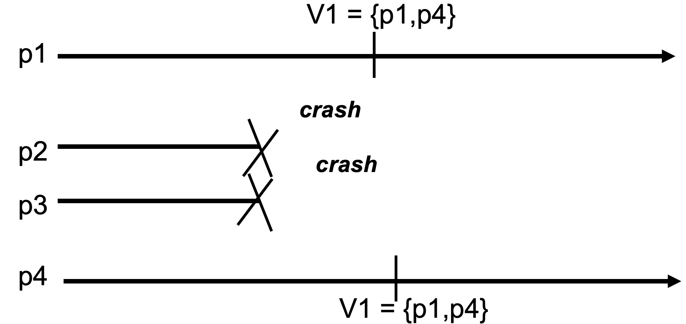

- Fault Tolerance focus（容错重点）
	- Group membership abstraction to **coordinate** the information about crashes（组成员资格抽象以协调有关崩溃的信息）
	- More generally, a group membership abstraction can also typically be used to coordinate the processes joining and leaving **explicitly** the set of processes (i.e., without crashes)（更一般地，组成员资格抽象通常也可以用于协调进程显式地加入和离开进程集（即没有崩溃））
- Like with a failure detector（与故障检测器一样）
	- the processes are informed about failures（进程被告知故障情况）
	- we say that the processes install views（我们说进程安装视图）
- Like with a perfect failure detector P（与完美故障检测器 P 一样）
	- the processes have accurate knowledge about failures（进程对故障有准确的了解）
- Unlike with a perfect failure detector P（与完美故障检测器 P 不同）
	- the information about failures are coordinated（有关故障的信息是协调的）
	- the processes install the same sequence of views（进程安装相同的视图序列）

### 规范

- Name: GroupMembership, instance $gm$.
- Indication: `<gm, View | V>`: Installs a new view V = (id, M) with view identifier id (0, 1, 2,,..) and membership M.（安装一个新的视图 V = (id, M)，其中视图标识符为 id，成员资格为 M）
- Properties:
	- GM1. **Monotonicity**: If a process $p$ installs a view $V = (id, M)$ and subsequently installs another view $V^\prime= (id^\prime, M^\prime)$, then $id < id^\prime$ and $M^\prime \subsetneq M$,（单调性：如果进程 $p$ 安装视图 $V = (id, M)$，然后安装另一个视图 $V^\prime = (id^\prime, M^\prime)$，则 $id < id^\prime$ 且 $M^\prime \subsetneq M$。）
	- GM2. **Uniform Agreement**: If some process installs a view $V = (id, M)$ and another process installs some view $V^\prime = (id, M^\prime)$, then $M = M^\prime$,（统一一致性：如果某个进程安装视图 $V = (id, M)$，另一个进程安装某个视图 $V^\prime = (id, M^\prime)$，则 $M = M^\prime$。）
	- GM3. **Completeness**: If a process $p$ crashes, then eventually every correct process installs a view (id, M) such that $p \notin M$,（完整性：如果进程 $p$ 崩溃，则最终每个正确的进程都会安装视图 (id, M)，使得 $p \notin M$。）
	- GM4. **Accuracy**: If some process installs a view (id, M) with $q \notin M$ for some process $q \in \Pi$, then $q$ has crashed.（准确性：如果某个进程安装视图 (id, M)，其中对于某个进程 $q \in \Pi$ 有 $q \notin M$，则 $q$ 已崩溃。）

### 算法：基于共识的组成员资格（Consensus-Based Group Membership）

- Implemented: GroupMembership, instance $gm$.
- Uses:
	- UniformConsensus, multiple instances $uc.i$ for view $i$
	- PerfectFailureDetector, instance $P$

```
// 初始化 gm，设置当前视图编号为 0，成员集为所有进程，
// 设置正确进程集为所有进程，等待标志为 FALSE，然后安装初始视图
upon event <gm, Init> do
	(id, M) := (0, Π);
	correct := Π;
	wait := FALSE;
	trigger <gm, View | (id, M)>;

// 当 P 检测到进程 p 崩溃时，从正确进程集中移除 p
upon event <P, Crash | p> do
	correct := correct \ {p};

// 当正确进程集是当前成员集的真子集且不在等待时，启动一个新的共识实例以提出新的成员集
upon correct ⊊ M ∧ wait = FALSE do
	id := id + 1;
	wait := TRUE;
	Initialize a new instance uc.id;
	trigger <uc.id, Propose | correct>;

// 当共识实例 id 决定了成员集 M' 时，更新当前成员集为 M'，将等待标志设为 FALSE，并安装新视图
upon event <uc.i, Decide | M'> such that i = id do
	M := M';
	wait := FALSE;
	trigger <gm, View | (id, M)>;
```

### 示例
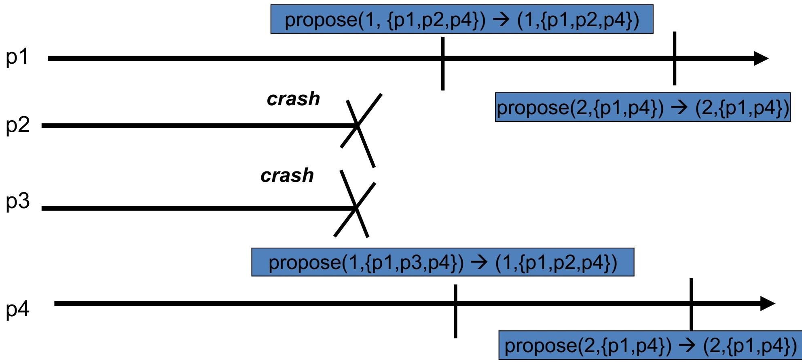

### 正确性论证

- Monotonicity（单调性）
	- $id < id^\prime$
		- By construction（通过构造）
		- Each new view is proposed in a new consensus instance with increasing id（每个新视图都在一个新的具有递增 id 的共识实例中提出）
		- With the `WAIT` flag, a process will not propose to instance $id$ before all lower-numbered instances have decided（通过 `WAIT` 标志，进程不会在所有较低编号的实例决定之前向实例 $id$ 提出建议）
	- $M^\prime \subsetneq M$
		- By uniform consensus Validity（通过统一共识的有效性）
		- Since a consensus is triggered only when $\mathrm{correct} \subsetneq M$（因为仅当 $\mathrm{correct} \subsetneq M$ 时才会触发共识）
- Agreement（一致性）
	- By uniform consensus Uniform Agreement（通过统一共识的一致性）
- Completeness（完整性）
	- By strong completeness of $P$ all correct processes suspect $p$ eventually（通过 $P$ 的强完整性，所有正确的进程最终都会怀疑 $p$）
	- Once all correct processes suspect $p$, a member set without $p$ will be proposed by all（一旦所有正确的进程怀疑 $p$，所有进程都会提出一个不包含 $p$ 的成员集）
	- By uniform consensus Validity，a view without $p$ is installed（通过统一共识有效性安装了没有 $p$ 的视图）
- Accuracy（准确性）
	- By Strong Accuracy of $P$（通过 $P$ 的强准确性）

## 应用
### 顺序算法与分布式算法（Sequential Algorithms vs. Distributed Algorithms）
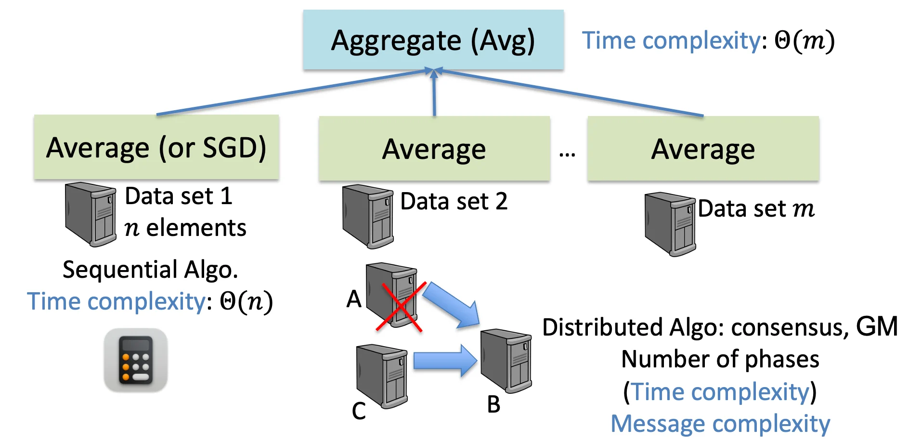

### 分布式存储系统（Distributed storage systems）

- Google File System, Apache HDFS, Ceph,,..
	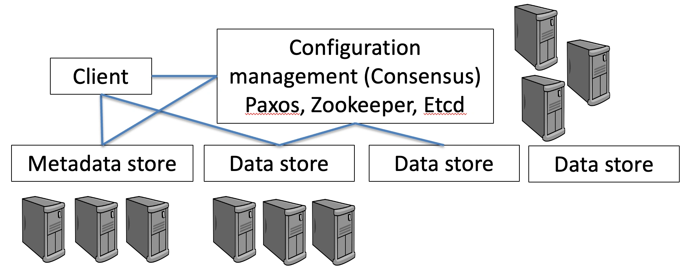

- Configuration management module（配置管理模块）
	- Full-fledged SMR (group membership, consensus)（完善的 SMR（组成员资格，共识））
	- $N = 5$, typically
- Metadata store（元数据存储）
	- Another level of indirection（另一层间接性）
	- E.g., Ceph
- Data store（数据存储）
	- 3-way replication,  $N = 3$, usually a single writer（3 路复制，通常是单个写入器）
	- Rack Awareness（机架感知）

### 大型数据库系统（Large-scale database systems）

- Google Spanner, PingCAP TiDB, WeChat PaxosStore...
	- Span over multiple continents（跨越多个大陆）
	- Use Paxos or Raft as a building block（使用 Paxos 或 Raft 作为构建模块）

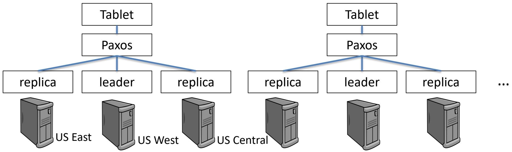

- Scalability, availability and high performance（可扩展性，可用性和高性能）
- Each tablet is managed by a Paxos group（每个平板由一个 Paxos 组管理）
	- Tablet: a bag of (key:string, timestamp:int64)  $\rightarrow$ string
	- 3 to 5 replicas（3 到 5 个副本）
	- Data placement can be specified（可以指定数据放置）
		- May across continents（可能跨越多个大陆）
- Among tablets, using two-phase commit for ACID（在平板之间，使用两阶段提交实现 ACID）
	- Atomicity, Consistency, Isolation and Durability（原子性，一致性，隔离性和持久性）