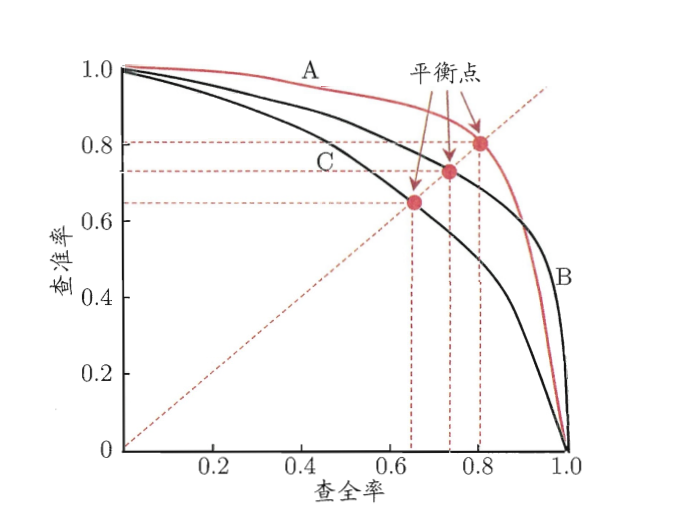
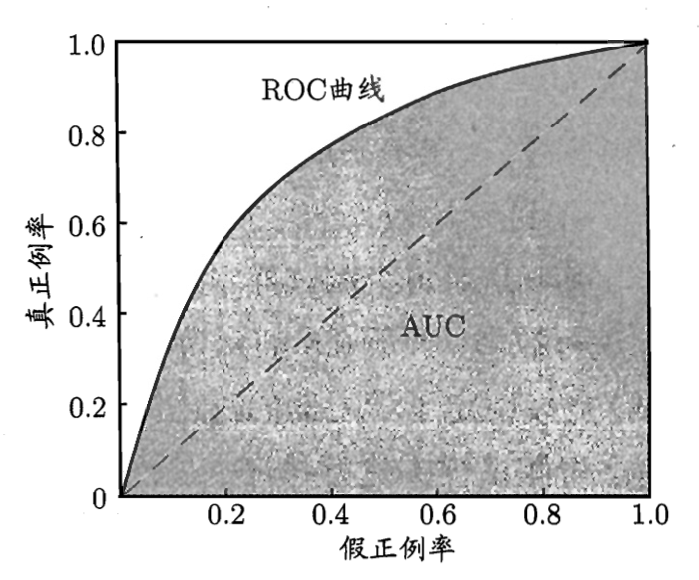
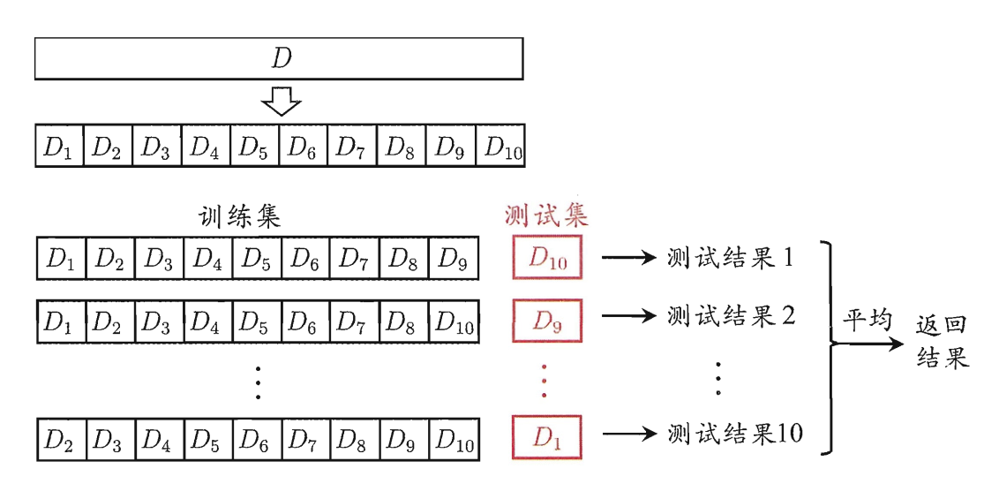

# 机器学习绪论

## 机器学习分类
### 监督学习（Supervised Learning）

- **定义**：利用 **带有明确标签（Label）或答案** 的数据进行训练。
- **主要任务**：
	- **回归**（Regression）：预测连续数值（如房价、温度）。评估指标通常是 MSE。
	- **分类**（Classification）：预测离散类别（如：识别猫狗、疾病阴性/阳性）。
- **典型算法**：线性回归、逻辑回归、支持向量机（SVM）、决策树、随机森林。

### 无监督学习（Unsupervised Learning）

- **定义**：给机器的数据 **完全没有标签**，模型需要自己探索数据的内部结构、潜在模式或分布规律。
- **主要任务**：
	- **聚类**（Clustering）：将数据划分成不同的组，使得同组内的数据点相似度高，不同组之间的相似度低。
	- **降维**（Dimensionality Reduction）：剔除冗余特征，提取数据的核心信息，降低数据维度以便可视化或后续处理。
- **典型算法**：K-Means（K 均值聚类）、PCA（主成分分析）。

### 强化学习（Reinforcement Learning）

- **定义**：给定一个目标，智能体（Agent）通过与环境交互，由环境给予反馈，通过 **不断试错学习** 来找到最优策略。
- **应用**：AlphaGo 下围棋、自动驾驶决策、机器人控制。
- **典型算法**：Q-Learning、DQN。

## 机器学习流派
### 符号主义（Symbolists）

- **思想**：认为学习就是 **逻辑推理**。通过逆向演绎提炼出规则树。可解释性极强。
- 代表算法：
	- **决策树**（Decision Tree）：通过不断提问把数据划分成不同的分支，最终形成一棵树来做预测，适用于分类和回归任务，缺点是容易过拟合。
	- **随机森林**（Random Forest）：集成了大量的决策树，各自进行预测，最终通过投票机制来提升整体性能和稳定性，适用于分类和回归任务，能有效减少过拟合。

### 连接主义（Connectionists）

- **思想**：认为学习就是 **模拟大脑神经网络**。无需设定逻辑，靠海量数据刺激神经元调整连接权重。当前统治学术界和工业界，缺点是产生的是“黑盒模型”，难以解释其决策过程。
- 代表算法：
	- **人工神经网络**（ANN）：由输入层、隐藏层和输出层组成的网络结构，适用于各种任务。
		- 前馈神经网络（Feedforward Neural Networks）：信息单向流动，适合基本的回归和分类任务。
		- 卷积神经网络（CNN）：专门处理图像数据，通过卷积层提取空间特征。
		- 循环神经网络（RNN）及其变体 LSTM/GRU：擅长处理序列数据，如文本和时间序列。
	- **深度学习**（DL）：神经网络的升级版，拥有更多层数和更复杂的结构，能够自动学习数据的多层次特征表示。

### 统计学习（Statisticians）

- **思想**：认为学习就是 **统计建模**。通过数学方法拟合数据分布，强调模型的可解释性和理论基础。
- 代表算法：
    - **线性回归**（Linear Regression）：通过拟合一条直线来预测连续值，适用于回归任务，缺点是无法捕捉非线性关系。
    - **逻辑回归**（Logistic Regression）：通过拟合一个 S 型曲线来预测二分类概率，适用于分类任务，缺点是无法处理多类别问题。
    - **朴素贝叶斯**（Naive Bayes）：基于特征条件独立假设的贝叶斯分类器，计算简单，适用于文本分类等高维数据。**朴素** 在于其假设所有特征之间相互独立，这在现实中往往不成立。
	- **K-近邻算法**（KNN）：通过计算新数据点与训练集中所有数据点的距离，找到最近的 K 个邻居，根据它们的标签进行投票或平均来做预测，适用于分类和回归任务。
	- **支持向量机**（SVM）：通过寻找一个超平面来最大化不同类别之间的间隔，适用于线性和非线性分类任务。

## 机器学习基本术语
### 理论基础相关

- **特征**（Feature）/**属性**（Attribute）：模型用来做预测的输入变量，反映事件或对象在某方面的表现或性质，记作 $x_i$
    - **特征向量**：一个样本的所有特征值组成的向量，通常表示为 $\mathbf{x} = (x_1, x_2, ..., x_d)$，其中维度 $d$ 表示特征的数量
- **标签**（Label/Target）：模型试图预测的最终结果，记作 $y$
- **样本**（Sample）：数据集中的一个实例，通常由一组特征和对应的标签组成，记作 $(\mathbf{x}, y)$
- **数据集**（Dataset）：由多个样本组成的集合，表示为 $D = \{(\mathbf{x}_1, y_1), (\mathbf{x}_2, y_2), ..., (\mathbf{x}_n, y_n)\}$。
	- **训练集**（Training Set）：用于模型学习的主要数据，记作 $D_{Train}$
	- **验证集**（Validation Set）：用于调参和选择模型的辅助数据，记作 $D_{Val}$
	- **测试集**（Test Set）：用于评估模型最终性能的独立数据，记作 $D_{Test}$
- **假设空间**（Hypothesis Space）：机器学习模型在训练时，所能考虑到的 **所有可能函数的集合**。
- **归纳偏好**：当有多个不同的模型都能完美解释手头的数据时，机器学习算法更倾向于选择哪一种模型的偏好。
	- **奥卡姆剃刀原则（Occam's Razor）**：**如无必要，勿增实体** —— 如果能画直线穿过数据，就不要画疯狂波动的曲线。因为越复杂的模型越可能是在死记硬背数据噪音（过拟合）。
- **NFL 定理**：一个算法 $A$ 若在某些问题上表现得比另一个算法 $B$ 更好，那么必然存在另一些问题 $B$ 比 $A$ 更好。换句话说：如果不对问题做任何先验假设，所有机器学习算法在所有可能的问题上的平均表现是完全一样的。
	- 重要前提：所有问题出现的机会相同，或所有问题同等重要。

### 模型与训练相关

- 参数与超参数：
	- **参数**（Parameter）：模型 **自己从数据中学到的** 变量（如网络权重、决策树的分裂点等）。
	- **超参数**（Hyperparameter）：训练前 **人工手动设置的** 变量（如学习率、训练轮数、树的深度等）。
- 轮次、批次与迭代：
	- **轮次**（Epoch）·：所有训练数据被模型完整学习一遍称为一个轮次。
	- **批次**（Batch）：模型一次性无法消化所有数据，切分成小批次送入。
	- **迭代**（Iteration）：处理完一个 Batch 并更新一次参数的过程。
- 过拟合与欠拟合：
	- **过拟合**（Overfitting）：模型死记硬背导致训练集得分极高而测试集极差（缺乏泛化能力）。
	- **欠拟合**（Underfitting）：模型没好好学，则连训练集的规律都没掌握，表现很差。
- **泛化能力**（Generalization）：模型在没见过的新数据上的表现能力。

### 算法与优化相关

- **损失函数**（Loss Function）：衡量“预测值”与“真实值”的差距。训练的目的就是让它降到最低。
- **梯度下降**（Gradient Descent）：最常用的优化算法。如同蒙眼下山，每次顺着最陡的坡度向下走一步，直到谷底（误差最小处）。
- **学习率**（Learning Rate）：梯度下降中下山的“步伐大小”。太大容易跨过谷底，太小则走得极其缓慢。
- **正则化**（Regularization）：防止模型过拟合而采取的技术，通过给损失函数增加一些惩罚项，强迫模型保持简单，不让它去死记硬背数据里的噪音（如 L1 / L2 正则化、Dropout）。

### 评估指标相关
#### 回归问题的评估指标

- **均方误差**（MSE, Mean Squared Error）
	- **定义**：预测值与真实值误差平方的平均数。（也是后面“最小二乘法”所使用的底层代价函数）。

        $$
        E(f;D) = \frac{1}{n} \sum_{i=1}^{n} (f(\mathbf{x}_i) - y_i)^2
        $$

	- **特点**：极其讨厌大误差。如果有个别预测值错得离谱，MSE 的值会瞬间爆炸，因此它对异常值极其敏感。

#### 分类问题的评估指标

- **混淆矩阵**（Confusion Matrix）：在二分类任务中，预测结果和真实情况交叉后会产生 4 种状态：
	- **真正例**（TP, True Positive）：预测为正，实际为正。（成功抓到小偷）
	- **假正例**（FP, False Positive）：预测为正，实际为负。（正常人被误抓了）
	- **真负例**（TN, True Negative）：预测为负，实际为负。（正常人被正确放过）
	- **假负例**（FN, False Negative）：预测为负，实际为正。（漏网之鱼）
- **核心指标**：
	- **准确率**（Accuracy, ACC）：不管正例负例，总共猜对的比例。在正负样本极度不平衡时有极大的欺骗性。

		$$
        \mathrm{ACC} = \frac{1}{n} \sum_{i=1}^{n} \mathbb{I}\{f(\mathbf{x}_i) = y_i\} = \frac{TP + TN}{TP + FP + TN + FN}
        $$

	- **精确率/查准率**（Precision）：预测为正例的结果中，真正的正例占比。

		$$
        \mathrm{Precision} = \frac{TP}{TP + FP}
        $$

	- **召回率/查全率**（Recall）：所有真实的正例中，被成功找出来的比例。

		$$
        \mathrm{Recall} = \frac{TP}{TP + FN}
        $$

	- **F1-Score**：精确率和召回率的调和平均数。只有当两者都很高时，F1 才会高，用于综合评价模型。

		$$
        \mathrm{F1} = \frac{2 \times \mathrm{Precision} \times \mathrm{Recall}}{\mathrm{Precision} + \mathrm{Recall}}
        $$

	- **$F_\beta$-Score**：现实业务中，Precision 和 Recall 并非总是同等重要。$F_\beta$ 允许我们人为设定偏好。

		$$
        \mathrm{F_\beta} = \frac{(1 + \beta^2) \times \mathrm{Precision} \times \mathrm{Recall}}{(\beta^2 \times \mathrm{Precision}) + \mathrm{Recall}}
        $$

		- $\beta = 1$：退化为标准的 F1
		- $\beta > 1$：**召回率** 的权重更大（宁可错杀绝不放过）
		- $\beta < 1$：**精确率** 的权重更大（宁缺毋滥）
    - **PR 曲线**（精确率-召回率曲线）：横轴是 Recall，纵轴是 Precision，展现了模型在不同阈值下的表现，曲线必定经过 $(0,1)$ 和 $(1,0)$ 两个点，且越靠右上角越好。
        

    - **ROC 曲线**（受试者工作特征曲线）：横轴是 FPR，纵轴是 TPR，展现了模型在不同阈值下的表现，曲线必定经过 $(0,0)$ 和 $(1,1)$ 两个点，且越靠左上角越好。
        

	- **AUC**（AUROC, Area Under ROC Curve）：ROC 曲线下的面积（0.5~1.0 之间），**对样本极度不平衡具有极强的抗干扰能力**。
		- **TPR**（真正例率）：即召回率/查全率

			$$
            \mathrm{TPR} = \frac{TP}{TP + FN}
            $$

		- **FPR**（假正例率）：在所有真实的负例中，被误判为正例的比例。

			$$
            \mathrm{FPR} = \frac{FP}{FP + TN}
            $$

## 机器学习数据集划分方法

- **划分法则**：
	1. **分层抽样**（Stratified Sampling）：分类任务尤其是数据不平衡时必须使用，确保训练/测试集中各类别比例与整体一致。
	2. **时间序列划分**（Time Series Split）：凡是具有时间属性的数据（如股票、天气），严禁随机打乱交叉验证，必须严格用过去预测未来，防止“数据穿越/泄露”。

### 留出法（Holdout Method）

- **原理**：直接将数据集随机切分为互斥的集合（$D_{Train}: D_{Test}$ 一般为 $2:1 \sim 4:1$）
- **优缺点**：操作最简单，计算开销小；但由于单次随机划分，评估结果可能有较大方差。
- **适用场景**：海量数据集（如深度学习）。

### K 折交叉验证法（K-Fold Cross-Validation）

- **原理**：将数据随机平分成 $K$ 份（通常 $K=10$ 或 $5$）。每次拿 $1$ 份做测试，剩下 $K-1$ 份做训练。重复 $K$ 次，取结果的平均值。
    

- **优缺点**：评估结果非常稳定可靠，充分利用了数据；但计算成本是留出法的 $K$ 倍。
- **适用场景**：中小型数据集，或需要精细调参时。

### 留一法（Leave-One-Out, LOO）

- **原理**：交叉验证的极端特例。假设有 $N$ 个样本，则取 $K+N$，每次只留 $1$ 个做测试，剩下 $N-1$ 个做训练，重复 $N$ 次。
- **优缺点**：评估结果极其准确；但在数据量稍大时，算力成本是天文数字。
- **适用场景**：极其稀少的数据集（如几十例罕见病数据）。

### 自助法（Bootstrapping）

- **原理**：基于 **有放回的随机抽样**，重复 $m$ 次（$m$ 通常与原数据集大小相同）得到子数据集，由于样本始终不被抽到的概率 $\lim_{m \to \infty} (1 - \frac{1}{m})^m = e^{-1} \approx 0.368$，因此这个子数据集约包含原数据集 $63.2\%$ 的样本，将其作为训练集，剩下的 $36.8\%$ 样本作为测试集，也称为“包外数据（Out-of-Bag）”。
- **优缺点**：能在数据极少时有效扩充训练集丰富度，是“随机森林”算法的核心基础；但改变了原数据分布，可能引入偏差。
- **适用场景**：数据集极小，或构建集成学习模型时。