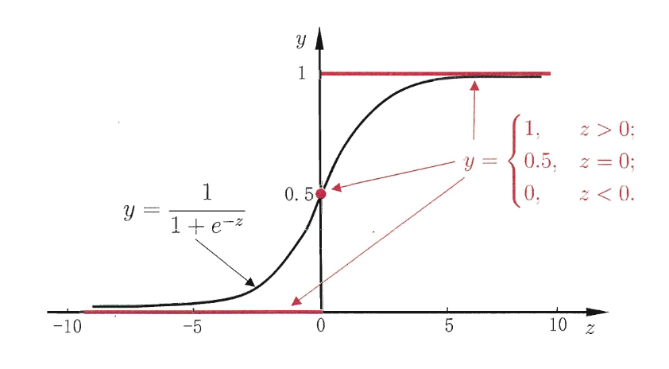
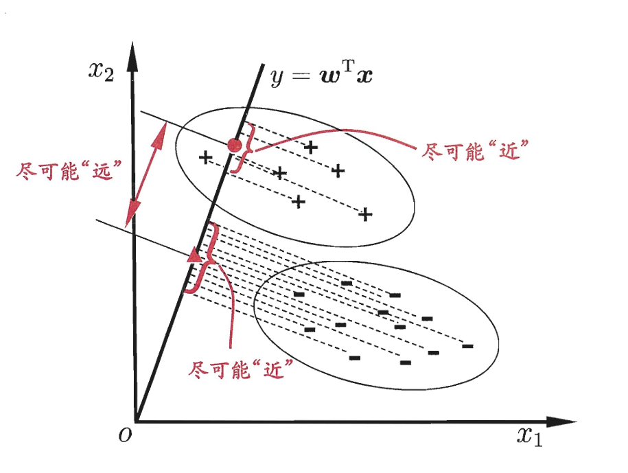
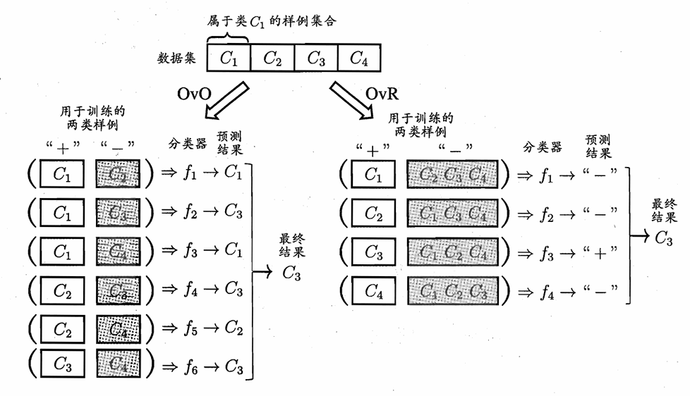
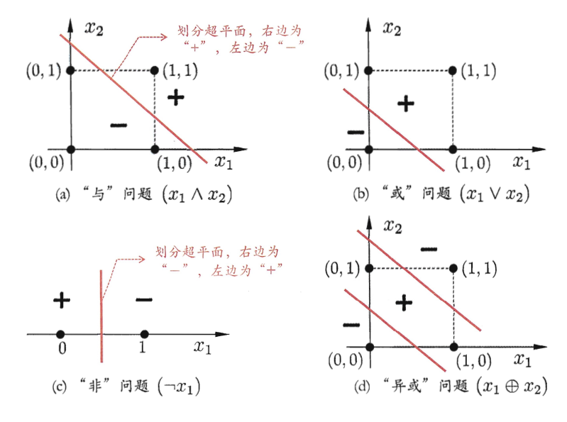

# 线性算法

## 基本形式
给定 $d$ 维特征 $\mathbf{x} = (x_1, x_2, \dots, x_d)$，线性算法假设预测结果是特征的线性组合：$f(\mathbf{x}) = w_1x_1 + w_2x_2 + \dots + w_dx_d + b = \mathbf{w}^T\mathbf{x} + b$，其中 $\mathbf{w}$ 是权重向量，$b$ 是偏置项，只要学得到合适的 $\mathbf{w}$ 和 $b$，就能用这个线性函数来进行预测。

## 线性回归

- **原理**：寻找一条直线（或超平面），使得所有真实数据点到该直线的 **预测误差平方和**（均方误差 MSE）达到 **最小**，这被称为 **最小二乘法**（Least Squares）。
    - 当噪声为加性且符合零均值高斯分布时，最小二乘法等价于最大似然估计。
- 取平方：
    - 避免正负误差互相抵消
    - 严重惩罚偏离较大的异常点
    - 平方函数平滑且可导，方便求解

### 一元简单线性回归

- **模型假设**：$f(x_i) = w x_i + b$
- **目标函数**：均方误差 $E(w, b) = \sum_{i=1}^{n}(f(x_i) - y_i)^2 = \sum_{i=1}^{n}(y_i - w x_i - b)^2$
- **目标**：为了让真实数据点到该直线的预测误差平方和最小，即最小化均方误差，求解

    $$
    (w^*, b^*) = \arg\min_{w, b} E(w, b)
    $$

- **求解：最小二乘法**：为了最小化均方误差，分别对 $w$ 和 $b$ 求偏导并令其等于 0：

    $$
    \begin{aligned}
    \frac{\partial E}{\partial w} &= -2\sum_{i=1}^{n} x_i (y_i - w x_i - b) = 0 \\
    \frac{\partial E}{\partial b} &= -2\sum_{i=1}^{n} (y_i - w x_i - b) = 0
    \end{aligned}
    $$

    解得闭式解

    $$
    w^* = \frac{\sum_{i=1}^{n} y_i(x_i - \bar{x})}{\sum_{i=1}^{n} (x_i - \bar{x})^2},\quad
    b^* = \frac{1}{n} \sum_{i=1}^{n} (y_i - w^* x_i)
    $$

### 多元线性回归
现实中特征极多，用矩阵演算不仅简洁，而且计算机底层可以直接并行计算。

- **模型假设**：$f(\mathbf{x}_i) = w_1 x_{i1} + w_2 x_{i2} + \dots + w_d x_{id} + b$，其中 $x_{ij}$ 是第 $i$ 个样本的第 $j$ 个特征，则可以表示为矩阵形式 $f(\mathbf{X}) = \mathbf{Xw} = \mathbf{\hat{y}}$，其中：
    - $\mathbf{X}_{n\times (d+1)}$ 是特征矩阵，其中 $n$ 是样本数，$d+1$ 是因为为了吸收偏置项 $b$，需要在矩阵中添加一列全为 1 的特征。
    - $\mathbf{w}_{(d+1) \times 1}$ 是权重向量，包含了 $b$ 和所有权重 $w_j$。
    - $\mathbf{y}_{n \times 1}$ 是真实标签向量。
- **目标函数**：均方误差，用矩阵形式表示为：

    $$
    \begin{aligned}
    E(\mathbf{w}) &=(\mathbf{y} - \mathbf{\hat{y}})^T(\mathbf{y} - \mathbf{\hat{y}}) = (\mathbf{y} - \mathbf{Xw})^T(\mathbf{y} - \mathbf{Xw}) \\
    &= \mathbf{y}^T\mathbf{y} - \mathbf{y}^T\mathbf{Xw} - (\mathbf{Xw})^T\mathbf{y} + (\mathbf{Xw})^T(\mathbf{Xw}) \\
    &= \mathbf{y}^T\mathbf{y} - 2\mathbf{w}^T\mathbf{X}^T\mathbf{y} + \mathbf{w}^T\mathbf{X}^T\mathbf{Xw}
    \end{aligned}
    $$

- **目标**：为了最小化均方误差，求解

    $$
    \mathbf{w}^* = \arg\min_{\mathbf{w}} E(\mathbf{w})
    $$

- **求解**：
    - **最小二乘法**：根据矩阵求导法则 $\frac{\partial(\mathbf{w}^T \mathbf{a})}{\partial \mathbf{w}} = \mathbf{a}$ 和 $\frac{\partial(\mathbf{w}^T \mathbf{A} \mathbf{w})}{\partial \mathbf{w}} = 2\mathbf{A}\mathbf{w}$（其中 $A$ 是对称矩阵），对损失函数求导并令其等于 0：

        $$
        \frac{\partial E}{\partial \mathbf{w}} = 0 - 2\mathbf{X}^T\mathbf{y} + 2\mathbf{X}^T\mathbf{Xw} = 0
        $$

        若 $\mathbf{X}^T\mathbf{X}$ 满秩或正定，则可以求逆得到：

        $$
        \mathbf{X}^T\mathbf{Xw} = \mathbf{X}^T\mathbf{y} \implies \mathbf{w} =(\mathbf{X}^T\mathbf{X})^{-1}\mathbf{X}^T\mathbf{y}
        $$

    - **梯度下降法**：当特征维度过高或样本量过大时，求逆计算量巨大，此时可以使用梯度下降法迭代求解：

        $$
        \mathbf{w} \leftarrow \mathbf{w} - \eta \frac{\partial E}{\partial \mathbf{w}} = \mathbf{w} - \eta (-2\mathbf{X}^T\mathbf{y} + 2\mathbf{X}^T\mathbf{Xw}) = \mathbf{w} + 2\eta (\mathbf{X}^T\mathbf{y} - \mathbf{X}^T\mathbf{Xw})
        $$

        其中 $\eta$ 是学习率，控制每次更新的步长大小。通过不断迭代更新 $\mathbf{w}$，直到损失函数收敛或达到预设的迭代次数。

    - **模拟退火法**：通过引入温度参数 $T$，在每次迭代中添加随机扰动，以跳出局部最优解。随着迭代进行，逐渐降低温度 $T$，减少扰动的幅度，使算法逐渐收敛到全局最优解。

## 广义线性模型（GLM）

- 线性回归假设输出是输入特征的线性组合，但在很多实际问题中，输出与输入之间的关系可能是非线性的。广义线性模型通过引入 **链接函数**（link function）来扩展线性模型，使其能够处理非线性关系。
- **模型假设**：$y=g^{-1}(\mathbf{w}^T\mathbf{x}+b)$，其中 $g$ 是链接函数，$g^{-1}$ 是其逆函数。

## 线性分类

- **原理**：线性分类算法试图找到一个超平面将不同类别的样本分开，使 **交叉熵** 损失函数 **最小**。可以基于线性回归的思想，通过使预测值对应类别（非线性映射）来将分类问题转化为回归问题。
    - 为了使真实分布与预测分布之间的距离最小，即 **最小化 KL 散度**，等价于 **最大化似然函数**（MLE），等价于 **最小化交叉熵** 损失函数。
- 考虑二分类任务，其输出标记 $y \in \{0, 1\}$，而线性回归模型产生的预测值 $z = \mathbf{w}^T\mathbf{x} + b$ 是实值，因此需要将实值 $z$ 转换为 $0/1$ 值。
    

### 逻辑回归

- **模型假设**：$f_\beta(\mathbf{x}) = \sigma(\mathbf{w}^T\mathbf{x} + b) = \frac{1}{1 + e^{-(\mathbf{w}^T\mathbf{x} + b)}}$，其中 $\sigma(z)$ 是 Sigmoid 函数，将实值 $z$ 映射到 $(0, 1)$ 区间，表示预测为正类的概率。
    - $\beta=(\mathbf{w}, b)$ 是模型参数的集合
    - 输出 $f_\beta(\mathbf{x})$ 解释为模型认为样本 $\mathbf{x}$ 属于正类（$y=1$）的概率，即

        $$
        \begin{aligned}
        P(y=1|\mathbf{x},\beta) &= f_\beta(\mathbf{x}) = \frac{1}{1 + e^{-(\mathbf{w}^T\mathbf{x}+b)}} \\
        P(y=0|\mathbf{x},\beta) &= 1 - f_\beta(\mathbf{x}) = \frac{e^{-(\mathbf{w}^T\mathbf{x}+b)}}{1 + e^{-(\mathbf{w}^T\mathbf{x}+b)}}
        \end{aligned}
        $$

- **目标函数**：对于二分类任务，使用交叉熵损失函数（Cross-Entropy Loss）来衡量模型预测概率与真实标签之间的差距：

    $$
    \begin{aligned}
    E(\beta) &= -\sum_{i=1}^{n} [y_i \log f_\beta(\mathbf{x}_i) + (1-y_i) \log (1 - f_\beta(\mathbf{x}_i))] \\
    &= -\sum_{i=1}^{n} [y_i \log \frac{f_\beta(\mathbf{x}_i)}{1 - f_\beta(\mathbf{x}_i)} + \log (1 - f_\beta(\mathbf{x}_i))] \\
    &= \sum_{i=1}^{n} [-y_i (\mathbf{w}^T\mathbf{x}_i + b) + \log (1 + e^{\mathbf{w}^T\mathbf{x}_i + b})] \\
    &= \sum_{i=1}^{n} [-y_i (\beta^T\mathbf{x}_i) + \log (1 + e^{\beta^T\mathbf{x}_i})]
    \end{aligned}
    $$

- **目标**：为了使正例样本被预测为正类概率尽可能大，而负例样本被预测为负类概率尽可能大，即最大化对数似然函数，等价于最小化交叉熵损失函数，也即求解

    $$
    \beta^* = \arg\min_{\beta} E(\beta)
    $$

- **求解**：由于交叉熵损失函数是凸函数，可以使用梯度下降法或牛顿法等优化算法来求解最优参数 $\beta^*$。

### 线性判别分析（LDA）

- **思想**：将给定训练样例设法投影到一条直线上，使得同类样例尽可能接近，而异类样例尽可能远离。
    

- **模型假设**：以二分类为例
    - 数据集 $D = \{(\mathbf{x}_i, y_i)\}_{i=1}^n$，$y_i \in \{0, 1\}$
    - $\mathbf{X}_0$ 和 $\mathbf{X}_1$ 分别表示类别 0 和类别 1 的样本集合
    - $\mu_0$ 和 $\mu_1$ 分别表示类别 0 和类别 1 的均值向量
    - $\Sigma_0$ 和 $\Sigma_1$ 分别表示类别 0 和类别 1 的协方差矩阵
- **目标函数**：广义瑞利商：

    $$
    J(\mathbf{w}) = \frac{\left\lVert \mathbf{w}^T\mu_0-\mathbf{w}^T\mu_1\right\rVert^2}{\mathbf{w}^T(\Sigma_0 + \Sigma_1)\mathbf{w}} = \frac{\mathbf{w}^T S_B \mathbf{w}}{\mathbf{w}^T S_W \mathbf{w}}
    $$

    其中 $S_B = (\mu_0 - \mu_1)(\mu_0 - \mu_1)^T$ 是类间散度矩阵，$S_W = \Sigma_0 + \Sigma_1$ 是类内散度矩阵。

- **目标**：找到一个投影向量 $\mathbf{w}$，使得投影后的类间距离最大化，类内距离最小化，即最大化 $J(\mathbf{w})$，也即求解

    $$
    \mathbf{w}^* = \arg\max_{\mathbf{w}} J(\mathbf{w})
    $$

### 多分类学习拆分策略

1. **一对一**（One-vs-One, OvO）：将 $N$ 个类别两两配对，分别作为训练的正例和负例，产生 $N(N−1)/2$ 个二分类任务。测试时，新样本交给所有分类器预测，最终结果通过投票法决定，即被预测得最多的类别作为最终类别。
2. **一对其余**（One-vs-Rest, OvR）：每次将一个类别作为正例，其他所有类别作为负例，产生 $N$ 个二分类任务。测试时，新样本交给所有分类器预测，若只有一个分类器预测为正例，则该样本属于该类别；若多个分类器预测为正例，则选择预测置信度最高的类别作为结果。
    

3. **多对多**（Many-vs-Many, MvM）：直接训练一个多分类模型，输出 $N$ 个类别的概率分布，最终选择概率最高的类别作为结果。

## 感知器

- 感知器算法是最简单形式的前馈式人工神经网络，将输入直接经过权重关系映射到输出层，适用于线性可分的二分类问题。
    - 由输入层和输出层组成，没有隐藏层，因此也被称为单层感知器。
    - 只有输出层神经元进行激活函数处理，即只拥有一层功能神经元。
- **模型假设**：$f(\mathbf{x}) = \mathrm{sign}(\mathbf{w}^T\mathbf{x} + b)$，其中 $\mathrm{sign}(z) = \begin{cases}1, & z \geq 0 \\ 0, & z < 0 \end{cases}$，表示预测类别为正类或负类。
- **特点**：
    - 输入为线性函数
    - 输出或活性函数为阈值或 S 型函数
    - 多用于解决线性模式识别问题
- **目标函数**：感知器算法的目标是找到一个超平面将不同类别的样本分开，即使得所有正例样本被正确分类为正类，所有负例样本被正确分类为负类。可以定义感知器损失函数为：

    $$
    L(\mathbf{w}, b) = -\sum_{i=1}^{m} y_i (\mathbf{w}^T\mathbf{x}_i + b)
    $$

- **优化方法**：感知器算法使用随机梯度下降（SGD）来优化损失函数。在每次迭代中，算法随机选择一个 **误分类** 的样本，并更新权重和偏置。具体来说，对于每个误分类的样本 $(\mathbf{x}_i, y_i)$，权重和偏置的更新规则为：

    $$
    \mathbf{w} \leftarrow \mathbf{w} + \eta\cdot (y_i-f(\mathbf{x}_i))\cdot \mathbf{x}_i
    $$

    其中，$\eta$ 是学习率，用于控制每次更新的步长。

- **收敛性**：如果数据集是线性可分的，感知器算法一定能够找到一个超平面将不同类别的样本分开，并且在有限次迭代内收敛；如果数据集是线性不可分的，算法将无法收敛，即可能发生振荡。
    - 图中 a-c 线性可分；d 线性不可分。
    - 