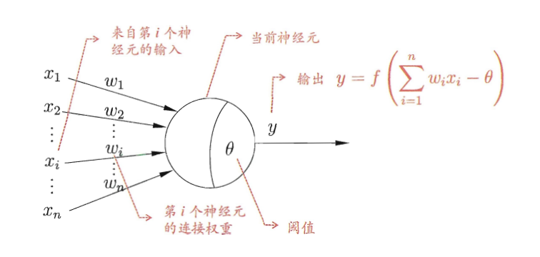
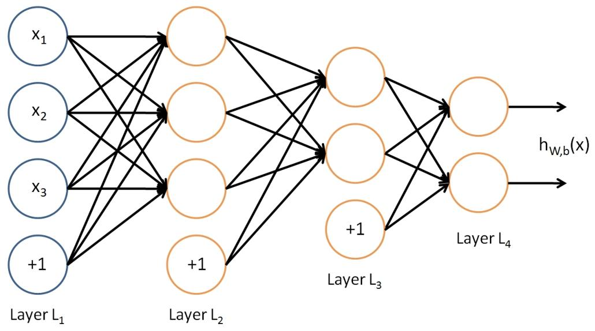
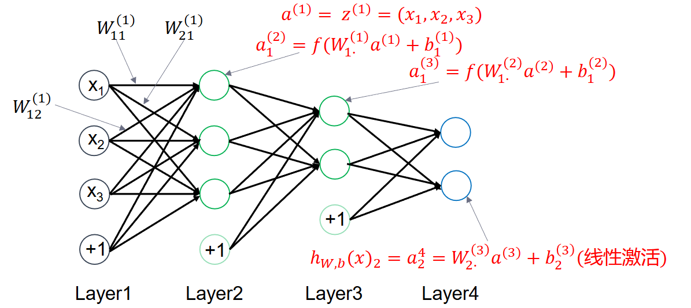
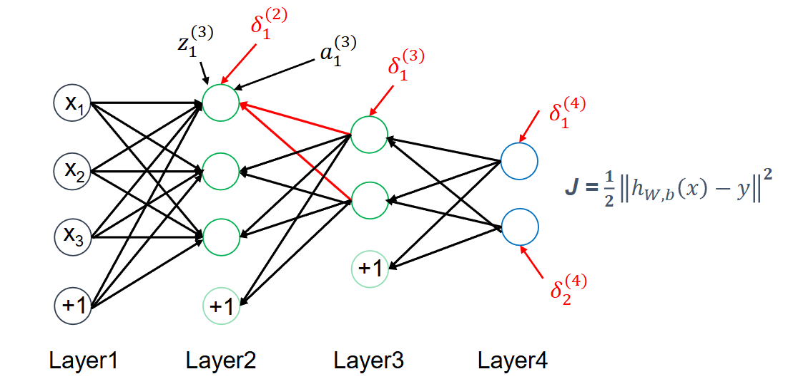
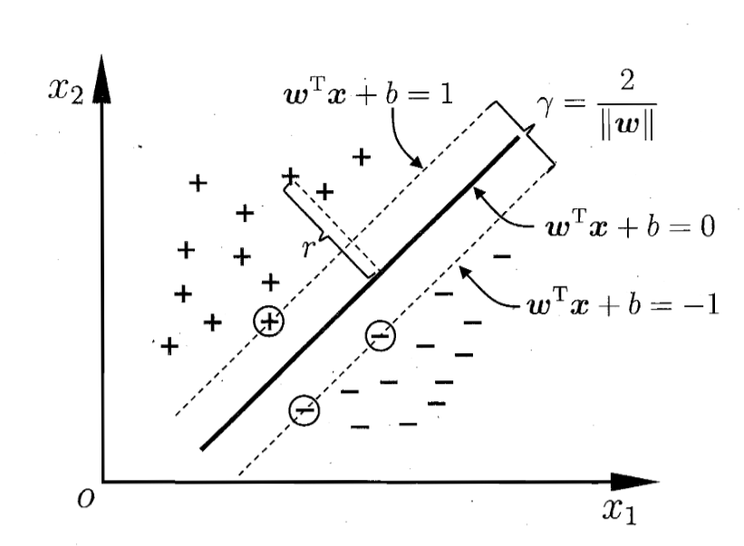
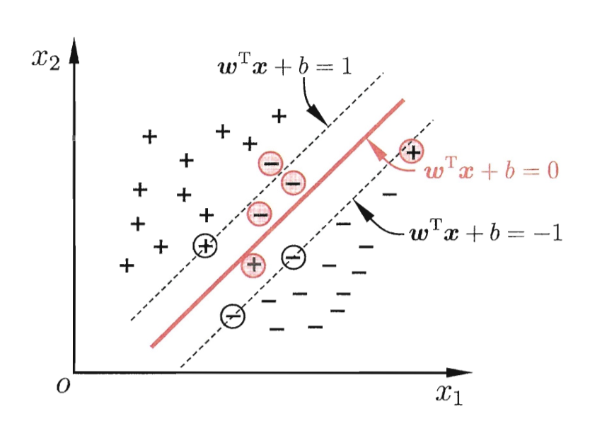
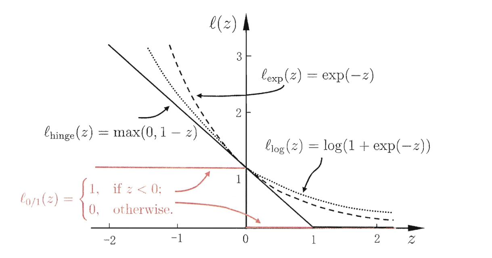
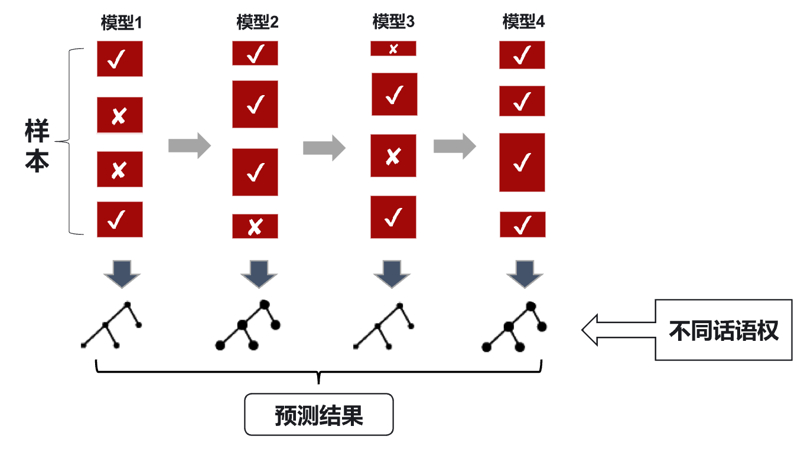

# 非线性算法

## 神经网络（Neural Networks, NN）
### M-P 神经元模型与前馈神经网络（FNN）

- **M-P 神经元模型**：接收来自几个其他神经元传递的输入信号，通过带权重的的连接进行加权求和，与神经元阈值进行比较后通过激活函数输出结果。
    

    - 权重：连接输入层和输出层的权重，表示输入信号的重要程度

    - 阈值：决定神经元是否被激活的临界值

    - 激活函数：将加权求和的结果进行非线性变换，常用的激活函数包括阶跃函数、Sigmoid 函数、ReLU 函数和 Tanh 函数等：

        - Sigmoid 函数：$f(z) = \frac{1}{1 + e^{-z}}$

        - ReLU 函数：$f(z) = \max(0, z)$

        - Tanh 函数：$f(z) = \frac{e^z - e^{-z}}{e^z + e^{-z}}$

- **前馈神经网络**（Feedforward Neural Network, FNN）：由输入层、一个或多个隐藏层和输出层组成，信息在网络中单向流动，每层神经元与下一层神经元全互连，神经元之间不存在同层连接，也不存在跨层连接。（一般而言，称“X 层神经网络”时，X 不包含输入层）

    - 输入层：接收外界输入的特征数据

    - 隐藏层 & 输出层：通过权重连接进行信息传递和处理

    - 输出层：输出最终的预测结果

### 多层感知器网络（Multi-layer Perceptron, MLP）

- **感知器**：既可以视为单层神经网络，也可以视为由输入层和输出层组成的前馈式神经网络，但只能处理线性可分的二分类问题。

- **多层感知器**：前馈神经网络的一种

    - 主要功能：

        - 实现任意逻辑函数

        - 解决非线性模式识别问题：用一个特定的输出矢量将它与输入矢量联系起来；把输入矢量以所定义的合适方式进行分类

        - 逼近从 $R^n$ 到 $R^m$ 的任意连续映射：用输入矢量和相应的输出矢量训练一个网络逼近一个函数

    - **网络结构**：

        - 包含一个或多个隐藏层

        - 隐藏层激活函数通常为非线性函数，因此可以处理非线性问题

        - 输出层通常采用线性函数

    - 示例：输入 4 维特征向量，输出 2 维向量，包含两个隐藏层，其中第一个隐藏层包含 3 个神经元，第二个隐藏层包含 2 个神经元
        

    - **激活函数**：对于 MLP 网络的每一个神经元，$\mathbf{x}$ 为输入，输出为 $h_{\mathbf{W},b}(\mathbf{x})=f(\mathbf{W}^\top \mathbf{x}+\mathbf{b})$，其中 $\mathbf{W}$ 是权重向量，$\mathbf{b}$ 是偏置项，$f$ 是激活函数。

        - MLP 网络的输出层通常采用线性函数，隐藏层激活函数通常选择 Sigmoid 函数

        - 深度学习中的深层网络的隐藏层激活函数通常选择 ReLU 函数，输出层激活函数根据具体任务选择，如分类任务常用 Softmax 函数

- **Softmax 函数**：将输出层的线性输出转换为概率分布，公式为 $f(z_i) = \frac{e^{z_i}}{\sum_{j} e^{z_j}}$，其中 $z_i$ 是输出层的第 $i$ 个神经元的线性输出。

    - 特点：输出值在 (0, 1) 之间，且所有输出值的和为 1，适用于多分类问题

### 误差逆传播算法（Back Propagation, BP）

- **核心思想**：**信号正向传播，误差反向传播**。

    - 正向传播过程中，输入信息从输入层经隐含层逐层计算传向输出层，每一层神经元的状态只影响下一层神经元的状态。

    - 如果在输出层未得到期望的输出，则计算输出层的误差变化值并反向传播，通过网络将误差信号沿原来的连接通路反传回来，更新各层神经元的权值直至达到期望目标。

- **训练过程**：

    - 训练集：$\{(\mathbf{x}_1,\mathbf{y}_1),\cdots,(\mathbf{x}_m,\mathbf{y}_m)\}$ 共 $m$ 个样本

    - 损失函数：$J(\mathbf{W},\mathbf{b}; \mathbf{x},\mathbf{y})=\frac{1}{2}\left\|h_{\mathbf{W},\mathbf{b}}(\mathbf{x})-\mathbf{y}\right\|^2$，其中 $h_{\mathbf{W},\mathbf{b}}(\mathbf{x})$ 是网络的输出，$\mathbf{y}$ 是样本的真实标签

    - 总体 loss 为 $J(\mathbf{W},\mathbf{b})=\frac{1}{m}\sum_{i=1}^m J(\mathbf{W},\mathbf{b}; \mathbf{x}_i,\mathbf{y}_i)$

- **优化目标**：最小化损失函数，即

    $$
    \arg\min_{\mathbf{W},\mathbf{b}} J(\mathbf{W},\mathbf{b}) = \arg\min_{\mathbf{W},\mathbf{b}} \frac{1}{m}\sum_{i=1}^m \frac{1}{2}\left\|h_{\mathbf{W},\mathbf{b}}(\mathbf{x}_i)-\mathbf{y}_i\right\|^2
    $$

- **信号前向传播**

    - 符号定义：

        - $W_{ij}^{(l)}$：第 $l$ 层的 $j$ 单元与第 $l+1$ 层的 $i$ 单元的连接参数

        - $b_{i}^{(l)}$：第 $l+1$ 层第 $i$ 单元的偏置参数

        - $z_{i}^{(l)}$：第 $l$ 层第 $i$ 单元 **输入** 的加权和，即

            $$
            z_{i}^{(l)}=\sum_{j} W_{ij}^{(l-1)}a_{j}^{(l-1)}+b_{i}^{(l-1)}
            $$

        - $a_{i}^{(l)}$：第 $l$ 层第 $i$ 单元 **输出** 的激活值，即

            $$
            a_{i}^{(l)}=f(z_{i}^{(l)})
            $$

        - $h_{\mathbf{W},\mathbf{b}}(\mathbf{x})_i$：输出层第 $i$ 单元的输出值，对应标签 $y_i$

    - 示例：
        

- **误差反向传播**

    - **残差** $\delta_{i}^{(l)}$：每个单元的梯度，即 $J$ 对 $l$ 层第 $i$ 个单元输入加权和 $z_{i}^{(l)}$ 的偏导，它表明 **该节点对最终输出值的残差产生了多少影响**。

        $$
        \delta_{i}^{(l)}=\frac{\partial}{\partial z_{i}^{(l)}}J=\frac{\partial}{\partial z_{i}^{(l)}}\frac{1}{2}\left\|h_{W,b}(x)-y\right\|^2
        $$

    - 示例：

        - **输出层残差**：

            $$
            \begin{aligned}
            \delta_{i}^{(4)} &= \frac{\partial}{\partial z_{i}^{(4)}} \frac{1}{2}\left\|h_{W,b}(x)-y\right\|^2 \\
            &= \frac{\partial}{\partial z_{i}^{(4)}} \frac{1}{2}\sum_{j=1}^2(z_j^{(4)}-y_j)^2 \\
            &= z_i^{(4)}-y_i
            \end{aligned}
            $$

        - **隐藏层残差**（链式法则）：

            $$
            \begin{aligned}
            \delta_1^{(3)}&=\frac{\partial}{\partial z_1^{(3)}}J \\
            &=\frac{\partial J}{\partial a_1^{(3)}} \cdot \frac{\partial a_1^{(3)}}{\partial z_1^{(3)}} \\
            &=\left(\frac{\partial J}{\partial z_1^{(4)}} \cdot \frac{\partial z_1^{(4)}}{\partial a_1^{(3)}}+\frac{\partial J}{\partial z_2^{(4)}} \cdot \frac{\partial z_2^{(4)}}{\partial a_1^{(3)}}\right) \cdot f'\left(z_1^{(3)}\right)\\
            &=\left(\delta_1^{(4)} \cdot \frac{\partial z_1^{(4)}}{\partial a_1^{(3)}}+\delta_2^{(4)} \cdot \frac{\partial z_2^{(4)}}{\partial a_1^{(3)}}\right) \cdot f'\left(z_1^{(3)}\right)\\
            &=\left(\delta_1^{(4)} \cdot W_{11}^{(3)}+\delta_2^{(4)} \cdot W_{21}^{(3)}\right) \cdot \left(1-a_1^{(3)}\right) \cdot a_1^{(3)}
            \end{aligned}
            $$

            同理，对于第二层隐藏层的残差：

            $$
            \delta_1^{(2)}=\frac{\partial}{\partial z_1^{(2)}}J=\left(\delta_1^{(3)} \cdot W_{11}^{(2)}+\delta_2^{(3)} \cdot W_{21}^{(2)}\right) \cdot \left(1-a_1^{(2)}\right) \cdot a_1^{(2)}
            $$

- **权重更新算法**：注意到 $z_{i}^{(l+1)}=\sum_{j=1}^{S_l} W_{ij}^{(l)}a_j^{(l)}+b_i^{(l)}$，有

    $$
    \begin{aligned}
    &\frac{\partial}{\partial W_{ij}^{(l)}}J=\frac{\partial J}{\partial z_i^{(l+1)}} \cdot \frac{\partial z_i^{(l+1)}}{\partial W_{ij}^{(l)}}=\delta_i^{(l+1)} \cdot a_j^{(l)} \\
    &\frac{\partial}{\partial b_i^{(l)}}J=\frac{\partial J}{\partial z_i^{(l+1)}} \cdot \frac{\partial z_i^{(l+1)}}{\partial b_i^{(l)}}=\delta_i^{(l+1)}
    \end{aligned}
    $$

    因此，权重更新公式为：

    $$
    \begin{aligned}
    \mathbf{W} &= \mathbf{W} - \alpha \frac{\partial J(\mathbf{W},\mathbf{b})}{\partial \mathbf{W}} \\
    \mathbf{b} &= \mathbf{b} - \alpha \frac{\partial J(\mathbf{W},\mathbf{b})}{\partial \mathbf{b}}
    \end{aligned}
    $$

- **算法基本流程**：

    1. 输入训练样本，初始化权值矩阵

    2. 正向传播计算输出

    3. 计算输出层残差并反向传播计算隐藏层残差

    4. 根据残差计算权值更新量，更新权值矩阵

    5. 重复步骤 2-4 直至满足终止条件，如：

        - 固定迭代次数后停止

        - Early Stopping：验证集上持续 $k$ 次迭代无准确率提升则停止

## 支持向量机（Support Vector Machine, SVM）

- **支持向量**（Support Vector）：支持向量为分界面附近的数据点，是最难分类的数据点。

- **核心思想**：用于解决线性可分的二分类问题，寻找一个最大化类间距离的分界面。**分类面由少数支持向量决定**。

### 线性可分

1. 定义超平面 $H_1: \mathbf{w}^\top \cdot \mathbf{x} + b = 1$ 和 $H_2: \mathbf{w}^\top \cdot \mathbf{x} + b = -1$，分界面为 $\mathbf{w}^\top \cdot \mathbf{x} + b = 0$。

    - 则正例样本（$y_i=+1$）满足 $\mathbf{w}^\top \cdot \mathbf{x} + b \geq 1$，反例样本（$y_i=-1$）满足 $\mathbf{w}^\top \cdot \mathbf{x} + b \leq -1$，是支持向量时取等。

    - 示例：

2. $H_1$ 与 $H_2$ 到中心分界面的距离均为

    $$
    \frac{|\mathbf{w}^\top \cdot \mathbf{x} + b|}{\|\mathbf{w}\|} = \frac{1}{\|\mathbf{w}\|}
    $$

    进而，$\mathrm{Margin}=\frac{2}{\|\mathbf{w}\|}$。

3. 最优分界面相当于最大化 $\mathrm{Margin}$，等价于在约束条件 $y_i(\mathbf{w}^\top \cdot \mathbf{x}_i + b) = 1$ 下最小化 $\frac{1}{2}\|\mathbf{w}\|^2$，即

    $$
    \arg\min_{\mathbf{w},b} \frac{1}{2}\|\mathbf{w}\|^2 \quad \text{s.t.}\quad y_i(\mathbf{w}^\top \cdot \mathbf{x}_i + b) - 1 = 0
    $$

4. 可以通过 **拉格朗日乘数法** 来求解，构造拉格朗日函数：

    $$
    \begin{aligned}
    L &\triangleq \frac{1}{2}\|\mathbf{w}\|^2 - \left(\sum_{i=1}^l \alpha_i \left(y_i \left(\mathbf{w}^\top \cdot \mathbf{x}_i + b\right) - 1 \right)\right) \\
    &= \frac{1}{2}\|\mathbf{w}\|^2 - \sum_{i=1}^l \alpha_i y_i \left(\mathbf{w}^\top \cdot \mathbf{x}_i + b\right) + \sum_{i=1}^l \alpha_i
    \end{aligned}
    $$

    其中 $\alpha_i \geq 0$ 是拉格朗日乘子。

5. 对 $\mathbf{w}$ 和 $b$ 求导并令导数为 0，可得：

    $$
    \mathbf{w}=\sum_{i=1}^l \alpha_i y_i \mathbf{x}_i,\quad \sum_{i=1}^l \alpha_i y_i=0
    $$

6. 问题转化为更易求解的 **对偶问题**：

    $$
    \arg\max_{\alpha_i} \ L=\sum \alpha_i - \frac{1}{2}\sum \alpha_i \alpha_j y_i y_j(\mathbf{x}_i^\top \cdot \mathbf{x}_j)  \quad \text{s.t.}\begin{cases}
    \sum \alpha_i y_i=0 \\
    \forall i, \alpha_i \geq 0
    \end{cases}
    $$

    - **约束条件**（KKT 条件）：

        $$
        \begin{cases}
        \alpha_i \geq 0 \\
        y_i f(x_i)-1 \geq 0 \\
        \alpha_i\left(y_i f(x_i)-1\right)=0 \\
        \end{cases}
        $$

    - **重要性质**：模型训练完后，大部分的训练样本都不需要保留，最终模型仅与支持向量有关，因此仅需保留支持向量（即 $\alpha_i>0$ 的样本）即可进行分类预测。

7. 采用二次规划（Quadratic Programming）求解拉格朗日乘子 $\alpha_i$，进而得到 $\mathbf{w}$ 和 $b$，最终得到分类模型

    $$
    f(\mathbf{x})=\mathbf{w}^\top \cdot \mathbf{x} + b = \sum_{i=1}^l \alpha_i y_i \mathbf{x}_i^\top \cdot \mathbf{x} + b
    $$

    - **二次规划一般求解方法**：SMO（sequential minimal optimization）

        - 基本思路：不断执行如下两个步骤直至收敛

            1. 选取一对需更新的变量 $\alpha_i$ 和 $\alpha_j$；

            2. 固定 $\alpha_i$ 和 $\alpha_j$ 以外的参数，求解对偶问题更新 $\alpha_i$ 和 $\alpha_j$。此时对偶问题的约束变为：

                $$
                \alpha_i y_i + \alpha_j y_j = -\sum_{k \neq i,j} \alpha_k y_k, \alpha_i \geq 0, \alpha_j \geq 0
                $$

                - 用一个变量表示另一个变量，回代入对偶问题可得一个单变量的二次规划，该问题 **具有闭式解**。

                - 通过带入支持向量求解便宜项 $b$。

        - 变量选择策略

            1. 第一个变量：违背 KKT 条件程度大的变量

            2. 第二个变量：使目标函数增长最快的变量，常用启发式为使选取的两样本间距最大。

### 线性不可分

- **软间隔**：现实问题大多 **线性不可分**，无法直接找到满足约束条件的分界面。因此引入软间隔概念，允许少量样本不满足约束条件，即允许分类器在少量样本上犯错。
    

- **基本想法**：最大化间隔的同时，让不满足约束的样本应尽可能少，即

    $$
    \arg\min_{\mathbf{w},b} \frac{1}{2}\|\mathbf{w}\|^2 + C \sum_{i=1}^m \mathcal{L}\left(y_i\left(\mathbf{w}^\top \phi(\mathbf{x}_i)+b\right)-1\right)
    $$

    其中正则化常数 $C>0$：如果 $C \to \infty$，则等价于要求所有的样本点都分类正确，否则就允许一部分极少的样本分类错误。

- **损失函数** $\mathcal{L}$：采用数学性质较好的替代损失函数（一般是 0/1 损失函数的上界）
    

#### 软间隔 SVM 模型

1. 采用 Hinge 损失，原始问题变为：

    $$
    \arg\min_{\mathbf{w},b} \frac{1}{2}\|\mathbf{w}\|^2 + C \sum_{i=1}^m \max\left(0,1-y_i\left(\mathbf{w}^\top \phi(\mathbf{x}_i)+b\right)\right)
    $$

2. 引入每个样本对应的 **松弛变量** $\xi_i \geq 0$ 用以表征该样本不满足约束 $y_i f(x_i) \geq 1$ 的程度，则问题转化为：

    $$
    \arg\min_{\mathbf{w},b,\xi_i} \frac{1}{2}\|\mathbf{w}\|^2 + C \sum_{i=1}^m \xi_i \quad \text{s.t.} \begin{cases}
    y_i\left(\mathbf{w}^\top \mathbf{x}_i + b\right) \geq 1 - \xi_i \\
    \forall i, \xi_i \geq 0
    \end{cases}$$

3. 拉格朗日求解：构造拉格朗日函数：
    $$

    L(\mathbf{w},b,\alpha,\xi,\mu)=\frac{1}{2}\|\mathbf{w}\|^2 + C \sum_{i=1}^m \xi_i + \sum_{i=1}^m \alpha_i\left(1-\xi_i-y_i\left(\mathbf{w}^\top \mathbf{x}_i + b\right)\right) - \sum_{i=1}^m \mu_i \xi_i$$

    其中 $\alpha_i \geq 0, \mu_i \geq 0$ 是拉格朗日乘子。

4. 对 $\mathbf{w}$、$b$、$\xi_i$ 求导并令导数为 0，得到：

    $$
    \mathbf{w}=\sum_{i=1}^m \alpha_i y_i \mathbf{x}_i ,\quad \sum_{i=1}^m \alpha_i y_i=0 ,\quad C-\alpha_i-\mu_i=0
    $$

5. 问题转化为对偶问题：

    $$
    \arg\min_{\alpha_i} \frac{1}{2}\sum_{i=1}^m\sum_{j=1}^m \alpha_i \alpha_j y_i y_j \phi(\mathbf{x}_i)^\top \phi(\mathbf{x}_j) - \sum_{i=1}^m \alpha_i \quad \text{s.t.} \begin{cases}
    \sum_{i=1}^m \alpha_i y_i=0 \\
    \forall i, 0 \leq \alpha_i \leq C
    \end{cases}
    $$

    - KKT 条件

        $$
        \begin{cases}
        \alpha_i \geq 0, \mu_i \geq 0 \\
        y_i f(\mathbf{x}_i)-1+\xi_i \geq 0 \\
        \alpha_i\left(y_i f(\mathbf{x}_i)-1+\xi_i\right)=0 \\
        \xi_i \geq 0, \mu_i \xi_i=0
        \end{cases}
        $$

    - 样本分类特征：对任意训练样本 $(\mathbf{x}_i,y_i)$，总有 $\alpha_i=0$ 或 $y_i f(\mathbf{x}_i)=1-\xi_i$：

        - 若 $\alpha_i=0$，则该样本不会对 $f(\mathbf{x})$ 有任何影响；

        - 若 $\alpha_i>0$，则该样本是支持向量：

            - 若 $\alpha_i<C$，则 $\mu_i>0$，进而 $\xi_i=0$，样本恰在最大间隔边界上；

            - 若  $\alpha_i=C$，则 $\mu_i=0$，若 $\xi_i \leq1$ 样本落在最大间隔内部，若 $\xi_i>1$ 样本被错误分类。

#### 正则化

- 支持向量机学习模型的一般形式

    $$
    \arg \min_f \Omega(f) + C \sum_{i=1}^m l\left(y_i,f(x_i)\right)
    $$

    - 首项：**结构风险**，描述模型的某些性质

    - 第二项：**经验风险**，描述模型与训练数据的契合程度

- 通过替换上面两个部分，可以得到许多其他学习模型（如对数几率回归 Logistic Regression）。

- 正则化可理解为一种“罚函数法”，即对不希望得到的结果施以惩罚，从而使得优化过程趋向于希望目标。从贝叶斯估计的角度来看，正则化项可认为是提供了模型的先验概率。

#### 核函数

- **投影**：将低维线性不可分的样本投影到高维空间，使其在高维空间线性可分，帮助解决非线性问题。

- **核函数**：无需显式进行高维投影，直接通过核函数计算高维空间的内积，将对偶问题中的内积替换为核函数即可。

    $$
    K\left(\mathbf{x}_i,\mathbf{x}_j\right)=\Phi\left(\mathbf{x}_i\right) \cdot \Phi\left(\mathbf{x}_j\right)
    $$

    对偶问题改写为：

    $$
    L_D=\sum \alpha_i - \frac{1}{2}\sum \alpha_i \alpha_j K(\mathbf{x}_i,\mathbf{x}_j) y_i y_j
    $$

- **典型核函数**

    - 多项式核：$K(\mathbf{x}_1,\mathbf{x}_2)=(\mathbf{x}_1 \cdot \mathbf{x}_2 + 1)^p$

    - 高斯核（RBF）：$K(\mathbf{x}_1,\mathbf{x}_2)=\exp\left\{-\frac{\|\mathbf{x}_1-\mathbf{x}_2\|^2}{2\sigma^2}\right\}$

    - S 型核：$K(\mathbf{x}_1,\mathbf{x}_2)=\tanh(\kappa \mathbf{x}_1 \cdot \mathbf{x}_2 - \delta)$

- **分类模型**：对于一个测试样本 $\mathbf{x}$，其分类结果为

    $$
    f(\mathbf{x})=\sum_{i=1}^l \alpha_i y_i K(\mathbf{x}_i,\mathbf{x}) + b
    $$

    其中 $\mathbf{x}_i$ 是支持向量，偏置项 $b$ 可通过任一支持向量求解得到。

## 集成学习（Ensemble Learning）

- **算法要点**：

    - 从“独裁”到“群策群力”，由多个分类器 **共同决策**

        - 独裁：单一分类器决策，准确率有限

        - 群策：多个分类器共同决策，通过投票等方式得到最终结果，准确率更高

    - 根据所有分类器的决策结果得到最终的判决结果

    - 没有一个分类器是完美的，不同分类器之间存在着 **互补**

- **核心问题**：

    1. 如何设计能够提供互补结果的分类器？

    2. 如何统筹各个分类器的结果？

### BAGGING（Bootstrap Aggregating）算法

- **流程**：

    1. 从整体训练样本中有放回抽样，生成 $m$ 个不同的子训练集（正例、反例各取若干）

    2. 用每个子训练集训练一个基模型，得到 $m$ 个基模型

    3. 测试集输入所有基模型得到预测结果

    4. 对 $m$ 个预测结果进行投票，按照多数原则决定最终分类结果

- **优点**：提升了泛化能力

- **缺点**：

    - 在训练样本较少的情况下，各子分类器的结果不稳定，对于训练样本的细微变化敏感

    - 无法确切保证子分类器之间的互补性

### Adaboost 算法

- **基本概念**：

    1. **强分类器**：根据训练样本能够提供任意复杂的分类面，在训练集中能够取得很高的分类正确率

    2. **弱分类器**：根据训练样本能够提供比随机猜想高的分类正确率

    3. **样本权重**：不同的样本识别难度不同，根据分类识别的难易程度确定样本的权重

- **总体思路**（两个权重：样本权重和分类器权重）：
    

    1. 对整体训练样本不进行划分和重组，仅对训练集中的样本赋予不同的权重，权重越大表示该样本越难识别

    2. 每一次训练中，增加分类器错分样本的权重，减少正确识别样本的权重，实现子分类器互补

    3. 分类器结果统筹不采用简单多数原则，根据分类器的准确程度确定其“话语权”，进行加权求和得到最终分类结果

- **算法流程**：

    1. 初始化训练集的样本权重分布

    2. 根据当前权重分布训练一个弱分类器 $h_t$

    3. 计算该弱分类器的训练误差 $\varepsilon_t$，进而确定其权重 $\alpha_t$

    4. 根据分类结果重新计算各样本的权重，错分样本权重提高，正确分类样本权重降低；

    5. $t=t+1$，重复步骤 2-4，生成 $T$ 个弱分类器；

    6. 综合 $T$ 个带权重的弱分类器结果，得到最终强分类器。

- **核心公式**

    - **分类误差计算**：

        $$
        \varepsilon_t=\sum_{i=1}^m d_t^{(i)}\left(1-\delta\left(y^{(i)},h_t\left(x^{(i)}\right)\right)\right), \quad\beta_t=\frac{\varepsilon_t}{1-\varepsilon_t}
        $$

    - **分类器权重计算**：

        $$
        \alpha_t=\ln \frac{1}{\beta_t}
        $$

    - **训练样本权重计算**：$Z_t$ 为归一化因子，保证权重和为 1

        $$
        d_{t+1}^{(i)}=\frac{1}{Z_t} d_t^{(i)} \beta_t^{\delta\left(y^{(i)},h_t\left(x^{(i)}\right)\right)}
        $$

    - **最终分类结果输出**：

        $$
        H(x)=\mathrm{sign}\left[\sum_t \alpha_t h_t(x)\right]
        $$

- **优点**：在降低训练误差的同时降低测试误差，每次迭代增加类间 Margin。

- **缺点**：

    - 对于离群点很敏感，因为离群点容易分错，会逐级影响后面产生的弱分类器，易过拟合。

    - 训练计算量较大，因为每次迭代都要重新计算样本权重并训练一个新的弱分类器。

    - 训练过程中无法并行化，耗时较长，因为每个弱分类器的训练依赖于前一个弱分类器的结果。

### Bagging 与 Adaboost 区别
| 对比维度 | Bagging | Adaboost|
|:----:| ---- | ---- |
|样本选择|训练集是在原始集中有放回选取的，各轮训练集之间独立|每一轮的训练集不变，仅调整样本在分类器中的权重|
|样例权重|使用均匀取样，每个样例的权重相等|根据错误率不断调整，错误率越大则权重越大|
|预测函数权重|所有预测函数的权重相等|分类误差小的分类器权重更大|
|并行计算|各个预测函数可以并行生成|各个预测函数只能顺序生成，后一个模型依赖前一轮结果|
