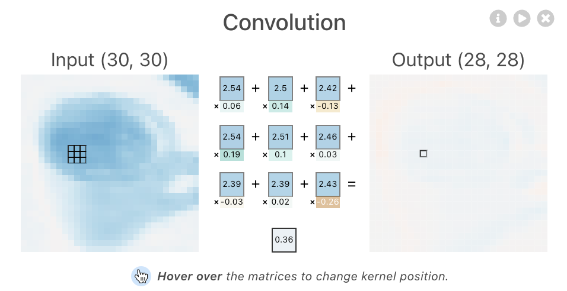
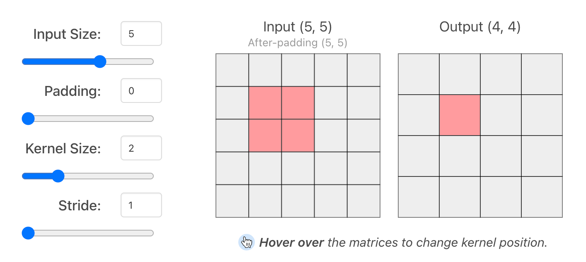
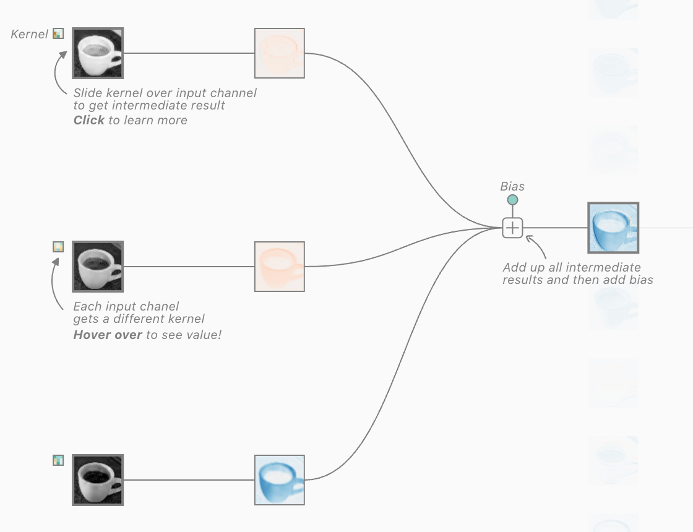
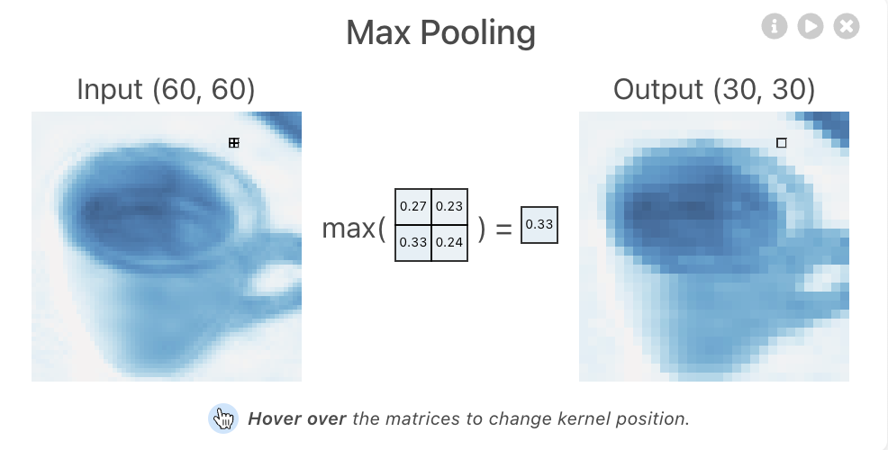
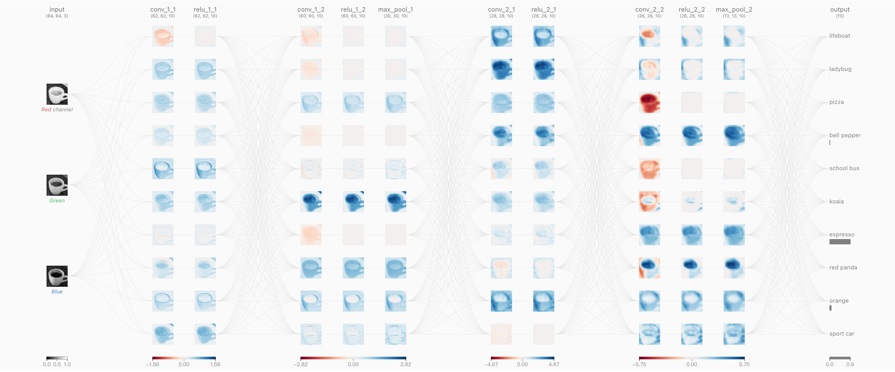

# 卷积神经网络 (CNN)

## 卷积网络研究动因
### 计算机视觉需要专用工具

- **全连接网络的局限性**：
    - **参数量爆炸**：如果将一张高清图片展平（Flatten）后输入全连接层，权重矩阵的参数量会非常庞大，极易导致维度诅咒和过拟合，并大幅增加计算成本。
    - **丢失空间结构信息**：图像本质上是二维或三维的网格数据，像素之间存在强烈的空间几何联系。全连接层将其展平为一维向量，破坏了原有的空间拓扑结构。

### 人类视觉系统的启发

1. **局部连接 (Local Connection)**
    - **原理**：人类视觉中，神经元并不是对整个视野产生响应，而是只对局部的一小块区域（即感受野 Receptive Field）敏感。在图像中，邻近像素的相关性较高，而距离较远的像素相关性较弱。
    - **在 CNN 中的体现**：卷积核每次只覆盖图像的一个局部小窗口（Patch）。
2. **位置不变性 (Location Invariant / 平移不变性)**
    - **原理**：不论目标出现在视野的哪个位置，人类都能识别出它。
    - **在 CNN 中的体现**：同一个卷积核会在整张图片上滑动共享权重（Weight Sharing），因此无论特征（如猫的眼睛）出现在图片的左上角还是右下角，都能被同一个探测器捕捉到。
3. **分级迭代、不断抽象的视觉形成过程**
    - **背景**：1981 年诺贝尔生理学或医学奖得主 Hubel 和 Wiesel 发现了猫的视觉皮层具有分级结构（简单细胞 $\to$ 复杂细胞）。
    - **在 CNN 中的体现**：
        - 低级特征（Low-Level）：边缘、颜色、线条。
        - 中级特征（Mid-Level）：纹理、局部器官（如眼睛、车轮）。
        - 高级特征（High-Level）：复杂的语义轮廓（如人脸、整车）。

## 卷积网络设计[^1]

[^1]: [CNN 动态可视化演示：CNN Explainer](https://poloclub.github.io/cnn-explainer/)

### 卷积计算 (Convolution)

- **核心思想**：卷积操作本质上是 **特征匹配**。当输入图像的某个局部区域（Patch）与滤波器（Filter）或卷积核（Kernel）的数值越接近，计算得到的 2D 相似度就越高，即输出的激活值越大。
- **计算方式**：**逐元素相乘并求和 (Element-wise multiplication)**。
    

### 卷积的超参数 (Hyperparameters)
在设计卷积层时，通常需要设定以下关键超参数，它们直接决定了输出特征图（Feature Map）的尺寸：

1. **Input Size / Channels**：输入图像的尺寸（如 $32 \times 32$）和通道数（如 RGB 3 通道）。
2. **Kernel Size**：卷积核大小，常见的有 $3 \times 3$, $5 \times 5$, $7 \times 7$ 等。
3. **Stride**：步长，即卷积核在图像上每次滑动的像素距离。步长越大，输出的尺寸越小。
4. **Padding**：填充，即在原输入图像的边缘周围补充像素（通常补 0，即 Zero-Padding）。作用是防止图像边缘信息在逐层卷积中丢失，并能控制输出尺寸（例如保持输入输出同尺寸）。

> **特征图输出尺寸计算公式**：假设输入矩阵尺寸为 $W \times W$，卷积核大小为 $K \times K$，步长为 $S$，填充圈数为 $P$，则输出矩阵的尺寸 $O \times O$ 计算如下：
>

$$
O = \lfloor \frac{W - K + 2P}{S} \rfloor + 1
$$

### 多通道输入与多组卷积核

- **多通道输入**：如果输入是彩色图像（如 RGB 3 通道），那么对应的每个卷积核也必须是 3 通道的。卷积时，3 个通道分别进行内积求和，最后合并为一个标量输出。
    

- **多组卷积核**：一组卷积核对应提取一种特定的特征。
    - 例如，输入一张 3 通道图像，如果我们使用 **6 组** 不同的 3 通道卷积核，最终就能输出一个 **6 通道** 的特征图 (Feature Map)。

### 池化层 (Pooling / Subsample)

- **核心思想**：通过下采样（Subsampling）来压缩数据量和参数量，进一步提升特征的平移不变性，并扩大后续卷积层的感受野（Receptive Field）。
- **常见类型**：
    - **Max Pool**：最大池化，提取感受野窗口内的最大值，最常用于保留最显著的特征（如边缘或纹理）。
        

    - **Mean/Average Pool**：平均池化，提取感受野窗口内的平均值，常用于保留整体的背景信息。

### 多层卷积网络结构与特征可视化

- **一般设计思路**：输入图像 $\to$ [卷积层 + 激活函数 (如 ReLU)] $\to$ 池化层 $\to$ ...循环重复... $\to$ 全连接层 $\to$ 输出
    

- **经典架构举例**：**LeNet**（最初用于手写数字识别的早期经典 CNN）。
- **卷积核的可视化（深层网络的黑盒解释）**：
    - **第一层 (Layer 1)**：作为边缘和颜色的探测器，捕捉最基础的像素渐变。
    - **第二层 (Layer 2)**：组合第一层结果，激活为特定的纹理（如条纹、网格）。
    - **第三层及以上 (Layer 3+)**：组合纹理，激活为复杂的形状和对象轮廓（如车轮、文本字符、人脸特征等）。
