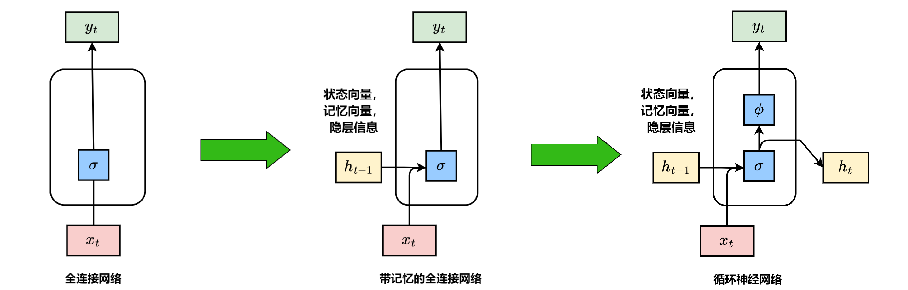
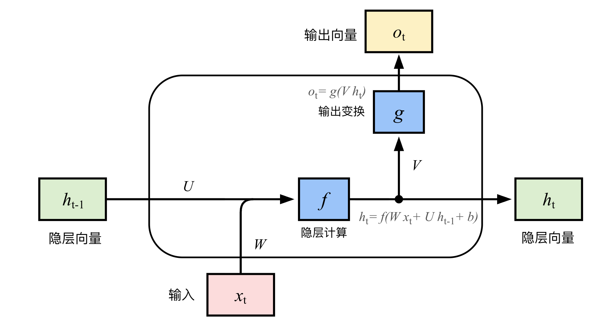
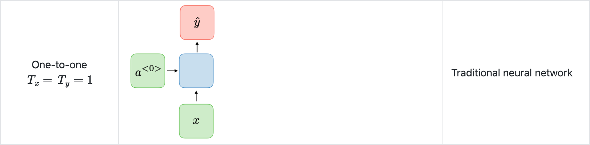
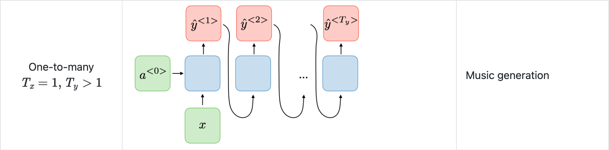
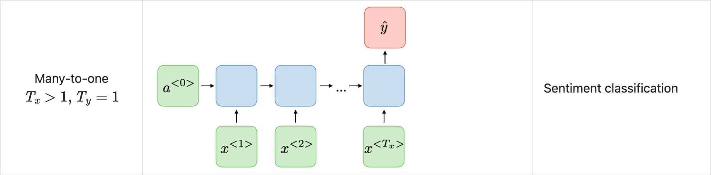
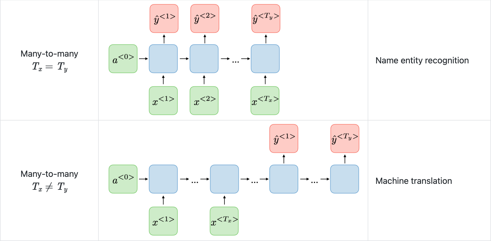
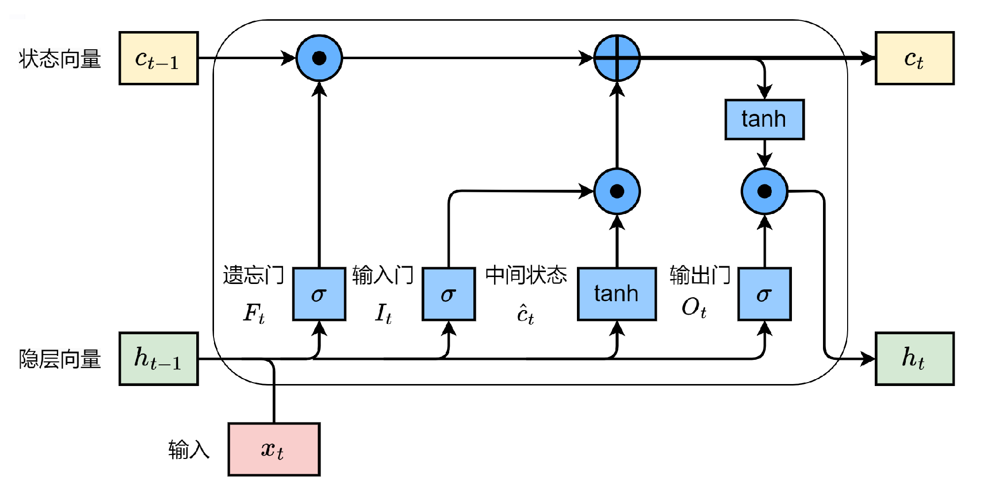
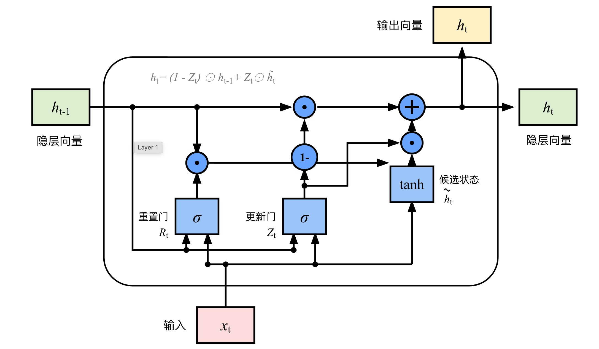
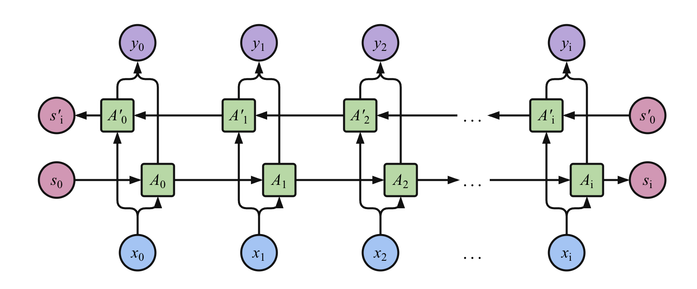

# 第一代序列模型

## 序列模型研究动因 (Motivation)

### 序列数据

- **序列数据**：按固定先后顺序排列、元素之间存在时序或位置依赖关系的一组数据，数据的先后顺序往往承载着关键信息。
- 序列数据广泛存在于各个领域：
    - **自然语言 / 语音**：文本或语音是一连串单词或音节的组合。
    - **程序语言**：代码逻辑高度依赖上下文与严格的语法序列。
    - **时间序列预测**：如股票交易价格走势、天气预温预测等。

### 传统网络为何不适用

- **全连接网络 (FNN)** 作为“万金油”，在处理序列时存在瓶颈：
    - 缺乏时间记忆：假设要输入前 9 天的温度来预测第 10 天，FNN 只能把这 9 天的特征展开输入。它无法感知“第 1 天”和“第 9 天”在时间维度上的递进关系。
    - 无法处理变长输入：FNN 的输入维度是固定的，而现实中的句子、语音等序列长度往往不一。
- **卷积神经网络 (CNN)** 适合计算机视觉，它通过一维卷积（1D-CNN）也可以处理一定长度的序列。但它的局限性在于其感受野大小固定，仅能捕捉局部特征，难以建立长距离的依赖关系。

### 序列的本质特点

1. **局部相关性 (Local Connection)**：一维空间中邻近的 Token 相关性较高。
2. **上下文依赖 (Context)**：当前 Token 不仅取决于前面的 Token，甚至和后面的 Token 也有关。
3. **长距离依赖 (Long Dependency)**：序列可能会很长。例如在一大段歌词文本中，代词“他”可能指代的是几句话之前出现的主语。

## 循环神经网络 (RNN, Recurrent Neural Network)
RNN 的核心思想是 **引入“记忆”能力**：在网络每一步执行相同的任务（参数共享），并且当前时刻的输出不仅依赖于当前的输入，还依赖于过去的计算结果（即状态向量 / 记忆向量）。

### 前向计算

- 假设时刻为 $t$，当前输入为 $x_t$，隐层状态（即隐层神经元活性值）为 $h_t$。
    

- $h_t$ 不仅和当前时刻的输入 $x_t$ 相关，也和上一个时刻的隐层状态 $h_{t-1}$ 相关。

    $$
    h_t = f(W x_t + U h_{t-1} + b),\quad o_t = g(V h_t)
    $$

    - $U$：状态-状态权重矩阵（传递历史记忆）；
    - $W$：状态-输入权重矩阵（提取当前特征）；
    - $V$：输出权重矩阵；
    - $f(\cdot)$ 与 $g(\cdot)$ 为非线性激活函数（通常为 logistic/sigmoid/tanh）。
- 如果我们把隐藏层公式不断向下展开，可以看出 RNN 的当前隐层 $h_t$ 以及输出层 $o_t$ 理论上蕴含了序列前 $t$ 个时刻所有的输入信息。

### 反向传播

- BPTT (Backpropagation Through Time) 算法将 RNN 看作是一个按时间步展开的“多层前馈网络”，每一层对应一个时刻，因此循环神经网络就可以按照前馈网络中的反向传播算法进行参数梯度计算。
- 由于展开的前馈网络中，**所有层的参数是共享的**，因此某个参数的真实梯度是所有“展开层”参数梯度的总和。

### 循环神经网络的工作模式

1. **一对一 (One-to-One)**：单一输入，单一输出。
    

2. **一对多 (One-to-Many)**：单一输入，序列输出。常用于 **音乐生成、图片描述生成**。
    

3. **多对一 (Many-to-One)**：序列输入，单一输出。常用于 **情感分类**（看完一段长文本，给出一个综合情感得分）。
    

4. **多对多 (Many-to-Many)**：
    

    - **等长多对多**：如词性标注。
    - **Seq2Seq 编码-解码结构**：输入序列和输出序列长度不同，常用于 **机器翻译、智能问答 (QA)**。

### RNN 的致命问题：梯度爆炸与梯度消失
当序列极长时，RNN 梯度在 BPTT 反向传播时需要经过多次连乘。连乘因子如果略大于 1，会导致 **梯度爆炸 (Exploding Gradient)**；如果略小于 1，会导致 **梯度消失 (Vanishing Gradient)**。

- **梯度爆炸**：相对容易解决，通常通过 **权重衰减 (Weight Decay)** 或 **梯度截断 (Gradient Clipping)** 来硬性避免。
- **梯度消失**：是标准 RNN 的核心顽疾。它导致网络无法“记住”很久之前的输入（丢失了 Long Dependency）。由于依靠常规优化技巧难以根治，我们必须 **改变模型结构**。

## LSTM 与 GRU
### LSTM (Long Short-Term Memory)

- 为了解决梯度消失问题，长短期记忆网络 LSTM 对标准 RNN 做了革命性的改进：
    1. **细胞状态 (Cell State, $c_t$)**：区别于短期隐层状态 $h_t$，这是网络的主干道，用来记录长期的历史信息。
    2. **门机制 (Gate)**：让网络自己学习决定保留还是抛弃哪些信息，通过门结构来去除或增加信息到细胞状态中。
    3. **输入输出对比**：标准 RNN 只有 2 个输入($x_t, h_{t-1}$) 和 1 个输出；而 LSTM 的处理单元有 **3 个输入** ($x_t, h_{t-1}, c_{t-1}$)，**2 个输出** ($h_t, c_t$)。
- LSTM 内部包含三个控制门：
    

    - **遗忘门 $F_t$**：决定上一时刻的细胞状态 $c_{t-1}$ 有多少要被保留（控制信息的遗忘）。

        $$
        F_t = \sigma(x_t W_{xf} + h_{t-1} W_{hf} + b_f)
        $$

    - **输入门 $I_t$**：决定当前时刻的新计算状态 $\hat{c}_t$ 有多少需要更新到细胞状态中。

        $$
        \begin{aligned}
        I_t &= \sigma(x_t W_{xi} + h_{t-1} W_{hi} + b_i) \\
        \hat{c}_t &= \tanh(x_t W_{xc} + h_{t-1} W_{hc} + b_c)
        \end{aligned}
        $$

    - **更新细胞状态 $c_t$**：结合遗忘和输入。

        $$
        c_t = F_t \odot c_{t-1} + I_t \odot \hat{c}_t
        $$

        - 注：$\odot$ 表示按元素相乘。这个加法操作极为关键，它将标准 RNN 中的连乘转化为加法运算，是 LSTM 解决梯度消失的根本原因。
    - **输出门 $O_t$**：决定当前的细胞状态有多少可以输出给下一层或隐层状态 $h_t$。

        $$
        \begin{aligned}
        O_t &= \sigma(x_t W_{xo} + h_{t-1} W_{ho} + b_o) \\
        h_t &= O_t \odot \tanh(c_t)
        \end{aligned}
        $$

### GRU (Gated Recurrent Unit)

- GRU 是 LSTM 的一种流行变体：
    1. 将细胞状态 $c_t$ 和隐藏状态 $h_t$ 合并
    2. 将门控简化为两个：
        - **重置门 (Reset Gate, $R_t$)**
        - **更新门 (Update Gate, $Z_t$)**

    

- 相比 LSTM，GRU 参数更少，计算效率更高，而在很多任务上性能相当。

## 双向循环神经网络 (Bi-RNN)

- 标准 RNN 是从左到右单向处理序列，只能“看到”过去的单词。但在自然语言中，当前单词的含义往往也依赖于它后面的单词。
- **Bi-RNN 原理**：并行维护两套独立的隐藏层状态，一个 **正向 (从前向后)** 传递，另一个 **反向 (从后向前)** 传递。当前步的输出同时结合了这两套状态的信息。
    

## 序列模型的局限性

1. **难以并行化**：因为 $h_t$ 的计算必须等待 $h_{t-1}$ 完成，时间上的严格顺序依赖导致其无法像 CNN 那样在 GPU 上进行大规模并行加速。
2. **记忆力依然有限**：虽然 LSTM 缓解了梯度消失，但由于信息全部被压缩在固定大小的向量 $c_t$ 和 $h_t$ 中，当序列特别长（如整本书）时，依然面临信息丢失的瓶颈（这也是后续 Attention 注意力机制诞生的背景）。
