# 第二代序列模型-Transformer

## Transformer 研究动因

- **背景**：在 2017 年之前，NLP 任务（如机器翻译）以及 Seq2Seq 架构大多由 RNN / LSTM 统治。

    - Sequence to Sequence (Seq2Seq) 模型通常由一个 RNN 编码器和一个 RNN 解码器组成，编码器将输入序列压缩成一个固定长度的上下文向量，解码器根据这个向量生成输出序列。
        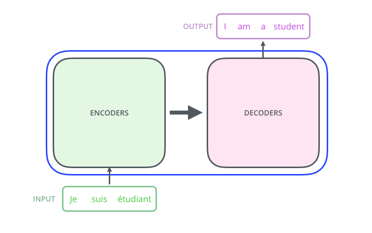

- **颠覆性创新**：2017 年 Google 发表了著名的论文 ***"Attention is All you need"***[^1]，提出了一种完全摒弃 RNN 和 CNN 结构、直接基于自注意力机制 (Self-Attention) 的网络架构——Transformer，并在当时的机器翻译任务上取得了 SOTA (State of the Art)。

- **统一的底座**：Transformer 最初设计用于处理序列数据，但如今它已经跨越了模态，成为了大量先进视觉模型 (Vision)、自然语言处理 (NLP) 和 大语言模型 (LLM) 的通用底层基石。

[^1]: [Attention is All you Need](https://arxiv.org/abs/1706.03762)

## Transformer 模型设计[^2][^3]

[^2]: [The Illustrated Transformer](http://jalammar.github.io/illustrated-transformer/)
[^3]: [Havard NLP](https://nlp.seas.harvard.edu/annotated-transformer/)

### 整体架构演变
Transformer 本质上是一个 Sequence to Sequence 模型，包含编码器和解码器。根据任务的不同，其架构演变出了三大主流分支：

1. **原始 Transformer (Encoder-Decoder)**：用于机器翻译等 Seq2Seq 任务。
    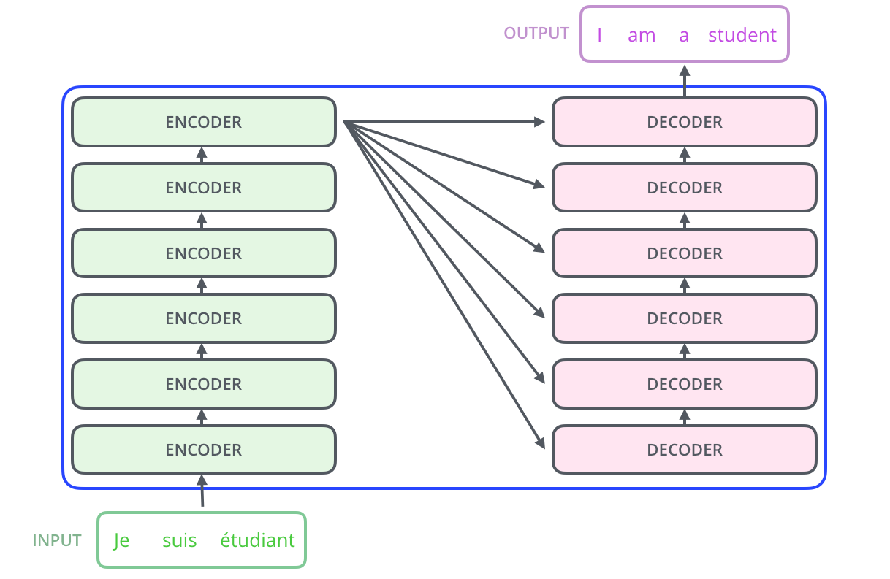

2. **BERT (Encoder only)**：提取上下文双向特征，常用于文本理解、分类、实体识别任务。

3. **GPT (Decoder only)**：单向自回归生成，是现代大语言模型（如 ChatGPT, LLaMA 等）的通用架构。

### 核心模块
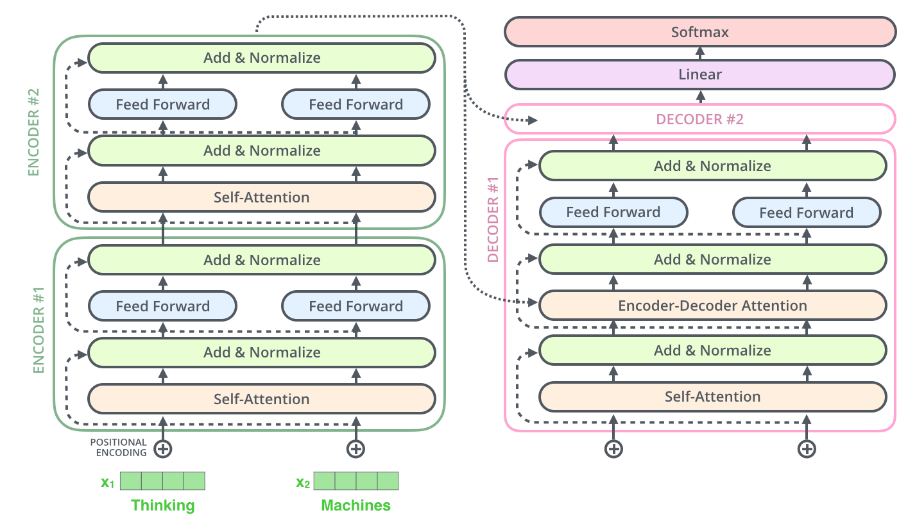

#### 自注意力机制 (Self-Attention)

- **核心思想**：类似于人类的注意力，在处理当前词时，模型会同时看上下文中其他的词，并为相关的词分配更高的注意力权重。

- **计算步骤**：

    1. 编码器的每个输入向量（一般为词嵌入向量 Embedding）分别乘以三个在训练过程中学习到的权重矩阵 $W^Q, W^K, W^V$，得到：**查询向量** $q$ (Query), **键向量** $k$ (Key), **值向量** $v$ (Value)。
        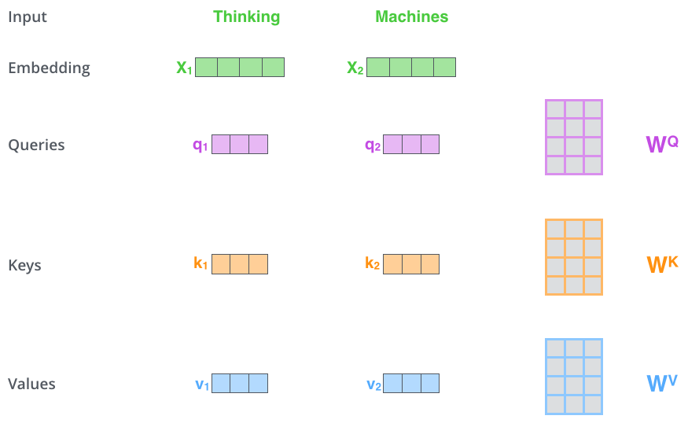

        - 注：这些新向量的维度通常比原始的嵌入向量小，记为 $d_k$。

    2. 对于当前单词，对输入序列中的每一个单词（包括它自己）打分：计算当前单词的查询向量 $q_i$ 与每个单词的键向量 $k_i$ 的点积作为对应单词的得分：$q_i \cdot k_j^\top$。

        - 这个得分决定了我们在编码当前位置的单词时，需要将多少“注意力”分配给序列中的其他单词。

    3. 缩放点积得分：$\frac{q_i k_j^T}{\sqrt{d_k}}$。

        - 除以 $\sqrt{d_k}$ 可以使得在训练期间梯度更加稳定，避免点积结果过大导致后续的 Softmax 函数进入梯度极小的饱和区。

    4. 进行 Softmax 归一化：$\text{Softmax}\left(\frac{q_i k_j^T}{\sqrt{d_k}}\right)$。

        - 这个 Softmax 分数决定了在当前位置的表达中，各个单词应该占据多大的比重。

        - 显然，当前单词本身的得分通常是最高的，但有时模型也会关注到与当前单词相关的其他词。

    5. 将每个单词的值向量 $v_i$ 乘以各自对应的 Softmax 分数：$\text{Softmax}\left(\frac{q_i k_j^T}{\sqrt{d_k}}\right) v_i$。

        - 保留我们想要关注的单词的值（因为对应的值乘以了较大的分数），并淹没或削弱那些不相关的单词（因为对应的值乘以了较小的分数）。

    6. 对加权后的值向量求和，结果就是自注意力层在该位置（即针对第 $i$ 个单词）的最终输出向量 $z_i$：

        $$
        z_i = \sum_{j=1}^{n} \text{Softmax}\left(\frac{q_i k_j^T}{\sqrt{d_k}}\right) v_j
        $$

        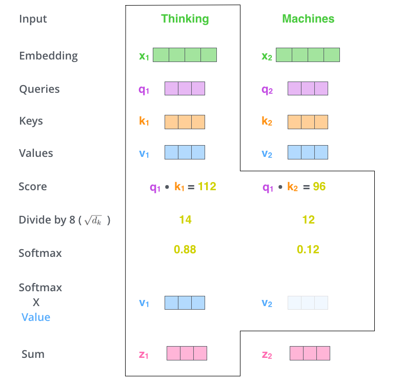

- **矩阵化运算**：将上述步骤合并打包成矩阵运算，把所有的查询、键、值向量分别打包进矩阵 $Q$、$K$ 和 $V$ 中，则整个自注意力过程可以表示为：

    $$
    Z = \text{Attention}(Q, K, V) = \text{softmax}\left(\frac{QK^T}{\sqrt{d_k}}\right)V
    $$

    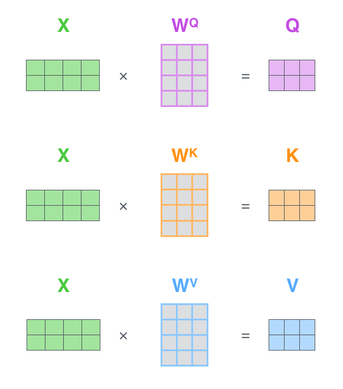
    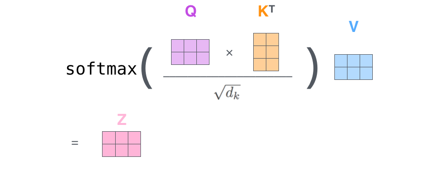

#### 多头注意力机制 (Multi-Head Attention)

- **概念**：每一步不止使用一组注意力机制，而是将 $Q, K, V$ 拆分投射到多个低维的子空间中，分别进行 Attention 计算，最后将结果拼接 (Concat) 起来。
    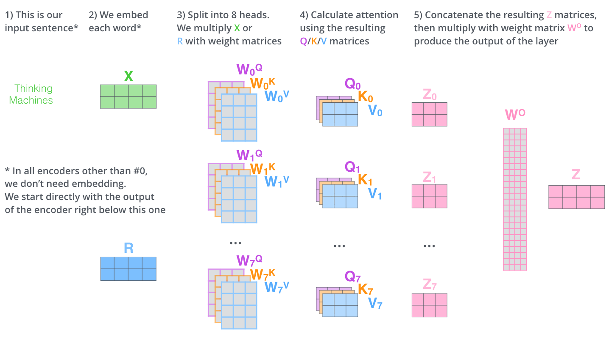

- **意义**：允许模型在不同的表示子空间里“同时关注多个点”。例如，有的“头(Head)”关注语法结构，有的关注指代关系，有的关注情感极性。

#### 残差连接与层归一化 (Add & Normalize)
在每个自注意力层（Self-Attention）和前馈神经网络层（FNN）之后，都跟着一个 Add & Normalize 模块。

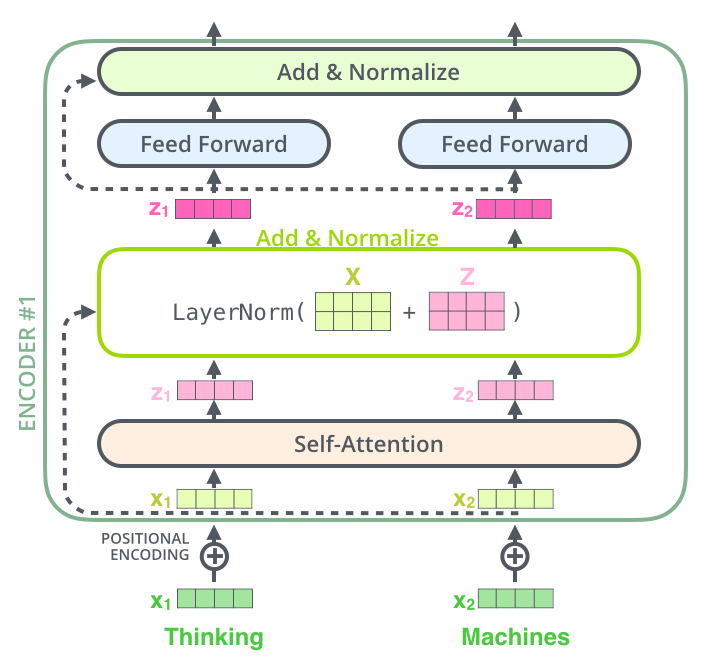

1. **残差连接 (Residue Connection / Add)**：

    - 形式：$x_{out} = x_{in} + \text{Layer}(x_{in})$。

    - 作用：保持正向/反向的信息流动，防止深层网络发生梯度消失。

2. **层归一化 (Layer Normalization)**[^4]：

    - 动机：深层网络在计算时连续乘上多个矩阵，中间激活函数输出会特别不稳定（过大或过小）。

    - 方式：在特征维度 (Channel) 上计算均值和方差。

        $$
        \hat{a} = \frac{a - \mu}{\sigma}
        $$

    - 说明：NLP 中不用 CNN 常用的 Batch Norm（跨样本取平均），而是用 Layer Norm（单个样本内跨特征取平均），因为句子长度往往不一。
        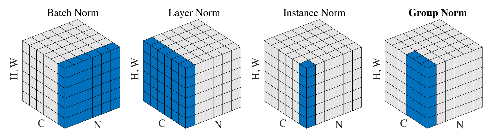

[^4]: [Decoder-only Transformer 架构剖析](https://cameronrwolfe.substack.com/p/decoder-only-transformers-the-workhorse)

#### 位置编码 (Positional Encoding)

- **痛点**：因为 Self-Attention 只是做全连接式的全局加权，丢失了序列中 Token 的顺序信息。（对模型来说，"I have this book to read" 和 "I have to read this book" 看上去是一样的）。

- **解决方案**：引入绝对/相对位置的感知。

- **三角函数位置编码**：利用不同波长、不同相位差的正余弦函数，为每个位置生成一个唯一向量。

- **融合方式**：直接将位置编码相加到输入序列的词嵌入向量上（Embedding + Position Encoding）。
    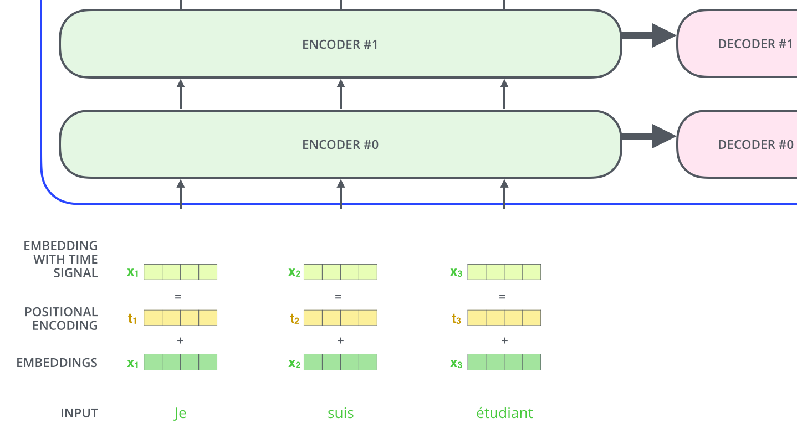

#### 解码器 (Decoder)

- **关键差异**：解码器的整体组件与编码器非常相似，但在结构和运行机制上存在几个关键差异：

    - **运行机制（自回归，Autoregressive）**：编码器是一次性并行处理整个输入序列，而解码器在推理阶段是逐个 Token 生成的。当前时间步输出的词，会作为下一个时间步解码器的输入（同样需要先经过 Embedding 并加上位置编码）。

    - **核心组件**：每个解码器除了包含与编码器相同的自注意力层和前馈层之外，还多出了一个编码器-解码器注意力层（Encoder-Decoder Attention），并且其底层的自注意力层是掩蔽的（Masked）。

- **工作流程**：

    1. **获取编码器输出 (Encoder Output)**：最顶层编码器处理完输入序列后，其输出会被转换为一组注意力向量 **$K$ (Key) 和 $V$ (Value)**。这组向量将被“派发”给所有解码器的“编码器-解码器注意力层”使用。

    2. **掩蔽自注意力层 (Masked Self-Attention Layer)**：

        - 在生成序列时，模型只能根据已经生成的词来预测下一个词，不能提前偷看未来的词。
            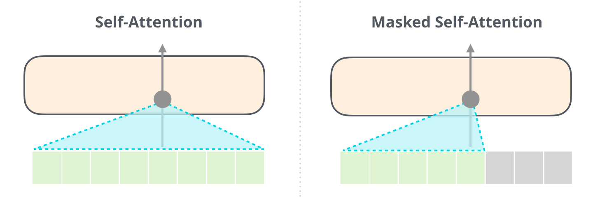

        - **实现方式**：在计算 Self-Attention 的得分阶段，将未来位置对应的得分掩蔽掉（Masking）。具体操作是在传给 Softmax 函数之前，把未来位置的打分设为极小的负数（如 $-\infty$），这样 Softmax 归一化后它们的概率就变成了 0。

    3. **编码器-解码器注意力层 (Encoder-Decoder Attention Layer)**：

        - **工作机制**：与普通的多头自注意力唯一的区别在于数据的来源：

            - **$Q$ (Query)**：来自解码器底层（即掩蔽自注意力层）的输出。

            - **$K$ (Key) 和 $V$ (Value)**：直接来自 **编码器的顶层输出**。

        - **意义**：这一步让解码器在生成当前词时，能够“拿着当前的查询条件（$Q$），去原始输入序列（$K, V$）中寻找最相关的上下文信息”，相当于人类翻译时“视线在原文和译文之间来回切换”的过程。

#### 最终的线性层与 Softmax 层 (Final Linear and Softmax Layer)
解码器堆叠层的最终输出是一个由浮点数组成的向量，需要最后的线性层和 Softmax 层将这个浮点向量转换成人类能读懂的单词。

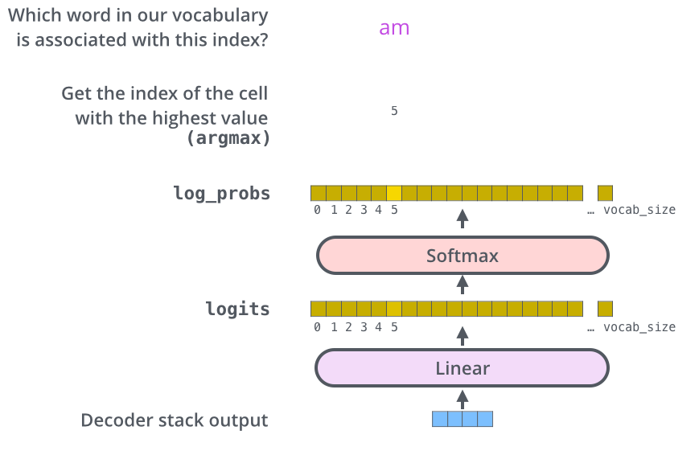

1. **线性层 (Linear Layer)**：一个简单的全连接前馈神经网络。

    - 将解码器输出的相对低维的特征向量投影（Project）到一个极大的向量中，这个超大向量被称为 **Logits 向量**。

    - Logits 向量的宽度恰好等于模型所掌握的词表大小（Vocabulary Size），每一列对应的就是一个独特单词的得分。

2. **Softmax 层 (Softmax Layer)**：

    - 将 Logits 向量中各个词的原始得分转化为概率分布（所有值都为正数，且总和为 1.0）。

    - 选取概率值最高的那个单元格，其对应的单词即作为该时间步模型的最终输出结果。

## Transformer 的优缺点和演进方向
### 优缺点

- **优点**：

    1. **长距离依赖 (Long-term Dependencies)**：RNN 在长序列会有遗忘问题，而 Transformer 的任意两个 Token 之间通过 Attention 计算距离永远是 1。

    2. **高度并行化 (Parallelization)**：RNN 的第 $t$ 步计算依赖第 $t-1$ 步，无法并行；Transformer 在训练时可一次性计算整句话的 Attention，大幅利用 GPU 算力。

    3. **全局感受野 (Global Context)**：相比 CNN 受限于局部卷积核，Transformer 能无死角地获取全局信息。

    4. **可解释性 (Interpretability)**：通过可视化 Attention Map，我们可以清晰地看到模型把重点放在了哪些词或像素上。

- **缺点**：

    1. **计算复杂度极高**：因为任意两个 Token 都要算点积，时间与空间复杂度关于序列长度 $n$ 是 $O(n^2)$ 的。

    2. **序列长度有限**：因 $O(n^2)$ 的存在，处理极长文档（如百万字小说）会导致内存爆炸。

### 演进方向

为了解决 Transformer $O(n^2)$ 的计算复杂度以及大模型时代的显存墙问题，工业界和学术界提出了诸多极其关键的底层优化：

#### 硬件感知的注意力加速：FlashAttention[^5]

[^5]: [FlashAttention: Fast and Memory-Efficient Exact Attention with IO-Awareness](https://arxiv.org/abs/2205.14135)

- **痛点 (Memory Wall)**：标准的 Attention 计算包含了多步独立的操作（Matmul $\to$ Mask $\to$ Softmax $\to$ Dropout $\to$ Matmul）。在 GPU 中，每一步都会将庞大的中间结果（大小为 $N \times N$）在计算单元（SRAM，极快但极小）和主存（HBM/DRAM，大但极慢）之间来回读写，导致极大的时间延迟（IO 瓶颈）。
    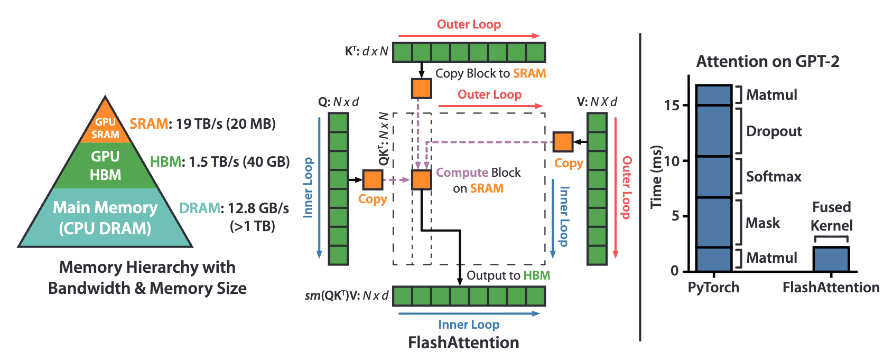

- **FlashAttention 机制**：

    - **分块计算 (Tiling / Block computation)**：将 $Q, K, V$ 矩阵切分成小块（Blocks），分批载入到高速 SRAM 中。

    - **算子融合 (Kernel Fusion)**：在 SRAM 中一次性完成点积、Softmax 和加权求和，然后直接将最终输出写回 HBM，期间完全不保存任何 $N \times N$ 的中间注意力矩阵。

- **效果**：显著降低了显存读写次数，极大提升了模型训练和推理的速度，并大幅降低了显存占用。

#### 解码推理加速核心：KV Cache[^6][^7]

[^6]: [Transformers KV Caching Explained](https://medium.com/@joaolages/kv-caching-explained-276520203249)
[^7]: [The Illustrated GPT-2](https://jalammar.github.io/illustrated-gpt2/)

- **痛点**：GPT 等 Decoder-only 架构在生成文本时是自回归（Autoregressive）的，即每次只生成一个新 Token。如果每次生成新词时，都要把前面所有历史词的 $Q, K, V$ 重新计算一遍，会造成巨大的重复计算浪费。

- **KV Cache 机制**：

    - **KV Cache 缓存**：在推理生成第 $t$ 个 Token 时，前面 $1$ 到 $t-1$ 个 Token 的键矩阵 $K$ 和值矩阵 $V$ 是绝对不会改变的。因此，模型在内存中维护一个缓存区（KV Cache），把历史的 $K$ 和 $V$ 存下来。

    - **当前步计算**：当新 Token 进来时，只需计算这一个新 Token 的 $Q, K, V$。用新的 $q_t$ 去和 **缓存中的所有历史 $K$ 以及新的 $k_t$** 做点积注意力，得到结果后再将新的 $k_t, v_t$ 追加进缓存即可。

#### 架构前沿演进：DeepSeek 的底层创新[^8]

[^8]: [DeepSeek-V2: A Strong, Economical, and Efficient Mixture-of-Experts Language Model](https://arxiv.org/pdf/2405.04434)

面对极长上下文和海量参数，DeepSeek 等前沿技术报告提出了进一步的架构演进：

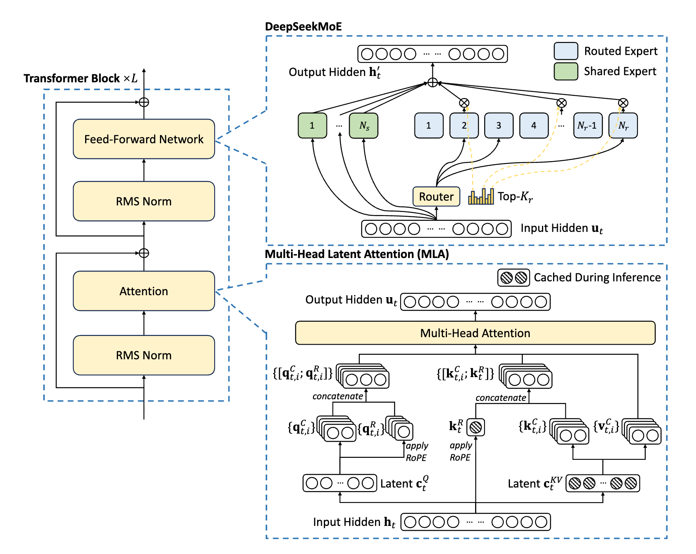

- **混合专家架构 (DeepSeekMoE)**：

    - **痛点**：传统前向传播网络（FFN）中，每个 Token 都要经过所有的神经元，计算量巨大。

    - **MOE 机制**：

        - MoE 引入了路由器（Router）机制，包含 **共享专家**（Shared Expert）和 **路由专家**（Routed Expert）。

        - 路由器 (Top-$K$) 决定将当前 Token 仅分发给极少数最擅长处理该特征的专家网络中，实现了 **参数量大但计算量小** 的稀疏激活。

- **多头潜在注意力 (MLA, Multi-Head Latent Attention)**：

    - **痛点**：传统的 KV Cache 在长文本推理时会占用几十上百 GB 的显存，极大限制了并发推理的数量。

    - **MLA 机制**：

        - 不再直接缓存庞大的多头 $K$ 和 $V$ 矩阵，而是通过一个 **潜空间向量 (Latent $c_t^{KV}$)** 对 KV 进行大幅度的降维压缩，只有在推理需要时，才动态地将其投射恢复。

        - 同时解耦了旋转位置编码 (RoPE) 的计算，使得极长上下文的 KV Cache 内存占用成倍下降，极大提升了推理并发量。