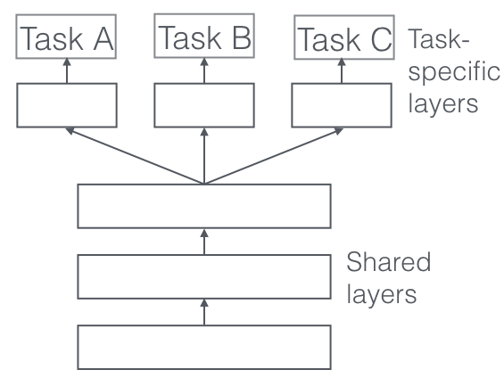
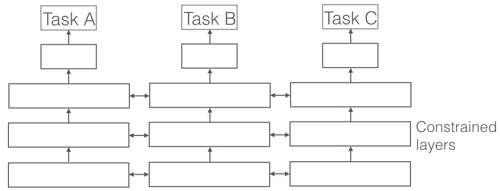
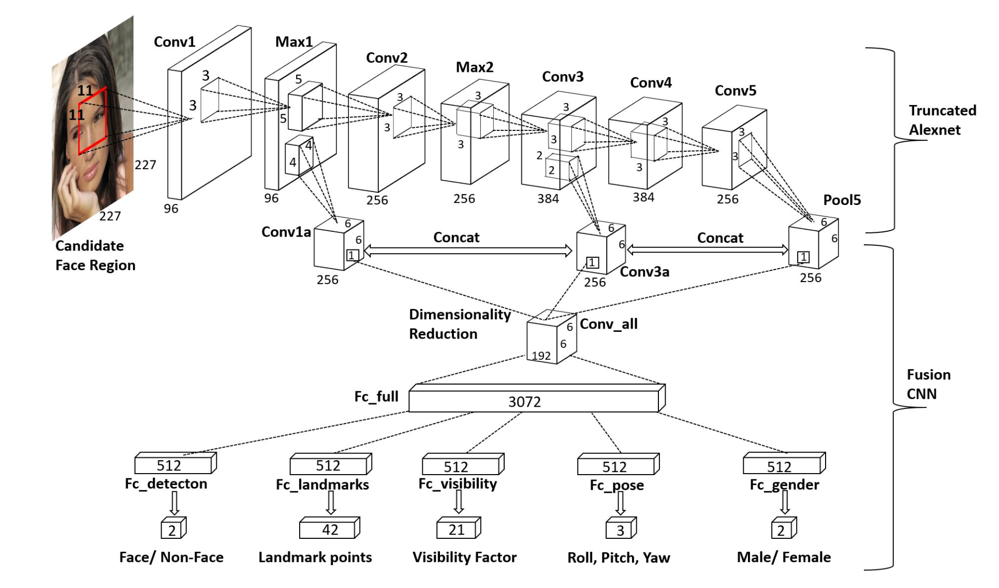

# 多任务学习

## 多任务学习简介 (Multi-Task Learning, MTL)

- **背景**：在传统的机器学习过程中，我们往往只关心一种特定任务（Single-Task Learning），并希望模型能最大化该特定指标。然而在现实中，许多任务之间是存在强相关性的，一个任务的解决往往有利于另一个任务的解决。

- **核心思想**：让模型同时学习并解决多个任务，通过共享不同任务之间的特征与表示，使得模型具有更好的 **泛化性能**。

- **优点**：

    1. **更好的泛化性**：多任务充当了隐式的正则化项，强制模型学习到更通用的特征，避免在单个任务上过拟合。

    2. **少样本/零样本学习能力**（Few-Shot / Zero-Shot Learning）：即使某个任务的训练样本极少，模型也可以通过“借用”其他任务学习到的通用特征来完成该任务。

    3. **新任务快速学习**：预训练的多任务底层表示，使得模型在面对全新任务时能更快收敛。

- **难点**：

    1. **数据集不平衡**（Imbalance of datasets）：不同任务的数据量可能差异巨大，导致模型在训练时完全被数据量大的任务主导。

    2. **任务不相似**（Dissimilarity between tasks）：如果强制让毫无关联的任务共享参数，会互相干扰。

    3. **负迁移**（Negative transfer of knowledge）：这是 MTL 最致命的问题。各类任务之间可能存在冲突，导致联合训练后的效果反而不如各个任务单独训练。

## 学习方法[^1]

[^1]: [Sebastian Ruder 经典综述](https://www.ruder.io/multi-task/)

在深度学习中，根据参数共享的严格程度，MTL 主要分为两种基本架构：

- **硬参数共享**（Hard Parameter Sharing）：最常用、最基础的多任务学习方法。

    - **结构**：在网络的底部（靠近输入端）使用 **完全共享的隐藏层** 提取通用特征，在网络的顶部（靠近输出端）分叉出多个 **任务特定的输出层**（Task-specific layers）。
        

    - **优势**：

        - **极大降低过拟合风险**：学习的任务越多，模型需要照顾的面就越广，提取的特征就越具有普适性。模型很难去死记硬背某个单任务的噪声。

        - **参数量少，推理效率高**：相比为每个任务单独训练一个模型，Hard Sharing 极大地节省了内存和计算开销。

- **软参数共享**（Soft Parameter Sharing）：

    - **结构**：每个任务都有 **自己完全独立的模型和参数**（不存在物理上合并的隐藏层）。
        

    - **机制**：在训练时，通过在损失函数中增加 **正则化约束**（例如 L2 距离约束、迹范数约束等），强制不同模型的独立参数之间尽量接近或相似。

    - **优势**：灵活性更高，适用于任务之间相关性没有那么强（容易发生负迁移）的场景。

## 训练过程
### 克服“灾难性遗忘” (Catastrophic Forgetting)

- **问题**：如果按顺序依次训练各个任务（先训练任务 A，再用该模型训练任务 B），会遇到灾难性遗忘——模型在学习后面新任务的同时，参数被剧烈修改，完全忘记了前面任务的知识。

- **解决方案**：

    1. **联合训练 (Joint Training)**：多任务学习通常使用一个模型 **同时并行** 学习所有任务的数据，避免遗忘。

    2. **课程学习 (Training Curriculum)**：需要制定一个好的学习计划（如控制不同阶段各任务数据的采样率和权重），以达到相互促进的目的。

### 前向与反向传播机制 (Forward & Backward)
在联合训练时（如自然语言处理中的文本分类+分段任务），前向传播会针对每个任务分别计算输出。

- **总损失函数 (Total Loss)**：通常是将各个任务的 Loss 加权求和。

    $$
    L_{total} = \lambda_1 L_{task1} + \lambda_2 L_{task2} + \cdots + \lambda_k L_{task_k}
    $$

- **反向传播**：总 Loss 的梯度会同时向后传导。共享层的参数更新方向，是所有任务梯度方向的 **向量和**。

## 经典案例分析：HyperFace[^2]

[^2]: [HyperFace 论文](https://arxiv.org/abs/1603.01249)

**HyperFace** 是计算机视觉领域一个非常经典的多任务学习框架，它采用 **Hard Parameter Sharing** 的结构，利用一张人脸图像同时完成五个不同的任务：

1. **人脸检测**（Face Detection）：判断图像中是否有人脸及位置。

2. **关键点定位**（Landmark Localization）：定位眼睛、鼻子、嘴角等面部特征点。

3. **可见度与质量评估**（Visibility / Quality Estimation）：评估面部特征是否被遮挡或模糊。

4. **姿态估计**（Pose Estimation）：预测人脸的翻滚角（Roll）、俯仰角（Pitch）和偏航角（Yaw）。

5. **性别识别**（Gender Recognition）：预测男性或女性。

**模型架构特点**：

- 前端使用类似 AlexNet/ResNet 的卷积特征提取器（如 `Conv1` 到 `Conv5`）。

- 将不同层级的特征图（浅层的边缘细节和深层的语义抽象）进行拼接（Concat & Fusion）。

- 最终接入全连接层，并在最后一层“开枝散叶”，分化出 5 个对应上述任务的特定输出分支（损失头）。
