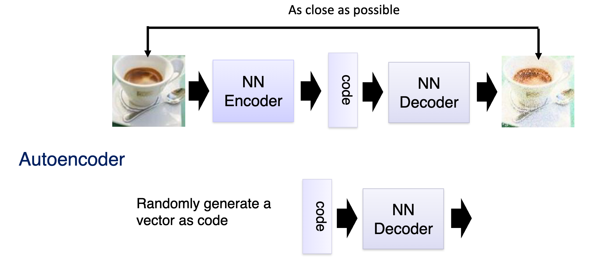
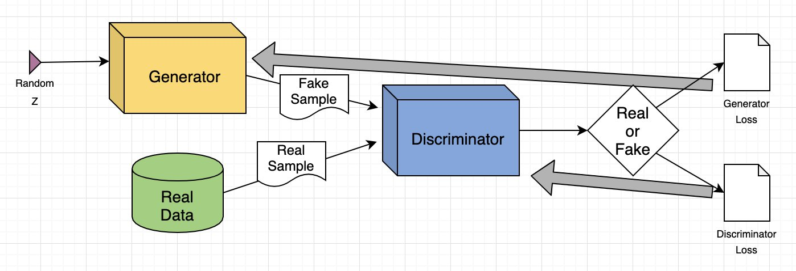
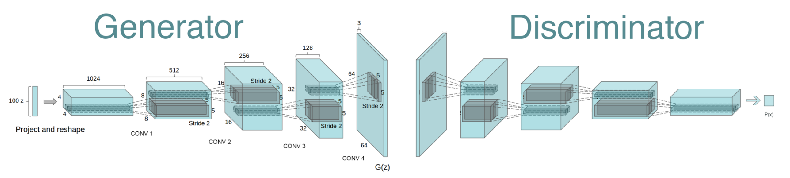
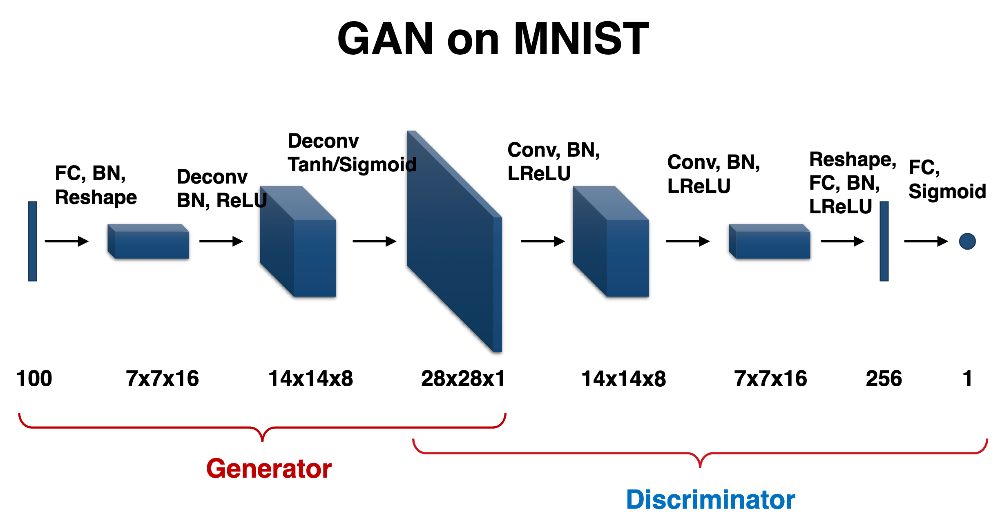
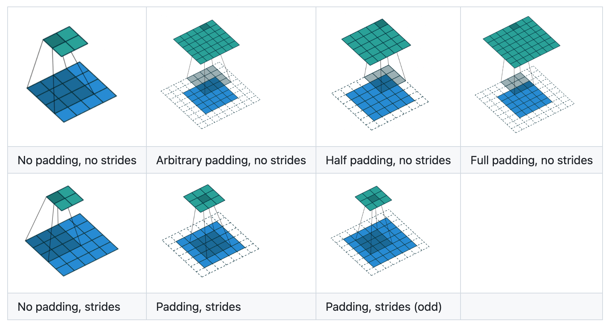
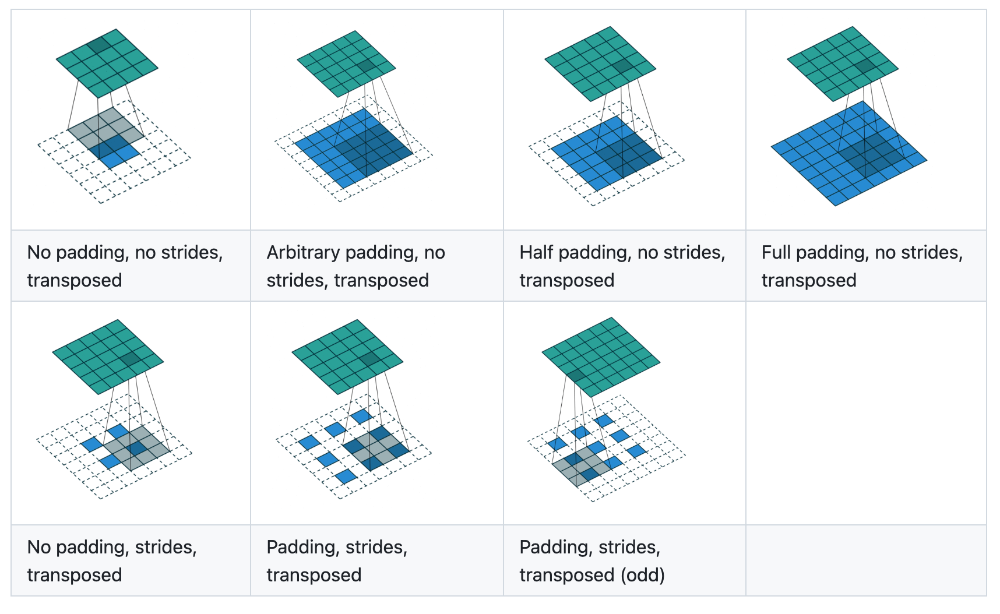
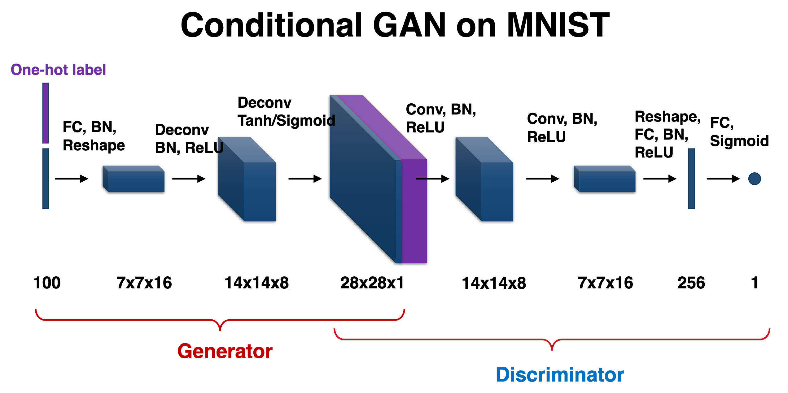

# 生成对抗网络

## 生成式模型简介
### 判别式模型与生成式模型

- **判别式模型**：学习条件概率 $P(Y|X)$，直接从输入 $X$ 预测输出 $Y$（如分类器）。

- **生成式模型**：学习真实数据的底层概率分布 $P(X)$。

    1. 掌握了 $P(X)$ 后，可以对判别器进行校正，解决“对抗样本”、“分布外数据 (OOV)”等问题。

    2. 可以通过从学习到的分布中进行采样，生成现实中不存在但极其逼真的全新样本。

### 自编码器 (Autoencoder)

- **自编码器结构**：

    - **编码器**（Encoder）：将高维的真实输入压缩成低维的隐变量（Code / Vector）。

    - **解码器**（Decoder）：将低维的隐变量重构还原为原图片。

    - **目标**：让输出图像与输入图像尽可能接近。

- **生成式模型的“祖师爷”**：训练好自编码器之后，解码器可以把随机低维向量“翻译”成一张全新的图片（这便是变分自编码器 VAE 的雏形）。

- **核心思想**：从低维的潜在空间，采样并生成高维数据。

### 生成对抗网络 (Generative Adversarial Networks, GAN)

- 生成对抗网络由两个相互竞争的神经网络组成：

    - **生成器（Generator, G）**：输入一段随机噪声，通过网络生成出“假图像”。目标是尽可能骗过判别器。可视为一个反卷积网络。

    - **判别器（Discriminator, D）**：输入有两部分，一部分是来自训练集的“真实图像”，另一部分是生成器制造的“假图像”。目标是准确分辨真实图像和假图像。本质上是一个普通二分类网络。

    

- **图像生成**：训练完成后，生成器能够从随机噪声中生成极其逼真的图像，甚至达到以假乱真的程度。

- **核心思想**：对抗博弈，学习数据的分布。

## 生成对抗网络设计

### 核心数学优化目标 (Min-Max Game)
GAN 的训练过程可以用以下目标函数表示：

$$
\min_G \max_D V(D, G) = \mathbb{E}_{x\sim p_{data}(x)}[\log D(x)] + \mathbb{E}_{z\sim p_z(z)}[\log(1 - D(G(z)))]
$$

1. **对于判别器 D（目标是 Maximize）**：

    - 当输入真实图片 $x$ 时，它希望判定为真的概率 $D(x)$ 越大越好，即最大化 $\log D(x)$。

    - 当输入假图片 $G(z)$ 时，它希望判定为真的概率 $D(G(z))$ 越小越好，即最大化 $\log(1 - D(G(z)))$。

2. **对于生成器 G（目标是 Minimize）**：

    - 无法控制与真实图片相关的第一项，只能控制与生成图片相关的第二项。

    - 它希望自己生成的假图片骗过 D，即让 $D(G(z))$ 尽可能趋近于 1，即最小化 $\log(1 - D(G(z)))$。

### 网络核心组件

为了让 GAN 能够稳定训练并生成高质量图像，通常会引入以下关键技术（常被称为 DCGAN 架构规范）：

#### 转置卷积 (Transposed Convolution) / 反卷积 (Deconvolution)

- 生成器的任务是将 $100$ 维的极小噪声向量，逐渐放大（上采样）成 $28 \times 28$ 的图像。

- **转置卷积** 不是数学意义上严格的“逆卷积”，而是一种可以 **学习权重的上采样方法**。通过调整 **步长 (Stride)** 和 **填充 (Padding)**，可以将特征图的宽和高逐渐放大两倍。

- **卷积与转置卷积的对比[^1]**：蓝色为输入，青色为输出。

    - 卷积（Convolution）：
        

    - 对应的转置卷积（Transposed Convolution）：
        

[^1]: [卷积与转置卷积动画演示](https://github.com/vdumoulin/conv_arithmetic)

#### 批归一化 (Batch Normalization, BN)

- **痛点**：深层网络在反向传播时极易陷入梯度消失问题，特别是当使用了 Sigmoid 或 Tanh 作为激活函数时，输入值一旦偏大或偏小，就会落入饱和区 ，导致梯度为零 (Zero gradient)。

- **作用**：在每一层对 Mini-batch 的特征计算均值 $\mu_B$ 和方差 $\sigma_B^2$，将特征强行拉回到均值为 0，方差为 1 的标准正态分布中。这保证了数据始终落在激活函数的 **高梯度线性区域**，极大加速了收敛并防止崩溃。

### 条件生成对抗网络 (Conditional GAN, cGAN)

- **问题**：标准的 GAN 只能盲目地随机生成图像（例如随机生成 0~9 的数字，但你无法指定它生成数字 3）。

- **解决方式**：

    - **生成器端**：除了输入 100 维的随机噪声外，将你想生成的类别的 One-hot label 拼接进去。

    - **判别器端**：在判断真假时，也将 One-hot label 拼接进图像特征中。判别器不仅要判断“图像是否逼真”，还要判断“图像是否与给定的 Label 匹配”。