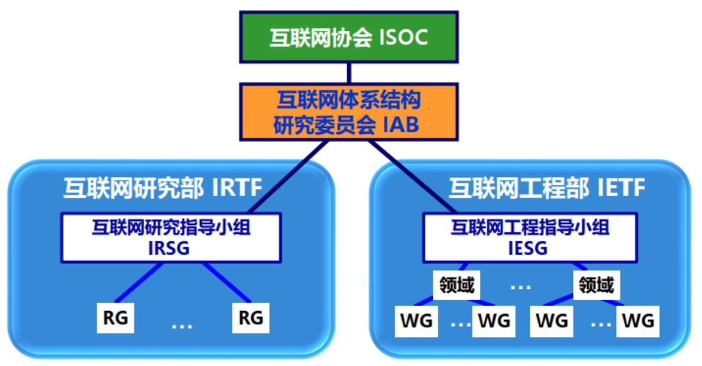
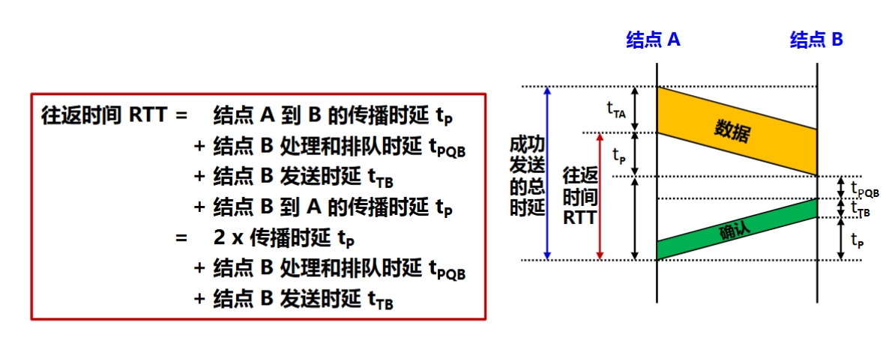
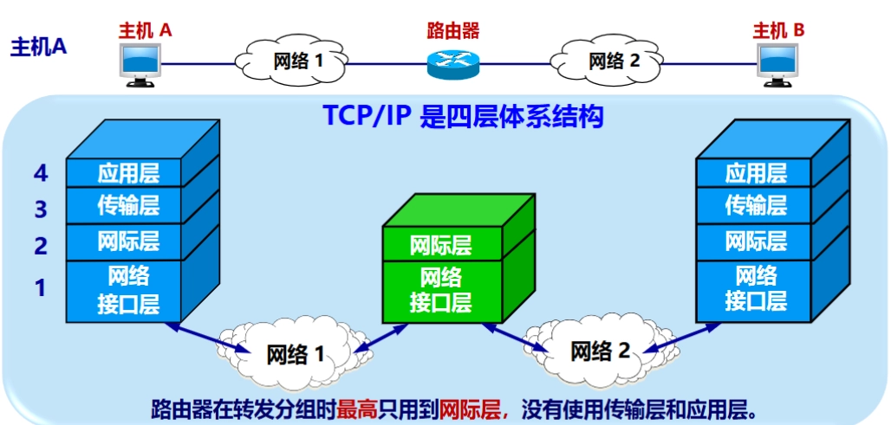

# 计算机网络概述

## 互联网概述
### 基本概念

- **网络（Network）** 由若干 **结点（Node）** 和连接这些结点的 **链路（Link）** 组成。
- **internet**（互连网）：通用名词，泛指多个计算机网络互连而成的计算机网络，对网络间的协议没有要求。
-  **Internet**（互联网、因特网）：专有名词，指全球范围的众多网络互连而成的特定的互连网，采用 TCP/IP 协议族。互联网的两个重要基本特点是**连通性和资源共享**，是 Internet 提供诸多服务的基础。
- **Ethernet**（以太网）：当今现有**局域网**采用的最通用的通信协议标准。

### 发展历程

- **ARPANET**：1968 年出现，最初只是一个单个的分组交换网，不是一个互连网。1983 年，**TCP/IP** 协议成为 ARPANET 上的标准协议， 使得所有使用 TCP/IP 协议的计算机都能利用互连网相互通信。
	- 人们将 **1983 年作为互联网的诞生时间**
- **国家科学基金网** NSFNET ：三级结构： **主干网、地区网和校园网**（或企业网），覆盖了全美国主要的大学和研究所，并且成为互联网中的主要组成部分。
- **互联网服务提供者** ISP（Internet Service Provider）：提供接入到互联网的服务并需要收取一定的费用
	- 其具有**多层次 ISP 结构**：主干 ISP、地区 ISP 和本地 ISP，其区分依据是覆盖面积大小和所拥有的 IP 地址数目的不同
- **万维网** WWW（World Wide Web）：由欧洲原子核研究组织 CERN 开发，成为互联网指数级增长的主要驱动力

### 因特网的标准化

- 因特网所有的 **RFC**（Request For Comments）技术文档都可从因特网上免费下载
	- 任何人都可以随时用电子邮件发表对某个文档的意见或建议
	- 但**并非所有的 RFC 文档都是互联网标准**， 只有很少部分的 RFC 文档最后才能变成互联网标准
- 组织架构
	- **因特网协会** ISOC：负责对因特网进行全面管理，以及在世界范围内促进其发展和使用
	- 因特网体系结构委员会 IAB：负责管理因特网有关协议的开发
	- 因特网工程部 IETF：负责研究中短期工程问题，主要针对协议的开发和标准化
	- 因特网研究部 IRTF：从事理论方面的研究和开发一些需要长期考虑的问题
	- 

## 互联网的组成
### 边缘部分（资源子网）

- 组成：连接在互联网上的所有主机，又称为**端系统**（end system）
- 作用：用户直接使用的，用来进行通信（传送数据、音频或视频）和资源共享。
- 端系统间的通信：主机 A 的某个进程和主机 B 上的另一个进程进行通信，通信方式有 C/S 和 P2P 两种方式。
	- **客户服务器通信方式** C/S（Client/Server）：
		- 描述的是进程之间**服务和被服务**的关系。
		- 客户是服务的请求方，服务器是服务的提供方。
		- 客户与服务器的通信关系建立后，通信**可以是双向的**，客户和服务器都可发送和接收数据。
		- 特点：
			- **客户**程序
				- **被用户调用**后运行，需**主动**向远地服务器发起通信（请求服务）
				- **必须知道服务器程序的地址**
				- 不需要特殊的硬件和很复杂的操作系统
			- **服务器**程序
				- 专门用来提供某种服务的程序，可同时处理多个客户请求
				- 一直**不断地运行着**， **被动**地等待并接受来自各地的客户的通信请求
				- **不需要知道客户程序的地址**
				- 一般需要强大的硬件和高级的操作系统支持
	- **对等连接方式** P2P（Peer-to-Peer）：
		- 两台主机在通信时**不区分服务请求方和服务提供方**。
		- 只要都运行了 P2P 软件，就可以进行**平等的、对等连接通信**。
		- P2P 从本质上看仍然是使用 C/S 方式，只是对等连接中的每一个主机**既是客户又是服务器**

### 核心部分（通信子网）

- 组成：大量网络和连接这些网络的路由器
- 作用：**为边缘部分提供服务**（提供连通性和交换）。
- 特点：是互联网中**最复杂**的部分
- **路由器（router）**
	- 在网络核心部分起特殊作用
	- 实现**分组交换**（packet switching）的关键构件，其任务是转发收到的分组。
	- **分组转发是网络核心部分最重要的功能**

## 互联网的三种交换方式

- 互联网的核心部分采用**分组交换技术**

### 电路交换

- **有连接**：电话交换机接通电话线的方式，直接进行两两连接，因此 $N$ 台计算机就需要 $\frac{N(N-1)}{2}$ 对电线。
- 使用交换机
	- 当电话机的数量增多时，使用电话交换机将这些电话连接起来。
	- 每一部电话都直接连接到交换机上，而交换机使用交换的方法，让电话用户彼此之间可以很方便地通信。
- 三个阶段
	- 建立连接：建立一条专用的物理通路（占用通信资源）。
	- 通话：主叫和被叫双方互相通电话（一直占用通信资源）。
	- 释放连接：释放刚才使用的专用的物理通路（归还通信资源）。
- **线路利用率低**。

### 分组交换

- **无连接**
- 分组交换采用了**存储转发**机制。
- 步骤
	- **报文分组**：在发送端，先把较长的报文划分成更小的等长数据段，数据段前面添加首部就构成了分组（packet）。
		- 分组又称为“包”，而分组的首部也可称为“包头”。
	- **分组发送**：发送端依次把各分组发送到接收端。
	- **存储转发**：路由器根据分组控制信息进行存储转发
		- 根据首部中包含的目的地址、源地址等重要控制信息进行转发
		- 每一个分组在互联网中独立选择传输路径
		- 可能经历多个交换机
		- 位于网络核心部分的路由器负责转发分组，即进行分组交换。
		- 路由器要创建和动态维护转发表
	- **报文还原**：接收端收到分组后剥去首部，还原成原来的报文。
- 优点
	- 高效：在分组传输的过程中动态分配传输带宽，对通信链路是逐段占用
	- 灵活：为每一个分组独立地选择最合适的转发路由
	- 迅速：以分组作为传送单位，可以不先建立连接就能向其他主机发送分组
	- 可靠：保证可靠性的网络协议、分布式多路由的分组交换网，使网络有很好的生存性
- 缺点
	- 排队延迟：分组在各路由器存储转发时需要排队。
	- 不保证带宽：动态分配。
	- 增加开销：各分组必须携带控制信息；路由器要暂存分组，维护转发表等。

### 报文交换

- **无连接**
- 主要用于早期的电报通信网，现在较少使用
- 可以视为不进行报文分组的分组交换

### 三种交换方式的对比

- **电路交换**：连续传送**大量的数据**，且其**传送时间远大于连接建立时间**
- **报文交换/分组交换**：
	- 不需要预先分配传输带宽，在传送**突发数据**时可提高整个网络的信道利用率
	- 由于一个分组的长度往往远小于整个报文的长度，因此**分组交换比报文交换的时延小**，同时也具有更好的灵活性

## 计算机网络的定义与分类
### 定义

- 简单定义：一些互相连接的、自治的计算机的集合。
	- **互连**︰计算机之间可以通过有线或无线的方式进行数据通信
	- **自治**︰独立的计算机，有自己的硬件和软件，可以单独运行使用
	- **集合**：至少需要两台计算机
- 完整定义：计算机网络主要是由一些**通用的、可编程的硬件互连**而成的，而这些硬件**并非**专门用来实现某一特定目的，而是能够用来**传送多种不同类型的数据**，并能**支持广泛的和日益增长的应用**。

### 分类
#### 按作用范围分类

- **广域网** WAN：覆盖范围通常为几十公里到几千公里，有时也称为远程网。广域网是因特网的核心部分。
- **城域网** MAN：覆盖范围一般是一个城市，作用距离为 5 至 50 公里。
- **局域网** LAN：局限在较小的范围（如 1 公里左右）。通常采用高速通信线路。
- **个人区域网** PAN：范围很小，大约在 10 米左右。有时也称为无线个人区域网 WPAN（Wireless PAN）。

> 若中央处理机之间的距离非常近，例如仅 1 米的数量级甚至更小，则一般就称之为**多处理机系统**。而不称它为计算机网络。

#### 按使用者分类

- 公用网（public network）：按规定交纳费用的人都可以使用的网络，也可称为公众网
- 专用网（private network）：为特殊业务工作的需要而建造的网络

> 公用网和专用网都可以传送多种业务。如传送的是计算机数据，则分别是公用计算机网络和专用计算机网络。

#### 接入网 AN（Access Network）

- 又称为本地接入网或居民接入网。
- 作用：将用户接入互联网。
- 特点：
	- 实际上就是本地 ISP 所拥有的网络，既不是互联网的核心部分，也不是互联网的边缘部分。
	- 是从某个用户端系统到本地 ISP 的第一个路由器（也称为边缘路由器）之间的一种网络。
	- 从覆盖的范围看，很多接入网还是属于局域网。

## 计算机网络的性能
### 性能指标
#### 速率

- 定义：数据的传送速率，也称为**数据率**（data rate）或**比特率**（bit rate），最重要的一个性能指标。
- 单位：bit/s，或 kbit/s、Mbit/s、Gbit/s 等。
- 说明：
	- 速率往往是指额定速率或标称速率，非实际运行速率。
	- 网络与容量的速率单位换算不同：
		- 网络：
			- 千 $= K = 10^3 = 1000$
			- 兆 $= M = 10^6 = 1000~K$
			- 吉 $= G = 10^9 = 1000~M$
		- 容量：
			- 千 $= K = 2^{10} = 1024$
			- 兆 $= M = 2^{20} = 1024~K$
			- 吉 $= G = 2^{30} = 1024~M$

#### 带宽（bandwidth）

- 频域
	- 定义：某个信号具有的频带宽度。
	- 单位：Hz（赫兹），或 kHz、MHz、GHz 等。
	- **带宽**：某信道允许通过的信号频带范围称为该信道的带宽（或通频带）。
- 时域
	- 定义：网络中某通道传送数据的能力，表示在单位时间内网络中的某信道所能通过的“最高数据率”。
	- 单位：与数据率单位相同，bit/s
		- 两者本质相同：一条通信链路的“带宽”越宽，其所能传输的“最高数据率”也越高

#### 吞吐量（throughput）

- 定义：**单位时间内通过某个网络的实际数据量**，是通过测量现实世界的网络后得出的
- **受网络带宽和额定速率**的限制
	- 额定速率是绝对上限值。
	- 可能会远小于额定速率，甚至下降到零！
- 单位：有时可用每秒传送的字节数或帧数来表示

#### 时延（delay or latency）

- 定义：数据（一个报文或分组，甚至比特）从网络（或链路）的一端传送到另一端所需的时间。有时也称为延迟或迟延。
- 组成：发送时延、传播时延、处理时延和排队时延
	- **发送时延/传输时延**：
		- 定义：主机或路由器发送数据帧所需要的时间，即从发送数据帧的第一个比特算起，到该帧的最后一个比特发送完毕所需的时间。
		- 发送时延 $=\frac{\text{数据帧长度(bit)}}{\text{发送速率(bit/s)}}$
	- **传播时延**：
		- 定义：数据在信道中传播所需要的时间。
		- 传播时延 $=\frac{\text{信道长度(m)}}{\text{电磁波传播速率(m/s)}}$
		- 发送时延与传播时延在本质上的不同：
			- 发送时延发生在机器内部的发送器中，与传输信道的长度（或信号传送的距离）没有任何关系。
			- 传播时延则发生在机器外部的传输信道媒体上，而与信号的发送速率无关。信号传送的距离越远，传播时延就越大。
	- **处理时延**：
		- 定义：主机或路由器在收到分组时，为处理分组（例如分析首部、提取数据、差错检验或查找路由）所花费的时间。
	- **排队时延**
		- 定义：分组在路由器输入输出队列中排队等待处理和转发所经历的时延。
		- 排队时延的长短往往取决于网络中当时的通信量。当网络的通信量很大时会发生队列溢出，使分组丢失，这相当于排队时延为无穷大。
- 总时延 = 发送时延 + 传播时延 + 处理时延 + 排队时延
	- 总时延中，究竟是哪一种时延占主导地位，必须具体分析。

#### 时延带宽积

- 定义：表示链路上当前可容纳的数据量，又称为以比特为单位的链路长度。
- 时延带宽积 = 传播时延 × 带宽
- 管道中的比特数表示从发送端发出但尚未到达接收端的比特数。
- 只有在代表链路的管道都充满比特时，链路才得到了充分利用。

#### 往返时间（RTT，Round-Trip Time）

- 定义：表示从发送方发送完数据，到发送方收到来自接收方的确认总共经历的时间，即**双向交互一次的时间**。

- 在互联网中，往返时间还包括各中间结点的处理时延、排队时延以及转发数据时的发送时延。
- 当使用卫星通信时，往返时间 RTT 相对较长，此时，RTT 是很重要的一个性能指标。

#### 利用率

- 信道利用率：该信道有百分之几的时间是被利用的，即有数据通过的。
- 网络利用率：全网络的**信道利用率的加权平均**。
- 当信道的利用率增大时，该信道引起的时延也会增加。因此**信道利用率并不是越高越好。**
	

### 非性能特征

- 费用：标准化
- 质量：可靠性
- 管理和维护：可扩展性和可升级性

## 计算机网络体系结构

- 网络的体系结构（Network Architecture）是计算机网络的各层及其协议的集合，就是这个计算机网络及其构件所应完成的功能的精确定义（不涉及实现）。
- 实现（implementation）是遵循这种体系结构的前提下，用何种硬件或软件完成这些功能的问题。
- 体系结构是抽象的，而实现则是具体的，是真正在运行的计算机硬件和软件。

### 计算机网络体系结构的形成

- 法律上的国际标准：OSI 参考模型
	- 由国际标准化组织 ISO 在 1984 年提出
	- 没有获得市场认可
- 事实上的国际标准：TCP/IP 体系结构
	- 互联网的基础
	- 得到广泛认可和使用

### 协议与划分层次

- 网络协议（network protocol），简称为协议，是为进行网络中的数据交换而建立的规则、标准或约定。
	- 计算机网络不可缺少的组成部分
- 组成要素：
	- **语法**：数据与控制信息的结构或格式 。
	- **语义**：需要发出何种控制信息，完成何种动作以及做出何种响应。
	- **同步**：事件实现顺序的详细说明。
- 层次式协议结构
	- 将网络协议划分为若干层次，每一层次都完成特定的功能。
	- 每一层次都向上一层次提供服务，并使用下一层次所提供的服务。
	- 每一层次都通过协议与对等层次进行通信。
	- 优点：
		- 各层之间相互独立
		- 灵活性好
		- 结构上可分割开
		- 易于实现和维护
		- 能促进标准化工作
	- 缺点：
		- 有些功能重复出现，增加开销
		- 降低效率
	- 各层完成的主要功能
		- **差错控制**：使相应层次对等方的通信更加可靠。
		- **流量控制**：发送端的发送速率必须使接收端来得及接收，不要太快。
		- **分段和重装**：发送端将要发送的数据块划分为更小的单位，在接收端将其还原。
		- **复用和分用**：发送端几个高层会话复用一条低层的连接，在接收端再进行分用。
		- **连接建立和释放**：交换数据前先建立一条逻辑连接，数据传送结束后释放连接。

### 具有五层协议的体系结构

#### 应用层

- 任务：通过应用进程间的交互来完成特定网络应用。
- 协议：定义的是应用进程间通信和交互的规则。
- 报文（message）：应用层交互的数据单元
- 例如：DNS，HTTP，SMTP

#### 运输层

- 任务：负责向两台主机中进程之间的通信提供通用的数据传输服务。
- 作用：具有复用和分用的功能。
- 协议：
	- 传输控制协议：**TCP**（Transmission Control Protocol）
		- 提供面向连接的、可靠的数据传输服务。
		- 数据传输的单位是报文段（segment）。
	- 用户数据报协议：**UDP**（User Datagram Protocol）
		- 提供无连接的尽最大努力（best-effort）的数据传输服务（不保证数据传输的可靠性）。
		- 数据传输的单位是用户数据报（datagram）。

#### 网络层

- 任务：为分组交换网上的不同主机提供通信服务。
- 具体任务：
	- **路由选择**：通过一定的算法，在互联网中的每一个路由器上，生成一个用来转发分组的转发表。
	- **转发**：每一个路由器在接收到一个分组时，要依据转发表中指明的路径把分组转发到下一个路由器。
- 互联网使用的网络层协议是无连接的网际协议 IP（Internet Protocol）和许多种路由选择协议，因此互联网的网络层也叫做网际层或 IP 层。
	- IP 协议分组也叫做 IP 数据报，或简称为数据报。

#### 数据链路层/链路层

- 任务：实现两个**相邻节点**之间的可靠通信。
- 具体任务：
	- 在两个相邻节点间的链路上传送帧（frame）。
	- 如发现有差错，就简单地丢弃出错帧。
		- 如果需要改正出现的差错，就要采用可靠传输协议来纠正出现的差错。这种方法会使数据链路层协议复杂。

#### 物理层

- 任务：实现比特（0 或 1）的传输。
- 具体任务：确定连接电缆的插头应当有多少根引脚，以及各引脚应如何连接。
- 注意：传递信息所利用的一些物理媒体，如双绞线、同轴电缆、光缆、无线信道等，并不在物理层协议之内，而是在物理层协议的下面

#### 数据在各层之间的传递过程

- 对等层与协议数据单元：
	- OSI 参考模型把对等层次之间传送的数据单位称为该层的**协议数据单元** PDU（Protocol Data Unit）。
	- 任何两个同样的层次把 PDU （即数据单元加上控制信息）通过水平虚线直接传递给对方。这就是所谓的“对等层”之间的通信。
	- 各层协议实际上就是在各个对等层之间传递数据时的各项规定。

### 实体、协议、服务和服务访问点

- **实体**（entity）：任何可发送或者接收信息的**硬件或软件进程**。
	- **对等实体**：收发双方相同层次中的实体。
- **协议**：控制两个**对等实体**进行逻辑通信的规则集合。
	- **语法**：数据与控制信息的结构或格式。
	- **语义**：需要发出何种控制信息，完成何种动作以及做出何种响应。
	- **同步**：事件实现顺序的详细说明。
- **服务**
	- 在协议的控制下，两个对等实体间的通信使得本层能够向上一层提供服务。
	- 要实现本层协议，还需要使用下层所提供的服务。
- 协议与服务的比较
	- 协议是“**水平的**”，服务是“**垂直的**”。
	- 实体看得见相邻下层所提供的服务，但并不知道实现该服务的具体协议。也就是说，下面的协议对上面的实体是"**透明**"的。
- **服务访问点** SAP：在同一系统中**相邻两层的实体交换信息的逻辑接口**
- **服务原语**：上层使用下层所提供的服务必须通过与下层**交换一些命令**，这些命令称为服务原语。
	- **协议数据单元** PDU：对等层次之间传送的数据包称为该层的协议数据单元。
	- **服务数据单元** SDU：同一系统内，层与层之间交换的数据包称为服务数据单元。
	- 多个 SDU 可以合成为一个 PDU；一个 SDU 也可划分为几个 PDU。

### TCP/IP 的体系结构

- 有些应用程序可以直接使用 IP 层，或甚至直接使用最下面的网络接口层。

