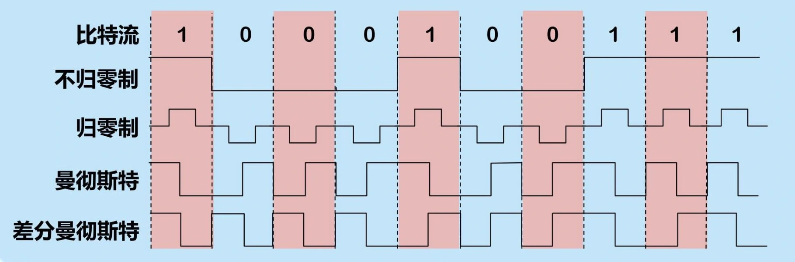
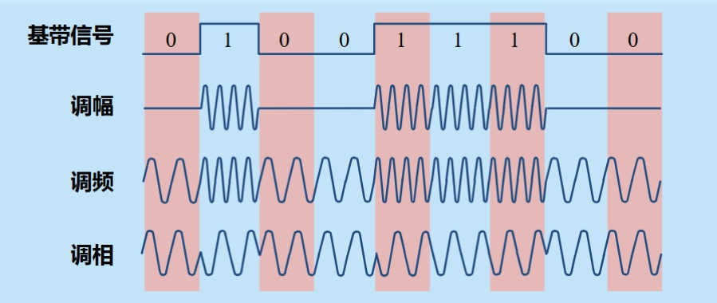
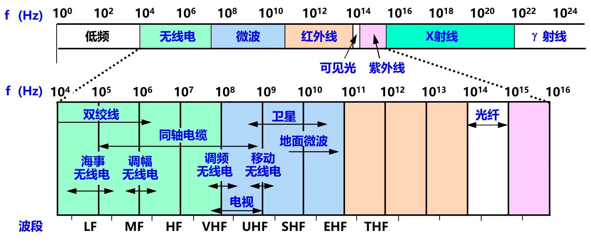
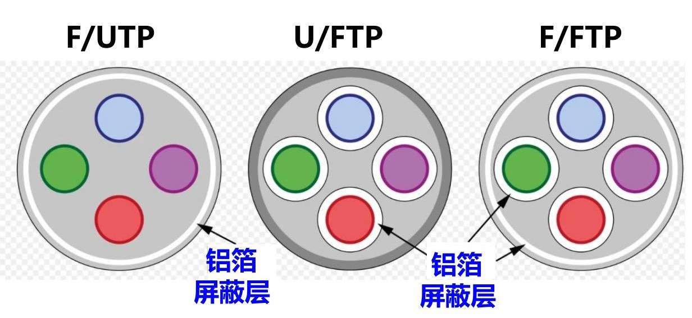
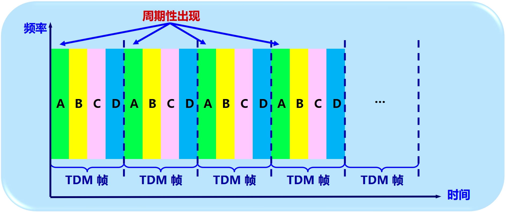
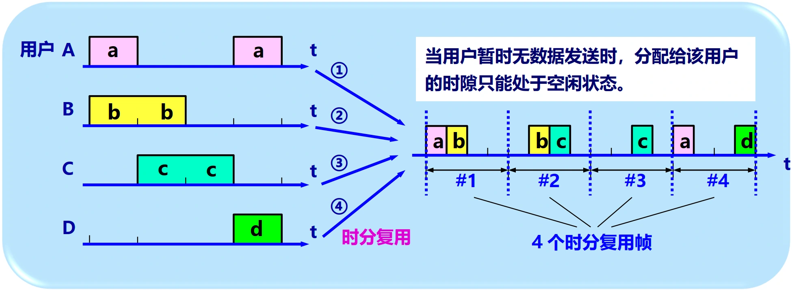
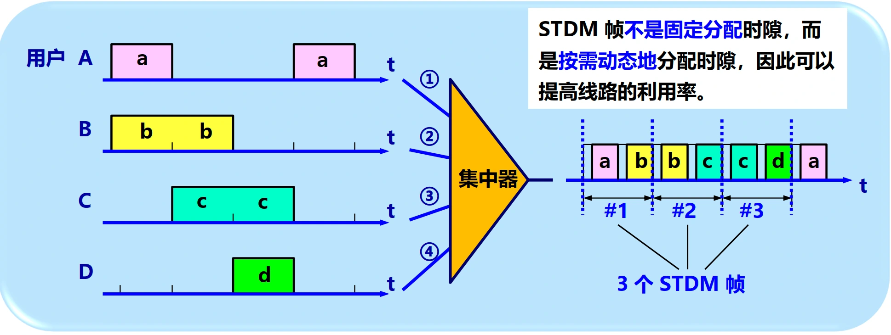
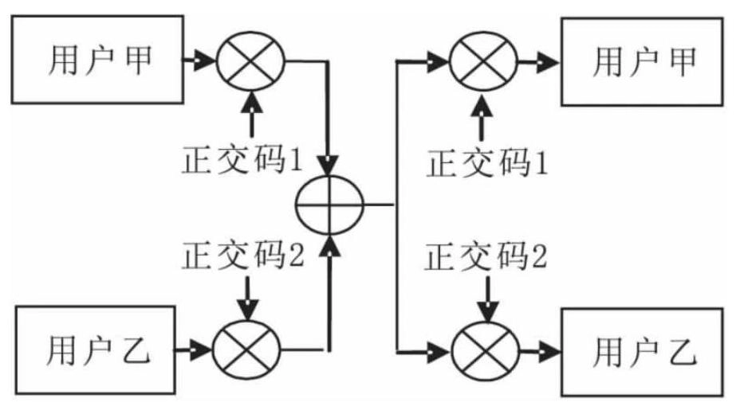
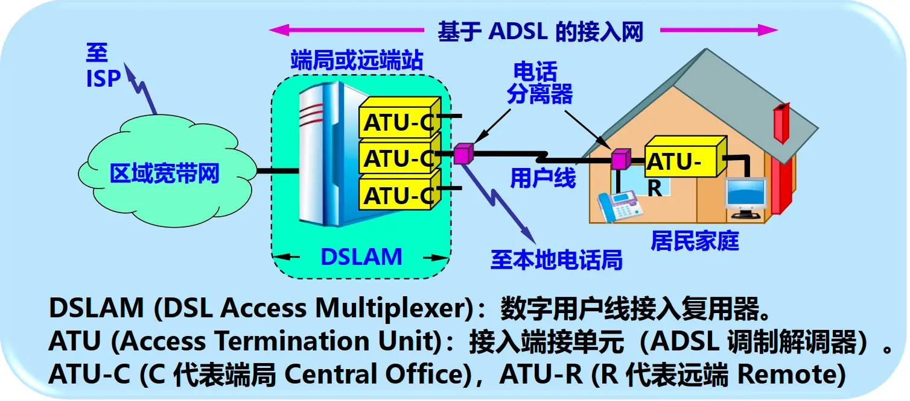

# 物理层

- [Back to Course Home](index.md)

## 物理层基本概念

- 定义：在连接各种计算机的传输媒体上 **传输数据比特流** 的层次。
- 作用：尽可能屏蔽掉不同传输媒体和通信手段的差异。
- **主要任务**：确定与传输媒体的接口的一些特性。
- 特性：
	- 机械特性：指明接口所用接线器的形状和尺寸、引线数目和排列、固定和锁定装置等。
	- 电气特性：指明在接口电缆的各条线上出现的电压的范围。
	- 功能特性：指明某条线上出现的某一电平的电压的意义。
	- 过程特性：指明对于不同功能的各种可能事件的出现顺序。

## 数据通信的基础知识
### 数据通信系统的模型

- 三大部分：
	- **源系统**（或发送端、发送方）
	- **传输系统**（或传输网络）
	- **目的系统**（或接收端、接收方）

#### 常用术语

- 消息（message）：如话音、文字、图像、视频等。
- 数据（data）：运送消息的实体。有意义的符号序列。
- 信号（signal）：数据的电气的或电磁的表现。
	- 模拟信号（analogous signal）：消息参数取值连续。
	- 数字信号（digital signal）：消息参数取值离散。
- 码元：在使用时间域（简称为时域）的波形表示数字信号时，代表不同离散数值的基本波形。
	- 使用二进制编码时，只有两种不同的码元：0 状态，1 状态。

#### 有关信道的几个基本概念

- **信道**：一般用来表示向某一个方向传送信息的媒体。
	- **单向通信**（单工通信）：只能有一个方向的通信，没有反方向的交互。
	- **双向交替通信**（半双工通信）：通信的双方都可以发送信息，但双方不能同时发送或同时接收。
	- **双向同时通信**（全双工通信）：通信的双方可以同时发送和接收信息。
- **基带信号**（即基本频带信号）
	- 来自信源的信号。
	- 包含有较多的低频成分，甚至有直流成分。
- **调制**
	- **基带调制**：仅对基带信号的波形进行变换，把数字信号转换为另一种形式的数字信号。把这种过程称为编码（coding）。
		- **常用编码方式**：
			1. **不归零制编码**：正电平代表 1，负电平代表 0，无中间状态。
			2. **归零制编码**：正电平代表 1，负电平代表 0，中间有零电平状态。
			3. **曼彻斯特编码**：位周期中心的向上跳变代表 0，位周期中心的向下跳变代表 1 。但也可反过来定义。
			4. **差分曼彻斯特编码**：在每一位的中心处始终都有跳变。位开始边界有跳变代表 0，而位开始边界没有跳变代表 1。

			

		- 信号频率：曼彻斯特编码和差分曼彻斯特编码产生的信号频率比不归零制高。
		- 自同步能力：从信号中提取时钟频率的能力。
			- 不归零制和归零制没有自同步能力。
			- **曼彻斯特编码和差分曼彻斯特编码具有自同步能力**。
	- **带通调制**：使用载波（carrier）进行调制（modulation），把基带信号的频率范围搬移到较高的频段，并转换为模拟信号。经过载波调制后的信号称为带通信号（即仅在一段频率范围内能够通过信道的信号）。
		1. **调幅** AM：载波的振幅随基带数字信号而变化。
		2. **调频** FM：载波的频率随基带数字信号而变化。
		3. **调相** PM：载波的初始相位随基带数字信号而变化。
			

		4. **正交振幅调制** QAM（Quadrature Amplitude Modulation）：多元制的振幅相位混合调制方法，能达到更高的信息传输速率。
			- 示例：
				- 可供选择的相位有 12 种，而对于每一种相位有 1 或 2 种振幅可供选择。总共有 16 种组合，即 16 个码元。
				- 由于 4 bit 编码共有 16 种不同的组合，因此这 16 个点中的每个点可对应于一种 4 bit 的编码。数据传输率可提高 4 倍。
					

#### 信道的极限容量

- 任何实际的信道都不是理想的，都不可能以任意高的速率进行传送。
- 码元传输的速率越高，或信号传输的距离越远，或噪声干扰越大，或传输媒体质量越差，在接收端的波形的失真就越严重。
- 限制码元在信道上的传输速率的两个因素：
	- **信道能够通过的频率范围**
		- 具体的信道所能通过的频率范围总是有限的。信号中的许多高频分量往往不能通过信道。
		- 码间串扰：接收端收到的信号波形失去了码元之间的清晰界限。
		- 奈氏准则： 码元传输的 **最高** 速率 $= 2W$（码元/秒），其中 $W$ 是信道的带宽（$Hz$）。
	- **信噪比**
		- 信噪比就是信号的平均功率和噪声的平均功率之比。常记为 $S/N$ 或者 $SNR$，$S$ 代表信号功率（Signal Power），$N$ 代表噪声功率（Noise Power），并用分贝（$dB$）作为度量单位。即：

			$$
			信噪比 = 10 \log_{10}(S/N)~(dB)
			$$

		- 例如：当 $S/N = {10}$ 时，信噪比为 $10~dB$，而当 $S/N = {1000}$ 时，信噪比为 $30~dB$。
- **香农公式**：
	- 信道的 **极限信息传输速率** $C$ 可表达为：

		$$
		C = W\log_{2}(1 + S/N)~(bit/s)
		$$

	- 其中：
		- $W$ 信道的带宽；
		- $S$ 为信道内所传信号的平均功率；
		- $N$ 为信道内部的高斯噪声功率。
	- 信道的带宽或信道中的信噪比越大，则信息的极限传输速率就越高。
	- 只要信息传输速率低于信道的极限信息传输速率，就一定可以找到某种办法来实现无差错的传输。
- 提高信息的传输速率的方法
	- 用编码的方法让每一个码元携带更多比特的信息量。
- 传输速率：波特率（Baud Rate）是电子通信领域中的一个重要概念，它用于度量数据传输的速率，即单位时间内传输的码元（符号）的个数。
	- 波特率与比特率（Bit Rate）的区别：
		- 比特率：单位时间内传输的比特数量，即单位时间内传送的二进制位数，常用 $bps$ 来表示。
		- 波特率：单位时间内传输的符号数量。
	- 联系：比特率 = 波特率 × 每个符号承载的比特数。

## 物理层下的传输媒体

- 传输媒体是数据传输系统中在发送器和接收器之间的物理通路。
- 分类：
	- **导引型传输媒体**：电磁波被导引沿着固体媒体（铜线或光纤）传播。
	- **非导引型传输媒体**：指自由空间。非导引型传输媒体中电磁波的传输常称为无线传输。
- 电信领域使用的电磁波的频谱：
	

### 导引型传输媒体
#### 双绞线

- 最古老但又最常用的传输媒体。
- 把两根互相绝缘的铜导线并排放在一起，然后用规则的方法绞合（twist）起来就构成了双绞线。
- 绞合度越高，可用的数据传输率越高。
- 分类：
	- **无屏蔽双绞线** UTP（Unshielded Twisted Pair）
	- **屏蔽双绞线** STP（Shielded Twisted Pair）
		- 都必须有接地线。
		- X/UTP：对整条双绞线电缆进行屏蔽。
			- F/UTP（F=Foiled）：采用铝箔屏蔽层
			- S/UTP（S=braid Screen）：采用金属编织层
			- SF/UTP：在铝箔屏蔽层外面再加上金属编织层
		- FTP：把电缆中的每一对双绞线都加上铝箔屏蔽层。
			- U/FTP：对整条电缆不另增加屏蔽层
			- F/FTP：在 FTP 基础上对整条电缆再加上铝箔屏蔽层
			- S/FTP：在 FTP 基础上对整条电缆再加上金属编织层
		- 在抗干扰能力上，U/FTP 比 F/UTP 好，而 F/FTP 则是最好的。
			

- 无论是哪种类别的双绞线，**衰减都随频率的升高而增大**。双绞线的最高速率还与数字信号的编码方法有很大的关系

#### 同轴电缆

- 由内导体铜质芯线（单股实心线或多股绞合线）、绝缘层、网状编织的外导体屏蔽层（也可以是单股的）以及保护塑料外层所组成。
	

- 具有很好的抗干扰特性，被广泛用于传输较高速率的数据。

#### 光缆

- 光纤是光纤通信的传输媒体。通过传递光脉冲来进行通信。其传输带宽远远大于目前其他各种传输媒体的带宽。
- 光纤通信系统的基本组成
	- 发送端：要有光源，在电脉冲的作用下能产生出光脉冲。
		- 光源：发光二极管，半导体激光器等。
	- 接收端：要有光检测器，利用光电二极管做成，在检测到光脉冲时还原出电脉冲。
- 光波在纤芯中的传播：不断进行全反射
- 分类：
	

	- 多模光纤
		- 可以存在多条不同角度入射的光线在一条光纤中传输。
		- 光脉冲在多模光纤中传输时会逐渐展宽，造成失真，只适合于近距离传输。
	- 单模光纤
		- 其直径减小到只有一个光的波长（几个微米），可使光线一直向前传播，而不会产生多次反射。
		- 制造成本较高，但衰耗较小。
		- 光源要使用昂贵的半导体激光器，不能使用较便宜的发光二极管。
- 光纤通信中使用的光波的波段
	- 常用的三个波段的中心：
		- $850~nm$
		- $1300~nm$
		- $1550~nm$
	- 所有这三个波段都具有 $25000\sim 30000 ~GHz$ 的带宽，通信容量非常大。
- 光缆：
	- 光纤必须做成很结实的光缆。
		- 由数十至数百根光纤组成
		- 加强芯和填充物
		- 必要时还可放入远供电源线
		- 最后加上包带层和外护套
	- 使抗拉强度达到几公斤，完全可以满足工程施工
- 光纤优点
	- 通信容量非常大
	- 传输损耗小，中继距离长，对远距离传输特别经济。
	- 抗雷电和电磁干扰性能好。
	- 无串音干扰，保密性好，不易被窃听或截取数据。
	- 体积小，重量轻。

### 非导引型传输媒体

- 利用无线电波在自由空间的传播可较快地实现多种通信，因此将自由空间称为“非导引型传输媒体”。
- 无线传输所使用的频段很广：$LF \sim THF~(30 ~{kHz \sim 3000 ~GHz})$

#### 无线电微波通信

- 占有特殊重要的地位。
- 微波频率范围：
	- $300 ~{MHz} \sim 300 ~{GHz}$（波长 $1 ~ m \sim 1 ~ mm$）
	- 主要使用：$2 \sim 40 ~{GHz}$。
- 在空间主要是 **直线** 传播。
	- 地球表面：传播距离受到限制，一般只有 ${50}~{km}$ 左右。
	- ${100}~m$ 高的天线塔：传播距离可增大到 ${100}~{km}$ 。
- **多径效应**：基站发出的信号可以经过多个障碍物的数次反射，从多条路径、按不同时间等到达接收方。多条路径的信号叠加后一般都会产生很大的失真，这就是所谓的多径效应。
- 远距离微波通信：微波接力
	- 微波接力：中继站把前一站送来的信号放大后再发送到下一站。
	- 主要特点：
		1. 微波波段频率很高，频段范围很宽，其通信信道的容量很大。
		2. 工业干扰和天电干扰对微波通信的危害小，微波传输质量较高。
		3. 与相同容量和长度的电缆载波通信比较，微波接力通信建设投资少，见效快，易于实施。
	- 主要缺点：
		1. 相邻站之间必须直视（常称为视距 LOS，Line Of Sight），不能有障碍物，存在多径效应。
		2. 有时会受到恶劣气候的影响。
		3. 与电缆通信系统比较，微波通信的隐蔽性和保密性较差。
		4. 对大量中继站的使用和维护要耗费较多的人力和物力。

#### 卫星通信

- 优点：
	- 通信容量大，通信距离远，通信比较稳定，通信费用与通信距离无关。
- 缺点：
	- 传播时延较大：在 $250\sim300~ms$ 之间。
		- 请注意：“卫星信道的传播时延较大”并不等于“用卫星信道传送数据的时延较大”，因为数据传送的时延还包括发送时延、处理时延和排队时延。
	- 保密性相对较差。
	- 造价较高。

## 信道复用技术

- 复用（multiplexing）：允许用户使用一个共享信道进行通信。
- 复用器（multiplexer）和分用器（demultiplexer）成对使用。
	

### 频分复用 FDM（Frequency Division Multiplexing）

- **频分复用** FDM（Frequency Division Multiplexing）
	- 最基本的复用方式
	- 定义：给每个信号分配唯一的载波频率，并通过单一媒体来传输多个独立信号的方法。
	- 特点
		- 整个带宽分为多份，每个信号在分配到一定的频带后，在通信过程中自始至终都占用这个频带。
		- 所有信号在同样的时间占用不同的带宽（即频带）资源。
		- 只强调了复用的方式，而并不关心复用的这些信道是来自多个用户还是来自一个用户。
- **频分多址接入** FDMA（Frequency Division Multiple Access）
	- 定义：使用 FDM 技术让多个用户在同一信道上进行通信的方法。
	- 特点：让 $N$ 个用户各使用一个 FDM 的频带，或让更多的用户轮流使用这 $N$ 个频带。强调了复用的这些信道是来自多个用户。

### 时分复用 TDM（Time Division Multiplexing）

- **时分复用** TDM（Time Division Multiplexing）
	- 定义：将时间划分为一段段 **等长的** 时分复用帧（TDM 帧），每一个 TDM 帧又划分为若干个时隙（time slot），每一个信号在每一个 TDM 帧中占用固定序号的时隙。
		

	- 特点：
		- 每一个信号所占用的时隙是周期性地出现（其周期就是 TDM 帧的长度）。
		- 所有信号在不同的时间占用同样的频带宽度。
		- 只强调了复用的方式，而并不关心复用的每个时隙的信号是来自多个用户还是来自一个用户。
	- TDM 信号也称为等时（isochronous）信号。
	- 时分复用会导致信道利用率不高
		

- **时分多址接入** TDMA（Time Division Multiple Access）
	- 定义：使用 TDM 技术让多个用户在同一信道上进行通信的方法。
	- 特点：让 $N$ 个用户各使用一个 TDM 的时隙，或让更多的用户轮流使用这 $N$ 个时隙。强调了复用的这些信道是来自多个用户。

### 统计时分复用 STDM（Statistical Time Division Multiplexing）

- 定义：根据各个信号的实际需要动态地分配时隙，而不是像时分复用 TDM 那样为每一个信号分配固定的时隙。又称为 **异步时分复用**。
- 特点：
	- 信号只有在有数据发送时才占用信道资源。
	- 信道利用率高。
	- 需要在复用器和分用器中增加地址信息，以便识别不同信号的数据。
- 示例：
	

### 波分复用 WDM（Wavelength Division Multiplexing）

- 定义：光的频分复用。使用一根光纤来同时传输多个光载波信号。
	

- 分类：
	- 密集波分复用 DWDM（Dense Wavelength Division Multiplexing）
	- 稀疏波分复用 CWDM（Coarse Wavelength Division Multiplexing）

### 码分复用 CDM（Code Division Multiplexing）

- **码分复用** CDM（Code Division Multiplexing）
	- 定义：通过给每一个信号分配一个独特的码片序列，使得多个信号可以在同一频带、同一时间内进行传输而互不干扰的方法。
	- 特点：
		- 每一个信号可以在同样的时间使用同样的频带进行通信。
		- 各信号使用经过特殊挑选的不同码型，因此不会造成干扰。
- **码分多址接入** CDMA（Code Division Multiple Access）
	- 定义：使用 CDM 技术让多个用户在同一信道上进行通信的方法。
	- 特点：让 $N$ 个用户各使用一个独特的 **码片序列** 在 CDM 信道上进行通信，或让更多的用户轮流使用这些码片序列。强调了复用的这些信道是来自多个用户。
	- 工作原理
		

		1. 编码：让两人信息分别乘以彼此正交的正交编码，如哈达码、沃尔什码等。
		2. 混合：将编码后的信息混合，送入信道传输。
		3. 分离：在接收端对收到的混合信号进行分离，让混合信号再次与各自的正交码相乘，分离出不同的用户信息。
	- CDMA 技术的原理主要基于扩频和分散码技术：
		1. 扩频技术：通过将原始信号进行编码扩展，使信号的带宽增大，从而可以在更宽的频段上进行传输。这种技术增强了信号的抗干扰能力，并提高了频谱的利用率。
			- 直接序列扩频 DSSS（Direct Sequence Spread Spectrum）
			- 跳频扩频 FHSS（Frequency Hopping Spread Spectrum）
		2. 分散码技术：为每个用户分配一个唯一的码序列，通过这个码序列将用户的信号进行扩散，使得不同用户的信号可以混合在一起传输。在接收端，通过特定的解码技术，可以将信号重新聚合，从而恢复出原始信号。
	- **正交特性**：
		- 每个站分配的码片序列：各不相同，且必须互相 **正交**（orthogonal）。
		- 正交向量 $S$ 和 $T$ 的规格化内积（inner product）等于 $0$

			$$
			S \cdot T \equiv \frac{1}{m}\sum_{i=1}^{m}{S}_{i}{T}_{i} = 0
			$$

		- 任何一个码片向量和该码片向量自己的规格化内积都是 $1$

			$$
			S \cdot S = \frac{1}{m}\sum_{i=1}^{m}{S}_{i}{S}_{i} = \frac{1}{m}\sum_{i=1}^{m}{S}_{i}^{2} = \frac{1}{m}\sum_{i=1}^{m}{(\pm 1)}^{2} = 1
			$$

		- 一个码片向量和该码片反码的向量的规格化内积值是 $-1$

			$$
			S \cdot \overline{S} = - 1
			$$

## 数字传输系统

- 早期，电话网长途干线采用 **频分复用** FDM 的模拟传输方式。
- 目前，大都采用 **时分复用** TDM 的数字传输方式。
- **光纤** 开始成为长途干线最主要的传输媒体。
- 早期数字传输系统的缺点
	- 速率标准不统一。两个互不兼容的国际标准：
		- 北美和日本的 T1 速率（1.544 Mbit/s）
		- 欧洲的 E1 速率（2.048 Mbit/s）
	- 不是同步传输。主要采用准同步方式。
		- 各支路信号的时钟频率有一定的偏差，给时分复用和分用带来许多麻烦。

### 同步光纤网 SONET（Synchronous Optical Network）

- 美国电信工业协会（TIA）制定的光纤传输标准。
- 各级时钟都来自一个非常精确的主时钟。
- 为光纤传输系统定义了同步传输的线路速率等级结构：
	- 传输速率以 51.84 Mbit/s 为基础。
		- 对电信信号：**第 1 级同步传送信号** STS-1（Synchronous Transport Signal）
		- 对光信号则：**第 1 级光载波** OC-1（Optical Carrier）
	- 现已定义了从 51.84 Mbit/s（即 OC-1）到 9953.280 Mbit/s（即 OC-192/STS-192）的标准。

### 同步数字系列 SDH（Synchronous Digital Hierarchy）

- ITU-T 以美国标准 SONET 为基础制订的国际标准。
- 定义了同步传输的线路速率等级结构：
	- 传输速率以 155.52 Mbit/s 为基础，称为 **第 1 级同步传递模块** STM-1（Synchronous Transfer Module）
	- 相当于 SONET 体系中的 OC-3 速率

## 宽带接入技术

- 宽带：标准在不断提高。
	- 美国联邦通信委员会 FCC 定义：宽带下行速率达 25 Mbit/s，宽带上行速率达 3 Mbit/s。
- 分类：
	- 有线宽带接入
	- 无线宽带接入

### 非对称数字用户线 ADSL（Asymmetric Digital Subscriber Line）
#### 第一代 ADSL

- 定义：用数字技术对现有的模拟电话用户线进行改造，使它能够承载宽带业务。
- 特点：
	- ADSL 技术把 0~4 kHz 低端频谱留给传统电话使用，而把原来没有被利用的高端频谱留给用户上网使用。
	- **非对称**：下行（从 ISP 到用户）带宽 **远大于** 上行（从用户到 ISP）带宽。
- ADSL 调制解调器
	- 采用离散多音调 DMT（Discrete Multi-Tone）调制技术。
		- DMT 调制技术采用频分复用 FDM 方法。
			

		- 相当于在一对用户线上使用许多小的调制解调器并行地传送数据。
	- ADSL 不能保证固定的数据率。
- ADSL 的组成
	

	- 数字用户线接入复用器 DSLAM（DSL Access Multiplexer）
	- 接入端接单元 ATU（Access Termination Unit）：ADSL 调制解调器
		- ATU-C（Central Office）：位于 ISP 端
		- ATU-R（Remote）：位于用户端
- ADSL 最大好处：可以利用现有电话网中的用户线（铜线），而不需要重新布线。

#### 第二代 ADSL

- 包括 ADSL2（G.992.3 和 G.992.4）和 ADSL2+（G.992.5）
- 主要改进：
	1. 通过提高调制效率得到了更高的数据率。
	2. 采用了无缝速率自适应技术 SRA（Seamless Rate Adaptation）
	3. 改善了线路质量评测和故障定位功能。
- ADSL 并不适合于企业，因为企业往往需要使用上行信道发送大量数据给许多用户。

#### xDSL

- SDSL（Symmetric DSL）：对称数字用户线
	- 上行和下行的数据传输速率相同。
- HDSL（High speed DSL）：高速数字用户线
- VDSL（Very high speed DSL）：甚高速数字用户线
- Giga DSL：超高速数字用户线
	- 华为公司于 2012 年首先研制成功样机。
	- 使用时分双工 TDD（Time Division Duplex）和 OFDM 技术

### 光纤同轴混合网（HFC 网）

- 定义：HFC（Hybrid Fiber Coax）网基于有线电视网 CATV 网，把原有线电视网中的同轴电缆主干部分改换为光纤
	

- HFC 网具有双向传输功能，扩展了传输频带
- 机顶盒与电缆调制解调器
	- **机顶盒**（set-top box）：
		- 连接在同轴电缆和用户的电视机之间。
		- 使现有的模拟电视机能够接收数字电视信号。
	- **电缆调制解调器**（cable modem）：
		- 将用户计算机接入互联网。
		- 在上行信道中传送交互数字电视所需的一些信息。
		- 不需要成对使用，而只需安装在用户端。
		- 复杂，必须解决共享信道中可能出现的冲突问题。

### FTTx 技术

- 代表多种宽带光纤接入方式。
- FTTx 表示 Fiber To The ... x，其中 x 可以表示不同的接入点。
	- FTTH（Fiber To The Home）：光纤到户
	- FTTB（Fiber To The Building）：光纤到楼
	- FTTC（Fiber To The Curb）：光纤到路边箱
	- FTTN（Fiber To The Node）：光纤到节点

#### 光配线网 ODN（Optical Distribution Network）

- 光配线网 ODN（Optical Distribution Network）：位于光纤干线和广大用户之间。
	- 无源的光配线网常称为无源光网络 PON（Passive Optical Network）。
- 采用 **波分复用** WDM，上行和下行分别使用不同的波长。
- 最流行的无源光网络 PON（Passive Optical Network）：
	- 以太网无源光网络 EPON（Ethernet PON）
		- 在链路层使用以太网协议，利用 PON 的拓扑结构实现以太网的接入。
		- 与现有以太网的兼容性好，并且成本低，扩展性强，管理方便。
	- 吉比特无源光网络 GPON（Gigabit PON）
		- 采用通用封装方法 GEM（Generic Encapsulation Method），可承载多业务，且对各种业务类型都能够提供服务质量保证，总体性能比 EPON 好。
		- 成本稍高。