# 数据链路层

- [Back to Course Home](index.md)

- 数据链路层的地位
	

- 数据链路层信道类型
	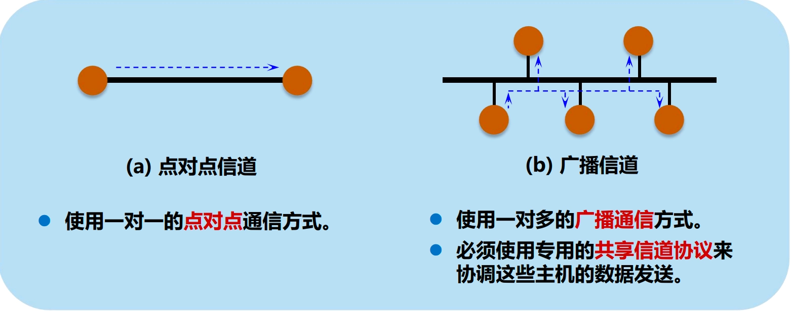

## 使用点对点信道的数据链路层
### 数据链路和帧

- **链路**（link）—— 物理链路
	- 定义：一条无源的点到点的物理线路段，中间没有任何其他的交换结点。
	- 一条链路只是一条通路的一个组成部分。
- **数据链路**（data link）—— 逻辑链路
	- 定义：把实现控制数据传输的协议的硬件和软件加到链路上，就构成了数据链路。
	- 典型实现：适配器（即网卡）
- 数据链路层协议数据单元：帧
	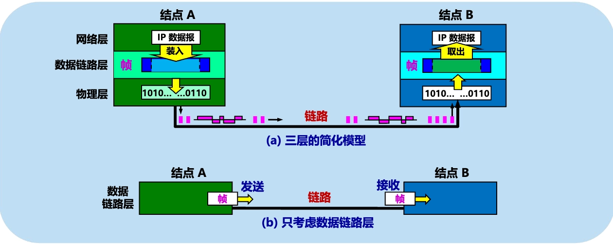

### 四个基本问题

1. 封装成帧
2. 透明传输
3. 差错控制
4. 流量控制

#### 封装成帧（framing）

- 定义：在一段数据的前后分别添加首部和尾部，构成一个帧。
- 示意图：
	

- 最大传送单元 **MTU**（Maximum Transfer Unit）：规定了所能传送的帧的数据部分长度上限。
- 首尾部作用：进行**帧定界**，即确定帧的界限。
	- 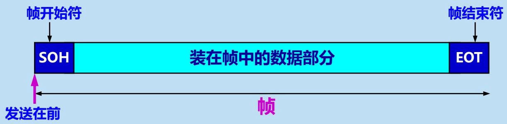
	- 用控制字符作为帧定界符
		- 控制字符 SOH（Start Of Header）放在一帧的最前面，表示帧的首部开始。
		- 控制字符 EOT（End Of Transmission）放在一帧的末尾，表示帧的结束。

#### 透明传输

- 问题：如果数据中的某个字节的二进制代码恰好和 SOH 或 EOT 一样，数据链路层就会错误地“找到帧的边界”，导致错误。
	

- 解决方案：用“字节填充”或“字符填充”法解决透明传输的问题
	- 在数据部分中插入一个特殊的转义字符 ESC（Escape）。
		- 发送端：在每个出现 SOH、EOT 或 ESC 字符的地方前面都插入一个 ESC 字符。
		- 接收端：每当遇到 ESC 字符时，就把它后面的一个字符取出来作为数据的一部分，而不把它作为控制字符处理。
	- 示例：
		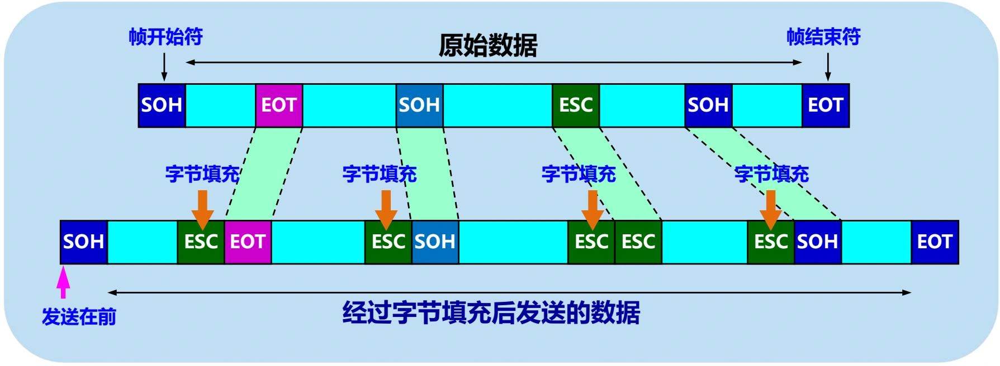

- 透明：指某一个实际存在的事物看起来却好像不存在一样。
	- “在数据链路层透明传送数据”表示：无论发送什么样的比特组合的数据，这些数据都能够按照原样没有差错地通过这个数据链路层。

#### 差错控制

- 问题：在传输过程中可能会产生比特差错：$1 \rightarrow 0$，$0 \rightarrow 1$。
	

- **误码率** BER（Bit Error Rate）：在一段时间内，传输错误的比特占所传输比特总数的比率。
- 差错控制的两种基本方法
	1. **检错**（error detection）：检测出传输过程中产生的差错。
	2. **纠错**（error correction）：不仅能检测出差错，而且还能自动纠正这些差错。
- **帧检验序列** FCS（Frame Check Sequence）：在数据后面添加上的**冗余码**，用于差错检测或纠错。
- 差错控制的两种基本策略
	- **差错检测-重传**：当检测到差错时，丢弃该帧并请求重传该帧。
		- **自动重传请求** ARQ（Automatic Repeat reQuest）：当检测到差错时，请求重传该帧。
	- **差错检测-纠错**：不仅能检测出差错，而且还能自动纠正这些差错。

##### 检错-奇偶校验

- 定义：奇校验码和偶校验码的统称
	- 奇校验码：在传输的信息后中附加一位校验元，使得最后传输的信息中“1”的个数是奇数
	- 偶校验码：附加一位后，使得最终的信息中的“1”的个数是偶数个。
- 作用：检测单比特差错

##### 检错-循环冗余检验 CRC（Cyclic Redundancy Check）

- 定义：在发送端，先把数据**划分为组**。假定每组 $k$ 个比特。CRC 运算在每组 $M$ 后面再添加供差错检测用的 $n$ 位**冗余码**，然后构成一个帧发送出去。一共发送 $(k + n)$ 位。
- 作用：检测多比特差错
- 模 2 运算：逻辑异或，不进位/借位
- CRC 冗余码的计算
	

	1. 计算 $M$ 与 $2^{n}$ 的**模 2 乘法**，相当于在 $M$ 后面添加 $n$ 个 $0$。
	2. 得到的 $(k + n)$ 位的数执行**模 2 除法**，除以事先选定好的长度为 $(n + 1)$ 位的除数 $P$，得出商是 $Q$，余数是 $R$，余数 $R$ 比除数 $P$ 少 $1$ 位，即 $R$ 是 $n$ 位。
	3. 将余数 $R$ 作为冗余码拼接在数据 $M$ 后面，一起发送出去。
- 示例：
	

- 广泛使用的除数生成多项式 $P(X)$

	$$
	\begin{aligned} &\mathrm {CRC-16} = X ^ {16} + X ^ {15} + X ^ {2} + 1 \\ &\mathrm {CRC-CCITT} = X ^ {16} + X ^ {12} + X ^ {5} + 1 \\ &\mathrm {CRC-32} = X ^ {32} + X ^ {26} + X ^ {23} + X ^ {22} + X ^ {16} + X ^ {12} + X ^ {11} + X ^ {10} + X ^ {8} + X ^ {7} + X ^ {5} + X ^ {4} + X ^ {2} + X + 1 \\ \end{aligned}
	$$

- 说明：
	- 仅用循环冗余检验 CRC 差错检测技术只能做到“无比特差错”，而做不到“可靠传输”。
		- 无差错接受（accept）：凡是接受的帧（即不包括丢弃的帧），我们都能以非常接近于 1 的概率认为这些帧在传输过程中没有产生差错
	- “无比特差错”不等于“无传输差错”：
		- 比特差错：比特 $1 \rightarrow 0$ 或 $0 \rightarrow 1$。
		- 传输差错：帧丢失、帧重复或帧失序等。
	- 可靠传输：数据链路层的发送端发送什么，在接收端就收到什么。
		- 在数据链路层使用 CRC 检验，能够实现无比特差错的传输，但这还不是可靠传输。
		- **要做到可靠传输，还必须再加上帧编号、确认和重传等机制。**

##### 纠错-汉明码（Hamming Code）

- 定义：编号为 2 的幂的位作为校验位（只有 1 位是 1）
	

	$$
	\begin{aligned} C1 & = D1 \oplus D2 \oplus D4 \oplus D5 \oplus D7 \\ C2 & = D1 \oplus D3 \oplus D4 \oplus D6 \oplus D7 \\ C4 & = D2 \oplus D3 \oplus D4 \oplus D8 \\ C8 & = D5 \oplus D6 \oplus D7 \oplus D8 \end{aligned}
	$$

- 特点：
	- **能检测并纠正单个比特差错**
	- 每个 C 校验 1 位
	- 每个位置编号影响自己为 1 的位置
- 示例：12 位数据错误位计算
	- 发送：$001101001111$ 计算校验位 $0111$
	- 接收：$001101101111$ 重算校验位 $0001$
	- 出现错误，纠错位置 $0111 \oplus 0001 = 0110 = 6$ （位置 6，D3），将其取反

#### 流量控制

- 流量控制是对控制链路上的帧的发送速率进行控制，使接收方有足够的缓冲空间来接收帧。
- 主要方法：
	- 停止-等待协议
	- 滑动窗口协议
		- 后退 N 帧协议
		- 选择重传协议
- 自动重发请求协议 ARQ（Automatic Repeat reQuest）：在接收站接收到一个包含出错数据的信息（帧）时，自动发出一个重传错帧的请求，也称循环自动请求协议。

##### 停止-等待协议（SW）
> 详见[下文](5.传输层.md/#arq_1)

- 定义：发送方每发送一帧，都要等待接收方的应答信号才能发送下一帧，接收方每接收一帧都需要反馈一个应答信号来表示可接收下一帧。
- 特点：
	- 如果发送方没有收到接收方的应答信号就一直等待。
	- 源站的等待时间超时后，会再次发送刚才的帧。

##### 后退 N 帧协议（GBN）
> 详见[下文](5.传输层.md/#n-arq)

- 定义：
	- 收到确认分组之前可以连续发送多个分组。若采用 $n$ 个比特对帧编号，则其**发送窗口** $W$ 的大小满足 $1 \leq W \leq 2^{n} - 1$，**接收窗口**为 $1$。
	- 当发送方发送了 $W$ 个分组后，接收方**按照帧编号顺序**接收分组，并依次发送确认分组，移动接收窗口。
	- 若某个分组传送失败，接收方将丢弃该分组及其后的所有分组，并不发送确认分组。发送方在超时后，重新发送该分组及其后的所有分组。
- 示例：发送方发送了 0、1、2、3、4 帧，但只收到 0 和 1 号帧的确认，等待超时之后需要重新发送 1 号帧之后的所有帧，即 2、3、4 帧。
	

- 优点：相比停止等待协议，后退 N 帧协议的信道利用率得到提高。
- 缺点：若当前窗口的最早的分组传送失败了，后面的分组即使传送成功了也需要重传，如果信道的误码率比较高的话，信道传输效率就会变的非常低。

##### 选择重传协议（SR）
> 详见[下文](5.传输层.md/#arq_3)

- 定义：
	- 发送窗口与接收窗口的大小都为 $W$。发送方可以连续发送 $W$ 个分组而不等待确认，接收方可以接收 $W$ 个分组并对每一个分组进行差错检测，分别发送确认分组。
	- 若某个分组传送失败，接收方只需请求发送方进行局部重传，而不需要回退 N 个帧进行重发。
- GBN 与 SR 的比较
	- 选择重传协议需要对每一个分区都给发送方反馈 ACK 确认消息，更适合用在误码率比较高的信道上。
	- 回退 N 帧协议比较适合用在误码率比较低的信道上。

## 点对点协议 PPP
### PPP 协议的特点

- 点对点协议 PPP（Point-to-Point Protocol）：
	- 定义：在点对点链路上封装网络层数据包的一种数据链路层协议。
	- 标准：RFC 1661
- **用户到 ISP 的链路**使用 PPP 协议
	- 通过 WAN 口连接运营商，同时运营商给我们提供了一个宽带接入的用户名、密码的过程。
	- 现在有时运营商的光猫作为 PPPOE 拨号的 client 与运营商的上行设备进行对接。
- PPP 协议应满足的需求
	1. **简单**——首要要求。
	2. 封装成帧——必须规定特殊的字符作为帧定界符。
	3. 透明性——必须保证数据传输的透明性。
	4. 多种网络层协议——能够在同一条物理链路上同时支持多种网络层协议。
	5. 多种类型链路——能够在多种类型的链路上运行。
	6. 差错检测——能够对接收端收到的帧进行检测，并立即丢弃有差错的帧。
	7. 检测连接状态——能够及时自动检测出链路是否处于正常工作状态。
	8. 最大传送单元——必须对每一种类型的点对点链路设置最大传送单元 MTU 的标准默认值，促进各种实现之间的互操作性。
	9. 网络层地址协商——必须提供一种机制使通信的两个网络层实体能够通过协商知道或能够配置彼此的网络层地址。
	10. 数据压缩协商——必须提供一种方法来协商使用数据压缩算法。
- PPP 协议的特点
	- PPP 既支持同步传输又支持异步传输，而 X.25、FR（Frame Relay）等数据链路层协议仅支持同步传输，SLIP 仅支持异步传输。
		- **异步传输**：以**字节**为单位来传输数据，一次 1 个字节，并且需要采用额外的起始位和停止位来标记每个字节的开始和结束。缺点是开始和停止位占据发送数据的相当大的比例，每个字节的发送都需要额外的开销。
		- **同步传输**：是以**帧**为单位来传输数据，在通信时需要使用时钟来同步本端和对端的设备通信。接收设备获取数据，直到识别出特殊的结束字符。
	- PPP 协议具有很好的扩展性，例如，当需要在以太网链路上承载 PPP 协议时，PPP 可以扩展为 PPPoE。
	- PPP 提供了 LCP（Link Control Protocol）协议，用于各种链路层参数的协商，用来建立、拆除和监控 PPP 数据链路。
	- PPP 提供了各种 NCP（Network Control Protocol）协议（如 IPCP、IPXCP），用来协商在该数据链路上所传输的数据包的格式与类型，更好地支持了网络层协议。
	- PPP 提供了认证协议：CHAP（Challenge-Handshake Authentication Protocol）、PAP（Password Authentication Protocol），主要用于网络安全方面的验证，更好的保证了网络的安全性。
	- 无重传机制，网络开销小，速度快。

### PPP 协议的帧格式

- 各字段的意义
	- **首部**：4 个字段
		- 标志字段 F：`0x7E`。标识一个物理帧的起始和结束，连续两帧之间只有一个标志字段。
		- 地址字段 A：置为 `0xFF`，广播地址。实际上不起作用。
		- 控制字段 C：通常置为 `0x03`。
		- 协议字段：长度两字节
			- `0x0021`：信息字段是 IP 数据报。
			- `0x8021`：信息字段是网络控制数据。
			- `0xC021`：信息字段是 LCP 报文。
			- `0xC023`：信息字段是 PAP 报文。
	- **信息字段**：承载网络层数据包，长度可变，不超过 1500 字节。
	- **尾部**：2 个字段。
		- FCS：长度 2 字节，主要对 PPP 数据帧传输的正确性进行检测。
		- 标志字段 F：`0x7E`。
- 透明传输机制
	- 字节填充：为了保证数据传输的透明性，在信息字段部分中对特殊字段进行转义
		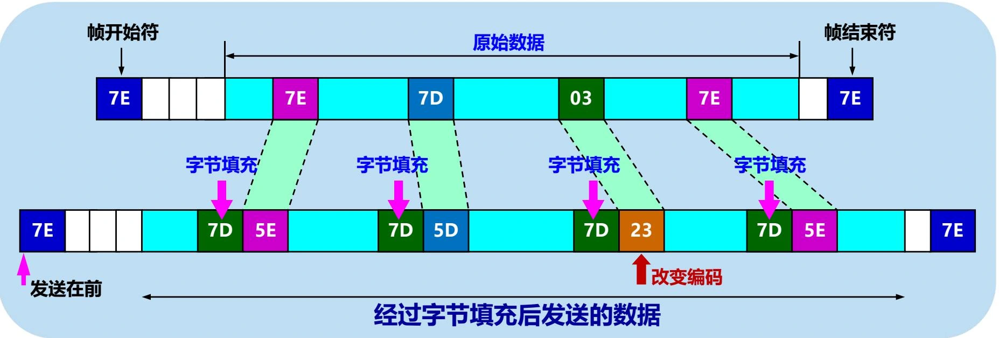

		- 标志字段 `0x7E` 替换为 `0x7D5E`
		- 转义字符 `0x7D` 替换为 `0x7D5D`
		- 控制字段 `0x03` 替换为 `0x7D23`
	- 零比特填充：在信息字段中每连续出现 5 个 `1` 比特时，发送端自动插入一个 `0` 比特，接收端在接收到数据时，遇到连续 5 个 `1` 比特后，自动删除后面的 `0` 比特。
		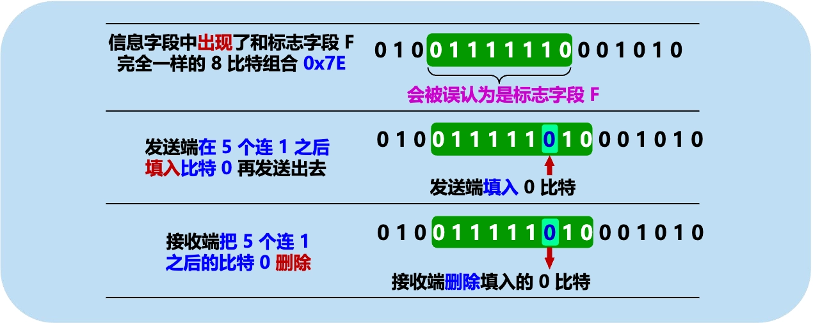

### PPP 协议的工作状态

- PPP 链路初始化过程：
	- 用户拨号接入 ISP 后，就建立了一条从用户个人电脑到 ISP 的物理连接。
	- 用户个人电脑向 ISP 发送一系列的链路控制协议 LCP 分组（封装成多个 PPP 帧），以便建立 LCP 连接。
	- 如果配置了验证，将开始 CHAP 或 PAP 验证。如果没有配置验证，则直接进入网络层配置。
	- 之后进行网络层配置。网络控制协议 NCP 给新接入的用户个人电脑分配一个临时的 IP 地址。
	- 当用户通信完毕时，NCP 释放网络层连接，收回原来分配出去的 IP 地址。LCP 释放数据链路层连接。最后释放的是物理层的连接。
- PPP 协议的状态图
	

## 使用广播信道的数据链路层
### 局域网的数据链路层

- 局域网的特点：
	1. 网络为一个单位所拥有；
	2. 地理范围和站点数目均有限。
- 局域网的优点：
	1. 具有广播功能，从一个站点可很方便地访问全网。
	2. 便于系统的扩展和逐渐地演变，各设备的位置可灵活调整和改变。
	3. 提高了系统的可靠性、可用性和生存性。
- IEEE 的 802 标准委员会定义了多种主要的 LAN 网：
	- 以太网（Ethernet）
	- 令牌环网（Token Ring）
	- 光纤分布式接口网络（FDDI）
	- 异步传输模式网（ATM）
	- 无线局域网（WLAN）。
- 局域网拓扑结构
	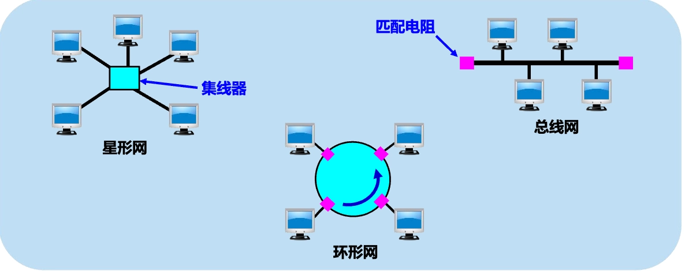

- 共享信道带来的问题：若多个设备在共享的广播信道上同时发送数据，则会造成彼此干扰，导致发送失败。
- 媒体共享技术
	- 静态划分信道：
		1. 频分复用
		2. 时分复用
		3. 波分复用
		4. 码分复用
	- 动态媒体接入控制（多点接入）：
		1. 随机接入：所有的用户可随机地发送信息。
		2. 受控接入：用户必须服从一定的控制。如轮询（polling）。
- 局域网数据链路层分为 2 个子层
	- 示意图
		

	- **逻辑链路控制子层** LLC（Logical Link Control）：与传输媒体无关。
		- LLC 负责识别网络层协议，然后对它们进行封装。LLC 报头告诉数据链路层一旦帧被接收到时，应当对数据包做何处理。
		- LLC 的主要功能：
			- 传输可靠性保障和控制
			- 数据包的分段与重组
			- 数据包的顺序传输
	- **媒体接入控制子层** MAC（Medium Access Control）：与传输媒体有关。
		- MAC 解决当局域网中共用信道的使用产生竞争时，如何分配信道的使用权问题
		- MAC 的主要功能：
			- 数据帧的封装/卸装
			- 帧的寻址和识别
			- 帧的接收与发送
			- 链路的管理
			- 帧的差错控制
		- MAC 子层负责把物理层的“0”、“1”比特流组建成帧，并通过帧尾部的错误校验信息进行错误校验；提供对共享介质的访问方法，包括以太网的带冲突检测的载波侦听多路访问（CSMA/CD）、令牌环（TokenRing）、光纤分布式数据接口（FDDI）等。
		- MAC 子层分配单独的局域网地址，就是通常所说的 MAC 地址（物理地址）。MAC 子层将目标计算机的物理地址添加到数据帧上，当此数据帧传递到对端的 MAC 子层后，它检查该地址是否与自己的地址相匹配，如果帧中的地址与自己的地址不匹配，就将这一帧抛弃；如果相匹配，就将它发送到上一层中。
- **适配器**
	- 适配器作用：计算机通过适配器和局域网进行通信
		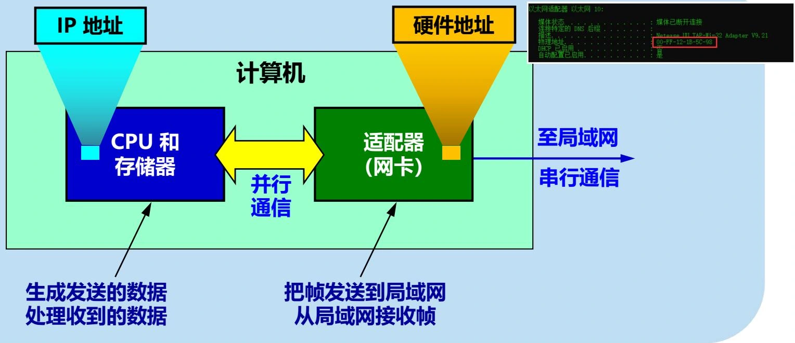

	- 适配器的主要功能：
		- 进行串行/并行转换
		- 包的装配和拆装
		- 网络存取控制
		- 数据缓存
		- 实现以太网协议
	- 适配器分类
		- 按网卡支持的局域网类型分类：ATM 网卡、令牌环网卡和以太网网卡等
		- 按网卡支持的传输速率分类：普通 10 Mbit/s 网卡、高速 100 Mbit/s 网卡、10/100 Mbit/s 自适应网卡、1000 Mbit/s 网卡。
		- 按网卡所支持的传输介质类型分类：双绞线网卡、粗缆网卡、细缆网卡、光纤网卡。
	- 主要技术指标：传输速率、缓存数量、总线、DMA 控制器、智能芯片

### 载波侦听多路访问/冲突检测技术（CSMA/CD 协议）

- 最早的以太网：将许多计算机都连接到一根总线上。
	- 总线特点：易于实现广播通信，简单，可靠。
		

	- 为了实现一对一通信，将接收站的硬件地址写入帧首部中的目的地址字段中。仅当数据帧中的目的地址与适配器硬件地址一致时，才能接收这个数据帧。
		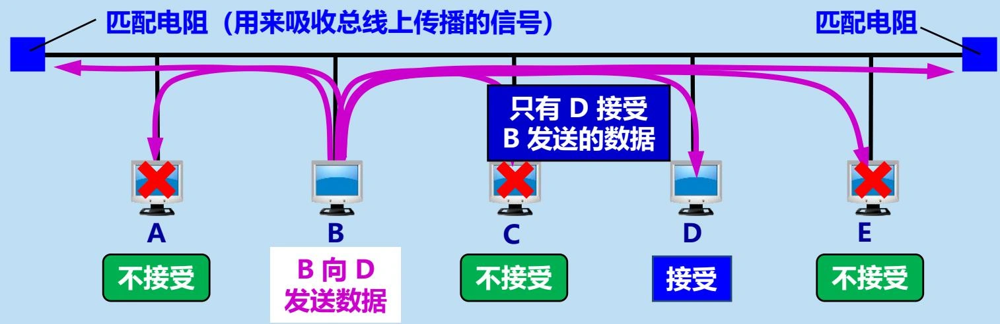

	- 总线缺点：多个站点同时发送时，会产生发送碰撞或冲突，导致发送失败。
		

- 以太网采取的两种重要措施
	1. 采用较为灵活的无连接的工作方式。
		- 无连接：不必先建立连接就可以直接发送数据。
		- 对发送的数据帧不进行编号，也不要求对方发回确认。
		- 提供不可靠的交付服务，尽最大努力交付，对差错帧是否重传由上层决定。
		- 同一时间只允许一个站点发送数据，采用简单随机接入，使用 CSMA/CD 协议减少冲突发生概率。
	2. 发送的数据都使用曼彻斯特（Manchester）编码。
		- 曼彻斯特编码
			- 曼彻斯特编码：每一位数据周期中间有一个电平跳变，跳变方向表示数据位的值。
			- 差分曼彻斯特编码：每一位数据周期中间时有一个电平跳变，周期开始时是否跳变表示数据位的值。
		- 优点：便于在传输过程中进行同步和检测碰撞。
		- 缺点：所占的频带宽度比原始的基带信号增加了一倍。

#### CSMA/CD 协议概述

- CSMA/CD 协议的要点
	- **多点接入**：总线型网络，许多计算机以多点接入的方式连接在一根总线上。
	- **载波监听**：边发送边监听，发送数据前与发送数据中都必须不停地检测信道。
	- **碰撞检测**：适配器边发送数据，边检测信道上的信号电压的变化情况。电压摆动值超过一定的门限值时，就认为总线上至少有两个站同时在发送数据，表明产生了碰撞（或冲突）。
	- **退避算法**：检测到碰撞后，适配器立即停止发送，等待一段随机时间后再次发送。
- 为什么要进行碰撞检测
	- 因为信号传播时延对载波监听产生了影响
	- 示意图
		

	- 可见：每一个站在自己发送数据之后的一小段时间内，存在着遭遇碰撞的可能性。
	- **A 需要单程传播时延的 2 倍的时间，才能确定是否与 B 的发送产生了冲突**。

#### CSMA/CD 协议的关键参数

- **争用期**
	- 定义：以太网的端到端**往返时延** $2 \tau$ 称为争用期，或碰撞窗口。
		- 经过争用期这段时间还没有检测到碰撞，才能肯定这次发送不会发生碰撞。
	- 10 Mbit/s 以太网争用期的长度 $2 \tau = 51.2 ~\mu s = 512$ 比特时间。
- **最短帧长**
	- 定义：为了保证发送站在发送完一帧数据后，仍然有足够的时间来检测碰撞，规定以太网的最短帧长为争用期内所能发送的最大数据量。
		- 以太网在发送数据时，若最短帧长内都没有发生冲突，则后续的数据就不会发生冲突。
		- 以太网规定凡长度小于最短有效帧长的帧都是由于冲突而异常中止的无效帧，应当立即将其丢弃。
	- 10 Mbit/s 以太网的最短帧长 $51.2 ~\mu s \times 10 ~Mbit/ s = 512 ~bit = 64 ~B$
- **最大端到端长度**
	- 定义：为了保证发送站在发送完一帧数据后，仍然有足够的时间来检测碰撞，规定以太网的最大端到端长度，使得单程传播时延 $\tau$ 不超过争用期的一半。
	- 10 Mbit/s 以太网的最大端到端长度
		- 以太网最大端到端单程时延必须小于争用期的一半（即  $25.6 ~\mu s$ ）。
		- 以太网的最大端到端长度约为 $200000 ~km/s \times 25.6 ~\mu s \approx 5 ~km$  。
- **碰撞后重传的时机**
	- 退避算法：**截断二进制指数退避**（truncated binary exponential backoff）
	- 发生碰撞的站停止发送数据后，要退避一个随机时间后再发送数据。
		1. 基本退避时间  $= 2 \tau$ 
		2. 从整数集合 $[0,1,\dots,(2^k - 1)]$ 中随机地取出一个数，记为 $r$。重传所需的时延 =  $r \times 基本退避时间$
		3. 参数  $k = \min\{重传次数,10\}$
		4. 当重传达 $16$ 次仍不能成功时即丢弃该帧，并向高层报告。
	- 举例
		- 第 1 次冲突重传时：$k = 1,r$ 为 $\{0,1\}$ 集合中的任何一个数。
		- 第 2 次冲突重传时：$k = 2,r$ 为 $\{0,1,2,3\}$ 集合中的任何一个数。
		- 第 3 次冲突重传时：$k = 3,r$ 为 $\{0,1,2,3,4,5,6,7\}$ 集合中的任何一个数。
		- ……
		- 第 10 次及以后冲突重传时：$k = 10,r$ 为 $\{0,1,2,\dots,1023\}$ 集合中的任何一个数。
	- 若连续多次发生冲突，表明可能有较多的站参与争用信道。上述退避算法可使重传需要推迟的平均时间随重传次数而增大（称为**动态退避**），因而减小发生碰撞的概率，有利于整个系统的稳定。
- **帧间最小间隔**
	- 定义：为了保证各站有足够的时间来处理刚接收完的帧，并为下一帧的发送做好准备，以太网规定在两帧之间必须有一个最小的间隔时间。
		- 在等待期间，适配器仍然要监听信道，一旦检测到信道忙，就要重新进行退避。
	- 10 Mbit/s 以太网的帧间最小间隔时间为 $9.6 ~\mu s$，即 $96 ~bit$ 时间。
- **强化碰撞：人为干扰信号**
	- 发送站检测到冲突后，立即停止发送数据帧，接着就发送 32 或 48 比特的人为干扰信号（jamming signal）。
	- 示意图
		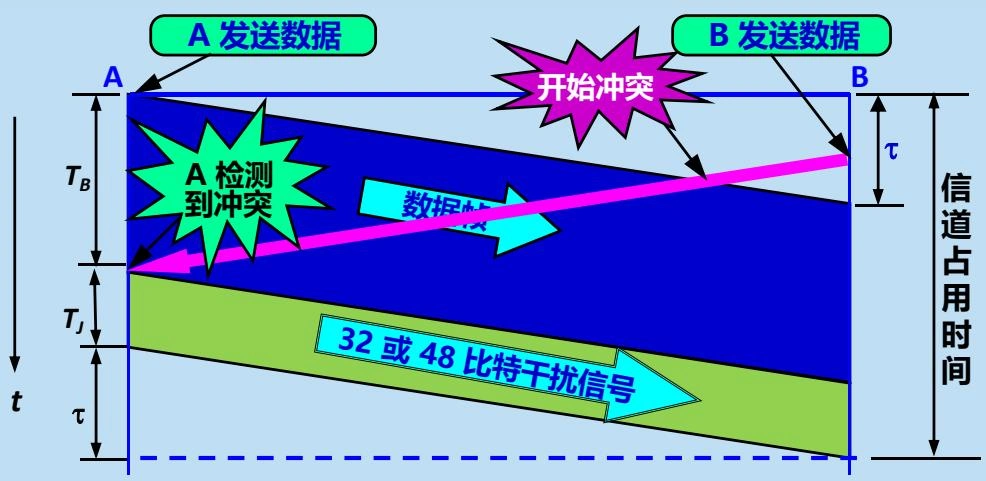

#### CSMA/CD 协议工作流程
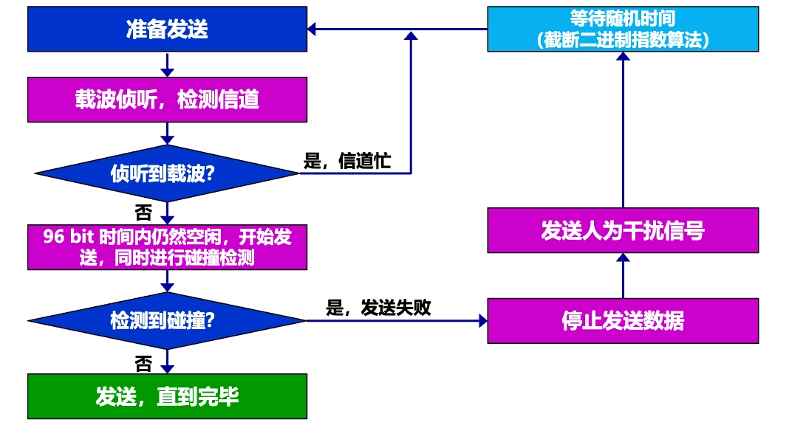

1. 站点 A 要发送数据，首先监听信道。
	- 若信道忙，则继续监听，直到信道空闲为止。
2. 若信道空闲，则站点 A 等待一个帧间最小间隔（96 比特时间），然后开始发送数据帧。
	- 若等待过程中信道变为忙，则重新进行退避。
3. 若等待时间结束后信道仍然空闲，则开始发送数据帧，并在发送过程中继续监听信道。
	- 若在发送过程中检测到碰撞，则立即停止发送，并发送人为干扰信号
	- 人为干扰信号发送完毕后，站点 A 立即进行退避。
	- 退避时间结束后，重新开始监听信道等待空闲、等待帧间最小间隔、发送数据帧的过程。

### 使用集线器的星形拓扑

- 传统以太网传输媒体：粗同轴电缆 $\to$ 细同轴电缆 $\to$ 双绞线
	- 采用粗同轴电缆的以太网采用总线形拓扑结构。
		

	- 采用双绞线的以太网采用星形拓扑。
		

		- 在星形的中心则增加了一种可靠性非常高的设备，叫做集线器（hub）。
		- 每个站到集线器的距离不超过 $100~m$。
- 星形以太网 **10BASE-T**
	- 10：速率为 10 Mbit/s
	- BASE：基带传输
	- T：传输介质为双绞线
- 集线器特点
	- 使用电子器件来模拟实际电缆线的工作，因此整个系统仍然像一个传统的以太网那样运行。
	- 使用集线器的以太网在**逻辑上仍是一个总线网**，各工作站使用的还是 CSMA/CD 协议，并共享逻辑上的总线。
	- 很像一个多接口的转发器，**工作在物理层**。
	- 采用了专门芯片，进行自适应串音回波抵消，减少了近端串音。
- 具有 3 个接口的集线器
	

### 以太网的信道利用率

- 多个站在以太网上同时工作就可能会发生碰撞，导致以太网总的信道利用率并不能达到 100%。
- 假设：单程端到端传播时延 $= \tau$，则争用期长度 $= 2\tau$。检测到碰撞后不发送干扰信号。
	- 设帧长  $= L~(bit)$，数据发送速率 $= C~(bit/s)$，则帧的发送时间 $T_{0} = L/C~(s)$。
	- 以太网信道被占用的情况下，成功发送一个帧需要占用信道的时间 $=T_0 + \tau$
		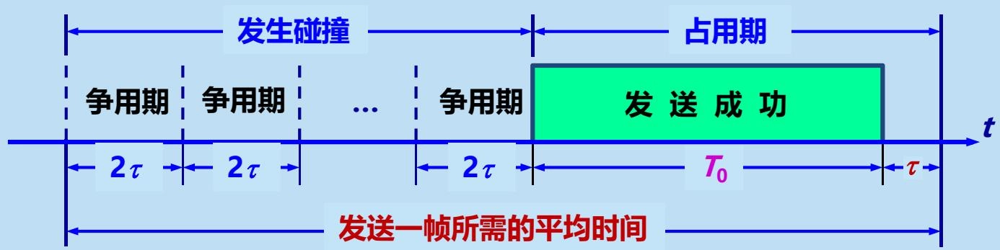

- 定义参数 $a$ 为以太网单程端到端时延  $\tau$  与帧的发送时间  $T_{0}$  之比：

	$$
	a = \tau / T _ {0}
	$$

	- 为提高利用率，以太网的参数 $a$ 的值应当尽可能小些。
		- 当数据率一定时，以太网的连线的长度受到限制，否则  $\tau$  的数值会太大。
		- 以太网的帧长不能太短，否则  $T_{0}$  的值会太小。
- 定义信道利用率的最大值 $S_{\max}$ 为：

	$$
	S _ {\max } = \frac {T _ {0}}{T _ {0} + \tau} = \frac {1}{1 + a}
	$$

	- 只有当参数 $a \ll 1$ 才能得到尽可能高的极限信道利用率。
	- $S \geq 30\%$  时就已经处于重载的情况，此时很多网络容量被碰撞消耗掉了。

### 以太网的 MAC 层
#### MAC 层的硬件地址

- 定义：局域网中每个适配器固化在 ROM 中的**全球唯一的** 48 位硬件地址，又称为**物理地址/MAC 地址**。
- 48 位 MAC 地址组成（EUI-48）
	- **组织唯一标识符** OUI（Organizationally Unique Identifier）：前 3 个字节（即高 24 位），由 IEEE 注册管理机构 RA 负责向厂家分配
	- **扩展唯一标识符** （Extension Identifier）：后 3 个字节（即低 24 位），由厂家自行分配
	- 单站地址，组地址，广播地址
		- IEEE 规定地址字段的第 1 字节的最低位为 I/G（Individual/Group）位。
		- **单站地址**：I/G 位 = 0。
		- **组地址**：I/G 位 = 1。组地址用来进行多播。
		- **广播地址**：所有 48 位都为 1（全 1）。只能作为目的地址使用。
	- 全球管理与本地管理
		- IEEE 把地址字段第 1 字节的最低第 2 位规定为 G/L（Global/Local）位。
		- **全球管理**：G/L 位 = 0。厂商向 IEEE 购买的 OUI 都属于全球管理。
		- **本地管理**：G/L 位 = 1。这时用户可任意分配网络上的地址。
- 适配器具有**过滤功能**
	- 每收到一个 MAC 帧，先用硬件检查帧中的 MAC 地址。
	- 如果是发往本站的帧则收下，然后再进行其他的处理。
		- “发往本站的帧”包括以下 3 种帧：
			- 单播（unicast）帧（一对一）
			- 广播（broadcast）帧（一对全体）
			- 多播（multicast）帧（一对多）
	- 否则就将此帧丢弃，不再进行其他的处理。
		- **混杂方式**（promiscuous mode）除外：此时以太网适配器只要“听到”有帧在以太网上传输就都接收下来。

#### MAC 帧的格式

- 常用的以太网 MAC 帧格式有 2 种标准：
	1. DIX Ethernet V2 标准：数据链路层仅包含 MAC 子层
	2. IEEE 的 802.3 标准：数据链路层包含 MAC 子层和 LLC 子层
- DIX Ethernet V2 帧格式（最常用）
	

	- 由硬件在帧的前面插入 8 字节。
		- **前同步码**：前 7 字节，用于调整接收端的时钟周期使其与发送端一样。
		- **帧开始定界符**：1 字节，表示后面的信息就是 MAC 帧。
	- 有效的 MAC 帧长度为 64~1518 字节之间。
		- **目的地址字段**：6 字节，表示接收站的 MAC 地址。
		- **源地址字段**：6 字节，表示发送站的 MAC 地址。
		- **类型字段**：2 字节，用来标志上一层使用的是什么协议，以便把收到的 MAC 帧的数据部分交给相应的协议处理。
		- **数据字段/MAC 客户数据字段**：46~1500 字节，当数据字段的长度小于 46 字节时，应在数据字段的后面加入整数字节的填充字段，以保证以太网的 MAC 帧长不小于 64 字节（**最短帧长**）。
		- **帧校验序列** FCS：4 字节，用来对 MAC 帧进行差错检测。
- IEEE 802.3 MAC 帧格式
	

	- IEEE 802.3 标准的 MAC 帧格式与以太网 V2 的 MAC 帧格式的区别主要在于“长度/类型”字段。
		- 当“长度/类型”字段值大于 `0x0600` 时，表示“类型”。
		- 当“长度/类型”字段值小于 `0x0600` 时，表示“长度”，数据字段必须装入逻辑链路控制 LLC 子层的 LLC 帧。
		- 在 802.3 标准的文档中，MAC 帧格式包括了 8 字节的前同步码和帧开始定界符。
	- 现在市场上流行的都是以太网 V2 的 MAC 帧，但大家也常常把它称为 IEEE 802.3 标准的 MAC 帧。
- 无效的 MAC 帧
	- 检查标准
		- 数据字段的长度与长度字段的值不一致
		- 帧的长度不是整数个字节
		- 用收到的帧检验序列 FCS 查出有差错
		- 数据字段的长度不在 46~1500 字节之间
	- 处理原则
		- 简单丢弃（以太网不负责重传丢弃的帧）

## 扩展的以太网

- 常见网络设备
	- **中继器**（Repeater）
		- 物理层设备
		- 作用：**两个网络节点之间物理信号的双向转发工作**。
		- 功能：按位传递信息，完成信号的复制、调整和放大功能，以此来延长网络的长度。
		- 总结：中继器就是简单的信号放大器，信号在传输的过程中是要衰减的，中继器的作用就是将信号放大，使信号能传的更远。
	- **集线器**（Hub）
		- 物理层设备
		- 作用：**连接多个网络节点，形成一个网络段**，也称为**多口中继器**。
		- 总结：集线器就是多端口的中继器，把每个输入端口的信号放大再发到别的端口去，可以实现多台计算机之间的互联。
	- **网桥**（Bridge）
		- 数据链路层设备
		- 作用：**有选择地将现有地址的信号从一个传输介质发送到另一个传输介质**，并能有效地限制两个介质系统中无关紧要的通信。
		- 总结：网桥工作在数据链路层，将两个 LAN 连起来，根据 MAC 地址来转发帧，可以看作一个“低层的路由器”。
	- **交换机**（Switch）
		- 数据链路层设备
		- 作用：**在多个端口之间交换数据帧**，实现局域网内的通信。
		- 功能：能分辨出帧中的源 MAC 地址和目的 MAC 地址，因此可以在任意两个端口间建立联系，在数据帧的始发者和目标接收者之间建立临时的交换路径。
		- 特点：
			- 使用硬件来完成过滤、学习和转发任务，速度快，性能高。
			- **交换机中有一张 MAC 地址表，如果知道目标地址在何处，就把数据发送到指定地点，如果它不知道就发送到所有的端口**。
		- 总结：交换机可以理解为高级的网桥，他有网桥的功能，但性能比网桥强。差别就在于交换机常常用来连接独立的计算机，而网桥连接的目标是 LAN，所以交换机的端口比网桥多。
	- **路由器**（Router）
		- 网络层设备
		- 作用：使用专门的软件协议从逻辑上对整个网络进行划分，检查数据包 IP 地址，并根据路由表或路由算法决定将数据包发送到何处。
		- 总结：路由器的主要工作就是为经过路由器的每个 IP 数据包寻找一条最佳传输路径，并将该数据有效地传送到目的站点。路由器的基本功能是，把数据（IP 报文）传送到正确的网络。
	- **网关**（Gateway）/网间连接器/协议转换器
		- 网络层及以上设备
		- 作用：**连接两个高层协议不同的网络**，并在它们之间进行协议转换，从而实现互联。
		- 总结：网关是连接两个不同网络的接口，比如局域网的共享上网服务器就是局域网和广域网的接口。
- 碰撞域
	- 碰撞域（collision domain）又称为冲突域，指网络中一个站点发出的帧会与其他站点发出的帧产生碰撞或冲突的那部分网络。
	- 碰撞域越大，发生碰撞的概率越高。
	- 示意图：
		

### 在物理层扩展以太网

- 使用光纤扩展
	

	- 主机使用光纤和一对光纤调制解调器连接到集线器
- 使用集线器扩展
	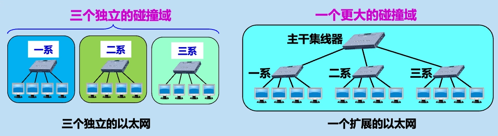

	- 优点
		1. 使原来属于不同碰撞域（冲突域）的计算机能够跨碰撞域通信。
		2. 扩大了以太网覆盖的地理范围。
	- 缺点
		1. 碰撞域增大了，总的吞吐量未提高。
		2. 如果使用不同的以太网技术（如数据率不同），那么就不能用集线器将它们互连起来。

### 在数据链路层扩展以太网

- 更为常用。早期使用网桥，现在使用以太网交换机。
	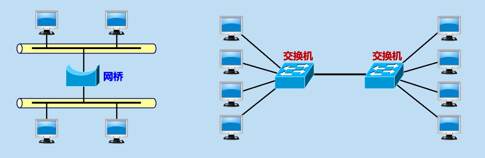

- 网桥
	- 工作在数据链路层。
	- 根据 MAC 帧的目的地址对收到的帧进行转发和过滤。或者转发，或者丢弃。
- 交换机
	- 工作在数据链路层。
	- 多端口的网桥。
	- 可明显地提高以太网的性能。

#### 以太网交换机

- 以太网交换机的特点
	- 实质上是一个**多接口网桥**：通常有十几个或更多的接口。
	- 每个接口都直接与一个单台主机或另一个以太网交换机相连，并且一般都工作在**全双工**方式。
	- 以太网交换机具有**并行性**。
		- 能同时连通多对接口，使多对主机能同时通信。
		- 相互通信的主机都独占传输媒体，无碰撞地传输数据。
		- **每一个端口和连接到端口的主机构成了一个碰撞域，相当于将碰撞域隔离**。
			

	- 接口有存储器。
	- 即插即用。其内部的**帧交换表**（又称为地址表）是通过**自学习算法**自动地逐渐建立起来的。这种交换表就是一个内容可寻址存储器 CAM（Content addressable Memory）。
	- 使用专用的交换结构芯片，用硬件转发，其转发速率要比使用软件转发的网桥快很多。
- 以太网交换机的优点：**每个用户独享带宽，增加了总容量**
	

- 以太网交换机的交换方式
	- 存储转发方式
		- 把整个数据帧先缓存，再进行处理。
	- 直通（cut-through）方式
		- 接收数据帧的同时立即按数据帧的目的 MAC 地址决定该帧的转发接口。
		- 缺点：不检查差错就直接将帧转发出去，有可能转发无效帧。

#### 以太网交换机的自学习功能

- 这种自学习方法使得以太网交换机能够即插即用，不必人工进行配置。
- **交换机自学习和转发帧的步骤**：
	

	1. 交换机接收到一个数据帧后，首先检查该帧的源 MAC 地址。
	2. 交换机在其帧交换表中查找该源 MAC 地址。
		- 如果找不到该地址，则将该源 MAC 地址和接收该帧的接口号一起加入到帧交换表中。
		- 如果找到了该地址，则更新该地址对应的接口号为接收该帧的接口号。
	3. 交换机检查该帧的目的 MAC 地址。
		- 如果找不到该地址，则将该帧复制到除接收该帧的接口外的所有接口上。
		- 如果找到了该地址，则将该帧转发到该地址对应的接口上。（若与源地址对应的接口号相同，则丢弃该帧）
- 示例：
	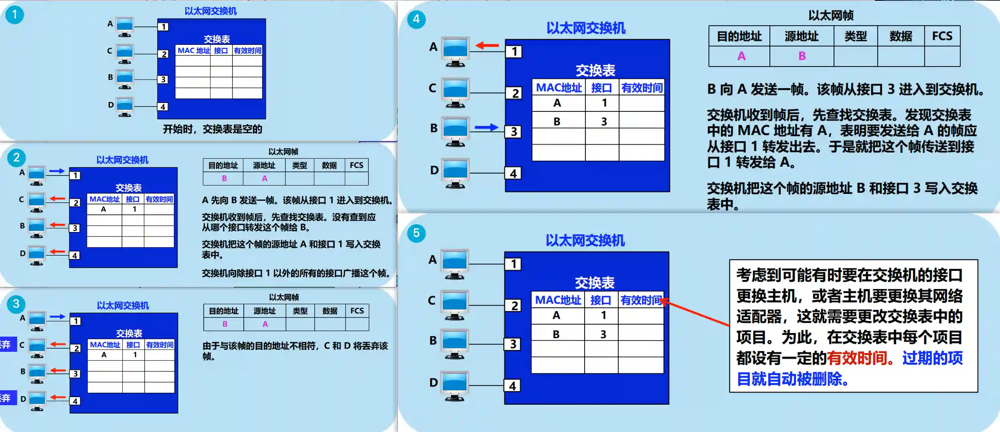
	

- 存在的问题：回路
	

	- 消除回路：使用**生成树协议**（STP，Spanning Tree Protocol），不改变网络的实际拓扑，但在逻辑上则切断某些链路，使得从一台主机到所有其他主机的路径是无环路的树状结构，从而消除了兜圈子现象。

#### 从总线以太网到星形以太网

- 早期
	- 采用无源的总线结构。
	- 使用 CSMA/CD 协议，以半双工方式工作。
- 现在
	- 以太网交换机为中心的星形结构。
	- 不使用共享总线，没有碰撞问题，不使用 CSMA/CD 协议，以全双工方式工作。
	- 但仍然采用以太网的帧结构。

### 虚拟局域网
#### 以太网存在的主要问题

- 广播风暴
	- 一个以太网是一个广播域（broadcast domain）：其中任何一台设备发出的广播通信都能被该部分网络中的所有其他设备所接收。
	- 交换机之间的冗余链路形成广播风暴。
- 安全问题
	- **交换机每个接口都处于一个独立的碰撞域（或冲突域）中，但所有计算机都处于同一个广播域中**。
	- 任何一台计算机发出的广播帧都能被该局域网内的所有计算机接收。
- 管理困难

#### 虚拟局域网 VLAN

- 利用以太网交换机可以很方便地实现虚拟局域网 VLAN（Virtual LAN）。
- IEEE 802.1Q 对虚拟局域网 VLAN 的定义：虚拟局域网 VLAN 是由一些局域网网段构成的**与物理位置无关的逻辑组**，而这些网段具有某些共同的需求。每一个 VLAN 的帧都有一个明确的标识符，指明发送这个帧的计算机是属于哪一个 VLAN。
- 虚拟局域网其实只是局域网给用户提供的一种服务，并不是一种新型局域网。
- 说明：
	- 示意图
		

	- 10 台计算机划分为三个虚拟局域网：VLAN1，VLAN2 和 VLAN3。
	- 每个虚拟局域网是一个独立的广播域：VLAN1，VLAN2 和 VLAN3 是三个不同的广播域。
	- 当 B1 向 VLAN2 工作组内成员发送数据时，工作站 B2 和 B3 将会收到其广播的信息，而 VLAN1 和 VLAN3 的成员 A1，A2，A3，C1，C2 和 C3 则不会收到该信息。
	- 虚拟局域网限制了接收广播信息的工作站数，使得网络不会因传播过多的广播信息（即“广播风暴”）而引起性能恶化。
- 虚拟局域网优点
	1. 改善了性能
	2. 简化了管理
	3. 降低了成本
	4. 改善了安全性

#### 划分虚拟局域网的方法

- **基于交换机端口**
	- 最简单、也是最常用的方法。
	- 属于在第 1 层划分虚拟局域网的方法。
	- 缺点：不允许用户移动。
- **基于计算机网卡的 MAC 地址**
	- 根据用户计算机的 MAC 地址划分虚拟局域网。
	- 属于在第 2 层划分虚拟局域网的方法。
	- 允许用户移动。
	- 缺点：需要输入和管理大量的 MAC 地址。如果用户的 MAC 地址改变了，则需要管理员重新配置 VLAN。
- **基于协议类型**
	- 根据以太网帧的第三个字段“类型”确定该类型的协议属于哪一个虚拟局域网。
	- 属于在第 2 层划分虚拟局域网的方法。
- **基于 IP 子网地址**
	- 根据以太网帧的第三个字段“类型”和 IP 分组首部中的源 IP 地址字段确定该 IP 分组属于哪一个虚拟局域网。
	- 属于在第 3 层划分虚拟局域网的方法。
- **基于高层应用或服务**
	- 根据高层应用或服务、或者它们的组合划分虚拟局域网。
	- 更加灵活，但更加复杂。

#### 虚拟局域网使用的以太网帧格式

- 标准以太网帧插入 4 字节的 VLAN 标记后变成了 802.1Q 帧（或带标记的以太网帧）
	- 目的地址：6 字节
	- 源地址：6 字节
	- **VLAN 标记/802.1Q 标记**：4 字节
		- **TPID**（Tag Protocol Identifier）：2 字节，值为 `0x8100`，表示这是一个带 VLAN 标记的以太网帧。
		- **标记控制信息** TCI（Tag Control Information）：2 字节
			- **优先级字段**（Priority）：3 位，表示帧的优先级。
			- **规范格式指示符** CFI（Canonical Format Indicator）：1 位，表示 MAC 地址的格式。
			- **VLAN ID**：12 位，表示 VLAN 的标识符，范围为 0~4095，其中 0 和 4095 保留不用，实际可用的 VLAN ID 为 1~4094。 
	- 类型/长度：2 字节
	- 数据字段：46~1500 字节
	- 帧校验序列 FCS：4 字节
- 最大帧长：
	- 标准以太网帧的最大长度为 1518 字节。
	- 带 VLAN 标记的以太网帧的最大长度为 1522 字节。 

## 高速以太网
### 100BASE-T 以太网

- 定义：在双绞线上以星形拓扑结构传输 100 Mbit/s 的基带信号的以太网，又称为快速以太网（Fast Ethernet）。
	- 1995 定为正式标准：IEEE 802.3u。
- 特点：
	1. 在半双工方式下使用 CSMA/CD 协议，而在全双工方式不使用 CSMA/CD 协议。
	2. 使用 IEEE 802.3 协议规定的 MAC 帧格式。
	3. 保持最短帧长不变，但将一个网段的最大电缆长度减小到 100 米。
	4. 帧间时间间隔从原来的 $9.6~\mu s$ 改为现在的 $0.96~\mu s$。
- 物理层标准：

	|名称|媒体|网段最大长度|特点|
	|---|---|---|---|
	|100BASE-TX|铜缆|100 m|2 对 UTP 5 类线或屏蔽双绞线 STP|
	|100BASE-T4|铜缆|100 m|4 对 UTP 3 类线或 5 类线|
	|100BASE-FX|光缆|2000 m|2 根光纤，发送和接收各用一根|

### 吉比特以太网

- 定义：在双绞线上或光纤上传输 1 Gbit/s 的基带信号的以太网，又称为千兆以太网（Gigabit Ethernet）。
	- 1998 定为正式标准：IEEE 802.3z 和 IEEE 802.3ab。
- 特点：
	1. 允许在 1 Gbit/s 下以全双工和半双工 2 种方式工作。
	2. 在半双工方式下使用 CSMA/CD 协议，而在全双工方式不使用 CSMA/CD 协议。
	3. 使用 IEEE 802.3 协议规定的 MAC 帧格式。
	4. 与 10BASE-T 和 100BASE-T 技术向后兼容。
- 物理层标准：
	- 使用 2 种成熟的技术：一种来自现有的以太网，另一种则是美国国家标准协会 ANSI 制定的光纤通道 FC（Fiber Channel）。

	|名称|媒体|网段最大长度|特点|
	|---|---|---|---|
	|1000BASE-SX|光缆|550 m|多模光纤（50 和 62.5 μm）|
	|1000BASE-LX|光缆|5000 m|单模光纤（10 μm）多模光纤（50 和 62.5 μm）|
	|1000BASE-CX|铜缆|25 m|使用 2 对屏蔽双绞线电缆 STP|
	|1000BASE-T|铜缆|100 m|使用 4 对 UTP 5 类线|

-  半双工方式工作的吉比特以太网
	- 半双工时采用 CSMA/CD，必须进行碰撞检测。
	- 为保持 64 字节最小帧长度，以及 100 米的网段的最大长度，增加了 2 个功能：
		1. **载波延伸**（carrier extension）：将争用时间增大为 512 字节。凡发送的 MAC 帧长不足 512 字节时，就用一些特殊字符填充在帧的后面。
			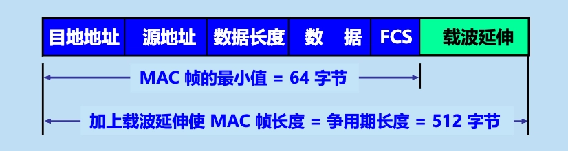

		2. **分组突发**（packet bursting）：当很多短帧要发送时，第 1 个短帧采用载波延伸方法进行填充，随后的一些短帧则可一个接一个地发送，只需留有必要的帧间最小间隔即可。这样就形成了一串分组的突发，直到达到 1500 字节或稍多一些为止，从而提高了信道利用率。
			

### 10 吉比特以太网（10GE）和更快的以太网

- 定义：在双绞线上或光纤上传输 10 Gbit/s 的基带信号的以太网。
	- 2002 年定为正式标准：IEEE 802.3ae。
- 10 吉比特以太网（10GE）主要特点：
	1. 与 10、100 Mbit/s 和 1 Gbit/s 以太网的帧格式完全相同。
	2. 保留了 IEEE 802.3 标准规定的以太网最小和最大帧长。
	3. 只使用光纤作为传输媒体。
	4. **只工作在全双工方式**，没有争用问题，不使用 CSMA/CD 协议。

- 10GE 以太网的物理层标准

	|名称|媒体|网段最大长度|特点|
	|---|---|---|---|
	|10GBASE-SR|光缆|300 m|多模光纤（0.85 μm）|
	|10GBASE-LR|光缆|10 km|单模光纤（1.3 μm）|
	|10GBASE-ER|光缆|40 km|单模光纤（1.5 μm）|
	|10GBASE-CX4|铜缆|15 m|使用 4 对双芯同轴电缆（twinax）|
	|10GBASE-T|铜缆|100 m|使用 4 对 6A 类 UTP 双绞线|

- 40GE/100GE 以太网的物理层标准

	|物理层|40GE|100GE|
	|---|---|---|
	|在背板上传输至少超过 1 m|40GBASE-KR4|100GBASE-KR4|
	|在铜缆上传输至少超过 7 m|40GBASE-CR4|100GBASE-CR10|
	|在多模光纤上传输至少 100 m|40GBASE-SR4|100GBASE-SR10，*100GBASE-SR4|
	|在单模光纤上传输至少 10 km|40GBASE-LR4|100GBASE-LR4|
	|在单模光纤上传输至少 40 km|*40GBASE-ER|100GBASE-ER4|

- 端到端的以太网传输
	- 以太网的工作范围已经扩大到城域网和广域网，实现了端到端的以太网传输。
	- 优点：
		1. 技术成熟。
		2. 互操作性很好。
		3. 在广域网中使用以太网时价格便宜。
		4. 采用统一的以太网帧格式，简化了操作和管理。

### 使用以太网进行宽带接入

- IEEE 在 2001 年初成立了 802.3 EFM 工作组，专门研究高速以太网的宽带接入技术问题。
- 以太网宽带接入具有以下特点：
	1. 可以提供**双向**的宽带通信。
	2. 可以根据用户对带宽的需求灵活地进行带宽升级。
	3. 可以实现端到端的以太网传输，中间不需要再进行帧格式的转换。
	4. 但不支持用户身份鉴别。
- PPPoE
	- PPPoE（PPP over Ethernet）：在以太网上运行 PPP。
	- 将 PPP 帧封装到以太网中来传输。
	- 现在的光纤宽带接入 FTTx 都要使用 PPPoE 的方式进行接入。
	- 利用 ADSL 进行宽带上网时，从用户个人电脑到家中的 ADSL 调制解调器之间的连接也使用 RJ-45 和 5 类线，也使用 PPPoE。