# 网络层

- [Back to Course Home](index.md)

## 网络层基本概念
**网络层的功能**：屏蔽不同网络的差异性，实现网络互连与数据转发。

### 网络层提供的两种服务 

- 争论：

	- 网络层应该向运输层提供怎样的服务？面向连接还是无连接？

	- 在计算机通信中，可靠交付应当由谁来负责？是网络还是端系统？

- 两种观点：

	- 面向连接的可靠交付。

	- 无连接的、尽最大努力交付的数据报服务，不提供服务质量的承诺。

#### 虚电路服务

- 基本思路：模仿电信网络的设计思想，**由网络层提供面向连接的可靠通信服务**。通信之前先建立虚电路 VC（Virtual Circuit），即逻辑连接，以保证双方通信所需的一切网络资源。
	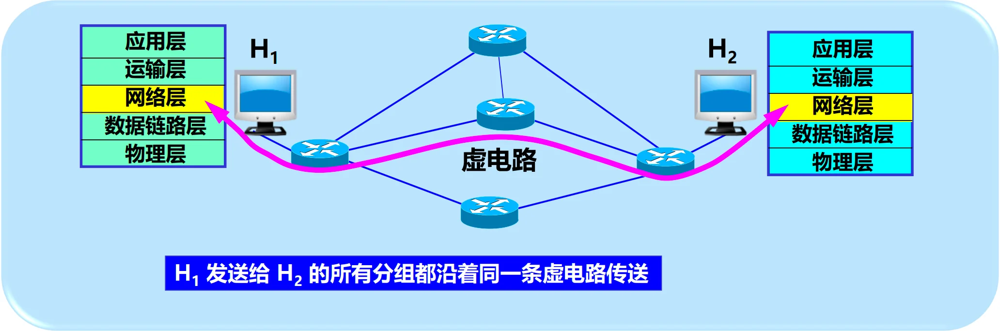

- 如果使用可靠传输的网络协议，可使所发送的分组无差错按序到达终点，不丢失、不重复，即 **由网络层负责可靠的通信**。

#### 数据报服务

- 基本思路：模仿邮政系统的设计思想，**由网络层提供简单灵活的、无连接的、尽最大努力交付的数据报服务**。通信之前不需要建立连接，分组独立发送。
	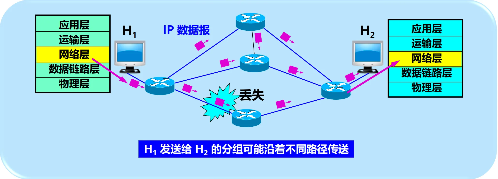

- 网络层不提供服务质量的承诺。即所传送的分组可能出错、丢失、重复和失序（不按序到达终点），也不保证分组传送的时限，而是 **由主机中的运输层负责可靠的通信**。

#### 虚电路服务与数据报服务的对比

| 对比的方面 | 虚电路服务 | 数据报服务 |
| --- | --- | --- |
| 思路 | 可靠通信应当由网络来保证 | 可靠通信应当由用户主机来保证 |
| 连接的建立 | 必须有 | 不需要 |
| 终点地址 | 仅在连接建立阶段使用，每个分组使用短的虚电路号 | 每个分组都有终点的完整地址 |
| 分组的转发 | 属于同一条虚电路的分组均按照同一路由进行转发 | 每个分组独立选择路由进行转发 |
|当结点出故障时|所有通过出故障的结点的虚电路均不能工作|出故障的结点可能会丢失分组，一些路由可能会发生变化|
|分组的顺序|总是按发送顺序到达终点|到达终点时不一定按发送顺序|
|端到端的差错处理和流量控制|可以由网络负责，也可以由用户主机负责|由用户主机负责|

### 网络层的两个层面
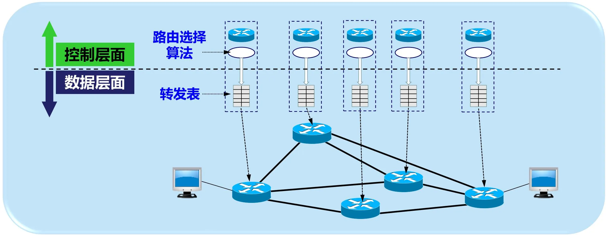

- 在路由器之间传送的信息有以下 2 大类：

	- 数据

	- 路由信息（为数据传送服务）

- 网络层可分为两个层面：

	1. **控制层面**（control plane）

		- 根据路由选择协议所用的路由算法计算路由，创建出本路由器的 **路由表**。

		- 许多路由器协同工作

		- 采用软件计算，速度较慢

	2. **数据层面**（data plane，也称为转发层面 forwarding plane）

		- 路由器根据本路由器生成的 **转发表**，把收到的分组从查找到的对应接口转发出去

		- 各个路由器独立工作

		- 采用硬件进行转发，速度较快

- 软件定义网络 SDN（Software Defined Network）
	

	- 远程控制器：计算出最佳的路由，在每一个路由器中生成其正确的转发表。

	- 路由器：查找转发表，转发分组。

	> 详见[下文](#sdn)

## 网际协议 IP


- 与网际协议 IPv4 配套的 3 个协议：

	- 地址解析协议 ARP（Address Resolution Protocol）

	- 网际控制报文协议 ICMP（Internet Control Message Protocol）

	- 网际组管理协议 IGMP（Internet Group Management Protocol）

- 采用 **无连接的、尽最大努力交付的数据报服务**。

### 虚拟互连网络

- 使用 **中间设备** 进行互连

	|层|中间设备|是否属于网络互连|
	|---|---|---|
	|运输层及以上|网关（gateway）|是|
	|网络层|路由器（router）|是|
	|数据链路层|网桥或桥接器（bridge），交换机（switch）|否，仅把一个网络扩大，仍是一个网络|
	|物理层|转发器（repeater）|否，仅把一个网络扩大，仍是一个网络|

- 互连网络与虚拟互连网络
	

- IP 网的意义

	- 当互联网上的主机进行通信时，就好像在一个网络上通信一样，看不见互连的各具体的网络异构细节

	- 如果在这种覆盖全球的 IP 网上层使用 TCP、UDP 协议，那么就是现在的互联网（Internet）

- 分组在虚拟互连网络中的传送
	
	

### IP 地址
在 TCP/IP 体系中，IP 地址是一个最基本的概念，没有 IP 地址就无法和网上的其他设备进行通信。

#### IP 地址及其表示方法
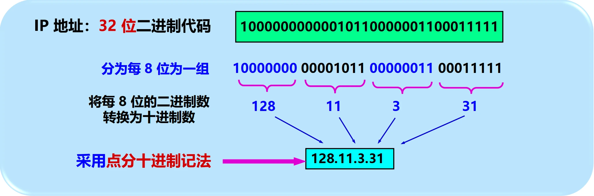

- **点分十进制记法**：

	- IP 地址：32 位二进制代码

	- 分组：每 8 位为一组，将二进制数转换为十进制数

	- 用 `.` 分隔开来，形成 4 个十进制数

- 互联网上的每台主机（或路由器）的 **每个接口** 分配一个在 **全世界唯一** 的 IP 地址，由互联网名字和数字分配机构 ICANN（Internet Corporation for Assigned Names and Numbers）进行分配

	- IP 地址在整个互联网范围内是唯一的

	- IP 地址指明了连接到某个网络上的一个主机

#### 分类的 IP 地址

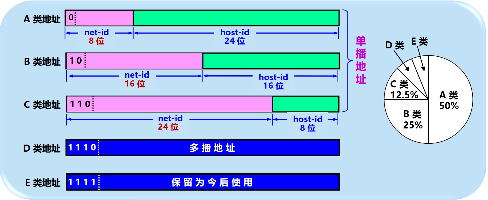

- 定义：IP 地址采用 2 级结构

	- **IP 地址 = {<网络号>，<主机号>}**

	- 网络号（net-id）：$n$ 位

	- 主机号（host-id）：$32-n$ 位

- 将 IP 地址分为 5 类：A、B、C、D、E 类

	| 类别 | 网络号位数 | 主机号位数 | 地址范围 | 用途 |
	| --- | --- | --- | --- | --- |
	| **A 类** | 8 | 24 | `1.0.0.0` - `126.255.255.255` | 单播 |
	| **B 类** | 16 | 16 | `128.0.0.0` - `191.255.255.255` | 单播 |
	| **C 类** | 24 | 8 | `192.0.0.0` - `223.255.255.255` | 单播 |
	| **D 类** |  |  | `224.0.0.0` - `239.255.255.255` | 多播 |
	| **E 类** |  |  | `240.0.0.0` - `255.255.255.255` | 保留 |

- 一般不使用的特殊的 IP 地址

	|网络号|主机号|源地址使用|目的地址使用|代表的意思|
	|---|---|---|---|---|
	|0|0|可以|不可|在本网络上的本主机（见 6.6 节 DHCP 协议）|
	|0|X|可以|不可|在本网络上主机号为 X 的主机|
	|全 1|全 1|不可|可以|只在本网络上进行广播（各路由器均不转发）|
	|Y|全 1|不可|可以|对网络号为 Y 的网络上的所有主机进行广播|
	|127|非全 0 或全 1 的任何数|可以|可以|用于本地软件环回测试|

- 划分子网

	- 目的：更有效地利用 IP 地址资源

	- 方法：将原来的 **主机号** 进一步划分为 **子网号**（subnet-id）和 **主机号**（host-id）

	- **子网 IP 地址 = {<网络号>，<子网号>，<主机号>}**

- 分类的 IP 地址的优缺点

	- 优点：

		- 管理简单

		- 使用方便

		- 转发分组迅速

		- 划分子网，灵活地使用

	- 缺点：

		- 大地址块，浪费地址资源

		- 即使采用划分子网的方法，也无法解决 IP 地址枯竭的问题 

#### 无分类编址 CIDR

- CIDR（Classless Inter-Domain Routing）：无分类域间路由选择。

- 定义：IP 地址采用 2 级结构

	- **IP 地址 = {<网络前缀>，<主机号>}**

	- 网络前缀（network prefix）：$n$ 位，$n$ 不固定，可以在 $0 \sim 32$ 之间选取任意值。

	- 主机号（host-id）：$32-n$ 位

- CIDR 记法：**斜线记法**（slash notation）

	- 形式：`a.b.c.d/n`：二进制 IP 地址的前 n 位是网络前缀。

	- 示例：`128.14.35.7/20`：前 20 位是网络前缀。

- 地址块

	- 定义：CIDR 把网络前缀都相同的所有连续的 IP 地址组成一个 CIDR 地址块。

	- **网络地址**（network address）：

		- 定义：CIDR 地址块中主机号全 0 的 IP 地址称为该地址块的网络地址。

		- 作用：用于区分不同的 CIDR 地址块。

	- 一个 CIDR 地址块包含的 IP 地址数目，取决于网络前缀的位数。

		- 若网络前缀为 $n$ 位，则该地址块中 **包含的 IP 地址数目** 为 $2^{32-n}$ 个，**可指派给主机使用的地址数目** 为 $2^{32-n}-2$ 个

			- 主机号全 0 为子网的网络地址（即该子网的 “标识地址”），用于区分不同子网，不能分配给主机使用。

			- 主机号全 1 为广播地址，不能分配给主机使用。

		- 网络前缀越短，地址块所包含的地址数越多。

	- 示例：

		- `123.45.67.8/24`：是 IP 地址，同时指明了网络前缀为 24 位（3 字节）。该地址是 `123.45.67.0/24` 地址块中的一个地址。

		- `123.45.67.0/24`：是包含有多个 IP 地址的地址块，同时也是这个地址块中主机号为全 0 的 IP 地址。

		- `123.45.67.8`：是 IP 地址，但未指明网络前缀长度，不知道其网络地址。

		- `123.45.67.0`：不能指明一个网络地址，因为无法知道网络前缀是多少。

- **地址掩码/子网掩码**（address mask/subnet mask）

	- 定义：用于指明网络前缀长度的 32 位二进制数，由一连串 1 和接着的一连串 0 组成，1 的个数就是网络前缀的长度。

	- 作用：让机器从 IP 地址迅速算出网络地址。

	- 示例

		- `/20` 地址块的地址掩码：`11111111 11111111 11110000 00000000`

		- 点分十进制记法：`255.255.240.0`

		- CIDR 记法：`255.255.240.0/20`。

	- 默认地址掩码：分类的 IP 地址也可以视为 CIDR 地址块

		| 类别 | 默认地址掩码 | 说明 |
		| --- | --- | --- |
		| A 类地址 | `255.0.0.0` | 网络号占用 8 位，主机号占用 24 位 |
		| B 类地址 | `255.255.0.0` | 网络号占用 16 位，主机号占用 16 位 |
		| C 类地址 | `255.255.255.0` | 网络号占用 24 位，主机号占用 8 位 |

	- **网络地址 =（二进制的 IP 地址）AND（地址掩码）**

		- 示例：已知 IP 地址是 `128.14.35.7/20`。求网络地址。
			

- 构造超网：当子网掩码 1 的个数小于 24 时，CIDR 地址块都包含了多个 C 类地址（是一个 C 类地址的 $2^{n}$ 倍），因此在文献中有时称 CIDR 编址为“构造超网”。

- 私有 IP 地址

	- 定义：专门为局域网内部使用而保留的 IP 地址，不在互联网上使用。

	- 私有 IP 地址范围：

		| 类别 | 地址范围 | CIDR 表示法 |
		| --- | --- | --- |
		| A 类私有地址 | `10.0.0.0` - `10.255.255.255` | `10.0.0.0/8` |
		| B 类私有地址 | `172.16.0.0` - `172.31.255.255` | `172.16.0.0/12` |
		| C 类私有地址 | `192.168.0.0` - `192.168.255.255` | `192.168.0.0/16` |

- 三个特殊的 CIDR 地址块

	| 网络前缀长度 | 子网掩码 | 说明 |
	|---|---|---|
	| `/32` | `255.255.255.255` | 就是一个 IP 地址。这个特殊地址用于主机路由 |
	| `/31` | `255.255.255.254` | 只有两个 IP 地址，其主机号分别为 0 和 1。这个地址块用于点对点链路 |
	| `/0` | `0.0.0.0` | 同时 IP 地址也是全 0，即 `0.0.0.0/0`。用于默认路由 |

- 路由聚合（route aggregation）

	- 定义：把多个连续的 CIDR 地址块合并成一个更大的 CIDR 地址块的过程，称为路由聚合（也称为地址聚合 address aggregation 或超网汇总 supernetting）。

	- 作用：减小路由器转发表的长度。 

	- 示例：
		

- CIDR 地址块划分示例
	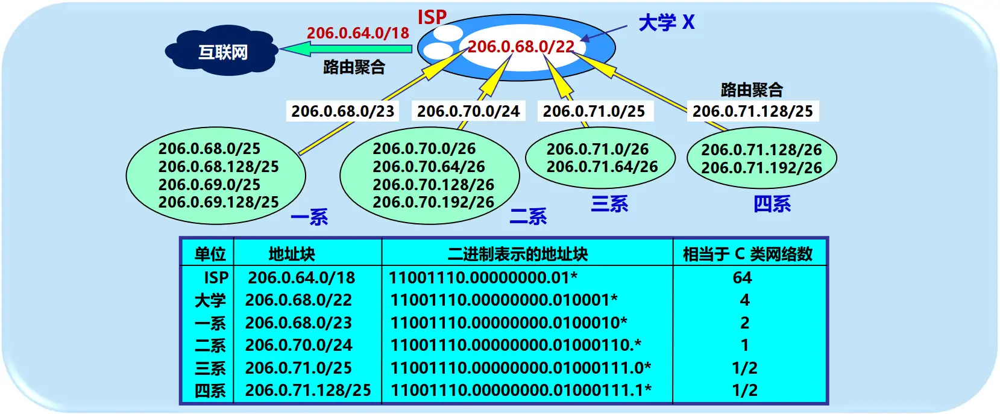

	- 这个 ISP 共有 64 个 C 类网络。如果不采用 CIDR 技术，则在与该 ISP 的路由器交换路由信息的每一个路由器的转发表中，需要有 64 行。采用地址聚合后，转发表中只需要用 1 行来指出到 `206.0.64.0/18` 地址块的下一跳。在 ISP 内的路由器的转发表中，也仅需用 `206.0.68.0/22` 这 1 个项目，就能把外部发送到这个大学各系的所有分组，都转发到大学的路由器。

#### IP 地址的特点

1. 每个 IP 地址都由网络前缀和主机号两部分组成（IP 地址是一种 **分等级** 的地址结构）。

	- 方便了 IP 地址的分配和管理。

	- 实现路由聚合，减小了转发表所占的存储空间，以及查找转发表的时间。

2. IP 地址是标志一台主机（或路由器）和一条链路的接口。

	- 当一台主机同时连接到两个网络上时，该主机就必须同时具有两个相应的 IP 地址，其网络号必须是不同的。这种主机称为多归属主机（multihomed host）。

	- 一个路由器至少应当连接到两个网络，因此一个路由器至少应当有两个不同的 IP 地址。

3. 转发器或交换机连接起来的若干个局域网仍为一个网络

	- 按照互联网的观点，**一个网络（或子网）是指具有相同网络前缀的主机的集合**。

	- 转发器或交换机连接起来的若干个局域网都具有同样的网络号，它们仍为一个网络。

	- **具有不同网络号的局域网必须使用路由器进行互连**。

4. 在 IP 地址中，所有分配到网络前缀的网络都是平等的。

	- 互联网同等对待每一个 IP 地址，不管是范围很小的局域网，还是可能覆盖很大地理范围的广域网

- 说明：

	- 同一个局域网上的主机或路由器的 IP 地址中的网络号必须一样。

	- 路由器的每一个接口都有一个不同网络号的 IP 地址。

	- 两个路由器直接相连的接口处，可指明也可不指明 IP 地址。如指明 IP 地址，则这一段连线就构成了一种只包含一段线路的特殊“网络”。这种网络 **仅需 2 个 IP 地址**，可以使用 `/31` 地址块。主机号可以是 0 或 1。

	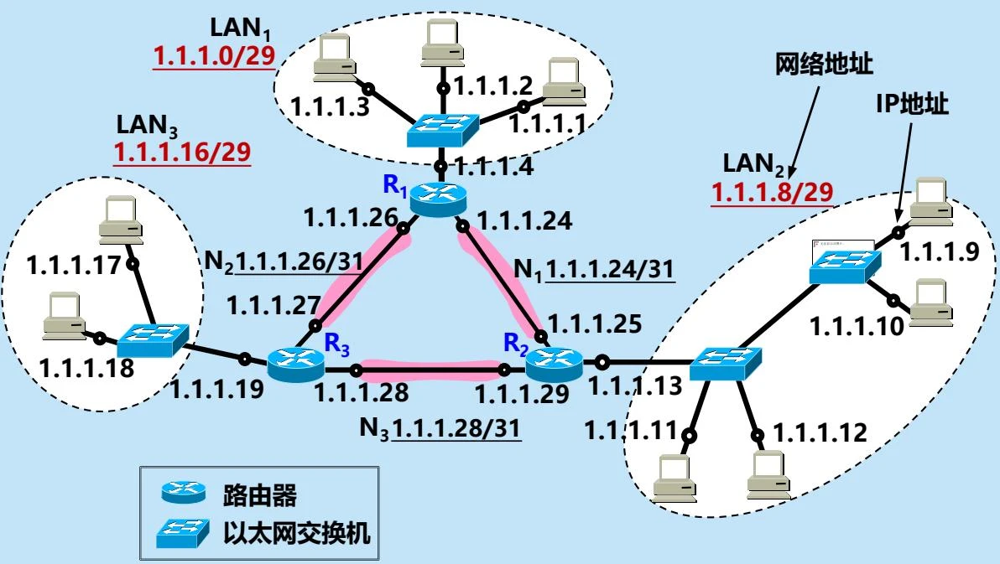

#### IP 地址与 MAC 地址
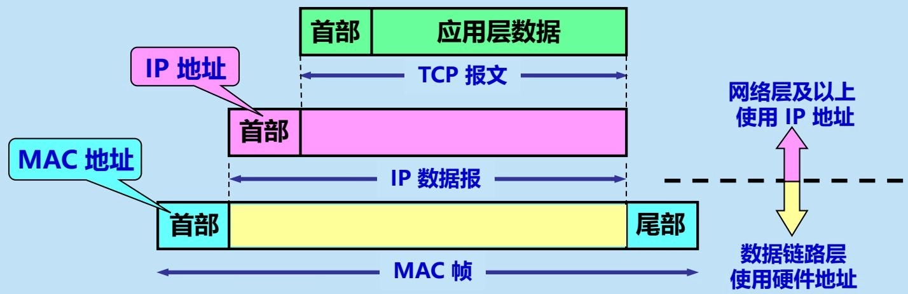

- IP 地址

	- 虚拟地址、软件地址、逻辑地址。

	- 网络层和以上各层使用。

	- 放在 IP 数据报的首部。

- MAC 地址

	- 固化在网卡上的 ROM 中。

	- 硬件地址、物理地址。

	- 数据链路层使用。

	- 放在 MAC 帧的首部。


- 不同层次、不同区间使用的源地址和目的地址
	<table>
	<tr>
	<td rowspan="2"></td>
	<td colspan="2">在网络层写入 IP 数据报首部的地址</td>
	<td colspan="2">在数据链路层写入 MAC 帧首部的地址</td>
	</tr>
	<tr><td>源地址</td><td>目的地址</td><td>源地址</td><td>目的地址</td></tr>
	<tr><td>H1→R1</td><td>IP1</td><td>IP2</td><td>MAC1</td><td>MAC3</td></tr>
	<tr><td>R1→R2</td><td>IP1</td><td>IP2</td><td>MAC4</td><td>MAC5</td></tr>
	<tr><td>R2→H2</td><td>IP1</td><td>IP2</td><td>MAC6</td><td>MAC2</td></tr>
	</table>

	- 尽管互连在一起的网络的 MAC 地址体系各不相同，但 IP 层抽象的互联网却 **屏蔽** 了下层这些很复杂的细节。

	- 只要我们在网络层上讨论问题，就能够使用统一的、抽象的 IP 地址研究主机和主机或路由器之间的通信。

### 地址解析协议 ARP

- 实现 IP 通信时使用了两个地址：

	1. IP 地址（网络层地址）

	2. MAC 地址（数据链路层地址）

- 地址解析协议 ARP（Address Resolution Protocol）：**用于从 IP 地址解析出 MAC 地址。**

#### ARP 高速缓存（ARP cache）

- ARP 维护一个高速缓存

	- 存放 IP 地址到 MAC 地址的映射表：

		- **映射表：<IP 地址；MAC 地址；生存时间（Age）；类型等>**

	- 使用 `arp -a` 查看。

	- 映射表动态更新（新增或超时删除）。

- ARP 高速缓存的作用

	- 存放最近获得的 IP 地址到 MAC 地址的绑定。

	- 减少 ARP 广播的通信量。

		- 主机 A 在发送其 ARP 请求分组时，就将自己的 IP 地址到 MAC 地址的映射写入自己的 ARP 高速缓存中。

		- 当主机 B 收到 A 的 ARP 请求分组时，就将主机 A 的 IP 地址及其对应的 MAC 地址映射写入主机 B 自己的 ARP 高速缓存中。

#### ARP 工作过程

- 当主机 A 欲向本局域网上的某个主机 B 发送 IP 数据报时：
	

- 步骤：

	1. 主机 A 首先检查自己的 ARP 高速缓存，查看是否有主机 B 的 IP 地址到 MAC 地址的映射。

	2. 如果有，则直接使用该 MAC 地址封装在 MAC 帧的目的地址字段中，发送该 MAC 帧。

	3. 如果没有，则主机 A **广播** 一个 ARP 请求分组，请求主机 B 的 MAC 地址。

		- 路由器不转发 ARP 请求

		- **ARP 请求分组**：包含发送方硬件地址 / 发送方 IP 地址 / 目标方硬件地址（未知时填 0）/ 目标方 IP 地址。

	4. 主机 B 收到 ARP 请求分组后，检查该分组中的目标 IP 地址是否是自己的 IP 地址。

		- 如果是，则主机 B 向 A **单播** 回复一个 ARP 响应分组，告诉主机 A 自己的 MAC 地址。

			- **ARP 响应分组**：包含发送方硬件地址 / 发送方 IP 地址 / 目标方硬件地址 / 目标方 IP 地址。

		- 如果不是，则丢弃该 ARP 请求分组。

- 流程图
	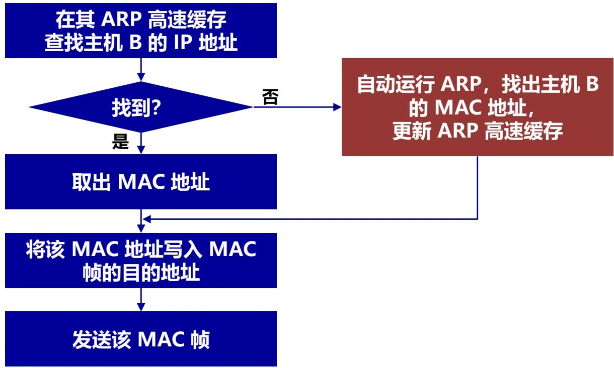

- ARP 用于解决 **同一个局域网上** 的主机或路由器的 IP 地址和 MAC 地址的映射问题。

	- 当 2 台主机不在同一个局域网上时，通信路径：$A \to R_{1} \to B$，即主机 A 询问路由器 $R_{1}$ 的 MAC 地址，将数据报发送给路由器 $R_{1}$，再由路由器 $R_{1}$ 发送给主机 B。

	- 示意图：
		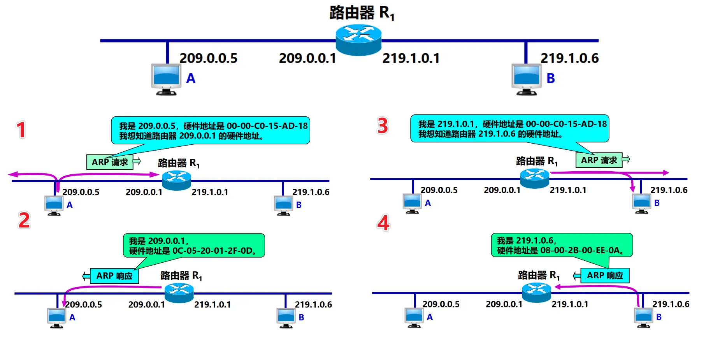

	- 步骤：

		1. 主机 A 必须知道路由器 $R_{1}$ 的 IP 地址，解析出其 MAC 地址，然后把 IP 数据报传送到路由器 $R_{1}$。

		2. 路由器 $R_{1}$ 必须知道主机 B 的 IP 地址，解析出其 MAC 地址，然后把该数据报传送到主机 B。

#### ARP 报文结构

- **ARP 报文封装在以太网帧中传输**，在 MAC 地址的类型标识当中注明为 `0806`

- MAC 帧格式：

	- 目的地址：广播地址 `FF-FF-FF-FF-FF-FF` 或响应时的单播地址

	- 源地址：发送方的 MAC 地址

	- 类型：`0806` 表示 ARP 协议

	- ARP 报文数据：
		

	- FCS 校验序列

#### 使用 ARP 的四种典型情况
| 发送方 | 目的主机所在网络 | 使用 ARP 解析的地址 |
|---|---|---|
| 主机 | 本网络 | 目的主机的 MAC 地址 |
| 主机 | 另一个网络 | 本网络上路由器的 MAC 地址 |
| 路由器 | 本网络 | 目的主机的 MAC 地址 |
| 路由器 | 另一个网络 | 本网络上另一个路由器的 MAC 地址 |

#### ARP 欺骗

- 情景模拟

	- 两台主机 A 和 B 在同一个局域网内通信  

		- A（IP：`192.168.85.1`，MAC：`aa-aa-aa-aa-aa-aa`）

		- B（IP：`192.168.85.100`，MAC：`bb-bb-bb-bb-bb-bb`）

	- 首先 A 不知道 B 在哪，ARP 请求数据包含：

		- 源 IP 地址：`192.168.85.1`

		- 源 MAC 地址：`aa-aa-aa-aa-aa-aa`

		- 目标 IP 地址：`192.168.85.100`

		- 目标 MAC 地址：广播 `ff-ff-ff-ff-ff-ff`

	- B 发现该数据包目标 IP 地址是自己，则更新自己的 ARP 缓存，记录 A 的 IP 和 MAC 的对应关系到本地 ARP 高速缓存中。此时 B 已经能够识别 A 了。

	- B 应答 A，会向 A 发送一个 ARP 应答包，包含：

		- 源 IP 地址：`192.168.85.100`

		- 源 MAC 地址：`bb-bb-bb-bb-bb-bb`

		- 目标 IP 地址：`192.168.85.1`

		- 目标 MAC 地址：`aa-aa-aa-aa-aa-aa`

	- A 接受到应答后，A 更新自己的 ARP 缓存，记录 B 的 IP 和 MAC 的对应关系到本地 ARP 高速缓存中。此时 A 已经能够识别 B 了。

- ARP 欺骗的产生

	- 机器在接收到 ARP 应答的时候，不管该机器是否发出过 ARP 请求都会更新自己的 ARP 高速缓存。

	- 利用这一点，C 可以向 A 发送 ARP 应答包，源 IP 填写 B 的，源 MAC 填写 C 自己的：

		- B 源 IP 地址：`192.168.85.100`

		- C 源 MAC 地址：`cc-cc-cc-cc-cc-cc`

		- A 目标 IP 地址：`192.168.85.1`

		- A 目标 MAC 地址：`aa-aa-aa-aa-aa`

	- 这样，A 会将 B 的 IP 和 C 的 MAC 对应关系更新到自己的 ARP 高速缓存中。

	- 同理，C 也可以向 B 发送 ARP 应答包，源 IP 填写 A 的，源 MAC 填写 C 自己的，则 B 也会将 A 的 IP 和 C 的 MAC 对应关系更新到自己的 ARP 高速缓存中。

	- 如果 A 机再利用 `192.168.85.100` 即 B 的 IP 和 B 通信时，从本地缓存用 B 的 IP 查询出了 C 的 MAC 地址。后续数据都传向了 C 的 MAC 地址，B 就收不到了。

- 实现监听攻击、中间人攻击、阻断攻击

- 防御方法：

	- ARP 改用静态的方式

	- 伪造 ARP 数据包检测

### IP 数据报的格式


- IP 数据报由首部和数据两部分组成

	- **首部**

		- 首部的前一部分是固定长度，共 20 字节，是所有 IP 数据报必须具有的

		- 首部的后一部分是可选字段，其长度是可变的，最长可达 40 字节

		- 首部总长度可变，最大长度为 60 字节

	- **数据部分**

		- 承载上层协议的数据单元

		- 长度可变

		- 最大长度由首部中的总长度字段指明

#### 首部的固定部分

- **版本**：占 4 位，指 IP 协议的版本。目前的 IP 协议版本号为 4（即 IPv4）。

- **首部长度**：占 4 位，指首部的长度，单位为 **4 字节**，因此首部的最大长度为 60 字节。

- **区分服务**：占 8 位，用来获得更好的服务（QoS 技术）。只有在使用区分服务（DiffServ）时，这个字段才起作用。一般情况不使用这个字段。

- **总长度**：占 16 位，指首部和数据之和的长度，单位为 **字节**，因此数据报的最大长度为 65535 字节。总长度必须不超过最大传送单元 MTU。

- **标识**（identification）：占 16 位，用来唯一标识主机发送的每一个 IP 数据报。主要用于分片和重组。

- **标志**（flag）：占 3 位，目前只有低两位有意义。

	- 中间位：**DF**（Don't Fragment），只有当 DF=0 时才允许分片。

	- 最低位：**MF**（More Fragment），MF=1 表示后面还有分片，MF=0 表示当前是最后一个分片。

- **片偏移**：占 13 位，指示某一片相对于原始数据报的起始位置，单位为 **8 字节**。

	- 示例：IP 数据报分片
		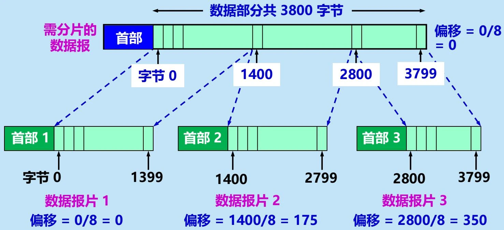

		|字段|总长度|标识|DF|MF|片偏移|
		|---|---|---|---|---|---|
		|原始数据报|3820|12345|0|0|0|
		|数据报片 1|1420|12345|0|1|0|
		|数据报片 2|1420|12345|0|1|175|
		|数据报片 3|1020|12345|0|0|350|

- **生存时间**：占 8 位，记为 TTL（Time To Live），指示数据报在网络中可通过的路由器数的最大值。

- **协议**：占 8 位，指出此数据报携带的数据使用何种协议，以便目的主机的 IP 层将数据部分交给上层对应的协议处理。

- **首部检验和**：占 16 位，**只检验数据报的首部**，不检验数据部分。这里不采用 CRC 检验码而采用简单的计算方法。

	- 数据报每经过一个路由器，路由器都要重新计算一下首部检验和
		

- **源地址**：占 32 位，指明发送此数据报的主机的 IP 地址。

- **目的地址**：占 32 位，指明接收此数据报的主机的 IP 地址。

#### 首部的可变部分

- IP 首部的可变部分就是一个选项字段，用来支持排错、测量以及安全等措施，内容很丰富。

- 长度可变：从 1 个字节到 40 个字节不等，取决于所选择的项目。

- 增加了 IP 数据报的功能，但这同时也使得 IP 数据报的首部长度成为可变的，增加了每一个路由器处理数据报的开销。

- **实际上很少使用**

### IP 层转发分组的过程
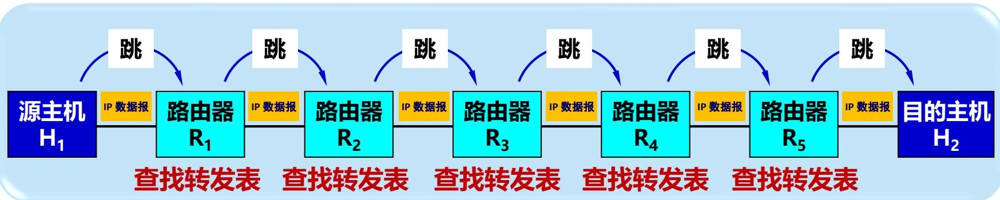

#### 基于终点的转发

- 定义：IP 层转发分组是基于分组首部中的 **目的地址** 进行传送和转发的。

- 每一个路由器都维护一个 **转发表**（forwarding table），也称为路由表（routing table），用于存放路由器用来转发分组的信息。

	- 每一行：一个路由条目（routing entry）

	- 每一列：路由条目的一个字段，主要有 **目的网络地址**、**下一跳地址** 等字段

- 为了压缩转发表的大小，转发表中最主要的路由是（目的 **网络地址**，下一跳地址），而不是（目的地址，下一跳地址）。
	

- **查找转发表的过程就是逐行寻找前缀匹配**。

- 示例：
	

- 主机 $H_{1}$ 发送出的、目的地址是 `128.1.2.132` 的分组转发过程：

	- $H_{1}$ 首先检查 `128.1.2.132` 是否连接在本网络上。如果是，则直接交付；否则，就送交路由器 $R_{1}$

		- $N_{1}$ 的网络地址为 `128.1.2.192`，网络掩码为 `/26 = 255.255.255.192`

		- 计算目的地址与网络掩码逐比特 AND：`128.1.2.132` AND `255.255.255.192` = `128.1.2.128` $\neq N_{1}$ 的网络地址

		- 所以 `128.1.2.132` 不在本地网络上。源主机 $H_{1}$  必须把分组发送给路由器 $R_{1}$

	- 路由器 $R_{1}$ 收到分组后逐行查找转发表

		- 先检查第 1 行：`128.1.2.132` AND `255.255.255.192` = `128.1.2.128` $\neq$ `128.1.3.64`，不匹配!

		- 接着检查第 2 行：`128.1.2.132` AND `255.255.255.128` = `128.1.2.128`，匹配!

		- 进行分组的直接交付（通过路由器 $R_{1}$ 的接口 1）

#### 最长前缀匹配

- 使用 CIDR 时，在查找转发表时可能会得到不止一个匹配结果。

- 最长前缀匹配（longest-prefix matching）原则：**选择前缀最长的一个作为匹配的前缀**。

	- 网络前缀越长，其地址块就越小，因而路由就越具体。

	- 可以把前缀最长的排在转发表的第 1 行，以加快查表。

- 示例：
	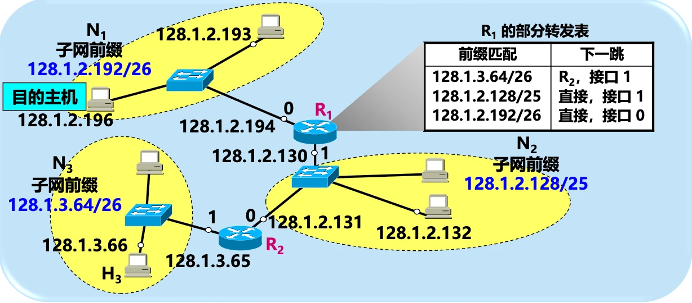

- 路由器 $R_{1}$ 收到目的地址是 `128.1.2.196` 的分组的转发过程：

	- 先检查第 1 行：`128.1.2.196` AND `255.255.255.192` = `128.1.2.192` $\neq$ `128.1.3.64`，不匹配!

	- 接着检查第 2 行：`128.1.2.196` AND `255.255.255.128` = `128.1.2.128`，匹配!

	- 接着检查第 3 行：`128.1.2.196` AND `255.255.255.192` = `128.1.2.192`，匹配!

- 问题：$R_{1}$ 从哪个接口向外转发分组?

	- 选择前缀最长的一个作为匹配的前缀：

		- 第 2 行的前缀长度为 25 位；

		- 第 3 行的前缀长度为 26 位；

		- 因此选择第 3 行作为匹配的前缀，通过路由器 $R_{1}$ 的接口 0 转发分组。

	- 优化：可以把前缀最长的排在转发表的靠前位置，如将图中的第 3 行与第 2 行交换位置。

- 转发表中的特殊的路由

	- **主机路由**/特定主机路由（host route）

		- 是对特定目的主机的 IP 地址专门指明的一个路由。

		- 网络前缀是 `a.b.c.d/32`，即整个 32 位的 IP 地址都作为网络前缀。

		- 放在转发表的 **最前面**（网络前缀最长）。

	- **默认路由**（default route）

		- 不管分组的最终目的网络在哪里，都由指定的路由器 R 来处理

		- 用特殊前缀 `0.0.0.0/0` 表示。

		- 放在转发表的 **最后面**（网络前缀最短）。

- 路由器分组转发算法流程图
	

#### 优化：使用二叉线索查找转发表

- **二叉线索**（binary trie）：一种特殊结构的树，可以快速在转发表中找到匹配的叶节点。

- 定义：

	- 自顶向下高度为 32 的二叉树，每层对应于 IP 地址中的一位。 

	- 每一个节点都有两个子节点，分别对应于 IP 地址中的 0 和 1。

	- 从根节点到某一节点的路径表示一个唯一的二进制前缀。

	- 每一个叶节点都对应于转发表中的一个路由条目。

- 为了提高二叉线索的查找速度，广泛使用了各种压缩技术。

- 构造基于二叉线索的转发表

	- 规则：

		- 先检查 IP 地址左边的第一位，如为 0，则第一层的节点就在根节点的左下方；如为 1，则在右下方。

		- 然后再检查地址的第二位，构造出第二层的节点。

		- 依此类推，直到唯一前缀的最后一位。每个叶节点代表一个唯一前缀。

	- 为检查网络前缀是否匹配，必须使二叉线索中的每一个叶节点包含所对应的网络前缀和子网掩码。

	- 示例：
		

- 在二叉线索中查找 IP 地址

	- 规则：

		- 从根节点开始，逐位检查 IP 地址的每一位。

		- 每检查一位，就沿着二叉线索向下走到相应的子节点，直到找到一个叶节点为止。

		- 若在某一位找不到相应的子节点，则说明该地址不在该二叉线索中，检查是否存在默认路由。

			- 若有，把分组传送到指明的默认路由器

			- 否则，丢弃该分组。

		- 找到叶节点后，将目的 IP 地址和该叶节点的子网掩码进行按位 AND 运算，看结果是否与叶节点的网络前缀相匹配。

			- 若匹配，就按下一跳的接口转发该分组。

			- 否则，丢弃该分组。

	- 示例：

		1. IP = `01010110 01111010 00000000 00000000`

			- 

			1. 找到了一个叶节点。

			2. 将目的 IP 地址和该叶节点的子网掩码进行按位 AND 运算，看结果是否与叶节点的网络前缀相匹配。

			3. 若匹配，就按下一跳的接口转发该分组。否则，就丢弃该分组。

		2. IP = `10011011 01111010 00000000 00000000`

			- 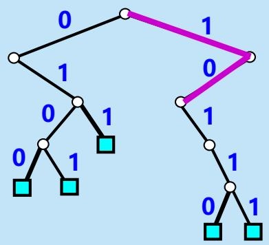

			1. 查到第三个字符 0 时，在二叉线索中找不到匹配的。说明这个地址不在这个二叉线索中。

			2. 检查是否存在默认路由。若有，把分组传送到指明的默认路由器，否则丢弃该分组。

## 网际控制报文协议 ICMP

- ICMP（Internet Control Message Protocol）允许主机或路由器 **报告差错** 情况和 **提供有关异常** 情况的报告。

- 功能：检测网络通信故障和实现链路追踪

- 特点：

	- ICMP 本身是网络层的一个协议，但其报文不是直接交给数据链路层，而是 **封装成 IP 分组后再传送给数据链路层**。

	- 从协议体系上看，ICMP 要解决 IP 可能出现的不可靠问题，它不能独立于 IP 而单独出现，而是 **属于 IP 的组成部分之一**。

	- ICMP 的设计初衷是发送 IP 执行过程中的错误报告，主要是路由器向源主机报告传输出错的原因。**差错处理需要由高层协议来完成**。

### ICMP 报文的格式


### ICMP 报文的种类

- 常用 ICMP 报文种类
	<table>
	<tr>
	<td><strong>ICMP 报文种类</strong></td>
	<td><strong>类型的值</strong></td>
	<td><strong>ICMP 报文的类型</strong></td>
	</tr>
	<tr><td rowspan="5"><strong>差错报告报文</strong></td><td>3</td><td>目的不可达</td></tr>
	<tr><td>11</td><td>超时</td></tr>
	<tr><td>12</td><td>参数问题</td></tr>
	<tr><td>5</td><td>重定向</td></tr>
	<tr><td>4</td><td>源抑制</td></tr>
	<tr><td rowspan="4"><strong>询问报文</strong></td><td>8 或 0</td><td>回送（Echo）请求或应答</td></tr>
	<tr><td>13 或 14</td><td>时间戳（Timestamp）请求或应答</td></tr>
	<tr><td>15 或 16</td><td>路由器询问和通告</td></tr>
	<tr><td>17 或 18</td><td>地址掩码请求或应答</td></tr>
	</table>

#### 差错报告报文
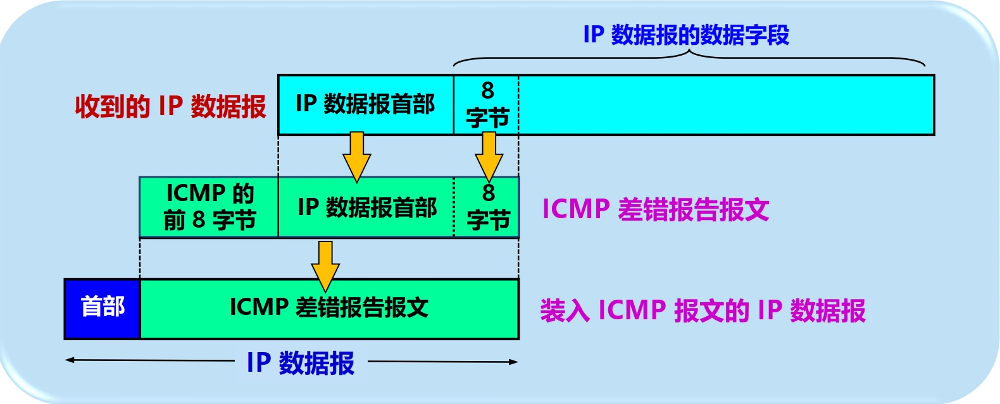

- ICMP 差错报告报文的 **数据字段** 的内容：原始 IP 数据报的首部和该数据报的前 8 个字节的数据部分。

- 不应发送 ICMP 差错报告报文的几种情况

	- 对 **ICMP** 差错报告报文不再发送 ICMP 差错报告报文。

	- 对第一个 **分片** 的数据报片的所有后续数据报片都不发送 ICMP 差错报告报文。

	- 对具有 **多播** 地址的数据报都不发送 ICMP 差错报告报文。

	- 对具有 **特殊地址**（如 `127.0.0.0` 或 `0.0.0.0`）的数据报不发送 ICMP 差错报告报文。

##### 目的不可达

- 网络不可达（network unreachable）：

	- 代码：0

	- 定义：路由器寻址出错，下一跳路由器可能存在故障。

	- 只能由路由器产生。

- 主机不可达（host unreachable）：

	- 代码：1

	- 定义：表示网络寻址不存在问题，可能是目的主机不工作或不存在。

	- 只能由路由器产生。

- 协议不可达（protocol unreachable）：

	- 代码：2

	- 定义：表示目的主机上没有运行分组要交付的协议。

- 端口不可达（port unreachable）：

	-  代码：3

	- 定义：表示分组要交付的应用进程没有运行。

- 系路由失败（source route failed）：

	- 代码：5

	- 定义：表示由源主机路由选项中规定的一个或多个路由器无法通过。

- 目的网络不可知（unknown destination network）：

	- 代码：6

	- 定义：表示路由器根本不知道关于目的网络的信息

	- 目的网络不可知与网络不可达的却别：网络不可达是知道目的网络存在，但是无法将分组送达目的网络；而目的网络不可知是根本不知道目的网络的存在。

- 目的主机不可知（unknown destination host）：

	- 代码：7

	- 定义：表示路由器根本不知道关于目的主机的信息。

##### 源抑制报文

- 定义：当路由器或目的主机发生拥塞时，向源主机发送源抑制报文，通知源主机降低分组发送速率。

- 源抑制可分为 3 个阶段：

	1. 路由器或目的主机发现拥塞，发出源抑制报文。

	2. 源主机收到源抑制报文之后，降低向目的主机的分组发送速率。

	3. 拥塞解除之后，源主机恢复分组发送速率。

##### 超时报文

- 定义：当分组在传输过程中出现超时现象时，路由器或目的主机向源主机发送超时报文。

- 出现超时现象的两种情况：

	1. 分组在路由器之间循环传输，超过了 TTL 值，需要丢弃并发送超时报文。

	2. 分组的分片没有在计时器时间内到达目的主机，导致目的主机无法重组分片，占据缓冲区，影响其他分组的传输，需要丢弃分片并发送超时报文。

##### 参数问题报文

- 定义：当路由器或目的主机发现分组头中的某个参数出错时，向源主机发送参数问题报文，指出被丢弃的分组头有错误，并在参数字段中包含一个指针，指向出错字节的起始位置。

- 示例：IP 分组头的前 4 位是版本字段，字段值为 4 时表示 IPv4 分组头。如果版本字段值为 5，路由器将无法处理，只能丢弃该分组，并向源主机发送参数问题报文，指出版本字段出错。

##### 重定向报文

- 定义：当路由器发现有更好的路由选择时，向源主机发送重定向报文，通知源主机改变路由选择，实现主机的路由表更新。

- 示例：主机 A 要向主机 B 发送分组，路由器 2 是最有效的路由选择，但是主机 A 没有选择路由器 2，而是将分组发送给路由器 1。路由器 1 发现分组应发送给路由器 2，则将该分组发送给路由器 2，并向主机 A 发送改变路由的 ICMP 重定向报文。
	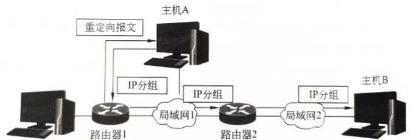

#### 询问报文
ICMP 询问报文是为网络故障诊断而设计的，ICMP 差错报告报文是单个出现的，ICMP 询问报文是双向、成对出现的。

##### 回送请求和应答报文

- 回送请求报文：

	- 类型值：8

	- 定义：由主机或路由器向一个特定的目的主机发出的询问。

- 回送应答报文：

	- 类型值：0

	- 定义：收到回送请求报文的主机必须给源主机或路由器发送 ICMP 回送应答报文。

- 作用：检测目的节点是否可达，以及了解其有关状态，如往返时间等。

- 示例：在一些网络应用中，用户调用 Ping 命令，通过回送请求与应答报文测试目的主机或路由器是否可达。

##### 时间戳请求和应答报文

- 时间戳请求报文：

	- 类型值：13

	- 定义：请某台主机或路由器回答当前的日期和时间。

- 时间戳应答报文：

	- 类型值：14

	- 包含一个 32 位的字段，其中写入的整数代表从 1900 年 1 月 1 日起到当前时刻一共有多少秒。

- 作用：提供一个基本和简单的时钟同步协议，用于时钟同步和时间测量，确定 IP 分组在两个主机之间往返所需的时间。

- 参数：

	- 初始时间戳：源主机发出请求的时间

	- 接收时间戳：目的主机收到请求的时间

	- 发送时间戳：目的主机发送应答的时间。

##### 路由器询问和通告

- 路由器询问报文：

	- 类型值：15

	- 定义：主机用来查询连接的默认路由器地址。

- 路由器通告报文：

	- 类型值：16

	- 定义：收到路由器询问报文的所有路由器使用路由器通告报文广播路由信息。当没有主机询问时，路由器周期性发送路由器通告报文。路由器在发送通告报文时，不仅通告自己的存在，而且通告它所知道的这个网络中的所有路由器地址。

- 作用：用于主机查询连接的默认路由器地址。

##### 地址掩码请求和应答报文

- 地址掩码请求报文：

	- 类型值：17

	- 定义：主机用来查询其所在网络的子网掩码。

- 地址掩码应答报文：

	- 类型值：18

	- 定义：路由器用来响应地址掩码请求报文，返回所在网络的子网掩码。

- 作用：用于主机查询其所在网络的子网掩码。

### ICMP 的应用举例
#### PING（Packet Internet Groper）

- 作用：测试两个主机之间的连通性。

- 报文：ICMP 回送请求与回送回答报文。

- 是应用层直接使用网络层 ICMP 的例子，没有通过运输层的 TCP 或 UDP。

```bash
C:\Users\youyeyejie> ping oc.sjtu.edu.cn

Pinging oc.sjtu.edu.cn [2001:da8:8000:6181:202:120:35:130] with 32 bytes of data:
Reply from 2001:da8:8000:6181:202:120:35:130: time<1ms
Reply from 2001:da8:8000:6181:202:120:35:130: time<1ms
Reply from 2001:da8:8000:6181:202:120:35:130: time<1ms
Reply from 2001:da8:8000:6181:202:120:35:130: time<1ms

Ping statistics for 2001:da8:8000:6181:202:120:35:130:
	Packets: Sent = 4, Received = 4, Lost = 0 (0% loss),
Approximate round trip times in milli-seconds:
	Minimum = 0ms, Maximum = 0ms, Average = 0ms
```

#### Traceroute/Tracert

- Traceroute（UNIX）或  tracert（Windows）

- 作用：跟踪数据报从源点到终点所经过的路径。

- 报文：

	- IP 数据报中的 TTL 字段

	- ICMP 时间超过差错报告报文

	- ICMP 终点不可达差错报告报文

```bash
C:\Users\youyeyejie> tracert oc.sjtu.edu.cn

Tracing route to oc.sjtu.edu.cn [2001:da8:8000:6181:202:120:35:130]
over a maximum of 30 hops:

  1	 1 ms	 1 ms	 1 ms  dynamic.ipv6.sjtu.edu.cn [2403:d400:4000:186c::1]
  2	<1 ms	<1 ms	<1 ms  2001:da8:8000:e01::1
  3	 1 ms	 1 ms	 1 ms  2001:da8:8000:132::58
  4	 1 ms	 1 ms	 1 ms  2001:da8:8000:137::213
  5	21 ms	 1 ms	 4 ms  2001:da8:8000:135::2
  6	23 ms	 2 ms	 2 ms  2001:da8:8000:6f80:3103:75:225:2
  7	<1 ms	<1 ms	<1 ms  2001:da8:8000:6181:202:120:35:130

Trace complete.
```

## 网际协议第 6 版 IPv6

- IP 是互联网的核心协议，但是 IPv4 地址耗尽问题：

	- 到 2011 年 2 月，IANA IPv4 的 32 位地址已经耗尽。

	- 各地区互联网地址分配机构也相继宣布地址耗尽。

	- 我国在 2014-2015 年也逐步停止了向新用户和应用分配 IPv4 地址。

- 根本解决措施：采用具有更大地址空间的新版本的 IP，即 IPv6。

### IPv6 概述

- IPv6 仍支持 **无连接的传送**。

- **协议数据单元** PDU：**分组**（packet）或 **数据报**（datagram）

- **主要变化**：

	1. 更大的地址空间：将地址从 IPv4 的 32 位 增大到了 128 位。

	2. 扩展的地址层次结构：可以划分为更多的层次。

	3. 灵活的首部格式：定义了许多可选的扩展首部。

	4. 改进的选项：允许数据报包含有选项的控制信息，其选项放在有效载荷中。

	5. 允许协议继续扩充：更好地适应新的应用。

	6. 支持即插即用（即自动配置）：不需要使用 DHCP。

	7. 支持资源的预分配：支持实时视像等要求保证一定的带宽和时延的应用。

	8. IPv6 首部改为 8 字节对齐。首部长度必须是 8 字节的整数倍。

### IPv6 格式


1. **基本首部**（base header）

	- 固定长度 40 字节，包含了数据报传送所必需的信息，只有 8 个字段

	- IPv6 对首部的主要更改

		- 取消了服务类型字段

		- 取消了首部长度字段和总长度字段，改用有效载荷长度字段

		- 把 TTL 字段改称为跳数限制字段

		- 取消了协议字段，改用下一个首部字段

		- 取消了检验和字段

		- 取消了选项字段，而用扩展首部来实现选项功能

2. **有效载荷**（payload）/净负荷

	- 有零个或多个扩展首部（extension header）

	- 数据部分

#### IPv6 数据报的基本首部

- **版本**（version）：占 4 位，指明了协议的版本。对 IPv6 该字段总是 6。

- **通信量类**（traffic class）：占 8 位，用于区分不同 IPv6 数据报的类别或优先级。目前正在进行不同的通信量类性能的实验。

- **流标号**（flow label）：占 20 位，用于标识属于同一个流的数据报。“流”是互联网络上从特定源点到特定终点的一系列数据报，“流”所经过的路径上的路由器都保证指明的服务质量。

- **有效载荷长度**（payload length）：占 16 位。它指明 IPv6 数据报除基本首部以外的字节数（所有扩展首部都算在有效载荷之内），其最大值是 64 KB。

- **下一个首部**（next header）：占 8 位，相当于 IPv4 的协议字段或可选字段。

- **跳数限制**（hop limit）：占 8 位，用于源站在数据报发出时设定跳数限制，相当于 IPv4 的 TTL 字段。路由器在转发数据报时将跳数限制字段中的值减 1，当跳数限制的值为零时将此数据报丢弃。

- **源地址**：占 128 位，数据报的发送站的 IP 地址。

- **目的地址**：占 128 位，数据报的接收站的 IP 地址。

#### IPv6 数据报的扩展首部

- 逐跳选项

- 路由选择

- 分片

- 鉴别

- 封装安全有效载荷

- 目的站选项

### IPv6 地址

- 三种基本类型：

	1. 单播（unicast）：传统的点对点通信。

	2. 多播（multicast）：一点对多点的通信。

	3. **任播**（anycast）：IPv6 增加的一种类型。任播的终点是一组计算机，但数据报在交付时只交付其中的一个（通常是按照路由算法得出的距离最近的一个）。

- 节点与接口

	- IPv6 将实现 IPv6 的主机和路由器均称为 **节点**。

	- 一个节点可能有多个与链路相连的接口。

	- IPv6 地址是分配给节点上 **接口** 的。

		1. 一个具有多个接口的节点可以有多个单播地址。

		2. 其中的任何一个地址都可以当作到达该节点的目的地址。

#### IPv6 地址的表示方法

- 在 IPv6 中，每个地址占 128 位，地址空间大于 $3.4 \times 10^{38}$。

- **冒号十六进制记法**（colon hexadecimal notation，简写为 colon hex）：16 位的值用十六进制值表示，各值之间用冒号 `:` 分隔。

- **零前导省略**（leading-zero omission）：每个 16 位的值中前导的零可以省略。

- **零压缩**（zero compression）：一串连续的零可以用一对冒号 `::` 取代。

	- 在任一地址中，只能使用一次零压缩。

- **点分十进制后缀**：对于一些 IPv4 地址，可以将其作为 IPv6 地址的后缀部分（即最低的 32 位），并用点分十进制记法表示。

	- 在 IPv4 向 IPv6 的转换阶段特别有用。

	- 示例：`::128.10.2.1`

- **前缀表示法**（prefix notation）：CIDR 的斜线表示法，但取消了子网掩码的概念，前缀相同可直接通信。

	- CIDR 记法地址：`2001:0DB8:0:CD30:123:4567:89AB:CDEF/60`，表示：

		- IPv6 的地址是：`2001:0DB8:0:CD30:123:4567:89AB:CDEF`

		- 其子网号是： `2001:0DB8:0:CD30::/60`

	- 60 位的前缀 `12AB00000000CD3` 可记为：

		- 前缀表示法：`12AB:0000:0000:CD30:0000:0000:0000:0000/60`

		- 零前导省略：`12AB:0:0:CD30:0:0:0:0/60`

		- 零压缩：`12AB:0:0:CD30::/60` 或 `12AB::CD30:0:0:0:0/60`

- 示例：

	| 原始地址 | 零前导省略 | 零压缩 |
	|---|---|---|
	|`2001:0DB8:0000:0000:0000:0000:0000:0001`|`2001:DB8:0:0:0:0:0:1`|`2001:DB8::1`|
	|`0000:0000:0000:0000:0000:0000:128.10.2.1`|`0:0:0:0:0:0:128.10.2.1`|`::128.10.2.1`|
	|`FF01:0000:0000:0000:0000:0000:0000:0101`（多播地址）|`FF01:0:0:0:0:0:0:101`|`FF01::101`|
	|`FE80:0000:0000:0000:0202:B3FF:FE1E:8329`（本地链路单播地址）|`FE80:0:0:0:202:B3FF:FE1E:8329`|`FE80::202:B3FF:FE1E:8329`|
	|`0000:0000:0000:0000:0000:0000:0000:0001`（环回地址）|`0:0:0:0:0:0:0:1`|`::1`|
	|`0000:0000:0000:0000:0000:0000:0000:0000`（未指明地址）|`0:0:0:0:0:0:0:0`|`::`|

#### IPv6 地址分类
| 地址类型 | 二进制前缀 | IPv6 记法 |
|---|---|---|
| 多播地址 | `11111111`（8 位），功能和 IPv4 的一样 | `FF00::/8` |
| 本地链路单播地址 | `1111111010`（10 位），未连接到互联网，不能和互联网上的其他主机通信 | `FE80::/10` |
| 环回地址 | `00...1`（128 位），仅此一个 | `::1/128` |
| 未指明地址 | `00...0`（128 位），仅此一个 | `::/128` |
| 全球单播地址 | 除上述四种外，所有其他的二进制前缀 |  |

#### IPv6 单播地址的划分方法


### 从 IPv4 向 IPv6 过渡

- 方法：逐步演进，向后兼容。

- **向后兼容**：IPv6 系统必须能够接收和转发 IPv4 分组，并且能够为 IPv4 分组选择路由。

- 两种过渡策略：

	1. 使用双协议栈

	2. 使用隧道技术

#### 双协议栈

- 双协议栈（dual stack）：同时支持 IPv4 和 IPv6 协议。
	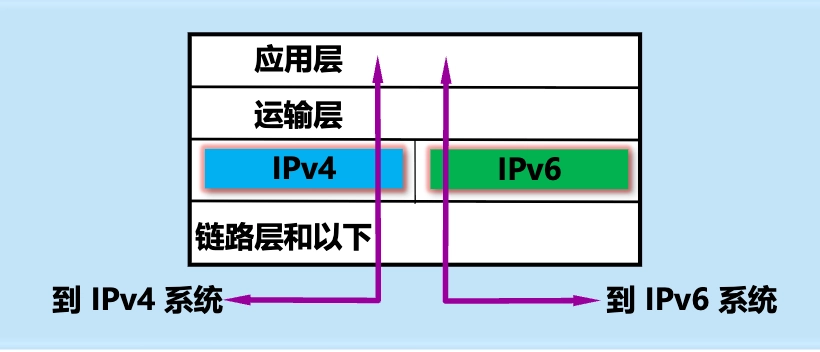

- 示例：
	

#### 隧道技术

- 隧道技术（tunneling）：把 IPv6 数据报封装在 IPv4 数据报中传送。

- 隧道端点（tunnel endpoint）：负责封装和解封装的节点。

- 示例：
	

### ICMPv6

- IPv6 也需要使用 ICMP 来反馈一些差错信息。新的版本称为 ICMPv6。

- ICMPv6 实现 ARP 和 IGMP 协议的功能
	

- ICMPv6 报文的分类

	- 差错报文

	- 信息报文

	- 邻站发现报文：邻站发现协议 ND（Neighbor-Discovery）

	- 组成员关系报文：多播听众交付协议 MLD（Multicast Listener Delivery）

## 互连网的路由选择协议
### 路由选择协议基本概念

- 路由选择协议属于网络层 **控制层面** 的内容

- 理想路由算法

	- 计算简单

	- 正确完整

	- 稳定

	- 自适应

	- 公平

- 路由算法分类（自适应）

	- 静态路由选择策略

		- 非自适应路由选择

		- 不能及时适应网络状态的变化

		- 简单，开销较小

	- 动态路由选择策略

		- 自适应路由选择

		- 能较好地适应网络状态的变化

		- 实现较为复杂，开销较大

- 自治系统 AS（Autonomous System）

	- 定义：是在单一技术管理下的一组路由器，而这些路由器使用一种自治系统内部的路由选择协议和共同的度量。每一个 AS 对其他 AS 表现出的是一个单一的和一致的路由选择策略。

	- 示意图：
		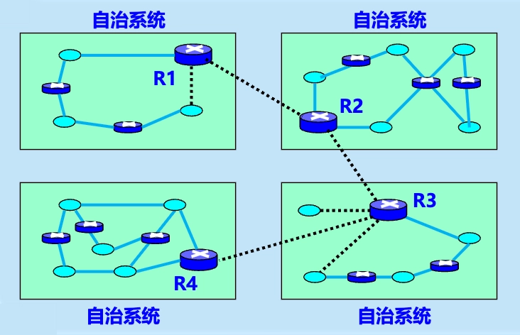

	- 分类：
		

		- **末梢 AS**：不会把来自其他 AS 的分组再转发到另一个 AS。必须向所连接的 AS 付费。

		- **多归属 AS**（multihomed AS）：同时连接到两个或两个以上的 AS。增加连接的可靠性。

		- **穿越 AS**：为其他 AS 有偿转发分组。

		- **对等 AS**：经过事先协商的两个 AS，彼此之间的发送或接收分组都不收费。

- 互联网使用分层次的路由选择协议：

	- 采用自适应的（即动态的）、分布式路由选择协议。

	- 把整个互联网划分为许多较小的自治系统 AS，采用分层次的路由选择协议。

	- 分为 2 个层次：

		- **域内路由选择**（intradomain routing）：自治系统内部的路由选择

			- **内部网关协议** IGP（Interior Gateway Protocol）

				- 在一个自治系统内部使用的路由选择协议

				- 示例：RIP，OSPF

		- **域间路由选择**（interdomain routing）：自治系统之间的路由选择

			- **外部网关协议** EGP（Exterior Gateway Protocol）

				- 在不同自治系统之间进行路由选择时使用的协议

				- 示例：BGP-4

	- 示意图
		

### 路由信息协议 RIP
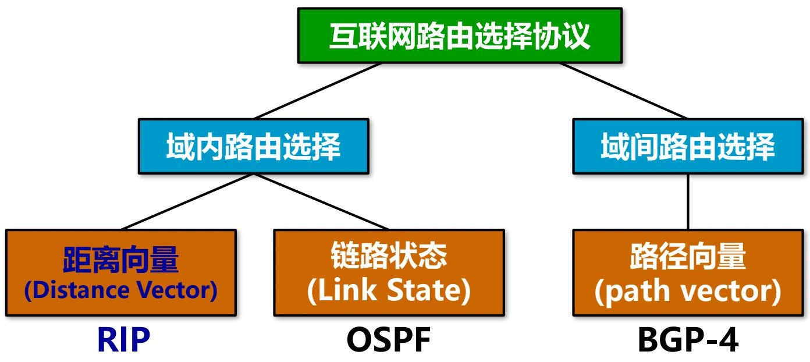

- 定义：**路由信息协议** RIP（Routing Information Protocol）是一种 **分布式的、基于距离向量的** 路由选择协议。

	- 互联网的标准协议。

	- 属于内部网关协议。

- **基本思想**：要求网络中的每个路由器都要维护从它自己到其他每一个目的网络 **的距离记录**。

#### RIP 协议的工作原理

- **距离的定义**：RIP 协议中的“距离”也称为“**跳数**”（hop count），每经过一个路由器，跳数就加 1

	- 路由器到 **直接连接** 的网络的距离 = 1

	- 路由器到 **非直接连接** 的网络的距离 = 所经过的路由器数 + 1

	- “距离”的最大值为 16，此时相当于 **不可达**。

		- 一条路径最多只能包含 15 个路由器。

	- RIP 不能在两个网络之间同时使用多条路由，**只选择距离最短的路由**。

		- 好路由 = “距离短”的路由。

		- **最佳路由** = “距离最短”的路由。

	- 示例：
		

		- 路由 A-B-E 的距离 = 2，路由 A-C-D-E 的距离 = 3。

		- 最佳路由为 A-B-E。

- **基本工作方式**

	- 交换对象：**相邻** 路由器

	- 信息内容：本路由器所知道的 **全部信息**，即自己的路由表。

	- 交换时机：网络拓扑发生变化或经过 **固定时间间隔**（如 30 秒）

- **路由表的建立**

	1. 路由器在刚刚开始工作时，路由表是空的。

	2. 得到 **直接连接** 的网络的距离，定义为 1。

	3. 每一个路由器只与数目非常有限的 **相邻路由器交换并更新** 路由信息。

	4. 经过若干次更新后，所有的路由器最终都会知道到达本自治系统中任何一个网络的最短距离和下一跳路由器的地址。

- 路由表主要信息和更新规则

	- 路由表主要信息：

		- 目的地址

		- 最短距离

		- 下一跳地址

	- 路由表更新规则：

		- **使用距离向量算法找出到达每个目的网络的最短距离**。

#### 距离向量算法

- 对每个相邻路由器（假设其地址为 $X$）发送过来的 RIP 报文，路由器按以下步骤更新路由表：

	1. 修改 **RIP 报文** 中的所有项目（即路由）：把“下一跳”字段中的地址都改为 $X$，并把所有的“距离”字段的值 **加 1**。

	2. 对修改后的 RIP 报文中的每一个项目，重复以下步骤：

		- 若路由表中 **没有** 目的网络 $N$，则把该项目 **添加** 到路由表中。（新发现的网络）

		- 否则，若路由表中网络 $N$ 的 **下一跳** 路由器为 $X$，则用收到的项目 **替换** 原路由表中的项目。（使用 $X$ 通告的到 $N$ 的新距离）

		- 否则，若收到项目中的距离 **小于** 路由表中的距离，则用收到项目 **更新** 原路由表中的项目。（发现了更短的路径）

		- 否则，什么也不做。

	3. 若 3 分钟还未收到相邻路由器的更新路由表，则把此相邻路由器记为 **不可达** 路由器，即将距离置为 16（表示不可达）。

	4. 返回。

- 算法基础：Bellman-Ford 算法（或 Ford-Fulkerson 算法）。

- 算法要点：

	- 设 $X$ 是结点 $A$ 到 $B$ 的最短路径上的一个结点。

	- 若把路径 $A \to B$ 拆成两段路径 $A \to X$ 和 $X \to B$ ，则每一段路径 $A \to X$ 和 $X \to B$ 也都分别是结点 $A$  到  $X$ 和结点 $X$ 到 $B$ 的最短路径。

	- 示意图：
		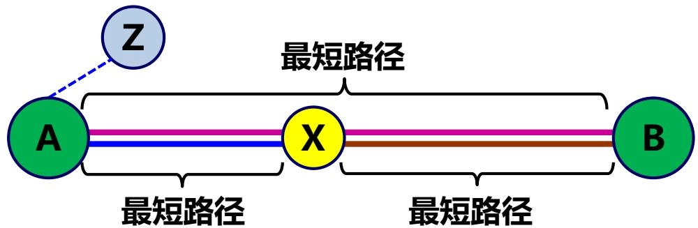

- 示例：

	1. 已知路由器 $R_{6}$ 有表 4-8（a）所示的路由表，现在收到相邻路由器 $R_{4}$ 发来的路由更新信息，如表 4-8（b）所示。试更新路由器 $R_{6}$ 的路由表。
		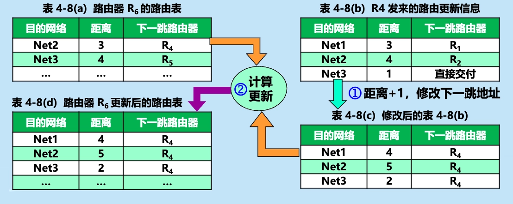

	2. 收到从 $C$ 发来的 RIP 报文后，更新路由表如下：
		

#### RIP2 报文

- RIP2 支持无分类域间路由选择 CIDR，提供简单的鉴别，支持多播。

- RIP2 的报文用使用 UDP 传送，端口 520。
	

- 组成：首部和路由 2 个部分。

	- **首部部分**：共 4 个字节。

		- **命令字段**：指明该报文是请求报文还是响应报文。

		- **版本字段**：RIP 的版本号，RIP2 的版本号为 2。

		- 保留字段：未使用，置为 0。

	- **路由部分**：由若干个路由信息组成，每个路由信息共 20 个字节，最多可有 25 个路由信息。

		- **地址族标识符/地址类别字段**：标志所使用的地址协议。

		- **路由标记字段**：自治系统的号码。

		- **具体路由字段**：

			- 网络地址

			- 子网掩码

			- 下一跳路由器地址

			- 到此网络的距离

- 一个 RIP 报文 **最多** 可包括 25 个路由，因而 RIP 报文的最大长度是 $4 + 20 \times 25 = 504$ 字节。如超过，必须再用一个 RIP 报文来传送。

#### RIP 协议的特点及优缺点

- RIP 协议存在问题：坏消息传播得慢（**慢收敛**）。

	- 收敛：在自治系统中，所有的结点都得到正确的路由选择信息的过程。

	- 当网络出现故障时，要经过比较长的时间才能将此信息（坏消息）传送到所有的路由器。

- 示例：
	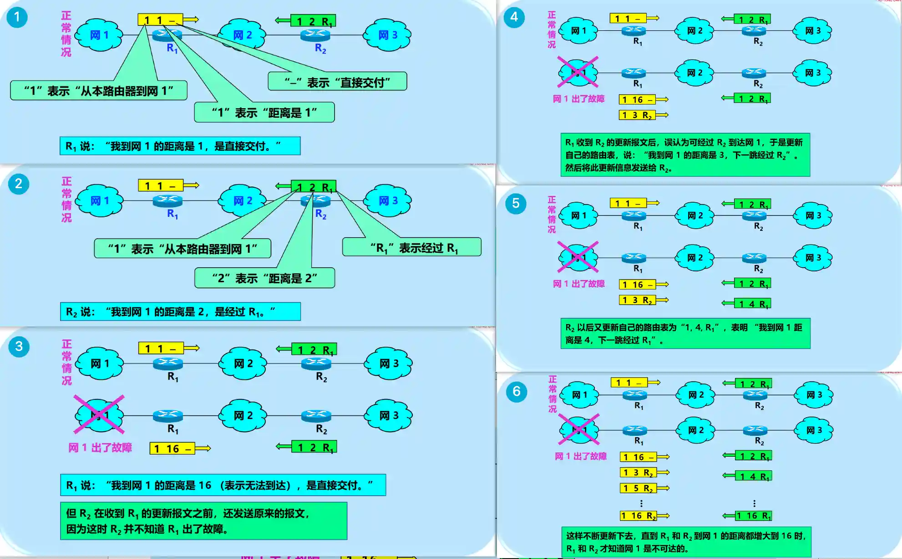

- RIP 协议的优缺点

	- 优点：

		1. 实现简单，开销较小。

		2. 好消息传播得快，收敛过程较快。

	- 缺点：

		1. 网络规模有限。最大距离为 15（16 表示不可达）。

		2. 交换的路由信息为完整路由表，开销较大。

		3. 坏消息传播得慢，收敛时间过长。

### 开放最短路径优先协议 OSPF
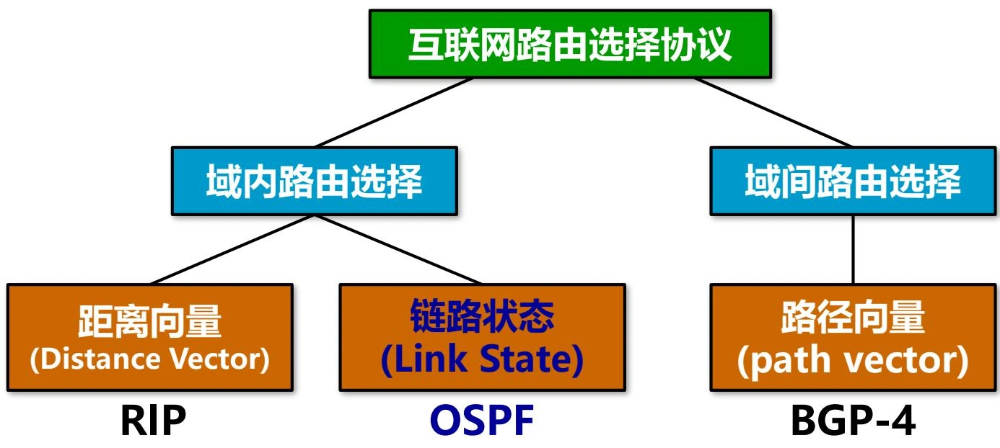

- 定义：**开放最短路径优先** OSPF（Open Shortest Path First）是为克服 RIP 的缺点在 1989 年开发出来的一种 **分布式的、基于链路状态的** 路由选择协议。

	- 属于内部网关协议。

- 现在使用 OSPFv2 版本，支持 IPv4

#### OSPF 协议的工作原理

- **基本工作方式**

	- 交换对象：本自治系统内的 **所有** 路由器

	- 交换方法：**洪泛法**（flooding）

	- 信息内容：本路由器所知道的 **部分信息**，即与本路由器相邻的所有路由器的 **链路状态**。

		- 链路状态：说明本路由器都和哪些路由器相邻，以及该链路的度量（metric）。

	- 交换时机：链路状态发生变化或经过 **固定时间间隔**（如 30 分钟）

- **链路状态数据库**（link-state database）

	- 每个路由器最终都能建立。

	- **全网的拓扑结构图**。

	- **在全网范围内是一致的**（这称为链路状态数据库的同步）。

	- 每一个路由器都知道全网共有多少个路由器，以及哪些路由器是相连的，其代价是多少

	- 每个路由器使用链路状态数据库中的数据构造自己的路由表（例如，使用 Dijkstra 的最短路径路由算法）。

	- 链路状态数据库能较快地进行更新，使各个路由器能及时更新其路由表。

		- 重要优点：OSPF 更新过程收敛速度快。

- 自治系统的区域划分  

	- 示意图：
		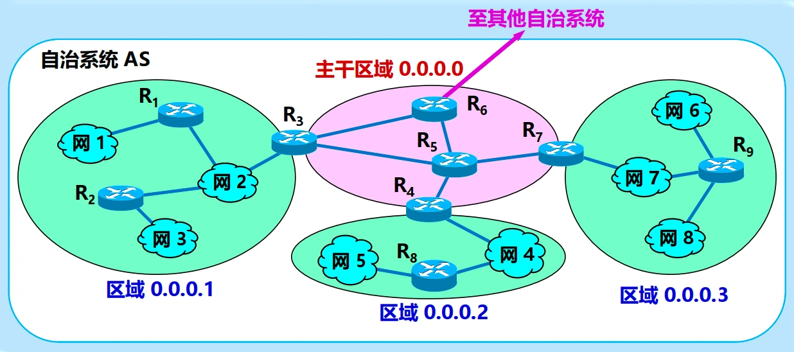

	- OSPF 将自治系统划分为两种不同的区域（area）：

		1. **主干区域**（backbone area）

			- 标识符：`0.0.0.0`

			- 作用：用来连通其他下层区域

			- 图中红色区域

		2. **普通区域**（standard area）

	- OSPF 中的路由器：

		- **区域边界路由器** ABR（area border router）：$R_3,R_4,R_7$

		- **主干路由器** BR（backbone router）：$R_3,R_4,R_5,R_6,R_7$

		- **自治系统边界路由器** ASBR（AS border router）：$R_6$

	- 划分区域的优缺点

		- 优点：

			- 减少了整个网络上的通信量。

				- 分层次划分区域，使每一个区域内部交换路由信息的通信量大大减小，因而使 OSPF 协议能够用于规模很大的自治系统中。

			- 减少了需要维护的状态数量。

		- 缺点：

			- 交换信息的种类增多了。

			- 使 OSPF 协议更加复杂了。

#### OSPF 报文

- OSPF 分组用 IP 数据报传送

	- 示意图：
		

	- 其 IP 数据报首部的协议字段值为 89

- 组成：首部和数据两个部分。

	- 首部部分：包含 24 字节的 OSPF 首部

	- 数据部分：包含五种不同类型的 OSPF 分组

		1. **问候**（Hello）分组：用来发现和维持邻站的可达性

		2. **数据库描述**（Database Description）分组：向邻站给出自己的链路状态数据库中的所有链路状态项目的摘要信息。

		3. **链路状态请求**（Link State Request）分组：向对方请求发送某些链路状态项目的详细信息。

		4. **链路状态更新**（Link State Update）分组：用洪泛法对全网更新链路状态。

		5. **链路状态确认**（Link State Acknowledgment）分组：对链路更新分组的确认。

#### OSPF 工作过程
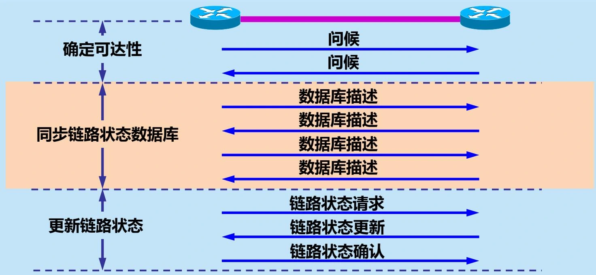

1. **确定邻站可达**。

	- 相邻路由器每隔 10 秒钟要交换一次问候分组。

	- 若有 40 秒钟没有收到某个相邻路由器发来的问候分组，则可认为该相邻路由器是不可达的。

2. **同步链路状态数据库**。

	- 同步：使不同路由器的链路状态数据库的内容达到一致。

	- 两个同步的路由器叫做 **完全邻接** 的（fully adjacent）路由器。

		- 不是完全邻接的路由器：它们虽然在物理上是相邻的，但其链路状态数据库并没有达到一致。

3. **更新链路状态**。

	- 只要链路状态发生变化，路由器就使用链路状态更新分组，采用 **可靠的洪泛法** 向全网更新链路状态。
		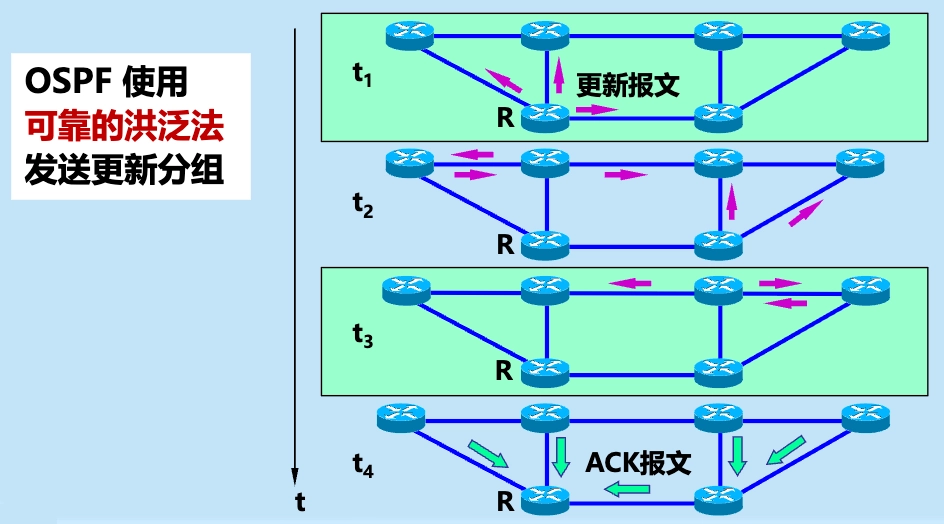

	- 为确保链路状态数据库与全网的状态保持一致，OSPF 还规定：每隔一段时间（如 30 分钟）要刷新一次数据库中的链路状态。

#### 指定路由器机制 DR

- 多点接入的局域网（如以太网）中，OSPF 协议采用了 **指定路由器机制**（Designated Router，DR）

	- 指定路由器 DR 作为该局域网上所有路由器的代表，负责与其他路由器交换链路状态信息，避免所有路由器之间两两通信带来的大量冗余广播，**广播信息量大大减少**。

#### OSPF 协议的特点

- 原理简单，实现复杂

	- 使用 Dijkstra 提出的最短路径优先算法 SPF 来计算路由

	- 采用分布式的链路状态协议（link state protocol）

- OSPF 链路状态只涉及相邻路由器，与整个互联网的规模并无直接关系，因此当互联网规模很大时，OSPF 协议要比距离向量协议 RIP 好得多。OSPF 没有“坏消息传播得慢”的问题，收敛速度快。

- 对于不同类型的业务可计算出不同的路由。

- 可实现多路径间的负载均衡（load balancing）。

- 所有在 OSPF 路由器之间交换的分组都具有鉴别的功能。

- 支持可变长度的子网划分和无分类编址 CIDR。

- 32 位的序号，序号越大状态就越新。全部序号空间在 600 年内不会产生重复号。

### 边界网关协议 BGP


- 定义：**边界网关协议** BGP（Border Gateway Protocol）是一种 **基于路径向量** 的路由选择协议，用于不同自治系统 AS 的路由器之间交换路由信息。

	- 互联网的标准协议。

	- 属于外部网关协议 EGP。

- BGP 较新版本是 2006 年 1 月发表的 BGP-4（BGP 第 4 个版本），即 RFC 4271~4278，可以将 BGP-4 简写为 BGP。

#### BGP 协议的主要特点

- 只能是力求选择出一条能够到达目的网络且比较好的路由（不能兜圈子），而 **并非要计算出一条最佳路由**。

	1. 互联网的规模太大，使得自治系统 AS 之间路由选择非常困难。不同 AS 协议与度量不同。（有的 1000 可用，有的表示不可达）

	2. 自治系统 AS 之间的路由选择必须考虑有关策略。

		- 示例：要求国内站点不经过国外，规定是否允许通过某个 AS 等等

- 采用了 **路径向量**（path vector）路由选择协议。

#### BGP 协议的工作原理

- **BGP 发言者**（BGP speaker）

	- 定义：运行 BGP 协议的路由器称为 BGP 发言者（一般是边界路由器）。

	- 作用：对等 BGP 发言者（边界路由器）在 AS 之间交换信息

	- 示意图：
		

- **BGP 连接的两种类型**

	- 示意图：
		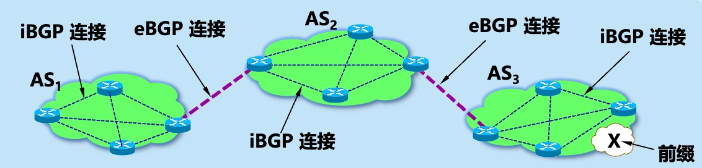

	- eBGP 连接和 iBGP 连接

		- **eBGP**（external BGP）连接：运行在不同自治系统 AS 中的 BGP 发言者之间的 BGP 连接。

			- 建立在半永久性 TCP 连接上，端口号为 179

			- 运行 eBGP 协议

			- 在不同 AS 之间交换路由信息。

		- **iBGP**（internal BGP）连接：运行在同一自治系统 AS 内的 BGP 发言者之间的 BGP 连接。

			- 同样建立在半永久性 TCP 连接上

			- AS 内部所有的路由器之间的通信是 **全连通** 的

			- 运行 iBGP 协议

			- 在 AS 内部的路由器之间交换 BGP 路由信息。

	- IGP、iBGP 和 eBGP 的关系

		- 在 AS 内部运行：

			- 内部网关协议 IGP（可以是协议 OSPF 或 RIP）。

			- 协议 iBGP。

		- 在 AS 之间运行：

			- 协议 eBGP。

		- 示意图：
		   

	- 说明：

		- eBGP 和 iBGP 属于同一个协议 BGP（使用的报文类型、使用的属性、使用的状态机等都完全一样）。

		- 但它们在通报前缀时采用的 **规则不同**：

			- 在 eBGP 连接的对等端得知的前缀信息，可以通报给一个 iBGP 连接的对等端。

			- 在 iBGP 连接的对等端得知的前缀信息，可以通报给另一个 eBGP 连接的对等端。

			- 但从 iBGP 连接的对等端得知的前缀信息，则 **不能** 够通报给另一个 iBGP 连接的对等端。

		- 示例：
			

			- $R_3$ 从 eBGP 连接的对等端 $R_4$ 得到的前缀信息可以通报给 iBGP 连接的对等端 $R_1$ 或 $R_2$ 。

			- $R_3$ 从 iBGP 连接的对等端 $R_1$ 和 $R_2$ 得到的前缀信息可以通报给 eBGP 连接的对等端 $R_4$ 。

			- 但 $R_3$ 从 iBGP 连接的对等端 $R_1$ 得到的前缀信息不允许再通报给另一个 iBGP 连接的对等端 $R_2$ 。

- **BGP 路由信息**

	- **BGP 路由 = [ 前缀，BGP 属性 ] = [ 前缀，AS-PATH，NEXT-HOP ]**

		- **前缀**：指明到哪一个子网（用 CIDR 记法表示）。

		- BGP 属性：最重要的两个属性是

			- **自治系统路径**：AS-PATH

			- **下一跳**：NEXT-HOP。

	- 示例：
		

		- 路由 1：$AS_{1}$ 可经 $IP_{2a}$ 到前缀 X 的路由 = [前缀，AS-PATH，NEXT-HOP] = $[X,AS_{2} AS_{3},IP_{2a}]$

		- 路由 2：$AS_{1}$ 可经 $IP_{3c}$ 到前缀 X 的路由 = [前缀，AS-PATH，NEXT-HOP] = $[X,AS_{3},IP_{3c}]$

		- 路由器 $R_{1a}$  的转发表中，沿 BGP 路由 1 到达前缀 X 的项目是：（匹配前缀 $X$，下一跳路由器 $R_{1d}$）

- **避免兜圈子路由**：在属性 AS-PATH 中，不允许出现相同的 AS 号

	- 示例：
		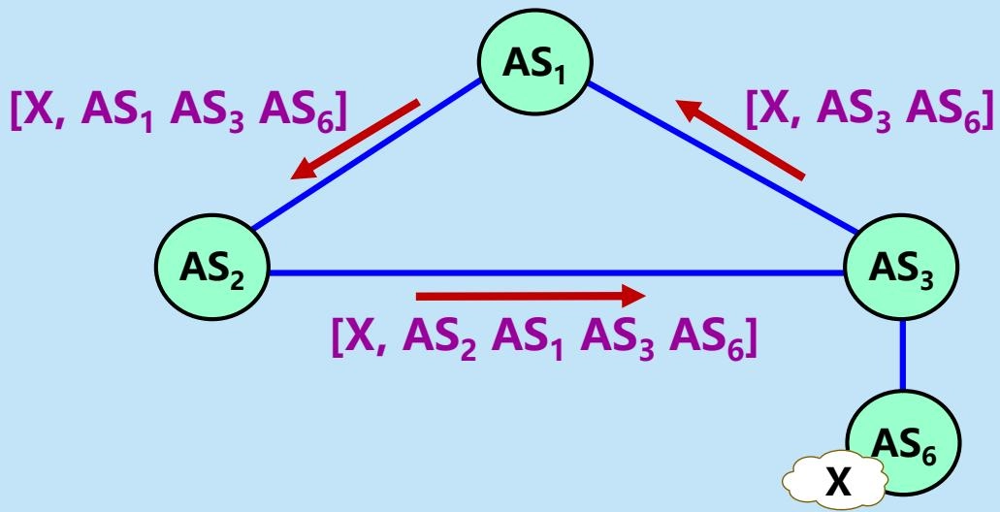

	- $AS_3$ 检查收到的 BGP 路由的 AS-PATH 中已经有了自己，立即删除掉这条路由，从而避免兜圈子路由的出现。

#### BGP 的路由选择
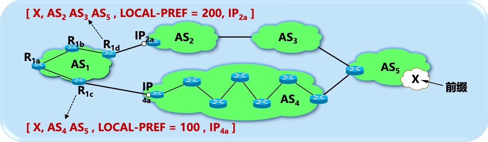

1. 本地偏好（local preference）值最高的路由（默认值=1000）

	- $AS_{1}$ 选择通过路由器 $R_{1d}$ 到达 X 的 BGP 路由。

2. AS 跳数最小的路由

	- 若上图中两条路由的本地偏好值相同，则 $AS_{1}$ 选择通过路由器 $R_{1c}$ 到达 X 的 BGP 路由。

	- 但事实上，分组在 $AS_4$ 中反而要经过更多次数的转发。说明协议 BGP 不存在真正的最佳路由选择。

3. 使用热土豆路由选择算法（分组在 AS 内的转发次数最少）

	- $R_{1a}$ 选择 $R_{1c}$ 作为离开 $AS_{1}$  的最佳选择，其 BGP 转发表中对应的项目应当是：（匹配前缀 X，下一跳路由器  $R_{1c}$ ）。

	- $R_{1b}$  选择  $R_{1d}$  作为离开  $AS_{1}$  的最佳选择，其 BGP 转发表中对应的项目应当是：（匹配前缀 X，下一跳路由器  $R_{1d}$  ）。

4. 路由器 BGP ID 数值最小的路由。具有多个接口的路由器有多个 IP 地址，BGP ID 就使用该路由器的 IP 地址中数值最大的一个。

#### BGP 报文

- BGP 报文用 TCP 传送，端口 179。
	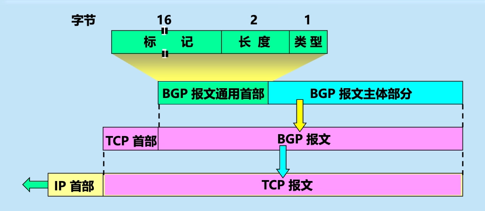

- 组成：通用首部和数据两个部分。

	- **通用首部**：包含 19 字节的 BGP 通用首部

	- 数据部分：包含不同类型的 BGP 报文（BGP-4 报文有四种类型）

		1. 打开报文 OPEN：用来与相邻的另一个 BGP 发言者建立关系，使通信初始化。

		2. 更新报文 UPDATE：用来通告某一路由的信息，以及列出要撤销的多条路由。

		3. 保活报文 KEEPALIVE：用来周期性地证实邻站的连通性。

		4. 通知报文 NOTIFICATION：用来发送检测到的差错。

### 路由器的构成

- 路由器工作在网络层，用于互连网络，是互联网中的关键设备。

- 路由器的主要工作：**转发分组**。

	- 把从某个输入端口收到的分组，按照分组要去的目的地（即目的网络），把该分组从路由器的某个合适的输出端口转发给下一跳路由器。

#### 路由器的结构
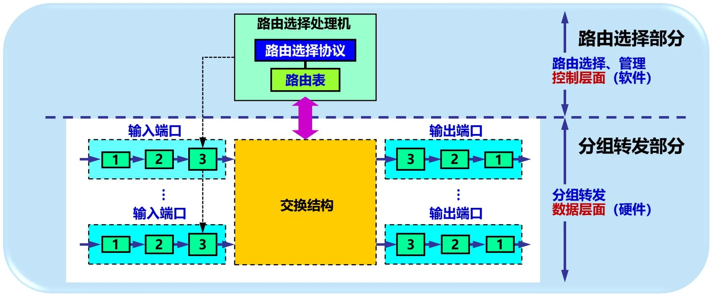

- 路由选择与分组转发的区别

	- 路由选择

		- 按照路由选择算法，根据网络拓扑的变化情况，动态地改变所选择的路由，并由此构造出整个的路由表。

		- 涉及到很多路由器。

		- 路由表通常包含 **目的网络前缀、出接口、下一跳 IP 地址** 和其他信息（如度量、路由来源等）。

	- 分组转发

		- 根据转发表将用户的 IP 数据报从合适的端口转发出去。

		- 仅涉及到一个路由器。

		- 转发表是从路由表得出的。

		- 转发表必须包含完成转发功能所必需的信息，每一行必须包含 **目的网络前缀、出接口、下一跳 IP 地址**（或者使用 ARP 得到下一跳的 MAC 地址）。

- **输入端口** 对线路上收到的分组的处理
	

- **输出端口** 将交换结构传送来的分组发送到线路
	

#### 交换结构

- 常用交换方法有三种：通过存储器、通过总线、通过纵横交换结构。
	

- 通过存储器

	1. 当路由器的某个输入端口收到一个分组时，就用 **中断** 方式通知路由选择处理机。然后分组就从输入端口 **复制到存储器** 中。

	2. 路由器处理机从分组首部提取目的地址，查找路由表，再将分组复制到合适的 **输出端口的缓存** 中。

	3. 若存储器的带宽（读或写）为每秒 $M$ 个分组，那么路由器的交换速率（即分组从输入端口传送到输出端口的速率）**一定小于** $M/2$ 。

- 通过总线

	1. 数据报从输入端口通过 **共享的总线** 直接传送到合适的输出端口，而 **不需要** 路由选择处理机的干预。

	2. 当分组到达输入端口时若发现总线忙，则被阻塞而不能通过交换结构，并在输入端口 **排队等待**。

	3. 因为每一个要转发的分组都要通过这一条总线，因此路由器的转发带宽就受总线速率的限制。

- 通过纵横交换结构（crossbar switch fabric）/互连网络（interconnection network）

	1. 它有 $2N$ 条总线，控制交叉节点可以使 $N$ 个输入端口和 $N$ 个输出端口相连接。

	2. 当输入端口收到一个分组时，就将它发送到 **水平总线** 上。

	3. 若通向输出端口的垂直总线空闲，则 **将垂直总线与水平总线接通**，把该分组转发到这个输出端口。若输出端口已被占用，分组在输入端口 **排队等待**。

	- 特点：是一种 **无阻塞** 的交换结构，分组可以转发到任何一个输出端口，只要这个输出端口没有被别的分组占用。

## IP 多播
### IP 多播的基本概念

- **多播**（multicast）：**一对多通信** 技术，将消息由一个源点发送到许多个终点，也称为组播。

	- 多播的优点：大大节约网络资源

		- 示例：
			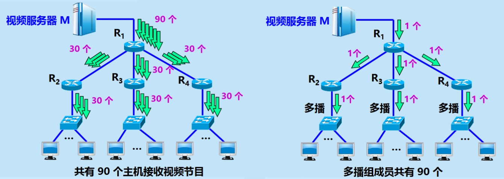

			- 单播：向 90 台主机传送同样的视频节目，需要发送 90 个单播

			- 多播：只需发送一次到多播组，由网络中的路由器负责把数据报复制并转发给多播组的所有成员。局域网具有硬件多播功能，不需要复制分组。

		- 当多播组的主机数很大时（如成千上万个），采用多播方式就可明显地减轻网络中各种资源的消耗。

- **IP 多播**

	- 定义：在互联网上进行多播就叫做 IP 多播。

	- 多播路由器（multicast router）：能够运行多播协议的路由器。

		- 互联网范围的多播要靠多播路由器来实现。

		- 多播路由器也可以转发普通的单播 IP 数据报。

	- 多播主干网 MBONE（Multicast Backbone On the InterNET）：由互联网上的多播路由器连接而成的虚拟网络

- **多播 IP 地址**

	- 定义：在 IP 多播数据报的目的地址需要写入 **多播组的标识符**。

	- 多播组的标识符：IP 地址中的 **D 类地址**（多播地址）。

		- 地址范围：`224.0.0.0` ~ `239.255.255.255`

		- 每一个 D 类地址标志一个多播组。

	- 说明：多播地址只能用于目的地址，不能用于源地址。

- **多播数据报**

	- 多播数据报和一般的 IP 数据报的区别：

		- **目的地址**：使用 D 类 IP 地址。

		- **协议字段 = 2**：表明使用网际组管理协议 IGMP。

	- 特点：

		- **尽最大努力交付**，不保证一定能够交付多播组内的所有成员。

		- 对多播数据报 **不产生 ICMP 差错报文**。在 PING 命令后面键入多播地址，将永远不会收到响应。

### 在局域网上进行硬件多播

- 规定：

	1. 以太网多播地址的 **第一个字节的最低有效位为 1**。

	2. 以太网多播地址的 **高 25 位固定为** `01-00-5E-0`。

	3. 以太网多播地址的 **低 23 位由 D 类 IP 地址的低 23 位映射而来**。

- 互联网号码分配机构 IANA 拥有的以太网地址块的高 24 位为 `00-00-5E`。

	- TCP/IP 协议使用的以太网地址块的范围是： `00-00-5E-00-00-00` 到 `00-00-5E-FF-FF-FF`

	- IANA 只拿出 `01-00-5E-00-00-00` 到 `01-00-5E-7F-FF-FF`（ $2^{23}$ 个地址）作为以太网多播地址。或者说，在 48 位的多播地址中，前 25 位都固定不变，只有后 23 位可用作多播。

- D 类 IP 地址与以太网多播地址的映射关系：

	- D 类 IP 地址的低 23 位映射到以太网多播地址的低 23 位。

	- 示意图：
		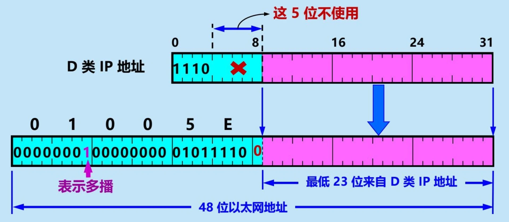

	- 收到多播数据报的主机，还要在 IP 层对 IP 地址进行过滤，把不是本主机要接收的数据报丢弃。

### IP 多播需要两种协议
#### 网际组管理协议 IGMP

- 定义：**网际组管理协议** IGMP（Internet Group Management Protocol）是用于主机和多播路由器之间交换组成员信息的协议，用于指导本局域网上是否有主机加入/退出多播组。

- 发展历程：

	- 标准协议：RFC1112（IGMPv1）

	- 建议标准：RFC2236（IGMPv2）、RFC3376（IGMPv3）

- 作用：使多播路由器知道多播组成员信息（判断有无成员）。
	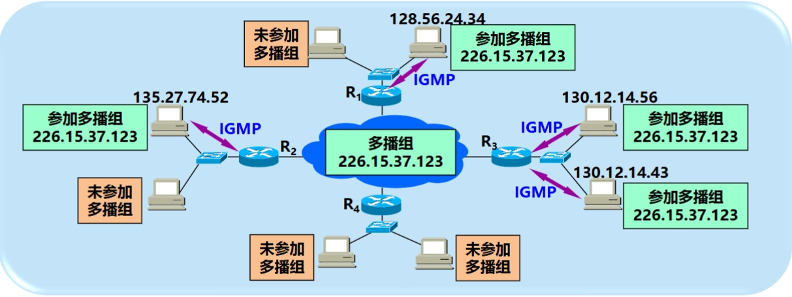

- 特点：

	- IGMP 协议是让连接在本地局域网上的 **多播路由器** 知道本局域网上 **是否有主机参加或退出了某个多播组**。

	- IGMP 不知道 IP 多播组包含的成员数，也不知道这些成员都分布在哪些网络上。

##### IGMP 报文

- IGMP 报文使用 IP 数据报传送。

	- 在 IGMP 报文加上 IP 首部构成 IP 数据报。

	- 但 IGMP 也向 IP 提供服务。

- 因此，不把 IGMP 看成是一个单独的协议，而是整个网际协议 IP 的一个组成部分。

##### IGMP 工作过程

1. 第一阶段：**加入多播组**
	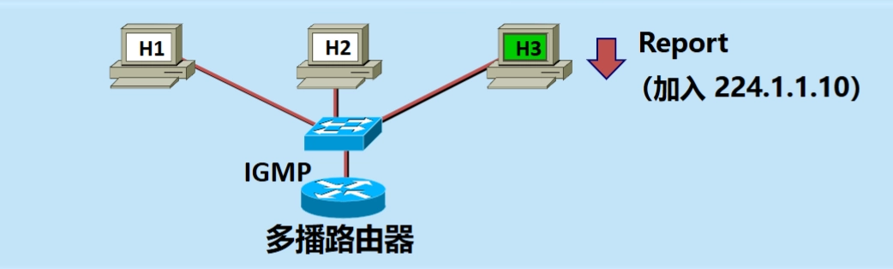

	1. 当某个主机 **加入** 多播组时，该主机向多播组的多播地址发送 IGMP 报文，声明自己要成为该组的成员。

	2. 本地的多播路由器收到 IGMP 报文后，将组成员关系转发给互联网上的其他多播路由器。

2. 第二阶段：**探询组成员变化情况**
	

	1. 本地多播路由器 **周期性** 地探询本地局域网上的主机，以便知道这些主机是否还继续是组的成员。

	2. 只要对某个组有一个主机响应，那么多播路由器就认为这个组是活跃的。

	3. 但如果一个组在经过几次的探询后仍然没有一个主机响应，则不再将该组的成员关系转发给其他的多播路由器。

##### IGMP 避免增加大量开销的措施

- **IP 多播**：所有通信都使用多播方式进行，并尽可能使用 **硬件多播** 传送数据报。

- **统一询问**：对所有的组成员进行周期性的探询时只发送一个 IGMP 询问报文。默认询问速率为 125 秒。

- **选举机制**：当同一个网络上连接有多个多播路由器时，能迅速和有效地选择 **其中的一个** 来探询主机的成员关系。

- **分散响应**：在 IGMP 的询问报文中有一个数值 N，它指明一个 **最长响应时间**（默认值为 10 秒）。当收到询问时，主机在 0 到 N 之间随机选择发送响应所需经过的时延。若一台主机同时参加了几个多播组，则主机对每一个多播组选择不同的随机数。对应于最小时延的响应最先发送。

- **响应抑制**：同一个组内的每一个主机都要监听响应，只要有本组的其他主机先发送了响应，自己就不再发送响应了。

#### 多播路由选择协议

- 定义：**多播路由选择协议** 是用于多播路由器之间交换路由信息的协议，用于指导多播路由器如何转发多播数据报。

- 作用：使多播路由器协同工作，把多播数据报用最小代价传送给多播组的所有成员（找到合适的路由）。

- 特点：

	- 多播转发必须 **动态适应** 多播组成员的变化，即便网络拓扑不变（因为每一台主机可以随时加入或离开一个多播组而不改变网络拓扑）。

	- 多播路由器在转发多播数据报时，不能仅仅根据多播数据报中的目的地址，还要考虑这个多播数据报从什么地方来和要到什么地方去。

		- 多播路由器不应当向没有多播组成员的网络转发多播数据报。

	- 多播数据报可以由没有加入多播组的主机发出，也可以通过没有组成员的接入网络。

- 本质：**找出以源主机为根节点的多播转发树**。

	- 不同的多播组对应于不同的多播转发树。

	- 同一个多播组，对不同的源点也会有不同的多播转发树。

	- $M$ 个源，$N$ 个多播组，需要 $M\times N$ 棵以源为根的多播转发树。

	- 示例：
		

- 几种多播路由选择协议

	- 距离向量多播路由选择协议 DVMRP（Distance Vector Multicast Routing Protocol）：互联网上使用的第一个多播路由选择协议。

	- 基于核心的转发树 CBT（Core Based Tree）

	- 开放最短通路优先的多播扩展 MOSPF（Multicast Extensions to OSPF）

	- 协议无关多播-稀疏方式 PIM-SM（Protocol Independent Multicast-Sparse Mode）：唯一成为互联网标准的多播路由选择协议。

	- 协议无关多播-密集方式 PIM-DM（Protocol Independent Multicast-Dense Mode）

- 多播数据报转发方法：

	1. 洪泛与剪除（flooding and pruning）

	2. 隧道技术（tunneling）

	3. 基于核心的发现技术（core-based discovery）

##### 洪泛与剪除

- 适合场景：较小的多播组，所有组成员接入的局域网也是相邻接的。

- 工作原理：

	- 路由器 **洪泛** 转发多播数据报到所有输出端口。

	- 然后 **剪除** 那些没有多播组成员的分支。

	- 采用 **反向路径广播** RPB（Reverse Path Broadcasting）策略：检查数据来源路径以防止环路。
		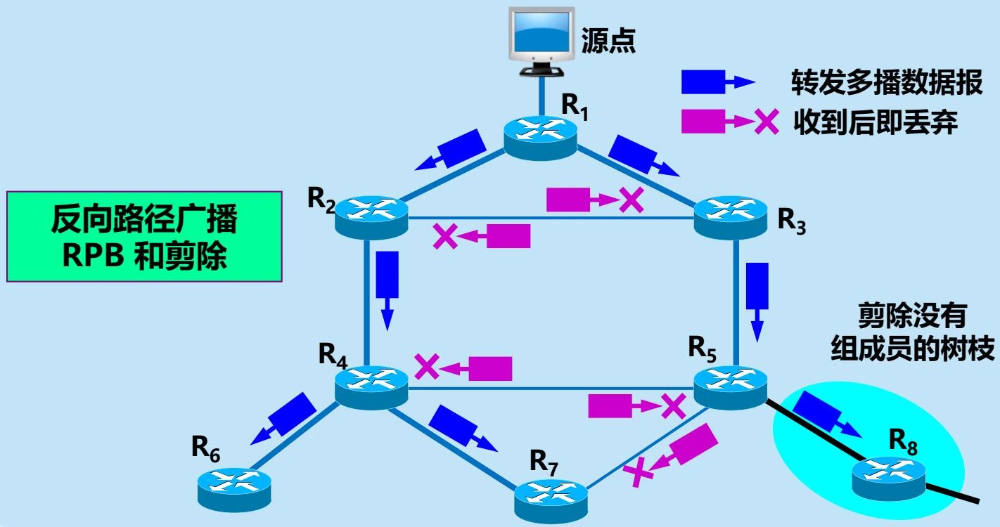

- 反向路径广播 RPB 的要点：

	1. **检查与转发**：依据路由表检查数据报是否是经过 **最短路径** 到达本路由器的。

		- 若是，则把该多播数据报从所有其他输出端口转发出去。

		- 若不是，则丢弃该多播数据报。

		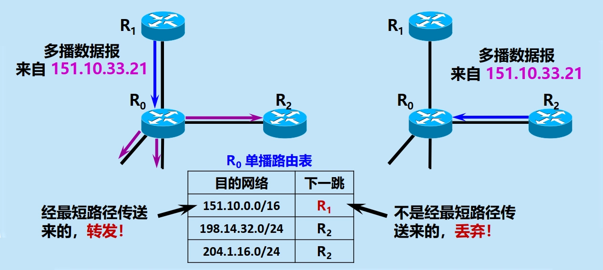

	2. **形成以源为根节点的多播转发树**：如果存在几条同样长度的最短路径，选择 IP 地址最小的。
		

	3. **剪枝与嫁接**

		- 剪枝：如果在多播转发树上的某个路由器发现它的下游树枝（即叶节点方向）已没有该多播组的成员，就把它和下游的树枝一起剪除。

		- 嫁接：当某个树枝有新增加的组成员时，可以再接入到多播转发树上。

		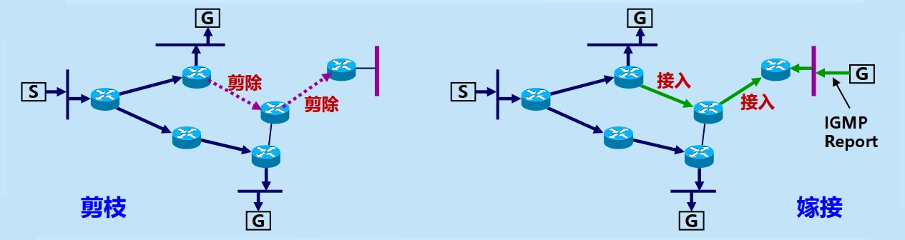

##### 隧道技术

- 适合场景：多播组成员分布在不同的网络上，且这些网络在地理上很分散。

- 工作原理：

	- 多播路由器之间通过 **隧道** 连接起来，形成一个虚拟的多播路由器网络。

	- 多播数据报被封装为普通的单播数据报在隧道中传送。

- 示意图：
	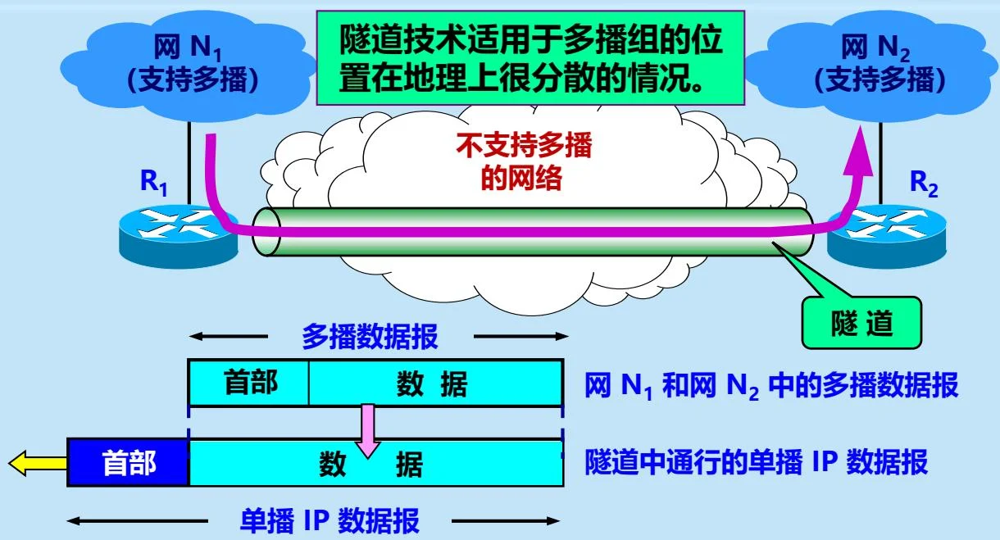

##### 基于核心的发现技术

- 适合场景：多播组的大小在较大范围内变化时。

- 特点：

	- 同时使用了洪泛与剪除和隧道技术。

	- 所有收发端都通过核心路由器接入转发树。

- 工作原理：

	- 初始化：

		- 对每一个多播组 $G$ 指定一个 **核心** 路由器（core router）$R_C$，并全网通告其 IP 单播地址。

		- **以核心路由器为根节点创建多播组 $G$ 的转发树**。

			- 为一个多播组构建一棵转发树，而不是为每个（源，组）组合构建一棵转发树，开销较小，扩展性较好。

	- 成员加入与树扩展（发现过程）

		- 路由器 $R$ 通过 IGMP 发现本地有 $G$ 的成员，则向核心 $R_C$ 单播发送加入请求

		- 沿途路由器检查请求：

			- 若自身不在组 $G$ 的树中，就将单播路径加入转发树，并继续向 $R_C$ 转发请求

			- 若已在树中，则接入本地分支

		- 若加入路径经过不支持多播的网络，则使用隧道技术将请求发送到下一个多播路由器。

	- 数据转发机制：发送端先将多播数据单播到核心 $R_C$，再由核心 $R_C$ 按转发树向所有成员分支洪泛。

	- 成员离开与树剪除

		- 路由器 $R$ 通过 IGMP 发现本地已无 $G$ 的成员，则向核心 $R_C$ 单播发送离开请求

		- 沿途路由器检查请求：

			- 若本地分支上仍有成员，则直接剪枝

			- 若无成员，则剪枝，并继续向 $R_C$ 转发请求。

## 虚拟专用网 VPN 和网络地址转换 NAT
### 虚拟专用网 VPN

- 背景：

	- IP 地址紧缺

	- 互联网安全性

	- 机构内部通信

#### VPN 的基本概念

- **本地地址**：仅在机构内部使用的 IP 地址，可以由本机构自行分配，而不需要向互联网的管理机构申请。

- **全球地址**：全球唯一的 IP 地址，必须向互联网的管理机构申请。

- **专用地址**：专用地址只能用作本地地址，而不能用作全球地址，也称为可重用地址（reusable address）。

	- RFC 1918 指明了一些专用地址（private address）。

		1. A 类：`10.0.0.0/8`

			- 从 `10.0.0.0` 到 `10.255.255.255`

			- 共 1 个 A 类网段

		2. B 类：`172.16.0.0/12`

			- 从 `172.16.0.0` 到 `172.31.255.255`

			- 共 16 个 B 类网段

		3. C 类：`192.168.0.0/16`

			- 从 `192.168.0.0` 到 `192.168.255.255`

			- 共 256 个 C 类网段

	- 互联网中的所有路由器对目的地址是专用地址的数据报一律 **不进行转发**。

- **专用网**：采用专用 IP 地址的互连网络称为专用互联网或本地互联网，简称专用网。

- **虚拟专用网** VPN（Virtual Private Network）：利用公用互联网作为本机构各专用网之间通信载体的专用网。

	- 专用网：指这种网络是为本机构的主机 **用于机构内部通信**，而不是用于和网络外非本机构的主机通信。

	- 虚拟：表示实际上 **没有使用通信专线**，仅在 **效果上** 和专用网一样。

#### VPN 的构建

- **数据加密**：如果专用网不同网点之间的通信必须经过公用的互联网，但又有保密的要求，那么所有通过互联网传送的数据都必须加密。

- **专用软硬件**：必须为每一个场所购买专门的硬件和软件并进行配置，使每一个场所的 VPN 系统都知道其他场所的地址。

- **隧道技术**：在两个 VPN 网关路由器之间建立一个 **虚拟隧道**，通过这个隧道传送加密后的数据报。
	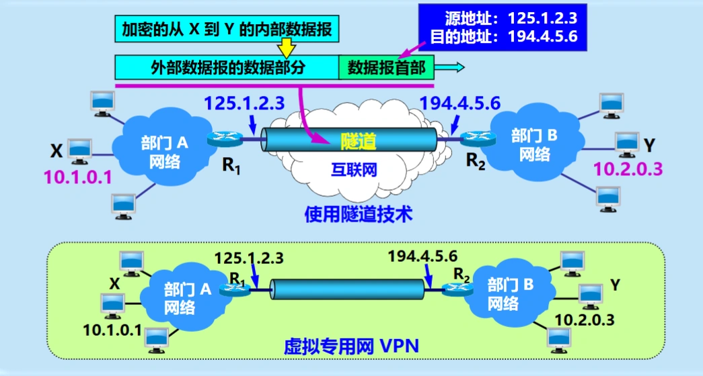

#### VPN 的类型

- **内联网**（intranet）：同一个机构的内部网络所构成的 VPN。

- **外联网**（extranet）：一个机构和某些外部机构共同建立的。

- **远程接入 VPN**（remote access VPN）：允许外部流动员工通过接入 VPN 建立 VPN 隧道访问公司内部网络，好像就是使用公司内部的本地网络访问一样。

### 网络地址转换 NAT
#### NAT 的基本概念

- 定义：**网络地址转换** NAT（Network Address Translation）是一种将专用地址转换为全球地址的技术，实现专用网内的主机与互联网主机之间的通信。

- **NAT 路由器**：连接专用网和互联网的路由器，负责在两种地址之间进行转换。

	- 装有 NAT 软件，至少有一个有效的外部全球 IP 地址。

	- 所有使用本地地址的主机在和外界通信时，都要在 NAT 路由器上将其本地地址转换成全球 IP 地址，才能和互联网连接。

- 特点：

	- 当 NAT 路由器具有 $n$ 个全球 IP 地址时，专用网内最多可以 **同时** 有 $n$ 台主机接入到互联网。

		- 可以使专用网内较多数量的主机轮流使用 NAT 路由器有限数量的全球 IP 地址。

		- 本质上并 **不能** 节省 IP 地址。

	- 通过 NAT 路由器的通信必须由专用网内的主机发起。

		- 专用网内部的主机不能作为服务器，不能被互联网主机访问。

#### 网络地址转换的过程

- 在内部主机与外部主机通信时，在 NAT 路由器上发生了 **两次** 地址转换：

	1. **离开专用网时**：替换 **源地址**，将内部地址替换为全球地址。

	2. **进入专用网时**：替换 **目的地址**，将全球地址替换为内部地址。

- 维护一个 **NAT 地址转换表**，记录专用网内主机的本地地址和对应的全球地址。

- 示意图：
	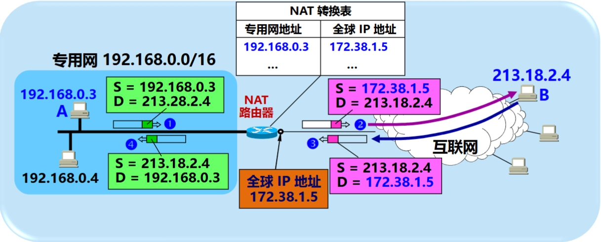

### 网络地址与端口号转换 NAPT

- 定义：**网络地址与端口号转换** NAPT（Network Address and Port Translation）是一种通过将专用地址和运输层端口号转换为全球地址和端口号来节省 IP 地址的技术。

	- 与传统 NAT 不同，NAPT 使用传输层端口号来区分专用网内的不同主机。

- 特点：NAPT 可以使多台拥有本地地址的主机，**共用** 一个全球 IP 地址，**同时** 和互联网上的不同主机进行通信。

- NAPT 的工作原理

	- NAPT 把专用网内 **不同的源 IP 地址转换为相同的全球 IP 地址，将源端口号转换为新的互不相同的端口号**。

	- 收到从互联网发来的应答时，从 IP 数据报的数据部分找出运输层端口号，从 NAPT 转换表中找到正确的目的主机。

- 示例：假设有两台专用网内的主机 `192.168.0.3` 和 `192.168.0.4`，NAPT 路由器使用全球 IP 地址 `172.38.1.5`，则 NAPT 路由器的地址转换表如下：

	| 方向 | 字段 | 旧的 IP 地址和端口号 | 新的 IP 地址和端口号 |
	| ---- | ---- | --------------------- | --------------------- |
	| 出   | 源 IP 地址：TCP 源端口 | `192.168.0.3:30000`   | `172.38.1.5:40001`   |
	| 出   | 源 IP 地址：TCP 源端口 | `192.168.0.4:30000`   | `172.38.1.5:40002`   |
	| 入   | 目的 IP 地址：TCP 目的端口 | `172.38.1.5:40001`   | `192.168.0.3:30000`   |
	| 入   | 目的 IP 地址：TCP 目的端口 | `172.38.1.5:40002`   | `192.168.0.4:30000`   |

## 多协议标签交换 MPLS
### MPLS 的基本概念
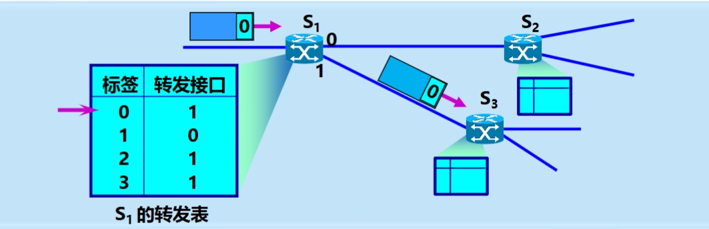

- **多协议标签交换** MPLS（MultiProtocol Label Switching）：是一种在网络层和链路层之间引入一个新的 **标签交换层** 的技术。

	- 含义：

		- 多协议：在 MPLS 的上层可以采用多种协议。

		- 标签：MPLS 利用面向连接技术，使每个分组携带一个叫做标签（label）的小整数。标签交换路由器用标签值检索转发表，实现分组的快速转发。

	- 作用：**提高分组转发的速度**，并支持流量工程和虚拟专用网 VPN。

	- 地位：

		- 互联网建议标准

		- 作为一种 **IP 增强技术**（并没有取代 IP）

	- 特点：

		1. 支持面向连接的服务质量

		2. 支持流量工程，平衡网络负载

		3. 有效地支持虚拟专用网 VPN

- **标记交换路由器** LSR（Label Switching Router）：运行 MPLS 协议的路由器，同时具有标记交换和路由选择这两种功能。

	- **路由选择**：构造并维护转发表

	- **标记交换**：根据转发表和标签值快速转发分组

- **MPLS 域**（MPLS domain）：由运行 MPLS 协议的标记交换路由器 LSR 组成的网络区域。

### MPLS 的工作原理
#### MPLS 基本工作过程


1. **找出标签交换路径 LSP**

	- 各 LSR 使用标签分配协议 LDP（Label Distribution Protocol）交换报文，找出和标签相对应的标签交换路径 LSP（Label Switched Path）。

		- **显式路由选择**（explicit routing）：**由入口 LSR 确定进入 MPLS 域以后的转发路径** 的路由选择方式。

		- 与互联网中通常使用的“每一个路由器逐跳进行路由选择”有着很大的区别。

	- 整个标签交换路径就像一条虚连接一样。

2. **标签引入**

	- 在 MPLS 域的 **入口** 处，入口节点（ingress node）给进入 MPLS 域的 IP 数据报打上 **固定长度标签**（实际上是插入一个 MPLS 首部），并按照转发表把它转发给下一个 LSR。

	- 之后的所有 LSR 都按照标签进行转发。

3. **硬件转发与标签对换**

	- 在 MPLS 域的 **内部**，对打上标签的 IP 数据报在第二层（数据链路层）进行 **硬件转发**。

		- 可以使用多种数据链路层协议，如 PPP、以太网、ATM 以及帧中继等。

	- LSR 的任务：

		1. **标签对换**（label swapping）：LSR 根据标签查找转发表，更新标签（将入标签更换成为出标签）。

			- 一个标签仅在两个 LSR 之间才有意义。

		1. **硬件转发**：LSR 根据标签值查找转发表，决定把数据报从哪个接口转发出去。

			- LSR 只检查标签值，而不检查 IP 首部，从而实现快速转发。

			- 根据下一跳地址查找转发表的过程被省略了，但是将其封装为以太网帧等数据链路层帧的过程仍然保留（也就是说需要将下一跳 IP 地址转换为下一跳的 MAC 地址）。

	- 示例：若有如下转发表，则从入接口 0 收到一个入标签为 3 的 IP 数据报时，转发时应把该 IP 数据报从出接口 1 转发出去，同时把标签对换为 1。
		

4. **标签去除**

	- 在 MPLS 域的 **出口** 处，出口节点（egress node）给即将离开 MPLS 域的 IP 数据报去除标签，并交付给非 MPLS 的主机或路由器。

#### 转发等价类 FEC

- **分类**（classification）：给 IP 数据报打标签的过程。

	- **第三层（网络层）分类**：只使用 IP 首部中的源和目的 IP 地址等。

	- **第四层（运输层）分类**：除了要检查 IP 首部外，运输层还要检查 TCP 或 UDP 端口号。

		- 大多数运营商实现

	- **第五层（应用层）分类**：进一步地检查数据报的内部并考虑其有效载荷。

		- 部分运营商实现

- **转发等价类** FEC（Forwarding Equivalence Class）：路由器按照同样方式对待的 **分组的集合**。

	- 按照同样方式对待：从同样接口转发到同样的下一跳地址，并且具有同样服务类别和同样丢弃优先级等。

	- 示例：

		1. 目的 IP 地址与某一个特定 IP 地址的前缀匹配的 IP 数据报

		2. 所有源地址与目的地址都相同的 IP 数据报

		3. 具有某种服务质量需求的 IP 数据报

	- **FEC 和标签一一对应**：入口节点并不是给每一个 IP 数据报指派一个不同的标签，而是将属于同样 FEC 的 IP 数据报都指派同样的标签。

- FEC 的划分方法：不受限制，由网络管理员来控制。

- FEC 的作用：

	- 可用于负载平衡：自定义的 FEC 可以更好地管理网络的资源。这种均衡网络负载的做法也称为流量工程 TE（Traffic Engineering）或通信量工程。

	- 示例：
		

### MPLS 的首部

- MPLS 首部的长度：4 个字节（32 位）

- MPLS 首部的位置：

	- MPLS 首部处于网络层和数据链路层之间。
		

	- MPLS 采用 **封装技术**：在把 IP 数据报封装成以太网帧之前，先要插入一个 MPLS 首部。

	- MPLS 不要求下层的网络都使用面向连接的技术。

- MPLS 首部的格式：
		

- MPLS 首部的字段：

	1. 标签值：占 20 位，可以同时容纳高达 $2^{20}=1048576$ 个流。

	2. 试验：占 3 位，保留用作试验。

	3. 栈 S：占 1 位，在有“标签栈”时使用。

	4. 生存时间 TTL：占 8 位，用来防止 MPLS 分组在 MPLS 域中兜圈子。

### 新一代的 MPLS

- MPLS 的缺点：

	- 控制协议（如 LDP）比较复杂，扩展性差，运行维护较困难。

	- LDP 协议无法做到基于时延或带宽等要求的流量调度。

	- 为灵活地选择流量的转发路径，还需要再使用 **资源预留协议** RSVP。但是：

		- RSVP 的信令非常复杂，每个节点都要维护一个庞大的链路信息数据库。

		- RSVP 只会选择一条最优路径，**不支持等价多路径路由选择** ECMP（Equal-Cost Multipath Routing）。

- **段路由选择协议** SR（Segment Routing）：是新一代的 MPLS 技术，由思科公司提出并推动成为互联网标准。

	- **段**（segment）：标签，是转发指令的一种标识符。

	- SR 工作原理：

		- 基于标签交换，但不需要使用 LDP 协议。

		- 由源节点为发送的报文指定路径，并将路径转换成有序的段列表（Segment List），即 MPLS 标签栈，它被封装在分组首部。

		- 网络中的其他节点就执行首部中的指令（即标签）进行转发。

	- SDN 控制器（Software Defined Network Controller）：

		- SR 通常和软件定义网络 SDN 结合使用，由 SDN 控制器来完成路径计算和标签分配等任务。

		- 任务：

			- **收集** 并掌握全网的拓扑信息和链路状态信息，**计算** 出分组应传送的整个路径。

			- 给分组 **分配** SR 标签，指明分组从源点到终点的路径。

		> 详见[下文](#sdn_2)

- SRv6（Segment Routing over IPv6）：SR 在 IPv6 网络中的实现方式。

	- SRv6 直接利用 IPv6 字段作为标签寻址（Locator）。

## 软件定义网络 SDN 简介

- **软件定义网络** SDN（Software Defined Network）：是一种新型的网络体系结构，通过 **将网络的控制层面和数据层面分离**，实现网络的集中控制和管理。

- 发展历程：

	- 斯坦福大学 N. McKeown 于 2009 年首先提出。

	- 谷歌于 2010 ~ 2012 年的数据中心网络 B4 进行了运行验证。

- 优点：

	- 提高网络带宽利用率

	- 网络运行更加稳定

	- 管理更加高效简化

	- 运行费用明显降低

### SDN 与 OpenFlow 协议
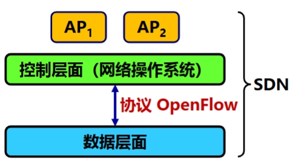

- SDN

	- 是一个 **体系结构**，是一种设计、构建和管理网络的新方法或新概念。

	- 把控制层面和数据层面分离，而让控制层面 **利用软件控制** 数据层面中的许多设备。

- OpenFlow

	- SDN 体系结构中控制层面和数据层面之间的 **通信接口**。

	- 使控制层面的控制器可以对数据层面中的物理或虚拟设备进行 **直接** 访问和操纵。

	- 在逻辑上是 **集中式** 的、**基于流** 的。

- 说明：

	- SDN 不是 OpenFlow。

	- SDN 未规定必须使用 OpenFlow。

### OpenFlow 协议数据层面

- **广义转发**：数据层面的 **分组交换机或 OpenFlow 交换机** 完成“匹配 + 动作”

	- 匹配：对不同层次（链路层，网络层，运输层）首部中的字段进行匹配。

	- 动作：转发，重写，丢弃等。

- **流表**（flow table）：是 OpenFlow 交换机中用于实现广义转发的核心数据结构，规定了“匹配 + 动作”的规则。

	- 每个 OpenFlow 交换机有一个或以上的流表。

	- 每个流表可以包括多个流表项（flow entry）。

	- 示意图：  
		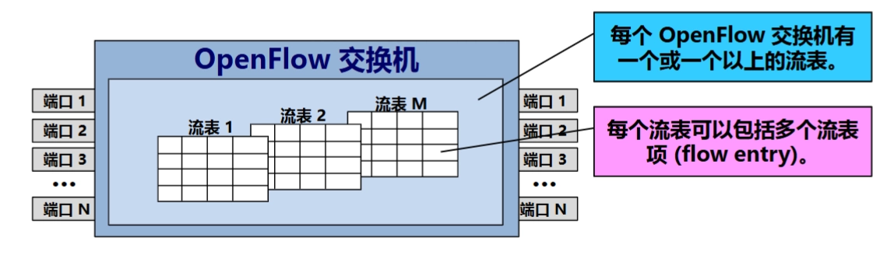

- **流**：穿过网络的一种分组序列，而在此序列中的分组都共享分组首部某些字段的值。

- 流表由远程控制器管理：SDN 远程控制器通过一个安全信道，使用 OpenFlow 协议来管理 OpenFlow 交换机中的流表。

- 流表结构
	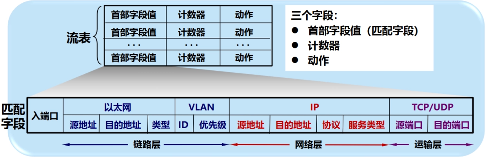

	1. **首部字段值**：一组字段（12 个），用来使入分组的对应首部与之相匹配。

		- 匹配不上的分组：丢弃或发送到远程控制器做更多的处理。

	2. **计数器**：一组计数器，可包括已经与该表项匹配的分组数量，以及从该表项上次更新到现在经历的时间。

	3. **动作**：当分组匹配某个流表项时执行的一组动作。

		- 把分组 **转发** 到指明的端口，或 **丢弃** 该分组，或把分组进行 **复制** 后再从多个端口转发出去，或 **重写** 分组的首部字段（第二、三和四层的首部字段）等。

- 示例：广义转发的多样性和灵活性
	

	1. 简单转发

		- 转发规则：

			- 源：$H_{5}$ 或 $H_{6}$

			- 目的：$H_{3}$ 或 $H_{4}$

			- 路径：$S_{3} \to S_{1} \to S_{2}$

		- 流表
			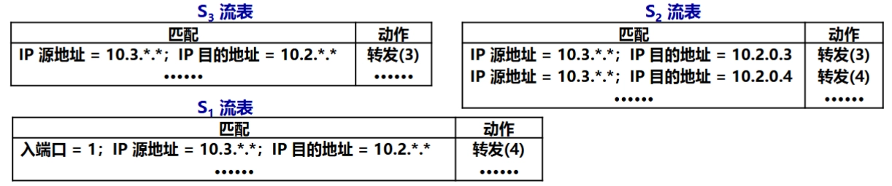

	2. 负载均衡

		- 转发规则：

			- 从 $H_{3}$ 发往主机 `10.1.*.*` 的分组，其转发路径为 $S_{2} \to S_{1}$

			- 从 $H_{4}$ 发往主机 `10.1.*.*` 的分组，其转发路径为 $S_{2} \to S_{3} \to S_{1}$

		- 流表
			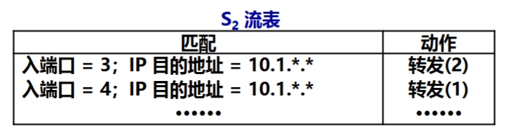

	3. 防火墙

		- 转发规则：$S_{2}$ 中设置了防火墙，仅接收来自与 $S_{3}$ 相连的主机所发送的分组。

		- 流表
			

### SDN 体系结构


- SDN 体系结构的关键特征

	- 基于流的转发：流表规定转发规则。

	- 数据层面与控制层面分离：二者不在同一个设备中。

	- 网络控制功能位于数据层面交换机之外，用软件实现。

	- 可编程的网络。

- SDN 与传统网络的区别

	- SDN

		- 功能分散，交换机、SDN 控制器、网络控制应用程序都是可以分开的实体。

		- 可以由不同的厂商和机构来提供。

	- 传统网络

		- 控制层面、数据层面、协议的实现都垂直集成在一个机器里。

		- 由单独的厂商提供。

### SDN 控制器
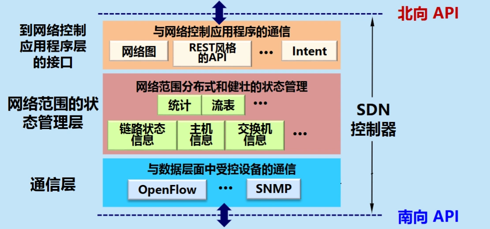

- 定义：**SDN 控制器** 是 SDN 体系结构中负责管理和控制数据层面交换机的核心组件。

- 分层：

	- 到网络控制应用程序的接口

		- SDN 控制器与网络控制应用程序交互的接口称为 **北向接口**。

		- 北向接口允许网络控制应用程序对状态管理层里的网络状态和流表进行读写操作。

	- 网络范围的状态管理层：完成核心功能

		- 管理和维护链路、主机、交换机等网络状态。

		- 确定和维护流表等。

	- 通信层

		- 通信层与数据层面的接口叫做 **南向接口**，基本上采用 OpenFlow。

		- 完成 SDN 控制器与受控网络设备之间的通信。