# 传输层

- [Back to Course Home](index.md)

## 传输层基本概念
### 进程之间的通信

- 传输层的位置：
	

- 传输层的作用：提供应用进程之间的**逻辑通信**。
	- 屏蔽作用：传输层向高层用户屏蔽了下面网络核心的细节（如网络拓扑、所采用的路由选择协议等），使应用进程看见的就是好像在两个传输层实体之间有一条端到端的逻辑通信信道。
	- 端到端通信：传输层实体在通信时，**不关心**数据报在网络中经过了哪些路由器和链路。
- 传输层的通信对象：**进程**（process）
	- 进程：正在运行的程序实例。
	- 主机可以同时运行多个进程。
	- 传输层的任务：为不同的进程提供通信服务。
- 可靠信道与不可靠信道
	- **可靠信道**：使用面向连接的传输协议（如 TCP）建立的信道。
	- **不可靠信道**：使用无连接的传输协议（如 UDP）建立的信道。
	- 示意图
		

### 传输层的主要协议：UDP 和 TCP

- 互联网的正式标准：
	1. **用户数据报协议** UDP（User Datagram Protocol）
	2. **传输控制协议** TCP（Transmission Control Protocol）
- **传输协议数据单元** TPDU（Transport Protocol Data Unit）：两个对等传输实体在通信时传送的数据单位。
	- UDP 传送的数据单位：**UDP 报文**或**用户数据报**
	- TCP 传送的数据单位：**TCP 报文段**（segment）
- UDP 与 TCP 的区别
	- UDP
		- 传送数据之前不需要先建立连接。
		- 收到 UDP 报后，不需要给出任何确认。
		- 不提供可靠交付，但是一种最有效的工作方式。
	- TCP
		- 提供可靠的、面向连接的传输服务。
		- 不提供广播或多播服务。
		- 开销较多。
- 使用 UDP 和 TCP 的典型应用和应用层协议
	

### 传输层的端口
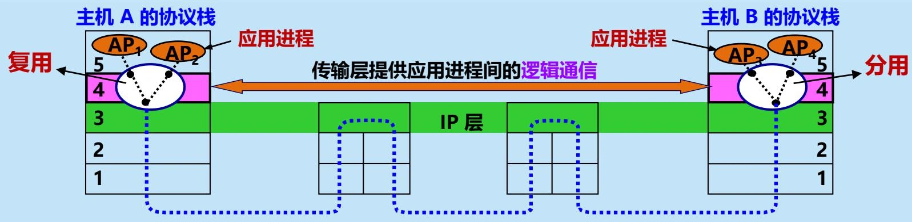

- 传输层的复用与分用
	- **复用**：应用进程都可以通过传输层再传送到 IP 层（网络层）。
	- **分用**：传输层从 IP 层收到发送给应用进程的数据后，必须分别交付给指明的各应用进程。
- **端口号**（protocol port number）
	- 进程标识的问题：
		- 进程的创建和撤销都是**动态**的，因此发送方几乎无法识别其他机器上的进程。
		- 我们往往需要利用目的主机提供的功能来识别终点，而不需要知道具体实现这个功能的进程是哪一个。
		- 有时我们会改换接收报文的进程，但并不需要通知所有的发送方。
	- 解决方法：在传输层使用**协议端口号**（protocol port number），或通常简称为**端口**（port）。**把端口设为通信的抽象终点**。
		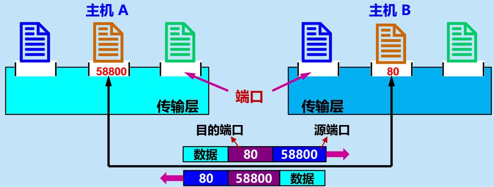

- 软件端口与硬件端口
	- 软件端口
		- 协议栈层间的**抽象的协议端口**。
		- 是应用层的各种协议进程与传输实体进行层间交互的地点。
		- 不同系统实现端口的方法可以不同。
	- 硬件端口
		- 不同硬件**设备进行交互的接口**。
- TCP/IP 传输层端口的标志
	- 端口用一个 **16 位端口号**进行标志，允许有 65,535 个不同的端口号。
	- 端口号只具有**本地意义**，只是为了标志本计算机应用层中的各进程。
	- 在互联网中，不同计算机的相同端口号没有联系。
- 端口分类
	- 服务端使用的端口号：0 ~ 49151
		- **熟知端口**（well-known port）：0 ~ 1023
			- 由互联网分配号码管理局 IANA 统一管理和分配，全球通用。
			- 一些常用的应用层协议都使用熟知端口号。
		- **登记端口**（registered port）：1024 ~ 49151
			- 在 IANA 登记注册后使用
	- 客户端使用的端口号：49152 ~ 65535
		- **短暂端口**（ephemeral port）：49152 ~ 65535
			- 通信结束后会被系统收回。

	

- 常用的熟知端口
	- UDP
		- RPC：111
		- DNS：53
		- TFTP：69
		- SNMP：161
		- DHCP：67（服务器），68（客户端）
	- TCP
		- FTP：20（数据），21（控制）
		- SSH：22
		- Telnet：23
		- SMTP：25
		- HTTP：80
		- POP3：110
		- IMAP：143
		- HTTPS：443

## 用户数据报协议 UDP
### UDP 概述

- UDP 只在 IP 的数据报服务之上增加了一些功能：
	1. 复用和分用
	2. 差错检测
- UDP 通信的特点：**简单方便，但不可靠**

#### UDP 的主要特点

1. **无连接**：发送数据之前不需要建立连接。
2. **尽最大努力交付**：不保证可靠交付。
3. **面向报文**：UDP 一次传送和交付一个完整的报文。
4. **没有拥塞控制**：网络出现的拥塞不会使源主机的发送速率降低。很适合多媒体通信的要求。
5. 支持**一对一、一对多、多对一、多对多**等交互通信。
6. **首部开销小**，只有 8 个字节。

#### UDP 是面向报文的

- 面向报文的含义：
	- **发送方** UDP 对应用层交下来的报文，既不合并也不拆分，原封不动地封装成 UDP 用户数据报交给 IP 层，一次发送一个完整的报文。
	- **接收方** UDP 对 IP 层交上来的 UDP 用户数据报，去除首部后就原封不动地交付上层的应用进程，一次交付一个完整的报文。
- 应用程序必须选择**合适大小**的报文。
	1. 若报文太长，IP 层在传送时可能要进行分片，降低 IP 层的效率。
	2. 若报文太短，会使 IP 数据报的首部的相对长度太大，降低 IP 层的效率。

#### UDP 通信和端口号的关系

- **复用**：发送方将 UDP 用户数据报组装成不同的 IP 数据报，发送到互联网。
- **分用**：接收方根据 UDP 用户数据报首部中的目的端口号，将数据报分别传送到相应的端口，上交给应用进程。
	- 如果发现报文中的目的端口号不正确（即不存在对应于该端口号的应用进程），则丢弃该报文，并由 ICMP 发送“端口不可达”差错报文给发送方。

### UDP 的首部

- UDP 首部的长度：8 个字节
- UDP 首部的格式：
	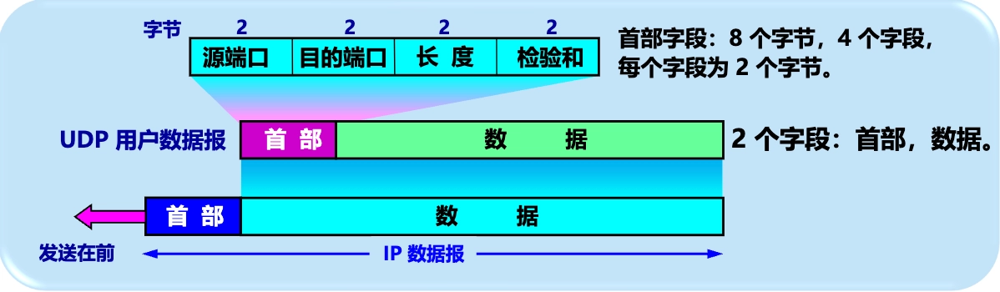

- UDP 首部的字段：
	1. **源端口**：占 2 字节，表示源端口号。在需要对方回信时选用。不需要时可用全 0 。
	2. **目的端口**：占 2 字节，表示目的端口号。终点交付报文时必须使用。
	3. **长度**：占 2 字节，表示 UDP 用户数据报的长度，其最小值是 8（仅有首部）。
	4. **检验和**：占 2 字节，用于检测 UDP 用户数据报在传输中是否有错，有错则直接丢弃。
- UDP 伪首部：
	- 定义：用于计算检验和的**辅助结构**，并不实际传送。
	- 字段：
		1. 源 IP 地址：4 字节
		2. 目的 IP 地址：4 字节
		3. 保留字段：1 字节，值全为 0
		4. 协议字段：1 字节，UDP 的协议号是 17
		5. UDP 长度字段：2 字节，与 UDP 首部中的长度字段相同
	- 作用：在计算检验和时，临时把 12 字节的伪首部和 UDP 用户数据报连接在一起进行计算，得到的结果填入 UDP 首部的检验和字段。
	- 计算方法：每 16 位为一组，按位取反加和，再对结果取反。
	- 示例：
		

## 传输控制协议 TCP
### TCP 概述
#### TCP 的主要特点

1. **面向连接**：TCP 是面向连接的传输层协议。
2. **点对点连接**：每一条 TCP 连接**只能有两个端点**（endpoint），每一条 TCP 连接只能是点对点的（一对一）。
3. **可靠交付**：TCP 提供可靠交付的服务。
4. **全双工通信**：TCP 提供全双工通信。
5. **面向字节流**：TCP 是面向字节流的协议。

#### TCP 是面向字节流的

- 字节流（stream）：流入或流出进程的**字节序列**。
- 面向字节流的含义：
	- 虽然应用程序和 TCP 的交互是一次一个数据块，但 TCP 把应用程序交下来的数据看成仅仅是一连串无结构的字节流
	- TCP 不保证接收方应用程序所收到的数据块和发送方应用程序所发出的数据块具有对应大小的关系。
	- 但接收方应用程序收到的字节流必须和发送方应用程序发出的字节流完全一样。

- 特点：
	- TCP 不关心应用进程一次把多长的报文发送到 TCP 缓存。
	- TCP 根据对方给出的窗口值和当前网络拥塞程度来决定一个报文段应包含多少个字节，形成 TCP 报文段。

#### TCP 是面向连接的

- TCP 把连接作为最基本的抽象。
	

- TCP 连接的端点：套接字（socket）或插口。
- **套接字**（socket）：是传输层与应用层之间的接口，是传输层对应用进程的标识。
	- 组成：$\text{socket} = (\text{IP}:\text{port})$
		1. 主机的 IP 地址
		2. 主机上的端口号
	- 每一条 TCP 连接唯一地被通信两端的两个端点（即两个套接字）所确定：
		- TCP 连接 = $\{\text{socket}_1,\text{socket}_2\} = \{(\text{IP}_1:\text{port}_1),(\text{IP}_2:\text{port}_2)\}$
- 说明：
	- 同一个 IP 地址可以有多个不同的 TCP 连接。
	- 同一个端口号也可以出现在多个不同的 TCP 连接中。

### TCP 报文段

- TCP 虽然是面向字节流的，但 TCP 传送的数据单元却是报文段。
- TCP 报文段首部的长度：$4n$ 字节（$5 \leq n \leq 15$，$n \in \mathbb{Z}$）
	- 前 20 个字节是固定的，后面是根据需要而增加的选项，选项最长可达 40 字节。
	- 因此 TCP 首部的**最小长度是 20 字节**，最大长度是 60 字节。

#### TCP 首部字段

- **源端口和目的端口**：各占 2 字节。端口是传输层与应用层的服务接口。传输层的复用和分用功能通过端口实现。
- **序号**：占 4 字节，用于字节流的可靠传输。TCP 连接中传送的数据流中的**每一个字节都有一个序号**，序号字段的值是**本报文段所发送的数据的第一个字节的序号**。
	- 现有 5000 个字节的数据。假设报文段的最大数据长度为 1000 个字节，初始序号为 1001。
		- 报文段 1 序号 = 1001（数据字节序号：1001 ~ 2000）
		- 报文段 2 序号 = 2001（数据字节序号：2001 ~ 3000）
		- 报文段 3 序号 = 3001（数据字节序号：3001 ~ 4000）
		- 报文段 4 序号 = 4001（数据字节序号：4001 ~ 5000）
		- 报文段 5 序号 = 5001（数据字节序号：5001 ~ 6000）
- **确认号**：占 4 字节，表示期望收到对方的下一个报文段的数据的第一个字节的序号。
	- 若确认号 = N，则表明到序号 N - 1 为止的所有数据都已正确收到。
- **数据偏移**（即首部长度）：占 4 位，指出 TCP 报文段的数据起始处距离 TCP 报文段的起始处有多远。单位是 32 位字（以 **4 字节**为计算单位）。
- **保留字段**：占 6 位，保留为今后使用，但目前应置为 0。
- **紧急** URG：控制位，表示紧急指针字段是否有效。
	- 当 URG = 1 时，表明紧急指针字段有效，告诉系统此报文段中有紧急数据，应尽快传送（相当于高优先级的数据）。
- **确认** ACK：控制位，表示确认号字段是否有效。
	- 只有当 ACK = 1 时，确认号字段才有效。当 ACK = 0 时，确认号无效。
- **推送** PSH（PuSH）：控制位，用来提示接收方应用进程立即交付数据。
	- 收到 PSH = 1 的报文段后，需要尽快交付接收应用进程，而不再等到整个缓存都填满后再交付。
- **复位** RST（ReSeT）：控制位，用来差错恢复。
	- 当 RST = 1 时，表明 TCP 连接中出现严重差错（如主机崩溃或其他原因），必须释放连接，然后再重新建立传输连接。
- **同步** SYN（SYNchronization）：控制位，用来建立连接。
	- 同步 SYN = 1 表示这是一个连接请求或连接接受报文。
		- 当 SYN = 1，ACK = 0 时，表明这是一个连接请求报文段。
		- 当 SYN = 1，ACK = 1 时，表明这是一个连接接受报文段。
- **终止** FIN（FINish）：控制位，用来释放一个连接。
	- FIN = 1 表明此报文段的发送端的数据已发送完毕，并要求释放传输连接。
- **窗口**：占 2 字节。窗口值告诉对方从本报文段首部中的确认号算起，接收方目前允许对方发送的数据量（**以字节为单位**）。
	- 窗口字段明确指出了现在允许对方发送的数据量。
	- 窗口值是动态变化的，随接收方缓存的使用情况而变化。
- **检验和**：占 2 字节。检验和字段检验的范围包括首部和数据两部分。
	- 与 UDP 相同，在计算检验和时，临时把 12 字节的“伪首部”和 TCP 报文段连接在一起。伪首部仅仅是为了计算检验和。
		

- **紧急指针**：占 2 字节。在 URG = 1 时，指出本报文段中的紧急数据的字节数（紧急数据结束后就是普通数据），指出了紧急数据的末尾在报文段中的位置。
- **选项**：长度可变，最长可达 40 字节。
- **填充**：使整个 TCP 首部长度是 4 字节的整数倍。

#### 选项：最大报文段长度 MSS

- **最大报文段长度选项** MSS（Maximum Segment Size）：占 2 字节，表示每个 TCP 报文段中的数据字段的最大长度。
	

	- TCP 报文段长度 = 数据字段长度（MSS）+ TCP 首部长度
	- IP 数据报长度（MTU） = TCP 报文段长度 + IP 首部长度
	- 以太网帧长度 = MTU + 以太网首、尾部长度
- MSS 与接收窗口值没有关系。
- 取值要求
	- 不能太小
		- 网络利用率降低。
		- 例如：仅 1 个字节。利用率就不会超过 1/41
	- 不能太大
		- 开销增大。
		- IP 层传输时要分片，终点要装配。
		- 分片传输出错时，要整个分组。
	- 应尽可能大
		- 只要在 IP 层传输时不再分片。
		- 默认值 = 536 字节。
			- TCP 报文段长度 = 536 + 20~60 = 556~576 字节。
			- IP 数据报长度 = 556~576 + 20~60 = 576~636 字节。
- TCP 连接建立时，双方交换 MSS 值。

#### 选项：窗口扩大

- TCP 窗口字段占 2 字节（16 位），最大窗口大小 $= (2^{16}-1)~bit \approx 64~KB$。
	- 对于传播时延和带宽都很大的网络，为获得高吞吐率较，需要更大的窗口。
		

- **窗口扩大选项**：占 3 字节，最重要的字段：
	- 移位值 $S$：占 1 字节，表示窗口值要左移的位数，最大值为 14。
		- 表示：新的窗口值位数从 $16$ 增大到  $(16 + S)$，最大窗口大小扩大为 $2^{S}$ 倍。
		- 最大窗口大小的最大值：$(2^{(16 + 14)} - 1)~bit = (2^{30} - 1)~bit \approx 1GB$。
- 窗口扩大选项可以在双方初始建立 TCP 连接时进行协商。

#### 选项：时间戳

- **时间戳选项**：占 10 字节。最主要的 2 个字段：
	- 时间戳值字段（TSval）：4 字节
	- 时间戳回送回答字段（TSecr）：4 字节
- 主要功能：
	1. 计算往返时间 RTT
		- 发送方 A 在发送报文段时，把当前时间写入时间戳值字段 TSval 中。接收方 B 在收到该报文段后，把该时间戳值原封不动地放入回送回答字段 TSecr 中，并连同确认号一起发送给 A。A 在收到 B 的确认报文段时，就可以根据当前时间和 TSecr 字段中的时间计算出 RTT = 当前时间 - TSecr。
	2. 防止序号绕回 PAWS（Protect Against Wrapped Sequence numbers）
		- 序号重复时，为了使接收方能够把新报文段和迟到很久的旧报文段区分开，可以在报文段中加上时间戳。

#### 选项：选择确认 SACK

- **选择确认选项** SACK（Selective Acknowledgment）：长度可变，一般为 10 或 18 字节。
- 作用：允许接收方告诉发送方哪些数据已经正确收到，从而使发送方只重传那些丢失的数据，而不是像累积确认那样重传所有未被确认的数据。

> 详见[下文](#sack)

## TCP 的滑动窗口协议

- **滑动窗口协议**：发送方 A 和接收方 B 分别维持一个发送窗口和一个接收窗口。
	- **发送窗口**：在没有收到确认的情况下，发送方可以连续把窗口内的数据全部发送出去。凡是已经发送过的数据，在未收到确认之前都必须暂时保留，以便在超时重传时使用。
	- **接收窗口**：只允许接收落入窗口内的数据。
- TCP 的滑动窗口是**以字节为单位**的。

### 发送缓存与发送窗口

- **发送缓存**：
	

	- 发送缓存：
		- 发送方的应用进程把字节流写入 TCP 发送缓存中。
			- 不能发送太快，否则发送缓存会溢出。
		- 发送缓存中的数据通常分为四类：
			1. 已发送且已收到确认的数据（可释放）
			2. 已发送但未收到确认的数据（在发送窗口中等待确认）
			3. 未发送但可发送（在发送窗口内等待发送）
			4. 未发送且不可发送（超出发送窗口，等待窗口滑动）
		- 发送缓存中的字节数 = 发送应用程序最后写入缓存的字节 - 最后被确认的字节
	- 发送窗口：
		- 发送窗口定义了允许发送的字节范围。
		- 发送窗口的大小受发送缓存大小的限制，即发送窗口的只是发送缓存的一部分。
		- TCP 从发送缓存中取出位于发送窗口内的数据，组装成 TCP 报文段发送出去。
- **发送窗口** swnd：
	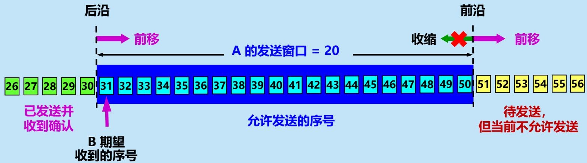

	- 发送窗口的大小：发送方 A 根据接收方 B 给出的**窗口值**，构造出自己的发送窗口。
		- 窗口越大，发送方就可以在收到对方确认之前连续发送更多的数据，因而可能获得更高的传输效率。
		- 窗口的前沿只允许前移，不允许后退。
	- 前后沿：发送窗口的前沿和后沿分别由**确认号**和**窗口值**决定。
		- 后沿 = 确认号（B 期望收到的下一个字节序号）
		- 前沿 = 确认号 + 窗口值
	- 当前位置：表示发送方已经发送的字节流中的最后一个字节的下一个字节序号。
- 发送窗口的前后沿将字节流**序号**划分为三部分：
	1. 后沿之后：已发送并收到确认的字节序号。
	2. 窗口内部：允许发送的字节序号。
		- 当前位置之前：已发送但尚未收到确认的字节序号。
		- **可用窗口**（当前位置之后）：允许发送但尚未发送的字节序号。
	3. 前沿之前：尚未允许发送的字节序号。
- 示例：假定 A 发送了序号为 31~41 共 11 个字节的数据
	

	- $P_1 =$ 后沿，$P_2 =$  当前， $P_3 =$ 前沿。 
	- $P_{3} - P_{1} =$ A 的发送窗口（又称为通知窗口）
	- $P_2 - P_1 =$ 已发送但尚未收到确认的字节数
	- $P_3 - P_2 =$ 允许发送但尚未发送的字节数（又称为可用窗口）

### 接收缓存与接收窗口

- **接收缓存**：
	

	- 接收方的应用进程从 TCP 接收缓存中读取尚未被读取的字节。
		- 若读取不及时，缓存会被填满，导致接收窗口变为 0
		- 若及时读取，接收窗口就可以增大，但最大也不能超过接收缓存的大小。
	- 接收缓存中的数据通常分为三类：
		1. 已被应用进程读取的数据（可释放）
		2. 按序到达但尚未被接收应用进程读取的数据（在接收缓存中等待读取）
		3. 未按序到达的数据（暂时存放在接收缓存中，等待按序交付）
- **接收窗口** rwnd：
	- 接收窗口的大小：接收方 B 根据接收缓存的使用情况，动态地调整自己的接收窗口大小，并把该窗口值通知给发送方 A。
	- 前后沿：接收窗口的前沿和后沿分别由**确认号**和**窗口值**决定。
		- 后沿 = 确认号（B 期望收到的下一个字节序号）
		- 前沿 = 确认号 + 窗口值
- 接收窗口的前后沿将字节流序号划分为三部分：
	1. 后沿之后：已发送确认并交付给应用程序的字节序号。
	2. 窗口内部：允许接收的字节序号。
		- 将收到的字节序号放入窗口，若按序到达，则交付给应用程序；否则，暂时存放在接收缓存中，等待按序交付。
		- 发送确认报文段时，确认号为按序到达的最后一个字节的下一个字节序号（即第一个没收到的字节序号）。
	3. 前沿之前：尚未允许接收的字节序号。
- 示例：
	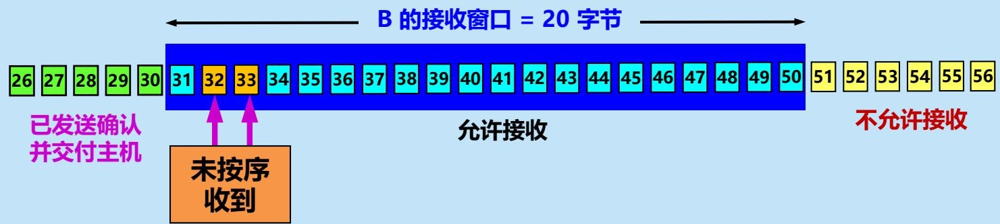

	- B 收到了序号为 32 和 33 的数据，但未收到序号为 31 的数据。
	- 因此，因此发送的确认报文段中的确认号是 31（即期望收到的序号）。

### 窗口的滑动

- 发送窗口和接收窗口都可以向前滑动。
	- 发送窗口：每当发送方收到对某些字节的确认，且前序字节都已被确认时，发送窗口就向前滑动到相应的字节。
	- 接收窗口：每当接收方按序收到某些字节，交付给应用程序并发送确认后，接收窗口就向前滑动到相应的字节。

## TCP 的可靠传输

- IP 网络提供的是不可靠的传输
	

- 理想传输条件
	- 特点
		1. 传输信道不产生差错。
		2. 不管发送方以多快的速度发送数据，接收方总是来得及处理收到的数据。
	- 在理想传输条件下，不需要采取任何措施就能够实现可靠传输。
	- 但实际网络都不具备理想传输条件。必须使用一些可靠传输协议，在不可靠的传输信道实现可靠传输。

### 自动重传请求协议 ARQ 

- **自动重传请求**（Automatic Repeat reQuest，ARQ）协议：发送方在发送数据后，自动等待接收方的确认；若在规定时间内没有收到确认，就自动重传数据。
- ARQ 协议的基本思想：**差错检测** + **确认应答** + **超时重传**
	1. 差错检测：接收方对收到的数据进行差错检测，若数据无差错则发送确认，否则丢弃数据。
	2. 确认应答：接收方对正确收到的数据发送确认报文段。
	3. 超时重传：发送方为每个发送的数据设置一个超时计时器，若在规定时间内没有收到确认，就自动重传数据。

#### 停止等待 ARQ 协议
##### 基本思想

- 每发送完一个分组就**停止**发送，**等待**对方的确认。在收到确认后再发送下一个分组。
- 全双工通信的双方既是发送方也是接收方，假设仅考虑 A 发送数据，而 B 接收数据并发送确认。因此 A 叫做发送方，而 B 叫做接收方。

##### 要点

- **停止等待**：发送方每次只发送一个分组。在收到确认后再发送下一个分组。
- **暂存**：在发送完一个分组后，发送方必须暂存已发送的分组的副本，以备重发。
- **编号**：对发送的每个分组和确认都进行编号。
- **超时重传**：发送方为发送的每个分组设置一个超时计时器。若超时计时器超时未收到确认，发送方会自动超时重传分组。
	- 超时计时器的重传时间应当比数据在分组传输的平均往返时间更长一些，防止不必要的重传。

##### 工作原理

- 无差错情况
	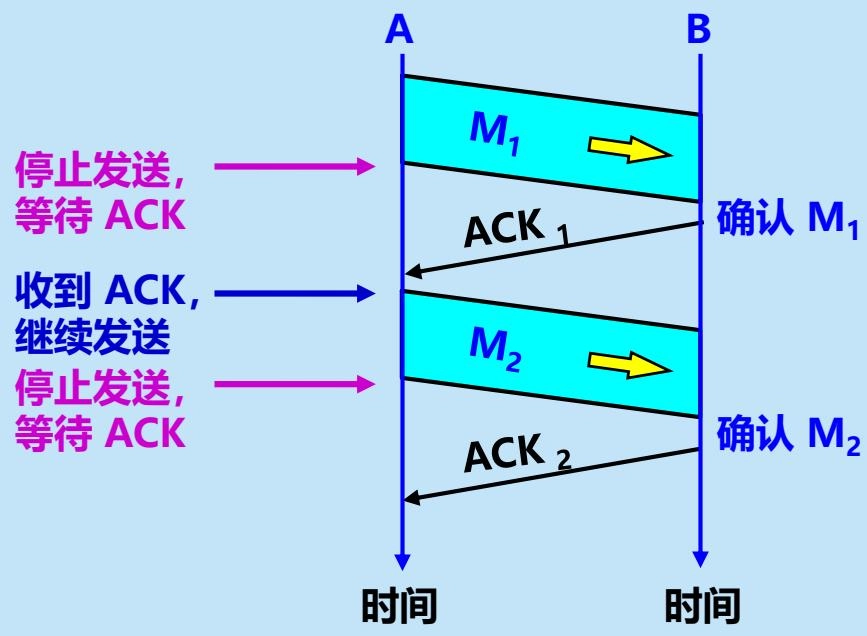

	- A 发送完分组 $M_{1}$ 后就暂停发送，等待 B 的确认 $ACK$。
	- B 收到 $M_{1}$ 向 A 发送 $ACK$。
	- A 在收到了对 $M_{1}$ 的确认后，就再发送下一个分组 $M_{2}$。
- 出现差错
	

	- 两种情况：在这两种情况下，B 都不会发送任何信息
		1. B 接收 $M_{1}$ 时，检测出**差错**并丢弃 $M_{1}$，其他什么也不做（不通知 A 收到有差错的分组）。
		2. $M_{1}$ 在传输过程中**丢失**，这时 $B$ 什么都不知道，也什么都不做。
	- **超时重传**：
		1. A 为每一个已发送的分组设置一个超时计时器。
		2. A 只要在超时计时器到期之前收到了相应的确认，就撤销该超时计时器，继续发送下一个分组 $M_{2}$  。
		3. 若 A 在超时计时器规定时间内没有收到 B 的确认，就认为分组错误或丢失，就**重发**该分组。
- 确认丢失和确认迟到
	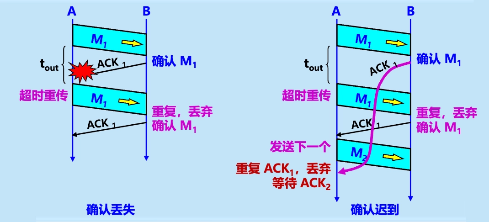

	- **确认丢失**
		1. 若 B 所发送的对 $M_{1}$ 的确认丢失了，那么 A 在设定的超时重传时间内将不会收到确认，因此 A 在超时计时器到期后将重传 $M_{1}$。
		2. 假定 B 正确收到了 A 重传的分组 $M_{1}$，则 B **丢弃**重复的 $M_{1}$，不向上层交付，并向 A **重传确认**分组。
		3. A 收到确认后，继续发送下一个分组 $M_{2}$。
	- **确认迟到**
		1. 若 B 所发送的对 $M_{1}$ 的确认迟到了，那么 A 在超时计时器到期后重传 $M_{1}$。
		2. B 会收到重复的 $M_{1}$，则**丢弃**重复的 $M_{1}$ 并**重传确认**分组。
		3. 由于第一个确认只是迟到而非丢失，A 会收到对 $M_{1}$ 的重复确认，则**丢弃**该重复确认即可。

##### 优缺点

- 优点：简单。
- 缺点：信道利用率太低。
	- **信道利用率**：$U = \frac{T_{D}}{T_{D} + RTT + T_{A}}$
		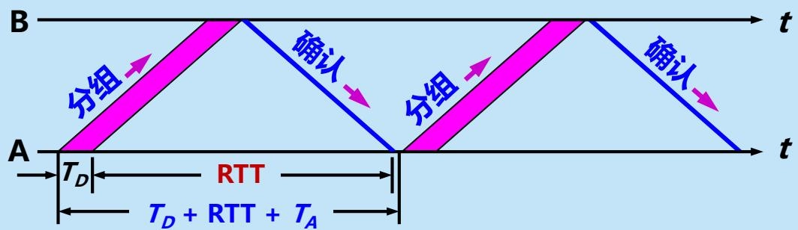

	- 当往返时间 $RTT \gg T_{D}$ 时，信道的利用率非常低。

#### 回退 N 帧连续 ARQ 协议
##### 基本思想

- **流水线传输**：在收到确认之前，发送方**连续**发出多个分组。
	

	- 发送方允许在等待确认的同时，继续发送后续的分组，从而提高信道利用率。
- **回退 N 帧**（Go-back-N）的重传方式：
	- 接收方只对按序到达的分组进行确认，对乱序到达的分组直接丢弃不予确认。
	- 发送方只要发现某个分组出错或丢失，就**重传该分组及其后面所有未被确认的分组**。

##### 优缺点

- 优点：容易实现，即使确认丢失也不必重传。
- 缺点：不能向发送方反映出接收方已经正确收到的所有分组的信息。

##### 连续 ARQ 协议的要点

- **发送窗口**：发送方维持一个发送窗口，位于发送窗口内的分组都可被连续发送出去，而不需要等待对方的确认。
- **发送窗口滑动**：发送方每收到一个确认，就把发送窗口向前滑动一个分组的位置。
	

- **累积确认**：接收方对**按序到达的最后一个分组**发送确认，表示到这个分组为止的所有分组都已正确收到了。
	

#### 选择重传连续 ARQ 协议
##### 基本思想

- **流水线传输**：在收到确认之前，发送方**连续**发出多个分组。
- **选择重传**（Selective Repeat）的重传方式：
	- 接收方可以接收乱序到达的分组，并使用**选择确认**（Selective Acknowledgment，SACK）机制向发送方报告哪些分组已经正确收到。
	- 发送方只重传那些被接收方判定为出错或丢失的分组，而不是像回退 N 那样重传所有未被确认的分组。

##### 选择确认 SACK

- 定义：选择确认 SACK（Selective ACK）允许接收方告诉发送方哪些数据已经正确收到，从而使发送方只重传那些丢失的数据，而不是像累积确认那样重传所有未被确认的数据。
- RFC 2018 对 SACK 的规定
	- 如在建立 TCP 连接时，要在 TCP 首部的选项中加上**允许 SACK 选项**，且双方必须事先商定好。
		- 允许 SACK 选项：长度 2 字节
			- 第 1 字节：选项类型，值为 4
			- 第 2 字节：选项长度，值为 2
	- 原来首部中的确认号的用法不变（累积确认）。
	- 双方在 TCP 首部中增加 **SACK 选项**，以便报告收到的不连续的字节块的边界。
		- SACK 选项：长度可变，一般为 10/18/26/34 字节。
			- 第 1 字节：选项类型，值为 5
			- 第 2 字节：选项长度
			- 后面每 8 字节表示一个已正确收到的数据块的边界，**最多 4 个数据块**。
				- 前 4 字节：左边界，即已确认的数据块第一个字节的序号
				- 后 4 字节：右边界，即已确认的数据块最后一个字节的序号 + 1
- 示例：假设最大报文段长度 MSS = 5000 字节，起始序号为 1，接收方收到连续字节流 1 ~ 1000 和不连续的两个字节块 1501 ~ 3000、3501 ~ 4500，则：
	- 确认号：1001
	- SACK 选项：
		- 选项类型：5
		- 选项长度：18
		- 第 1 个数据块边界：1501（左边界），3001（右边界）
		- 第 2 个数据块边界：3501（左边界），4501（右边界）
	- 示意图：
		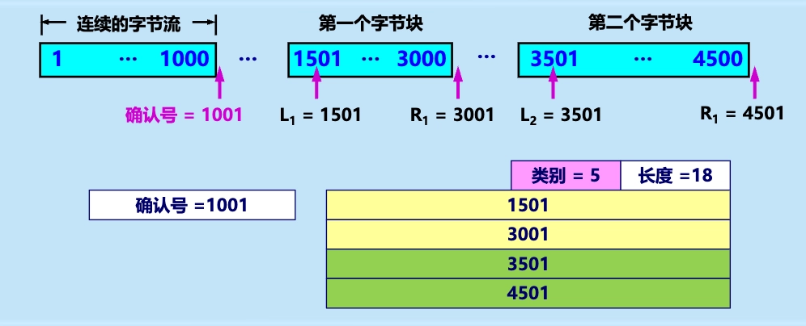

- D-SACK（Duplicate SACK）：
	- 用于通知发送方它所重传的报文段实际上是重复的。
	- D-SACK 选项与 SACK 选项格式相同，但选项类型字段值为 6。
	- 接收方在收到重复报文段时，发送 D-SACK 选项通知发送方。
	- 示例：
		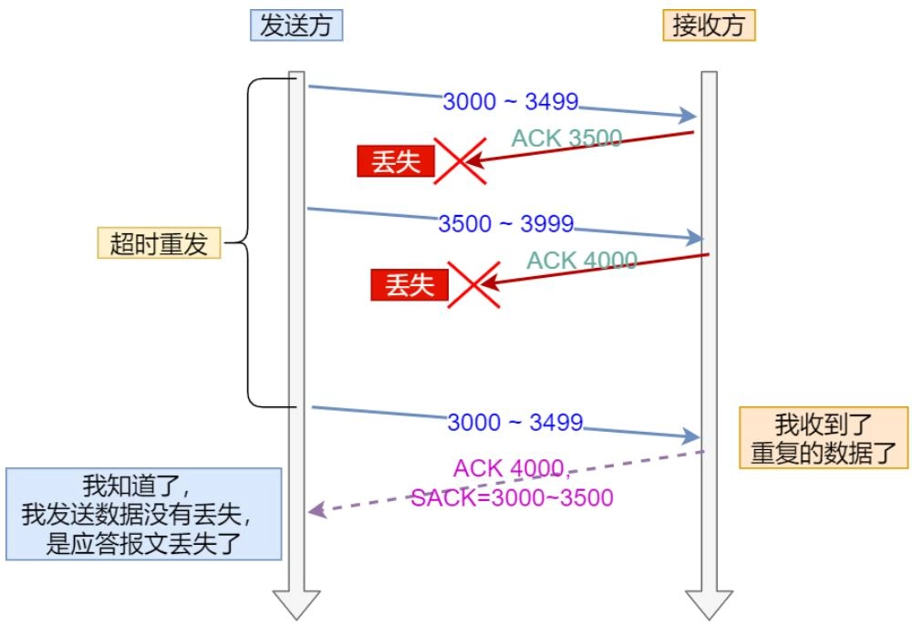

##### 优缺点

- 优点：提高了传输效率，减少了不必要的重传。
- 缺点：实现较复杂，开销较大。

### 利用滑动窗口实现可靠传输

- TCP 使用流水线传输和滑动窗口协议实现高效、可靠的传输。
	- **流水线传输**：发送方在等待确认的同时，继续发送后续的报文段。
	- **滑动窗口协议**：发送方 A 和接收方 B 分别维持一个发送窗口和一个接收窗口。
		- 使用**累积确认**机制（类似 GBN）
		- 支持**选择确认**机制（类似 SR）
- 示例：
	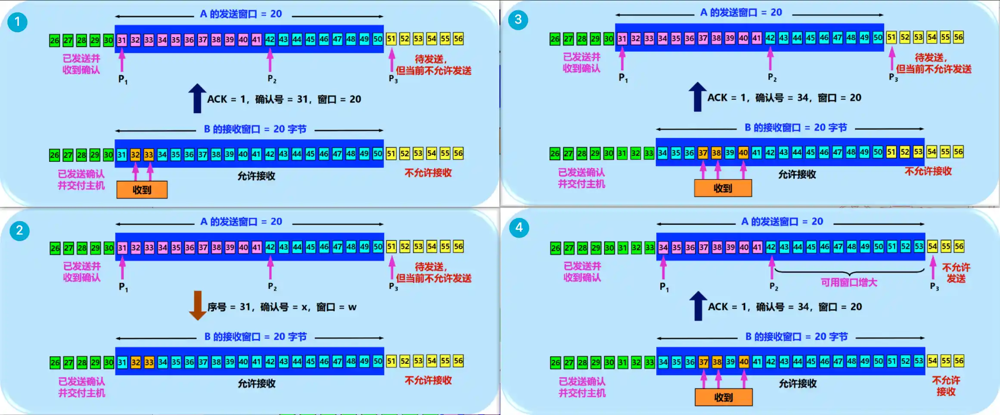

	1. 发送方 A 发送字节 31~41 ，B 只收到字节 32 和 33，于是发送确认号 31 给 A。
	2. A 收到确认号 31 后，窗口不变，重发字节 31。
	3. B 收到字节 31 后，窗口滑动至 34~53，此时又收到 37、38 和 40，于是发送确认号 34 给 A。
	4. A 收到确认号 34 后，窗口滑动至 34~53。
- 说明：
	- 发送窗口是根据接收窗口设置的，但在同一时刻，发送窗口并不总是和接收窗口一样大（因为有一定的时间滞后）。
	- TCP 标准没有规定对不按序到达的数据应如何处理。通常是先临时存放在接收窗口中，等到字节流中所缺少的字节收到后，再按序交付上层的应用进程。
	- TCP 要求接收方必须有累积确认的功能，以减小传输开销。接收方可以在合适的时候发送确认，也可以在自己有数据要发送时把确认信息顺便捎带上。但接收方不应过分推迟发送确认，否则会导致发送方不必要的重传，捎带确认实际上并不经常发生。

### 超时重传时间的选择

- TCP 发送方在规定的时间内没有收到确认就要重传已发送的报文段。
- 但重传时间的选择是 TCP 最复杂的问题之一，互联网环境复杂，IP 数据报所选择的路由变化很大，导致传输层的往返时间（RTT）的变化也很大。
	

- TCP 超时重传时间的选择应满足以下两个要求：
	- 不能太短，否则会引起很多报文段的不必要的重传，使网络负荷增大。
	- 不能过长，会使网络的空闲时间增大，降低了传输效率。

#### 基本定义

- **加权平均往返时间/平滑的往返时间** $RTT_S$
	- 定义：往返时间 RTT 的加权平均值，用于估计当前的往返时间。
	- 使用指数加权移动平均法计算 $RTT_S$：

		$$
		新的~RTT_{S}=(1-\alpha)\times(旧的~RTT_{S})+\alpha \times(新的~RTT~样本)
		$$

	- 其中 $0 \leq \alpha < 1$，$\alpha$ 越小，$RTT$ 值更新得越慢，越平滑，RFC 6298 推荐 $\alpha = 1/8$。
- **超时重传时间** $RTO$
	- 定义：若发送方在 RTO（Retransmission Time-Out）内没有收到确认，就重传报文段，应略大于加权平均往返时间 $RTT_{S}$。
	- RFC 6298 建议 $RTO$：

		$$
		RTO = RTT_{S} + 4 \times RTT_{D}
		$$

		- 其中 $RTT_D$ 是 $RTT$ 偏差的加权平均值。
	- RFC 6298 建议  $RTT_{D}$：

		$$
		新的~RTT_{D}=(1-\beta)\times(旧的~RTT_{D})+ \beta \times |RTT_{S}-新的~RTT~样本|
		$$

		- 其中系数 $\beta <1$ ，推荐值为 $1/4$。

#### 往返时间 RTT 的测量

- 超时重传报文段后，如何判定此确认报文段是对原来的报文段的确认，还是对重传报文段的确认？
	

- Karn 算法
	- 在计算平均往返时间 $RTT_S$ 时，只要报文段重传了，就不采用其往返时间样本。
	- 新问题：当报文段的时延突然增大很多时，在原来得出的重传时间内，不会收到确认报文段，于是就重传报文段。但根据 Karn 算法，不考虑重传的报文段的往返时间样本。这样，超时重传时间就无法更新，造成很多不必要的重传。
- 修正的 Karn 算法
	- 报文段每重传一次，就把 RTO 增大一些：

		$$
		新的~RTO=\gamma\times(旧的~RTO)
		$$

		- 其中系数 $\gamma$ 的典型值 $= 2$。
	- 当不再发生报文段的重传时，才根据报文段的往返时延更新平均往返时延 RTT 和超时重传时间 RTO 的数值。

#### 快速重传

- 工作方式：当收到三个相同的 ACK 报文时，在定时器过期之前重传丢失的报文段。
	- 解决的问题：什么时候重传（超时时间）
	- 未解决的问题：重传的内容是只有确认号对应的报文段，还是从确认号开始的所有报文段
- 示意图：
	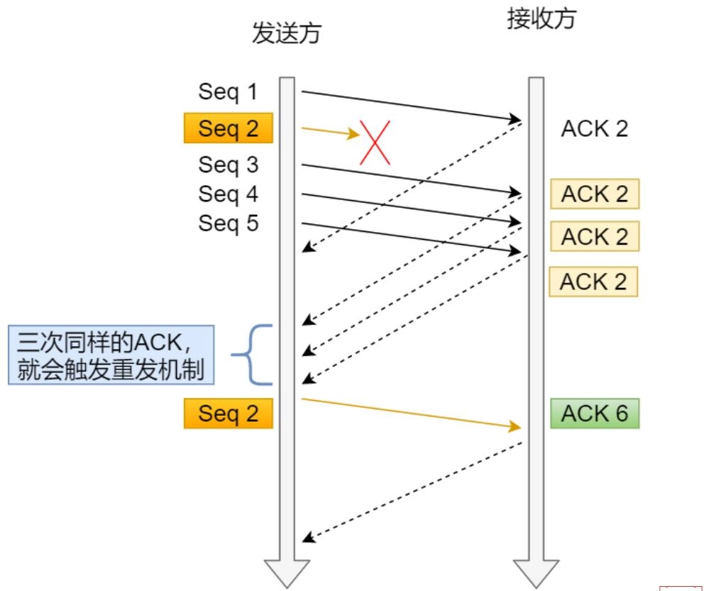

## TCP 的流量控制
### 利用滑动窗口实现流量控制

- **流量控制**（flow control）：让发送方的发送速率不要太快，使接收方来得及接收。
	- 利用滑动窗口机制可以很方便地在 TCP 连接上实现对发送方的流量控制。
- TCP 的流量控制机制
	- 接收方 B 根据自己的接收缓存的使用情况，动态地调整自己的接收窗口（rwnd）大小，并把该窗口值通过窗口字段通知给发送方 A。
	- 发送方 A 根据接收方 B 给出的窗口值和确认号，构造出自己的发送窗口（swnd），从而控制自己的发送速率。

### 零窗口与死锁的解决

- **死锁**（deadlock）：一旦接收方的接收缓存满了，接收方就不得不把窗口值设置为零，从而使发送方停止发送数据，若后续接收方更新窗口值的报文段丢失，就会导致死锁。
	- 示例：
		

	- 解决方法：持续计时器机制 + 零窗口探测报文段。
- **持续计时器**（persistence timer）：只要 TCP 连接的一方收到对方的零窗口通知，就启动该持续计时器。
	- 若持续计时器设置的时间到期，就发送一个**零窗口探测报文段**（仅携带 1 字节的数据），对方在确认这个探测报文段时给出当前窗口值。
	- 若窗口仍然是零，收到这个报文段的一方就重新设置持续计时器。
	- 若窗口不是零，则死锁的僵局就可以打破了。

### TCP 的传输效率

- 控制 TCP 发送报文段时机的三种机制
	1. TCP 维持一个变量，它等于**最大报文段长度** MSS。只要缓存中存放的数据达到 MSS 字节时，就组装成一个 TCP 报文段发送出去。（攒够了）
	2. 由发送方的应用进程指明要求发送报文段，即 TCP 支持的**推送**（push）操作。（被催了）
	3. 发送方设置一个**计时器**，一旦期限到了就把当前已有的缓存数据装入报文段（但长度不能超过 MSS）发送出去。（等久了）
- **糊涂窗口综合症**
	- 定义：每次仅发送一个字节或很少几个字节的数据时，有效数据传输效率变得很低的现象。
		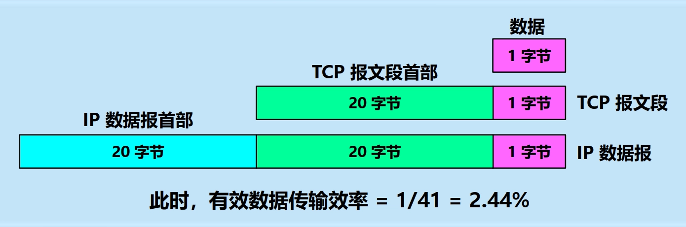

	- 发送方糊涂窗口综合症
		- 原因：发送方应用进程发送数据太快，例如：每接收到一字节的数据后就发送，形成 41 字节长的 IP 数据报，效率很低。
		- **解决方法**：使用 Nagle 算法。
			

	- 接收方糊涂窗口综合症
		- 原因：接收方应用进程消耗数据太慢，例如：每次只读取一个字节。
		- 示例：
		- 解决方法：让接收方等待一段时间，使得或者接收缓存**已有足够空间容纳一个最长的报文段**，或者等到接收缓存**已有一半空闲的空间**，接收方才发出确认报文，并向发送方通知当前的窗口大小。

## TCP 的拥塞控制
### 拥塞控制的一般原理
#### 拥塞的基本概念

- **拥塞**（congestion）：在某段时间，若对网络中某资源的需求超过了该资源所能提供的可用部分，网络的性能就会明显变坏，整个网络的吞吐量将随输入负荷的增大而下降。
	

	- 最坏结果：系统崩溃。
- 出现网络拥塞的条件：

	$$
	\sum 对资源需求 > 可用资源
	$$

- 拥塞产生的原因
	1. 节点缓存容量太小
	2. 链路容量不足
	3. 处理机处理速率太慢
	4. 拥塞本身会进一步加剧拥塞
- 增加资源不能解决拥塞，而且还可能使网络的性能更坏：
	1. 增大缓存，但未提高输出链路的容量和处理机的速度，排队等待时间将会大大增加，引起大量超时重传，解决不了网络拥塞；
	2. 提高处理机处理的速率会将瓶颈转移到其他地方；
	3. 拥塞引起的重传并不会缓解网络的拥塞，反而会加剧网络的拥塞。

#### 拥塞控制

- 拥塞控制与流量控制的区别
	- 拥塞控制
		- 防止过多的数据注入到网络中，避免网络中的路由器或链路过载。
		- 是一个**全局性**的过程，涉及到所有的主机、路由器，以及与降低网络传输性能有关的所有因素。
	- 流量控制
		- 抑制发送端发送数据的速率，以使接收端来得及接收。
		- 点对点通信量的控制，是个**端到端**的问题。
- 拥塞控制所起的作用
	

- 拥塞控制的一般原理
	- **拥塞控制的前提**：网络能够承受现有的网络负荷。
	- 实践证明，拥塞控制是很难设计的，因为它是一个**动态问题**。
	- 分组的丢失是网络发生拥塞的征兆，而不是原因。
	- 在许多情况下，甚至正是拥塞控制本身成为引起网络性能恶化、甚至发生死锁的原因。
- 拥塞控制的两种基本方法
	- 开环控制（静态控制）
		- 定义：在设计网络时，事先考虑周全，力求工作时不发生拥塞，但一旦整个系统运行起来，就不再中途进行改正了。
		- 思路：力争**避免**发生拥塞。
	- 闭环控制（动态控制）
		- 定义：基于反馈环路，根据网络**当前运行状态**采取相应控制措施。
		- 思路：在发生拥塞后，采取措施进行控制，消除拥塞。
		- 措施：
			1. **监测**：监测网络系统，检测拥塞在何时、何处发生。
				- 主要指标：
					1. 由于缺少缓存空间而被丢弃的分组的百分数
					2. 平均队列长度
					3. 超时重传的分组数
					4. 平均分组时延
					5. 分组时延的标准差，等等。
				- **这些指标的上升都标志着拥塞的增长**。
			2. **传送**：将拥塞发生的信息传送到可采取行动的地方。
				1. 将拥塞发生的信息传送到产生分组的源站。
				2. 在路由器转发的分组中保留一个比特或字段，用该比特或字段的值表示网络没有拥塞或产生了拥塞。
				3. 周期性发出探测分组等。
			3. **调整**：调整网络系统的运行以解决出现的问题。
				- 过于频繁，会使系统产生不稳定的振荡。
				- 过于迟缓，不具有任何实用价值。
				- 选择正确的时间常数是相当困难的。

### 利用滑动窗口实现拥塞控制

- TCP 采用**基于滑动窗口**的方法进行拥塞控制，属于**闭环控制**方法。
- 基本思想：
	- 发送方根据网络的拥塞情况**动态调整**发送窗口的大小。
	- 发送方维持一个**拥塞窗口** cwnd（Congestion Window），窗口大小**动态变化**，取决于网络的拥塞程度。
	- 发送窗口的大小不仅取决于接收方的接收窗口，还取决于网络的拥塞窗口。**实际大小**：

		$$
		发送窗口~swnd = \min(拥塞窗口~cwnd,接收窗口~rwnd)
		$$

		- 当 $cwnd > rwnd$ 时：接收方的接收能力限制发送窗口的最大值。
		- 当 $cwnd < rwnd$ 时：网络拥塞限制发送窗口的最大值。
- 控制拥塞窗口变化的原则
	- 网络未拥塞：增大拥塞窗口，以便把更多的分组发送出去，提高网络的利用率。
	- 网络拥塞或有可能出现拥塞：缩小拥塞窗口，以减少注入到网络中的分组数，缓解网络出现的拥塞。
- 发送方判断拥塞的方法：**隐式反馈**
	- 超时重传计时器超时：网络已经出现了拥塞。
		- 因传输出差错而丢弃分组的概率很小（远小于 1%），因此发送方在超时重传计时器启动时，就判断网络出现了拥塞。
	- 收到 3 个重复的确认：预示网络可能会出现拥塞。

#### TCP 拥塞控制算法

- **拥塞窗口** $cwnd$
	- 初始值：2 种设置方法。
		- 1 至 2 个最大报文段 MSS（旧标准 RFC 2001）
		- 2 至 4 个最大报文段 MSS（RFC 5681）
	- 规则：在每收到一个**对新的报文段的确认**，就把拥塞窗口**增加最多一个发送方的最大报文段 SMSS**（Sender Maximum Segment Size）的数值。

		$$
		拥塞窗口~cwnd~每次的增加量 = \min(N,SMSS)
		$$

		- 其中 $N$ 是原先未被确认的、但现在被刚收到的确认报文段所确认的字节数。
- **慢开始门限** $ssthresh$
	- 作用：防止拥塞窗口增长过大引起网络拥塞。
	- 规则：
		1. 当 $cwnd < ssthresh$ 时，使用慢开始算法。
		2. 当 $cwnd > ssthresh$ 时，停止使用慢开始算法，改用拥塞避免算法。
		3. 当 $cwnd = ssthresh$ 时，既可使用慢开始算法，也可使用拥塞避免算法。
- **传输轮次**（transmission round）
	- **定义**：把拥塞窗口 $cwnd$ 所允许发送的报文段全部连续发出，并收到对已发送的最后一个字节的确认，这一过程称为一个传输轮次。
	- 一个传输轮次所经历的时间：往返时间 $RTT$。
	- 示例：拥塞窗口 $cwnd = 4$，这时的往返时间 $RTT$ 就是发送方连续发送 4 个报文段，并收到这 4 个报文段的确认，总共经历的时间。
- **网络出现拥塞的表现**
	1. **重传计时器超时**：无论在慢开始阶段还是在拥塞避免阶段，只要发送方重传定时器超时，就可以判断网络出现拥塞。
		- 操作：**执行超时重传算法**。
		- 目的：迅速减少主机发送到网络中的分组数，使得发生拥塞的路由器有足够时间把队列中积压的分组处理完毕。
	2. **收到 3 个重复的确认**：预示网络可能会出现拥塞
		- 操作：**执行快重传和快恢复算法**。
		- 目的：让发送方尽早知道发生了个别报文段的丢失，并迅速作出反应，避免网络出现严重拥塞。

##### 慢开始算法（Slow start）

- **目的**：探测网络的负载能力或拥塞程度，让拥塞窗口 $cwnd$ 快速增大。
- **算法**：假设发送方设置 $cwnd = SMSS$，则每收到一个对新报文段的确认（重传的不算在内）就使 $cwnd = cwnd \times 2$。（窗口大小按指数规律增长）
	

- 示例：
	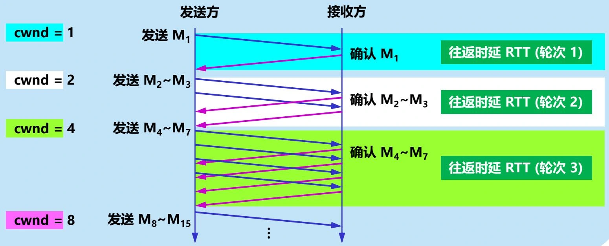

##### 拥塞避免算法（Congestion Avoidance）

- **目的**：减缓拥塞窗口 $cwnd$ 增大的速度，避免出现拥塞。
- **算法**：每经过一个往返时间 $RTT$（不管在此期间收到了多少确认），发送方的拥塞窗口 $cwnd = cwnd + 1$。
	- 具有**加法增大 AI**（Additive Increase）特点：使拥塞窗口 $cwnd$ 按线性规律缓慢增长。
- 注意：拥塞避免并非完全避免拥塞，而是让拥塞窗口增长得缓慢些，使网络不容易出现拥塞。
- 示例：
	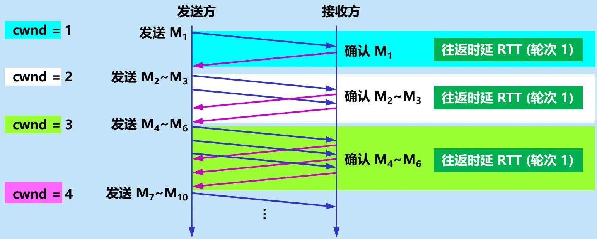

##### 超时重传算法

- **触发条件**：发送方的重传计时器超时。
- **目的**：迅速减少主机发送到网络中的分组数，使得发生拥塞的路由器有足够时间把队列中积压的分组处理完毕。
- **算法**：
	1. $ssthresh := \max(\frac{cwnd}{2},2)$
	2. $cwnd := 1$
	3. **执行慢开始算法**

##### 快重传算法 FR（Fast Retransmission）

- **触发条件**：发送方连续收到三个重复的确认 ACK。
- **目的**：让发送方尽早知道发生了个别报文段的丢失。
- **算法**：发送方只要连续收到三个重复的确认，就**立即进行重传**（即“快重传”），这样就不会出现超时。
	- 快重传算法要求**接收方立即发送确认**，即使收到了失序的报文段，也要立即发出对已收到的报文段的重复确认。
- 作用：使用快重传可以使整个网络的吞吐量提高约 20%。
- 注意：快重传并非取消重传计时器，而是在某些情况下可以更早地（更快地）重传丢失的报文段。
- 示例：
	

##### 快恢复算法 FR（Fast Recovery）

- **触发条件**：发送方连续收到三个重复的确认 ACK。
- **目的**：在快重传之后，迅速恢复到拥塞避免阶段，而不是回到慢开始阶段。
- **算法**：
	1. $ssthresh := \max(\frac{cwnd}{2},2)$
	2. **乘法减小** MD（Multiplicative Decrease）拥塞窗口：

		$$
		cwnd := ssthresh
		$$

	3. **加法增大** AI：执行**拥塞避免算法**，使拥塞窗口缓慢地线性增大。
- 二者合在一起就是所谓的 AIMD 算法，使 TCP 性能有明显改进。

#### 算法实现实例
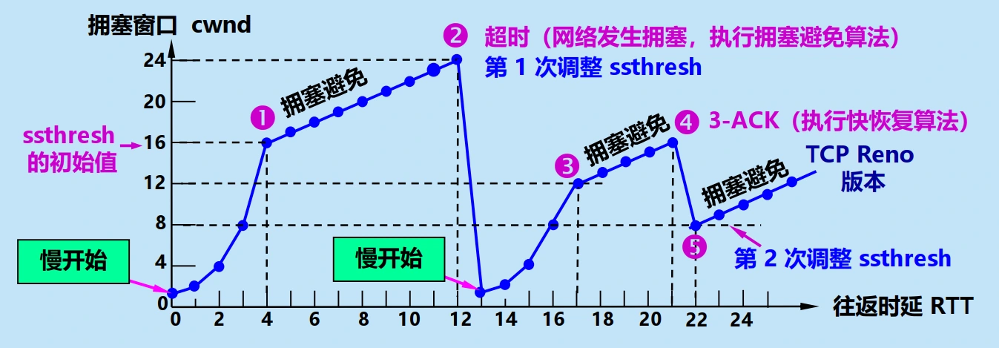

- 0：当 TCP 连接进行初始化时，令拥塞窗口 $cwnd = 1$，慢开始门限 $ssthresh = 16$。（窗口单位不使用字节而使用报文段）
- 0：开始执行慢开始算法时，$cwnd=1$，发送第一个报文段。发送方每收到一个对新报文段的确认 ACK，就令 $cwnd = cwnd \times 2$，因此 $cwnd$ 随着往返时延 $RTT$ 按指数规律增长。
- 4：当 $cwnd = ssthresh = 16$ 时，改为执行拥塞避免算法，发送方每收到一个对新报文段的确认 ACK，就令 $cwnd = cwnd + 1$，因此 $cwnd$ 随着往返时延 $RTT$ 按线性规律增长。
- 12：当 $cwnd = 24$ 时，网络出现了超时，发送方判断为网络拥塞。调整 $ssthresh = \frac{cwnd}{2} = 12$，$cwnd = 1$，重新进入慢开始阶段。
- 17：当 $cwnd = ssthresh = 12$ 时，改为执行拥塞避免算法。
- 20：当 $cwnd = 16$ 时，发送方连续收到 3 个对同一个报文段的重复确认（3-ACK）。发送方改为执行快重传和快恢复算法，快速重传该报文段，并调整 $ssthresh = cwnd / 2 = 8$，$cwnd = ssthresh = 8$，重新进入拥塞避免阶段。

#### TCP 拥塞控制流程图

### 主动队列管理 AQM

- TCP 拥塞控制和网络层采取的策略有密切联系。
- 例如：
	- 若路由器对某些分组的处理时间特别长，就可能引起发送方 TCP 超时，对这些报文段进行重传。
	- 重传会使 TCP 连接的发送端认为在网络中发生了拥塞，但实际上网络并没有发生拥塞。
- 对 TCP 拥塞控制影响最大的就是**路由器的分组丢弃策略**。

#### 先进先出处理规则与尾部丢弃策略

- **先进先出处理规则** FIFO（First In First Out）：路由器对到达的分组按到达的先后顺序进行排队处理。
- **尾部丢弃策略**（tail-drop policy）：当队列已满时，以后到达的所有分组（如果能够继续排队，这些分组都将排在队列的尾部）将都被丢弃。
	- 路由器的尾部丢弃往往会导致一连串分组的丢失，这就使发送方出现超时重传，使 TCP 进入拥塞控制的慢开始状态，结果使 TCP 连接的发送方突然把数据的发送速率降低到很小的数值。
		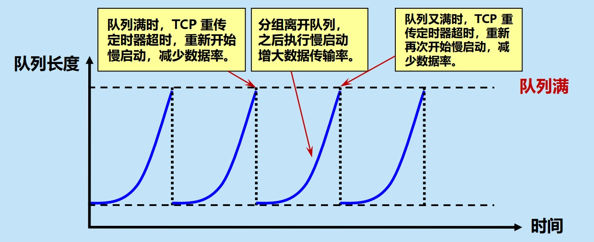

- 严重问题：**全局同步**
	- 若路由器进行了尾部丢弃，所有到达的分组都被丢弃，不论它们属于哪个 TCP 连接。
	- 分组丢弃使发送方出现超时重传，使多个 TCP 连接同时进入慢开始状态，发生全局同步（global synchronization）。
		

#### 主动队列管理 AQM

- 定义：路由器在分组到达时，**主动地**根据当前队列的长度决定是否丢弃该分组，而不是等到队列满了才丢弃分组。
	- **主动**：不要等到路由器的队列长度已经达到最大值时才不得不丢弃后面到达的分组，而是在队列长度**达到某个值得警惕的数值时**（即当网络拥塞有了某些拥塞征兆时），就主动丢弃到达的分组。
- AQM 可以有不同实现方法，其中曾流行多年的就是**随机早期检测** RED（Random Early Detection）。

#### 随机早期检测 RED

- RED 路由器到达队列维持两个参数：最小门限 $Th_{\min}$，最大门限 $Th_{\max}$，分成为三个区域：
	

- 规则：RED 对每一个到达的分组都先计算平均队列长度 $L_{AV}$
	- 当 $L_{AV} < Th_{\min}$ 时，丢弃概率 $p = 0$
	- 当 $L_{AV} > Th_{\max}$ 时，丢弃概率 $p = 1$
	- 当 $Th_{\min} \leq L_{AV} \leq Th_{\max}$ 时，丢弃概率 $0 < p < 1$
- 困难：丢弃概率 $p$ 的选择，因为 $p$ 并不是个常数。例如按线性规律变化，从 0 变到  $p_{\max}$ 。
	

>- 多年的实践证明，RED 的使用效果并不太理想。
>	- 2015 年公布的 RFC7567 已经把 RFC2309 列为“陈旧的”，并且不再推荐使用 RED。
>- 但对路由器进行主动队列管理 AQM 仍是必要的。
>	- AQM 实际上就是对路由器中的分组排队进行智能管理，而不是简单地把队列的尾部丢弃。
>	- 现在已经有几种不同的算法来代替旧的 RED，如可控延迟算法 CoDel（Controlled Delay）。

## TCP 的传输连接管理

- TCP 是面向连接的协议。
- **TCP 传输连接的三个阶段**：
	1. 连接建立
	2. 数据传送
	3. 连接释放
- **TCP 的连接管理**：使 TCP 连接的建立和释放都能正常地进行。
	1. 要使每一方能够确知对方的**存在**。
	2. 要允许双方**协商**一些参数（如最大窗口值、是否使用窗口扩大选项和时间戳选项以及服务质量等）。
	3. 能够对传输实体资源（如缓存大小、连接表中的项目等）进行**分配**。
- TCP 连接的建立采用**客户服务器方式**。
	- **客户**（client）：主动发起连接建立的应用进程。
	- **服务器**（server）：被动等待连接建立的应用进程。

### TCP 的连接建立

- **握手**：TCP 建立连接的过程。
- 采用**三报文握手**：在客户和服务器之间交换三个 TCP 报文段，以防止已失效的连接请求报文段突然又传送到了，因而产生 TCP 连接建立错误。
	

	1. 服务器 B 的 TCP 服务进程创建传输控制块 TCB，并初始化各项参数，进入**监听状态**（LISTEN）。
	2. 客户 A 的应用进程向 TCP 发送连接请求，TCP 发送一个**连接请求报文段**（SYN=1，初始序号 seq=x）到服务器 B，进入**同步已发送状态**（SYN-SENT）。
	3. 服务器 B 收到连接请求报文段后，如果同意建立连接，就发送一个**连接接受报文段**（SYN=1，ACK=1，seq=y，ack=x+1）到客户 A，进入**同步已接收状态**（SYN-RECEIVED）。
	4. 客户 A 收到连接确认报文段后，发送一个**连接确认报文段**（ACK=1，seq=x+1，ack=y+1）到服务器 B，并通知上层应用进程连接已建立，进入**已连接状态**（ESTABLISHED）。
	5. 服务器 B 收到连接确认报文段后，也通知上层应用进程连接已建立，进入**已连接状态**（ESTABLISHED）。
- 注意：
	- SYN 报文段（步骤 2、3）不能携带数据，但要消耗掉一个序号。
	- ACK 报文段（步骤 4）可以携带数据。但如果不携带数据，则不消耗序号。下一个数据报文段的序号仍是 seq=x+1。

### TCP 的连接释放

- 数据传输结束后，通信的**双方**都可释放连接。
- 采用**四报文挥手**：在客户和服务器之间交换四个 TCP 报文段，以确保双方都能可靠地释放连接。
	

	1. 一方 A 的应用进程向 TCP 发送连接释放请求，TCP 发送一个**连接释放报文段**（FIN=1，seq=u）到另一方 B，进入**终止已发送状态**（FIN-WAIT-1）。
	2. 另一方 B 收到连接释放报文段后，发送一个**连接释放确认报文段**（ACK=1，seq=v，ack=u+1）到 A，并通知上层应用进程，进入**关闭等待状态**（CLOSE-WAIT）。
	3. A 收到连接释放确认报文段后，进入**终止等待状态**（FIN-WAIT-2），此时从 A 到 B 这个方向的连接就释放了，TCP 连接处于**半关闭**（half-close）状态。但 B 若发送数据，A 仍要接收。
	4. 若 B 已经没有要向 A 发送的数据，其应用进程就通知 TCP 释放连接。TCP 发送一个**连接释放报文段**（FIN=1，ACK=1，seq=w，ack=u+1）到 A，进入**最后等待状态**（LAST-ACK）。
	5. A 收到连接释放报文段后，发送一个**连接释放确认报文段**（ACK=1，seq=u+1，ack=w+1）到 B，进入**时间等待状态**（TIME-WAIT）。
	6. B 收到连接释放确认报文段后，释放 TCP 连接。
	7. A 经过**时间等待计时器**（TIME-WAIT timer）设置的时间 **2MSL** 后，才释放 TCP 连接。
- 注意：
	- FIN 报文段（步骤 1）即使不携带数据，也消耗掉一个序号。
	- 半关闭（half-close）状态下，B 若发送数据，A 仍要接收。
	- A 必须等待 2MSL 的时间才能释放连接：
		- MSL（Maximum Segment Lifetime）：指一个 TCP 报文段在网络中最多能存活的时间（超过这个时间就会被路由器丢弃）。
		- 保证发送的最后一个 ACK 报文段能够到达 B，否则 B 可能会没收到而超时重传。
		- 防止“已失效的连接请求报文段”出现在本连接中。

### TCP 的保活机制

- 解决问题：建立连接后，若一方在很长时间内没有任何数据传送，另一方如何判断是否发生故障？
- 解决方法：**使用保活计时器**
	- 用来防止在 TCP 连接出现长时期空闲。
	- 通常设置为 2 小时：若服务器过了 2 小时还没有收到客户的信息，它就发送**探测报文段**。
	- 若发送了 10 个探测报文段（每一个相隔 75 秒）还没有响应，就假定客户出了故障，因而就终止该连接。

### TCP 的有限状态机
