# 应用层

- [Back to Course Home](index.md)

- 应用层协议：精确定义不同主机中的多个**应用进程之间的通信规则**。
	- 包括：
		- 应用进程交换的报文类型，如请求报文和响应报文。
		- 各种报文类型的语法，如报文中的各个字段及其详细描述。
		- 字段的语义，即包含在字段中的信息的含义.
		- 进程何时、如何发送报文，以及对报文进行响应的规则。
	- **基于客户服务器方式**
		- 客户（client）：服务请求方，本质是应用进程
		- 服务器（server）：服务提供方，本质是应用进程

## 域名系统 DNS
### DNS 概述

- **域名系统** DNS（Domain Name System）：用于将域名转换为 IP 地址的联机**分布式数据库系统**，采用**客户服务器**方式，主要使用 UDP 进行通信，熟知端口号为 53。
	- 理论上可以使用集中式，但难以负荷
- **域名服务器程序**：负责域名到 IP 地址的解析，若干个程序协同工作。
- **域名服务器**：运行域名服务器程序的专设结点。
- 域名解析过程要点
	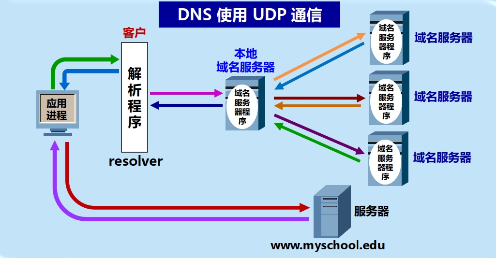

### 互联网的域名结构

- **域**（domain）：互联网命名空间中一个可被管理的划分。
	- 可以划分为子域，而子域还可继续划分为子域的子域，这样就形成了顶级域、二级域、三级域，等等。
- **域名**（domain name）：任意连接互联网的主机或路由器在互联网上的唯一层次结构名称。
	- **命名方法**：层次树状结构方法。
		

	- **域名结构**：层次结构，由标号（label）序列组成，各标号之间用点（.）隔开，各标号分别代表不同级别的域名。
		

	- **全球顶级域名** TLD（Top Level Domain）：
		- 国家顶级域名 nTLD/ccTLD：如 `.cn`、`.uk`、`.jp` 等，共 316 个
		- 通用顶级域名 gTLD：如 `.com`、`.org`、`.edu`、`.gov` 等，共 20 个
		- 基础结构域名/反向域名：用于反向域名解析，只有 `.arpa` 一个
		- 新顶级域名（New gTLD）：任何公司、机构可向 ICANN 申请注册

### 域名服务器

- **定义**：负责域名到 IP 地址解析的专设结点，分布在互联网的各个地方，又叫 DNS 服务器。
- **区**（zone）：一个域名服务器所负责管辖的（或有权限的）范围
	- DNS 服务器的管辖范围不是以“域”为单位，而是以“区”为单位。
	- 各单位根据具体情况来划分自己管辖范围的区。
		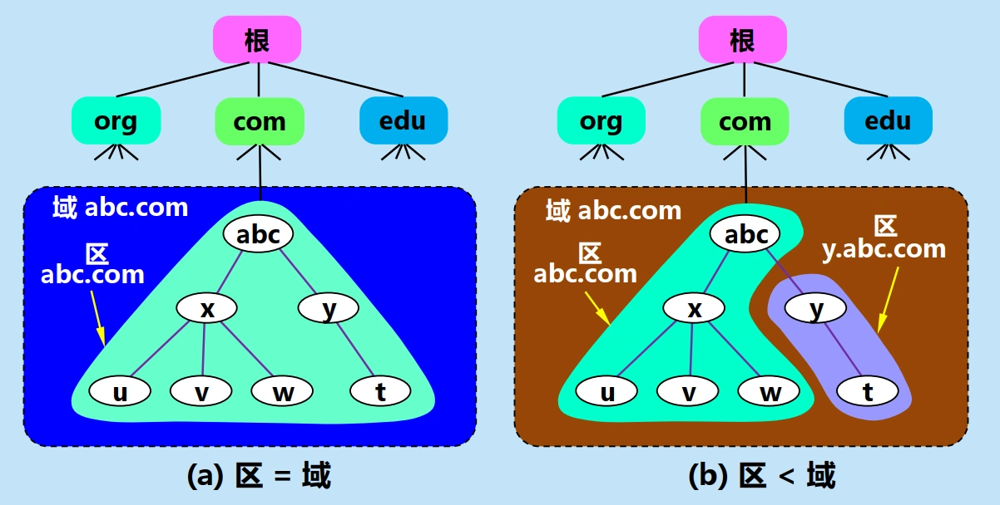

	- 一个区中的所有节点必须是相互**连通**的。
- **辅助域名服务器**
	- 定义：为了提高 DNS 的可靠性和容错能力，DNS 域名服务器都把数据复制到几个域名服务器来保存，其中的一个是**主域名服务器**，其他的是**辅助域名服务器**。
	- 作用：保证主域名服务器出故障时 DNS 的查询工作不会中断。
	- 数据一致性：主域名服务器**定期备份**数据到辅助域名服务器中，且更改数据只能在主域名服务器中进行。

#### 域名服务器类型

1.  **根域名服务器**
	- 地位：**最高层次，最为重要**。
	- 功能：记录所有的顶级域名服务器的域名和 IP 地址，指导本地域名服务器去找相应的顶级域名服务器。
	- 行为：当收到 DNS 查询请求时，**告诉本地域名服务器下一步应当找哪一个顶级域名服务器进行查询**
		- 根域名服务器并不直接把域名转换成 IP 地址（根域名服务器也没有存放这种信息）
	- 根域名服务器共有 13 组，对应 13 套装置和 13 个不同 IP 地址的域名，但并非仅由 13 台机器所组成。
		- 根域名服务器分布在全世界。
		- 为了提供更可靠的服务，在每一个地点的根域名服务器往往由多台机器组成。
		- 根域名服务器采用**任播**（anycast）技术，当 DNS 客户向某个根域名服务器发出查询报文时，路由器能找到离这个 DNS 客户最近的一个根域名服务器。
2. **顶级域名服务器**（TLD 服务器）
	- 功能：负责管理在该顶级域名服务器注册的所有二级域名。
	- 行为：当收到 DNS 查询请求时，回答下一步应当找哪一个二级域名服务器进行查询。
3. **权限域名服务器**
	- 功能：负责一个区（zone）的域名服务器，保存该区中的所有主机的域名到 IP 地址的映射。
	- 行为：当收到 DNS 查询请求时，回答最后的结果（IP 地址）或是下一步应当找哪一个权限域名服务器。
4. **本地域名服务器**（默认域名服务器）
	- 地位：**非常重要**。
	- 功能：主机发出的所有 DNS 查询请求都交给本地域名服务器处理
	- 工作过程：
		1. 主机向本地域名服务器发出 DNS 查询请求。
		2. 本地域名服务器检查自己的高速缓存，看是否有该域名的映射信息，若有则直接回答主机。
		3. 若没有，则以 DNS 客户的身份向根域名服务器、二级域名服务器等查询，直到获得所需的 IP 地址为止，然后把该 IP 地址返回给主机，同时把该映射信息存放在自己的高速缓存中以备下次使用。

#### 域名的解析过程

- **递归查询**
	- 定义：域名服务器接受 DNS 查询请求后，若自己无法回答，就代表 DNS 客户向下一级域名服务器发出查询请求，直到获得所需的 IP 地址为止，然后把该 IP 地址返回给 DNS 客户。
		- 回答：最终的 IP 地址。
	- **通常在主机向本地域名服务器查询时使用**，比较少用
	- 示例：
		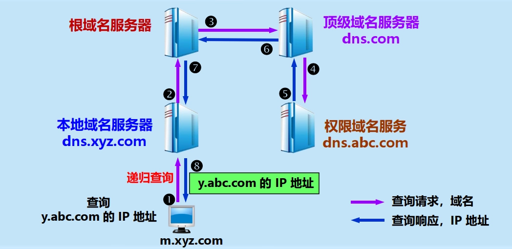

- **迭代查询**
	- 定义：域名服务器接受 DNS 查询请求后，若自己无法回答，就告诉 DNS 客户下一级域名服务器的 IP 地址，由 DNS 客户自己向下一级域名服务器发出查询请求，直到获得所需的 IP 地址为止。
		- 回答：最终的 IP 地址或下一个要查询的域名服务器的 IP 地址。
	- **通常在本地域名服务器向根域名服务器查询时使用**。
	- 示例：
		

- **高速缓存/高速缓存域名服务器**。
	- 功能：存放最近用过的名字以及从何处获得名字映射信息的记录。
	- 作用：大大减轻根域名服务器的负荷，使 DNS 查询请求和回答报文的数量大为减少。
	- 当权限域名服务器回答一个查询请求时，在响应中指明绑定有效存在的时间值。域名服务器据此为每项内容设置**计时器**，并处理超过合理时间的项。
		- 增加此时间值：减少网络开销
		- 减少此时间值：提高域名转换的准确性

### DNS 安全

- DNS 可以使用 UDP 或者 TCP 进行传输，使用的端口号都为 53。大多数情况下 DNS 使用 UDP 进行传输，这就要求域名解析器和域名服务器都必须自己处理超时和重传从而保证可靠性。
- **DNS 污染** / 网域服务器缓存污染（DNS cache pollution） / 域名服务器缓存投毒（DNS cache poisoning）：刻意或无意制造错误的 DNS 数据并将其放入域名服务器的缓存中，从而导致用户访问错误的网站或无法访问某些网站的行为。
- **DNS 劫持**：通过攻击或伪造域名解析服务器（DNS），把目标网站域名解析到错误的 IP 地址，从而使用户访问指定的错误网站或无法访问某些网站的行为。

### Hosts 文件

- Hosts 文件负责解析域名并优先于 DNS 服务，通常很多恶意软件会恶意更改该文件来达到劫持网站的目地。
- 作用：
	1. 加快域名解析：相当于本地的一个 DNS 缓存
	2. 方便局域网访问：局域网内的主机可以通过 Hosts 文件直接访问其他主机，而不需要通过 DNS 服务器进行解析
	3. 屏蔽网站：通过将某些不良网站的域名映射到本地回环地址来屏蔽这些网站
	4. 虚拟域名：通过 Hosts 文件可以实现虚拟域名的映射，从而方便本地测试和开发工作

## 文件传输协议 FTP
### FTP 概述

- **文件传输协议** FTP（File Transfer Protocol）：用于在网络中的计算机之间传送文件的应用层协议，采用**客户服务器方式**，使用 **TCP** 进行通信，熟知端口号为 21。
	- 地位：互联网的正式标准，使用得最广泛的文件传送协议。
	- 特点：
		- 提供**交互式**的访问，允许客户指明文件的类型与格式，并允许文件具有存取权限。
		- **屏蔽**了各计算机系统的细节，因而适合于在**异构网络**中任意计算机之间传送文件。
- 是**文件共享协议**的一个大类：
	- **文件传送协议**：FTP，TFTP 等。
		- 复制整个文件，对文件副本进行访问。
			- 若要存取文件，必须先获得一个本地文件副本。
			- 若要修改文件，只能修改文件副本并将其传回到原节点。
	- **联机访问协议**（on-line access）：NFS 网络文件系统等。
		- 允许同时对一个文件进行存取。
		- 远地共享文件访问，如同对本地文件的访问一样。
		- 透明存取，不需要对该应用程序作明显的改动。
		- 由操作系统负责。

### FTP 基本工作原理

- 网络环境下复制文件的复杂性：
	- 计算机存储数据的格式不同。
	- 文件的目录结构和文件命名的规定不同。
	- 对于相同的文件存取功能，操作系统使用的命令不同。
	- 访问控制方法不同。
- **FTP 特点**：
	- 只提供文件传送的一些**基本服务**，它使用 **TCP** 可靠的运输服务。
	- 主要功能：减少或消除在不同操作系统下处理文件的不兼容性。
	- 使用**客户服务器**方式。
		- 一个 FTP 服务器进程可**同时为多个**客户进程提供服务。
		- FTP 的服务器进程由两大部分组成：
			- **一个主进程**，负责接受新的请求；
			- **若干个从属进程**，负责处理单个请求。
- FTP 主进程的工作步骤
	1. 打开**熟知端口（端口号 21）**，等待客户进程发出连接请求。
	2. 每当收到一个客户进程的连接请求时，就产生一对**从属进程**来处理该连接请求，并与客户进程进行通信。
		- **主进程与从属进程的处理是并发地进行**。
		- 从属进程在运行期间根据需要可能创建子进程。
		- 从属进程对客户进程的请求处理完毕后即终止。
- FTP 从属进程
	

	1. **控制进程**：
		- 负责客户进程与服务器进程之间的命令和响应的传送。
			- 服务器端在收到客户连接请求后，由主进程产生一个控制从属进程来处理该连接请求。
		- 使用**TCP 连接**进行通信，该连接称为**控制连接**。
			- 端口号：21
			- 控制连接在客户进程与服务器进程之间保持整个会话期间都处于打开状态。
	2. **数据传送进程**：
		- 负责客户进程与服务器进程之间的数据传送。
			- 服务器端在收到客户文件传输请求后，由控制进程产生一个数据传送从属进程来处理该文件传输请求，传输完毕后即终止。
		- 使用**另一个 TCP 连接**进行通信，该连接称为**数据连接**。
			- 端口号：20（服务器端主动模式下）
			- 数据连接在每次传送文件时才动态创建，传送完毕后即释放。
- FTP 的缺点：
	- 仅能访问副本。
	- 对大文件的少量修改也要传送整个文件。

### 网络文件系统 NFS 

- NFS（Network File System）：允许用户通过网络访问远地文件系统，打开一个远地文件并在其任意位置开始读写数据。
- NFS 的主要特点：
	- NFS 在网络上**传送的只是少量的修改数据**。
	- 允许用户对远地文件进行**透明存取**，就像对本地文件的存取一样，可使用户只复制一个大文件中的一个很小的片段，而不需要复制整个大文件。
	- 允许多个用户**同时**对一个远地文件进行存取。
	- 由操作系统负责，不需要对应用程序作明显的改动。

### 简单文件传输协议 TFTP

- TFTP（Trivial File Transfer Protocol）：一种简单的文件传输协议，采用**客户服务器方式**，使用 **UDP** 进行通信。
	- 端口号：69
	- 只支持文件传输，**不支持交互**。
	- 由于 UDP 不提供可靠的传送服务，因此 TFTP 必须自己实现差错改正措施。
- TFTP 的优缺点：
	- 缺点：
		- 没有庞大的命令集
		- 没有列目录的功能
		- 也不能对用户进行身份鉴别
	- 优点：
		- 可用于 UDP 环境
		- 代码所占的内存较小
- TFTP 的主要特点：
	- 每次传送的数据报文中有 512 字节的数据，但最后一次可不足 512 字节。
	- 数据报文按序编号，从 1 开始。
	- 支持 ASCII 码或二进制传送。
	- 可对文件进行读或写。
	- 使用很简单的首部。
- TFTP 的工作过程：
	- **类似停止等待协议**
		- 发送完一个文件块后就等待对方的确认，确认时应指明所确认的块编号。
		- 发完数据后在规定时间内收不到确认就要重发数据 PDU。
		- 发送确认 PDU 的一方若在规定时间内未收到下一个文件块，需重发确认 PDU，保证文件的传送不致因某一个数据报的丢失而告失败。
	- 开始工作时，TFTP 客户进程发送一个读/写请求请求报文给 TFTP 服务器进程。
	- TFTP 服务器进程选择一个新的端口和 TFTP 客户进程进行通信。
	- 若文件长度恰好为 512 字节的整数倍，则在文件传送完毕后，还必须在最后发送一个只含首部而无数据的数据报文。
	- 若文件长度不是 512 字节的整数倍，则最后传送数据报文的数据字段一定不满 512 字节，作为文件结束的标志。

## 远程终端协议 TELNET
### TELNET 概述

- **远程终端协议** TELNET（TELecommunication NETwork）：用于在网络中实现远程登录的应用层协议，采用**客户服务器方式**，使用 **TCP** 进行通信，熟知端口号为 23。
	- 允许用户在本地计算机上使用主机名或 IP 地址登录到远地计算机，并像在本地计算机上一样使用远地计算机的资源。
	- TELNET 协议定义了客户进程与服务器进程之间交换的报文格式和规则，能将用户的击键传到远地主机，同时也能将远地主机的输出通过 TCP 连接返回到用户屏幕。
- 特点：**服务是透明的**。

### TELNET 的工作原理


- 使用客户服务器方式，在本地系统运行 TELNET 客户进程，而在远地主机则运行 TELNET 服务器进程。
	- 服务器中的主进程等待新的请求，产生从属进程来处理每一个连接。
	- TELNET 的**选项协商**（Option Negotiation）使客户和服务器可商定使用更多的终端功能，协商的双方是平等的。
- **网络虚拟终端格式** NVT（Network Virtual Terminal）
	- 数字字符：首位为 0 + 标准 ASCII 码字符（7 位）
	- 控制字符：首位为 1 + 标准 ASCII 码字符（7 位）
- 工作步骤：
	- 客户端把用户的击键和命令转换成 NVT 格式，并送交服务器。服务器端把收到的数据和命令从 NVT 格式转换成远地系统所需的格式。
	- 向客户返回数据时，服务器把远地系统的格式转换为 NVT 格式，本地客户再从 NVT 格式转换到本地系统所需的格式。

## 万维网 WWW
### WWW 概述

- 万维网 WWW（World Wide Web）：是一个大规模的、联机式的信息储藏所，并非某种特殊的计算机网络。
	- 通过**链接**的方式实现信息的发布和获取。
- 万维网是**分布式超媒体（hypermedia）系统**
	- 分布式系统
		- 信息分布在整个互联网上。每台主机上的文档都独立进行管理。
	- 超媒体系统
		- 是**超文本（hypertext）系统**的扩充。
			- 超文本：由多个信息源链接成，是万维网的基础。
		- 超媒体与超文本的区别：文档内容不同。
			- 超文本文档仅包含文本信息。
			- 超媒体文档还包含其他信息，如图形、图像、声音、动画，甚至活动视频图像等。
- 万维网的工作方式
	- 以**客户服务器**方式工作。
		- **客户**：浏览器。
		- **服务器**：在万维网文档所驻留的主机上运行，也称为万维网服务器。
	- 客户程序向服务器程序发出请求，服务器程序向客户程序送回客户所要的万维网文档，并在客户程序的主窗口上显示出来，称之为**页面**（page）。
- 万维网的组成
	- **统一资源定位符** URL（Uniform Resource Locator）：每个文档的互联网唯一标识符，标志万维网文档的位置。
	- **超文本传输协议** HTTP（HyperText Transfer Protocol）：万维网上客户程序与服务器程序之间传送万维网文档的应用层协议，使用 TCP 连接进行可靠的传送。
	- **超文本标记语言** HTML（HyperText Markup Language）：制作万维网页面的标准语言，使其能在互联网上的各种主机上显示出来，同时使用户清楚地知道在什么地方存在着链接。
	- **搜索引擎**（Search Engine）：用户搜索所需信息的工具。

### 统一资源定位符 URL

- 定义：互联网中资源的标准化地址格式，用于**唯一**标识和定位互联网上的资源位置。
	- 对资源的**简洁表示**，提供对资源位置的**抽象**识别方法，相当于文件名在网络范围的扩展，是与互联网相连的机器上的任何可访问对象的一个指针。
- 资源：指在互联网上可以被访问的任何对象，包括文件目录、文件、文档、图像、声音等，以及与互联网相连的任何形式的数据。

#### URL 的格式

- 一般形式：`<协议>://<主机>:<端口>/<路径>`
	- **协议**：指明访问资源所使用的应用层协议，如 HTTP、FTP 等，不区分大小写。
	- **主机**：资源所在的主机，可以是域名或 IP 地址，不区分大小写。
	- **端口**：指明所使用的端口号，省略时使用所定义的默认端口号 80。
	- **路径**：资源所在目录位置，区分大小写，省略时使用所定义的默认路径。
	- 查询字符串和片段标识符（可选）：
		- 查询字符串：以问号 `?` 开始，用等号 `=` 连接参数名和参数值，用与号 `&` 分隔多个参数，用于向服务器传递附加信息。
		- 片段标识符：以井号 `#` 开始，指向资源中的特定部分，如网页中的某个章节。
- 示例：
	

### 超文本传输协议 HTTP

- 定义：万维网上客户程序与服务器程序之间传送万维网文档的应用层协议，采用**客户服务器方式**，使用 **TCP** 连接进行通信，熟知端口号为 80。
- 特点：**面向事务**（transaction-oriented）
	- 每次客户与服务器之间的交互都称为一个事务。
	- 每个事务包括一个请求报文和一个响应报文。
- 地位：是万维网上能够**可靠地交换文件**（包括文本、声音、图像等各种多媒体文件）的重要基础。
- 功能：
	- 定义了浏览器与万维网服务器通信的格式和规则。
	- HTTP 不仅传送完成超文本跳转所必需的信息，而且也传送任何可从互联网上得到的信息，如文本、超文本、声音和图像等。

#### HTTP 的工作原理


- 类 MIME 扩充（Multipurpose Internet Mail Extensions）：
	- MIME 是电子邮件系统中用于传送多媒体信息的标准。

		> 详见[下文](#mime)

	- HTTP 借用了 MIME 的一些概念和技术，规定在 HTTP 客户与服务器之间的每次交互，都由一个 ASCII 码串构成的请求和一个类似的通用互联网扩充（类 MIME 扩充）的响应组成。
- 用户浏览页面的两种方法
	1. 在浏览器的地址窗口中键入所要找的页面的 URL。
	2. 在某一个页面中用鼠标点击一个可选部分，这时浏览器会自动在互联网上找到所要链接的页面。
- HTTP 的工作过程
	1. 建立 TCP 连接。
	2. 发送请求报文。
	3. 服务器处理请求，发送响应报文。
	4. 释放 TCP 连接或保持连接以便发送后续请求。
- HTTP 的主要特点
	- HTTP 协议**本身是无连接的**。
	- HTTP 使用**面向连接的 TCP** 作为运输层协议，保证了数据的可靠传输。
	- HTTP 是**无状态的**（stateless），服务器不记得客户状态，简化了服务器的设计，使服务器更容易支持大量并发的 HTTP 请求。
- 请求一个万维网文档所需的时间
	

##### 协议 HTTP/1.0

- **非持续连接**（non-persistent connection）：服务器在发送完响应报文后就释放该连接，因此客户每次请求一个资源就要和服务器建立一个新的 TCP 连接。
	- 若页面中有多个资源，则客户必须为每个资源都建立一个 TCP 连接，重新分配缓存和变量，造成大量的开销，影响传输效率。
- 示意图：
	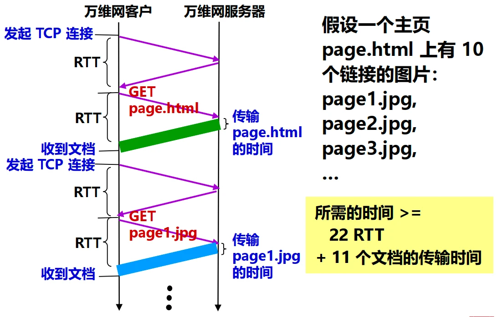

- 访问页面的时间成本：
	- 请求单个资源耗时 ${T_{Single}}_i$
	- 请求页面耗时 $T_{Page}$
	- 单个资源传输时间 ${T_{Trans}}_i$
	- 建立 TCP 连接的往返时延 $RTT$（近似为来回的传播时延 $2\tau$）
	- 资源数 $n$

	$$
	\begin{aligned} {T_{Single}}_i & \geq 2RTT + {T_{Trans}}_i \\ T_{Page} & \geq \sum_{i=0}^{n} {T_{Single}}_i \geq 2n \times RTT + \sum_{i=0}^{n} {T_{Trans}}_i \end{aligned}
	$$

	<!-- 
	为什么不计算释放连接的时延？一次四报文挥手耗时 2RTT，一共多耗费 2n RTT

	$$
	\begin{aligned} {T_{Single}}_i & \geq RTT + RTT + {T_{Trans}}_i + 2RTT \\ &= 4RTT + {T_{Trans}}_i \\ T_{Page} & \geq \sum_{i=0}^{n} {T_{Single}}_i \geq 4n \times RTT + \sum_{i=0}^{n} {T_{Trans}}_i \end{aligned}
	$$

	-->

##### 协议 HTTP/1.1

- **持续连接**（persistent connection）：服务器在发送响应后仍然在一段时间内保持这条连接（不释放），使同一个客户和该服务器可以继续在这条连接上传送后续的 HTTP 请求报文和响应报文。
	- 只要文档都在同一个服务器上，就可以继续使用该 TCP 连接。


- 两种工作方式：
	- **非流水线方式**（without pipelining）：客户在收到前一个响应之后才能发出下一个请求。
		- 缺点：存在 TCP 连接空闲状态。
		- 示意图：
			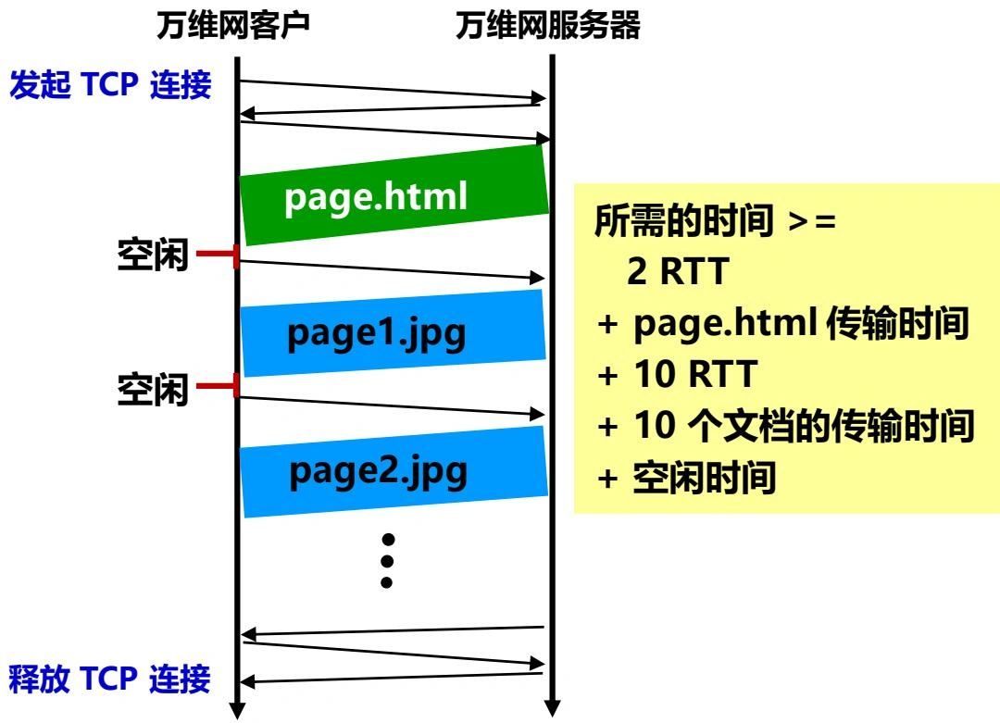

		- 访问页面的时间成本：

			$$
			\begin{aligned} {T_{Single}}_i & \geq RTT + {T_{Trans}}_i \\ T_{Page} & \geq RTT + \sum_{i=0}^{n}({T_{Single}}_i + {T_{Blank}}_i) \\ & \geq (n+1)RTT + \sum_{i=0}^{n}({T_{Trans}}_i + {T_{Blank}}_i) \end{aligned}
			$$

			<!--
			如果考虑释放，最后结果 +2RTT

			$$
			\begin{aligned} {T_{Single}}_i & \geq RTT + {T_{Trans}}_i \\ T_{Page} & \geq RTT + \sum_{i=0}^{n}({T_{Single}}_i + {T_{Blank}}_i) + 2RTT\\ & \geq (n+3)RTT + \sum_{i=0}^{n}({T_{Trans}}_i + {T_{Blank}}_i) \end{aligned}
			$$

			-->

	- **流水线方式**（with pipelining）：客户在收到响应报文之前就能够接着发送新的请求报文，服务器收到连续的多个请求报文后可以连续发回响应报文。
		- 优点：大大减少了 TCP 连接的空闲时间，提高了传输效率。
		- 示意图：
			

		- 访问页面的时间成本（上图中存在错误，实际需要 3RTT：建立 TCP 连接、请求 HTML 文档、请求后续资源）：

			$$
			T_{Page} \geq 3RTT + \sum_{i=0}^{n} {T_{Trans}}_i
			$$

			<!-- 
			如果考虑释放，最后结果 +2RTT

			$$
			\begin{aligned} T_{Page} & \geq RTT + RTT + RTT + \sum_{i=0}^{n} {T_{Trans}}_i +2RTT \\ & = 5RTT + \sum_{i=0}^{n} {T_{Trans}}_i \end{aligned}
			$$

			-->

##### 协议 HTTP/2

- 协议 HTTP/1.1 的升级版本。
- 主要特点：
	- **二进制分帧层**（Binary Framing Layer）：将所有传输的信息分割成更小的二进制编码的帧，从而实现更高效的数据传输。
	- **多路复用**（Multiplexing）：允许多个请求和响应在单个 TCP 连接上**并行**传输，减少了延迟和连接开销。
	- **头部压缩**（Header Compression）：使用 HPACK 算法对 HTTP 头部进行压缩，不发送重复的首部字段，减少了传输的数据量。
	- **向后兼容**：HTTP/2 设计时考虑了与 HTTP/1.1 的兼容性，允许现有的 HTTP/1.1 应用程序无缝升级到 HTTP/2。
- 其他改进：
	- 服务器推送（Server Push）：允许服务器主动向客户端发送资源，而无需客户端明确请求，从而提高页面加载速度。
	- 流量控制（Flow Control）：通过流量控制机制，防止单个流占用过多带宽，确保公平的资源分配。
- 访问页面的时间成本（先拿到第一个资源才知道后续资源的位置，可以开始并行）：

	$$
	T_{Page} \geq 2RTT + {T_{Trans}}_0 + \max_{i=1}^{n} {T_{Trans}}_i
	$$

#### HTTP 代理服务器

- **代理服务器**（proxy server）/**万维网高速缓存**（Web cache）：位于浏览器和万维网服务器之间的中间服务器，存放最近访问过的万维网文档的副本，代表浏览器向万维网服务器发出 HTTP 请求。
- 工作过程：
	1. 浏览器访问互联网的服务器时，先与代理服务器的高速缓存建立 TCP 连接，并向高速缓存发出 HTTP 请求报文。
	2. 若高速缓存已经存放了所请求的对象，则将此对象放入 HTTP 响应报文中返回给浏览器。
	3. 若未存放，高速缓存就代表浏览器与互联网上的源点服务器建立 TCP 连接，并发送 HTTP 请求报文。
	4. 源点服务器将所请求的对象放在 HTTP 响应报文中返回给代理服务器的高速缓存。
	5. 高速缓存收到对象后，先复制到本地存储器中，然后将该对象放在  HTTP 响应报文中，通过已建立的 TCP 连接，返回给请求该对象的浏览器。
- 优点：
	- **减少了对外部网络连接的需求**，节省了带宽。
	- 提高了访问速度，减少了延迟。
	- 提供了安全性和隐私保护功能。
	- 允许对网络流量进行监控和过滤。

#### HTTP 报文
##### 报文分类

- **请求报文**：从客户向服务器的请求。
	- 格式：
		```
		<方法> <URL> <版本>	 // 请求行
		<首部字段名>: <值>	  // 首部行
		……
		<首部字段名>: <值>

		<实体主体>			  // 可选
		```

	- 示例
		```
		GET /dir/index.htm HTTP/1.1		 // 使用了相对 URL
		Host: www.xyz.edu.cn				// 首部行开始，给出主机的域名
		Connection: close				   // 表示请求服务器在发送完请求的文档后释放连接
		User-Agent: Mozilla/5.0			 // 表明用户代理使用火狐浏览器 Firefox
		Accept-Language: cn				 // 表示用户希望优先得到中文版本的文档
											// 请求报文的最后一行为空行
											// 没有实体主体
		```

- **响应报文**：从服务器到客户的回答。
	- 格式：
		```
		<版本> <状态码> <短语>	  // 状态行
		<首部字段名>: <值>		  // 首部行
		……
		<首部字段名>: <值>

		<实体主体>				  // 可选
		```

	- 示例
		```
		HTTP/1.1 200 OK					 // 状态行
		Date: Mon, 27 Jul 2009 12:28:53 GMT // 首部行开始，给出响应报文的日期和时间
		Server: Apache/2.2.14 (Win32)	   // 服务器类型
		Last-Modified: Wed, 22 Jul 2009 19:15:56 GMT // 所请求页面的最后修改时间
		Content-Length: 88				  // 实体主体的长度
		Content-Type: text/html			 // 实体主体的类型
											// 响应报文的最后一行为空行
		<html>
		<body>
		<h1>Hello, World!</h1>
		</body>
		</html>							 // 实体主体
		```

##### 报文的组成部分
由于 HTTP 是面向正文的（text-oriented），因此报文中每一个字段的值都是一些 ASCII 码串，每个字段的长度都是不确定的。

- **开始行**：用于区分是请求报文还是响应报文。
	- 请求行：三个字段，中间用空格隔开。
		1. 方法：对所请求的对象进行的操作，决定请求报文的类型。

			| 方法（操作） | 意义			 |
			|--------------|------------------|
			| OPTION	   | 请求一些选项的信息 |
			| GET		  | 请求读取由 URL 所标志的信息 |
			| HEAD		 | 请求读取由 URL 所标志的信息的首部 |
			| POST		 | 向服务器提交数据 |
			| PUT		  | 在 URL 所标志的位置存放一个资源 |
			| DELETE	   | 删除指明的 URL 所标志的资源 |
			| TRACE		| 用来进行环回测试的请求报文 |
			| CONNECT	  | 用于代理服务器 |

		2. URL：所请求的资源的 URL。
		3. 版本：HTTP 的版本。
	- 状态行：三个字段，中间用空格隔开。
		1. 版本：HTTP 的版本
		2. 状态码：服务器操作完成的状态
			- `1xx` 表示通知信息，如请求收到了或正在进行处理。
			- `2xx` 表示成功，如接受或知道了。
			- `3xx` 表示重定向，表示要完成请求还必须采取进一步的行动。
			- `4xx` 表示客户的差错，如请求中有错误的语法或不能完成。
			- `5xx` 表示服务器的差错，如服务器失效无法完成请求。
		3. 短语：解释状态码。
- **首部行**：说明浏览器、服务器或报文主体的一些信息。可以有多行，也可以不使用。
	- 若干首部字段，每个字段占一行，字段名与值之间用冒号 `:` 隔开。
- **实体主体**：请求报文中一般不用，响应报文中也可能没有该字段。
	- 首部行与实体主体之间使用一个空行隔开。

#### 在服务器上存放用户的信息

- 万维网使用 Cookie 跟踪在 HTTP 服务器和客户之间传递的状态信息。
	

### 超文本标记语言 HTML

- 在一个客户程序主窗口上显示出的万维网文档称为**页面**（page）。
- 万维网文档分类：
	- 静态万维网文档：服务器返回静态的 HTML 文档，内容不会改变，最为简单。
	- 动态万维网文档：服务器在浏览器访问时由应用程序动态创建 HTML 文档。
	- 活动万维网文档：服务器返回的 HTML 文档中包含脚本代码，由浏览器在显示页面时解释执行这些脚本代码从而改变页面内容。

#### HTML 概述

- **超文本标记语言** HTML（HyperText Markup Language）：是一种制作万维网页面的**标准语言**，它消除了不同计算机之间信息交流的障碍，是万维网的重要基础。
- HTML 的基本概念
	- HTML 定义了许多用于排版的命令（即**标签**）。
	- HTML 把各种标签嵌入到万维网的页面中，构成了所谓的 HTML 文档。
	- HTML 文档是一种可以用任何文本编辑器创建的 **ASCII 码文件**。
	- HTML 文档的**后缀**：`.html` 或 `.htm`。
- HTML 文档中标签的用法
	```html
	<HTML>
		<HEAD>
			<TITLE>一个HTML的例子</TITLE>
		</HEAD>
		<BODY>
			<H1>HTML很容易掌握</H1>
			<P>这是第一个段落。</P>
			<P>这是第二个段落。</P>
		</BODY>
	</HTML>
	```

	- `<HTML>`：标志 HTML 文档的开始和结束。
	- `<HEAD>`：标志 HTML 文档的头部开始和结束。
	- `<TITLE>`：标志 HTML 文档的标题开始和结束。标题显示在浏览器的标题栏上。
	- `<BODY>`：标志 HTML 文档的主体开始和结束。浏览器显示的内容都在主体中。
	- `<H1>`：标志标题开始和结束。H1 表示一级标题，H2 表示二级标题，依此类推，H6 表示六级标题。
	- `<P>`：标志段落开始和结束。					 
	- ``：图像标签。
		- **内含图像**（inline image）：嵌入在 HTML 文档中的图像。
		- HTML 标准没有规定该图像的格式，但大多数浏览器都支持 GIF 和 JPEG 文件。
	- `<a>`：链接标签。
		- 每个链接都有一个起点和终点。
		- **起点**：说明在万维网页面中的什么地方可引出一个链接。可以是一个字或几个字，或是一幅图，或是一段文字。
		- **终点**：
			- **远程链接**：其他网站上的页面，必须指明链接到的网站的 URL。
			- **本地链接**：本计算机中的某一个文件或本文件中的某处，必须指明链接的路径。
- **可扩展标记语言** XML（Extensible Markup Language）
	- 设计宗旨：**传输数据**，而不是显示数据。
	- 特点和优点：
		- 可用来标记数据、定义数据类型
		- 允许用户对自己的标记语言进行自定义，并且是无限制的
		- 简单，与平台无关
		- 将用户界面与结构化数据分隔开来
- **可扩展超文本标记语言** XHTML（Extensible HTML）
	- 与 HTML 4.01 几乎相同，是更严格的 HTML 版本。
	- 作为一种 XML 应用被重新定义的 HTML，将逐渐取代 HTML。
- **层叠样式表** CSS（Cascading Style Sheets）
	- 定义：一种样式表语言，用于为 HTML 文档**定义布局**。
	- CSS 与 HTML 的区别：HTML 用于结构化内容，而 CSS 则用于格式化结构化的内容。

#### 静态/动态万维网文档

- 静态文档和动态文档之间的主要差别体现在**服务器端**：文档内容的生成方法不同。从浏览器的角度看，这两种文档并没有区别。
	- 静态文档：该文档创作完毕后就存放在万维网服务器中，在被用户浏览的过程中，内容不会改变。（无后端）
	- 动态文档：文档的内容是在浏览器访问万维网服务器时才由应用程序动态创建。（有后端）
- 万维网服务器功能的扩充
	

	1. 增加一个应用程序：**处理**浏览器发来的数据，并**创建**动态文档。
	2. 增加一个机制：使万维网服务器把浏览器发来的数据**传送**给这个应用程序，然后万维网服务器能够**解释**这个应用程序的输出，并向浏览器返回 HTML 文档。
- **通用网关接口** CGI（Common Gateway Interface）
	- 定义：定义动态文档应如何创建、输入数据应如何提供给应用程序以及输出结果应如何使用的一种标准。
		- **通用**：CGI 标准所定义的规则对其他任何语言都是通用的。
		- **网关**：CGI 程序的作用像网关。
		- **接口**：有一些已定义好的变量和调用等可供其他 CGI 程序使用。
	- CGI 网关程序——**CGI 脚本**（script）
		- 脚本：一个被解释程序而不是计算机的处理机来解释或执行的程序，不一定是一个独立的程序，可以是一个动态装入的库，甚至是服务器的一个子程序。
			- 脚本语言（script language）：如 Perl，JavaScript，Tcl/Tk 等及一些常用的编程语言如 C，C++ 等。
		- 脚本运行起来要比一般的编译程序要慢。
		- CGI 程序又称为 cgi-bin 脚本，因为在许多万维网服务器上，将 CGI 程序放在 /cgi-bin 的目录下。

#### 活动万维网文档

- **活动文档技术**（active document）：把屏幕连续更新的工作转移给浏览器端，每当浏览器请求一个活动文档时，服务器就返回一段**活动文档程序副本**在浏览器端运行，从而实现屏幕的连续更新。
	

- 特点：
	- 活动文档程序可与用户直接交互，并可连续地改变屏幕的显示。
	- 由于活动文档技术不需要服务器的连续更新传送，对网络带宽的要求也不会太高。
- 用 Java 语言创建活动文档
	- Java 语言是一项用于创建和运行活动文档的技术。
	- 在 Java 技术中使用小应用程序（applet）来描述活动文档程序。
	- 用户从万维网服务器下载嵌入了 applet 的 HTML 文档后，可在浏览器的屏幕上点击某个图像，就可看到动画效果，或在下拉式菜单中点击某个项目，就可看到计算结果。
	- Java 技术是活动文档技术的一部分。

### 搜索引擎

- 搜索引擎（search engine）：是一种用来在万维网上**查找信息**的程序。

#### 搜索引擎的分类

- **全文检索搜索引擎**
	- 定义：通过对互联网上的网页进行全文检索来提供搜索服务的搜索引擎。
		- 一种纯技术型的检索工具。
	- 工作原理：
		- 通过搜索软件（爬虫）到互联网上的各网站收集信息。
		- 按照一定的规则建立一个很大的在线索引数据库，并定期对其维护更新。
		- 用户在查询时只要输入关键词，从已经建立的索引数据库里查询（非实时）。
- **分类目录/网站搜索引擎**
	- 定义：通过对互联网上的网站进行分类编目来提供搜索服务的搜索引擎。
		- 一种人工编辑型的检索工具。
	- 工作原理：
		- 网站向搜索引擎提交网站信息时填写关键词和网站描述等信息
		- 由人工编辑人员对提交的网站信息进行审核、分类和编目，建立一个分类目录数据库。
		- 查询时只需要按照分类，不需要使用关键词，查询的准确性较好。
	- 特点：查询的结果不是具体的页面，而是被收录网站主页的 URL 地址。
- **垂直搜索引擎**（Vertical Search Engine）
	- 定义：针对某一特定领域、特定人群或某一特定需求提供搜索服务的搜索引擎。
	- 特点：用户提供关键字来进行搜索，但被放到一个行业知识的上下文中，返回的结果更倾向于信息、消息、条目等。
- **元搜索引擎**（Meta Search Engine）
	- 定义：通过使用多个独立的其他搜索引擎来进行搜索，并对结果进行整合处理后提供给用户的搜索引擎之上的搜索引擎。
	- 工作原理：
		- 用户在元搜索引擎中输入查询请求后，元搜索引擎将该请求发送给多个独立的搜索引擎。
		- 各个独立的搜索引擎返回各自的搜索结果，元搜索引擎对这些结果进行集中处理，经整合、排序和去重后以统一的格式将最终结果提供给用户。
	- 特点：主要精力放在提高搜索速度、智能化处理搜索结果、个性化搜索功能的设置和用户检索界面的友好性上。
	- 优点：
		- 查全率和查准率都比较高。
		- 提供更广泛的搜索范围，覆盖多个搜索引擎的资源。
		- 节省用户时间和精力，无需逐个访问多个搜索引擎。

#### Google 搜索技术的特点

- **网页排名**（Page Rank）：对搜索结果**按重要性排序**。
	- 对链接的数目进行加权统计。来自重要网站的链接，其权重较大。
	- 进行超文本匹配分析，确定哪些网页与正在执行的特定搜索相关。
	- 在综合考虑整体重要性以及与特定查询的相关性之后，Google 就把最相关、最可靠的搜索结果放在首位。

### 博客和微博

- 博客
	- 万维网日志（weblog）的简称。
	- 使网民不仅是互联网上内容的消费者，而且还是互联网上内容的生产者。
- 微博
	- 微型博客（microblog），又称为微博客。
	- 只记录片段、碎语，三言两语，现场记录，发发感慨，晒晒心情，永远只针对一个问题进行回答。
	- 开通的多种 API 使用户可通过手机、网络等方式即时更新自己的信息。
	- 是一种互动及传播性极快的工具。

### 社交网站

- 社交网站 SNS（Social Networking Site）：为一群拥有相同兴趣与活动的人创建在线社区。
- 功能丰富：如电子邮件、即时传信（在线聊天）、博客撰写、共享相册、上传视频、网页游戏、创建社团、刊登广告等。

## 电子邮件
### 电子邮件概述

- **电子邮件**（e-mail）：指使用电子设备交换的邮件及其方法。
- 优点：使用方便，传递迅速，费用低廉，可以传送多种类型的信息（包括：文字信息，声音和图像等）。
- **重要标准**：
	- 互联网文本报文格式
	- 简单邮件发送协议：SMTP
	- 邮件读取协议：POP3 和 IMAP
	- 通用互联网邮件扩充 MIME

#### 电子邮件系统的三个主要构件
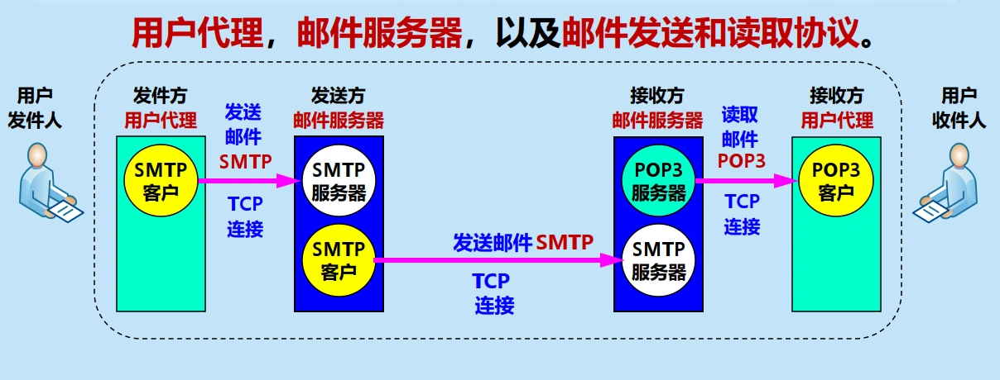

- **用户代理** UA（User Agent）
	- 用户与电子邮件系统的接口，又被称为电子邮件客户端软件。
	- 基本功能：撰写、显示、处理、通信。
- **邮件服务器**（Mail Server）
	- 又被称为**邮件传输代理**。
	- 功能：发送和接收邮件，同时还要向发信人报告邮件传送的情况。
	- 按照**客户服务器**方式工作，能够**同时充当**客户和服务器。
- **邮件发送和读取协议**
	- 邮件发送和读取使用不同的协议，都使用 **TCP** 连接可靠地传送邮件。
	- **简单邮件发送协议** SMTP：用于在用户代理向邮件服务器或邮件服务器之间发送邮件。
	- **邮局协议** POP3：用于用户代理从邮件服务器读取邮件。
	- **网际报文存取协议** IMAP：也是用于用户代理从邮件服务器读取邮件，但功能更强大。

#### 发送和接收电子邮件的重要步骤


- 步骤：
	1. 用户使用**发送方用户代理**撰写邮件，并通过 SMTP 将邮件发送到**源邮件服务器**。
	2. 源邮件服务器通过 SMTP 将邮件传送到**目的邮件服务器**。
	3. 接收方用户使用**接收方用户代理**通过 POP3 或 IMAP 从目的邮件服务器读取邮件。
- 注意：邮件不会在互联网中的某个中间邮件服务器落地。

#### 电子邮件的组成

- 电子邮件由信封（envelope）和内容（content）两部分组成。
	

	- 信封：
		- 包含邮件传送所需的地址信息。
		- 信封上的地址信息与邮件内容无关。
	- 内容：
		- 包含邮件的实际信息。
		- 用户从自己的邮箱中读取邮件时才能看到邮件的内容。
- 电子邮件信封的格式
	- 信封包含发件人地址和收件人地址。 
	- TCP/IP 体系的电子邮件系统规定电子邮件地址的格式：**邮箱名@邮箱所在主机的域名**
		- 邮箱名：在该域名的范围内是唯一的。
		- 邮箱所在的主机的域名：在全世界必须是唯一的。
-  电子邮件内容的格式
	- RFC 5322 只规定了邮件内容中的**首部**（header）格式，**主体**（body）部分则让用户自由撰写。
		- 首部：
			- From：发件人地址
			- To：收件人地址
			- Date：发送日期和时间
			- Subject：邮件主题
			- Cc：抄送地址
		- 主体：
			- 纯文本信息（ASCII 编码）。
			- 无特定结构和含义。

### 简单邮件传输协议 SMTP

- 定义：用于在用户代理向邮件服务器或邮件服务器之间发送邮件的协议。
- 特点：
	- 规定了在两个相互通信的 SMTP 进程之间交换信息的方法。
	- 使用**客户服务器方式**。
	- 基于 **TCP** 实现客户与服务器的通信，SMTP 服务器使用熟知端口 25。
	- 客户与服务器之间采用**命令-响应**方式进行交互。
	- **基于文本**：SMTP 命令和响应均为 ASCII 码文本行。

#### SMTP 通信的三个阶段

1. **连接建立**：连接是在**发送主机的 SMTP 客户**和**接收主机的 SMTP 服务器**之间建立的，不使用中间的邮件服务器。
	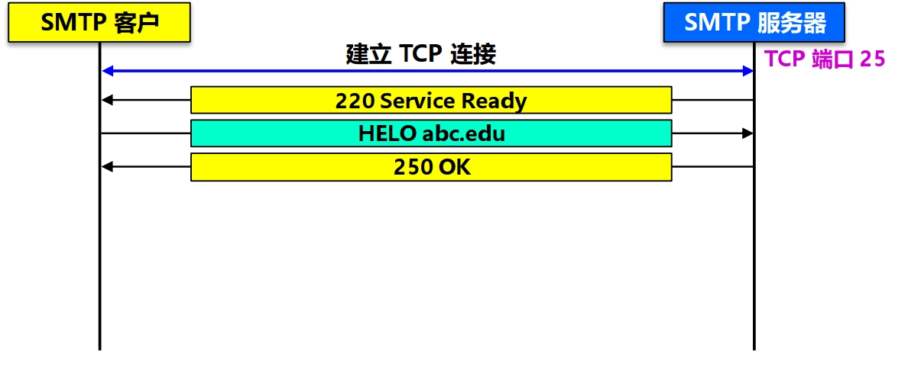

	- SMTP 客户首先使用熟知端口 25 与接收方的 SMTP 服务器建立 TCP 连接。
	- SMTP 服务器发出服务就绪响应：“220 Service ready”。
	- SMTP 客户向服务器发送问候（HELO 命令），附上发送方的主机名。
	- SMTP 服务器若有能力接收邮件，则回答：“250 OK”，表示已准备好接收。
2. **邮件传送**
	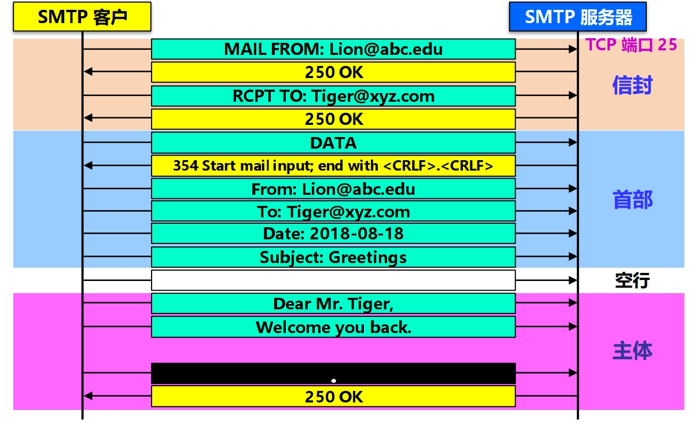

	- SMTP 客户发送 MAIL FROM 命令，指定发件人地址，服务器回答“250 OK”。
	- SMTP 客户发送 RCPT TO 命令，指定收件人地址，服务器回答“250 OK”。	
	- SMTP 客户发送 DATA 命令，服务器回答“354 Start mail input”，表示可以开始发送邮件内容。
	- SMTP 客户发送邮件内容，首部与主体之间用一个空行隔开，以 `.` 单独一行表示邮件内容结束，服务器收到后回答“250 OK”。
3. **连接释放**：邮件发送完毕后，SMTP 应释放 TCP 连接。
	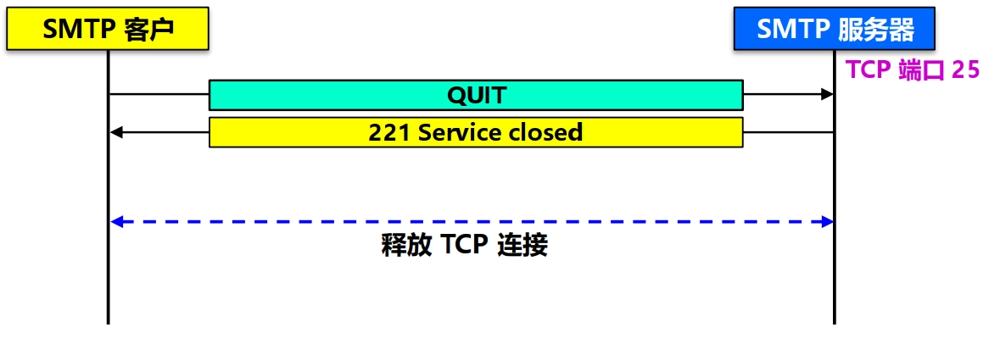

	- SMTP 客户发送 QUIT 命令，表示结束会话，服务器回答“221 Service closed”，然后释放连接。

### 邮件读取协议 POP3 和 IMAP

- 两个常用的邮件读取协议：
	1. POP3：邮局协议（Post Office Protocol）第 3 版
	2. IMAP：网际报文存取协议（Internet Message Access Protocol）

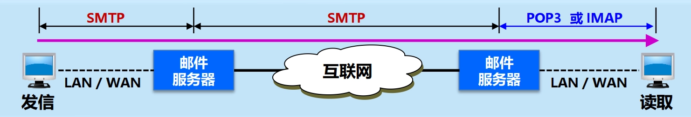

#### POP3 协议

- 邮局协议第 3 版 POP3（Post Office Protocol version 3）：用于用户代理从目的邮件服务器读取邮件的协议。
- 特点：
	- 使用**客户服务器**方式。
	- 基于 **TCP** 实现客户与服务器的通信，熟知端口为 110。
	- **支持用户鉴别**。
	- **脱机协议**：用户可以先将邮件下载到本地计算机，然后再离线阅读和处理邮件。
		- 客户端将邮件从服务器上下载到本地。
		- 服务器会**删除**被用户读取的邮件。

#### IMAP 协议

- 网际报文存取协议 IMAP（Internet Message Access Protocol）：也是用于用户代理从目的邮件服务器读取邮件的协议，但功能更强大。
- 特点：
	- 使用**客户服务器**方式。
	- 基于 **TCP** 实现客户与服务器的通信，熟知端口为 143。
	- **联机协议**：客户端在使用邮件服务时，需要持续或频繁地与邮件服务器保持连接，以便实时同步邮件状态。
		- **部分下载**：连接后只下载邮件首部，允许收信人只读取邮件中的某一个部分。
		- 用户可以在不同的地方使用不同的计算机随时上网阅读和处理自己的邮件。
		- 用户可以直接在 IMAP 服务器上创建和管理文件夹。
		- 用户可以搜索邮件内容。
- 缺点：要想查阅邮件，必须先联网。

#### IMAP 与 POP3 比较


| 操作位置 | 操作内容 | IMAP | POP3 |
|----------|----------|------|------|
| 收件箱 | 阅读、标记、移动、删除邮件等 | 客户端与邮箱更新同步 | 仅在客户端内 |
| 发件箱 | 保存到已发送 | 客户端与邮箱更新同步 || 仅在客户端内 |
| 创建文件夹 | 新建自定义的文件夹 | 客户端与邮箱更新同步 | 仅在客户端内 |
| 草稿 | 保存草稿 | 客户端与邮箱更新同步 | 仅在客户端内 |
| 垃圾文件夹 | 接收并移入垃圾文件夹的邮件 | 支持 | 不支持 |
| 广告邮件 | 接收并移入广告邮件夹的邮件 | 支持 | 不支持 |

### 基于万维网的电子邮件

- 用户代理（UA）的缺点：
	- 必须在计算机中安装用户代理软件。
	- 收发邮件不方便。
- 万维网电子邮件优点：
	- 不需要在计算机中再安装用户代理软件，而是使用浏览器即可收发电子邮件。
	- 只要计算机能联网，就能非常方便地收发电子邮件。
	- 界面非常友好。
- 示意图：
	

- 工作原理：
	1. 用户使用浏览器访问万维网电子邮件服务器的网页，输入用户名和密码进行登录。
	2. 登录成功后，用户即可使用浏览器撰写、发送、接收和管理电子邮件。
- 协议：
	- **发送、接收电子邮件时使用 HTTP 协议**。
		- 使用 HTTP POST 方法提交要发送的邮件。
		- 使用 HTTP GET 方法读取邮件。
	- 两个邮件服务器之间传送邮件时使用 SMTP。

### 通用互联网邮件扩充 MIME

- SMTP 缺点：
	- 限于传送 7 位的 ASCII 码，无法传送非 ASCII 编码的信息，如可执行文件或其他的二进制对象等。
	- 服务器会拒绝超过一定长度的邮件。
	- 某些 SMTP 的实现并没有完全按照 RFC 821 的 SMTP 标准。

#### MIME 概述

- MIME（Multipurpose Internet Mail Extensions）：通用互联网邮件扩充。
	- 目的：扩展电子邮件的功能，使其能够传送多种类型的信息
- MIME 和 SMTP 的关系：MIME 并没有改动 SMTP 或取代它，而是在目前的 RFC 822 格式基础上，**增加了邮件主体结构**，并**定义了传送非 ASCII 码的编码规则**
	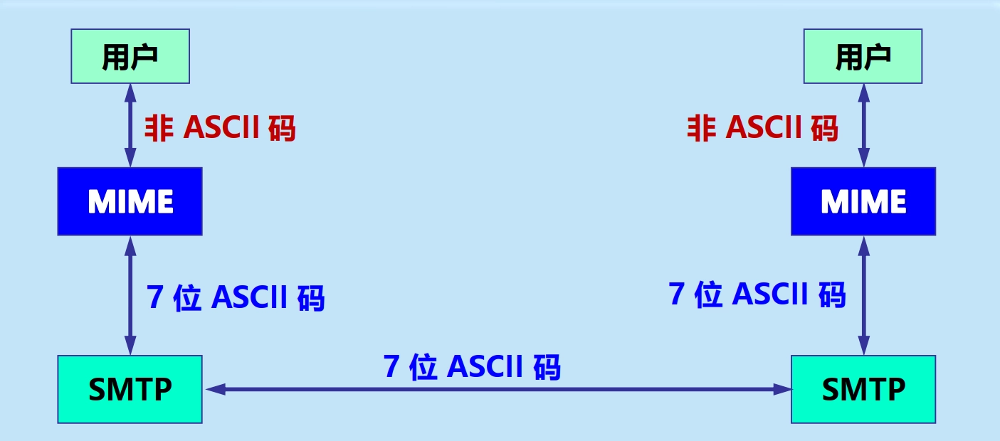

- MIME 的主要内容
	- 扩展了 RFC 822 邮件内容的**首部格式**。
	- 定义了许多邮件内容的**格式**，对多媒体电子邮件的表示方法进行了标准化。
	- 定义了**传送编码**，可对任何内容格式进行转换，而不会被邮件系统改变。
- MIME 举例
	

#### 首部格式扩展

- 增加 5 个新的邮件**首部字段**：
	- MIME-Version：MIME 的版本。若无此行则为英文文本。
	- Content-Description：用于对此邮件进行说明的可读字符串。
	- Content-Id：邮件的唯一标识符。
	- Content-Transfer-Encoding：传送时邮件主体使用的编码方法。
	- Content-Type：邮件内容类型 / 子类型。

#### 内容传送编码（Content-Transfer-Encoding）

- 7-bit 编码：默认的 7 位 ASCII 编码，每行不能超过 1000 个字符（包括回车和换行）。
- 8-bit 编码：8 位非 ASCII 编码，每行不能超过 1000 个字节（包括回车和换行）。
- Binary 编码：8 位非 ASCII 编码，不限行长度。
- **Base64 编码**：将任意长度的字节串转换为用 7 位 ASCII 编码表示的字符串。
	- 适用情况：任意长度的二进制数据或非文本数据的编码。
	- 编码规则：
		- 把要传送的字节串每 3 个字节（24 位）作为一组，划分为 4 个 6 位组。
		- 将每个 6 位组转换为一个对应的 ASCII 字符，从而得到 4 个 ASCII 字符。
		- 若最后一组不足 3 个字节，则在后面补零，得到 4 个 6 位组后，再用等号 `=` 补足编码字符数，使其仍为 4 个字符。
			- 一个字节缺失时，补一个等号 `=`。
			- 两个字节缺失时，补两个等号 `==`。
	- 示例：
		

- **Quoted-printable 编码**：将任意长度的字节串转换为 ASCII 编码表示的字符串。
	- 适用情况：可用于二进制和非文本数据的编码，适用于所传送的数据中只有**少量**的非 ASCII 码的情况。
	- 编码规则：
		- 将所有非打印字符（ASCII 码小于 32 或大于 126）转换为等号 `=` 后跟该字符的两个十六进制表示。
		- 将等号 `=` 本身用 `=3D` 来表示。
		- 将每行的长度限制在 76 个字符以内，超过时在适当位置插入软回车，即在行尾加上等号 `=`，然后换行，下一行继续。
	- 示例：
		

#### 内容类型（Content-Type）

- MIME 标准规定：Content-Type 说明必须含有两个标识符：**内容类型**（type）和**子类型**（subtype），中间用 `/` 分开。
- MIME 标准原先定义了 7 个基本内容类型和 15 种子类型，同时允许发件人和收件人自己定义专用的内容类型。
	- 为避免可能出现名字冲突，标准要求自定义的专用内容类型名称要以字符串 `X-` 开始。
- MIME Content-Type 说明中的类型及子类型

	| 内容类型 | 子类型举例 | 说明 |
	|----------|------------|------|
	| text（文本） | plain，html，xml，css | 不同格式的文本 |
	| image（图像） | gif，JPEG，tiff | 不同格式的静止图像 |
	| audio（音频） | basic，mpeg，mp4 | 可听见的声音 |
	| video（视频） | mpeg，mp4，quicktime | 不同格式的影片 |
	| model（模型） | vrml | 3D 模型 |
	| application（应用） | octet-stream，pdf，javascript，zip | 不同应用程序产生的数据 |
	| message（报文） | http，rfc822 | 封装的报文 |
	| multipart（多部分） | mixed，alternative，parallel，digest | 多种类型的组合 | 

## 动态主机配置协议 DHCP

- **协议配置**：在协议软件中，给协议参数赋值的过程称为协议配置。
	- 一个协议软件在使用之前必须是已正确配置的。
	- 具体的配置信息取决于协议栈。
- 连接到互联网的计算机的协议软件需要正确配置的参数包括：
	1. IP 地址
	2. 子网掩码
	3. 默认路由器的 IP 地址（默认网关）
	4. 域名服务器的 IP 地址（DNS）

### DHCP 概述

- **动态主机配置协议** DHCP（Dynamic Host Configuration Protocol）：是一种用于动态分配 IP 地址及其他网络配置信息的协议，采用**客户服务器**方式，使用 **UDP** 进行通信，熟知端口号为 67（服务器端）和 68（客户端）。
	- 作用：提供了**即插即用连网**（plug-and-play networking）的机制，允许一台计算机能够自动加入网络和获取 IP 地址及其他配置信息，而不用手工配置。
	- 特点：DHCP 给运行服务器软件、且位置固定的计算机指派一个永久地址，给运行客户端软件的计算机分配一个临时地址。
- DHCP 组成部分
	- DHCP 客户：向 DHCP 服务器请求 IP 地址及其他配置信息的计算机。
		- 以**广播**方式发送**发现报文**（DHCPDISCOVER）。
	- DHCP 服务器：负责给 DHCP 客户分配 IP 地址及其他配置信息。
		- 维护一个 IP 地址池。
		- 以**单播**方式发送**提供报文**（DHCPOFFER）。
	- DHCP 中继代理（relay agent）：负责在 DHCP 客户和 DHCP 服务器之间转发 DHCP 报文。
		- 并非每个网络上都存在 DHCP 服务器，但都至少有一个 DHCP 中继代理。
		- 配置了 DHCP 服务器的 IP 地址信息。
		- 以**单播**方式转发 DHCP 报文。
			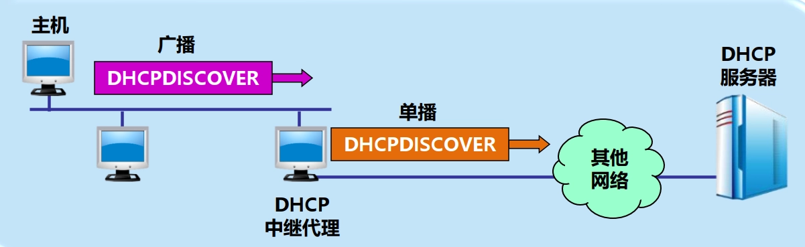

- DHCP 工作方式
	- DHCP 使用**客户服务器**方式，采用**请求/应答**方式工作。
		- 需要 IP 地址的主机在启动时就向 DHCP 服务器广播**发现报文**，这时该主机就成为 DHCP 客户。
		- 本地网络上所有主机都能收到此广播报文，但只有 DHCP 服务器才回答此广播报文。
		- DHCP 服务器先在其数据库中查找该计算机的配置信息。若找到，则返回找到的信息。若找不到，则从服务器的 IP 地址池（address pool）中取一个地址分配给该计算机。
		- DHCP 服务器将 IP 地址及其他配置信息封装在**提供报文**中单播发回给 DHCP 客户。
	- DHCP 基于 **UDP** 工作，DHCP 服务器运行在 67 号端口，DHCP 客户运行在 68 号端口。
- **租用期**（lease period）
	- 定义：DHCP 服务器分配给 DHCP 客户的 IP 地址是**临时**的，该地址可用的有限时间就是租用期。租用期到后，DHCP 客户必须向 DHCP 服务器申请续租，否则该地址将被收回。
	- 租用期的数值应由 DHCP 服务器自己决定，DHCP 客户也可在自己发送的报文中（例如，发现报文）提出对租用期的要求。

### DHCP 报文

- 发现报文：DHCPDISCOVER
- 提供报文：DHCPOFFER
- 请求报文：DHCPREQUEST
- 确认报文：DHCPACK
- 否认报文：DHCPNACK
- 释放报文：DHCPRELEASE

### DHCP 工作过程
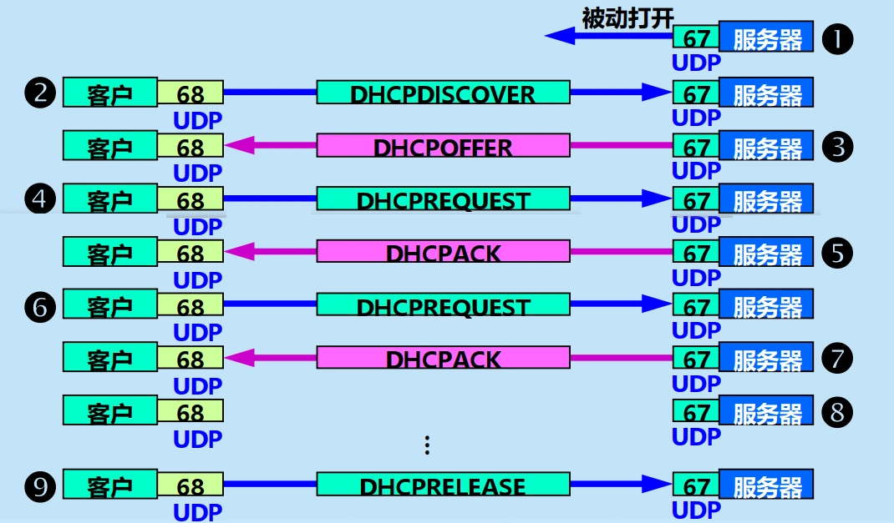

1. DHCP 服务器被动打开 UDP 端口 67，等待客户端发来的报文。
2. DHCP 客户从 UDP 端口 68 发送 DHCPDISCOVER。
3. 凡收到 DHCP 发现报文的 DHCP 服务器都发出 DHCPOFFER，因此 DHCP 客户可能收到多个 DHCP 提供报文。
4. DHCP 客户从几个 DHCP 服务器中选择其中的一个，并向所选择的 DHCP 服务器发送 DHCPREQUEST。
5. 被选择的 DHCP 服务器发送 DHCPACK，此时起 DHCP 客户就可以开始使用得到的临时 IP 地址了，进入已绑定状态。
	- DHCP 客户根据服务器提供的租用期 $T$ 设置两个计时器 $T_{1}=0.5T$ 和 $T_{2}=0.875T$。
6. $T_{1}$ 时间到时，DHCP 客户发送 DHCPREQUEST，要求更新租用期。
7. DHCP 服务器若同意，则发回 DHCPACK，DHCP 客户得到了新的租用期，重新设置计时器。
8. DHCP 服务器若不同意，则发回 DHCPNACK。这时 DHCP 客户必须立即停止使用原来的 IP 地址并重新申请 IP 地址（回到步骤 2）。
	- 若 DHCP 客户未收到 DHCP 服务器响应，则在 $T_{2}$ 时间到时，必须重新发送 DHCPREQUEST 要求更新租用期。
	- 若租用期结束时仍未收到 DHCP 服务器响应，则 DHCP 客户必须立即停止使用原来的 IP 地址并重新申请 IP 地址（回到步骤 2）。
9. DHCP 客户可随时向 DHCP 服务器发送 DHCPRELEASE，提前终止服务器所提供的租用期，释放 IP 地址。

## 简单网络管理协议 SNMP
### 网络管理的基本概念

- 网络管理（网管）：包括对硬件、软件和人力的使用、综合与协调，以便对网络资源进行监视、测试、配置、分析、评价和控制，这样就能以合理的价格满足网络的一些需求，如实时运行性能，服务质量等。
- 网络管理的五大功能（FCAPS）
	- **故障管理**（Fault Management）：故障检测、隔离和纠正。
	- **配置管理**（Configuration Management）：初始化网络、并配置网络。
	- **计费管理**（Accounting Management）：记录网络资源的使用。
	- **性能管理**（Performance Management）：估价系统资源的运行状况及通信效率等。
	- **安全管理**（Security Management）：对授权机制、访问控制、加密和加密关键字的管理。
- 网络管理的一般模型
	

- 网络管理的主要构件
	- **管理者**（Manager）：管理站（硬件）或管理程序（软件）。大型网络往往实行**多级管理**，因而有多个管理者，而一个管理者一般只管理本地网络的设备。
		- **管理站**/**网络运行中心** NOC（Network Operations Center）：运行管理程序的计算机，是网络管理系统的核心。
		- **管理程序**：运行在管理站中的关键构件，在运行时成为管理进程。
	- **网络管理员**（Administrator）：负责网络管理的人员。
	- **被管设备**（Managed Device）：网络中被管理的各种硬件设备，有时可称为**网络元素或网元**。
		- **被管对象**（Managed Object）：网络中被管理的各种资源。
			- 网络的每一个被管设备（包括设备中的软件）中可能有多个被管对象。
			- 在被管设备中也会有一些不能被管的对象。
		- **网络管理代理程序**/**代理**（Agent）：运行在被管设备中的程序。
			- 在每一个被管设备中都要运行一个程序，以便和管理站中的管理程序进行通信。
			- 代理程序在管理程序的命令和控制下在被管设备上采取本地的行动。
	- **网络管理协议**/**网管协议**（Network Management Protocol）：管理程序和代理程序之间进行通信的规则。
		- 网络管理员利用网络管理协议，通过管理站对网络中的被管设备进行管理。
		- **网管协议本身不管理网络**。
- 网络管理的基本原理：若要管理某个对象，就必然会给该对象添加一些软件或硬件，但这种“添加”必须对原有对象的影响尽量小些。
	- 最重要的指导思想：**尽可能简单**。

### 简单网络管理协议 SNMP

- **简单网络管理协议** SNMP（Simple Network Management Protocol）：是一种用于网络管理的应用层协议，其中的管理程序和代理程序按**客户服务器方式**工作，采用 **UDP** 进行通信，熟知端口号为 161（代理程序）和 162（管理程序）。
	- 代理程序运行 SNMP 服务器程序，使用 UDP 熟知端口 161 接收来自管理程序的请求或命令，返回响应或执行某个动作。
	- 管理程序运行 SNMP 客户程序，使用 UDP 熟知端口 162 向某个代理程序发出请求或命令，接收来自代理程序的响应。
	- 在网管系统中，往往是一个（或少数几个）客户程序与很多的服务器程序进行交互。
- SNMP 的基本功能：
	1. 监视网络性能
	2. 检测分析网络差错
	3. 配置网络设备等
- SNMP 的管理站和委托代理
	- **管理站**：
		- 运行 SNMP 客户程序的计算机。
		- 管理站通过 SNMP 与被管设备中的代理程序进行通信。
	- **委托代理**（proxy agent）：运行在管理站中的程序，用于解决网络元素使用另一种网络管理协议时的兼容问题。
		- 委托代理充当管理站和被管设备之间的中介。
		- 委托代理能提供协议转换和过滤操作等功能，对被管对象进行管理。
	- 示意图：
		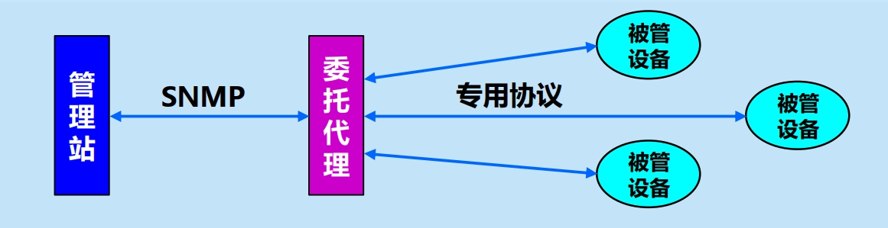

- SNMP 网络管理组成
	1. **SNMP 本身**
		- SNMP 定义了管理站和代理之间所交换的**分组格式**：所交换的分组包含各代理中的对象（变量）名及其状态（值）。
		- SNMP 负责读取和改变这些数值。
	2. **管理信息结构** SMI（Structure of Management Information）
		- SMI 定义了命名对象、定义对象类型、对对象及其值进行编码的**通用规则**：确保网络管理数据的语法和语义的**无二义性**。
		- SMI 并不定义一个实体应管理的对象数目，也不定义被管对象名以及对象名及其值之间的关联，而是为这些定义提供了一个框架。
	3. **管理信息库** MIB（Management Information Base）
		- MIB 在被管理的实体中创建了命名对象，并规定了其类型。
		- 管理程序使用 MIB 中的信息，对网络进行管理。
		- 示意图：
			

### 管理信息结构 SMI

-  SMI 规定了管理信息的**命名规则**、**数据类型**和**编码规则**，主要解决以下三个问题：
	1. 被管对象应怎样命名
	2. 用来存储被管对象的数据类型有哪些
	3. 在网络上传送的管理数据应如何编码

#### SMI 命名规则

- 所有被管对象必须在命名树上：
	

- SMI 使用 ASN.1 标准来定义命名规则：
	- SMI 标准指明：所有的 MIB 变量必须使用**抽象语法记法 1**（ASN.1）来定义。
	- SMI 既是 ASN.1 的子集，又是 ASN.1 的超集。
	- ASN.1 的记法很严格，使得数据的含义不存在任何可能的二义性。

#### SMI 数据类型

1. 简单类型：
	- INTERGER：任意长度整数。
	- BIT STRING：0 位或多位组成的二进制串。
	- OCTET STRING：0 位或多位组成的字节串。
	- NULL：空值。
	- OBJECT IDENTIFIER：定义的数据类型。
2. 结构化类型：
	- SEQUENCE：由多个数据类型按序组成的值。
	- SEQUENCE OF：由同一数据类型按序组成的值。
	- CHOICE：可以从多个数据类型中选择一个。
	- ANY：任何数据类型。

#### SMI 编码规则

- SMI 使用 ASN.1 制定的 BER 进行数据的编码。
- **基本编码规则** BER（Basic Encoding Rules）：ASN.1 标准定义的编码规则之一，规定了如何将 ASN.1 所定义的数据类型进行编码，指明了每种数据类型中每个数据的值的表示。
	- 发送端用 BER **编码**，可将用 ASN.1 所表述的报文转换成唯一的比特序列。
	- 接收端用 BER **解码**，得到该比特序列所表示的 ASN.1 报文。
- BER 的编码方法：**TLV**（Type-Length-Value）
	- **编码格式**：类型 T - 长度 L - 值 V
	- T 字段：定义数据的类型。
		- 长度：1 字节
		- 组成：类别 2 位 - 格式 1 位 - 编号 5 位
			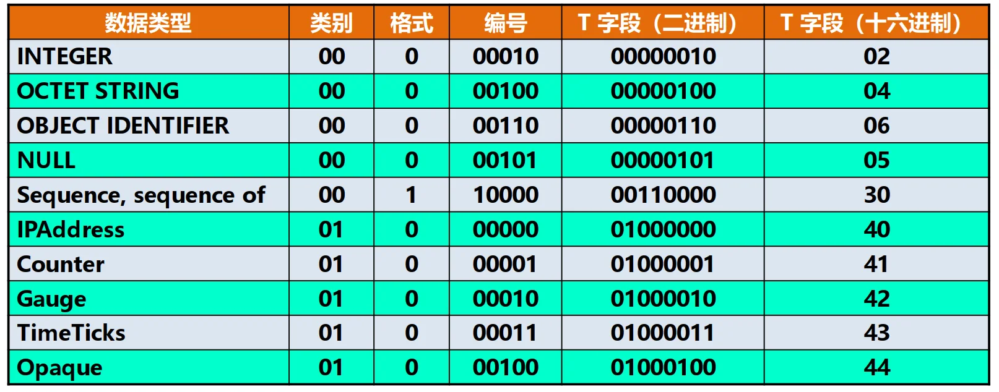

	- L 字段：定义 V 字段的长度。
		- 长度：可变
			- 单字节 L 字段：指出 V 字段的长度（0 到 127 字节）。
			- 多字节 L 字段：首字节指出后续字节数 $n$（1 到 126 字节），后续 $n$ 个字节表示 V 字段的长度。
	- V 字段：定义数据的值。
		- 长度：可变
			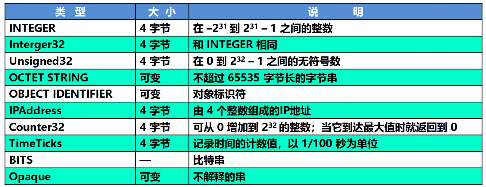

		- TLV 中的 V 字段可嵌套其他数据元素的 TLV 字段
	- 示例：
		1. INTEGER = `15`，其 T 字段是 02，INTEGER 类型要用 4 字节编码。最后得出 TLV 编码为 `02 04 0000000F`。
		2. IPAddress = `192.1.2.3`，其 T 字段是 40，V 字段需要 4 字节表示，因此得出 TLV 编码是 `40 04 C0010203`。

### 管理信息库 MIB

- **管理信息库** MIB（Management Information Base）：**被管对象**维持的可供管理程序读写的若干控制和状态信息的集合。
	- 管理程序使用 MIB 中这些信息的**值**对网络进行管理（如读取或重新设置这些值）。
	- **只有在 MIB 中的对象才是 SNMP 所能够管理的**。
- 示例：
	

	- 节点 mib-2：表示互联网管理信息库的根节点。包含多个信息类别，如：
		1. system：操作系统
		2. interfaces：网络接口
		3. address translation：地址转换
		4. ip：IP 协议
		5. icmp：ICMP 协议
		6. tcp：TCP 协议
		7. udp：UDP 协议
		8. egp：EGP 协议
		9. ……
	- mib 变量示例：
		- sysUpTime：属于 system 类别，表示系统运行时间。
		- ifNumber：属于 interfaces 类别，表示网络接口的数目。
		- ipInReceives：属于 ip 类别，表示接收到的 IP 数据报
		- ……

### SNMP 的工作原理

- SNMP 的操作只有两种基本的管理功能：
	1. **读操作**，用 get 报文来检测各被管对象的状况；
	2. **写操作**，用 set 报文来改变各被管对象的状况。
- **探询机制**（polling）
	- 定义：管理程序定时向被管理设备**周期性**地发送**探询信息**，以获取被管对象的状态信息。
	- 优点：
		1. 可使系统相对简单。
		2. 能限制通过网络所产生的管理信息的通信量。
	- 缺点：
		1. 不够灵活，而且所能管理的设备数目不能太多。
		2. 开销也较大。
- **陷阱机制**（trap）
	- 定义：当被管对象发生某些特殊事件时，代理程序可以不经询问就主动向管理进程发送**陷阱报文**（trap），以通知管理进程这些事件的发生。
		- 当被管对象的代理检测到有事件发生时，就检查其门限值。
		- 代理只向管理进程报告达到某些门限值的事件（即**过滤**）。
	- 过滤的好处：
		1. 仅在严重事件发生时才发送陷阱。
		2. 陷阱信息很简单且所需字节数很少。
- SNMP 使用无连接的 UDP
	- 运行**代理程序的服务器端**用 UDP **熟知端口** 161 接收 get 或 set 报文，发送响应报文。与熟知端口通信的客户端使用临时端口。
	- 运行**管理程序的客户端**则使用 UDP **熟知端口** 162 来接收来自各代理的 trap 报文。

### SNMP 报文
#### SNMPv1 定义的协议数据单元（PDU）类型
| PDU 编号（T 字段）| PDU 名称 | 用途 |
|------------------|----------|------|
| 0（A0）| GetRequest | 用来查询一个或一组变量的值 |
| 1（A1）| GetNextRequest | 允许在 MIB 树上读取下一个变量，此操作可反复进行 |
| 2（A2）| Reponse | 代理向管理者或管理者向管理者发送响应 |
| 3（A3）| SetRequest | 对一个或多个变量值进行设置 |
| 5（A5）| GetBulkRequest | 管理者从代理读取大数据块的值 |
| 6（A6）| InformRequest | 管理者从另一管理者读取代理的变量 |
| 7（A7）| SNMPv2Trap | 代理向管理者报告异常事件 |
| 8（A8）| Report | 管理者之间报告某些差错 |

#### SNMP 报文格式
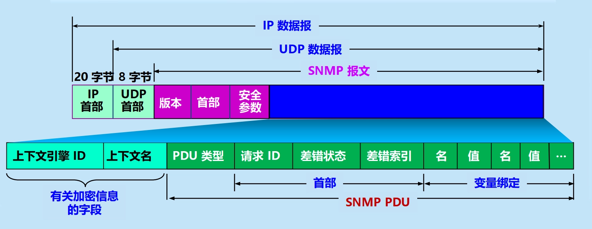

#### Get-request 报文实例分析

- Get-request 报文 ASN.1 定义
	```
	Get-request-PDU ::= [0]			 // [0] 表示上下文类，编号为 0
	IMPLICIT SEQUENCE{				  // 类型是SEQUENCE
	request-id integer32，			  // 变量 request-id 的类型是 integer32
	error-status INTEGER{0..18}，	   // 变量 error-status 取值为 0 ~ 18 的整数
	error-index INTEGER{0..max-bindings}，// 变量 error-index取值为 0~ max-bindings 的整数
	variable-bindings VarBindList	   // 变量 variable-binding 的类型是 VarBindList
	}
	```

- Get-request 报文的 BER 编码
	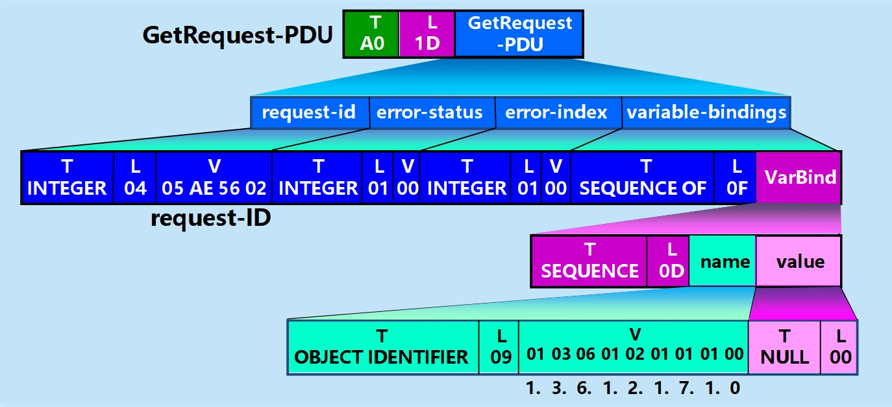

- Get-request 报文的十六进制编码
	```
	A0 1D			   // GetRequest-PDU，上下文类型，长度 1D_{16} = 29$
	02 04 05 AE 56 02   // INTEGER 类型，长度  04_{16}，request-id = 05 AE 56 02
	02 01 00			// INTEGER 类型，长度 01_{16}，error status = 00_{16}
	02 01 00			// INTEGER 类型，长度 01_{16}，error index = 00_{16}
	30 0F			   // SEQUENCE OF 类型，长度 0F_{16} = 15
	30 0D			   // SEQUENCE 类型，长度  0D_{16} = 13
	06 09 01 03 06 01 02 01 07 01 00 // OBJECT IDENTIFIER 类型，长度  09_{16} ，udplInDatagrams 
	05 00			   // NULL 类型，长度  00_{16}$
	```

## 应用进程跨越网络的通信
### 系统调用和应用编程接口

- 大多数操作系统使用**系统调用**（system call）的机制在应用程序和操作系统之间传递控制权。
	

- **系统调用接口**：实际上就是应用进程的控制权和操作系统的控制权进行转换的一个接口。
- **应用编程接口** API（Application Programming Interface）：封装了系统调用接口的一组函数或例程的集合。
	- 作用：为应用程序员提供一组**函数调用**，以便应用程序员能够方便地使用操作系统所提供的服务，而不必了解系统调用接口的细节。
	- 几种应用编程接口 API
		- **套接字接口**（socket interface）：Berkeley UNIX 操作系统定义的 API。
		- **Windows Socket**：微软公司在其操作系统中，采用套接字接口 API 形成的一个稍有不同的 API。
		- **TLI**（Transport Layer Interface）：AT&T 为其 UNIX 系统 V 定义的 API。
	- 应用进程通过套接字接入到网络
		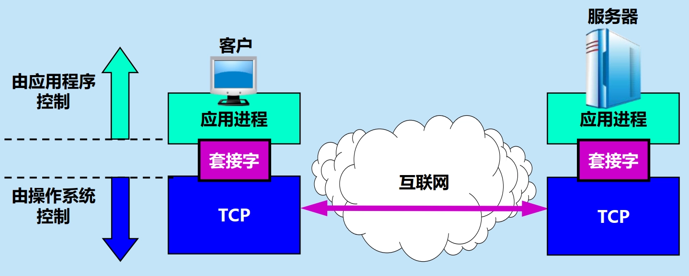

	- 套接字的作用
		- 当应用进程需要使用网络进行通信时就发出系统调用，请求操作系统为其**创建套接字**，以便把网络通信所需要的系统资源分配给该应用进程。
		- 操作系统为这些资源的总和用一个**套接字描述符**的号码来表示。
		- 应用进程所进行的网络操作都必须使用这个套接字描述符。
		- 通信完毕后，应用进程通过一个**关闭套接字的系统调用**通知操作系统**回收**与该套接字描述符相关的所有资源。
	- 调用 socket 创建套接字
		

### 基于 TCP/IP 的应用进程通信

- 当应用进程需要使用网络进行通信时，就发出系统调用。
	- 只需使用 TCP/IP 的 API（即套接字接口），就可以实现网络通信或开发基于互联网的应用程序，而不用了解 TCP/IP 协议的细节。
	- 调用 API 时，用户可以使用 TCP 服务，也可以使用 UDP 等其他服务。
- 使用 TCP 服务时，应用进程通常要经历三个阶段：
	

	1. **连接建立阶段**
		1. 通信之前，**客户和服务器**先创建套接字
		2. **服务器端**调用 bind（绑定），把熟知端口号和本地 IP 地址填写到已创建的套接字中。
		3. **服务器端**调用 listen（收听），把套接字设置为被动方式，以便随时接受客户的服务请求。
		4. **服务器端**调用 accept（接受），以便把远地客户进程发来的连接请求提取出来。
			- 调用 accept 要完成的动作较多。这是因为一个服务器必须能够同时处理多个连接。这样的服务器常称为并发方式（concurrent）工作的服务器。
			- 
		5. **客户进程**调用 connect，以便和远地服务器建立连接（这就是主动打开）。
	2. **数据传送阶段**
		- 客户和服务器在 TCP 连接上使用 send 传送数据，使用 recv 接收数据。
	3. **连接释放阶段**
		- 客户或服务器通信结束，调用 close 释放连接和撤销套接字。
- 使用 UDP 服务时，应用进程通常也要经历上述三个阶段，区别在于：UDP 服务器不使用 listen 和 accept 系统调用。

## P2P 应用

- P2P 工作方式概述：在 P2P 工作方式下，所有的音频/视频文件都是**在普通的互联网用户之间传输**的。
	- 每一个用户既是**客户**，也是**服务器**。
	- 用户既可以向其他用户请求文件，也可以把自己拥有的文件提供给其他用户下载。

### P2P 工作方式的发展
#### 集中式目录服务器

- Napster：
	- 第一代 P2P 文件共享程序，最早使用 P2P 技术，采用**集中式目录服务器**的方法定位内容。
	- 提供免费下载 MP3 音乐，将所有音乐文件的索引信息都集中存放在 Napster 目录服务器中。
	- 使用者只要查找目录服务器，就可知道应从何处下载所要的 MP3 文件。
	- 用户要及时向 Napster 的目录服务器报告自己存有的音乐文件。
- Napster 的**文件传输是分散的，文件定位则是集中的**。
	- 文件传输：P2P 方式
	- 文件定位：客户服务器方式
- Napster 的工作过程
	

	1. 用户 X 采用客户服务器方式向 Napster 目录服务器查询谁有音乐文件 MP3#。
	2. Napster 目录服务器回答 X 有 MP3# 的 A、B、C 的 IP 地址。
	3. 用户 X 可以随机地选择三个地点中的任一个。假定 X 向 A 发送下载文件 MP3# 的请求报文，双方都使用 P2P 方式通信。
	4. 对等方 A（现在作为服务器）把文件 MP3# 发送给 X。
- 集中式目录服务器的缺点：
	- 可靠性差
	- 会成为性能的瓶颈

#### 全分布式结构

- Gnutella：
	- 第二代 P2P 文件共享程序，采用**全分布**的方法定位内容。
- Gnutella 与 Napster 最大的区别：不使用集中式的目录服务器，而是使用**洪泛法**在大量 Gnutella 用户之间进行查询。
	- 为了不使查询的通信量过大，Gnutella 设计了一种**有限范围的洪泛查询**，减少了倾注到互联网的查询流量，但也影响到查询定位的准确性。

#### 分散定位和分散传输技术

- 第三代 P2P 文件共享程序采用**分散定位和分散传输技术**。
- 典型程序：KaZaA，电骡 eMule，比特洪流 BT（Bit Torrent）等。
- BT 的基本概念：
	- **对等方**（peer）：参与文件共享的主机。
	- **相邻对等方**（neighboring peers）：与 A 建立了 TCP 连接的对等方。
	- **洪流**（torrent）：所有对等方的集合。
	- **文件块**（chunk）；下载文件的数据单元，长度固定。
	- **追踪器**（tracker）：集中式目录服务器，维护洪流中所有对等方的 IP 地址，是基础设施节点。
- BT 的主要特点：
	- 相邻关系是逻辑的，对等方的数目是动态变化的
		

	- 对等方之间互相传送文件数据块
		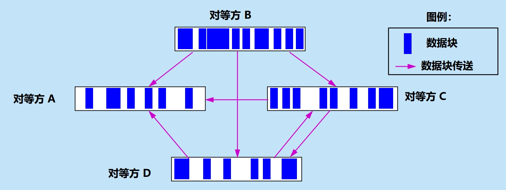

- BT 协议
	- 请求：**最稀有的优先**（rarest first），首先向其相邻对等方请求**稀有**的文件块。
		- **稀有**：如果 A 所缺少的文件块在相邻对等方中的副本很少，则该文件块稀有。
	- 发送：**最高数据率优先**（highest data rate first），优先把文件块传送给**传送数据率最高**的相邻对等方。

### P2P 文件分发的分析

- 基本概念
	- 下载（download）：从互联网传送数据到主机
	- 上传（upload）/上载：从主机传送数据到互联网
- 有 $N$ 台主机从服务器下载一个大文件，其长度为 $F~bit$。假定主机与互联网连接的链路的上传速率和下载速率分别为 $u_{i}$ 和 $d_{i}$，单位都是 $bit/s$。服务器的上传速率为 $u_{s}~bit/s$。
	- 示意图：
		

	- **客户服务器**方式下分发的最短时间分析
		- 从服务器端考虑，所有主机分发完毕的最短时间 $T_{cs} \geq NF/u_{s}$
		- 下载速率最慢的主机的下载速率为  $d_{\min}$ ，则  $T_{cs} \geq F/d_{\min}$
		- 由此可得出所有主机都下载完文件 $F$ 的最少时间是：

			$$
			T_{cs} \geq \max(NF/u_{s},F/d_{\min})
			$$

	- **P2P** 方式下分发的最短时间分析
		- 初始服务器文件分发的最少时间 $T_{p2p} \geq F/u_{s}$
		- 下载文件分发的最少时间 $T_{p2p} \geq F/d_{\min}$
		- 上载文件分发的最少时间 $T_{p2p} \geq NF/u_{T}$，其中上传速率之和 $u_{T} = \sum_{i=1}^{N}u_{i} + u_{s}$
		- 所有主机都下载完文件 $F$ 的最少时间的下限是：

			$$
			T_{p2p} \geq \max(F/u_{s},F/d_{\min},NF/u_{T})
			$$

	- 时间比较
		- 设所有的对等方的上传速率都是  $u$ ，并且 $F/u = 1~h$，服务器的上传速率 $u_{s} = 10u$。
		- 当 $N = 30$ 时

			$$
			\begin{aligned} T_{cs} & \geq \max(\frac{30F}{10u},\frac{F}{d_{\min}}) = \max(\frac{3F}{u},\frac{F}{d_{\min}}) \geq 3~h \\ T_{p2p} & \geq \max(\frac{F}{10u},\frac{F}{d_{\min}},\frac{30F}{40u}) = \max(\frac{F}{10u},\frac{F}{d_{\min}},\frac{3F}{4u}) \geq 0.75~h \end{aligned}
			$$

### 在 P2P 对等方中搜索对象

- 集中式目录服务器
- 全分布式，在非结构化的覆盖网络中采用洪泛查询
- **分布式散列表/分布式哈希表** DHT（Distributed Hash Table）
	- 现在广泛使用的索引和查找技术。
	- 由大量对等方共同维护。
	- 广泛使用的 **Chord** 算法是美国麻省理工大学于 2001 年提出的。
- **基于 DHT 的 Chord 环**
	- 基本思想：
		- 分布式散列表 DHT 利用散列函数，把资源名 K 及其存放的结点 IP 地址 N 都分别映射为**资源名标识符** KID 和**结点标识符** NID。
		- Chord 把结点按标识符数值**从小到大**沿顺时针排列成一个**环形覆盖网络**。
		- 每个资源由 **Chord 环上与其标识符值最接近的下一个结点**提供服务。
	- 示例
		

- **通过指针表加速 Chord 表查找**
	- 为了加速查找，在 Chord 环上可以增加一些**指针表**（finger table），又称为路由表或查找器表。
		- 指针表分为两列：第一列是**起始位置**，第二列是**直接后继的活跃结点标识符**。
		- 每个结点 N 的指针表有 $m$ 行，第 $i$ 行存放的起始位置是 $(N + 2^{i - 1})~mod~2^{m}$。
	- 示例：对于结点 N4，其指针表的第 2 列第  $i$  行根据  $(N4 + 2^{i - 1})$  计算得出其后继结点。
		

		- 指针表：
			- N4+1=5，要找第一个大于等于 5 的节点：N7
			- N4+2=6，要找第一个大于等于 6 的节点：N7
			- N4+4=8，要找第一个大于等于 8 的节点：N10
			- N4+8=12，要找第一个大于等于 12 的节点：N20
			- N4+16=20，要找第一个大于等于 20 的节点：N20
		- 加速查询：
			- 若要从节点 N4 查找资源 K12，因为 $12 \not\in [4,7]$，所以需要跳转
			- 从大步长到小步长遍历 N4 的指针表，找到第一个小于等于 12 的节点 N10，跳转到 N10
			- 从 N10 查找资源 K12，因为 $12 \in [10,20]$，所以 N20 是资源 K12 的提供节点
			- 使用指针表：N4 → N10 → N20，共跳转 2 次
			- 不使用指针表：N4 → N7 → N10 → N20，共跳转 3 次