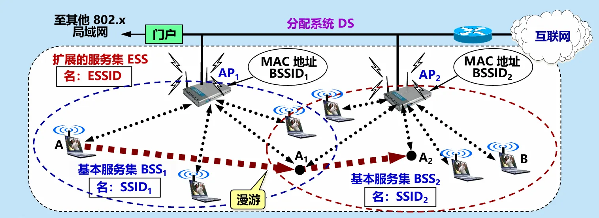
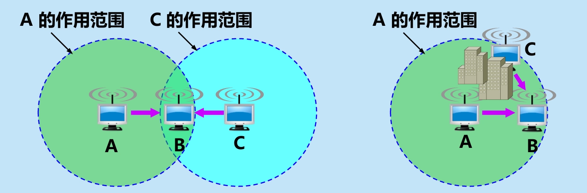
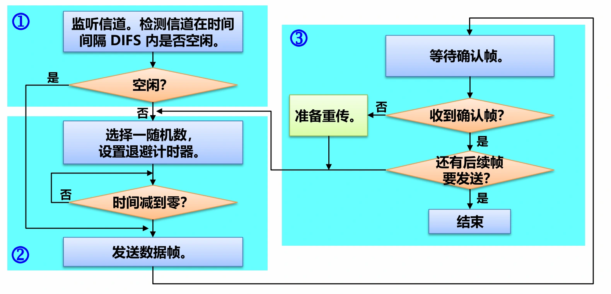
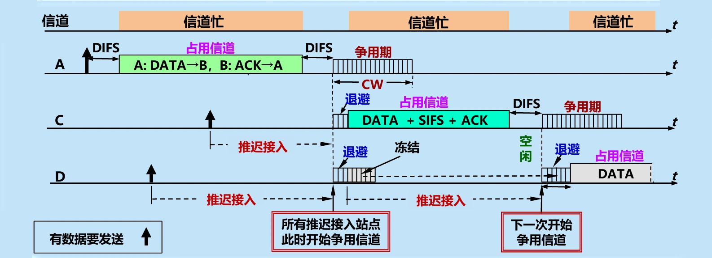
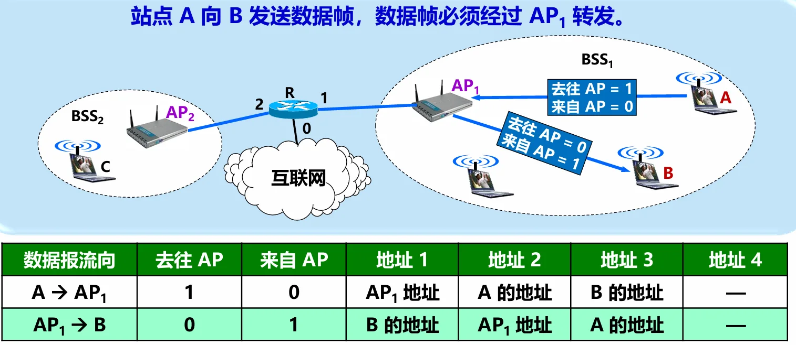
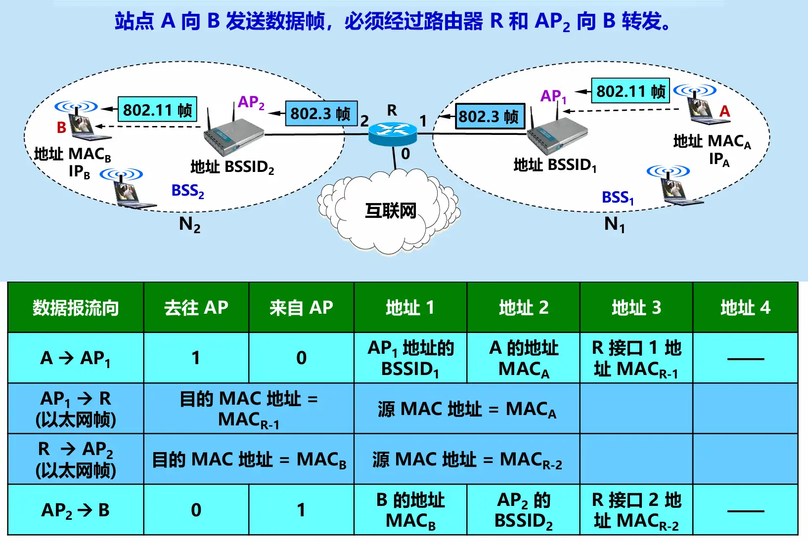
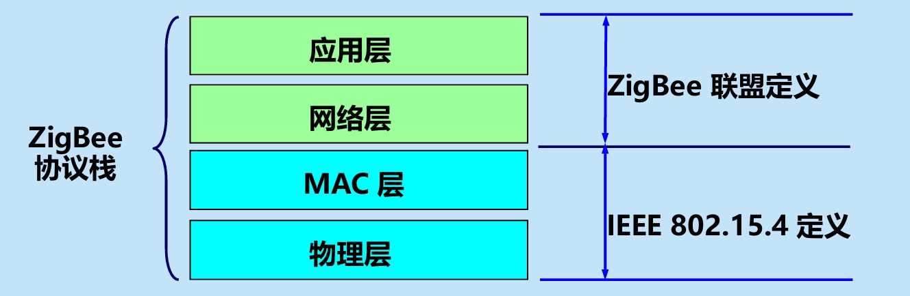
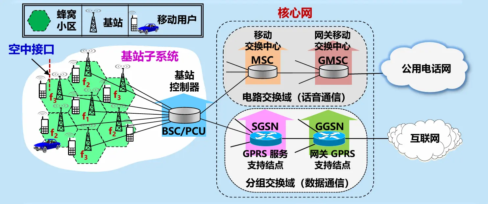
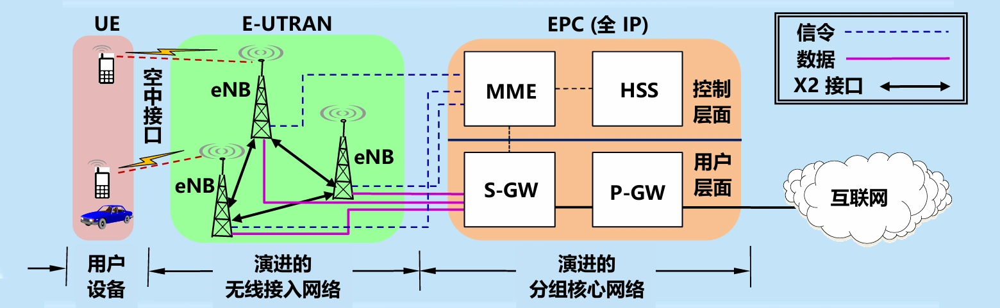

# 无线网络和移动网络

- [Back to Course Home](index.md)

## 无线局域网 WLAN
### 无线局域网的组成

- 无线局域网 WLAN（Wireless Local Area Network）：
	- 定义：采用无线通信技术的局域网。
	- 特点：
		1. 提供了移动接入的功能
		2. 节省投资，建网速度较快
		3. 支持便携设备联网
	- 分类：
		- 有固定基础设施的 WLAN
		- 无固定基础设施的 WLAN
			- 所谓“固定基础设施”是指预先建立起来的、能够覆盖一定地理范围的一批固定基站。
- 便携站和移动站
	- 便携站：便于移动，但在工作时，其位置是固定不变的。
	- 移动站：不仅能够移动，还可以在移动的过程中进行通信。

#### IEEE 802.11

- IEEE 802.11 是一个**有固定基础设施**的无线局域网的国际标准。
	1. 使用星形拓扑，中心叫做**接入点** AP（Access Point）。
		- AP 是无线局域网的基础设施，也是一个**链路层**的设备。
		- AP 也叫做无线接入点 WAP（Wireless Access Point）。
		- 无线局域网中的站点对网内或网外的通信都必须通过 AP。
	2. 在 MAC 层使用 CSMA/CA 协议
- 凡使用 802.11 系列协议的局域网又称为 Wi-Fi。

##### 服务集（service set）

- **基本服务集** BSS
	- 定义：基本服务集 BSS（Basic Service Set）是无线局域网的最小构件。
	- 组成：一个接入点 AP 和若干个移动站。
		- 必须为该 AP 分配一个不超过 32 字节的服务集标识符 SSID 和一个通信信道。
			- **服务集标识符 SSID**（Service Set Identifier）：即该 AP 的无线局域网的名字
			- **信道**（channel）：无线局域网通常使用 2.4 GHz 和 5 GHz 频段。每一个频段划分为若干个信道，供各无线局域网使用。
				- 802.11b 使用 2.4 GHz 频段，带宽约 85 MHz。定义了 11 个部分重叠的信道集。相邻信道的中心频率相差 5 MHz，每个信道的带宽约为 22 MHz。
					

	- **基本服务集标识符** BSSID：BSS 的标识符，一般就是 AP 的 MAC 地址，每个 AP 唯一。
		- 在无线局域网中传送的各种帧的首部中，都必须有 BSSID 字段，以标识该帧所属的 BSS。
		- 用户通常都知道所连接的无线局域网 SSID，但可以不知道其 BSSID。
	- 一个 BSS 所覆盖的地理范围叫做一个**基本服务区** BSA（Basic Service Area）。
		- BSS 的服务范围是由 AP 所发射的电磁波的辐射范围确定的。
- **扩展服务集** ESS
	- 定义：扩展服务集 ESS（Extended Service Set）是由两个或两个以上的基本服务集 BSS 通过有线或无线的分配系统 DS（Distribution System）连接而成的更大的无线局域网。
	- 组成：多个 BSS 和一个 DS。
	- **扩展服务集标识符** ESSID：ESS 的标识符，不超过 32 字符的字符串名字（**不是地址**）
	- DS 的作用：使 ESS 对上层的表现就像一个 BSS 一样。
		- DS 可以使用以太网（最常用）、点对点链路或其他无线网络。
	- ESS 还可为无线用户提供到 802.x 局域网（非 802.11 无线局域网）的接入：通过门户（Portal）设备实现，相当于一个网桥。
- 示意图
	

- 移动站 $A$ 如果要和另一个 BSS 中的移动站 $B$ 通信，就必须经过两个接入点 $AP_1$ 和 $AP_2$，即 $A \to AP_1 \to AP_2 \to B$。
	- 移动站 $A$ 漫游到位置 $A_{1}$  时，选择和信号较强的一个 $AP$ 联系。当漫游到位置 $A_{2}$ 时，就只能和  $AP_{2}$  联系了。
	- 移动站 $A$ 只要能够和其中一个 $AP$ 联系上，就可以一直保持与另一个移动站 $B$ 的通信。

##### 关联（association）

- 定义：**关联**（association）是指移动站和某个接入点 AP 之间建立的一种逻辑连接，表示这个移动站加入了选定的 AP 所属的子网，并和这个 AP 之间创建了一个虚拟线路。
	- 只有关联的 AP 才能向这个移动站发送数据帧，而这个移动站也只有通过关联的 AP 才能向其他站点发送数据帧。
- 建立关联的两种方法：
	1. **被动扫描**
		- 示意图：
			

		- 过程：
			1. $AP$ 周期性发出**信标帧**（beacon frame），其中包含 SSID、速率等系统参数。
			2. 移动站 $A$ 扫描 11 个信道，选择一个接入点，如 $AP_2$，向其发送**关联请求帧**（Association Request frame）。 
			3. $AP_2$ 同意移动站 $A$ 发来的关联请求，向移动站 $A$ 发送**关联响应帧**（Association Response frame），与移动站 $A$ 建立关联。
	2. **主动扫描**
		- 示意图：
			

		- 过程：
			1. 移动站 $A$ 主动发出广播的**探测请求帧**（Probe Request frame），让所有能够收到此帧的接入点知道有移动站要求建立关联。
			2. 两个 $AP$ 都回答**探测响应帧**（Probe Response frame）。
			3. 移动站 $A$ 选择一个接入点，如 $AP_{2}$ ，向其发出**关联请求帧**。
			4. $AP_{2}$ 向移动站 $A$ 发送**关联响应帧**，与移动站 $A$ 建立关联。
	- 一个移动站可以**同时**进行主动扫描和被动扫描。
- 重建关联（reassociation） 和分离（dissociation）
	- 移动站使用重建关联（reassociation）服务，可把这种关联转移到另一个接入点。
	- 当使用分离（dissociation） 服务时，可终止这种关联。
- 安全地建立关联
	- 用户在和附近的接入点 AP 建立关联时，一般还要键入用户密码。
	- 加密方案
		- 初期：有线等效的保密 WEP（Wired Equivalent Privacy）。
		- 现在：无线局域网受保护的接入 WPA（WiFi Protected Access） 或 WPA2。

#### 移动自组网络/自组网络（ad hoc network）

- 移动自组网络（Mobile Ad Hoc Network，MANET）
	- 定义：没有固定基础设施（即没有 AP）的无线局域网。
	- 示意图：
		

	- 三个主要问题：路由选择协议，多播，安全。
	- 特点：
		- 移动站都处于平等状态。
		- 服务范围通常是受限的，一般不和外界的其他网络相连接。
		- 移动自组网络也就是移动分组无线网络。
	- 优点：
		- 方便灵活。
		- 生存性非常好。
- **无线传感器网络** WSN（Wireless Sensor Network）
	- 定义：由大量传感器结点通过无线通信技术构成的自组网络。
	- 应用：进行各种数据的采集、处理和传输。
	- 特点：
		1. 不需要很高的带宽，但大部分时间必须保持低功耗。
		2. 对协议栈的大小有严格的限制。
		3. 对网络安全性、结点自动配置、网络动态重组等方面有一定的要求。
	- 无线传感器网络主要的应用领域：组成各种**物联网** IoT（Internet of Things）
- 移动自组网络与移动 IP 的区别
	- 移动 IP
		- 漫游的主机可以用多种方式连接到互联网。
		- 漫游的主机可以直接或通过无线链路连接到固定网络上的另一个子网。
		- 需要地址管理和增加协议的互操作性。
		- 核心网络功能仍然是各种路由选择协议。
	- 移动自组网络
		- 把移动性扩展到无线领域中的自治系统。
		- 具有自己特定的路由选择协议，并且可以不和互联网相连。
		- 即使和互联网相连时，移动自组网络也是以末梢网络（stub network）方式工作。
		- 末梢网络：不允许外部通信量穿越该网络。
- 接入方式的分类
	- **固定接入**（fixed access）： 在作为网络用户期间，用户设置的地理位置保持不变。
	- **移动接入**（mobility access）： 用户设置能够以车辆速度移动时进行网络通信。当发生切换时，通信仍然是连续的。
	- **便携接入**（portable access）： 在受限的网络覆盖面积中，用户设备能够在以步行速度移动时进行网络通信，提供有限的切换能力。
	- **游牧接入**（nomadic access）： 用户设备的地理位置至少在进行网络通信时保持不变。如用户设备移动了位置，则再次进行通信时可能还要寻找最佳的基站。

### 802.11 局域网的物理层

- 802.11 标准中物理层相当复杂。根据物理层的不同（如工作频段、数据率、调制方法等），对应的标准也不同。

	| 标准		  | 别名   | 频段		| 最高数据率   | 物理层	  | 优缺点									  |
	| ------------- | ------ | ----------- | ------------ | ----------- | ----------------------------------------- |
	| 802.11b（1999 年） | Wi-Fi 1 | 2.4 GHz	 | 11 Mbit/s	| 扩频		| 最高数据率较低，价格最低，信号传播距离最远，且不易受阻碍 |
	| 802.11a（1999 年） | Wi-Fi 2 | 5 GHz	   | 54 Mbit/s	| OFDM		| 最高数据率较高，支持更多用户同时上网，价格最高，信号传播距离较短，且易受阻碍。 |
	| 802.11g（2003 年） | Wi-Fi 3 | 2.4 GHz	 | 54 Mbit/s	| OFDM		| 最高数据率较高，支持更多用户同时上网，信号传播距离最远，且不易受阻碍，价格比 802.11b 贵。 |
	| 802.11n（2009 年） | Wi-Fi 4 | 2.4 / 5 GHz | 600 Mbit/s   | MIMO OFDM   | 使用多个发射和接收天线达到更高的数据传输率，当使用双倍带宽（40 MHz）时速率可达 600 Mbit/s。 |
	| 802.11ac（2014 年） | Wi-Fi 5 | 5 GHz	   | 7 Gbit/s	 | MIMO OFDM   | 完全遵循 802.11i 安全标准的所有内容，使得无线连接能够在安全性方面达到企业级用户的需求。 |
	| 802.11ax（2019 年） | Wi-Fi 6 | 2.4 / 5 GHz | 9.6 Gbit/s   | MIMO OFDM   | 侧重解决密集环境下（如火车站、机场）提高吞吐量密度（即单位面积的吞吐量） |

- 802.11 的物理层的几种实现方法
	1. 扩频
	2. 多入多出 MIMO（Multiple Input Multiple Output）
	3. 正交频分复用 OFDM（Orthogonal Frequency Division Multiplexing）
	4. 跳频扩频 FHSS（已很少用）
	5. 红外线 IR（已很少用）

### 802.11 局域网的 MAC 层协议
#### CSMA/CA 协议

- 背景
	- 无线局域网不能简单地搬用 CSMA/CD 协议，这是因为：
		1. 碰撞检测（CD）要求：一个站点在发送本站数据的同时，还必须不间断地检测信道，但接收到的信号强度往往会远远小于发送信号的强度，在无线局域网的设备中要实现这种功能就**花费过大**。
		2. 即使能够实现碰撞检测的功能，并且在发送数据时检测到信道是空闲的时候，在接收端仍然有**可能发生碰撞**。
	- 必须考虑的特点
		1. 无线局域网的适配器无法实现碰撞检测；
		2. 检测到信道空闲，其实信道可能并不空闲；
		3. 即使能够在硬件上实现无线局域网的碰撞检测功能，也无法检测出隐蔽站问题带来的碰撞。
			- **隐蔽站问题**（hidden station problem）： 由于无线信号覆盖范围和穿透能力有限，A 和 C 检测不到彼此的无线信号，都以为 B 是空闲的，因而都向 B 发送数据，结果发生碰撞。
				

- **CSMA/CA 协议**（Carrier Sense Multiple Access with Collision Avoidance）：
	- **载波监听** CS（Carrier Sense）：终端发送数据前，通过两种方式检测信道是否空闲：
		- **物理载波监听**（PHY Layer CS）：在物理层用硬件实现，检测无线信道的信号能量，若能量高于阈值（如 -85 dBm），判定信道忙；否则为空闲。
		- **虚拟载波监听**（Virtual CS）：通过软件实现，使用**网络分配向量**（NAV，Network Allocation Vector）告知其他终端信道占用状态。发送方会在帧头部携带表示信道将被占用的时间（DATA + SIFS + ACK，单位为微秒）的 NAV 值，其他终端接收后更新本地 NAV，在 NAV 倒计时结束前视为信道忙，无需物理监听即可避免冲突。
	- **碰撞避免** CA（Collision Avoidance）：无线信道无法像有线信道那样检测冲突（冲突检测 CD 不可行），因此用 “随机退避” 替代 “冲突检测”，核心流程如下：
		- **空闲信道检测**：终端监听信道，若信道空闲且持续时间大于等于分布式帧间间隔（DIFS，Distributed Inter-Frame Space），则进入争用期，执行退避算法争用信道。
		- **忙信道推迟接入**：若信道忙，则终端推迟接入，等待信道空闲并经过 DIFS 后再进入争用期，执行退避算法争用信道。
		- **随机退避**：退避计时器的初始值从竞争窗口 CW（Contention Window）中随机选取；退避过程中若信道再次变忙，则冻结退避计时器，待信道空闲后继续倒计时；退避计时器倒计时结束，则终端立即发送数据。
	- **信道预约**（可选）：为减少碰撞概率，可选择使用 RTS/CTS 机制借助 NAV 进行信道预约。
		- **请求发送** RTS（Request to Send）：发送方在发送数据前，先发送 RTS 帧，请求接收方分配信道。
		- **清除发送** CTS（Clear to Send）：接收方收到 RTS 帧后，若信道空闲，则回复 CTS 帧，允许发送方发送数据。
		- 其他终端收到 RTS 或 CTS 帧后，更新本地 NAV，避免在信道被占用期间发送数据。
	- **确认重传**：接收方在成功接收数据帧后，间隔 SIFS 时间发送确认帧 ACK，告知发送方数据已成功接收。若发送方未在规定时间内收到 ACK，则判定传输失败，启动重传流程：将 CW 近似加倍（$CW =\min(CW\times 2+1,CW_{\max})$，$CW_{\max}=1023$），然后重新执行退避与发送，直至重传次数达到上限（通常为 7 次）
- CSMA/CA 协议的要点
	

- 802.11 的 MAC 层通过**协调功能**来确定在基本服务集 BSS 中的移动站何时可以发送或接收数据。包括两个子层：
	

	1. **分布协调功能** DCF（Distributed Coordination Function）
		- DCF 子层：不采用任何中心控制。每个节点使用 CSMA/CA 机制的分布式接入算法，让各个站通过争用信道来获取发送权。
		- 因此 DCF 向上提供**争用服务**。
		- **所有实现都必须有 DCF 功能**。
	2. **点协调功能** PCF（Point Coordination Function）
		- PCF 子层：可选。使用集中控制的接入算法，用类似于探询的方法把发送数据权轮流交给各个站，从而避免碰撞。
		- 自组网络没有 PCF 子层。
		- 对时间敏感的业务，如分组话音，应使用提供无争用服务的 PCF。

#### 帧间间隔

- **帧间间隔** IFS（InterFrame Space）
	- 定义：在完成发送后，必须再等待一段很短的时间（继续监听）才能发送下一帧。
	- 两种常用的帧间间隔：
		- 短帧间间隔 SIFS
		- 分布协调功能帧间间隔 DIFS
- **短帧间间隔** SIFS
	- 定义：最短的帧间间隔，用来分隔属于一次对话的各帧。一个站应当能够在这段时间内从发送方式切换到接收方式。
	- 使用 SIFS 的帧类型：
		- ACK 帧
		- CTS 帧
		- 由过长的 MAC 帧分片后的数据帧
		- 所有回答 AP 探测请求帧
		- 在 PCF 方式中接入点 AP 发送出的任何帧
- **分布协调功能帧间间隔** DIFS
	- 定义：比 SIFS 的帧间间隔要长得多。在 DCF 方式中，DIFS 用来发送数据帧和管理帧。
	- 802.11 标准规定：凡在空闲时间想发送数据的站点，必须等待时间 DIFS 后才能发送。保证了确认帧 ACK 得以优先发送。
- 示意图：
	

	- A 监听信道。若信道在时间间隔 DIFS 一直都是空闲的，A 就可以在 $t_0$ 时间发送数据帧 DATA。
	- B 收到数据帧后，必须进行 CRC 检验。若检验无差错，再从接收状态转为发送状态。经过时间间隔 SIFS 后，向 A 发送确认帧 ACK。
	- 从 A 发送数据帧 DATA 开始，到收到确认 ACK 为止的这段时间（DATA+SIFS+ACK）内，必须不允许任何其他站发送数据，这样才不会发生碰撞。

#### 争用信道

- **推迟接入**（defer access）
	- 定义：当一个站点想发送数据时，若检测到信道忙，则必须推迟接入，等待信道空闲后再争用信道。
	- 过程：
		1. 站点检测到信道忙，推迟接入。
		2. 等待信道空闲。
		3. 信道空闲后，经过时间间隔 DIFS，再进入争用期，执行退避算法，开始争用信道。
- **退避**（backoff）
	- 定义：在争用期内，**所有推迟接入的站都必须执行统一的退避算法**，公平地争用信道。
	- **退避算法**：
		1. 站点在进入争用期时，各自在 $0 \sim CW$ 个时隙中随机生成一个退避时隙数，并各自设置**退避计时器**（backoff timer）。
		2. 退避计时器开始倒计时。每经过一个时隙，退避计时器就减 1。
		3. 当几个站同时争用信道时，计时器**最先降为零**的站首先接入媒体，发送数据帧。
		4. 这时信道转为忙，其他正在退避的站则**冻结**其计时器，保留计时器的数值不变，推迟到下次争用信道时**接着倒计时**。
	- 退避算法的使用场景
		1. 要发送数据时检测到信道忙，推迟接入等待信道空闲后，进入争用期。
		2. 已发出的数据帧未收到确认，需要重传数据帧。
		3. 需要接着发送后续的数据帧（为了防止一个站长期垄断发送权）。
	- 若有新站点想发送数据，并检测信道**连续空闲时间超过 DIFS** 时，即可**立即**发送数据，而不必经过争用期。
- 推迟接入与退避的区别
	- 推迟接入：
		- 发生在信道处于忙的状态，为的是等待争用期的到来，以便执行退避算法来争用信道。
		- 这时退避计时器处于冻结状态。
	- 退避：
		- 是争用期各站点执行的算法，退避计时器进行倒计时。
		- 这时信道是空闲的，并且总是出现在时间间隔 DIFS 的后面。
- **争用期/争用窗口** CW（Contention Window）
	- 定义：争用期是指在信道空闲且经过时间间隔 DIFS 后，各站点为争用信道而执行退避算法的这段时间。
	- 争用窗口由许多时隙（time slot）组成。
		- 例如：争用窗口 CW = 15 即窗口大小是 15 个时隙。
		- 时隙长度的确定
			- 方法：在下一个时隙开始时，每个站点都能检测出在前一个时隙开始时信道是否忙（这样就可采取适当对策）。
			- 时隙长短在不同 802.11 标准中可以有不同数值。
	- **建议值**：$15 \leq CW \leq 1023$
	- **CSMA/CA 规定**：如果未收到确认帧，则必须重传。但每重传一次，争用窗口的数值就**近似加倍**：$CW = \min(2 \times CW + 1, CW_{\max})$，其中 $CW_{\max} = 1023$。
- 示例：选择初始争用窗口 $CW = 2^{4} - 1 = 15$ ，第  $i$  次退避就在  $2^{4 + i} - 1$  个时隙中随机地选择一个，即：
	- 第 1 次重传时，$CW=31$，随机退避的时隙数应在 $0 \sim 31$ 之间生成。
	- 第 2 次重传时，$CW=63$，随机退避的时隙数应在 $0 \sim 63$ 之间生成。
	- 第 3 次重传时，$CW=127$，随机退避的时隙数应在 $0 \sim 127$ 之间生成。
	- 第 4 次重传时，$CW=255$，随机退避的时隙数应在 $0 \sim 255$ 之间生成。
	- 第 5 次重传时，$CW=511$，随机退避的时隙数应在 $0 \sim 511$ 之间生成。
	- 第 6 次以及 6 次以上重传时，$CW=1023$，随机退避的时隙数应在 $0 \sim 1023$ 之间生成，争用窗口 CW 不再增大了。

#### 信道预约

- 假设：B 站正好在 A 占用信道时要发送数据。B 检测到信道忙，于是推迟到争用信道时与 A 一起争用信道。但正巧 A 和 B 又生成了同样大小的随机退避时隙数。结果就发生了碰撞，A 和 B 都必须再重传。
	

- **信道预约**
	- 定义：为了减少碰撞的发生，802.11 标准引入了一种**信道预约**机制（也叫 RTS/CTS 机制）。
	- **请求允许发送（RTS/CTS）握手过程**：
		1. 发送方（A）发送 **请求发送帧** RTS（Request to Send），携带数据帧长度 + NAV 值，等待 CTS
		2. 接收方（AP）收到 RTS 后，若信道空闲，则等待 SIFS 后发送**允许发送帧** CTS（Clear to Send），携带相同 NAV 值。
		3. 所有监听范围内的终端（包括隐藏终端 C）接收 RTS/CTS 后，更新 NAV，在 NAV 期间不竞争信道。
		4. 发送方（A）收到 CTS 后，等待 SIFS 后发送数据帧 DATA。
		5. 接收方（AP）收到 DATA 后，发送确认帧 ACK，传输完成。
	- 示例：
		

- 信道预约的优缺点
	- 使用 RTS 帧和 CTS 帧会使整个网络的通信效率有所下降，多浪费信道的时间 **[RTS + SIFS + CTS + SIFS]**。
	- 但与数据帧相比，开销不算大。
		- RTS 帧：20 字节
		- CTS 帧：14 字节
		- 数据帧：最长可达 2346 字节
	- 若不使用这种控制帧，一旦发生碰撞而导致数据帧重发，浪费的时间就更多。
- **信道预约不能完全避免碰撞**
	- 即使使用了 RTS 和 CTS 对信道进行预约，但碰撞也有可能发生。
	- 例如：有的站可能在时间  $t_1$  或  $t_2$  就发送了数据（这些站可能是没有收到 RTS 帧或 CTS 帧或 NAV），结果必定与 RTS 帧或 CTS 帧发生碰撞。
	- A 站若收不到 CTS 帧，就不能发送数据帧，而必须重传 RTS 帧。
	- A 站只有正确收到 CTS 帧后才能发送数据帧。
- **信道预约不是强制的**
	- 信道预约不是强制性规定。各站可以自己决定使用或不使用信道预约。
	- 只有当数据帧的**长度超过某一数值时**，使用 RTS 帧和 CTS 帧才比较合适。
	- 因为无线信道的误码率比有线信道的高得多，所以，无线局域网的 MAC 帧长一般应当短些，以便在出错重传时减小开销。

### 802.11 局域网的 MAC 帧

- 802.11 帧共有三种类型：控制帧、数据帧和管理帧。
	

#### 数据帧

- MAC 首部：共 30 字节。
	- 帧控制字段：2 字节。
		- 协议版本：2 位，现在为 0。
		- 帧类型：2 位，表示帧的类型（管理帧、控制帧、数据帧）。
		- 子类型：4 位。
		- 去往 AP：1 位，表示该帧是否要发送到接入点 AP。
		- 来自 AP：1 位，表示该帧是否是从接入点 AP 发出的。
		- 更多分片：1 位，表示该帧后面是否还有分片。
			

		- 重传：1 位，表示该帧是否是重传的帧。
		- 功率管理：1 位，用来指示移动站的功率管理模式。
		- 更多数据：1 位。
		- WEP：1 位，表示该帧的数据部分是否经过加密。
		- 顺序：1 位。
	- 持续期字段：2 字节。
	- 地址字段：共 4 个地址字段，每个地址字段 6 字节（MAC 地址），共 24 字节。
		- 地址 1：接收地址（即**直接接收**数据帧的节点地址）。
		- 地址 2：发送地址（即**实际发送**数据帧的节点地址）。
		- 地址 3 和地址 4 取决于数据帧中的“来自 AP”和“去往 AP”这两个字段的数值。
		- 示例：
			
			

	- 序号控制字段：2 字节。
		- 其中序号子字段：12 位
		- 分片子字段：4 位
- 帧主体：数据部分，不超过 2312 字节。802.11 帧的长度通常都小于 1500 字节。
- 帧检验序列 FCS：尾部，共 4 字节。

## 无线个人区域网 WPAN

- 无线个人区域网 WPAN（Wireless Personal Area Network）
	- 定义：在个人工作地方把属于个人使用的电子设备用无线技术连接起来自组网络，不需要使用接入点 AP。
	- 网络范围：大约 10 m 左右。
- WPAN 和 WLAN 的区别
	- WPAN
		- 是以个人为中心使用的无线个人区域网；
		- 实际上是一个低功率、小范围、低速率和低价格的电缆替代技术。
	- WLAN
		- 是同时为许多用户服务的无线局域网；
		- 是一个大功率、中等范围、高速率的局域网。
- WPAN 标准
	- 由 IEEE 的 802.15 工作组制定，包括 MAC 层和物理层的标准。
	- WPAN 都工作在 2.4 GHz 的 ISM 频段。
	- 欧洲的 ETSI 标准则把无线个人区域网取名为 HiperPAN。

### 蓝牙系统（Bluetooth）

- 最早使用的 WPAN
	- 1994 年，由爱立信公司推出，其标准是 IEEE802.15.1。
	- 蓝牙 1.0：数据率 = 720 kbit/s ，通信范围 = 10 m
	- 蓝牙 4.0：
		- **低耗能蓝牙** BLE（Bluetooth Low Energy）：
			- 适用于数据量很小的节点，电池可以连续工作 4~5 年；
			- 距离增大到 30 m，数据率可达 1 Mbit/s。
		- **传统蓝牙**（classic Bluetooth）：
			- 数据率提高到 3 Mbit/s，传输距离可达 100 m。
	- 蓝牙 5.0：数据率上限达 24 Mbit/s，传输距离最高可达 300 m。
- 皮可网（piconet）
	- 定义：蓝牙使用 TDM 方式和扩频跳频 FHSS 技术组成不用接入点 AP 的**皮可网**（piconet）。
	- 组成：每一个皮可网有一个主设备（Master）和最多 7 个工作的从设备（Slave）。
	- **扩散网**（scatternet）：通过共享主设备或从设备，可以把多个皮可网链接起来，形成一个范围更大的扩散网。

### 低速 WPAN

- 主要用于**工业监控组网、办公自动化与控制**等领域
	- 速率：2~250 kbit/s
	- 标准：IEEE 802.15.4
	- 新修订标准：IEEE 802.15.4-2006
- ZigBee
	- ZigBee 技术主要用于各种电子设备（固定的、便携的或移动的）之间的无线通信。
	- ZigBee 的特点
		- 通信距离短（10~80 m），传输数据速率低，成本低廉。
		- 功耗非常低：对于某些工作时间和总时间之比小于 1% 的情况，电池的寿命甚至可以超过 10 年。
		- 网络容量大
			- 一个 ZigBee 的网络最多包括有 255 个结点，其中一个是主设备，其余则是从设备。
			- 若是通过网络协调器，整个网络最多可以支持超过 64000 个结点。
	- ZigBee 标准与协议栈
		- 协议栈： 
			

		- IEEE 802.15.4 物理层使用的三个频段

			| 频段			   | 数据率	  | 信道数 |
			| ------------------ | ----------- | ------ |
			| 2.4 GHz（全球）	| 250 kbit/s  | 16	 |
			| 915 MHz（美国）	| 40 kbit/s   | 10	 |
			| 868 MHz（欧洲）	| 20 kbit/s   | 1	  | 

		- MAC 层主要沿用 802.11 无线局域网标准的 CSMA/CA 协议。
		- 在网络层，ZigBee 可采用星形和网状拓扑，或两者的组合。
	- ZigBee 的组网方式
		- 一个 ZigBee 网络最多可以有 255 个节点。
		- 节点按功能的强弱可划分为两大类：
			1. **全功能设备** FFD（Full-Function Device）
				- 充当协调器（coordinate），负责维护整个 ZigBee 网络的节点信息，同时还可以与其他 ZigBee 网络的协调器交换数据。
				- 通过各网络协调器的相互通信，可以得到覆盖更大范围、超过 65000 个节点的 ZigBee 网络。
			2. **精简功能设备** RFD（Reduced-Function Device）
				- 是 ZigBee 网络中数量最多的端设备。
				- 电路简单，存储容量较小，因而成本较低。
				- RFD 结点只能与处在该星形网中心的 FFD 结点交换数据。
		- 示意图：
			

### 高速 WPAN

- 用于在**便携式多媒体装置**之间传送数据
	- 速率：支持 11～55 Mbit/s 的数据率
	- 标准：802.15.3
- IEEE 802.15.3a 工作组还提出了更高数据率的物理层标准的**超高速 WPAN**，使用超宽带 UWB 技术：
	- 工作在 3.1~10.6 GHz 微波频段，有非常高的信道带宽。
	- 信号的带宽应超过信号中心频率的 25% 以上，或信号的绝对带宽超过 500 MHz
	- 使用了瞬间高速脉冲，可支持 100~400 Mbit/s 的数据率，可用于小范围内高速传送图像或 DVD 质量的多媒体视频文件。

## 蜂窝移动通信网
| 蜂窝移动通信系统 | 技术 | 主要特点 | 代表系统 |
| ---------------- | --------------- | -------- | -------- |
| 第一代（1G）	 | 模拟技术、电路交换、FDMA | 模拟传输，频谱效率低 | |
| 第二代（2G）	 | 数字技术、电路交换、TDMA/FDMA | 引入数字传输，频谱效率提高 | GSM |
| 2.5G		   | 数字技术、分组交换、TDMA/FDMA | 引入分组交换，支持数据业务 | GPRS（2.5G）、EDGE（2.75G） |
| 第三代（3G）	 | 数字技术、分组交换、DS-WCDMA、TD-SCDMA | 高速率数据传输，支持多媒体业务 | DS-WCDMA（联通）、TD-SCDMA（移动）、CDMA2000（电信） |
| 第四代（4G-LTE）	 | 全 IP 技术、OFDMA | 取消电路交换、全网 IP 化 | LTE（3.9G）|
| 第五代（5G）	 | 新无线接入技术、网络切片 | 超高带宽、超低时延、大连接 | 5G NR |

### 1G 蜂窝移动通信系统

- 第一代（1G）蜂窝移动通信系统
	- 1978 年底问世。
	- 使用**模拟技术**和传统的**电路交换**及**频分多址** FDMA 提供电话服务。
		- 模拟传输：语音经 FM 调制加载到高频载波，无数字编码，易受干扰、音质一般。
		- 多址接入：纯 FDMA，将频谱划分为独立窄带信道，1 个信道对应 1 路通话，典型间隔 25–30 kHz，频谱效率低（单基站仅数十路并发）。
		- 蜂窝与复用：采用六边形小区划分，相邻小区用不同频率组
	- 移动通信系统的手机相当笨重（俗称大哥大）。

### 2G 蜂窝移动通信系统

- 第二代（2G）蜂窝移动通信系统
	- 1990 年后开始。
	- **基于数字技术**。
	- 代表：欧洲提出的 GSM（Global System for Mobile Communications）系统（全球通）等。
- GSM 2G 蜂窝通信系统的重要组成构件
	

	- **小区**（cell）： 整个网络服务区划分成许多小区（即蜂窝）。
	- **基站**：每个小区设置一个，覆盖小区，负责与本小区各个移动站的联络和控制。移动站的发送或接收都必须经过基站完成，因此基站又称为收发基站。
		- **频率复用**：相邻小区采用不同的频率，解决了同频干扰，频率可以重复使用。
		- **电路交换**：提供基本的话音通信服务。
	- **空中接口**：移动用户到基站之间的空口（即无线空中接口），采用的多址方式是 FDMA/TDMA 的混合系统。
		- 把可用频带（上行和下行各占用 25 MHz）划分为 125 个带宽为 200 kHz 的子频带，再把每个子频带进行时分复用，每个 TDM 帧划分为 8 个时隙。每个通话的用户占用一个 TDM 帧中的一个特定时隙。
	- **GSM**：包括基站子系统和网络子系统（常称为核心网）。
		- **基站子系统**：包括几十个基站和一个基站控制器 BSC（Base Station Controller）。
			- **BSC**：为本站子系统中的几十个基站服务：分配无线信道，确定所在小区，漫游时进行信道切换。
		- **核心网**：包括移动交换中心 MSC（Mobile Switching Center）和网关移动交换中心 GMSC（Gateway Mobile Switching Center）。
			- **MSC**：负责用户的授权和账单，用户呼叫连接的建立和释放，不同基站子系统之间漫游时的信道切换。
			- **GMSC**：将 MSC 连接到公用电话网或其他移动通信网。
- 数据通信被引入移动通信系统
	- 为了满足移动数据通信需求，引入了：
		- **通用分组无线服务** GPRS（General Packet Radio Service），俗称 2.5G
		- **增强型数据速率 GSM 演进** EDGE（Enhanced Data rate for GSM Evolution）系统，俗称 2.75G
	- **空口调制方式**：由高斯最小频移键控 GMSK（Gaussian Minimum Shift Keying）提高到 8PSK。
	- **网元**：引入了分组控制单元 PCU（Packet Control Unit）。
		- PCU 通常和 BSC 集成在一起，负责处理有关数据通信的业务。
		- PCU 根据用户数据业务的突发性质，动态地分配空口资源给用户，提高了空口资源的利用率，提供的最大速率为 171.2 kbit/s（GPRS）和 384 kbit/s（EDGE）。
- 引入 GPRS 后的核心网组成
	- 示意图：
		

	- **核心网**：电路交换域（负责话音通信） + 分组交换域（负责数据通信）
		- **电路交换域**：移动交换中心 MSC + 网关移动交换中心 GMSC
		- **分组交换域**：服务 GPRS 支持节点 SGSN（Serving GPRS Support Node） + 网关 GPRS 支持节点 GGSN（Gateway GPRS Support Node）
			- **SGSN**：在基站控制器和 GGSN 之间转发 IP 数据报；与 MSC 交互，完成用户授权、通信切换，移动节点位置信息维护等功能。
			- **GGSN**：网络接入控制，把多个 SGSN 连接起来后接入互联网。又称为 GPRS 路由器。分组过滤，保证 GPRS 网络的安全。

### 3G 蜂窝移动通信系统

- 第三代（3G）蜂窝移动通信系统
	- 1996 年正式标准名称：**IMT-2000**。
	- 工作在 2000 MHz 频段，数据率可达 2000 kbit/s（固定站）和 384 kbit/s（移动站）。
	- 第三代移动通信合作伙伴计划 3GPP（3rd Generation Partnership Project）：包括中国通信标准化协会 CCSA（China Communications Standards Association）的 7 个组织成立的国际性标准化组织。
	- 3GPP 制订的 3G 标准：通用移动通信系统 UMTS（Universal Mobile Telecommunications System）。
	- 3GPP R99：下行和上行的数据率都要超过 384 kbit/s。
- 3G UMTS 蜂窝通信系统的重要组成构件
	- 示意图：
		

	- **通用移动通信系统陆地无线接入网** UTRAN（UMTS Terrestrial Radio Access Network），由多个无线网络系统组成。
	- **无线网络控制器** RNC（Radio Network Controller）：通过 MSC 连接到的蜂窝话音网络；通过 SGSN 和 GGSN 连接到分组交换的互联网。
		- SGSN 和 GGSN 设备同时支持 2G/3G 功能。从互联网无法看到 GGSN 以内的 3G 节点的移动性，GGSN 对 UMTS 外部都把这些隐藏了。
- 3G UMTS 与 2G GSM 的主要区别：集中在 UTRAN 侧
	- **空口**：
		- 使用**直接序列宽带码分多址** DS-WCDMA（Direct Sequence Wideband CDMA）或**时分同步码分多址** TD-SCDMA（Time Division-Synchronous Code Division Multiple Access）。
		- 每个移动用户使用的带宽比 GSM 增大很多，能以更高的数据率享用多种移动宽带多媒体业务。
	- 3G UMTS 也不断提高数据率。例如：
		- WCDMA 引入**高速分组接入增强型版本** HSPA+（High Speed Packet Access+），下行数据率可达到 21 Mbit/s（5 MHz 带宽），大大超过了 3G 最初设定的指标。
- 我国使用三种 3G 国际标准
	- 中国电信：3GPP 组织中由美国提出的 CDMA2000
	- 中国联通：3GPP 组织中由欧洲提出的宽带码分多址 WCDMA（Wideband CDMA）（UMTS 的标准）
	- 中国移动：3GPP 组织中主要由中国提出的时分同步码分多址 TD-SCDMA（Time Division-Synchronous CDMA）（UMTS 标准）
		- TD-SCDMA 和 WCDMA 仅在接入网空口部分有差异。
		- CDMA2000 的核心网和接入网与 TD-SCDMA/WCDMA 都不同。
- **向后兼容**：3G 蜂窝移动通信是以传输多媒体数据业务为主的通信系统，而且必须兼容 2G 的功能（即能够通电话和发送短信）。

### 4G 蜂窝移动通信系统

- 第四代（4G）蜂窝移动通信系统
	- 2008 年，名称定为高级国际移动通信 **IMT-Advanced**（International Mobile Telecommunications-Advanced）。
	- IMT-Advanced 的一个最重要的特点：**取消了电路交换**，无论传送数据还是话音，全部使用分组交换技术，或称为**全网 IP 化**。
	- IMT-Advanced 目标峰值数据率：固定的和低速移动通信时应达到 1 Gbit/s，在高速移动通信时（如在火车、汽车上）应达到 100 Mbit/s。
- **长期演进** LTE（Long-Term Evolution）
	- 由于 4G 标准比 3G 的标准高出很多。在当时的技术条件下，很难实现。
	- LTE 标准：
		- 3GPP R8 版本。
		- 显示为“4G”，但不是真正的 4G，俗称为 3.9G 或 3.95G。
		- 信道带宽为 20 MHz 时，其下行和上行数据率应分别达到 100 Mbit/s 和 50 Mbit/s。
	- LTE 提高数据率的一些方法
		- 无线接入网的下行信道（eNB $\to$ UE）与上行信道（UE  $\to$ eNB）采用了不同的复用方式。
		- 下行信道采用正交频分多址 OFDMA。
			- OFDM 技术采用了多个子载波并行传输的方法，利用各子载波之间的正交性，子信道的频谱可以相互重叠，但在解调时并不产生子载波间干扰。大大提高了频谱利用率。
			- OFDM 使每个子信道的数据率降低，有效地减少了由多径效应带来的符号间干扰，降低了误比特率。
		- 采用了高阶调制 64 QAM，1 码元携带 6 bit 的信息量。
		- 采用了多天线的多入多出 MIMO 技术。
- LTE 体系结构
	- 示意图：
		

	- 由三大部分组成：用户设备 UE、演进的无线接入网 E-UTRAN（Evolved-UTRAN）和演进的分组核心网 EPC（Evolved Packet Core）。
		- **E-UTRAN**：取消了无线网络控制器 RNC，并把基站称为演进的节点 B（eNB，evolved Node B）。
			- eNB 兼有 3G 中的基站 NB 和无线网络控制器 RNC 的功能，是 LTE 中功能最复杂的设备。
			- eNB 三个主要构件：
				1. 天线
				2. 无线模块：对发往空口的信号或从空口接收的信号进行调制或解调。
				3. 数字模块：作为空口与核心网的接口，对经过此模块的所有信号进行处理。
			- eNB 功能：
				- 控制层面：基站 eNB 连接 MME 和 HSS，处理 UE 的登记、切换、呼叫、寻呼等信令消息。
				- 数据层面：基站 eNB 在用户设备 UE 与核心网之间传送 IP 数据报。
		- **核心网** EPC：全 IP 网络，分为用户层面和控制层面。
			- **分组数据网络网关** P-GW（Packet Data Network Gateway）： 是核心网通向互联网的网关路由器或边界路由器，与 3GPP 或非 3GPP 的外部数据网的接口。也是核心网对外的锚点（Anchor point）。负责给所有用户设备 UE 分配 IP 地址和确保服务质量 QoS 的实施。UE 的数据报在 eNB 封装到用户层面的 GPRS 隧道协议（GTP-U 隧道）中，从 eNB 经 S-GW 到达 P-GW。
			- **服务网关** S-GW（Serving Gateway）：是无线接入网与核心网之间的网关路由器。负责用户层面的数据分组的转发和路由选择，起到路由器的作用。还负责 eNB 到 S-GW 以及 S-GW 到 P-GW 的隧道管理。S-GW 是数据层面中移动性的锚点。 S-GW 和 P-GW 可以在同一个或不同物理节点实现。
			- **归属用户服务器** HSS（Home Subscriber Server）：是一个中心数据库，存储网络运营商所保存的用户基本数据。
			- **移动性管理实体** MME（Mobility Management Entity）：是一个信令实体，负责基站与核心网之间、以及用户与核心网之间的所有信令交换。大的核心网需要有多个 MME 来处理大量的信令交换。MME 必须从 HSS 获得用户的有关信息。
- LTE 必须**向后兼容** 3G 和 2G
	- 4G/3G/2G：表示如果 LTE 手机所在地还没有被 4G 网络覆盖，那么该手机还可使用原来 3G/2G 网络的功能。
	- 最初采用电路交换回落 CSFB（Circuit Switched Fallback），表示再退回到 3G/2G 的电路交换的网络来处理电话通信业务。
	- 2012 年，基于 IP 的 **VoLTE**（Voice over LTE）问世。
		- 能够提供高质量的电话通信；
	- 但要靠与 P-GW 相连的 IP 多媒体子系统 IMS（IP Multimedia Subsystem）。
	- IMS 不属于 LTE，而是属于 IP 服务的范围，是 LTE 之外的另一个分组交换的网络系统。