# 序列密码

- [Back to Course Home](index.md)

---

- 序列密码(stream cipher)是一种对明文消息流中的每一个符号分别进行加密的对称密钥密码，又称为流密码
- 流密码和分组密码之间的区别并不是绝对的
	- 流密码可以通过使用分组密码的 CFB 模式、OFB 模式或 CTR 模式来构建
	- 在 ECB 或 CBC 下的分组密码，可以视为一种操作于大字符上的流密码。

## 序列密码概述 (Stream Cipher)

- 定义：也称流密码：将被加密的消息 $m$ 分成连续的符号(一般为比特串)，$m=m_1 m_2 m_3 \cdots$；然后使用密钥流 $k=k_1 k_2 k_3 \cdots$ 中的第 $i$ 个元素 $k_i$ 对 $m$ 的第 $i$ 个元素 $m_i$ 执行加密变换，$i=1,2,3,\cdots$；所有的加密输出连接在一起就构成了对 $m$ 执行加密后的密文 $c$。

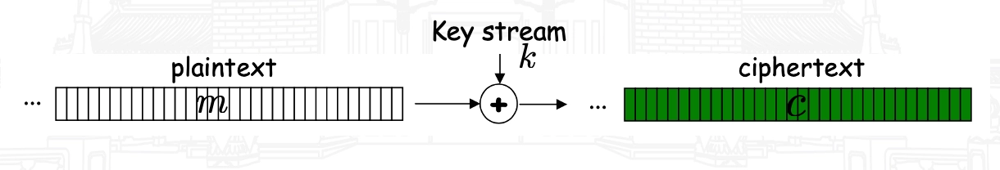

- 结构：
	- 简单结构：
		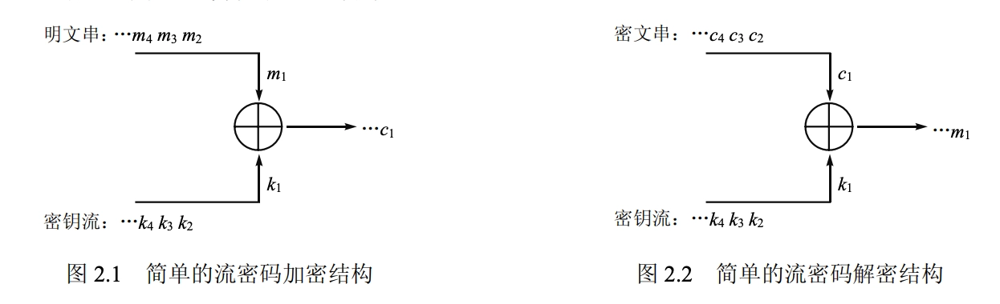

	- 完整结构：
		

	- 如何生成一个可以用作密钥流的“随机”比特序列，要求易于使用，但又不能太短以至于不安全
	- 通常加、解密所需要的这种序列是由一个确定性（deterministic）的密钥流生成器（key generator）产生的，该生成器的输入是一个容易记住的密钥，称之为密钥流生成器的初始密钥或种子（seed）密钥
- 安全性：
	- 流密码的安全性完全取决于密钥的安全等级
	- 实用的流密码以少量的、一定长度的种子密钥经过逻辑运算产生周期较长、可用于加解密运算的伪随机序列。

### 同步流密码 (Synchronous stream ciphers)

- 密钥流的产生与明文消息流相互独立
- 密钥流与明文串无关，所以同步流密码中的每个密文 $c_i$ 不依赖于之前的明文 $m_{i−1},\cdots,m_1$。从而，同步流密码的一个重要优点就是无错误传播：在传输期间一个密文字符被改变只影响该符号的恢复，不会对后继的符号产生影响。

### 自同步流密码 (Self-synchronizing stream ciphers)
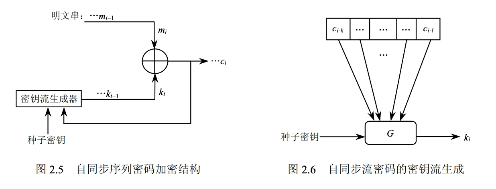

- 密钥流与之前已经产生的若干密文有关

	$$
	\begin{aligned} &\sigma_i=(c_{i-t},c_{i-t+1},\cdots,c_{i-1}) \\ &k_i=G(\sigma_i,K)\\ &c_i=E(k_i,m_i) \end{aligned}
	$$

## 密钥流的生成方式

- 密钥流的生成方法：
	- 有多种产生同步密钥流生成器的方法
	- 最普遍的是使用一种称为线性反馈移位寄存器（Linear Feedback Shift Register，LFSR）
		- LFSR 的结构非常适合硬件实现；
		- LFSR 的结构便于使用代数方法进行理论分析；
		- 产生的序列的周期可以很大；
		- 产生的序列具有良好的统计特性。

### 线性反馈移位寄存器（LFSR）

- 反馈移位寄存器：
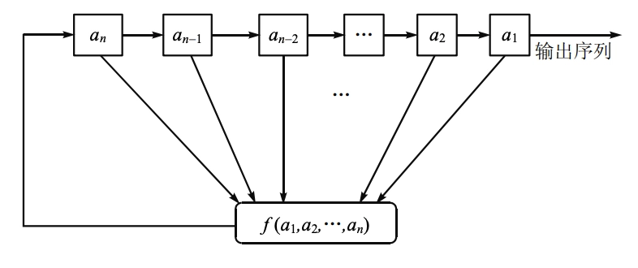

	- 上图为一个反馈移位寄存器的流程图，信号从左到右。
	- $a_i$ 表示存储单元，取值为 0 或 1，$a_i$ 的个数 $n$ 称为反馈移位寄存器的 **级**。
	- 在某一时刻，这些级的内容构成该反馈移位寄存器的一个 **状态**，共有 $2^n$ 个可能的状态，每一个状态对应于与 $\mathbb{F}_2$ 上的一个 $n$ 维向量，用 $(a_1,a_2,\cdots,a_n)$ 表示。
	- 函数 $f$ 是一个 $n$ 元布尔函数，称之为 **反馈函数**。
- 线性反馈移位寄存器（LFSR）
	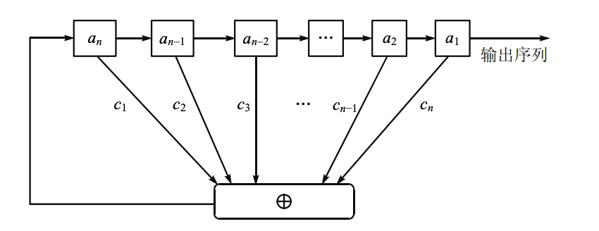

	- 反馈函数 $f$ 是线性的，即

		$$
		f(a_1,a_2,\cdots,a_n)=c_n a_1\oplus c_{n-1} a_2\oplus\cdots\oplus c_1 a_n
		$$

		其中 $c_i \in \mathbb{F}_2$，$\oplus$ 为模二加法，和乘法均在 $\mathbb{F}_2$ 上进行。

	- 令 $a_i(t)$ 为第 $i$ 级在时刻 $t$ 的内容，则 LFSR 的状态转移可表示为：

		$$
		\begin{aligned} &a_i^{(t+1)}=a_{i+1}^{(t)} \\ &a_n^{(t+1)}=c_n a_1^{(t)}\oplus c_{n-1} a_2^{(t)}\oplus \cdots\oplus c_1 a_n^{(t)} \end{aligned}
		$$

	- 则称多项式 $C(x)=1+c_1 x+c_2 x^2+\cdots+c_n x^n$ 为该 LFSR 的 **联接多项式**（connection polynomial）。
	- 线性反馈移位寄存器的状态转移可以用矩阵表示：

		$$
		\begin{bmatrix} a_1^{(t+1)}\\ a_2^{(t+1)}\\ \vdots\\ a_n^{(t+1)} \end{bmatrix}= \begin{bmatrix} 0 & 1 & 0 & \cdots & 0\\ 0 & 0 & 1 & \cdots & 0\\ \vdots & \vdots & \vdots & \ddots & \vdots\\ 0 & 0 & 0 & \cdots & 1\\ c_n & c_{n-1} & c_{n-2} & \cdots & c_1 \end{bmatrix} \begin{bmatrix} a_1^{(t)}\\ a_2^{(t)}\\ \vdots\\ a_n^{(t)} \end{bmatrix}
		$$

#### $m$ 序列与最大周期移位寄存器

- 根据 LFSR 的状态转移图可以看出，一个 $n$ 级 LFSR 序列的周期最大只能为 $2^n−1$
	- 全零状态总是独立循环的且产生的是全零序列
- $\mathbb{F_2}$ 上 $n$ 次多项式为联接多项式的 $n$ 级 LFSR 所产生的非零序列的周期为 $2^n−1$，称这个序列是 $n$ 级最大的线性移位寄存器周期序列，简称 $m$ 序列（Maximal length sequence）。
- 如果一个 $n$ 级 LFSR 产生了 $m$ 序列，则该 LFSR 的状态转移图仅由 $2$ 个圈构成，其中一个是由全零状态构成的长度为 $1$ 的圈，另一个是由全部其余 $2^n−1$ 个状态构成的长度为 $2^n−1$ 的圈。
- **定义**：若 $f(x)$ 是 $GF(q)$ 上的不可约多项式且 $f(x)$ 的根是 $GF(q^n)$ 的本原元，则称 $f(x)$ 为 $GF(q)$ 上的本原多项式。
	- 一个 $n$ 级 LFSR 为最长移位寄存器的充要条件是它的联接多项式为 $\mathbb{F_2}$ 上的 $n$ 次本原多项式 $C(x)$。
	- 当 $2^n−1$ 为素数时， $\mathbb{F_2}$ 上的每一个 $n$ 次不可约多项式均为 $n$ 次本原多项式。

### 伪随机序列

- 伪随机序列：在统计意义上与真正的随机序列没有区别的确定性序列
- **游程**：
	- 在二进制序列中，连续的一串 0 或 1 称为一个游程(run)。
	- 游程的长度是指该串中 0 或 1 的个数。
- **Golomb 随机性假设**：
	- 在每一周期内，0 的个数与 1 的个数近似相等；
	- 在每一周期内，长度为 $i$ 的游程数占游程总数的 $1/2^i$；
	- 定义自相关函数

		$$
		C(\tau) = \sum_{i=1}^{n}(-1)^{(a_i+a_{i+\tau})} =\begin{cases} n,& \tau \equiv 0 \bmod n \\ c,& \tau \neq 0 \end{cases}
		$$

		其值 $c$ 为一个常数。

- $m$ **序列的伪随机性**：
	- 在 $n$ 级 $m$ 序列的一个周期段内，1 出现的次数恰为 $2^{(n−1)}$，0 出现的次数恰为 $2^{(n−1)}−1$ ；
	- 在 $n$ 级 $m$ 序列的一个周期段内，游程总数为 $2^{(n−1)}$；长为 $k(1\leq k\leq n−2)$ 的 0-游程（或 1-游程）数为 $2^{(n−2−k)}$；长为 $n−1$ 的游程只有 1 个，为 0-游程；长为 $n$ 的游程也只有 1 个，为 1-游程；
	- 自相关函数是二值的，且为

		$$
		C(\tau) = \begin{cases} 2^n-1,& \tau \equiv 0 \bmod 2^n−1 \\ -1,& \tau \neq 0 \end{cases}
		$$

		其值 $c$ 为一个常数。

- **线性复杂度**：
	- 二元序列 $a=a_1 a_2 a_3 \cdots$ 的线性复杂度：能够输出该序列的最短线性移位寄存器的级数
		- 例如，给定序列 $0,1,1,0,1,1,\ldots$，联接多项式 $x^2+x+1$ 的 LFSR 可以生成该序列，联接多项式为 $x^3+1$ 的 LFSR 也可以生成该序列。但联接多项式为 $x+1$ 的 LFSR 则无法做到这一点，所以，该序列的线性复杂度为 $2$
	- 如果序列的线性复杂度为 $l(≥1)$，则只要知道序列中任意相继的 $2l$ 位，就可确定整个序列
	- 序列线性复杂度是流密码安全性的重要指标
- **安全的密钥流应该满足这样三个基本条件**：
	- **周期充分长**：一般不少于 $10^{16}$；
	- **随机统计特性好**（即基本满足 Golomb 的随机性公设）；
	- **线性复杂度足够大**：线性复杂度为序列长度的一半是比较合适的。

### 基于 LFSR 的伪随机序列生成器

- 在 LFSR 的基础上加入非线性化的手段，产生适合于流密码应用的密钥序列。这也是目前实现密钥流生成器的主流方法，可进一步将这种方法分为三类：
	- 滤波生成器
	- 组合生成器
	- 钟控生成器

#### 滤波生成器

- 由一个 $n$ 级线性移位寄存器和一个 $m$ ($<n$) 元非线性滤波函数 $g$ 组成
- $g$ 为一个 $m$ 元布尔函数，滤波函数的输出为密钥流序列，工作模式如下图：

#### 组合生成器

- 若干个线性移位寄存器 $LFSR_i (i=1,\cdots,n)$ 和一个非线性组合函数 $f$ 组成，组合函数的输出构成密钥流序列。组合生成器工作模式如下：

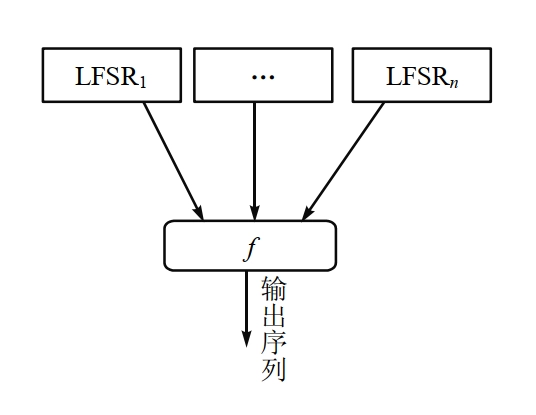

- 其中 $LFSR_i (i=1,\cdots,n)$ 为 $n$ 个级数分别为 $r_1,r_2,\cdots,r_n$ 的线性移位寄存器，相应的移位寄存器序列为 $\{a_{i_{j}}\} \left(i=1,\cdots,n \right)$，函数 $f \left(x_{1},x_{2},\cdots,x_{n} \right)$ 是 $n$ 元布尔函数。
- 使用组合生成器可以极大地提高序列的周期。事实上，如果 $r_1,r_2,\cdots,r_n$ 两两互质，函数 $f(x_1,x_2,\cdots,x_n)$ 与各变元均有关，则 $\{k_j\}$ 的周期为 $\prod_{i=1}^{n}(2^{r_i}-1)$

#### 钟控生成器

- 基本思想：用一个或多个移位寄存器来控制另一个或多个移位寄存器的时钟，这样的序列生成器叫做钟控生成器（clock-controlled generator），也叫停走生成器（stop and go generator），最终的输出被称为钟控序列，基本模型如图所示。

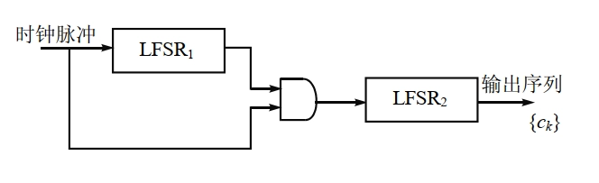

- 基本假设：$LFSR_1$ 和 $LFSR_2$ 分别输出序列 $\{a_k\}$ 和 $\{b_k\}$。当 $LFSR_1$ 输出 1 时，移位时钟脉冲通过与门使 $LFSR_2$ 进行一次移位，从而生成下一位。当 $LFSR_1$ 输出 0 时，移位时钟脉冲无法通过与门影响 $LFSR_2$，因此 $LFSR_2$ 重复输出前一位。
	- 例如:
		- $LFSR_1$ 输出周期序列 $1,0,1,0,1,1,0,1,0,1,\cdots$
		- $LFSR_2$ 输出周期为 3 的序列 $a_0,a_1,a_2,a_0,a_1,a_2,\cdots$
		- 则上述钟控生成器输出的钟控序列为 $a_0,a_0,a_1,a_1,a_2,a_0,a_0,a_1,a_1,a_2,\cdots$，周期为 5。
- 交错停走式生成器（一种钟控序列）
	- 交错停走式生成器(interleaved stop-and-go generator)是钟控生成器的一种特殊形式，由三个移位寄存器 $LFSR_1,LFSR_2$ 和 $LFSR_3$ 组成，其中 $LFSR_1$ 控制 $LFSR_2$ 和 $LFSR_3$ 的时钟，$LFSR_2$ 和 $LFSR_3$ 的输出通过异或门得到最终的输出序列，如下图所示。
	- 
	- $LFSR_1$ 的输出是 1 时，$LFSR_2$ 被时钟驱动；当 $LFSR_1$ 的输出是 0 时，$LFSR_3$ 被时钟驱动。最后，$LFSR_1$ 的输出与 $LFSR_2$ 的输出做异或运算即为这个交错式停走生成器的输出，输出的序列具有长周期和大的线性复杂度。

## 实用流密码

- 实用流密码：RC4、A5/1、A5/2、E0 等

### A5

- A5 是 GSM 中执行加密运算的流密码算法，它用于从用户手机到基站的连接加密。
- A5 中的钟控机制是：如果在某一时刻钟控单元中三个值的某两个或三个相同，则对应的移位寄存器在下一时刻被驱动，而剩下的一个（或 0 个）值对应的移位寄存器则停走。

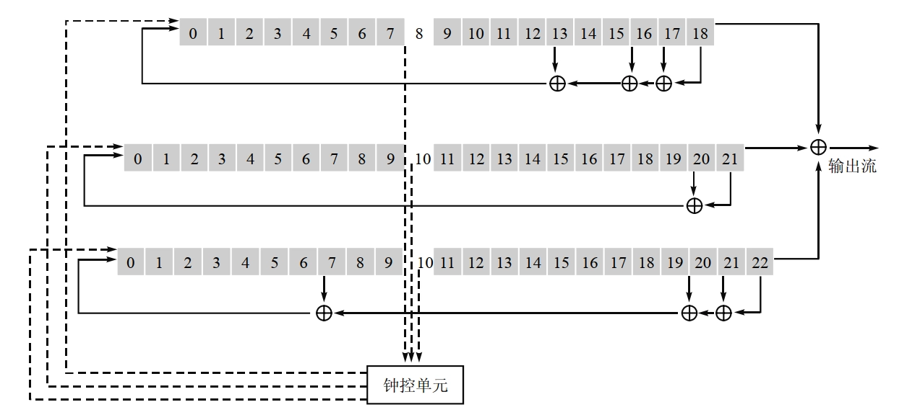

- A5 算法的效率很高，输出的序列统计性好，能够通过所有的已知测试。但使用的移位寄存器太短，极易受穷尽攻击。若 A5 采用级数较长的移位寄存器则会更安全。

### RC4

- RC4 是由 Ron Rivest 在 1987 年设计的一种流密码算法，是目前应用最广泛的流密码算法之一。RC4 的核心是一个伪随机字节生成器，RC4 的加密和解密过程相同，都是将明文或密文与伪随机字节流进行逐字节异或运算
- 相关参数：
	- 参数 $n$，长为 $n$ 的秘密内部状态($2^n$ 数组)，通常取 $n=8$
	- 对应的内部状态由 $256=2^8$ 个元素 $S[0], \cdots, S[255]$ 构成，每个元素都是 $0\sim 255$ 间的一个数字
	- 输入是一个可变长度的密钥，该密钥用于初始化内部状态。
	- 输出是状态中按照一定方式选出的某一个元素 $K$，该输出构成密钥流的一个字节，加解密时这个字节 $K$ 与一个明文/密文字节执行 $XOR$ 运算。
	- 每生成一个 $K$ 值，内部状态中的元素会被重新置换一次，以便下次生成 $K$ 值
- RC4 算法：
	

- 密钥调度算法：
	- 用来设置内部状态 $S[0], \cdots, S[255]$ 的随机排列
	- 开始时，内部状态被初始化为 $0\sim 255$，即 $S[i]=i(i=0,\cdots,255)$
	- 密钥长度可变，假设为 $L$ 个字节，$(K[0], \cdots, K[L−1])$，一般 $L$ 在 5～32 之间
	- 用这 $L$ 个字节不断重复填充，直至得到 $(K[0], \cdots, K[255])$。数组 $K$ 将被用于对内部状态 $S$ 进行随机化
	- 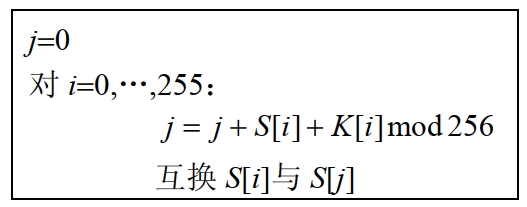
- 伪随机生成算法：
	- 它从内部状态中选取一个随机元素作为密钥流中的一个字节，并修改内部状态以便下一次选取。选取过程取决于两个索引值 $i$ 和 $j$，它们的初始值均为 0。具体选取过程如下：
	- 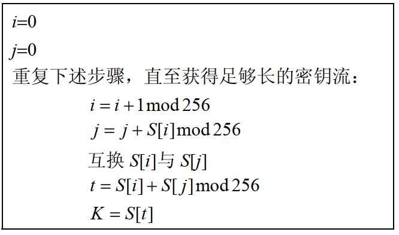
- 示例：
	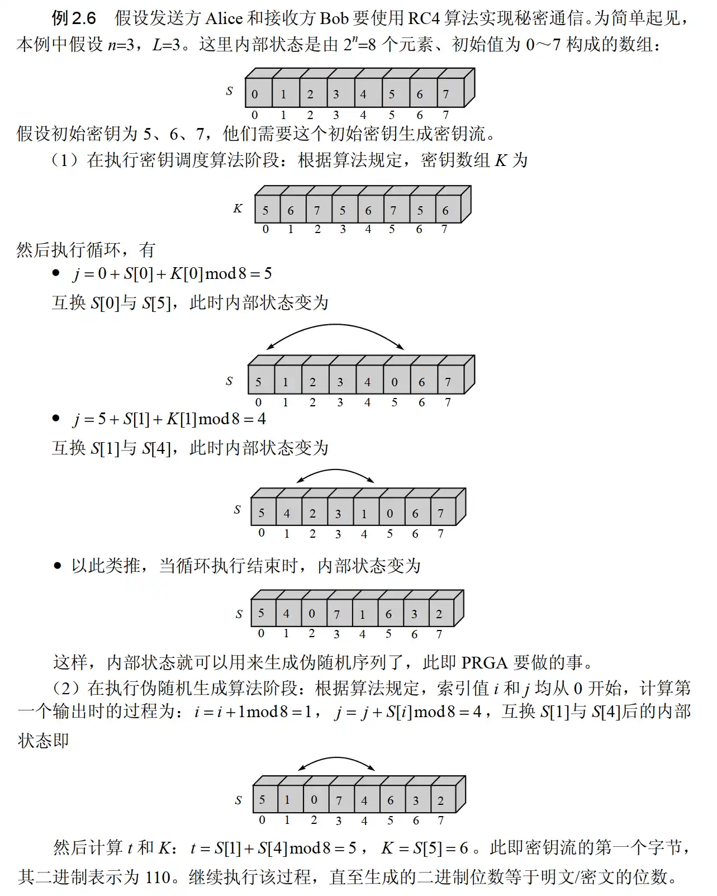

## 轻量级密码算法

- 轻量级密码算法（lightweight cryptography）是指在资源受限的环境下使用的密码算法，通常用于物联网设备、嵌入式系统和智能卡等场景。
- 资源受限环境终端设备的特点
	- 数量巨大（电卡、汽车 ETC 等）
	- 内存资源较少
	- 处理（计算）能力有限
	- 功耗要求严格