# 分组密码

- [Back to Course Home](index.md)

## 常见的分组密码算法

| 算法 | 分组长度（bit） | 密钥长度（bit） | 轮数  |
|-----|------|-------|-------|
| DES  | 64  | 56（实际有效长度，存储为 64bit 含 8bit 校验） | 16	|
| 3DES（Triple DES） | 64  | 112（2 个 56bit 密钥）或 168（3 个 56bit 密钥） | 48	|
| IDEA | 64  | 128   | 8	 |
| AES  | 128 | 128、192、256	| 10、12、14 |
| Blowfish   | 64  | 32-448（以 8bit 为步长递增）   | 16	|
| Twofish	| 128 | 128、192、256	| 16	|
| Camellia   | 128 | 128、192、256	| 18、20、22 |
| SM4 | 128 | 128   | 32	|

- 在分组密码中，消息被分成许多块，每块都要被加密，类似于许多字符被替换
	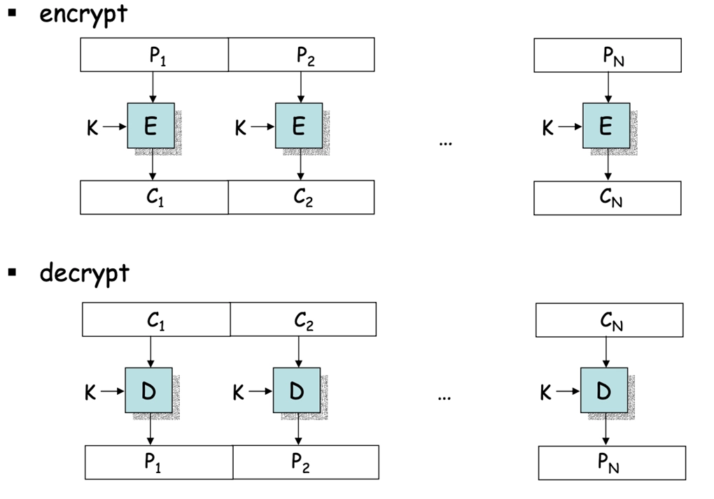

- 理想的方法是使用尽可能大的替换模块，但不实际，因为对每个 64-bit 的模块，将需要 $2^{64}$ 个实体的替换表，因此使用一些小的模块代替

## 分组密码的基本结构
### SPN 结构

- **SPN**（Substitution-Permutation Network，替换-置换网络）结构

	- 由多轮替换和置换组成

	- 每轮包括两个主要操作：替换（Substitution）和置换（Permutation）

	- 替换使用 S 盒（Substitution box）实现，将输入的位模式映射到输出的位模式，提供 **混淆** 效果

	- 置换使用 P 盒（Permutation box）实现，重新排列输入的位，提供 **扩散** 效果

	- 通过多轮的替换和置换，增加了密码的复杂性和安全性

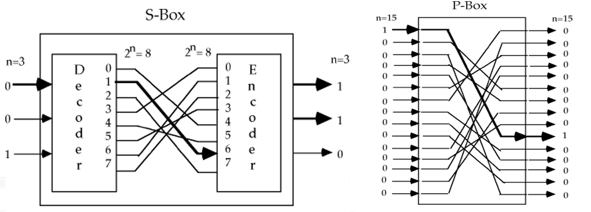

### Feistel 结构
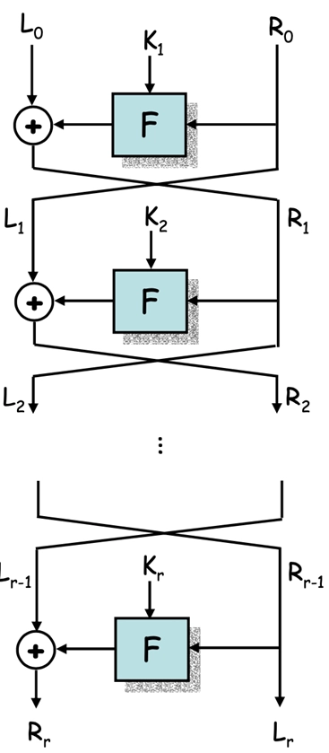

- **Feistel 网络** 结构

	- 将输入数据分成两个相等的部分，通常称为左半部（$L$）和右半部（$R$）

		- 每轮操作包括一个函数 $F$，该函数接受右半部（$R_{i-1}$）和一个子密钥（$K_i$）作为输入，输出一个与左半部大小相同的值

		- 然后将左半部（$L_{i-1}$）与函数 $F$ 的输出进行异或运算，结果成为新的右半部（$R_i$）

		- 右半部保持不变，成为新的左半部（$L_i$）

	- 这种结构的优点是加密和解密过程非常相似，只需使用相同的函数 $F$ 和子密钥，但顺序相反

	- 加密过程：第 $i$ 轮将 $(L_{i-1}, R_{i-1})$ 映射到 $(L_i, R_i)$ 如下：

		$$
		\begin{aligned} &L_i=R_{i-1} \\ &R_i=L_{i-1} \oplus F(R_{i-1}, K_i) \end{aligned}
		$$

	- 解密过程与加密过程类似，只需将子密钥的顺序反转：

		$$
		\begin{aligned} &R_{i-1}=L_i \\ &L_{i-1}=R_i \oplus F(R_{i-1}, K_i)=R_i \oplus F(L_i, K_i) \end{aligned}
		$$

## 分组密码的设计原则

- **雪崩效应**（Avalanche Effect）

	- 输入改变 1 bit, 导致近一半的输出比特发生变化

	- 一个函数 $F$ 具有好的雪崩特性是指：对 $2^m$ 个明文向量, 分为 $2^{(m−1)}$ 个向量对 $(x_i, x_i')$，每对向量只有一个比特不同，定义 $V_i=f(x_i) \oplus f(x_i')$，则近一半的 $V_i$ 为 1

- **完备性效应**（Completeness Effect）

	- 每个输出比特是所有输入比特的复杂函数的输出

	- 一个函数 $F$ 具有好的完备性是指：对密文输出向量的每一比特 $j$，$0<j<m$，至少存在一个明文对 $(x_i,  x_i')$，此明文对只在第 $i$ 比特不同，且 $F(x_i)$ 与 $F(x_i')$ 的第 $j$ 比特不同

- **不可预测性**（Unpredictability）

	- 给定部分输入或输出，无法有效地预测剩余的输入或输出

- 设计密码时, 下列参数需要考虑：

	- 分组大小（block size）：增加分组长度会提高安全性，但降低了密码运算速度

	- 密钥大小（key size）：增加密钥长度，可以提高安全性（使得穷搜索困难），但降低了密码速度

	- 轮数：增加轮数可以提高安全性，但降低速度

	- 子密钥生成：子密钥生成越复杂，就越安全，但降低速度

	- 轮函数：复杂的轮函数能够使的密码分析困难，但降低速度

## 分组密码理论
### Lucifer 密码
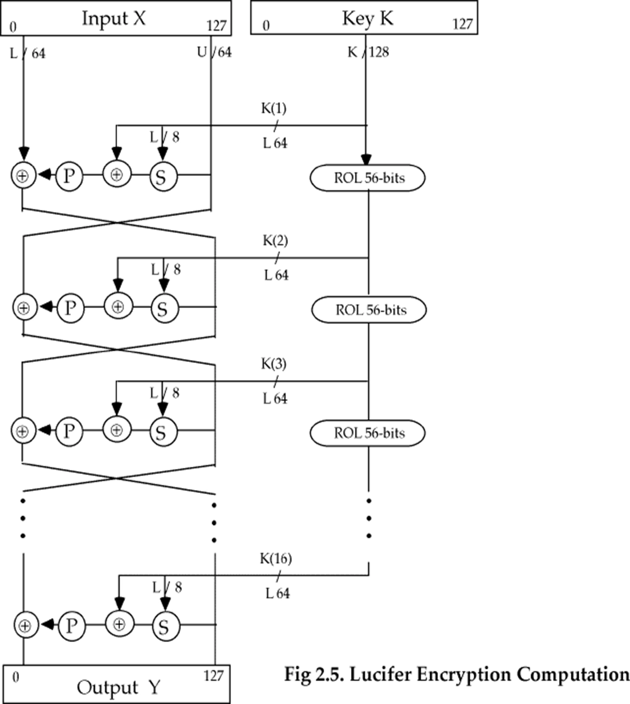

- 第一个可用的代换（S）-置换（P）密码

- 密钥编排：

	- Lucifer 密码是 Feistel 网络，分组长度是 128-bit, 密钥长度是 128-bit

	- 每轮使用的子密钥是密钥的左半部分

	- 密钥每次要循环左移 56-bit, 所以密钥的每部分都参加运算

- 加密过程：

	- 左半部分 $L_i$ 和右半部分 $R_i$ 的计算如下：

		$$
		\begin{aligned} &L_i=R_{i−1} \\ &R_i=L_{i−1} \oplus F(R_{i−1}, K_i) \end{aligned}
		$$

	- 其中 $F$ 函数的结构如下：

		- 输入 $R_{i−1}$ (64-bit) 被分为 8 个字节经过 S-盒替换，每个字节根据密钥 $K_i$ 的左 8-bit 中的一位选择 S0 或 S1

		- 然后与密钥 $K_i$ 的全部 64-bit 进行异或运算

		- 然后经过 P-盒置换，得到 64-bit 的输出

	- 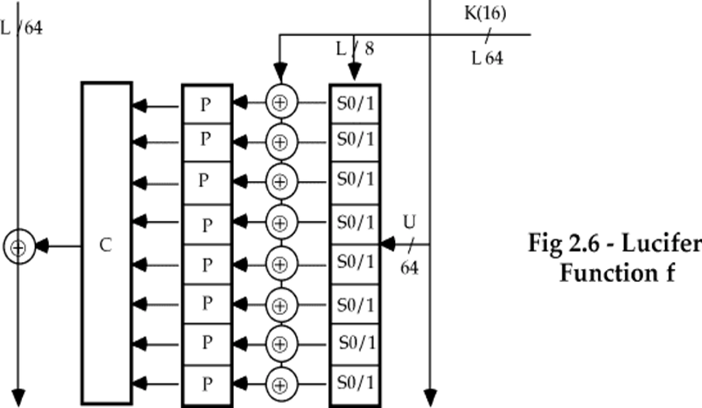

- 安全性

	- Lucifer 没有经过很强的分析

	- 现在认为是理论可破的 (通过差分分析)

	- 现在不被使用

	- 是 DES 的前身

### S-DES (Simplified DES)
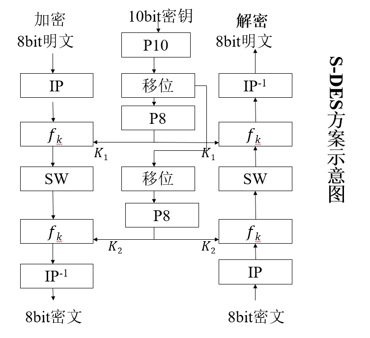

- 供教学而非安全的加密算法，与 DES 的特性和结构类似，但参数较小。

- 加密算法涉及五个函数：

	- 初始置换 $IP$ (initial permutation)

	- 复合函数 $f_{K1}$，它是由密钥 $K$ 确定的，具有代换和置换功能

	- 转换函数 $SW$

	- 复合函数 $f_{K2}$

	- 初始置换 $IP$ 的逆置换 $IP^{-1}$

- 数学表示

	- 设明文为 $M$，密钥为 $K$，则密文 $C$ 可表示为：

		$$
		C = IP^{-1}(f_{K2}(SW(f_{K1}(IP(M)))))
		$$

	- 解密过程与加密过程类似，只需将子密钥的顺序反转：

		$$
		M = IP^{-1}(f_{K1}(SW(f_{K2}(IP(C)))))
		$$

	- 其中:

		- $K_1 = P_8(LS_{1}(P_{10}(K)))$

		- $K_2 = P_8(LS_{2}(LS_{1}(P_{10}(K))))$

- S-DES 的密钥生成：

	- 

	- 设 10bit 的密钥为 $K = (k_1,k_2,\cdots,k_{10})$

		- $P_{10}(k_1,k_2,\cdots,k_{10})=(k_3,k_5,k_2,k_7,k_4,k_{10},k_1,k_9,k_8,k_6)$

		- $P_8(k_1,k_2,\cdots,k_{10})=(k_6,k_3,k_7,k_4,k_8,k_5,k_{10},k_9)$

	- $LS_{1}$ 为循环左移 1 位， $LS_{2}$ 为循环左移 2 位

	- 示例：

		- 若 $K=(1010000010)$

		- $P_{10}(K)=(1000001100)$

		- $LS_{1}(10000)\parallel LS_{1}(01100)=(00001\parallel 11000)$

		- $K_1=P_8(0000111000)=(10100100)$

		- $LS_{2}(00001)\parallel LS_{2}(11000)=(00100\parallel 00011)$

		- $K_2=P_8(0010000011)=(01000011)$

- S-DES 的加密运算:

	- 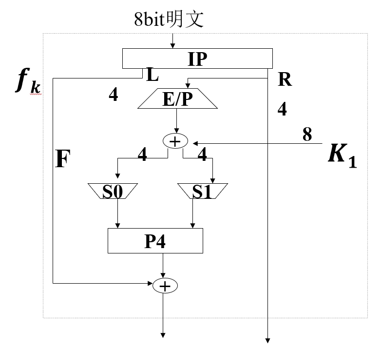

	1. $IP$ 置换

		- 初始置换用 $IP$ 函数：

			$$
			IP = \begin{bmatrix} 1 & 2 & 3 & 4 & 5 & 6 & 7 & 8 \\ 2 & 6 & 3 & 1 & 4 & 8 & 5 & 7 \end{bmatrix}
			$$

		- 末端算法的置换为 $IP$ 的逆置换：

			$$
			IP^{-1} = \begin{bmatrix} 1 & 2 & 3 & 4 & 5 & 6 & 7 & 8 \\ 4 & 1 & 3 & 5 & 7 & 2 & 8 & 6 \end{bmatrix}
			$$

		- $IP^{-1} (IP(X))=X$

	2. 函数 $f_k$:

		$$
		f_k (L,R)=(L⊕F(R,SK),R)
		$$

		- 其中 $L\parallel R$ 为 8 位输入, 左右各为 4 位, $F$ 为从 4 位集到 4 位集的一个映射, 并不要求是 1-1 的。$SK$ 为子密钥。

	3. 对映射 $F$ 来说：

		- 首先输入是一个 4 位数 $(n_1,n_2,n_3,n_4)$，第一步运算是扩张/置换(E/P)运算：

			$$
			E/P = \begin{bmatrix} 4 & 1 & 2 & 3 & 2 & 3 & 4 & 1 \end{bmatrix}
			$$

		- 然后分左右 4 位进入两个 S 盒运算

	4. 对两个 S 盒：$S_0$ 和 $S_1$

		- $S_0$ 和 $S_1$ 的定义如下：

			$$
			S_0 = \begin{bmatrix} 1 & 0 & 3 & 2 \\ 3 & 2 & 1 & 0 \\ 0 & 2 & 1 & 3 \\ 2 & 1 & 0 & 3 \end{bmatrix},\quad S_1 = \begin{bmatrix} 0 & 1 & 2 & 3 \\ 2 & 0 & 1 & 3 \\ 3 & 0 & 1 & 0 \\ 2 & 1 & 0 & 3 \end{bmatrix}
			$$

		- 按下述规则运算：

			- 将第 $1$ 和第 $4$ 的输入比特做为 $2bit$ 数，指示为 S 盒的一个行；将第 $2$ 和第 $3$ 的输入比特做为 S 盒的一个列。如此确定为 S 盒矩阵的 $(i,j)$ 数。

			- 例如：$(P_{0,0} P_{0,3})=(00),  并且(P_{0,1} P_{0,2})=(1 0)$，确定了 $S_0$ 中的第 $0$ 行 $2$ 列 $(0,2)$ 的系数为 $3$，记为 $(11)$ 输出。

	5. $P_4$ 置换

		- 由 $S_0, S_1$ 输出的 4-bit 经置换

			$$
			P_4 = \begin{bmatrix} 2 & 4 & 3 & 1 \end{bmatrix}
			$$

		- 它的输出就是 $F$  函数的输出

	6. 将 $F$ 的输出与左半部分 $L$ 进行异或运算，得到新的左半部分，再与原本的右半部分 $R$ 组合，得到 $f_k$ 的输出

	7. 交换函数 $SW$

		- 交换函数 $SW$ 将 8-bit 输入的左右两半交换位置

		- 即 $SW(L\parallel R)=R\parallel L$

	8. 再进行一次 $f_k$ 运算，使用第二个子密钥 $K_2$

	9. 最后进行 $IP^{-1}$ 置换，得到密文

### DES
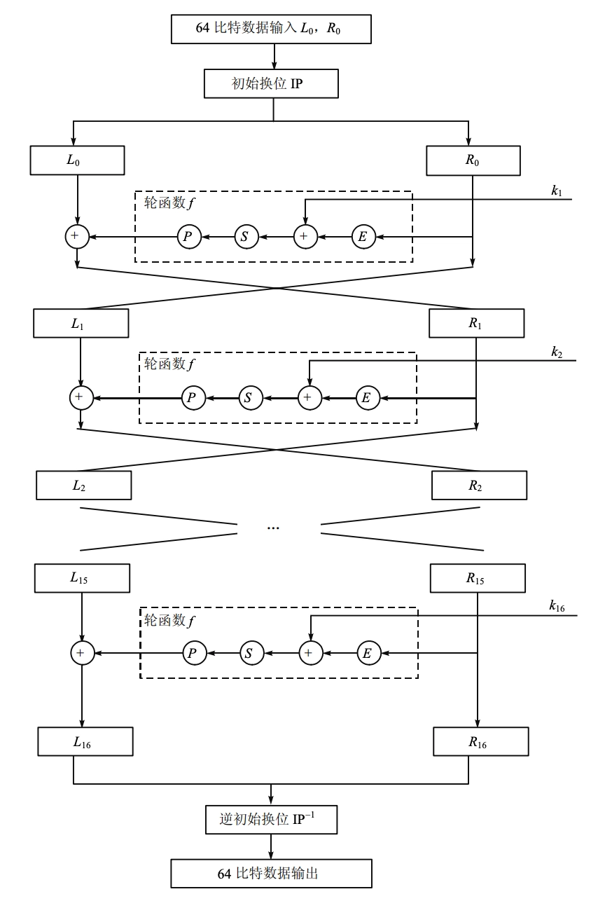

- Feistel 结构

	- 密钥 $K$ 长度：56-bit

	- 分组（输入）长度：64-bit

	- 密文（输出）长度：64-bit

	- 轮数：16 轮

- 算法分三个阶段实现：

	1. 对明文 $X$，通过一个固定的初始置换 $IP$ 得到 $X_0$，分为左右两部分

		$$
		X_0=IP(X)=L_0\parallel R_0
		$$

	2. 函数 $F$ 的 $16$ 次迭代：$L_i\parallel R_i (1 \leq i \leq 16)$

		$$
		\begin{aligned} &L_i=R_{i−1} \\ &R_i=L_{i−1} \oplus F(R_{i−1}, K_i) \end{aligned}
		$$

		- 其中 $K_i$ 是长为 48 位的子密钥。子密钥 $K_1,K_2,\cdots,K_{16}$ 是作为密钥 $K$（56 位）的函数而计算出的。

	3. 对比特串 $R_{16}\parallel L_{16}$ 使用逆置换 $IP^{-1}$ 得到密文 $Y$。

		$$
		Y=IP^{-1}(R_{16}\parallel L_{16})
		$$

- 初始置换 $IP$ 和 $IP^{-1}$ 的定义：表中的数字表示这个比特在置换前的位置

	$$
	IP = \begin{bmatrix} 58 & 50 & 42 & 34 & 26 & 18 & 10 & 2 \\ 60 & 52 & 44 & 36 & 28 & 20 & 12 & 4 \\ 62 & 54 & 46 & 38 & 30 & 22 & 14 & 6 \\ 64 & 56 & 48 & 40 & 32 & 24 & 16 & 8 \\ 57 & 49 & 41 & 33 & 25 & 17 & 9 & 1 \\ 59 & 51 & 43 & 35 & 27 & 19 & 11 & 3 \\ 61 & 53 & 45 & 37 & 29 & 21 & 13 & 5 \\ 63 & 55 & 47 & 39 & 31 & 23 & 15 & 7 \end{bmatrix}
	$$

	$$
	IP^{-1} = \begin{bmatrix} 40 & 8 & 48 & 16 & 56 & 24 & 64 & 32 \\ 39 & 7 & 47 & 15 & 55 & 23 & 63 & 31 \\ 38 & 6 & 46 & 14 & 54 & 22 & 62 & 30 \\ 37 & 5 & 45 & 13 & 53 & 21 & 61 & 29 \\ 36 & 4 & 44 & 12 & 52 & 20 & 60 & 28 \\ 35 & 3 & 43 & 11 & 51 & 19 & 59 & 27 \\ 34 & 2 & 42 & 10 & 50 & 18 & 58 & 26 \\ 33 & 1 & 41 & 9 & 49 & 17 & 57 & 25 \end{bmatrix}
	$$

- 扩展置换 $E$：用于将 32 位的输入扩展为 48 位，表中第 $i$ 个数据 $j$ 表示输出的第 $i$ 位为输入的第 $j$ 位。

	$$
	E = \begin{bmatrix} 32 & 1 & 2 & 3 & 4 & 5 \\ 4 & 5 & 6 & 7 & 8 & 9 \\ 8 & 9 & 10 & 11 & 12 & 13 \\ 12 & 13 & 14 & 15 & 16 & 17 \\ 16 & 17 & 18 & 19 & 20 & 21 \\ 20 & 21 & 22 & 23 & 24 & 25 \\ 24 & 25 & 26 & 27 & 28 & 29 \\ 28 & 29 & 30 & 31 & 32 & 1 \end{bmatrix}
	$$

- 置换 $P$：表中第 $i$ 个数据 $j$ 表示输出的第 $i$ 位为输入的第 $j$ 位

	$$
	P = \begin{bmatrix} 16 & 7 & 20 & 21 & 29 & 12 & 28 & 17 \\ 1 & 15 & 23 & 26 & 5 & 18 & 31 & 10 \\ 2 & 8 & 24 & 14 & 32 & 27 & 3 & 9 \\ 19 & 13 & 30 & 6 & 22 & 11 & 4 & 25 \end{bmatrix}
	$$

- S-box-1

	$$
	S_1 = \begin{bmatrix} 14 & 4 & 13 & 1 & 2 & 15 & 11 & 8 & 3 & 10 & 6 & 12 & 5 & 9 & 0 & 7 \\ 0 & 15 & 7 & 4 & 14 & 2 & 13 & 1 & 10 & 6 & 12 & 11 & 9 & 5 & 3 & 8 \\ 4 & 1 & 14 & 8 & 13 & 6 & 2 & 11 & 15 & 12 & 9 & 7 & 3 & 10 & 5 & 0 \\ 15 & 2 & 8 & 14 & 6 & 11 & 1 & 3 & 4 & 9 & 7 & 5 & 13 & 10 & 0 & 12 \end{bmatrix}
	$$

- $F$ 函数的说明

	- $F(R_{i−1}, K_i)$ 的非线性表示如下：函数 $F$ 有两个输入：一半消息 $R_{i−1}$（32-bit）作第一个输入，$48$ 比特的子密钥 $K_i$ (48-bit) 作为第二个输入。产生的输出为长度为 $32$ 位串。
		

	1. 对 $R_{i−1}$ ，先利用扩展函数 $E$，扩展成 $48$ 位 $E(R_{i−1})$

	2. 计算 $A = E(R_{i−1})\oplus K_i$，结果写成 $8$ 个 $6$ 位串

		$$
		\begin{aligned} &A=A_1\parallel A_2\parallel A_3\parallel A_4\parallel A_5\parallel A_6\parallel A_7\parallel A_8 \\ &A_j=a_1 a_2 a_3 a_4 a_5 a_6 \end{aligned}
		$$

	3. 使用 $8$ 个 S 盒，每个 $S_j$ 是一个固定的 $4 \times 16$ 矩阵，它的元素取 $0 \sim 15$ 的整数。给定 $A_j$，计算 $B_j=S_j (A_j)$，其中 $B_j$ 是一个 $4$ 位串，$B_j=b_1 b_2 b_3 b_4$。

		- 计算 $S_j (A_j)$ 如下：$a_1 a_6$ 两个比特确定了 $S_j$ 的行数, $r (0\leq r \leq 3)$；而 $a_2 a_3 a_4 a_5$ 四个比特确定了 $S_j$ 的列数 $c (0\leq c \leq 15)$。最后 $S_j (A_j)$ 的值为 S-盒矩阵 $S_j$ 中 $r$ 行 $c$ 列的元素 $(r,c)$，得 $B_j=S_j (A_j)$。

	4. 最后，$P$ 为固定置换。

- DES 使用的特定轮函数

	- 初始置换 $IP$：对明文输入进行次序的打乱。

	- 逆置换 $IP^{-1}$

	- 扩展函数 $E$（32 到 48）

	- 置换函数 $P$（32 到 32）

	- 8 个 S 盒 $S_1, S_2, \ldots, S_8$（6 到 4）

- 密钥编排：由密钥 $K$ 计算子密钥 $K(i)$

	- 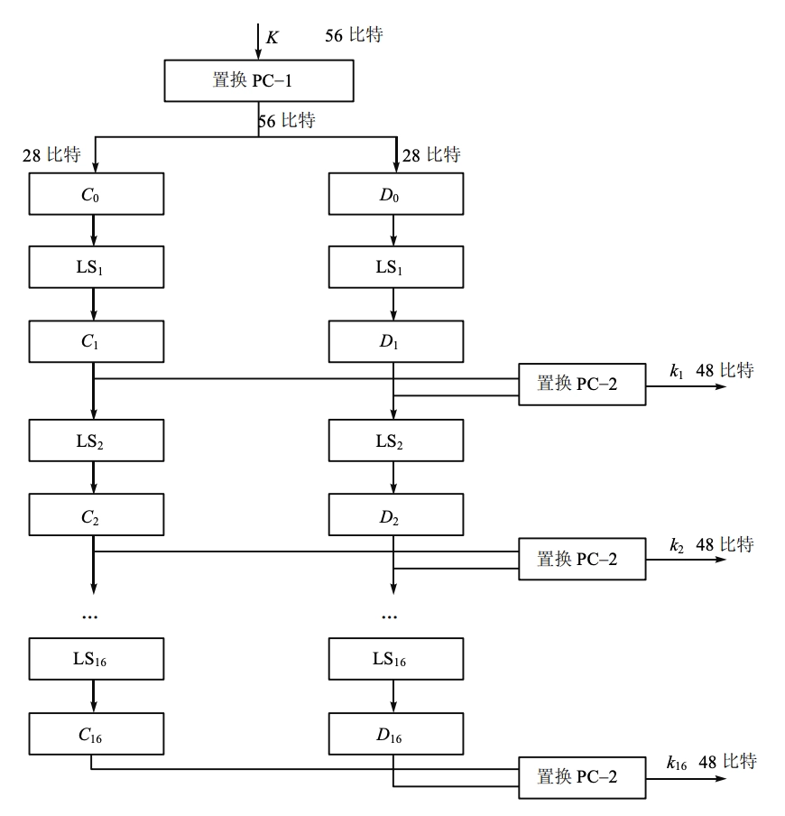

	- 密钥 $K$ 是长度为 64 的位串，56 位参加子密钥编排。8 位是奇偶校验位（为了检错），在密钥编排的计算中，不参加运算。

		1. 给定 64 位的密钥 $K$，放弃奇偶校验位 $(8, 16, \ldots, 64)$ 并根据固定置换 $PC1$ 来排列 $K$ 中剩下的位。我们写

		    $$
		    PC1(K)=C_0\parallel D_0
		    $$

		    其中 $C_0$ 由 $PC1(K)$ 的前 28 位组成；$D_0$ 由后 28 位组成。

		2. 对 $1 \leq i \leq 16$，计算

		    $$
		    C_i=LS_i (C_{i−1}) \quad D_i=LS_i (D_{i−1})
		    $$

		    其中 $LS_i$ 表示循环左移 2 或 1 个位置，取决于 $i$ 的值。

			- $i=1,2,9,16$ 时移 1 个位置，否则移 2 位置

			- $K_i=PC2(C_i\parallel D_i)$，$PC2$ 为固定置换，将前 28 位中的 24 位置换，并去掉 9、18、22、25，将后 28 位中的 24 位置换，并去掉 35、38、43、54 位

	- 一共 16 轮迭代，总共生成 16 个 48 比特的子密钥 $K_1, K_2, \ldots, K_{16}$。

### 3DES (Triple DES)

- 由于 DES 的密钥长度较短，容易受到穷举攻击，因此提出了 Triple DES（3DES）来增强安全性。

- 3DES 的工作原理是对数据进行三次 DES 加密和解密操作，通常使用两种或三种不同的密钥。

- Two-Key 3DES:

	- 使用两个密钥 $K_1$ 和 $K_2$，加密过程为：

	    $$
	    C = E_{K_2}(D_{K_2}(E_{K_1}(M)))
	    $$

	- 解密过程为：

	    $$
	    M = D_{K_1}(E_{K_2}(D_{K_2}(C)))
	    $$

- Three-Key 3DES:

	- 使用三个密钥 $K_1$、$K_2$ 和 $K_3$，加密过程为：

	    $$
	    C = E_{K_3}(D_{K_2}(E_{K_1}(M)))
	    $$

	- 解密过程为：

	    $$
	    M = D_{K_1}(E_{K_2}(D_{K_3}(C)))
	    $$

- 密钥长度：

	- 标准 DES：56 bit

	- Two-Key 3DES：112 bit

	- Three-Key 3DES：168 bit

### IDEA
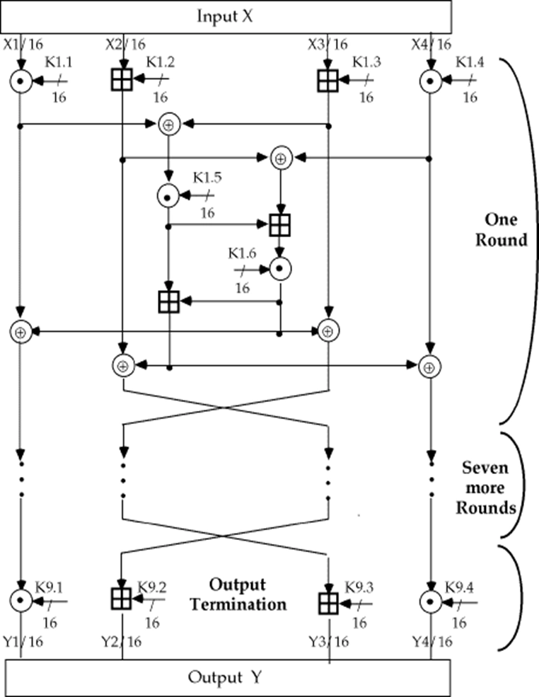

- Feistel 结构

	- 密钥长度：128 位（抗强力攻击能力比 DES 强）

	- 分组长度：64 位

		- 子分组长度：16 位

	- 密文长度：64 位

	- 轮数：8 轮 + 1 次输出变换

- IDEA 的“混淆”和“扩散”设计原则来自三种运算，它们易于软、硬件实现（加密速度快）：

	1. 异或运算：$\oplus$

	2. 整数模 $2^{16}$ 加：$\boxplus$

	3. 整数模 $2^{16}+1$ 乘：$\odot$  (IDEA 的 S 盒)

	4. MA 单元
		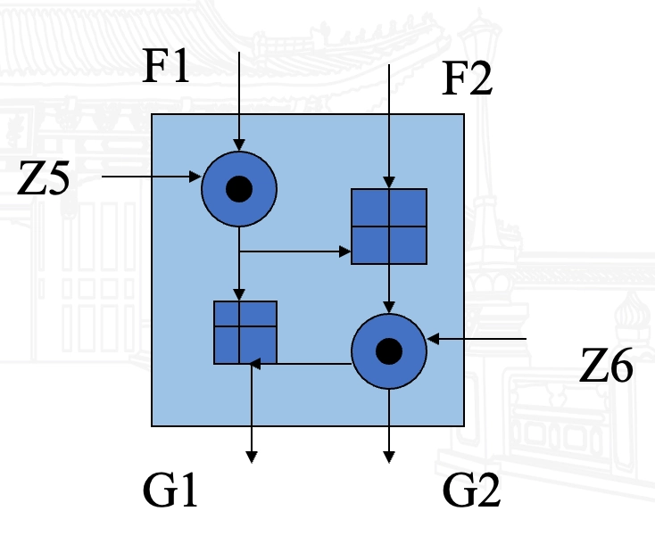

- IDEA 的加密

	- 

	- IDEA 加密一轮迭代过程框图
		

		- 每一轮输入为 64-bit 的数据块，分为 4 个 16-bit 的子块 $X_1, X_2, X_3, X_4$

		- 使用 6 个 16-bit 的子密钥 $Z_{6i+1}, Z_{6i+2}, \ldots, Z_{6i+6}$ 对数据进行处理，产生 4 个 16-bit 的输出子块 $Y_1, Y_2, Y_3, Y_4$，作为下一轮的输入

	- 最后一轮后进行输出变换，使用 4 个子密钥 $Z_{49}, Z_{50}, Z_{51}, Z_{52}$ 对数据进行处理，产生最终的密文输出
		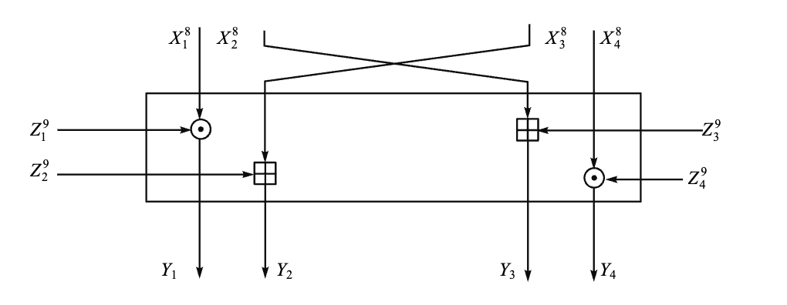

- 密钥生成

	- 52 个 16-bit 的子密钥从 128-bit 的密钥中生成

		- 前 8 个子密钥 $Z_1, Z_2, \ldots, Z_8$ 直接从密钥中取出；

		- 对密钥进行 25-bit 的循环左移，得到接下来 8 个子密钥 $Z_9, Z_{10}, \ldots, Z_{16}$；

		- 再进行 25-bit 的循环左移，得到接下来的 8 个子密钥 $Z_{17}, Z_{18}, \ldots, Z_{24}$；

		- 依此类推，重复进行直到 52 个子密钥都产生出来。

- IDEA 的解密

	- 加密解密实质相同，但使用不同的密钥；

	- 解密密钥以如下方法从加密子密钥中导出：

		- 解密循环第 $r$ 轮的头 4 个子密钥从加密循环第 $10-r$ 轮的头 4 个子密钥中导出；

		- 每一轮的解密密钥与加密密钥有以下关系：

			- 第 1 和第 4 个子密钥取乘法逆元；

			- 第 2 和第 3 个子密钥取加法逆元；

			- 第 5 和第 6 个子密钥直接对应；

- IDEA 的安全性

	- IDEA 是 PGP 的一部分；

	- IDEA 能抗差分分析和相关分析；

	- IDEA 似乎没有 DES 意义下的弱密钥；

	- Bruce Schneier 认为 IDEA 是 DES 的最好替代。

- 先进分组密码的特点

	- IDEA 是 PGP 的一部分；

	- 可变密钥长度

	- 混合操作

	- 依赖数据的循环移位

	- 依赖于密钥的循环移位

	- 依赖 S 盒

	- 冗长的密钥调度算法

	- 可变的 F 函数和可变的明文/密文长度

	- 可变的循环次数

	- 在每次循环中都对两半数据进行操作

### AES

-  AES (Rijndael) 算法结构

	- Rijndael：可变块长、可变密钥长度

	- 参数：

		1. **分组长度**：AES 的分组长度为 128 位。

		2. **密钥长度**：AES 支持多种密钥长度，包括 128 位、192 位和 256 位。

		3. **轮数**：根据密钥长度的不同，AES 的轮数也不同：

			- 128 位密钥：10 轮

			- 192 位密钥：12 轮

			- 256 位密钥：14 轮

	- 不是 Feistel 结构，而是 SPN 结构

	- 单个 8 位到 8 位的 S-盒

- 加解密流程图：

- **轮函数**：Rijndael 的轮函数每一轮迭代的结构都一样，由下述 4 个不同的变换构成，只是最后一轮省略了列混合变换。

	- 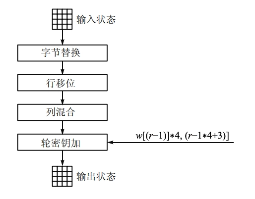

	1. **字节替换**（SubByte）：对数据的每一字节应用一个非线性变换。

		- 

		- 矩阵中各字节被固定的 8 位查找表中对应的特定字节所替换。

			- $16 \times 16$ 矩阵表中纵向的 $x$ 取自状态矩阵中的高 4 比特，横向的 $y$ 取自低 4 比特

		- 替代的过程如下表， $x$ 行和 $y$ 列的数据就用来替代的数据
			

	2. **行移位**（ShiftRow）：对每一行的字节循环重新排序。

		- 每一行都向左循环位移某个偏移量。属于置换（permutation）运算

			- 第 0 行不变

			- 第 1 行循环左移 1 位

			- 第 2 行循环左移 2 位

			- 第 3 行循环左移 3 位

		- 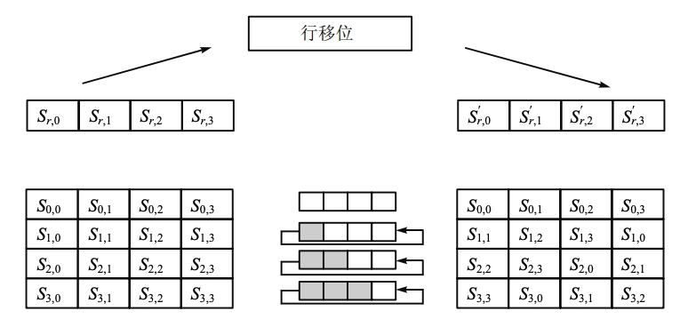

	3. **列混合**（MixColumn）：对矩阵的列应用一个线性变换。

		- 将状态的每一列视为 $GF(2^8)$ 上多项式 $S(x)$, 然后和一个固定多项式在模 $x^4+1$ 下相乘，变换公式如下：

			$$
			\begin{aligned} &S^\prime(x) = a(x) \otimes S(x)\\ &S^\prime_{0c} = \{02\} \times S_{0c} \oplus \{03\} \times S_{1c} \oplus \{01\} \times S_{2c} \oplus \{01\} \times S_{3c}\\ &S^\prime_{1c} = \{01\} \times S_{0c} \oplus \{02\} \times S_{1c} \oplus \{03\} \times S_{2c} \oplus \{01\} \times S_{3c}\\ &S^\prime_{2c} = \{01\} \times S_{0c} \oplus \{01\} \times S_{1c} \oplus \{02\} \times S_{2c} \oplus \{03\} \times S_{3c}\\ &S^\prime_{3c} = \{03\} \times S_{0c} \oplus \{01\} \times S_{1c} \oplus \{01\} \times S_{2c} \oplus \{02\} \times S_{3c} \end{aligned}
			$$

			- 加法：等价于异或 $XOR, \oplus$。

			- 乘法：定义为 $GF(2^8)$ 上模不可约多项式 $x^4 +1$ 的乘法。

		- 此步骤亦可视为 Rijndael 有限域之下的矩阵乘法, $a(x)$ 存在关于 $x^4+1$ 的逆元。

		- 

	4. **轮密钥加**（AddRoundKey）：把轮密钥混合到中间数据。

		- 对状态和轮密钥进行简单的异或运算。

		- 轮密钥是通过密钥调度算法从主密钥中产生，轮密钥长度等于分组长度；

		- 轮密钥加运算需要用到 $4$ 个导出的 $32$ 比特子密钥；

		- 

- **轮密钥生成**：

	- AES 使用密钥扩展算法从初始密钥生成每一轮所需的轮密钥。
		

	- 每一轮需要用到 $N_b$ 比特的子密钥，共 $N_r$ 轮，加上第一次轮密钥加时也需要一轮，共 $N_r + 1$ 个子密钥。

		- 对于 AES-128，$N_b = 128$，$N_r = 10$，需要 $10 \times 128 + 128= 1408$ 比特子密钥。

		- 第 $0$ 轮密钥就是初始密钥本身。

		- 第 $i$ 轮密钥是密钥扩展函数在第 $i-1$ 轮密钥的基础上生成的。

	- 第 $i-1$ 轮的 $16$ 个字节的子密钥被分成 $4$ 组来处理，每组 $4$ 个字节。

		- 最后一组的 $4$ 个字节先执行一个字节的循环左移，由 S 盒（这个 S 盒与字节替代时的 S 盒是一样的）来进行替代处理

		- 然后这 $4$ 个字节结果中的第 $1$ 个字节和轮常数相异或，这个常数是由是预先定义的，可以查表得到：
			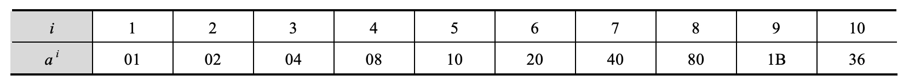

		- 最后，为了得到第 $i$ 轮密钥，把得到的 $4$ 个字节的结果和 $i-1$ 轮密钥的最初 $4$ 个字节按位相异或，得到 $i$ 轮密钥的最初 $4$ 个字节

		- 然后又和密钥的接下来 $4$ 个字节按位相异或，得到 $i$ 轮密钥的接下来 $4$ 个字节，以此类推。

## 分组密码的工作模式

- 定义：分组密码加密固定长度的信息，例如：DES 加密 64-bit，使用 56-bit 密钥，需要一种使用方法，加密任意长度的消息，这种使用方法叫做工作模式（Modes of Operation）。

- 分类：

	- Block Modes(分组密码模式)

		- ECB(Electronic Codebook)：电子密码本模式

		- CBC(Cipher Block Chaining)：密码分组链接模式

	- Stream Modes(流密码模式)

		- CFB(Cipher Feedback)：密码反馈模式

		- OFB(Output Feedback)：输出反馈模式

		- CTR(Counter)：计数器模式

- 在 CFB、OFB 和 CTR 模式中，仅使用加密算法（不需要解密算法）

	- 这就是为什么 Rijndael（AES）针对加密进行了优化

	- 这些模式不应与公钥加密算法一起使用

### ECB 工作模式 (Electronic Code Book)

- ECB（electronic codebook）模式是最简单的运行模式，它将消息分成相互独立的加密模块，每次的加密密钥都相同。

- 密钥为 $K$，明文块 $P_1, P_2, \ldots, P_t$，密文块 $C_1, C_2, \ldots, C_t$

	- 加密：$C_i = E_K[P_i]$

	- 解密：$P_i = D_K[C_i]$

	- 

- **工作模式特点**：

	- ECB 在用于短数据（如加密密钥）时非常理想，因此如果需要安全地传输 DES 密钥，ECB 是最合适的模式

	- **最大特性**：相同的明文块在相同的密钥下会生成相同的密文块

		- 需要加密的消息通常具有非常规则的格式

		- 重复的片段、特殊的头部信息、连续的 0 等是非常常见的

		- 无法隐藏数据模式、不太安全的

	- 块是独立于其他块进行加密的

		- 重新排列密文块会导致相应的明文块重新排列

		- 密文块可以从一条消息中剪切并粘贴到另一条消息中，可能不会被检测到

	- **错误传播**：密文块中的一个比特错误只会影响相应的明文块（导致生成乱码）

	- 总体而言：不建议用于超过一个块的消息，或者如果密钥被重复用于多个块

- ECB 用于长消息时可能不够安全，如果消息有固定结构，密码分析者有可能找出这种关系。

	- 如果已知消息总是以某个预定义字段开始，那么分析者就可能得到很多明文密文对。

	- 如果消息有重复的元素而重复的周期是 64-bit（以 DES 为例）的倍数，那么密码分析者就能够识别这些元素。

### CBC 工作模式 (Cipher Block Chaining)

- CBC（Cipher Block Chaining）模式将消息分成模块，加密是相互联系的，每个明文分组在加密前都与前一个密文分组进行异或运算。

- 密钥为 $K$，明文块 $P_1, P_2, \ldots, P_t$，密文块 $C_1, C_2, \ldots, C_t$，初始向量 $IV$。

	- 加密：CBC 模式一次对一个明文分组加密，每次加密使用同一密钥，加密算法的输入是当前明文分组和前一次密文分组的异或，因此加密算法的输入不会显示出与这次的明文分组之间的固定关系，所以重复的明文分组不会在密文中暴露出这种重复关系。

		$$
		\begin{aligned} C_j &=E_{K} [C_{(j-1)} \oplus P_j] \\ C_0 &=IV \end{aligned}
		$$

	- 解密：每一个密文分组被解密后，再与前一个密文分组异或以恢复明文分组。

		$$
		\begin{aligned} P_j &=D_{K} [C_j] \oplus C_{(j-1)} \\ &= D_K [E_K [C_{(j-1)} \oplus P_j]] \oplus C_{(j-1)} \\ &= C_{(j-1)} \oplus P_j \oplus C_{(j-1)} \\ &= P_j \\ C_0 &=IV \end{aligned}
		$$

	- 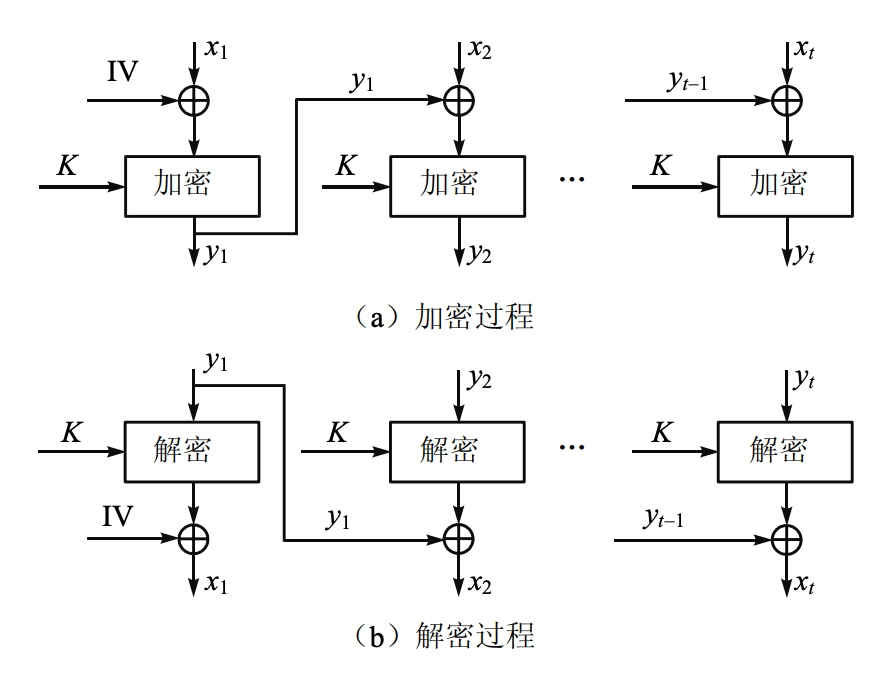

- 初始化向量 $IV$ 的完整性

	- 在产生第 1 个密文分组时，需要有一个初始向量 $IV$ 与第 1 个明文分组异或。解密时，$IV$ 和解密算法对第 1 个密文分组的输出进行异或以恢复第 1 个明文分组。

	- $IV$ 对于收发双方都应是己知的，为使安全性最高，$IV$ 应像密钥一样被保护，可使用 ECB 模式来发送 $IV$。保护 $IV$ 的原因如下：

		$$
		\begin{aligned} C_1 &= E_K[IV \oplus P_1] \\ P_1 &= IV \oplus D_K[C_1] \end{aligned}
		$$

	- 如果攻击者能欺骗接收方使用不同的 $IV$ 值，就能够在明文的第 1 个分组中插入自己选择的比特值，这是因为用 $X(i)$ 表示 64-bit 分组 $X$ 的第 $i$ 个比特，那么 $P_1(i)=IV(i)\oplus D_K[C_1](i)$，由异或的性质得 $P_1(i)^\prime = IV(i)^\prime \oplus D_K[C_1](i)$，其中撇号 $\prime$ 表示比特补。

		- 意味着如果攻击者篡改 $IV$ 中的某些比特，则接收方收到的 $P_1$ 中相应的比特也发生了变化。

- 由于 CBC 模式的链接机制，CBC 模式对加密长于 64 比特的消息非常合适。

- CBC 模式除能够获得保密性外，**还能用于认证（生成 MAC 码），进行用户鉴别**。

- **工作模式特点**

	- 在相同密钥 $K$ 但不同初始向量 $IV$ 下加密相同的明文，会生成不同的密文

		- 重新排列密文块会影响解密

		- 然而，对先前明文块的依赖仅通过前一个密文块 $C_{(j-1)}$ 实现

		- 正确解密一个密文块仅需要前一个密文块是正确的

	- **错误传播**：

		- 密文块 $C_j$ 中的一个比特错误会影响第 $j$ 个和第 $(j+1)$ 个明文块

		- $P_j^\prime$ 完全变为乱码，而 $P_{j+1}^\prime$ 在 $C_j$ 发生错误的比特位置也会出现错误

### CFB 工作模式 (Cipher Feedback)

- 用于加密字符流，逐个字符处理

- 消息被看作比特流，被加到分组密文的输出，并把结果反馈到下一阶段

- 标准允许反馈任意比特 (1,8 or 64 or whatever)，记作 CFB-1, CFB-8, CFB-64 等

- 密钥为 $K$，明文块 $P_1, P_2, \ldots, P_t$，密文块 $C_1, C_2, \ldots, C_t$，初始向量 $IV_0$。以 CFB-64 为例：

	- 加密：

		$$
		\begin{aligned} C_i &= P_i \oplus E_{K}[J_{i}][0:r] \\ J_{i} &= (J_{i−1}) \ll r \parallel C_{i−1} \\ J_{1} &= IV_0 \end{aligned}
		$$

		- 设传送的每个单元（如一个字符）是 $r$ 比特长度，通常取 $r=8$，与 CBC 模式一样，明文单元被链接在一起，使得密文块 $C_m$ 依赖于明文块 $P_m$ 以及所有先前的明文块

		- 方法：

			- 加密算法的输入是 64 比特移位寄存器，其初值为某个初始向量 $IV_0$。

			- 加密算法输出的最左（最高有效位）$r$ 比特与明文的第一个单元 $P_1$ 进行异或，产生密文的第一个单元 $C_1$，并传送该单元。

			- 然后将移位寄存器的内容左移 $r$ 位并将 $C_1$ 送入送入移位寄存器最右边的 $r$ 位。这一过程一直进行到明文的所有单元都被加密为止。

	- 解密：

		$$
		\begin{aligned} P_i &= C_i \oplus E_{K}[J_{i}][0:r] \\ J_{i} &= (J_{i−1}) \ll r \parallel C_{i−1} \\ J_{1} &= IV_0 \end{aligned}
		$$

		- 解密时，将收到的密文单元与加密函数的输出进行异或。

		- **注意这时仍然使用加密算法而不是解密算法**

	- 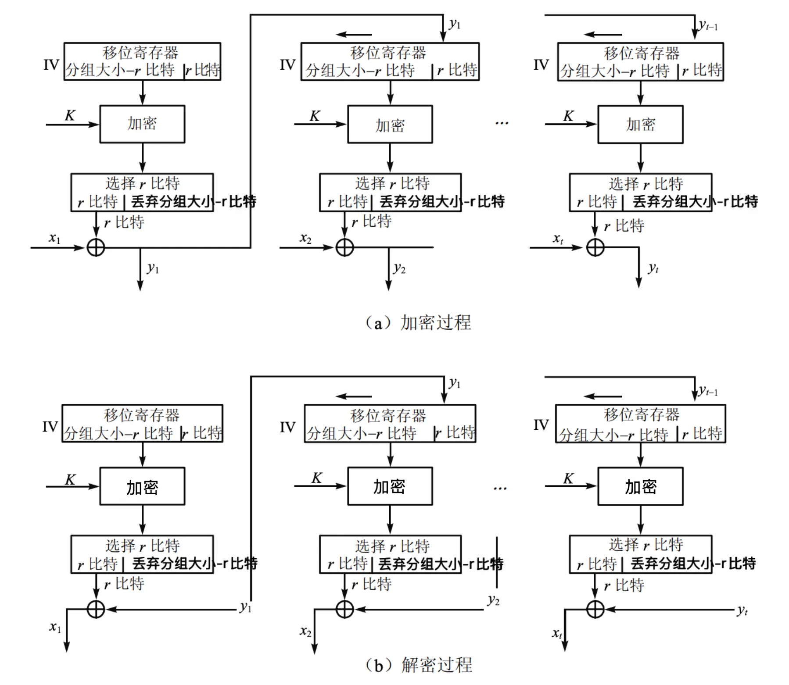

- CFB 模式除能获得保密性外，还能用于认证。

- 工作模式特点：

	- 适合数据以比特或字节为单位出现

	- 在相同密钥 $K$ 但不同初始向量 $IV$ 下加密相同的明文，会生成不同的密文

	- $IV$ 可以直接发送

	- 密文块 $C_m$ 依赖于明文块 $P_m$ 以及所有先前的明文块

		- 重新排列密文块会影响解密。

		- 正确解密一个密文块需要其前 $\lceil n/r \rceil$ 个密文块是正确的（对于 DES, $n=64$）。

	- **错误传播**：

		- 密文块 $C_m$ 中的一个比特错误会影响该块及后续 $\lceil n/r \rceil$ 个密文块的解密（错误会在移位寄存器中持续 $\lceil n/r \rceil$ 步）

			- $P_m^\prime$ 在 $C_m$ 发生错误的比特位置也会出现错误，而其他错误的明文块则完全变为乱码

			- 攻击者可能会在第 $m$ 个明文块中引起可预测的比特变化

### OFB 工作模式 (Output Feedback)

- 另一种流加密方法，OFB 是将加密算法的输出反馈到移位寄存器，而 CFB 是将密文单元反馈到移位寄存器

- 密钥为 $K$，明文块 $P_1, P_2, \ldots, P_t$，密文块 $C_1, C_2, \ldots, C_t$，初始向量 $IV_0$。以 OFB-64 为例：

	- 加密：

		$$
		\begin{aligned} C_i &= P_i \oplus O_i[0:r] \\ O_i &= E_{K}[I_i] \\ I_i &= (I_{i−1}) \ll r \parallel O_{i−1}[0:r] \\ I_1 &= IV_0 \end{aligned}
		$$

	- 解密：

		$$
		\begin{aligned} P_i &= C_i \oplus O_i[0:r] \\ O_i &= E_{K}[I_i] \\ I_i &= (I_{i−1}) \ll r \parallel O_{i−1}[0:r] \\ I_1 &= IV_0 \end{aligned}
		$$

	- 

- 工作模式特点：

	- 每条新消息应使用不同的 $IV$，否则消息将使用相同的密钥流进行加密

	- $IV$ 可以直接发送

		- 如果 $IV$ 被攻击者修改，则加密将无法恢复（与 CFB 不同）

	- 密文块 $C_m$ 仅依赖于明文块 $P_m$（不依赖于先前的明文块）

		- 重新排列密文块会影响解密

	- **错误传播**：

		- 比特错误不会传播，密文块 $C_m$ 中的一个比特错误仅影响该密文块的解密

			- $P_m^\prime$ 在 $C_m$ 发生错误的比特位置也会出现错误

			- 攻击者可能会在第 $m$ 个明文块中引起可预测的比特变化

### CTR 工作模式 (Counter)

- 与 CFB、OFB 相似，CTR 将块密码变为流密码，通过递增一个加密计数器以产生连续的密钥流

- 加/解密过程：

	- 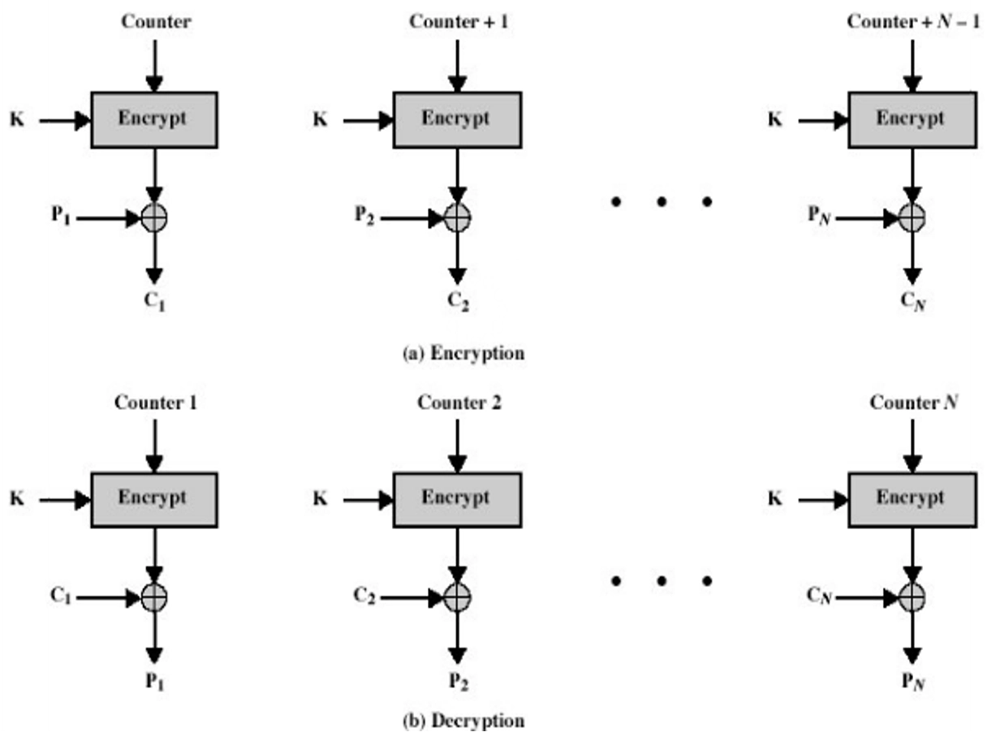

- 工作模式特点：

	- 效率高

		- 可并行加密

		- 预处理

		- 吞吐量仅受可使用并行数量的限制

	- 加密数据块的随机访问

	- 可证明安全

	- 周期长度取决于计数器的大小（通常为 $2^n$）

	- 第 $i$ 个块可以独立于其他块进行解密

		- 可并行化（与 OFB 不同）

		- 支持随机访问

	- **与明文进行异或运算的值可以预先计算**

## 对称密码算法分析
### 强力攻击（General Attack）

- 密钥空间穷搜索, 又称穷举攻击

- 以 DES 为例：

	- 64 位密钥，有效密钥长度为 56-bit

	- 密钥有 $2^{56} = 72,057,584,037,927,936 ≈ 7.2$ 亿亿

- 技术进步使穷举搜索成为可能

	- 算力提升

	- GPU

	- 量子计算

### 密法分析攻击

- 分类：

	- Ciphertext-only attack（唯密文攻击）：仅通过观察密文推导出解密密钥或明文。

	- Known-plaintext attack（已知明文攻击）：使用一定数量的明文及其对应的密文。

	- Chosen-plaintext attack（选择明文攻击）：选择明文并获得相应的密文。

	- Adaptive chosen-plaintext attack（自适应选择明文攻击）：选择明文攻击，其中明文的选择可能依赖于先前请求中收到的密文。

	- Chosen-ciphertext attack（选择密文攻击）：选择密文并获得相应的明文。

	- Adaptive chosen-ciphertext attack（自适应选择密文攻击）：选择密文攻击，其中密文的选择可能依赖于先前请求中收到的明文。

- 差分密码分析