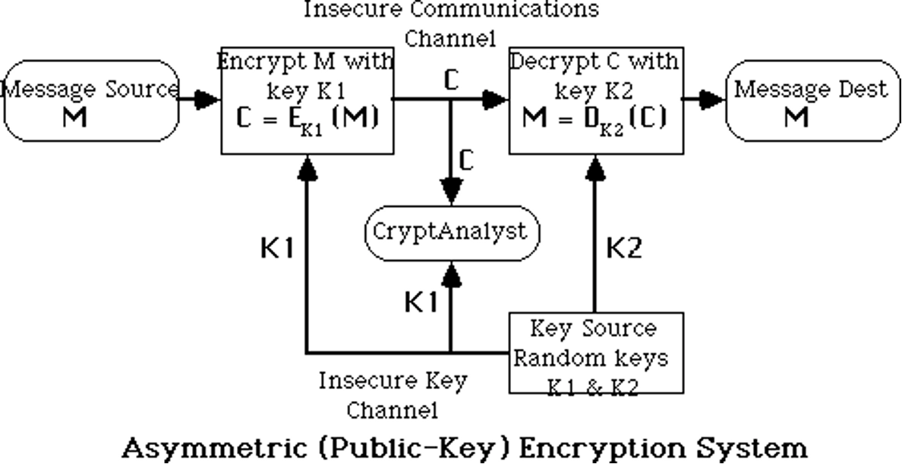
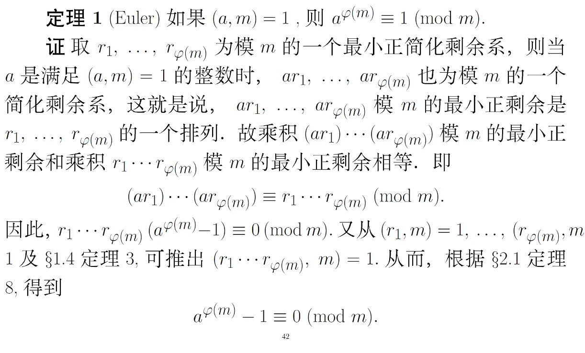
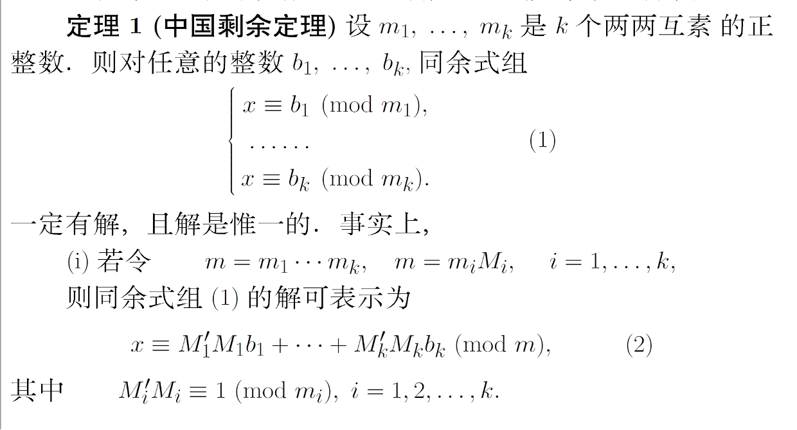
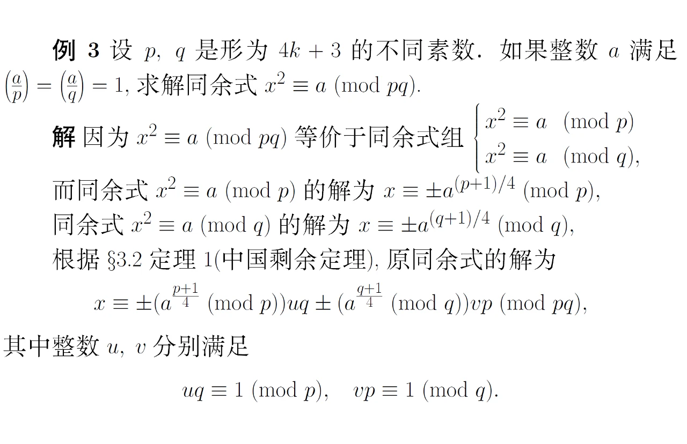

# 公钥密码

- [Back to Course Home](index.md)

---

- 公钥密码算法，又称非对称密码算法，是指加密和解密使用不同密钥的密码算法。

- 对称加密体制的缺陷

	- 密钥分配问题：通信双方要进行加密通信，需要通过秘密的安全信道来协商加密密钥，而这种安全信道可能很难实现

	- 密钥管理问题：在有多个用户的网络中，任何两个用户之间都需要有共享的密钥，当网络中的用户 $n$ 很大时，需要管理的密钥数目是非常大 $n(n−1)/2$

	- 没有签名功能：当主体 A 收到主体 B 的电子文档（电子数据）时，无法向第三方证明此电子文档却是来源于 B

## 公钥密码体制的基本原理

- Public-Key / Two-key / Asymmetric Cryptography

	- 公钥（Public Key）：加密密钥，任何人都可以知道，用于加密或者验证签名

	- 私钥（Private Key）：解密密钥，只有密钥拥有者知道，用于解密或者签名

	- 加密或验证签名者不能解密或生成签名

- 公钥加密方案
	

- 公钥密码理论：

	- 由私钥及其他密码信息容易计算出公钥

	- 由公钥及算法描述，计算出私钥在计算上不可行

	- 由公钥及密文，计算出对应的明文在计算上不可行

	- 因此，公钥可以发布给其他人

	- 密钥分配问题不是一个容易的问题

- 公钥算法分类

	- Public-Key Distribution Schemes (PKDS)

		- 用于交换秘密信息（依赖于双方主体）

		- 常用于对称加密算法的密钥

	- Public-Key Encryption (PKE)

		- 用于加密任何消息

		- 任何人可以用公钥加密消息

		- 只有私钥拥有者可以解密消息

		- 任何公钥加密方案能够用于密钥分配方案 PKDS

		- 许多公钥加密方案也是数字签名方案

	- Signature Schemes (SS)

		- 用于生成对某消息的数字签名

		- 私钥拥有者生成签名

		- 任何人都可以用公钥验证签名

- 公钥的安全性

	- 依赖于足够大的困难性差别

	- 类似于对称算法，穷搜索理论上可以破解公钥密码

	- 但实际上，密钥足够长（>512-bit），穷搜索不可行

	- 一般情况下，有一些已知的困难问题

	- 要求足够大的密钥长度（>512-bit）

	- 导致加密速度比对称算法慢

## Diffie-Hellman 密钥交换协议

- 公钥分配方案

	- 不能用于交换任意消息

	- 可以建立共享密钥（双方共享）

	- 依赖于双方的公私钥值

	- 基于有限域上的指数问题

	- 安全性是 **基于计算离散对数的困难性**

### Diffie-Hellman Setup

- 两个通信主体 A 和 B 希望在公开信道上建立密钥

- 初始化：

	- 选择一个大素数 $p$ 和一个生成元 $g$ ($1 < g < p$)

	- $p$ 和 $g$ 公开

- 密钥生成：

	- A 选择一个私钥 $x_A$ ($1 < x_A < p$)

	- B 选择一个私钥 $x_B$ ($1 < x_B < p$)

	- A 计算公钥 $y_A = g^{x_A} \bmod p$

	- B 计算公钥 $y_B = g^{x_B} \bmod p$

	- A 和 B 分别公开各自的公钥 $y_A$ 和 $y_B$

- 密钥计算：

	- A 计算共享密钥 $K_{AB} = y_B^{x_A} \bmod p = g^{x_A x_B} \bmod p$

	- B 计算共享密钥 $K_{AB} = y_A^{x_B} \bmod p = g^{x_A x_B} \bmod p$

	- 由于模幂运算的性质，A 和 B 计算出的共享密钥 $K_{AB}$ 是相同的

- 示例：

	- 选取素数 $p=97$，及生成元 $g=5$

	- Alice 选取秘密 $x_A=36$ & 计算公钥 $y_A=5^{36}=50 \bmod 97$

	- Bob 选取秘密 $x_B=58$ & 计算公钥 $y_B=5^{58}=44 \bmod 97$

	- Alice and Bob 交换公钥

	- Alice 计算公享秘密 $K=44^{36}=75 \bmod 97$

	- Bob 计算公享秘密 $K=50^{58}=75 \bmod 97$

### Diffie-Hellman in Practice

- 两个主体每次可以选择新的私钥，并计算及交换新的公钥

- 可以抵挡被动攻击，但不能抵挡主动攻击

- 每次可以给出一个新的共享密钥

- 为抵抗主动攻击（如中间人攻击），需要其他新的协议，也可以建立长期公钥

### Man-in-the-Middle Attack（中间人攻击）

- 两个通信主体 A 和 B，以及一个攻击者 E

- 初始化：

	- 选择一个大素数 $p$ 和一个生成元 $g$ ($1 < g < p$)

	- $p$ 和 $g$ 公开

- 密钥生成：

	- A 选择一个私钥 $x_A$ ($1 < x_A < p$)，计算公钥 $y_A = g^{x_A} \bmod p$

	- B 选择一个私钥 $x_B$ ($1 < x_B < p$)，计算公钥 $y_B = g^{x_B} \bmod p$

- 密钥计算：

	- A 将公钥 $y_A$ 发送给 B，但被 E 截获

		- E 选择一个私钥 $x_A^\prime$，计算公钥 $y_A^\prime = g^{x_A^\prime} \bmod p$ 发送给 B

	- B 将公钥 $y_B$ 发送给 A，但被 E 截获

		- E 选择一个私钥 $x_B^\prime$，计算公钥 $y_B^\prime = g^{x_B^\prime} \bmod p$ 发送给 A

	- A 和 E 共享密钥 $K_{AE} = (y_B^\prime)^{x_A} \bmod p = g^{x_A x_B^\prime} \bmod p$

	- B 和 E 共享密钥 $K_{BE} = (y_A^\prime)^{x_B} \bmod p = g^{x_A^\prime x_B} \bmod p$

- 结果：

	- A 和 E 共享密钥 $K_{AE}$

	- B 和 E 共享密钥 $K_{BE}$

	- A 和 B 之间没有共享密钥

## RSA

- 使用最广泛的公钥加密算法

	- 由 Ron Rivest, Adi Shamir 和 Leonard Adleman 在 1977 年提出

	- **基于大整数分解的困难性**

### RSA 密钥生成

- 随机选择两个大素数 $p$ 和 $q$（>500-bit）

	- 计算模数 $n = p \times q$

	- 计算欧拉函数 $\phi(n) = (p-1)(q-1)$

- 随机选择一个加密指数 $e$，满足 $1 < e < \phi(n)$ 且 $\gcd(e, \phi(n)) = 1$

	- 计算解密指数 $d$，满足 $d \times e \equiv 1 \bmod \phi(n)$ 且 $1 < d < \phi(n)$

- 得到密钥对：

	- 公钥为 $K = \{e, n\}$

	- 私钥为 $K^{-1} = \{d, p, q\}$

### RSA 参数选择

- 需要选择足够大的素数 $p$ 和 $q$（>500-bit）

- 通常选择小的加密指数 $e$，且与 $\phi(n)$ 互质

	- 常用 $e$ 的值为 $3, 17, 65537 (= 2^{16} + 1)$

	- $e$ 对所有用户可以是相同的

	- 最初建议使用 $e=3$

- 解密指数 $d$ 比较大

### RSA 加解密算法

- 加密：

	- 使用公钥 $K = \{e, n\}$

	- 将消息 $M$ 映射为整数 $m$，满足 $0 \leq m < n$

	- 计算密文 $c = m^e \bmod n$

- 解密：

	- 使用私钥 $K^{-1} = \{d, p, q\}$

	- 计算明文 $m = c^d \bmod n$

- 示例：

	1. 选素数 $p=47$ 和 $q=71$，得 $n=pq=47\times 71=3337$，$\phi(n)=(p-1)(q-1)=46\times 70=3220$

	2. 选择 $e=79$，求得解密指数 $d=e^{-1}\bmod \phi(n)=1019$

	3. 公开公钥 $K=\{n=3337, e=79\}$，保留私钥 $K^{-1}=\{d=1019, p=47, q=71\}$

	4. 现要发送明文 $688$，计算：$688^{79} \bmod 3337=1570$

	5. 收到密文 $1570$ 后，用私钥 $d=1019$ 进行解密：$1570^{1019} \bmod 3337=688$

### RSA 理论

- 基于 Fermat's Theorem

	- 如果 $n = pq$，其中 $p, q$ 是素数，则有：$x^{(\phi(n))} = 1 \bmod n$，对于所有与 $n$ 互质的 $x$，即 $\gcd(x, n) = 1$，其中 $\phi(n) = (p−1)(q−1)$。

	- 在 RSA 中，$e$ 和 $d$ 是经过特殊选择的：

		- 即 $e \cdot d = 1 \bmod \phi(n)$ 或 $e \cdot d = 1 + R \cdot \phi(n)$。

	- 因此可以推导出：

		$$
		C^d = M^{(e \cdot d)} = M^{(1 + R \cdot \phi(n))} = M^1 \cdot (M^{(\phi(n))})^R = M^1 \cdot 1^R = M^1 \bmod n = M
		$$

	- 这表明解密后的明文 $M$ 与加密前的明文一致。

- 相关理论
	
	

- RSA 加密实质上是一种 $\mathbb{Z}_n \rightarrow \mathbb{Z}_n$ 上的单表代换

	- 给定 $n = p \times q$ 和合法明文 $m \in \mathbb{Z}_n$，可以唯一地计算出密文 $c = (m^e \bmod n) \in \mathbb{Z}_n$，对于 $m \neq m^\prime$，有 $c \neq c^\prime$

	- $\mathbb{Z}_n$ 中的任一元素（$0, p, q$ 的倍数除外）是一个明文，但它也是与某个明文相对应的一个密文。

	- 因此，RSA 是 $\mathbb{Z}_n \rightarrow \mathbb{Z}_n$ 的一种单表代换密码，关键在于 $n$ 极大时在不知陷门信息下极难确定这种对应关系，而用模指数算法又易于实现一种给定的代换。正由于这种一一对应性使 RSA 不仅可以用于加密也可以用于数字签字。

### RSA 的安全性

- 基于大整数分解的困难性

	- 需要分解模 $n$ 的素因子 $p$ 和 $q$，才能计算出 $\phi(n)$，进而计算出解密指数 $d$

- 要求分解模 $n$

	- 在理论上，RSA 的安全性取决于模 $n$ 分解的困难，但数学上至今还未证明分解模就是攻击 RSA 的最佳方法，也未证明分解大整数就是 NP 问题，可能有尚未发现的多项式时间分解算法。

	- 人们完全可以设想有另外的途径破译 RSA，如求解密指数 $d$ 或找到 $(p_1-1)(p_2-1)$ 等。

	- 但这些途径都不比分解 $n$ 来得容易。甚至 Alexi 等在 1988 曾揭示，从 RSA 加密的密文恢复某些 bit 的困难性也和恢复整组明文一样困难。

- 采用广义数域筛选分解不同长度 RSA 公钥模所需的计算机资源

	|密钥长(bit)| 所需的 MIPS-年|
	|----------|--------------|
	| 116(Blacknet 密钥) |  400 |
	| 129 |  5,000 |
	| 512 |  30,000 |
	| 768 |  200,000,000 |
	| 1024 |  300,000,000,000 |
	| 2048 |  300,000,000,000,000,000,000 |

	- MIPS-年指以每秒执行 1,000,000 条指令的计算机运行一年

### RSA 的实现问题

- 需要计算模 300 digits (or 1024+ bits) 的乘法

	- 计算机不能直接处理这么大的数（计算速度很慢）

	- 需要考虑其它技术，加速 RSA 的实现

- RSA 的快速实现

	- 加密很快，指数小

	- 解密比较慢，指数较大

	- 利用中国剩余定理 CRT：对 RSA 解密算法生成两个解密方程（利用 $M = C^d \bmod R$ ）

		- 即：

			$$
			\begin{aligned} M_1 = M \bmod p\\ M_2 = M \bmod q \end{aligned}
			$$

		- 解方程：

			$$
			\begin{aligned} M = M_1 \bmod p\\ M = M_2 \bmod q \end{aligned}
			$$

		- 具有唯一解（利用 CRT）：$M = (q \cdot q' \cdot M_1 + p \cdot p' \cdot M_2) \bmod R$

			- 其中 $q \cdot q' \bmod p = 1 ,   p \cdot p' \bmod q = 1$

	- 

## RABIN

- **第一个可证安全的公钥加密方案**

- **基于模合数下求平方根的困难性，即二次剩余问题**

- 说明：

	- 二次剩余问题，给定一个奇合数 $n$ 和整数 $a$，判断 $a$ 是否为 $\bmod n$ 的平方剩余或二次剩余，即判断是否存在整数 $x$ 使得 $x^2 \equiv a \bmod n$

	- 模 $n$ 的平方根问题(SQROOT)，在 $n$ 的分解未知的情况下，求模 $n$ 的平方根，即求解同余式 $x^2 \equiv a \bmod n$

	- 在模 $n = pq$ 的分解未知情况下，上述问题均为困难问题

- 进一步说明：

	- RSA 的破译难度不超过大数分解

	- Rabin 的提出是对 RSA 的一种修正

	- 可以证明对它的破译等价于对 $n$ 的分解

	- RSA 是选择加密密钥 $e$ 满足 $1 < e < \phi(n)$ 且 $(e, \phi(n)) = 1$，Rabin 是取 $e = 2$

### 二次剩余的概念

- 令 $QR_n$ 表示模 $n$ 的二次剩余集合，$QR_n \triangleq \{a \mid \exists x \in Z, x^2 \equiv a \bmod n\}$

	- $Z$ 表示整数集合

	- 即若存在 $x \in Z$ 满足 $x^2 \equiv a \bmod n$，则称 $a \in QR_n$，表 $a$ 为模 $n$ 的二次剩余，否则 $a \notin QR_n$ 或称 $a$ 为非二次剩余。非二次剩余集合用 $NQR_n$ 表示它。

- **定理 1**：假定 $n = p_1 p_2$，$p_1$ 和 $p_2$ 是不相同的素数，$Z_n$ 中有 $(p_1−1)(p_2−1)/4$ 个元素属于 $QR_n$，每个属于 $QR_n$ 的元素有 $4$ 个平方根。

- **定理 2**：若 $\alpha$ 和 $\gamma$ 属于本质上不同的 $\beta$ 的平方根，且 $\alpha$ 和 $\gamma$ 为小于 $n/2$ 的正整数，$\alpha$ 和 $\gamma$ 满足 $x^2 \equiv \beta \bmod n$，则 $\gcd(\alpha+\gamma,n)=p_1$，或 $\gcd(\alpha+\gamma,n)=p_2$，其中必有一式成立。

### RABIN 密钥生成

- 令 $p$ 和 $q$ 是两个素数，在模 4 下与 3 同余（即 $p \bmod 4 = q \bmod 4 = 3$），计算 $n=pq$（这样的 $n$ 称为 blum 整数）。

- 公钥为 $K=\{n\}$

- 私钥为 $K^{-1}=\{p,q\}$

### RABIN 加解密算法

- 加密：设 $M$ 为待加密消息，计算密文

	$$
	C=M^2 \bmod n, \quad 0 \leq M < n
	$$

- 解密：计算

	$$
	\begin{aligned} &\begin{cases} W_1 = C^{(p+1)/4} \bmod p \\ W_2 = p - C^{(p+1)/4} \bmod p \\ W_3 = C^{(q+1)/4} \bmod q \\ W_4 = q - C^{(q+1)/4} \bmod q \end{cases} \\ &\begin{cases} u = q \cdot (q^{-1} \bmod p) \\ v = p \cdot (p^{-1} \bmod q) \end{cases} \\ &\begin{cases} M_1 = (u \cdot W_1 + v \cdot W_3) \bmod n \\ M_2 = (u \cdot W_1 + v \cdot W_4) \bmod n \\ M_3 = (u \cdot W_2 + v \cdot W_3) \bmod n \\ M_4 = (u \cdot W_2 + v \cdot W_4) \bmod n \end{cases} \end{aligned}
	$$

	- 利用中国剩余定理，可以得到 $4$ 个解 $M_1, M_2, M_3, M_4$，其中必有一个与 $M$ 相同，若 $M$ 是文字消息则易于识别；若 $M$ 是随机数字流，则无法确定哪一个 $M_i$ 是正确的消息。

- 定理：
	
	

### RABIN 的安全性

- 定理：设 $n=pq$, $p$、$q$ 为 blum 整数，$x^2 \equiv a \bmod n$ 有解，则求解该同余式等价于分解大整数 $n$

	- 证明：

		- 原同余式等价于

			$$
			\begin{aligned} x^2 \equiv a \bmod p \\ x^2 \equiv a \bmod q \end{aligned}
			$$

		- 若能求出四个解 $x_1, -x_1, x_2, -x_2$，且 $x_1$ 和 $x_2$ 模 $n$ 不同余且为小于 $n/2$ 的正整数，则由 $x_1^2 \equiv a \bmod n$ 和 $x_2^2 \equiv a \bmod n$ 可得 $x_1^2 - x_2^2 \equiv 0 \bmod n$，即 $(x_1 - x_2)(x_1 + x_2) \equiv 0 \bmod n$，而 $x_1 + x_2 < n$, 不可能为 $n$ 的倍数，所以 $x_1 - x_2$ 和 $x_1 + x_2$ 分别含有 $n$ 的一个因子，也即

			$$
			\begin{aligned} \gcd(x_1 - x_2, n) = p\\ \gcd(x_1 + x_2, n) = q \end{aligned}
			$$

		- 因此就相当于分解了整数 $n$。

		- 反之，如果知道 $n$ 的分解，则类似于解密过程可将同余式的四个解求出来

- 等价于对 $n$ 的因数分解

	- 选择密文攻击不安全

	- 对 Rabin 签名的选择密文攻击可以描述如下：攻击者首先随机选取整数 $x$ ，并且计算 $C = x^2 \bmod n$；如果攻击者能够成功骗取签名者对 $C$ 进行签名，他将能够以 1/2 的概率从签名 $s$（满足 $s^2 \equiv C \bmod n$）和 $x$ 中破解 $n$ 的分解。

	- 因为签名者不知道 $x$，对 $m$ 的签名 $s$ 若不同于 $x$，即 $s \not\equiv \pm x \bmod n$，则由定理 2 可从 $\gcd(s+x,n)$ 得到 $n$ 的素数因子 $p_1$ 或 $p_2$。

### RSA VS RABIN

- 安全性

- 加密

	- Rabin 仅一次乘法运算

- 解密

	- Rabin 解密比 RSA 困难，解密过程要解一个求平方根的问题，当 $(p_1−1)/2$ 和 $(p_2−1)/2$ 为奇数，要做两次幂运算，还要解中国剩余定理

## ElGamal

- Diffie-Hellman key distribution scheme 的变形

	- 能够用于安全交换密钥

	- 1985 年由 ElGamal 提出

	- 安全性是 **基于求解离散对数问题的困难性**

	- 缺点：增加了消息长度（2 倍）

### ElGamal 密钥生成

- 选取一个大素数 $p$ 及生成元 $g$

- 随机选取一个私钥 $x$ 满足 $0 < x < p-1$

	- 计算公钥 $y = g^{x} \bmod p$

- 公钥为 $K = \{p, g, y\}$

- 私钥为 $K^{-1} = \{x\}$

### ElGamal 加解密算法

- 为加密 $M$:

	- **发送者** 选择随机数 $k,0 < k < p−1$，$k$ 需要永久保密或销毁

	- 计算消息密钥 $K$：

		$$
		K = y^k \bmod p
		$$

	- 计算密文对：$C = \{C_1,C_2\}$，并发送到接收者

		$$
		\begin{aligned} C_1 &= g^k \bmod p\\ C_2 &= KM \bmod p \end{aligned}
		$$

- 为解密 $C = \{C_1,C_2\}$:

	- **接收者** 首先计算 $K$

		$$
		K = y^k \bmod p = g^{(k\cdot x)} \bmod p = C_1^{x} \bmod p
		$$

	- 然后利用费马小定理计算 $K^{-1}$:

		$$
		K^{-1} = K^{p-2} \bmod p
		$$

	- 计算明文 $M$:

		$$
		M = C_2\cdot K^{-1} \bmod p = C_2\cdot (C_1^{x(p-2)}) \bmod p
		$$

- 示例：

	- 选择 $p=97$ 以及生成元 $g=5$

	- 接收者 Bob：

		- 选择私钥 $x_B=58$

		- 计算并发布公钥 $y_B=5^{58} \bmod 97 = 44$

	- Alice 要加密 $M=3$

		- 首先得到 Bob 的公开密钥 $y_B=44$

		- 选择随机 $k=36$ 计算: $K=44^{36} \bmod 97 = 75$

		- 计算密文对:

			$$
			\begin{aligned} C_1 &= g^k \bmod p = 5^{36} \bmod 97 = 50\\ C_2 &= K\cdot M \bmod p = 75\cdot 3 \bmod 97 = 31 \end{aligned}
			$$

		- 发送 $\{50,31\}$ 给 Bob

	- Bob 接收密文 $\{50,31\}$

		- 恢复 $K=50^{58} \bmod 97 = 75$

		- 计算 $K^{-1} = 22 \bmod 97$

		- 恢复明文 $M = (31\cdot 22) \bmod 97 = 3$

## ECC

- 椭圆曲线密码体制（Elliptic Curve Cryptography，ECC）

	- 于 1985 年，由 Neal Koblitz 和 Victor Miller 分别独立提出

	- 数学难题：**基于椭圆曲线的离散对数难题**

	- ECC 算法所需的密钥长度远比 RSA 算法低

	- 有研究指出，ECC 算法 160-bit 密钥长度所提供的安全性，与 RSA 算法 1024-bit 密钥所提供的安全性相当

### 椭圆曲线的概念

- 椭圆曲线（Elliptic Curve）

	- 由于连续的椭圆曲线，并不适合进行加解密操作，因此考虑将其定义在有限域上

	- 域的定义：

		- 可以在其上进行加、减、乘、除运算，而结果不会超出其范围的集合

		- 有理数域、实数域、复数域，但整数集合不是

	- 有限域的定义：

		- 域 $F$ 只包含有限个元素。有限域中元素的个数称为阶

		- 每个有限域的阶必为素数的幂，即有限域的阶可表示为 $p^n$

		- 该有限域通常称为 Galois 域，记为 $GF(p^n)$

- 通信双方（A 和 B）共享一套公开的椭圆曲线参数，包括曲线方程（如 $y^2 = x^3 + ax + b$）、一个公开基点 $G$，以及 $G$ 的阶 $p$（最小正整数 $n$ 满足 $nG=O$，$O$ 为无穷远点）

- 椭圆曲线的核心数学基础：

	- 在有限域上的椭圆曲线定义“点加”和“点乘”

	- 点乘是核心——即曲线上一个固定点（基点 G）进行整数（私钥）次点加，得到曲线上另一个点（公钥）。该过程“正向易、反向难”，是安全性的根本

- 椭圆曲线（Elliptic Curve）

	- 椭圆曲线方程计算公式

		$$
		y^2 \equiv x^3 + ax + b \bmod p
		$$

	- 椭圆曲线上的点加法

		- 设 $P(x_1,y_1)$ 和 $Q(x_2,y_2)$ 是椭圆曲线 $E$ 上的两个点，定义点加运算 $R = P + Q$ 如下：

			- 若 $P \neq Q$，则连接 $P$ 和 $Q$ 的直线与曲线 $E$ 相交于第三个点 $R^\prime$，则 $R$ 是 $R^\prime$ 关于 $x$ 轴的对称点

			- 若 $P = Q$，则过点 $P$ 的切线与曲线 $E$ 相交于另一个点 $R^\prime$，则 $R$ 是 $R^\prime$ 关于 $x$ 轴的对称点

		- 数学表达：设 $P = (x_1, y_1)$，$Q = (x_2, y_2)$，则

			- 若 $x_1 = x_2$ 且 $y_1 = -y_2$，则 $P + Q = O$（无穷远点），记 $P=-Q$

			- 否则，设 $R = P + Q = (x_3, y_3)$，则

				$$
				\begin{aligned} &x_3 = \lambda^2 - x_1 - x_2 \bmod p \\ &y_3 = \lambda(x_1 - x_3) - y_1 \bmod p \\ &\lambda = \begin{cases} \frac{y_2 - y_1}{x_2 - x_1} \bmod p, & x_1 \neq x_2 \\ \frac{3x_1^2 + a}{2y_1} \bmod p, & x_1 = x_2, y_1 \neq 0 \\ \end{cases} \end{aligned}
				$$

		- 点加法满足交换律和结合律

	- 椭圆曲线上的点乘法

		- 设 $P$ 是椭圆曲线 $E$ 上的一个点，$k$ 是一个整数，定义点乘运算 $Q = kP$ 如下：

			- 若 $k = 0$，则 $Q$ 是无穷远点 $O$

			- 若 $k > 0$，则 $Q$ 是将点 $P$ 自身加 $k$ 次的结果，即在 $P$ 点作切线交于曲线并取关于 $x$ 轴对称点 $P_1$，重复 $k$ 次得到 $Q = P_k$

			- 若 $k < 0$，则 $Q$ 是将点 $-P$ 自身加 $|k|$ 次的结果，即取 $P$ 关于 $x$ 轴的对称点 $-P$，重复 $|k|$ 次得到 $Q = P_{|k|}$

		- 点乘法满足分配律和结合律  

### ECC 密钥生成

1. 公开参数

	- 选取定义在有限域 $GF(p)$ 上的椭圆曲线 $E_p(a,b): y^2=x^3+ax+b$

	- 选取椭圆曲线上一点作为基点 $G(x_G,y_G)$（公开固定点，类似 DH 中的 $g$）

	- 有限域的模值 $p$ （类似 DH 中的大质数 $p$）

2. 公私钥生成

	- 选定一个大数 $x$ 作为私钥

	- 生成公钥 $Q=xG$ （类似 DH 中的 $y=g^x$）

	- 公钥为 $K = \{p, G, Q\}$

	- 私钥为 $K^{-1} = \{x\}$

### ECC 加解密算法

- 加密

	- 选取一个随机数 $k$，$1 < k < p-1$

	- 对于要加密的明文 $M$，分别计算：

		$$
		\begin{aligned} R &= kG \\ K &= kQ \\ S &= M + K \end{aligned}
		$$

	- 生成密文 $C=(R, S)$

- 解密

	- 接收密文 $C=(R, S)$

	- 计算：

		$$
		\begin{aligned} T &= xR ~(= x(kG) = k(xG) = kQ = K) \\ M &= S - T ~(= S - K = M) \end{aligned}
		$$

### ECC VS RSA

- 与 RSA 相比，ECC 在许多方面都有优势：

  - 抗攻击性强。相同的密钥长度，其抗攻击性要比 RSA 强很多倍。

  - 计算量小，处理速度快。ECC 总的速度比 RSA 要快。

  - 存储空间占用小。

### ECC 的应用

- ECC 的签名算法：ECDSA

- ECC 与 DH 算法的结合：ECDH、ECDHE

- 增强的密钥交换算法：ECMQV

- 国密标准公钥加密算法：SM2

#### ECDSA

- 基于 ECC 的签名算法：ECDSA（Elliptic Curve Digital Signature Alg）

	- 不同于 ECC，ECDSA 主要目的是确保消息 M 不被篡改和伪装

	- ECDSA 不对消息 M 进行加密，因此无法保证其机密性

	- ECDSA 的密钥生成过程与 ECC 相同

	- 基础思路：使用私钥进行签名，使用公钥进行验签

- ECDSA 签名与验签算法

	- 使用椭圆曲线参数 $E_p(a,b): y^2=x^3+ax+b$，基点 $G$，以及私钥 $x$ 和公钥 $Q=xG$

	- 签名算法

		1. 计算消息摘要 $h=H(M)$

		2. 计算签名 $s=xh$

		3. 输出消息签名对 $(M,s)$

	- 验签算法

		1. 计算消息摘要 $h=H(M)$

		2. 计算 $sG$ 和 $hQ$

		3. 若 $sG = hQ$，则签名有效；否则签名无效

#### ECDH 与 ECDHE

- 基于 ECC 的密钥分配（交换）算法：

	- ECDH：Elliptic Curve Diffie-Hellman

	- ECDHE：Elliptic Curve Diffie-Hellman Ephemeral

- 与传统 D-H 方案相同，该方案不能用于交换任意信息

	- 传统 D-H 方案基于有限域上的离散对数计算困难问题

	- ECDH、ECDHE 基于有限域上椭圆曲线离散对数计算困难问题

- ECDH 密钥交换算法

	1. 双方公开椭圆曲线参数 $E_p(a,b): y^2=x^3+ax+b$，基点 $G$

	2. 双方生成各自的公私钥对 $(x_A, Q_A=x_AG)$ 和 $(x_B, Q_B=x_BG)$

	3. 双方交换公钥 $Q_A$ 和 $Q_B$

	4. 双方分别计算共享密钥：

		$$
		\begin{aligned} K_A &= x_A Q_B = x_A (x_B G) \\ K_B &= x_B Q_A = x_B (x_A G) \\ K_A &= K_B \end{aligned}
		$$

- ECDHE 密钥交换算法

	- 与 ECDH 相同，但每次会话使用不同的临时密钥对 $(x_A^\prime, Q_A^\prime=x_A^\prime G)$ 和 $(x_B^\prime, Q_B^\prime=x_B^\prime G)$

	- 提供 **前向保密性**：即使服务器存储的长期私钥泄露，也不会影响历史通信的安全

- ECDH、ECDHE、DH、DHE 的比较

	- ECDH 无法提供前向安全性，ECDHE 则解决了这一缺点

	- ECDHE 由于生成了多轮密钥，因此需要服务器提供密钥管理功能

	- DH 也可以提供类似的算法 DHE

	- DHE 由于密钥长度、需要大量乘法运算等原因，性能很差

- ECDHE 由于其良好的运算性能及安全性，目前在工业界广泛应用

	- TLS 1.2+

	- WPA3 SAE(Simultaneous Authentication of Equals) 对等实体同时验证

#### ECMQV

- 基于 ECC 的增强型密钥交换算法：ECMQV（Elliptic Curve Menezes-Qu-Vanstone）

- 私钥 $k_a, k_b$ 分别为 Alice 和 Bob 的私钥，引入可信中心，获取通信双方的公钥 $Q_a, Q_b$

- ECMQV 密钥交换算法

	1. 选择椭圆曲线参数 $E_p(a,b): y^2=x^3+ax+b$，基点 $G$

	2. Alice 选择随机数 $r_a$，计算临时公钥 $R_a = r_a G$，并发送给 Bob，计算 $R_a$ 的 $x$ 坐标 $\overline{R_a}$

	3. Bob 选择随机数 $r_b$，计算临时公钥 $R_b = r_b G$，并发送给 Alice，计算 $R_b$ 的 $x$ 坐标 $\overline{R_b}$

	4. Alice 验证 $R_b$，计算其 $x$ 坐标 $\overline{R_b}$，计算共享密钥：

		$$
		\begin{aligned} &s_a = r_a + \overline{R_a} k_a \bmod p \\ &K_{a,b} = s_a (R_b + \overline{R_b} Q_b) \end{aligned}
		$$

	5. Bob 验证 $R_a$，计算其 $x$ 坐标 $\overline{R_a}$，计算共享密钥：

		$$
		\begin{aligned} &s_b = r_b + \overline{R_b} k_b \bmod p \\ &K_{b,a} = s_b (R_a + \overline{R_a} Q_a) \end{aligned}
		$$

	6. 由于 $K_{a,b} = K_{b,a}$，因此 Alice 和 Bob 获得相同的共享密钥

- ECMQV 算法的分析

	- 与 DH  密钥交换协议的共享密钥为 $r_A,r_B,p$ 不同，ECMQV 共享的信息包括了一个重要结构 $(\overline{R_a} k_a, \overline{R_b} k_b, G)$，这是一个既利用了随机数 $r_A, r_B$，也使用了通信双方的公钥计算出来的结构

	- $s_b=(r_b+\overline{R_b} k_b) \bmod p$ 可以看作 Bob 对 $R_b$ 的“隐式签名”。“签名”是因为只有 Bob 可以计算这个值；“隐式”是因为 Alice 在计算共享秘密的时候可以利用 $s_b G=R_b+\overline{R_b} Q_b$ 间接验证其正确性

- ECMQV 算法的优势与不足

	- 优势

		- 使用双重公钥，可以防止中间人攻击

		- 隐式签名的方式，避免产生额外开销（引入 CA 等）

	- 不足

		- 计算过程复杂，运算量大

- ECMQV 算法的应用

	- ANSI X9.63、IEEE 1363-2000、ISO/IEC 15946-3 等

## SM2

- SM2 算法是中国国家密码管理局（CNCA）发布的一种基于椭圆曲线的非对称加密算法，包含密钥交换、数字签名和公钥加密等功能具体为：

	- SM2-1 椭圆曲线数字签名算法

	- SM2-2 椭圆曲线密钥交换协议

	- SM2-3 椭圆曲线公钥加密算法

### SM2 密钥生成

1. 公开参数

	- 选取定义在有限域 $GF(p)$ 上的椭圆曲线 $E_p(a,b): y^2=x^3+ax+b$

	- 选取椭圆曲线上一点作为基点 $G$

	- 有限域的模值 $p$

2. 计算公私钥对

	- 选定一个大数 $k$ 作为私钥

	- 生成公钥 $Q=kG$

	- 公钥为 $K = \{Q\}$，私钥为 $K^{-1} = \{k\}$

### SM2 加解密算法

- 加密

	1. 选取随机数 $r$，$1 < r < p-1$

	2. 计算点 $C_1 = rG$

	3. 计算点 $S = rQ = (x_S, y_S)$

	4. 计算密钥 $t = KDF(x_S \parallel y_S, klen(M))$

		- 其中 $KDF$ 是密钥派生函数，$klen(M)$ 是明文 $M$ 的比特长度

	5. 计算密文 $C_2 = M \oplus t$

	6. 计算 $C_3 = Hash(x_S \parallel M \parallel y_S)$

	7. 生成密文 $C = (C_1, C_2, C_3)$

- 解密

	1. 计算点 $S = C_1 \cdot k^{-1}$

	2. 计算密钥 $t = KDF(x_S \parallel y_S, klen(C_2))$

	3. 计算明文 $M = C_2 \oplus t$

	4. 验证 $C_3 = Hash(x_S \parallel M \parallel y_S)$

### SM2 VS ECC

- 在加密过程中，引入了多个校验点

- 引入密钥派生函数（KDF），增强了 SM2 算法随机性，提高破解强度

- 引入哈希函数（如 SM3），加入了对传递消息完整性校验的特性

- 加密运算是异或操作，运算速度快

- 密文长度有所扩张，对于计算带宽要求更高

## 公钥密码现状

- 已知的安全算法是有限域上指数运算素数域 $GF(p)$ 上的整数运算

	- 多项式运算 $GF(2^n)$

	- 椭圆曲线上的运算

	- 基于其它困难问题的体制

	- NTRU

- 实际应用

	- 实现速度较慢

		- 通常用于交换对称算法的加密密钥

		- 数字签名算法

### 简单攻击方法（弱参数攻击，以 RSA 为例）
#### 共模攻击

- 当多个用户使用相同的模数 $n$，使用不同的公钥指数 $e$ 对同一明文 $x$ 进行加密时，攻击者可通过共模攻击还原出明文 $x$。

- 攻击条件

	1. 使用相同的模数 $n$

	2. 对同一明文 $x$ 加密

	3. 各公钥指数 $e_1,e_2,\cdots,e_k$ 之间两两互质

- 攻击原理（以两个用户为例）

	1. 设 $e_1$ 和 $e_2$ 是两个互素的不同密钥，共用模为 $n$，对同一消息 $x$ 加密得

		$$
		\begin{aligned} y_1 &= x^{e_1} \bmod n \\ y_2 &= x^{e_2} \bmod n \end{aligned}
		$$

	2. 攻击者已知 $n,y_1,y_2,e_1,e_2$，由于 $\gcd(e_1,e_2)=1$，所以存在整数 $a,b$ 使得 $e_1a+e_2b=1$。

	3. 计算明文：

		$$
		\begin{aligned} x &= (y_1^a \cdot y_2^b) \bmod n \\ &= (x^{e_1})^a \cdot (x^{e_2})^b \bmod n \\ &= x^{e_1a + e_2b} \bmod n \\ &= x^1 \bmod n \\ &= x \end{aligned}
		$$

- 为对抗该攻击，建议每个用户使用不同的模数 $n$。

#### 低加密指数攻击

- 当公钥指数 $e$ 取过小值（如 $e=3$、$e=17$）时，若同一明文被多次加密（或加密后数据满足特定条件），攻击者可通过数学运算直接还原明文，无需破解私钥。

- 攻击条件

	1. 公钥指数 $e$ 取较小值，典型值为 $e=3$ 或 $17$

	2. 同一明文 $x$ 被不同的模数 $n_1,n_2,\cdots,n_k$ 多次加密

- 攻击原理（以 $e=3$ 为例）

	1. 设有三个用户，公钥分别为 $(e=3,n_1)$、$(e=3,n_2)$ 和 $(e=3,n_3)$，对同一消息 $x$ 加密得密文

		$$
		\begin{aligned} y_1 &= x^3 \bmod n_1 \\ y_2 &= x^3 \bmod n_2 \\ y_3 &= x^3 \bmod n_3 \end{aligned}
		$$

	2. 攻击者已知 $n_1,n_2,n_3,y_1,y_2,y_3$，可利用中国剩余定理求解以下同余方程组

		$$
		\begin{aligned} X &\equiv y_1 \bmod n_1 \\ X &\equiv y_2 \bmod n_2 \\ X &\equiv y_3 \bmod n_3 \end{aligned}
		$$

		若 $n_1,n_2,n_3$ 互素，则该方程组有唯一解 $X$ 满足 $0 \leq X < N$，其中 $N = n_1 n_2 n_3$

	3. 计算明文：

		$$
		x = \sqrt[3]{X}
		$$

- 为对抗该攻击，建议公钥指数 $e$ 取较大值（如 $e=2^{16}+1=65537$），或在加密前对明文进行填充处理（如使用 OAEP 填充方案）。

- 当 $e < n$，$d < n/4$ 时，同样可以攻破这类 RSA 系统