# 认证与哈希函数

- [Back to Course Home](index.md)

## 消息认证

- 认证的定义：
	- 认证 (Authentication) 是防止主动攻击的重要技术，对开发系统安全性有重要作用
- 认证的主要目的
	- **实体认证**（验证发送者非冒充）
	- **消息认证**（验证信息的完整性）
- 网络环境中的攻击（认证的需求）
	1. 泄漏
	2. 通信量分析
	3. 伪装（假消息）
	4. 内容篡改（插入，删除，调换和修改）
	5. 序号篡改（消息序号的修改）
	6. 计时篡改（消息延迟或回放）
	7. 抵赖（否认收或发某消息）
	- 1-2 加密，3-6 消息认证，7 数字签名
- 认证系统模型
	- **保密**和**认证**是信息系统安全的两个方面，但它们是两个不同属性的 问题，认证不能自动提供保密性，而保密性也不能自然提供认证功能。一个纯认证系统的模型如下图所示：
		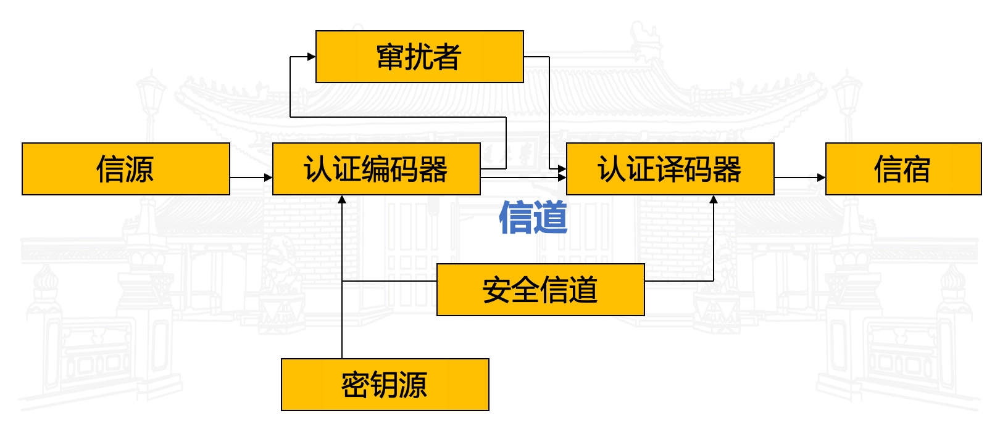

## 消息认证方法（认证函数）

- 为了认证消息的**完整性**和**未被篡改**，需要对消息生成某种形式上的认证符，通过对认证符的分析，可以得知原始消息是否完整，是否被修改。
- 三类主要的消息认证方法 / 认证函数：
	- 消息加密
		- 将整个需要认证的消息加密，将**密文**作为认证符。
	- 消息认证码（MAC）
		- 将需要认证的消息通过一个公共函数作用，**产生的结果和使用的密钥**一起作为认证符
	- 哈希函数（哈希函数）
		- 将需要认证的消息通过一个公共函数映射为定长的哈希值，以**哈希值**作为认证符
- 注意
	- 认证函数类似加密函数，但它是**不可逆**的，这个性质使其比加密函数更难破解
	- 认证函数并不提供数字签名，因为认证函数是对称的，发送者和接收者使用相同的密钥

### 消息加密
#### 对称加密

- 下图的通信双方，用户 A 为发送方，用户 B 为接收方。用户 B 接收到信息后，通过解密来判决信息是否来自 A，信息是否是完整的，有无窜扰。
	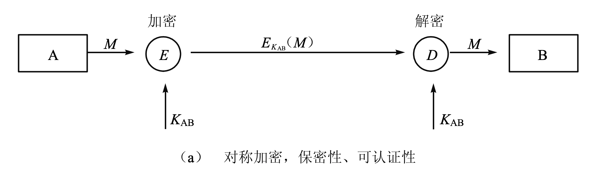

- $A \rightarrow B:  E(K, M)$
	- **具有保密性**
		- 仅 A 和 B 共享密钥 $K$
	- 提供一定程度的**可认证性**
		- 讯息是否来自 A
			- 仅 A 和 B 共享密钥 $K$，消息仅可能来自 A
			- 密钥泄露则认证失效
		- 传输中是否被篡改
			- 收到密文解密得到乱码无法判断是被篡改还是传输错误
			- 需要某种结构或冗余
	- 不提供签名
		- 发送者可以否认消息，声称是接受者伪造的
- 基于 DES 的消息鉴别码
	- 被鉴别消息分成连续的 64-bit 分组：$M_1, M_2, \cdots, M_n$（必要时用 0 填充）
	- 使用 DES 算法 $E(CBC)$，密钥 $K$，数据鉴别码计算如下:

		$$
		\begin{aligned} C_1 &= E_k (M_1) \\ C_2 &= E_k (M_2 \oplus C_1) \\ &\vdots \\ C_n &= E_k (M_n \oplus C_{n-1}) \end{aligned}
		$$

#### 公钥加密

- $A \rightarrow B : E(PK_B, M)$
	- 发送方用接收方的公钥加密消息，接收方用私钥解密（与对称密钥加密原理相同，需要某种特定消息结构）
	- **具有保密性**
		- 消息只能被 B 解密
	- **不提供认证**
		- 任何人都可以用 $B$ 的公钥加密消息并发送给 $B$，无法确认消息来自 $A$
	- 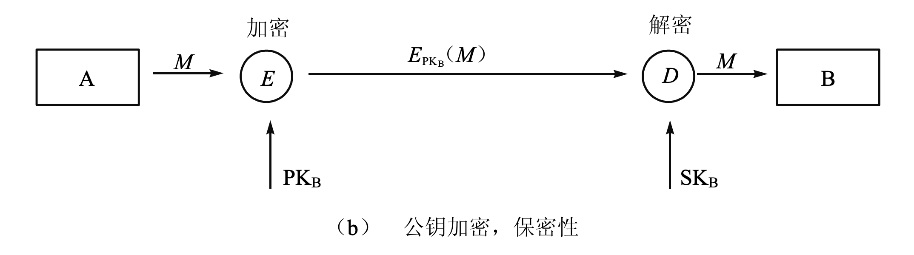
- $A \rightarrow B : E(SK_A, M)$
	- 发送方用自己的私钥加密消息，接收方用发送方的公钥解密
	- **提供认证和签名**
		- 只有 A 能生成该密文，B 用 A 的公钥解密后能确认消息来自 A
	- **不提供保密性**
		- 任何人都可以用 A 的公钥解密消息
	- 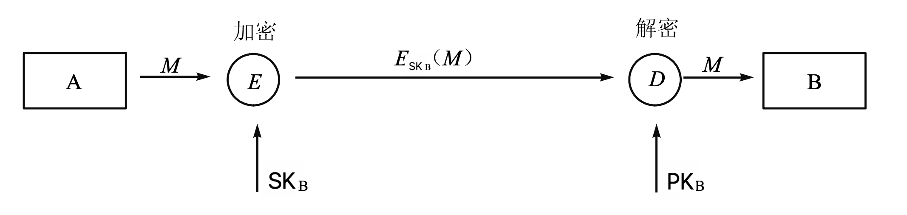
- $A \rightarrow B : E(PK_B, E(SK_A, M))$
	- 发送方先用自己的密钥加密以提供认证，然后使用接收方公钥加密提供保密性。缺点是效率不高。
	- **具有保密性**
		- 消息只能被 B 解密
	- **提供认证和签名**
		- 只有 A 能生成该密文，B 用 A 的公钥解密后能确认消息来自 A
	- 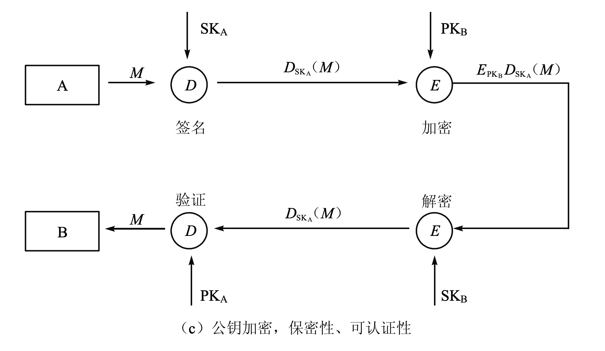

### 消息认证码 MAC

- 认证码（MAC，Message Authentication Code），也称密码检验和
	- 对选定消息 $M$，使用一个密钥 $K$，通过一个编码函数 $C$ 产生一个短小的定长数据分组 $MAC$，称认证码，并将它附加在消息中，提供认证功能
	- $MAC = C_k(M)$ ，其中:
		- $M$ 是可变长的消息
		- $K$ 是共享密钥
		- $C_k(M)$ 是定长的认证码
- 应用认证码，如果只有收发方知道密钥，同时收到的 MAC 与计算得出的 MAC 匹配:
	- 确认消息未被更改
	- 确信消息来自所谓的发送者
	- 如果消息包含序号，可确信该序号的正确性
- 消息认证码的基本用法
	1. $A \rightarrow B:  M \parallel C_k (M)$
		- **提供认证**，因仅 A 和 B 共享 $K$;
		- 
	2. $A \rightarrow B:  E_{K_2} (M \parallel C_{K_1} (M))$：先认证，后加密
		- **提供认证**，因仅 A 和 B 共享 $K_1$;
		- **提供保密**，因仅 A 和 B 共享 $K_2$;
		- 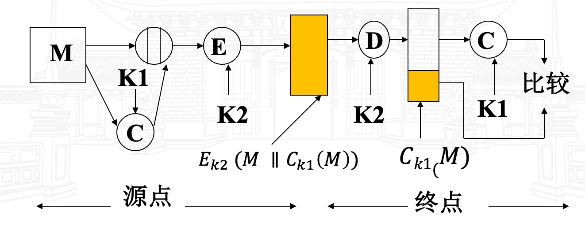
	3. $A \rightarrow B:  E_{K_2} (M) \parallel C_{K_1} (E_{K_2} (M))$：先加密，后认证
		- **提供认证**，因仅 A 和 B 共享 $K_1$;
		- **提供保密**，因仅 A 和 B 共享 $K_2$;
		- 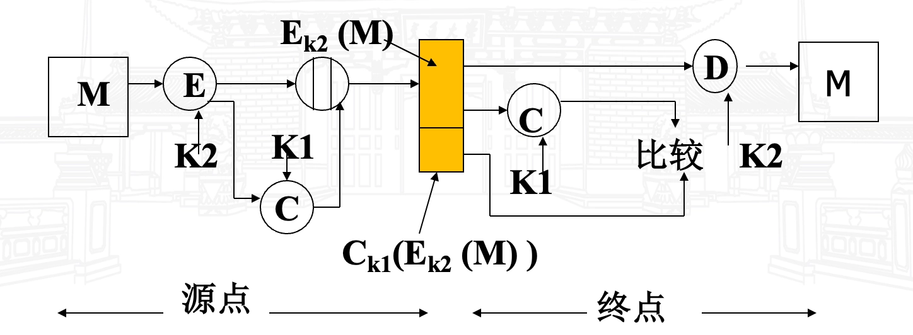
- 为什么使用消息认证（而不是用常规加密）
	- 适用于消息广播
	- 消息加密解密的工作量比较大
	- 某些应用不关心消息的保密而只关心消息的真实性
	- 认证函数与保密函数的分离能提供结构上的灵活性(认证与保密可在网络协议的不同层次进行)
	- 认证码可延长消息的保护期限，同时能处理消息内容（使用加密，当消息解密后，保护就失效了）
- MAC 函数应有如下性质（假设攻击者没有 $K$）：
	- 有 $M$ 和 $C_k(M)$，试图生成 $M'$，使得 $C_k(M')= C_k(M)$，这在计算上不可行；
	- $C_k(M)$ 应能均匀分布；
		- 对于随机选取的消息 $M$ 和 $M'$，$C_k(M)= C_k(M')$ 的概率为 $2^{-n}$，其中 $n$ 为 MAC 的比特长度；
		- 消息 $M'$ 为 $M$ 的某种已知代换，即 $M' = f(M)$，则 $C_k(M)= C_k(M')$ 的概率为 $2^{-n}$

### 哈希函数

- 哈希函数 / 散列函数 / 杂凑函数
	- 哈希函数是将任意长度的消息映射成一个较短的定长输出消息的函数。
	- 如下形式：$h = H(M)$，$M$ 是变长的消息，$h$ 是定长的哈希值。
	- 哈希函数的目的是为文件、消息或其它的分组数据产生“数字指纹”（缩微图）。
- **哈希函数与认证函数的区别**？
	- 哈希函数本身不提供认证功能，只是单纯计算消息的哈希值摘要。
	- 哈希函数加上密钥就可以构成认证函数（如 HMAC）。
	- 哈希函数主要用于消息完整性验证，而认证函数主要用于身份验证和消息完整性验证。
- 使用哈希码提供消息鉴别的方式
	1. $A \rightarrow B:  E_k (M \parallel H(M) )$
		- 提供保密（仅 A 和 B 共享 $K$）
		- 提供鉴别（加密保护 $H(M)$）
	2. $A \rightarrow B:  M \parallel E_k (H(M))$
		- 提供鉴别（加密保护 $H(M)$）
	3. $A \rightarrow B:  M \parallel E_{K_{Ra}} (H(M))$
		- 提供鉴别和数字签名（加密保护 $H(M)$ , 且仅 A 能生成 $E_{K_{Ra}} (H(M))$）
	4. $A \rightarrow B:  E_k (M \parallel E_{K_{Ra}} (H(M)) )$
		- 提供鉴别和数字签名
		- 提供保密（仅 A 和 B 共享 $K$）
	5. $A \rightarrow B:  M \parallel H(M \parallel S)$
		- 提供鉴别（$S$ 是通信双方共享的一个秘密值，仅 A 和 B 共享 $S$）
	6. $A \rightarrow B:  E_k (M \parallel H(M \parallel S ))$
		- 提供鉴别（仅 A 和 B 共享 $S$）
		- 提供保密（仅 A 和 B 共享 $K$）
- 哈希函数的需求
	- $H$ 能用于任何大小的数据分组
	- $H$ 产生定长输出 $h$
	- 对任意给定的 $x$，$H(x)$ 要相对易于计算，使得软硬件实现都实际可行
	- 对任意给定的码 $h$，寻求 $x$ 使得 $H(x)=h$ 在计算上是不可行的（**单向性**）
	- 任意给定分组 $x$，寻求不等于 $x$ 的 $y$，使得 $H(y)= H(x)$ 在计算上不可行（**弱抗碰撞性**）
	- 寻求任意使得 $H(x)=H(y)$ 的 $(x,y)$ 对在计算上不可行（**强抗碰撞性**）
- 单向函数
	- 函数 $F$ 从集合 $A$ 映射到集合 $B$，如果对任意 $A$ 中的元素 $a$，计算 $F(a)$ 是容易的，但对任意 $B$ 中的元素 $b$，要找到 $A$ 中一个元素 $a$ 满足 $b=F(a)$ 是困难的，则函数 $F$ 称为单向函数。
	- 对于单向函数 $F$，如果有了某个陷门 $k$，则计算一个元素 $a$ 满足 $b=F(a)$ 也是容易的，那么这个单向函数称为**陷门单向函数**。
- 常见的哈希函数算法
	

#### 简单的哈希函数构造方法

- 简单的哈希函数（异或方式）
	- 每个分组按比特异或:

		$$
		C_i = b_{i1} \oplus b_{i2} \oplus\cdots\oplus b_{im}
		$$

	- 其中：
		- $C_i$ 是第 $i$ 个比特的哈希码，$1 \leq i \leq n$
		- $m$ 是输入的 $n$ 比特分组
		- $b_{ij}$ 是第 $j$ 分组的第 $i$ 比特
	- 简单的奇偶校验
- 简单的哈希函数的改进方案
	- 先将 $n$ 比特的哈希值设置为 0
	- 按如下方式依次处理数据分组：
		- 将当前的哈希值循环左移一位
		- 将数据分组与哈希值异或形成新的哈希值
	- 这将起到输入数据完全随机化的效果，并且将输入中的数据格式掩盖掉

#### 杂凑函数的代表性设计模式

- MD 结构 (Merkle-Damgård Construction)
	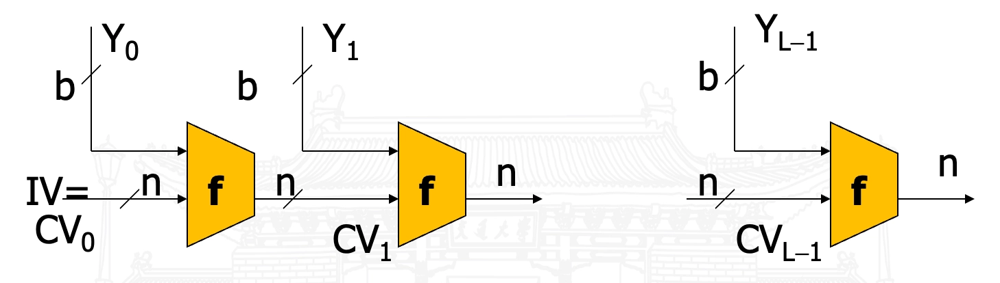

	- 其中：
		- $IV$：初值
		- $CV_i$：链接变量
		- $Y_i$：第 $i$ 个输入分组
		- $f$：压缩函数
		- $L$：输入分组数
		- $n$：杂凑输出长度
		- $b$：输入分组长度
		- 最后一组不足 $b$ 比特则填充，最后分组通常包括杂凑输入的总长度
	- 迭代：
		- 设 $M=(Y_0, \cdots, Y_L)$，则 $CV_0=IV=$ 初始 $n$ 比特值

			$$
			\begin{cases} CV_i = f(CV_{i-1},Y_{i-1}),& 1\leq i\leq L\\ H(M) = CV_L \end{cases}
			$$

	- 安全性：如果压缩函数是抗碰撞的，则 $H$ 是抗碰撞的。
- 海绵结构 (Sponge Construction)
	- 海绵结构是一种用于构建哈希函数和伪随机数生成器的设计模式。它通过反复吸收输入数据并挤压输出数据来实现信息的混合和压缩。
	- 主要组成部分：
		- 状态（State）：海绵结构的核心，包含吸收和挤压过程中的中间数据。
		- 吸收（Absorb）：将输入数据分块并与状态进行混合的过程。
		- 挤压（Squeeze）：从状态中提取输出数据的过程。
	- 海绵结构的工作原理：
		1. 初始化状态为零。
		2. 吸收阶段：将输入数据分块，每个分块与状态进行异或操作，然后通过一个固定的转换函数更新状态。
		3. 挤压阶段：从状态中提取输出数据，直到达到所需的输出长度。

## MD5
### 概述

- MD: Message Digest（报文摘要）
- Rivest 设计（RSA 中的 R）
- 符合 Merkle-Damgård 结构
- 输入：任意长度报文
- 输出：128 比特的摘要
- 分组长度：512 比特

### MD5 算法描述
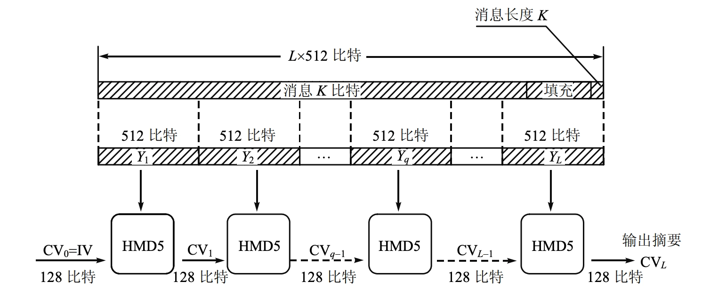

1. 添加填充位（一个 $1$ 和若干个 $0$）
	- 在消息的最后添加适当的填充位使得数据位的长度满足 $length \equiv 448 \bmod 512$。
		- 需要注意：如果报文是 $448$ 比特，则填充 $512$ 比特形成 $960$ 比特的报文。填充比特首位为 $1$，其余位全 $0$。
	- 填充完后，信息的长度就为 $k \times 512+448 \mathrm{~bit}$
2. 添加长度
	- 原始消息长度（二进制位的个数）用 $64$ 位表示。如果长度超过 $2^{64}$ 位，则仅取最低 $64$ 位，即 $\bmod 2^{64}$。
	- 到此为止，我们已经得到一个 $512$ 位的整倍数长度的新的消息。
		- 可以表示为 $L$ 个 $512$ 位的数据块：$Y_0,Y_1,\cdots,Y_{L−1}$。
		- 其长度为 $L\times 512 \mathrm{~bit}$。
		- 令 $N=L\times 16$，则长度为 $N$ 个 $32$ 位的字。
		- 令 $X[0,\cdots,N-1]$ 表示以**字**为单位的消息表示。
3. 初始化 MD 缓存
	- 使用一个 $128$ 比特缓存存放杂凑的中间和最后结果。缓存表示为 $4$ 个 $32$ 比特的缓存器 $(A,B,C,D)$
	- 初始化值（16 进制表示）：

		$$
		\begin{aligned} A &= \mathtt{67452301} \quad B = \mathtt{EFCDAB89} \\ C &= \mathtt{98BADCFE} \quad D = \mathtt{10325476} \end{aligned}
		$$

	- 初始化格式：小数在前的格式存储，即字的低位字节放在高地址字节上，像 32 位的比特串：

		$$
		\begin{aligned} A &: \mathtt{01~23~45~67} \quad B : \mathtt{89~AB~CD~EF} \\ C &: \mathtt{FE~DC~BA~98} \quad D : \mathtt{76~54~32~10} \end{aligned}
		$$

4. 处理 $512$ 比特（$16$ 个字）报文分组，每个分组处理包括 4 个循环，每个循环 16 步，共 $L$ 个分组。
	- 核心是一个包含 4 个循环的压缩函数 $g_i$。
		- 4 个循环结构相似，但每次使用的原始逻辑函数不同，分别记为 $F,G,H,I$。
	- 输入：
		- 当前处理的 $512$ 比特分组 $(Y_q)$
		- $128$ 比特缓存值 $(A,B,C,D)$（即上一次迭代的输出 $CV_q$）
	- 循环：
		- 使用表 $T[1, \cdots, 64]$ 的 $1/4$，该表由正弦函数给出，即 $T[i]=2^{32}×|sin⁡(𝑖)|$ 的整数部分。
		- $T$ 表提供了随机化的 $32$ 位模板，消除了在输入数据中的任何规律性的特征。
	- 输出：
		- 第 $4$ 次循环输出加到第 $1$ 次循环的输入上产生 $CV_{(q+1)}$。
		- 相加是缓存中 $4$ 个字分别与 $CV_q$ 中对应的 $4$ 个字以模 $2^{32}$ 相加。
5. 输出
	- 所有 $L$ 个 $512$ 比特的分组处理完成后，第 $L$ 个阶段的输出作为报文的 $128$ 比特摘要。

- 总结 MD5 操作如下：

	$$
	\begin{aligned} &CV_0 = IV \\ &CV_{(q+1)} = SUM_{32} (CV_q, RF_I [Y_q, RF_H [Y_q, RF_G [Y_q, RF_F [Y_q, CV_q]]]] ) \\ &MD5 = CV_L \end{aligned}
	$$

	- 其中
		- $SUM_{32}$：对输入对中的每个字执行模 $2^{32}$ 加
		- $IV$：缓存 $ABCD$ 的初值，第 3 步定义
		- $Y_q$：第 $q$ 个长度为 $512$ 比特的报文分组
		- $L$：报文的分组数
		- $CV_q$：处理第 $q$ 个报文分组时的连续变量
		- $RF_x$：使用原始逻辑函数 $x$ 的循环函数
		- $MD5$：最终的报文摘要

### 单个 512-bit 分组的 MD5 处理过程


### MD5 的压缩函数
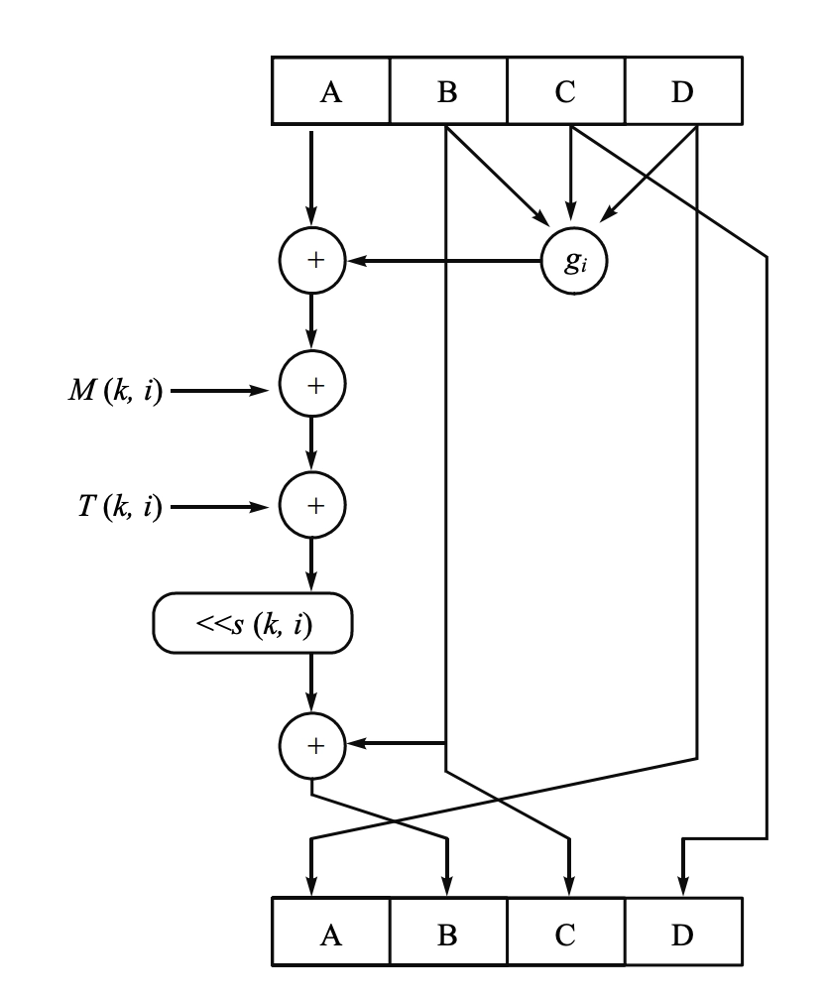

- $f$ 由 4 个循环组成，每个循环包括 16 步操作，每一步的基本形式如下：

	$$
	\begin{aligned} &A \leftarrow D \\ &B \leftarrow B + ((A + g_i(B, C, D) + M(k,i) + T(k,i)) \lll s(k,i)) \\ &C \leftarrow B \\ &D \leftarrow C \\ \end{aligned}
	$$

- 其中：
	- $A,B,C,D$：缓存中的 4 个字，在每一步有指明的顺序
	- $i$：当前循环编号，$i=1,\cdots,4$
	- $k$：当前步骤编号，$k=1,\cdots,16$
	- $g_i$：第 $i$ 轮的逻辑函数，原始函数 $F,G,H,I$ 中的一个

		$$
		\begin{aligned} g_1 &= F(B,C,D) = (B\land C)\lor(\lnot B\land D)\\ g_2 &= G(B,C,D) = (B\land D)\lor(C\land\lnot D)\\ g_3 &= H(B,C,D) = B\oplus C\oplus D\\ g_4 &= I(B,C,D) = C\oplus\bigl(B\lor\lnot D\bigr) \end{aligned}
		$$

	- $M(k,i)$：对应于当前分组按字划分的 $X[1,\cdots,16]$ 中的某一个 32 比特字

		$$
		\begin{aligned} M(k,1) &= X[k] \\ M(k,2) &= X[(1+5(k-1)) \bmod16] \\ M(k,3) &= X[(5+3(k-1)) \bmod16] \\ M(k,4) &= X[(7(k-1)) \bmod16] \end{aligned}
		$$

	- $T(k,i)$：矩阵 $T$ 中的常数
		- $T[k] = \lfloor 2^{32} \times |\sin(k+16(i-1))| \rfloor$
	- $\lll s(k,i)$：32 比特的字循环左移 $s(k,i)$ 位
		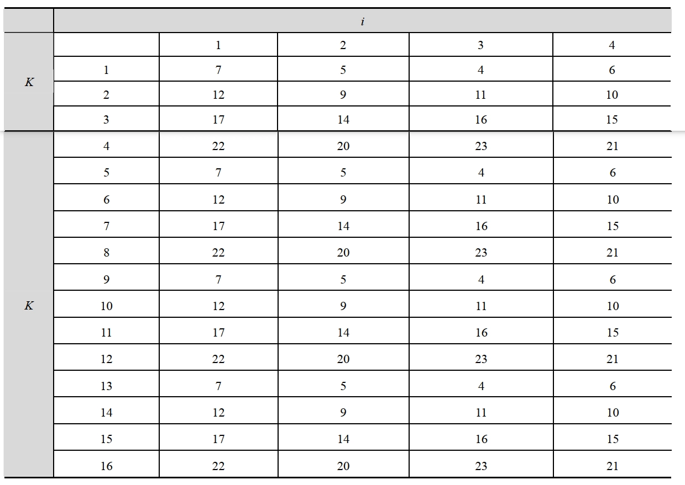

	- $+$：在 $\bmod 2^{32}$ 下进行的加法

???+ info "MD5 的处理过程"

	```plaintext
	# Round 1
	A = FF(A, B, C, D, X[0], 7, 0xd76aa478)
	B = FF(B, A, C, D, X[1], 12, 0xe8c7b756)
	C = FF(C, B, A, D, X[2], 17, 0x242070db)
	D = FF(D, C, B, A, X[3], 22, 0xc1bdceee)
	A = FF(A, B, C, D, X[4], 7, 0xf57c0faf)
	B = FF(B, A, C, D, X[5], 12, 0x4787c62a)
	C = FF(C, B, A, D, X[6], 17, 0xa8304613)
	D = FF(D, C, B, A, X[7], 22, 0xfd469501)
	A = FF(A, B, C, D, X[8], 7, 0x698098d8)
	B = FF(B, A, C, D, X[9], 12, 0x8b44f7af)
	C = FF(C, B, A, D, X[10], 17, 0xffff5bb1)
	D = FF(D, C, B, A, X[11], 22, 0x895cd7be)
	A = FF(A, B, C, D, X[12], 7, 0x6b901122)
	B = FF(B, A, C, D, X[13], 12, 0xfd987193)
	C = FF(C, B, A, D, X[14], 17, 0xa679438e)
	D = FF(D, C, B, A, X[15], 22, 0x49b40821)

	# Round 2
	A = GG(A, B, C, D, X[1], 5, 0xf61e2562)
	B = GG(B, A, C, D, X[6], 9, 0xc040b340)
	C = GG(C, B, A, D, X[11], 14, 0x265e5a51)
	D = GG(D, C, B, A, X[0], 20, 0xe9b6c7aa)
	A = GG(A, B, C, D, X[5], 5, 0xd62f105d)
	B = GG(B, A, C, D, X[10], 9, 0x02441453)
	C = GG(C, B, A, D, X[15], 14, 0xd8a1e681)
	D = GG(D, C, B, A, X[4], 20, 0xe7d3fbc8)
	A = GG(A, B, C, D, X[9], 5, 0x21e1cde6)
	B = GG(B, A, C, D, X[14], 9, 0xc33707d6)
	C = GG(C, B, A, D, X[3], 14, 0xf4d50d87)
	D = GG(D, C, B, A, X[8], 20, 0x455a14ed)
	A = GG(A, B, C, D, X[13], 5, 0xa9e3e905)
	B = GG(B, A, C, D, X[2], 9, 0xfcefa3f8)
	C = GG(C, B, A, D, X[7], 14, 0x676f02d9)
	D = GG(D, C, B, A, X[12], 20, 0x8d2a4c8a)

	# Round 3
	A = HH(A, B, C, D, X[5], 4, 0xfffa3942)
	B = HH(B, A, C, D, X[8], 11, 0x8771f681)
	C = HH(C, B, A, D, X[11], 16, 0x6d9d6122)
	D = HH(D, C, B, A, X[14], 23, 0xfde5380c)
	A = HH(A, B, C, D, X[1], 4, 0xa4beea44)
	B = HH(B, A, C, D, X[4], 11, 0x4bdecfa9)
	C = HH(C, B, A, D, X[7], 16, 0xf6bb4b60)
	D = HH(D, C, B, A, X[10], 23, 0xbebfbc70)
	A = HH(A, B, C, D, X[13], 4, 0x289b7ec6)
	B = HH(B, A, C, D, X[0], 11, 0xeaa127fa)
	C = HH(C, B, A, D, X[3], 16, 0xd4ef3085)
	D = HH(D, C, B, A, X[6], 23, 0x04881d05)
	A = HH(A, B, C, D, X[9], 4, 0xd9d4d039)
	B = HH(B, A, C, D, X[12], 11, 0xe6db99e5)
	C = HH(C, B, A, D, X[15], 16, 0x1fa27cf8)
	D = HH(D, C, B, A, X[2], 23, 0x289b7ec6)

	# Round 4
	A = II(A, B, C, D, X[0], 6, 0xf4292244)
	B = II(B, A, C, D, X[7], 10, 0x432aff97)
	C = II(C, B, A, D, X[14], 15, 0xab9423a7)
	D = II(D, C, B, A, X[5], 21, 0xfc93a039)
	A = II(A, B, C, D, X[12], 6, 0x655b59c3)
	B = II(B, A, C, D, X[3], 10, 0x8f0ccc92)
	C = II(C, B, A, D, X[10], 15, 0xffeff47d)
	D = II(D, C, B, A, X[1], 21, 0x85845dd1)
	A = II(A, B, C, D, X[8], 6, 0x6fa87e4f)
	B = II(B, A, C, D, X[15], 10, 0xfe2ce6e0)
	C = II(C, B, A, D, X[6], 15, 0xa3014314)
	D = II(D, C, B, A, X[13], 21, 0x4e0811a1)
	A = II(A, B, C, D, X[4], 6, 0xf7537e82)
	B = II(B, A, C, D, X[11], 10, 0xbd3af235)
	C = II(C, B, A, D, X[2], 15, 0x2ad7d2bb)
	D = II(D, C, B, A, X[9], 21, 0xeb86d391)
	```

### MD4 VS MD5

- MD4（1990 年 10 月作为 RFC1320 发表）by Ron Rivest at MIT（MD5 的前身）
- MD4 的设计目标：
	- 安全性：寻找两个具有相同消息摘要的消息计算不可行
	- 速度：32 位体系结构下计算速度快
	- 简明与紧凑：易于编程
	- 有利于小数在前的结构（Intel 80xxx, Pentium）
- MD4 与 MD5 的区别：
	- MD4 用 3 轮，每轮 16 步，MD5 用 4 轮，每轮 16 步
	- MD4 中第一轮没有常量加；MD5 中 64 步每一步用了一个不同的常量 $T[i]$
	- MD5 用了四个基本逻辑函数，每轮一个；MD4 用了三个
	- MD5 每轮加上前一步的结果；MD4 没有（雪崩效应）

### MD5 的应用

- MD5 的典型应用是对一段明文消息（message）生成消息摘要（message-digest），防止消息被篡改
- MD5 广泛应用于数字签名中
- 广泛应用于 unix、Linux 等操作系统用于保护用户口令

### MD5 口令的逆向简析

1. 思路（一）
	- MD5 对于 1 个 block 数据（512bit）进行 64 步运算。然而在第 61 步之后，即 II(A, B, C, D, M4, 6, 0xf7537e82) 之后，$A$ 的数据不再改变，因此可以首先判断 $A$ 与目标是否一致，如果不一致接下来的运算就是没有必要的，从而减少 3 步不必要的运算，提高效率 5%。
2. 思路（二）
	- 观察 F，G 函数，将

		$$
		\begin{aligned} F(X,Y,Z) &= (X\land Y)\lor ((\neg X)\land Z) \\ G(X,Y,Z) &= (X\land Z)\lor (Y\land(\neg Z)) \end{aligned}
		$$

		改写为：

		$$
		\begin{aligned} F(X,Y,Z) &= Z \oplus (X \land (Y \oplus Z)) \\ G(X,Y,Z) &= Y \oplus (Z \land (X \oplus Y)) \end{aligned}
		$$

		在同样结果的前提下减少一条指令，提高性能.

	- 使用 BFI_INT 指令：对于 $F$ 函数而言，$(X\land Y)\lor ((\neg X)\land Z)$ 在新版驱动下能被直接替换为 $bitselct(Z, Y, X)$，可以将其编译成 1 条指令。$G$ 函数类似，可用 $bitselct(Y, X, Z)$ 替代。
3. 思路（三）
	- 在已知口令值 MD5 的 A，B，C，D 的情况下，可以逆推至 50 步，此时状态寄存器 A，B，C，D 应该与该口令正向计算至 49 步后的状态寄存器一致；
	- 如果不一致，则该口令接下去的计算一定不会得到想要的 MD5 值，可以省略。
	- 例如口令 1 算至 49 步后，与逆向哈希不一致，那么口令就不是我们寻找的口令，省略接下去的步骤

## SHA-1
### 概述

- 输入：长度小于 $2^{64}$ 位的任意长度报文；
- 输出：160 位消息摘要；
- 分组长度：512 位；
- SHA 由美国国家标准技术研究所 NIST 开发，作为联邦信息处理标准于 1993 年发表（FIPS PUB 180），1995 年修订，作为 SHA-1(FIPS PUB 180-1)，SHA-1 基于 MD4 设计。

### SHA-1 算法描述
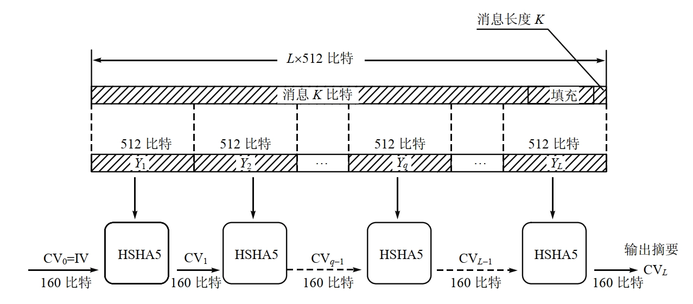

1. 添加填充位（一个 $1$ 和若干个 $0$）
	- 在消息的最后添加适当的填充位使得数据位的长度满足 $length \equiv 448 \bmod 512$。
		- 需要注意：如果报文是 $448$ 比特，则填充 $512$ 比特形成 $960$ 比特的报文。填充比特首位为 $1$，其余位全 $0$。
	- 填充完后，信息的长度就为 $k \times 512+448 \mathrm{~bit}$
2. 添加长度
	- 原始消息长度（二进制位的个数）用 $64$ 位表示
	- 到此为止，我们已经得到一个 $512$ 位的整倍数长度的新的消息。
		- 可以表示为 $L$ 个 $512$ 位的数据块：$Y_0,Y_1,\cdots,Y_{L−1}$。
		- 其长度为 $L\times 512 \mathrm{~bit}$。
		- 令 $N=L\times 16$，则长度为 $N$ 个 $32$ 位的字。
		- 令 $X[0,\cdots,N-1]$ 表示以**字**为单位的消息表示。
3. 初始化 MD 缓存
	- 使用一个 $160$ 位 MD 缓冲区用以保存中间和最终哈希函数的结果。它可以表示为 $5$ 个 $32$ 位的寄存器 $(A,B,C,D,E)$。
	- 初始化为：

		$$
		\begin{aligned} A &= \mathtt{67452301} \quad B = \mathtt{EFCDAB89} \\ C &= \mathtt{98BADCFE} \quad D = \mathtt{10325476} \\ E &= \mathtt{C3D2E1F0} \end{aligned}
		$$

	- 前四个与 MD5 相同，但存储为高端字节存储方式，即字的低位字节放在低地址字节上：

		$$
		\begin{aligned} A &: \mathtt{67~45~23~01} \quad B : \mathtt{EF~CD~AB~89} \\ C &: \mathtt{98~BA~DC~FE} \quad D : \mathtt{10~32~54~76} \\ E &: \mathtt{C3~D2~E1~F0} \end{aligned}
		$$

4. 处理 $512$ 比特（$16$ 个字）报文分组，每个分组处理包括 4 个循环，每个循环 20 步，共 $L$ 个分组。
	- 核心是一个包含 4 个循环的压缩函数 $g_i$。
		- 四个基本逻辑函数：$g_1,g_2,g_3,g_4$
	- 输入：
		- 当前处理的 $512$ 比特分组 $(Y_q)$
		- $160$ 比特缓存值 $(A,B,C,D,E)$（即上一次迭代的输出 $CV_q$）
	- 循环：
		- 每次循环分别使用一个额外的常数 $K_i$，即 $[2^{30}\times \sqrt{2}]$，$[20\times\sqrt{3}]$，$[20\times\sqrt{5}]$，$[20\times\sqrt{10}]$
	- 输出：
		- 第 $4$ 次循环输出加到第 $1$ 次循环的输入上产生 $CV_{(q+1)}$。
		- 相加是缓存中 $5$ 个字分别与 $CV_q$ 中对应的 $5$ 个字以模 $2^{32}$ 相加。
5. 输出。
	- 所有 $L$ 个 $512$ 比特的分组处理完成后，第 $L$ 个阶段的输出作为报文的 $160$ 比特摘要。

- 总结 SHA-1 操作如下：

	$$
	\begin{aligned} &CV_0=IV \\ &CV_{q+1}= SUM_{32}(CV_q, ABCDE_q) \\ &SHA-1=CV_L \\ \end{aligned}
	$$

	- 其中
		- $IV$：缓存 $ABCDE$ 的初值，第 3 步定义
		- $ABCDE_q$：第 $q$ 个报文分组最后一次循环输出
		- $L$：报文的分组数
		- $SUM_{32}$：对输入对中的每个字执行模 $2^{32}$ 加
		- $SHA-1$：最终的报文摘要

### 单个 512-bit 分组的 SHA-1 处理过程
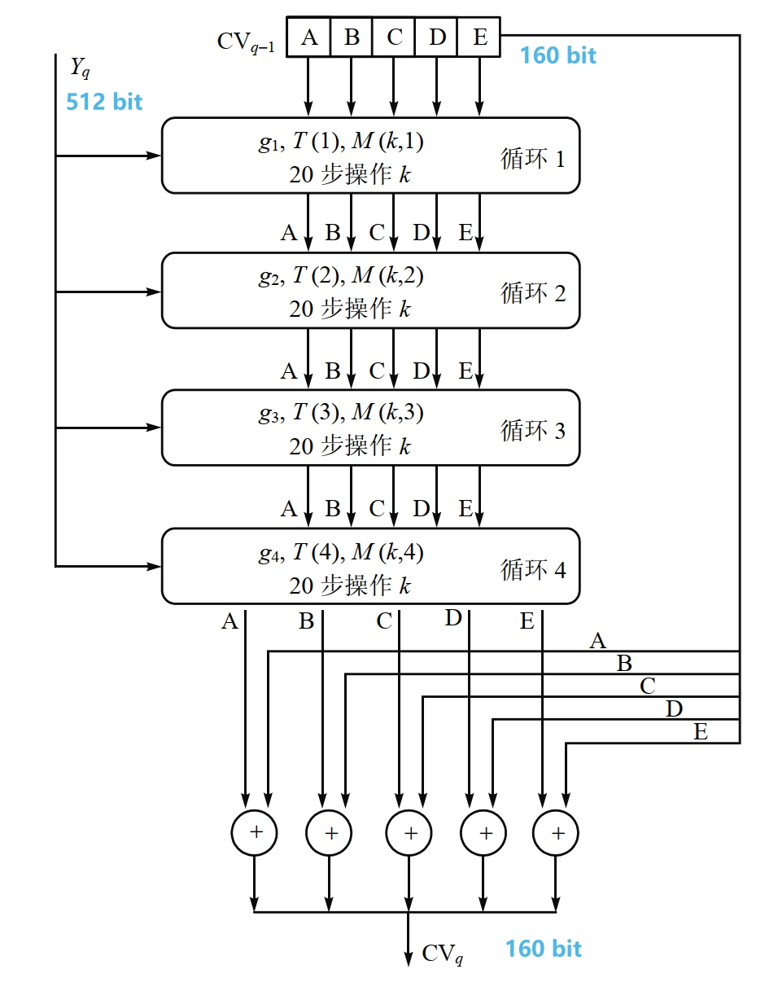

### SHA-1 的压缩函数


- $f$ 由 4 个循环组成，每个循环包括 20 步操作，每一步的基本形式如下：

	$$
	\begin{aligned} &A\leftarrow E + g_i(B, C, D) + (A \lll 5) + M(k, i) + K_i \\ &B\leftarrow A \\ &C\leftarrow B \lll 30 \\ &D\leftarrow C \\ &E\leftarrow D \\ \end{aligned}
	$$

- 其中
	- $A, B, C, D, E$：缓存中的 5 个字
	- $i$：当前循环编号，$1 \leq i \leq 4$
	- $k$：当前步骤编号，$1 \leq k \leq 20$
	- $g_i(B, C, D)$：第 $i$ 轮的原始逻辑函数

		$$
		\begin{aligned} g_1 (B, C, D) &= (B \land C) \lor (\lnot B \land D) \\ g_2 (B, C, D) &= B \oplus C \oplus D \\ g_3 (B, C, D) &= (B \land C) \lor (B \land D) \lor (C \land D) \\ g_4 (B, C, D) &= B \oplus C \oplus D \\ \end{aligned}
		$$

	- $\lll x$：$32$ 比特常数循环左移 $x$ 位
	- $K_i$（图中的 $T(i)$）：一个额外的常数，前面有定义

		$$
		\begin{aligned} K_1 &= [2^{30}\times \sqrt{2}] = \mathtt{5A827999} \\ K_2 &= [20\times\sqrt{3}] = \mathtt{6ED9EBA1} \\ K_3 &= [20\times\sqrt{5}] = \mathtt{8F1BBCDC} \\ K_4 &= [20\times\sqrt{10}] = \mathtt{CA62C1D6} \\ \end{aligned}
		$$

	- $W(j)$（图中的 $M(k, i)$，$j = 20(i-1) + (k-1)$）：当前 $512$ 比特输入报文分组导出的一个 $32$ 比特字

		$$
		W(j) = \begin{cases} X[j], & 0 \leq j \leq 15 \\ W(j-16) \oplus W(j-14) \oplus W(j-8) \oplus W(j-3) \lll 1, & 16 \leq j \leq 79 \end{cases}
		$$

		- 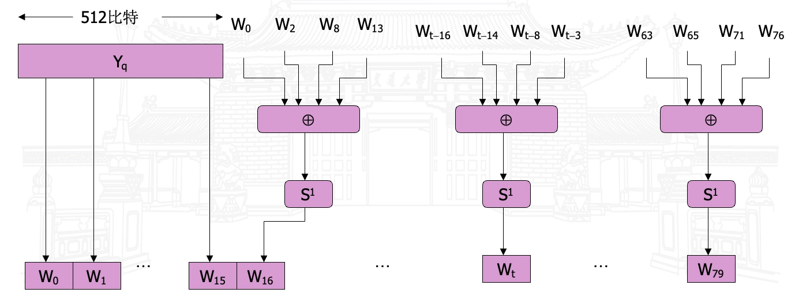
	- $+$：在 $\bmod 2^{32}$ 下进行的加法

### MD4 VS MD5 VS SHA-1
|  | MD4 | MD5 | SHA-1 |
|---|-----|-----|-------|
| Hash 值 | 128 bit | 128 bit | 160 bit |
| 分组处理长度 | 512 bit | 512 bit | 512 bit |
| 基本字长 | 32 bit | 32 bit | 32 bit |
| 步数 | 48(3*16) | 64(4*16) | 80(4*20) |
| 消息长 | $\leq 2^{64}$ bit | No limit | $\leq 2^{64}$ bit |
| 基本逻辑函数 | 3 | 4 | 3 |
| 常数个数 | 3 | 64 | 4 |
| 速度 | 1 | 1/7 | 3/4 |

- SHA-1 = MD4 ＋ 扩展变换 ＋ 外加一轮 ＋ 更好的雪崩；
- MD5 = MD4 ＋ 改进的比特杂凑 ＋ 外加一轮 ＋ 更好的雪崩。

## SHA-2
### 概述

- SHA-1 VS SHA-2 VS SM3 VS SHA-3

	|参数|SHA-1|SHA-2-256|SHA-2-384|SHA-2-512|SM3|SHA-3-224|SHA-3-256|SHA-3-384|SHA-3-512|
	|----|----|----|----|----|----|----|----|----|----|
	|消息摘要长度|160 位|256 位|384 位|512 位|256 位|224 位|256 位|384 位|512 位|
	|消息最大长度|<$2^{64}$|<$2^{64}$|<$2^{128}$|<$2^{128}$|<$2^{64}$|无限制|无限制|无限制|无限制|
	|块大小|512 位|512 位|1024 位|1024 位|512 位|1152 位|1088 位|832 位|576 位|
	|字长|32 位|32 位|64 位|64 位|32 位| | | | |
	|步骤数|80 步|64 步|80 步|80 步|64 步|24 步|24 步|24 步|24 步|
	|安全强度|80 位|128 位|192 位|256 位|128 位|112 位|128 位|192 位|256 位|

- SHA-2 的应用
	1. 主流安全协议/工具：TLS/SSL（网络传输加密）、PGP（邮件加密）、SSH（远程登录安全）、S/MIME（邮件签名）、Bitcoin（区块链哈希验证）、IPsec（网络层加密）。
	2. 政府与商业规范：
		- 美国政府要求敏感非机密信息需使用 SHA 系列，早期允许 SHA-1，后因安全问题调整；
		- NIST 明确要求：2010 年后，联邦机构需停止使用 SHA-1 处理“需抗碰撞”的应用，全面改用 SHA-2 家族。

### SHA-2-512

- 最大长度小于 $2^{128}$ 位，并生成 $512$ 位消息摘要作为输出。
- 哈希函数操作可以分为两个阶段：
	1. 预处理
	2. 哈希计算

#### SHA-512 算法描述
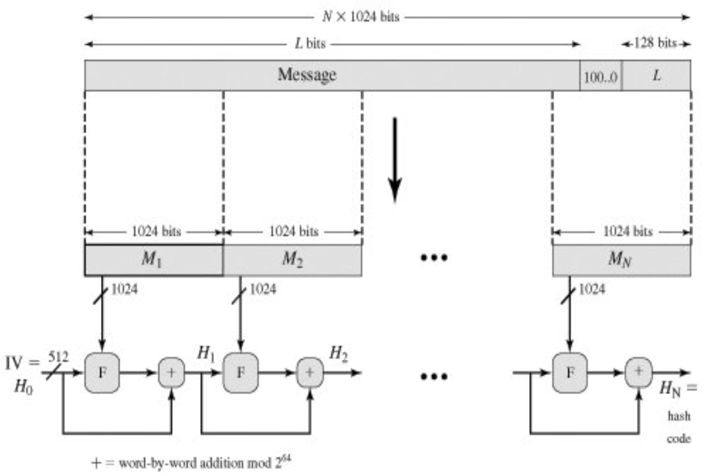

1. 填充比特（Append padding bits）
2. 添加长度（Append length）
3. 初始化哈希缓冲区（Initialize hash buffer）

	$$
	\begin{aligned} &a = \mathtt{6A09E667F3BCC908} \quad b = \mathtt{BB67AE8584CAA73B} \\ &c = \mathtt{3C6EF372FE94F82B} \quad d = \mathtt{A54FF53A5F1D36F1} \\ &e = \mathtt{510E527FADE682D1} \quad f = \mathtt{9B05688C2B3E6C1F} \\ &g = \mathtt{1F83D9ABFB41BD6B} \quad h = \mathtt{5BE0CD19137E2179} \end{aligned}
	$$

4. 分块处理（Process message in 1024-bit (16-64bit word) blocks）
	- 处理每个 $1024$ 比特（$16$ 个 $64$ 比特字）报文分组，每个分组处理包括 $80$ 步，共 $N$ 个分组。
5. 输出结果（Output）

- 总结 SHA-512 操作如下：

	$$
	\begin{aligned} &H_0 = IV \\ &H_i = SUM_{64}(H_{i-1}, ABCDEFG_i) \\ &MD = H_N \\ \end{aligned}
	$$

	- 其中：
		- $IV$：缓存 $ABCDEFGH$ 的初始值，定义在步骤 3 中。
		- $ABCDEFGH_i$：第 $i$ 个消息块的最后一轮处理的输出。
		- $N$：消息中的块数（包括填充和长度字段）。
		- $SUM_{64}$：对该对输入的每个字分别执行模 $2^{64}$ 加法。
		- $MD$：最终的消息摘要。

#### 单个 1024-bit 分组的 SHA-512 处理过程
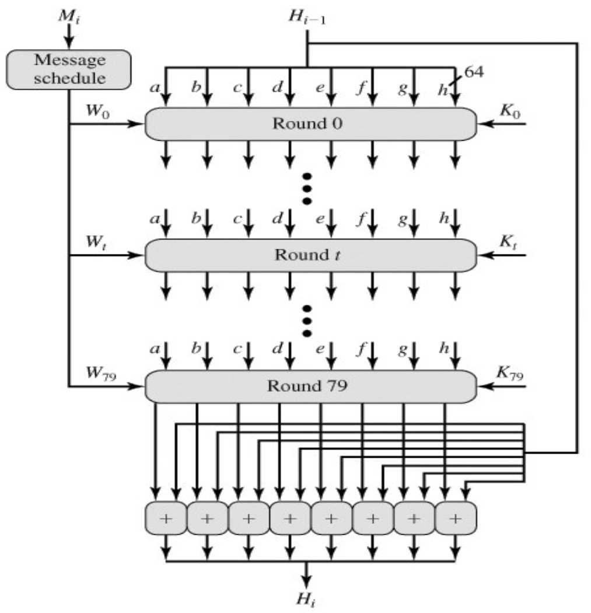

#### SHA-512 的压缩函数

- $f$ 由 80 步操作组成，每一步的基本形式如下：
	

	$$
	\begin{aligned} &T_1 = h + \mathrm{Ch}(e,f,g) + (\sum_{1}^{512} e) + W_i + K_i \\ &T_2 = (\sum_{0}^{512} a) + \mathrm{Maj}(a,b,c) \\ &a \leftarrow T_1 + T_2 \\ &b \leftarrow a \\ &c \leftarrow b \\ &d \leftarrow c \\ &e \leftarrow d + T_1 \\ &f \leftarrow e \\ &g \leftarrow f \\ &h \leftarrow g \\ \end{aligned}
	$$

- 其中：
	- $a,b,c,d,e,f,g,h$：缓存中的 8 个字
	- $i$：步骤编号，$0 \leq i \leq 79$
	- $\mathrm{Ch}(e,f,g) = (e \land f)\oplus(\lnot e \land g)$，如果 $e$ 为真则选择 $f$，否则选择 $g$
	- $\mathrm{Maj}(a,b,c) = (a \land b)\oplus(a \land c)\oplus(b \land c)$，选择多数值
	- $\sum_{0}^{512}$ 和 $\sum_{1}^{512}$：定义如下

		$$
		\begin{aligned} &\sum_{0}^{512}(x) = (x \ggg 28) \oplus (x \ggg 34) \oplus (x \ggg 39) \\ &\sum_{1}^{512}(x) = (x \ggg 14) \oplus (x \ggg 18) \oplus (x \ggg 41) \\ \end{aligned}
		$$

		- 其中：
			- $x \ggg n$ 表示 $x$ 循环右移 $n$ 位
			- $x \gg n$ 表示 $x$ 逻辑右移 $n$ 位
	- $W_i$：当前 $1024$ 比特输入报文分组导出的一个 $64$ 比特字。
		- $W_i$ 的前 16 个字直接取自当前分组中的 16 个字，余下的字定义为:

			$$
			W_i = \sigma_1^{512}(W_{i-2}) + W_{i-7} + \sigma_0^{512}(W_{i-15}) + W_{i-16}, ~16 < i \leq 79
			$$

		- 其中

			$$
			\begin{aligned} &\sigma_0(x)^{512} = (x \ggg 1) \oplus (x \ggg 8) \oplus (x \gg 7) \\ &\sigma_1(x)^{512} = (x \ggg 19) \oplus (x \ggg 61) \oplus (x \gg 6) \\ \end{aligned}
			$$

		- 
	- $K_i$：步骤 $i$ 的 $64$ 比特常数值
	- $+$：在 $\bmod 2^{64}$ 下进行的加法

### SHA-2-256

- SHA-256 与 SHA-512 类似，区别在于：
	- 使用 $32$ 比特字代替 $64$ 比特字
	- 使用不同的初始哈希值
	- 使用不同的常数值
	- 使用不同的位操作（循环移位和逻辑移位的位数不同）

		$$
		\begin{aligned} &\sum_{0}^{256}(x) = (x \ggg 2) \oplus (x \ggg 13) \oplus (x \ggg 22) \\ &\sum_{1}^{256}(x) = (x \>>g 6) \oplus (x \ggg 11) \oplus (x \ggg 25) \\ &\sigma_0(x)^{256} = (x \ggg 7) \oplus (x \ggg 18) \oplus (x \gg 3) \\ &\sigma_1(x)^{256} = (x \ggg 17) \oplus (x \ggg 19) \oplus (x \gg 10) \\ \end{aligned}
		$$

- 最大长度小于 $2^{64}$ 位，并生成 $256$ 位消息摘要作为输出。

### SHA-2-384

- SHA-384 与 SHA-512 类似，区别在于：
	- 使用不同的初始哈希值
	- 最终输出时只取前 $384$ 位作为消息摘要
- 最大长度小于 $2^{128}$ 位，并生成 $384$ 位消息摘要作为输出。

## SM3
### 概述

- 中国国家密码管理局于 2010 年发布的哈希函数标准，适用于数字签名等密码应用。
- 输入：长度小于 $2^{64}$ 位的任意长度报文
- 输出：256 位消息摘要
- 分组长度：512 位

### SM3 算法描述

1. 填充与添加长度（Append padding bits and length）
	

2. 消息扩展（Message extension）
	- 将每个 $512$ 比特的消息分组扩展为 $132$ 个 $32$ 比特的字：$W_0, W_1, \cdots, W_{67}$ 和 $W_0', W_1', \cdots, W_{63}'$
	- 定义为:

		$$
		\begin{aligned} &W_j = \begin{cases} X_j, &~0 \leq j \leq 15 \\ P_1(W_{j-16} \oplus W_{j-9} \oplus (W_{j-3} \lll 15)) \oplus (W_{j-13} \lll 7) \oplus W_{j-6}, &~16 \leq j \leq 67 \\ \end{cases} \\ &W_j' = W_j \oplus W_{j+4}, ~0 \leq j \leq 63 \\ \end{aligned}
		$$

	- 其中：$P_1(X) = X \oplus (X \ggg 15) \oplus (X \ggg 23)$
3. 初始化哈希缓冲区（Initialize hash buffer）
4. 迭代计算（Iterative calculation）
	- 对消息包 $B^{(0)},B^{(1)},\cdots,B^{(K)}$ 进行迭代，迭代函数为：

		$$
		V_{(i+1)} = CF(V_i, B^{(i)}), ~0 \leq i \leq K
		$$

	- $CF$ 是压缩函数。

		$$
		\begin{aligned} &A \leftarrow TT1 \\ &B \leftarrow A \\ &C \leftarrow B \lll 9 \\ &D \leftarrow C \\ &E \leftarrow P_0 (TT2) \\ &F \leftarrow E \\ &G \leftarrow F \lll 19 \\ &H \leftarrow G \\ \end{aligned}
		$$

		- 其中

			$$
			\begin{aligned} &FF_j(x,y,z)=\begin{cases} x \oplus y \oplus z, &0 \leq j \leq 15 \\ (x \land y) \lor (x \land z) \lor (y \land z), &16 \leq j \leq 63 \\ \end{cases} \\ &GG_j(x,y,z)=\begin{cases} x \oplus y \oplus z, &0 \leq j \leq 15 \\ (x \land y) \lor (\lnot x \land z), &16 \leq j \leq 63 \\ \end{cases} \\ &SS1(A, e, j) = ((A \lll 12) + e + (T_j \lll j)) \lll 7 \\ &SS2(A, e, j) = SS1(A, e, j) \oplus (A \lll 12) \\ &TT1 = (FF_j(A, B, C) + D + SS2(A, e, j) + W_j') \\ &TT2 = (GG_j(E, F, G) + H + SS1(A, e, j) + W_j) \\ \end{aligned}
			$$

5. 输出结果
	- 每次 512 位数据压缩操作后：

		$$
		V_{i+1} = V_i \oplus ABCDEFGH
		$$

		- 更新哈希值
		- 输入迭代函数，开始下一个数据包的轮次操作。
		- 计算最后一个数据包的结果，即哈希值。

- 单个 512-bit 分组的 SM3 处理过程
	

## SHA-3
### 海绵结构


- 吸收阶段（Absorbing phase）
	- $r$ 代表速率，消息填充后被分成 $r$ 比特分组，异或到内部置换的分组中，依次进行处理
	- $c$ 代表安全长度，$c=2d$，$d$ 为哈希长度
	- $b$ 代表总比特数，$b=r+c$
	- $f$ 代表内部置换函数，SHA-3 的内部置换函数为 Keccak-f[b]
	- 填充规则：$pad10^∗1$，即在消息后添加一个 $1$，然后添加若干个 $0$，最后再添加一个 $1$，使得填充后的消息长度为 $r$ 的整数倍。
	- 对于 SHA-3-256，$d=256$，$c=512$，$b=1600$，$r=1088$，$f$ 为 Keccak-f[1600]
- 挤压阶段（Squeezing phase）
	- 处理完所有 $r$ 比特分组后，对最终的状态，用同样的内部置换 $f$ 处理，提取哈希值。
		- 提取初始输出：从吸收阶段结束后的状态中，提取前 $r$ 比特作为初始输出数据。
		- 如果需要的输出长度 $d \leq r$ ，直接截取前 $d$ 比特作为结果。
		- 如果需要的输出长度 $d > r$ ，则：
			- 先提取前 $r$ 比特，加入输出结果；
			- 对当前状态应用置换函数 $f[b]$，更新状态；再次从更新后的状态中提取前 $r$ 比特，加入输出结果；
			- 重复上述过程，直到输出总长度超过 $d$ 比特，然后截取前 $d$ 比特作为最终结果。

### SHA-3 的 6 个实例

- 固定哈希长度的 SHA3-224/256/384/512
- 可变哈希长度的 SHAKE256 和 SHAKE512

| 算法 | 哈希长度 $d$ | 安全长度 $c$ | 速率 $r$ |
|------|-------------|--------------|---------|
| SHA3-224 | 224 bit | 448 bit | 1152 bit |
| SHA3-256 | 256 bit | 512 bit | 1088 bit |
| SHA3-384 | 384 bit | 768 bit | 768 bit |
| SHA3-512 | 512 bit | 1024 bit | 576 bit |
| SHAKE256 | 可变 | 512 bit | 1088 bit |
| SHAKE512 | 可变 | 1024 bit | 576 bit |

### Keccak-f[1600] 置换函数


- 分组长度为 $1600$ 比特的迭代置换函数，共迭代 $24$ 轮
- $1600$ 比特的分组状态 $A$，组织成 $5\times  5\times 64$ 的 $3$ 维数组，每个比特由 $A[x,y,z]$ 坐标表示，$0\leq x,y<5, 0\leq z<64$
- 每轮包括 $5$ 步： $R := \iota \circ \chi \circ  \pi \circ \rho \circ \theta$ ，其中，$\theta, \rho, \pi, \iota$ 是线性运算， $\chi$ 是唯一的非线性运算

- $\theta$：the mixing layer
	- 
	- 对任意坐标为[$x,y,z$] 的比特
		1. $\theta$ 首先分别计算出该比特左侧列 [$x-1,z$]
		和右后侧列 [$x+1,z-1$] 的整列异或值； 

		2. 然后将两个列异或值与原比特的值进行异或，
		从而更新当前比特的值。

	- 表达式描述

		$$
		\begin{aligned} &C[x,z]=\oplus_{y=0}^{4} A[x,y,z] \\ &D[x,z]=C[x-1,z]\oplus C[x+1,z-1] \\ &A[x,y,z]=A[x,y,z]\oplus D[x,z] \\ \end{aligned}
		$$

- $\rho$：the intra-slice bit transposition
	- 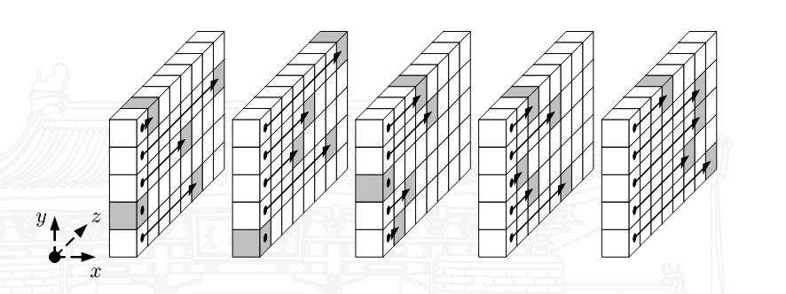
	- 在 lane 内部对 $64$ 个比特进行循环移位操作，循环移位的值由 lane 坐标 $R(x,y)$ 确定。

		$$
		A[x,y] = A[x,y] \lll R(x,y)
		$$

	- 其中，$R(x,y)$ 是预定义的循环移位幅度

		| x \ y | 0 | 1 | 2 | 3 | 4 |
		|-------|---|---|---|---|---|
		| 0	 | 0 |36 | 3 |41 |18 |
		| 1	 | 1 |44 |10 |45 | 2 |
		| 2	 |62 | 6 |43 |15 |61 |
		| 3	 |28 |55 |25 |21 |56 |
		| 4	 |27 |20 |39 | 8 |14 |

- $\pi$：the intra-slice bit transposition
	- 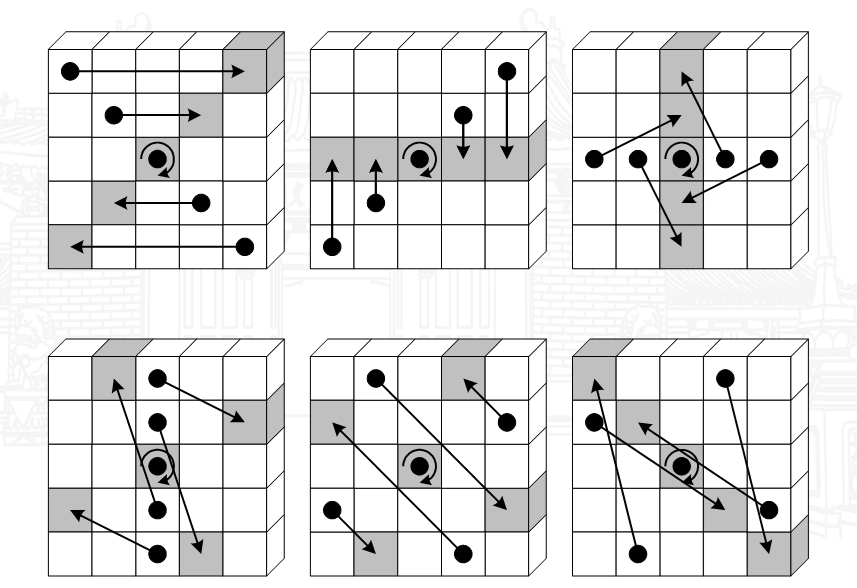
	- slice 内的 $25$ 个比特位置变换，所有 $64$ 个 slice 的置换运算相同

		$$
		A[y, (2x+3y)\bmod 5]=A[x,y]
		$$

- $\chi$：the nonlinear layer
	- 
	- 在 row 上的非线性运算
	- 可看作 5 比特的 S 盒

		$$
		A[x,y]=A[x,y]\oplus(A[x+1,y]\oplus1)\cdot A[x+2,y]
		$$

	- $\chi$ 的代数次数为 2，$\chi^{−1}$ 的代数次数为 3
- $\iota$ – round constant
	- 在每轮给坐标为 $[𝑥, 𝑦] = [0, 0]$ 的 lane 异或一个预先计算好的轮常量 $RC$

		$$
		A[0,0]=A[0,0]\oplus RC[i]
		$$

	- 轮常量 $RC$ 由一个 LFSR 函数生成
		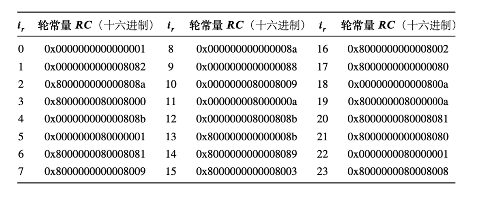

- 小结：内部状态 $A$，任意比特为 $A[x,y,z]$
	- $\theta$ step
		- $C[x,z]=\oplus_{y=0}^{4} A[x,y,z]$.
		- $D[x,z]=C[x-1,z]\oplus C[x+1,z-1]$.
		- $A[x,y,z]=A[x,y,z]\oplus D[x,z]$
	- $\rho$ step
		- $A[x,y]=A[x,y]\lll R[x,y]$
	- $\pi$ step
		- $A[y,(2x+3y)\bmod 5]=A[x,y]$
	- $\chi$ step
		- $A[x,y]=A[x,y]\oplus(A[x+1,y]\oplus1)\cdot A[x+2,y]$
	- $\iota$ step
		- $A[0,0]=A[0,0]\oplus RC[i]$