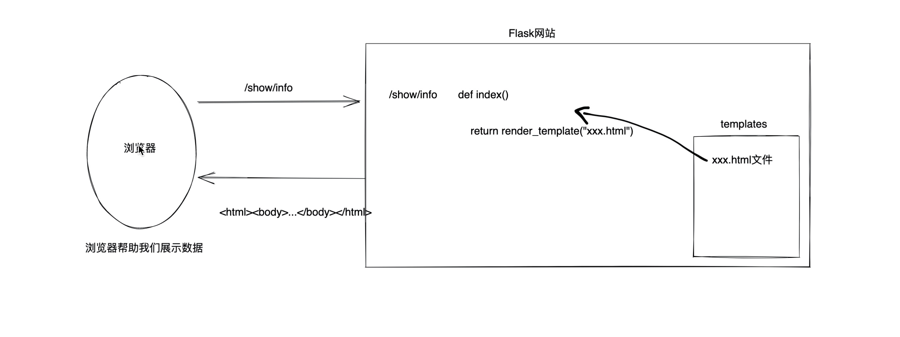

# Lab1 - HTML

- [Back to Course Home](index.md)

## 快速上手：基于 Flask Web 框架快速搭建

1. 安装 flask
	```bash
	pip install flask
	```

2. 创建应用文件

	创建一个名为 `app.py` 的文件，存放在 `flaskProject` 目录下，并输入以下代码：（文件名和目录名称可以任意取）
	```python
	from flask import Flask

	# 创建Flask应用实例
	app = Flask(__name__)

	# 定义路由和视图函数
	@app.route('/')
	def hello_world():
		return 'Hello, World!'

	# 添加一个主页，渲染一个HTML模板
	@app.route('/home') 
	def home():
		return render_template('home.html')

	# 运行应用
	if __name__ == '__main__':
		app.run(debug=True)
	```

3. 在项目主目下创建 `templates` 目录，再新建 `home.html` 文件
	```html
	<!DOCTYPE html>
	<html lang="en">
	<head>
		<meta charset="UTF-8">
		<meta name="viewport" content="width=device-width, initial-scale=1.0">
		<title>Home</title>
	</head>
	<body>
		<h1>Welcome to the Home Page!</h1>
	</body>
	</html>
	```

4. 执行 app.py
	```bash
	python app.py
	```

## HTML 基础
### 2.1 编码：charset（head）
```html
<meta charset="UTF-8">
```

### 2.2 页签：title（head）
```html
<head>
	<meta charset="UTF-8">
	<title>我的主页</title>
</head>
```

### 2.3 标题：h1~h6
```html
<!DOCTYPE html>
<html lang="en">
<head>
	<meta charset="UTF-8">
	<title>我的主页</title>
</head>
<body>
	<h1>1级标题</h1>
	<h2>2级标题</h2>
	<h3>3级标题</h3>
	<h4>4级标题</h4>
	<h5>5级标题</h5>
	<h6>6级标题</h6>
</body>
</html>
```

### 2.4 文本标签

#### 块级标签
`div`：一个人占一整行。
```html
<!DOCTYPE html>
<html lang="en">
<head>
	<meta charset="UTF-8">
	<title>我的主页</title>
</head>
<body>
	<div>上海交通大学</div>
	<div>计算机学院（网络空间安全学院）</div>
</body>
</html>
```

#### 行内标签/内联标签
`span`：自己多大占多少。
```html
<!DOCTYPE html>
<html lang="en">
<head>
	<meta charset="UTF-8">
	<title>我的主页</title>
</head>
<body>
	<span>上海交通大学</span>
	<span>计算机学院（网络空间安全学院）</span>
</body>
</html>
```

#### 其他

- 换行：`<br />`
- 空格：`&nbsp;`
- 水平线：`<hr />`
- 加粗：`<b>加粗</b>` 或 `<strong>加粗</strong>`
- 斜体：`<i>斜体</i>` 或 `<em>斜体</em>`
- 删除线：`<del>删除线</del>`
- 下划线：`<u>下划线</u>`
- 下标：`H<sub>2</sub>O`
- 上标：`x<sup>2</sup>`

### 2.5 超链接

```html
<!-- 跳转到其他网站 -->
<a href="http://www.sjtu.edu.cn">点击跳转</a>
<!-- 跳转到自己网站其他的地址 -->
<a href="http://127.0.0.1:5000/get/news">点击跳转</a>
<a href="/get/news">点击跳转</a>
```

- 注意：跳转到自己网站的其他地址(/get/news)，需要
	1. 在 `web.py` 中定义地址/get/news 的路径:
	```python
	@app.route("/get/news")
	def get_news():
		return render_template("get_news.html")
	```

	2. 在 `templates` 目录下创建 `get_news.html` 文件

- 在新的 Tab 页面打开链接：
	```html
	<!-- 当前页面打开 -->
	<a href="/get/news">点击跳转</a>

	<!-- 新的Tab页面打开 -->
	<a href="/get/news" target="_blank">点击跳转</a>
	```

### 2.6 图片

```html


<!-- 直接显示别人的图片地址（防盗链） -->

<!-- 显示自己项目中的图片 -->

```

- 显示自己的图片：
	- 自己项目中创建：static 目录，图片要放在 static
	- 在页面上引入图片
- 关于设置图片的高度和宽度
	```html
	
	
	```

### 2.7 列表

- 无序列表（ul）
	```html
	<ul>
		<li>电气工程学院</li>
		<li>自动化与感知学院</li>
		<li>计算机学院（网络空间安全学院、密码学院）</li>
		<li>集成电路学院</li>
	</ul>
	```

- 有序列表（ol）
	```html
	<ol>
		<li>电气工程学院</li>
		<li>自动化与感知学院</li>
		<li>计算机学院（网络空间安全学院、密码学院）</li>
		<li>集成电路学院</li>
	</ol>
	```

### 2.8 表格
表格数据可以是图片、链接等
```html
<table border="1">
	<thead>
		<tr>  <th>姓名</th>  <th>学号</th>   <th>专业</th>  </tr>
	</thead>
	<tbody>
		<tr>  <td>Alice</td>  <td>12345</td>  <td>信息安全</td>   </tr>
		<tr>  <td>Bob</td>  <td>12346</td>  <td>信息安全</td>   </tr>
	</tbody>
</table>
```

### 2.9 表单
```html
<form action="/submit" method="post">
	账号: <input type="text" name="username" /><br />
	密码: <input type="password" name="password" /><br />
	<input type="submit" value="登录" />
</form>
```

#### 2.9.1 input 标签

```html
<!-- 文本框 -->
<input type="text" />
<!-- 密码框 --> 
<input type="password">
<!-- 文件框 -->
<input type="file"> 

<!-- 单选按钮 -->
<input type="radio" name="n1">男
<input type="radio" name="n1">女
<!-- 复选框 -->
<input type="checkbox">篮球
<input type="checkbox">足球

<!-- 普通的按钮 -->
<input type="button" value="提交">
<!-- 提交表单 -->
<input type="submit" value="提交">
```

#### 2.9.2 select 标签
```html
<select>
	<option>北京</option>
	<option>上海</option>
	<option>深圳</option>
</select>

<select multiple>
	<option>北京</option>
	<option>上海</option>
	<option>深圳</option>
</select>
```

#### 2.9.3 textarea 标签

```html
<textarea></textarea>
```

## Web 请求交互流程和数据提交

1. 网站请求的流程
	

2. 一大堆的标签
	```
	h/div/span/a/img/ul/li/table/input/textarea/select
	```

3. 网络请求
	- 在浏览器的 URL 中写入地址，点击回车，访问。
		```
		浏览器会发送数据过去，本质上发送的是字符串：
		"GET /explore http1.1\r\nhost:...\r\nuser-agent\r\n..\r\n\r\n"

		浏览器会发送数据过去，本质上发送的是字符串：
		"POST /explore http1.1\r\nhost:...\r\nuser-agent\r\n..\r\n\r\n数据库"
		```

4. 浏览器向后端发送请求:页面上的数据，通过 `form` 标签提交到后台： 
	- `form` 标签包裹要提交的数据的标签。
		- 提交方式：`method="get"`
		- 提交的页面：`action="/xxx/xxx/xx"`
		- 在 form 标签里面必须有一个 submit 标签。
		- 在 form 里面的一些标签：input/select/textarea 一定要写 name 属性 `<input type="text" name="uu"/>`
	- GET 请求【URL 方法 / 表单提交】
		- 现象：GET 请求、跳转、向后台传入数据数据会拼接在 URL 上。
			```
			https://www.sogou.com/web?query=安卓&age=19&name=xx
			```

		- 注意：GET 请求数据会在 URL 中体现。
	- POST 请求【表单提交】
		- 现象：提交数据不在 URL 中而是在请求体中。

## 注释

- HTML 的注释
	```html
	<!-- 注释内容 -->
	```

- CSS 的注释，`<style>` 代码块
	```css
	/* 注释内容 */
	```

- JavaScript 的注释，`<script>` 代码块
	```javascript
	// 注释内容
	/* 注释内容 */
	```