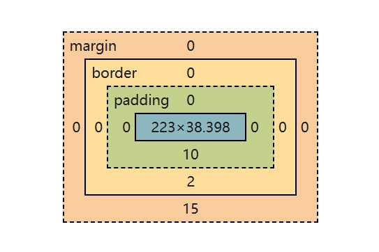

# Lab2 - CSS

- [Back to Course Home](index.md)

## CSS 应用方式

### 在标签上
```html

<div style="color:red;">上海交通大学</div>
```

### 在 head 标签中写 style 标签（主要用法）
```html
<!DOCTYPE html>
<html lang="en">
<head>
	<meta charset="UTF-8">
	<title>Title</title>
	<style>
		.c1{
			color:red;
		}
	</style>
</head>
<body>
	<h1 class='c1'>用户登录</h1>
</body>
</html>

```

### 写到文件中
将下列式样保存为 `common.css` （注意写到文件里的式样不需要 `<style>` 标签）
```css
.c1{
	color: blue;
	height:100px;
}
.c2{
	color:red;
}
```
在 HTML 文件中用 `<link />` 标签引入，注意在 `<head> </head>` 里面引用 css 文件
```html
<!DOCTYPE html>
<html lang="en">
<head>
	<meta charset="UTF-8">
	<title>Title</title>
	<link rel="stylesheet" href="common.css" />
</head>
<body>
	<h1 class='c1'>用户登录</h1>
</body>
</html>
```

## CSS 选择器

- 选择器的优先级（特异性/权重）从高到低排序

	1. 内联样式（标签上写 style 属性）

	2. ID 选择器（#id）

	3. 类选择器（.class）、属性选择器（[type='text']）、伪类选择器（:hover）

	4. 标签选择器（div、h1 等）、伪元素选择器（::before、::after）

	5. 通用选择器（*）

- 选择器的使用建议

	- 多用：类选择器、标签选择器、后代选择器

	- 少用：属性选择器、ID 选择器

- 关于多个样式 & 覆盖的问题：后面定义的样式覆盖前面的定义

	- 补充：强制不让后面的式样覆盖：使用 `!important`

### 通用选择器

- `*` 选择器：适用于所有 HTML 元素。它是最广泛的选择器，具有最低的特异性（权重为 0-0-0），意味着它很容易被其他选择器覆盖。

- 常见用途：

	- 重置默认的边距和填充;设置全局盒模型（box-sizing）;

	- 应用全局过渡效果;

	- 设置基本字体和颜色。

- 示例：

```css

* {
	margin: 0;
	padding: 0;
	box-sizing: border-box;
	font-family: 'Segoe UI', Tahoma, Geneva, Verdana, sans-serif;
}
```

### ID 选择器

- 唯一性选择器

- 示例：选择 ID 为 `c1` 的元素

```css
#c1{
	color: red;
}
```

```html
<div id='c1'></div>
```

### 类选择器

- 最常用的选择器

- 示例：选择 `class` 为 `c1` 的元素

```css
.c1{
	color: red;
}
```

```html
<div class='c1'></div>
```

### 标签选择器

- 示例：选择标签为 `div` 的元素

```css
div{
	color: blue;
}
```

```html
<div>content</div>
```

### 属性选择器

- 选择具有特定属性或属性值的元素

- 示例：

```css
/*适用于属性为 type=`text` 的输入框*/
input[type='text']{
	border: 1px solid red;
} 
/*适用于属性为 xx=`456`并且class=`v1` 的元素*/
.v1[xx="456"]{
	color: gold;
} 
```

```html
<input type="text">
<input type="password">

<div class="v1" xx="123">s</div>
<div class="v1" xx="456">f</div>
<div class="v1" xx="999">a</div>
```

### 后代选择器

- 选择某个元素内部的所有指定后代元素

- 示例：

```css
/*选择所有在类名为“yy”的元素内部的li元素*/
.yy li{
	color: pink;
}
/* 选择所有直接父元素为类名为“yy”的元素的a元素（即直接子元素a）*/
.yy > a{
	color: dodgerblue;
}
```

```html
<div class="yy">
	<a>百度</a>
	<div>
		<a>谷歌</a>
	</div>
	<ul>
		<li>美国</li>
		<li>日本</li>
		<li>韩国</li>
	</ul>
</div>
``` 

### 伪类选择器

- 选择元素的特定状态

- 常见伪类：

	- `:hover`：当用户将鼠标悬停在元素上时应用样式

	- `:focus`：当元素获得焦点时应用样式

	- `:nth-child(n)`：选择父元素的第 n 个子元素

	- `:first-child`：选择父元素的第一个子元素

	- `:last-child`：选择父元素的最后一个子元素

	- `:not(selector)`：选择不匹配指定选择器的元素

- 示例：

```css
.c1:hover{
	color: green;
}
```

## CSS 样式
### 高度和宽度 (height & width)

- 单位：`px` / `%` / `em` / `rem`

	- `px`：像素，绝对单位

	- `%`：百分比，相对于父元素的宽度或高度

	- `em`：相对于当前元素的字体大小

	- `rem`：相对于根元素（通常是 html）的字体大小

- 注意事项：

	- 宽度支持百分比。

	- 行内标签：默认无效

		- 比如：为 `<span>` 标签设置高度和宽度无效

	- 块级标签：默认有效

```css
.c1{
	height: 300px;
	width: 500px;
}
```

### 字体设置

- 常用的字体属性

	- 颜色: `color`

	- 大小: `font-size`

	- 加粗: `font-weight`

	- 字体格式: `font-family`

```css
.c1{
	color: #00FF7F;
	font-size: 58px;
	font-weight: 600;
	font-family: Microsoft Yahei;
	text-shadow: 2px 2px 4px rgba(0, 0, 0, 0.3); /*水平阴影、垂直阴影、模糊半径、颜色*/
	border-bottom: 2px solid #3498db;
}
```

### 文字对齐方式 (text-align & line-height)

- 水平对齐方式：`text-align`

	- `left`：左对齐

	- `center`：居中对齐

	- `right`：右对齐

	- `justify`：两端对齐

- 垂直对齐方式：`line-height`

	- 通过设置行高来实现垂直居中

	- 行高通常设置为与容器高度相同的值

```css
.c1{
	text-align: center; /* 水平方向居中 */
	line-height: 59px; /* 垂直方向居中 */
}
```

### 背景

- 常用的背景属性

	- 背景颜色: `background-color`

		- 颜色值可以是：颜色名称、十六进制颜色值、RGB 颜色值、RGBA 颜色值

	- 背景图片: `background-image`

		- 语法：`url(图片地址) center center/cover no-repeat;`，

			- `center center`：背景图片位置，水平居中，垂直居中

			- `cover`：背景图片大小，覆盖整个容器

			- `no-repeat`：背景图片不重复

	- 背景重复: `background-repeat`

	- 背景位置: `background-position`

	- 背景大小: `background-size`

```css
.c1{
	background-color: #5f5750;
	background-image: url('/static/bg1.jpg') center center/cover no-repeat;
}
```

### 浮动 (float)

- `float` 属性用于将元素从正常的文档流中取出，并将其向左或向右浮动，从而允许其他内容环绕它。

- 常见值：

	- `left`：将元素向左浮动

	- `right`：将元素向右浮动

	- `none`：默认值，元素不浮动，保持在正常的文档流中

	- `inherit`：元素继承其父元素的浮动属性

```html
<!DOCTYPE html>
<html lang="en">
<head>
	<meta charset="UTF-8">
	<title>Title</title>
</head>
<body>
	<div>
		<span>左边</span>
		<span style="float: right">右边</span>
	</div>
</body>
</html>
```

- 注意：div 默认块级标签，如果浮动起来，就不一样了。

```html
<!DOCTYPE html>
<html lang="en">
<head>
	<meta charset="UTF-8">
	<title>Title</title>
	<style>
		.item{
			float: left;
			width: 280px;
			height: 170px;
			border: 1px solid red;
		}
	</style>
</head>
<body>
	<div>
		<div class="item"></div>
		<div class="item"></div>
		<div class="item"></div>
		<div class="item"></div>
		<div class="item"></div>
	</div>
</body>
</html>
```

- 注意：如果你让标签浮动起来之后，就会脱离文档流。需要在 `html` 元素末尾加上一句 `<div style="clear: both;"></div>`, 以避免元素互相重叠和遮盖

```html
<!DOCTYPE html>
<html lang="en">
<head>
	<meta charset="UTF-8">
	<title>Title</title>
	<style>
		.item {
			float: left;
			width: 280px;
			height: 170px;
			border: 1px solid red;
		}
	</style>
</head>
<body>
	<div style="background-color: dodgerblue">
		<div class="item"> 1 </div>
		<div class="item"> 2 </div>
		<div class="item"> 3 </div>
		<div class="item"> 4 </div>
		<div class="item"> 5 </div>
		<div style="clear: both;"></div>
	</div>
	<div>人工智能学院</div>
</body>
</html>
```

### 内边距 (padding)


- `padding` 属性用于设置元素内容与其边框之间的内边距（padding）。内边距是元素内容与边框之间的空间，可以用来增加内容与边框之间的距离，从而改善布局和视觉效果。

- 常用属性：

	- `padding`：简写属性，可以只设置一个值，表示四个方向的内边距相同；可以设置两个值，分别表示上下和左右的内边距；也可以同时设置四个方向的内边距，顺序为上、右、下、左

	- `padding-top`、`padding-right`、`padding-bottom`、`padding-left`：设置元素四个方向的内边距

```css
.inner {
	padding-top: 20px;
	padding-right: 10px;
	padding-bottom: 5px;
	padding-left: 0px;

	/* padding: 20px; */
	/* padding: 20px 10px 5px 0px; */
}
```

### 边框 (border)

- `border` 属性用于设置元素的边框样式。边框是围绕元素内容和内边距的线条，可以用来突出显示元素、分隔内容或增强视觉效果。

- 常用属性：

	- `border-width`：设置边框的宽度

	- `border-style`：设置边框的样式（如实线、虚线、点线等）

	- `border-color`：设置边框的颜色

	- `border`：简写属性，可以同时设置边框的宽度、样式和颜色

	- `border-top`、`border-right`、`border-bottom`、`border-left`：分别设置元素四个方向的边框

	- `border-radius`：设置边框的圆角半径

	- `border-image`：使用图片作为边框

	- `box-shadow`：为元素添加阴影效果

		- 语法：`box-shadow: h-shadow v-shadow blur-radius spread-radius color;`

```css
.bordered {
	border: 1px solid red;
	/* 左边框透明 */
	border-left: 2px solid transparent;
}
```

### 外边距 (margin)

- `margin` 属性用于设置元素的外边距（margin）。外边距是元素与其相邻元素之间的空间，可以用来控制元素之间的距离和布局。

- 常用属性：

	- `margin`：简写属性，可以只设置一个值，表示四个方向的外边距相同；可以设置两个值，分别表示上下和左右的外边距；也可以同时设置四个方向的外边距，顺序为上、右、下、左

	- `margin-top`、`margin-right`、`margin-bottom`、`margin-left`：设置元素四个方向的外边距

```css
.outer {
	margin-top: 20px;
	margin-right: 10px;
	margin-bottom: 5px;
	margin-left: 0px;
	/* margin: 20px; */
	/* margin: 20px 10px 5px 0px; */
}
```

### 伪类 (:hover)

- CSS 的 `:hover` 伪类选择器用于在用户将鼠标悬停在元素上时应用样式，这是创建交互式网页的重要工具。

```html
<!DOCTYPE html>
<html lang="en">
<head>
	<meta charset="UTF-8">
	<title>Title</title>
	<style>
		.c1 {
			color: red;
			font-size: 18px;
		}

		.c1:hover {
			color: green;
			font-size: 50px;
		}

		.c2 {
			height: 300px;
			width: 500px;
			border: 3px solid red;
		}

		.c2:hover {
			border: 3px solid green;
		}

		.download {
			display: none;
		}

		.app:hover .download {
			display: block;
		}
		.app:hover .title{
			color: red;
		}
	</style>
</head>
<body>
<div class="c1">上海交通大学</div>
<div class="c2">计算机学院</div>

<div class="app">
	<div class="title">下载APP</div>
	<div class="download">
		
	</div>
</div>

</body>
</html>
```

### 伪元素 (:after)

- CSS 的 `:after` 伪元素用于在选定元素的最后一个子元素之后插入内容。它常与 content 属性一起使用，用于添加装饰性元素而不影响 HTML 结构。

```html
<!DOCTYPE html>
<html lang="en">
<head>
	<meta charset="UTF-8">
	<title>Title</title>
	<style>
		.c1:after{
			content: "大帅哥";
		}
	</style>
</head>
<body>
	<div class="c1">张三</div>
	<div class="c1">李四</div>
</body>
</html>
```

- 很重要的应用：**清除浮动** 

	- 用 `clearfix` 替代  `<div style="clear: both;"> </div>`

```html
<!DOCTYPE html>
<html lang="en">
<head>
	<meta charset="UTF-8">
	<title>Title</title>
	<style> 
		.clearfix:after{	
			content: "";
			display: block;
			clear: both;
		}
		.item{
			float: left;
		} /* 替代 <div style="clear: both;"> </div>*/

	</style>
</head>
<body>
	<div class="clearfix">
		<div class="item">1</div>
		<div class="item">2</div>
		<div class="item">3</div>
	</div>
</body>
</html>
```

### 伪类 (:active)

- CSS 的 `:active` 伪类选择器用于在用户点击并按住元素时应用样式。这种状态通常持续到用户释放鼠标按钮或触摸屏幕为止。`:active` 伪类常用于按钮、链接和其他可交互元素，以提供视觉反馈，增强用户体验。

```html
<!DOCTYPE html>
<html lang="en">
<head>
	<meta charset="UTF-8">
	<title>Title</title>
	<style>
		.btn{
			width: 100px;
			height: 40px;
			line-height: 40px;
			text-align: center;
			background-color: dodgerblue;
			color: white;
			user-select: none; /* 禁止选中 */
			cursor: pointer; /* 鼠标手型 */
		}
		.btn:active{
			background-color: green;
			transform: translateY(2px); /* 按下去的效果 */
		}
	</style>
</head>
<body>
	<div class="btn">按钮</div>
</body>
</html>
```

### 鼠标样式 (cursor)

- `cursor` 属性用于设置鼠标指针在悬停在元素上时的样式。通过改变鼠标指针的外观，可以提供视觉反馈，增强用户体验。

- 常见值：

	- `default`：默认指针

	- `pointer`：手型指针，通常用于链接和按钮

	- `text`：文本选择指针，通常用于文本输入区域

	- `move`：移动指针，表示元素可以被拖动

	- `not-allowed`：禁止指针，表示元素不可交互

```css
.c1{
	cursor: pointer; /* 鼠标手型 */
}
```

### 位置 (position)

- fixed

	- 固定在窗口的某个位置

	- 案例：返回顶部、对话框

- relative

	- 相对于页面的位置

- absolute

	- 相对于最近的已定位祖先元素的位置

- sticky

	- 根据用户的滚动位置在相对和固定定位之间切换

```css
.back{
	position: fixed; /* 固定位置*/
	width: 60px;
	height: 60px;
	border: 1px solid red;

	right: 10px; /* 离开右边10像素*/
	bottom: 50px; /* 离底边50像素*/
}
```

### 显示与隐藏元素 (display)

- 使用 `display` 属性可以控制元素的显示与隐藏。

- 常见值：

	- `none`：隐藏元素，元素不占据任何空间。

	- `block`：将元素显示为块级元素。

	- `inline`：将元素显示为行内元素。

	- `inline-block`：将元素显示为行内块级元素。

		- 常用的显示属性

		- 同时具有块级和行内标签的属性，在一行内显示的同时，还可以设置宽度、长度和边距

	- `flex`：将元素显示为弹性盒子布局。

		- `justify-content`：主轴对齐方式

		- `align-items`：交叉轴对齐方式

		- `flex-direction`：主轴方向

	- `grid`：将元素显示为网格布局。

		- `grid-template-columns`：定义列

		- `grid-template-rows`：定义行

		- `gap`：定义网格间距 

## BootStrap

Bootstrap 是一个流行的前端框架，用于简化网页设计和开发。它提供了一套预定义的 CSS 和 JavaScript 组件，使开发者能够快速创建响应式和美观的网页。

### 引入 Bootstrap
在 HTML 文件的 `<head>` 部分引入 Bootstrap 的 CSS 和 JavaScript 文件：

```html
<!-- 最新版本的 Bootstrap 核心 CSS 文件 -->
<link rel="stylesheet" href="https://cdn.bootcdn.net/ajax/libs/twitter-bootstrap/3.4.1/css/bootstrap.min.css" integrity="sha384-HSMxcRTRxnN+Bdg0JdbxYKrThecOKuH5zCYotlSAcp1+c8xmyTe9GYg1l9a69psu" crossorigin="anonymous">

<!-- 最新的 Bootstrap 核心 JavaScript 文件 -->
<script src="https://cdn.bootcdn.net/ajax/libs/twitter-bootstrap/3.4.1/js/bootstrap.min.js" integrity="sha384-aJ21OjlMXNL5UyIl/XNwTMqvzeRMZH2w8c5cRVpzpU8Y5bApTppSuUkhZXN0VxHd" crossorigin="anonymous"></script>
```

### 使用 Bootstrap 组件
Bootstrap 提供了许多预定义的组件，如按钮、导航栏、表格等。以下是一些常用组件的示例：

- 按钮
	```html
	<button class="btn btn-primary">Primary Button</button>
	<button class="btn btn-success">Success Button</button>
	```

- 导航栏
	```html
	<nav class="navbar navbar-default">
		<div class="container-fluid">
			<div class="navbar-header">
				<a class="navbar-brand" href="#">Brand</a>
			</div>
			<ul class="nav navbar-nav">
				<li class="active"><a href="#">Home</a></li>
				<li><a href="#">Page 1</a></li>
				<li><a href="#">Page 2</a></li>
			</ul>
		</div>
	</nav>
	```

- 表格
	```html
	<table class="table table-striped">
		<thead>
			<tr>
				<th>姓名</th>
				<th>学号</th>
				<th>专业</th>
			</tr>
		</thead>
		<tbody>
			<tr>
				<td>Alice</td>
				<td>12345</td>
				<td>信息安全</td>
			</tr>
			<tr>
				<td>Bob</td>
				<td>12346</td>
				<td>信息安全</td>
			</tr>
		</tbody>
	</table>
	```

- 表单
	```html
	<form>
		<div class="form-group">
			<label for="username">用户名:</label>
			<input type="text" class="form-control" id="username" placeholder="输入用户名">
		</div>
		<div class="form-group">
			<label for="pwd">密码:</label>
			<input type="password" class="form-control" id="pwd" placeholder="输入密码">
		</div>
		<button type="submit" class="btn btn-default">提交</button>
	</form>
	```

- 面板
	```html
	<div class="panel panel-primary">
		<div class="panel-heading">
			Panel heading without title
		</div>
		<div class="panel-body">
			Panel content
		</div>
	</div>
	```

### 网格系统
Bootstrap 的网格系统允许你创建响应式布局。你可以使用行（row）和列（col）来组织内容。


- 把整体划分为了 12 格，根据屏幕宽度不同，Bootstrap 5 网格系统有六个类

	- `.col-`：超小型设备 - 屏幕宽度小于 576px

	- `.col-sm-`：小型设备 - 屏幕宽度等于或大于 576px

	- `.col-md-`：中型设备 - 屏幕宽度等于或大于 768 像素

	- `.col-lg-`：大型设备 - 屏幕宽度等于或大于 992 像素

	- `.col-xl-`：xlarge 设备 - 屏幕宽度等于或大于 1200px

	- `.col-xxl-`：xxlarge 设备 - 屏幕宽度等于或大于 1400px

- 案例：两个不同宽度的列

```html
<div class="row" >
<div class="col-sm-4" style="border-color:red;border-style:solid">col-sm-4</div>
<div class="col-sm-8" style="border-color:blue;border-style:solid">col-sm-8</div>
</div>
```

### 容器

Bootstrap 需要为页面内容和栅格系统包裹一个 .container 容器。Bootstrap 有两种容器类可供选择：

- `.container` 类提供了一个响应式的固定宽度容器

- `.container-fluid` 类提供了一个全宽容器，跨越视口的整个宽度

```html
<div class="container-fluid">
	<div class="col-sm-9">左边</div>
	<div class="col-sm-3">右边</div>
</div>
```

```html
<div class="container">
	<div class="col-sm-9">左边</div>
	<div class="col-sm-3">右边</div>
</div>
```

## Font Awesome
Font Awesome 是一个流行的图标库和工具包，提供了大量的矢量图标，可以轻松地集成到网页和应用程序中。它支持多种格式，包括字体图标、SVG 图标等，允许开发者通过简单的类名来使用各种图标，从而提升用户界面的视觉效果和交互体验。

### 引入 Font Awesome
在 HTML 文件的 `<head>` 部分引入 Font Awesome 的 CSS 文件： 

- 引入 7.0 版本的 Font Awesome
```html
<link href="
https://cdn.jsdelivr.net/npm/@fortawesome/fontawesome-free@7.0.1/css/fontawesome.min.css
" rel="stylesheet">
```

- 可以从[Font Awesome 官网](https://fontawesome.com/)获取最新版本的 CDN 链接

### 使用 Font Awesome 图标

Font Awesome 提供了丰富的图标，可以通过添加特定的类名来使用这些图标。以下是一些常用图标的示例：

```html
<!-- 使用 Font Awesome 图标 -->
<i class="fa fa-home"></i> <!-- 首页图标 -->
<i class="fa fa-user"></i> <!-- 用户图标 -->
<i class="fa fa-envelope"></i> <!-- 邮件图标 -->
<i class="fa fa-cog"></i> <!-- 设置图标 -->
```