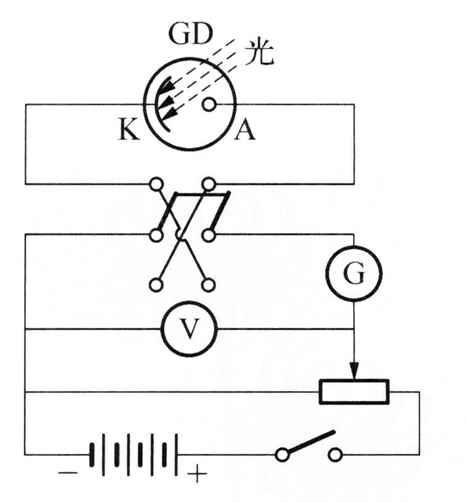
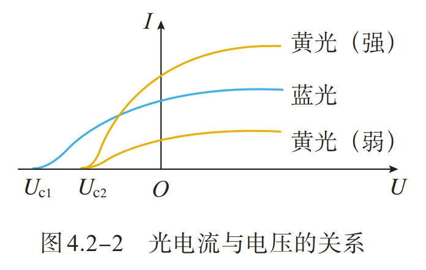
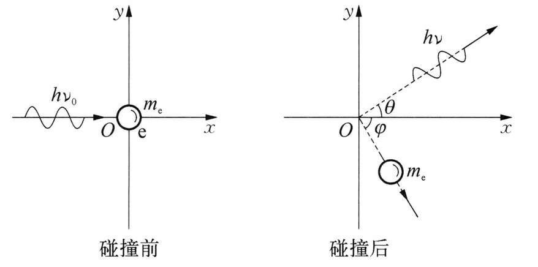

# 量子力学基础

- [Back to Course Home](index.md)

## 热辐射

  - 任何固体或液体都是由分子、原子构成的，由于热运动发射各种电磁波，称为 **热辐射** 。
  - 物体向周围辐射的能量称为 **辐射能** 。
  - 实验表明，热辐射具有 **连续的辐射谱**
  - 热辐射的电磁波的波长、强度与物体的温度有关，还与物体的性质表面形状有关。一般温度越高，所发射电磁波的能量越大，在光谱分布中，强度向较短波长转移。
  - 这说明同一物体的热辐射谱在不同波长区域分布不均匀，温度越高，光谱中最大辐射对应的波长越短，同时辐射总能量增加。
  - 加热一物体，若物体所吸收的能量等于在同一时间内辐射的能量，则物体的温度恒定。这种温度不变的热辐射称之为 **平衡热辐射** 。

### 单色辐出度

单位时间内，从物体表面单位面积上发射波长为 $\lambda \sim \lambda+\mathrm{d} \lambda$ 的辐射能 $\mathrm{d} E_{\lambda}$，与波长间隔成正比，$\mathrm{d} E_{\lambda}$ 与 $\mathrm{d}\lambda $ 的比值称为 **单色辐出度** 。单色辐出度用 $ M(\lambda,T)$ 表示，即

$$
\begin{aligned} M(\lambda,T)=\frac{\mathrm{d} E_{\lambda}}{\mathrm{d} \lambda}\\ M(\mu,T)=\frac{\mathrm{d} E_{\mu}}{\mathrm{d} \mu} \end{aligned}
$$

- 热辐射实验表明，$M(\lambda,T)$ 与辐射物体的 **温度** 和辐射的 **波长** 有关，是 $\lambda$ 和 $T$ 的函数。
- 单色辐出度表示在单位时间内从物体表面单位面积内发射的波长在 $\lambda$ 附近窄带辐射功率密度。
- 单色辐出度反映了物体在不同温度下辐射能按波长分布的情况，它的单位是 $\mathrm{W} / \mathrm{m}^{3}$。

### 总辐出度

单位时间内，从物体表面单位面积上所发射的各种波长的总辐射能称为物体的 **总辐出度** 。显然，对于一个给定的物体，总辐出度只是温度的函数，常用 $M(T)$ 表示，单位是 $\mathrm{W} / \mathrm{m}^{2}$。在一定温度 $T$ 时，物体的总辐出度与单色辐出度的关系为

$$
\begin{aligned} M(T)&=\int_{0}^{\infty} M(\lambda,T) \mathrm{d} \lambda\\ &=\int_{0}^{\infty} M(\nu,T) \mathrm{d} \nu \\ \end{aligned}
$$

上式表明，在相同温度下，不同物体的 $M(\lambda,T)$ 不同，相应的 $M(T)$ 值也不同。

$$
\begin{aligned} &\int_{0}^{\infty} M_{\nu}\left(T\right)\text{d}\nu=M_{\nu}\left(T\right)\text{d}\left(\frac{c}{\lambda}\right)=\int_{\infty}^{0} -\frac{c}{\lambda^{2}}M_{\nu}(T)\text{d}\lambda=-\int_{0}^{\infty} M_{\lambda}\left(T\right)\text{d}\lambda\\ &\Rightarrow M_{\lambda}\left(T\right)=M_{\nu}\left(T\right)\frac{c}{\lambda^{2}}\\ \end{aligned}
$$

### 吸收比

任一物体向周围发射辐射能的同时，也吸收周围物体的辐射能。当辐射从外界入射到不透明物体时，一部分能量吸收，一部分能量反射，如果物体透明，还有一部分能量透射。吸收能量与入射能量之比称为物体的 **吸收比**，用 $a(T)$ 表示，在波长为 $\lambda \sim \lambda+\mathrm{d} \lambda$ 范围内的吸收比称为 **单色吸收比** ，用 $a(\lambda,T)$ 表示。
定义吸收比

$$
a(T)=\frac{E^{\text {吸收 }}}{E^{\text {入射 }}}
$$

单色吸收比

$$
a(\lambda, T)=\frac{E_{\lambda}^{\text {吸收 }}}{E_{\lambda}^{\text {入射 }}}
$$

- 如果物体在任意温度下，对任何波长的辐射吸收比都等于 $1$，则该物体称为 **绝对黑体** ，简称 **黑体** 。

### 反射比

同理定义反射比

$$
r(T)=\frac{E^{\text {反射 }}}{E^{\text {入射 }}}
$$

单色反射比

$$
r(\lambda, T)=\frac{E_{\lambda}^{\text {反射 }}}{E_{\lambda}^{\text {入射 }}}
$$

对于不透明物体，$a(\lambda, T)+r(\lambda, T)=1$

## 基尔霍夫辐射定律

基尔霍夫从理论上提出了物体的辐出度与吸收比关系的重要定律：在相同的温度下，不同物体对相同波长的单色辐出度与单色吸收比之间的 **比值都相等**，并等于该温度下黑体对同一波长的单色辐出度。可以表示为

$$
\frac{M_{1}(\lambda,T)}{a_{1}(\lambda,T)}=\frac{M_{2}(\lambda,T)}{a_{2}(\lambda,T)}=\cdots=M_{0}(\lambda,T)
$$

式中，$M_{0}(\lambda,T)$ 是 **黑体单色辐出度** 。

- 基尔霍夫辐射定律说明好的发射体一定也是好的吸收体。黑体是 **完全** 吸收体，也是理想的发射体。
- 带小孔的封闭空腔体可以视为绝对黑体的模型，空腔内电磁辐射为黑体辐射。

## 斯特藩-玻耳兹曼定律

实验证明，黑体的总辐出度与温度的四次方成正比，即

$$
M_{0}(T)=\sigma T^{4}
$$

- 式中，$\sigma=5.67 \times 10^{-8} \mathrm{~W} /\left(\mathrm{m}^{2} \cdot \mathrm{K}^{4}\right)$ 称为 Stefen 恒量。
- 总辐出度随着绝对温度的升高而快速增加。

## 维恩位移定律

单色辐出度的峰值波长 $\lambda_{\mathrm{m}}$ 满足维恩位移定律，即

$$
\lambda_{\mathrm{m}} T=b
$$

- 式中，$b=2.897 \times 10^{-3} \mathrm{~m} \cdot \mathrm{K}$ 称为 Wien 常数。
- 随着温度的增加，热辐射的峰值波长向短波移动。

## 普朗克黑体辐射公式

1900 年，普朗克给出了黑体辐射满足实验结果的公式：

$$
\begin{aligned} M_{0}(\lambda,T)=2 \pi h c^{2} \lambda^{-5} \frac{1}{\mathrm{e}^{h c / k_{\mathrm{B}} T \lambda}-1}\\ M_{0}(\nu,T)=\frac{2\pi\nu^2}{c^2}\frac{h\nu}{\mathrm{e}^{h \nu / k_{\mathrm{B}} T }-1} \end{aligned}
$$

- 式中，
	- $c=3.0\times 10^8 \mathrm{m}\cdot \mathrm{s}^{-1}$ 是光速
	- $k_{\mathrm{B}}=1.38\times 10^{-23} \mathrm{J}\cdot \mathrm{K}^{-1}$ 是玻尔兹曼常量
	- $h=6.626\times 10^{-34} \mathrm{J}\cdot \mathrm{s}=4.136\times 10^{-15} \mathrm{eV}\cdot \mathrm{s}$ 是普朗克常量，是一个普适常量。
- 无论是短波还是长波，普朗克公式的计算结果都与实验结果一致。从理论上推导该公式时，普朗克采用了当时物理认识上一个非同寻常的假设：谐振子能量值只取某个最小能量的整数倍，即

    $$
    \varepsilon,2 \varepsilon,3 \varepsilon,\cdots,n \varepsilon
    $$

    式中，$n$ 为正整数，称为 **量子数** 。对于频率为 $\nu$ 的谐振子，最小能量是 $\varepsilon=h \nu$。在辐射或吸收能量时，振子从这些状态中的一个状态跃迁到另一个状态，即振子只能跳跃式地辐射或吸收能量。

- 由普朗克公式可导出其他所有热辐射公式：

	$$
	M_{0}(\nu, T)=\frac{2 \pi \nu^{2}}{c^{2}} \frac{h \nu}{e^{h \nu / k T}-1}\left\{\begin{array}{l} \text { 积分 } \rightarrow M=\sigma T^{4} \\ \text { 求导 } \rightarrow T \lambda_{m}=b \\ \text { 低频 } \rightarrow M_{\nu}(T)=\frac{2 \pi \nu^{2}}{c^{2}} k T \\ \text { 高频 } \rightarrow M_{\nu}(T)=\alpha \nu^{3} e^{-\beta \nu / T} \end{array}\right.
	$$

### 普朗克公式频率波长转换

$$
\begin{aligned} &M_0(\lambda)=\int_{0}^{\infty} M_{0}(\lambda, T) d \lambda=\int_{0}^{\infty} M_{0}(\nu, T) d \nu \\ \Rightarrow &\int_{0}^{\infty} M_{0}(\lambda,T) d \lambda=\int_{\infty}^{0} M_{0}(\nu, T)\left(-\frac{c}{\lambda^{2}}\right) d \lambda \\ \Rightarrow &M_{0}(\lambda, T)=M_{0}(\nu, T) \frac{c}{\lambda^{2}} \end{aligned}
$$

### 维恩公式

当波长很短或温度较低时，普朗克公式可近似写成

$$
\begin{aligned} M_{0}(\lambda,T)=2 \pi h c^{2} \lambda^{-5} \mathrm{e}^{-h c / k_{\mathrm{B}} T \lambda} \\ M_{0}(\nu,T)=\alpha \nu^{3} e^{-\beta \nu / T} \end{aligned}
$$

这就是维恩公式。将黑体空腔壁分子或原子当成线性谐振子，维恩用经典热力学物理证明了 $M_{0}(\lambda,T)=c^{5} \lambda^{-5}\phi(\lambda,T)$，假设黑体辐射能谱与麦克斯韦速率分布相类似，可得出公式 $M_{0}(\lambda,T)=C_{1}\lambda^{-5} \mathrm{e}^{-C_{2} / T \lambda}$，其中 $C_{1}$ 和 $C_{2}$ 是两个常数。通过对比可知，$C_{1}=2 \pi h c^{2}$，$C_{2}=h c / k_{\mathrm{B}}$。

### 瑞利-金斯公式

当波长较长或温度较高时，普朗克公式可近似写成

$$
\begin{aligned} M_{0}(\lambda,T)=2 \pi k_{\mathrm{B}} c \lambda^{-4} T \\ M_{0}(\nu,T)=\frac{2 \pi \nu^{2}}{c^{2}} k T \end{aligned}
$$

这就是瑞利-金斯公式。瑞利和金斯从能量均分定律出发，每个谐振子自由度的平均能量等于 $k_{\mathrm{B}} T$，从而得到了理论公式 $M_{0}(\lambda,T)=C_{3} \lambda^{-4} T$。当波长很长时，计算结果与实验结果相符，但在短波紫外区方面，随着波长趋向于零而 $M_{0}(\lambda,T)$ 趋向于无穷大，则计算结果与实验数据不吻合，这一结果被称为“**紫外灾难**”。

## 光电效应

### 实验模型

当光照射在金属表面上，使电子从金属中脱出的现象，称作 **光电效应** 。

上图所示为研究光电效应的实验装置。在抽成真空的容器中，$K$ 是阴极，$A$ 是阳极。当光通过石英窗照射到金属板 $K$ 上时，金属板释放电子，这种电子称为光电子。如果在 $A$、$K$ 两端加上电势差，则电子在加速电场的作用下，飞向阳极 $A$，电路中出现电流，成为光电流，电流计可测出这个光电流。

### 基本参数

#### 饱和电流

实验表明，当入射光强度不变，加速电势差 $U=U_A-U_K$ 越大，光电流 $I$ 也越大，当电势差增大到一定值时，光电流达到饱和值，此时的光电流称为 **饱和电流** 。若改变入射光强，**饱和电流的大小与入射光强成正比**，说明从阴极逸出的电子数全部飞到阳极，单位时间从金属表面逸出的电子数与入射光强成正比。

#### 遏制电势差

当 $A$、$K$ 两极的电势差为零时，光电流不为零，这说明从金属表面逸出的电子有初始动能；当负电势差不大时，尽管存在电场阻碍，但依然有部分电子可能到达阳极；如果负电势差足够大，从阴极表面逸出的具有最大速度的电子也不能到达 $\mathrm{A}$ 极，则光电流变为零。只有改变电压 $U=-U_{0}$ 时，光电流为零，$U_{0}$ 称为 **遏制电势差**。光电子从表面逸出的最大初速度 $v_{\mathrm{m}}$ 满足

$$
\frac{1}{2} m v_{\mathrm{m}}^{2}=e U_{0}
$$

式中，$e$ 和 $m$ 分别为电子电荷量和质量。**最大初动能与入射光的强度无关。**

#### 红限频率

实验发现，改变入射光的频率，遏止电势差与入射光的频率之间具有线性关系，即

$$
U_{0}=K \nu-U_{1}
$$

式中，$K$ 是不随金属种类变化的普适恒量；$U_{1}$ 随金属种类不同而变化。

$$
\frac{1}{2} m v_{\mathrm{m}}^{2}=e K \nu-e U_{1}
$$

光电子从金属表面逸出时的最大初动能随着入射光的频率线性增加。电子初动能必须是正的，光照射金属逸出电子的条件是光的频率 $\nu \geqslant U_{1} / K$。令 $\nu_{0}=U_{1} / K$，$\nu_{0}$ 称为光电效应的 **红限频率**。这意味着无论光的强度多大，当入射光的频率小于 $\nu_{0}$ 时，都不会发生光电效应。

#### 弛豫时间

实验证明，无论入射光的强度如何，入射光照射到金属释放电子几乎是瞬时的，弛豫时间不超过 $1\times 10^{-9} \mathrm{s}$

### 爱因斯坦光子理论

- 爱因斯坦认为光的能量以颗粒形式在空间传播，这种颗粒形式的光能量称为 **光量子** 或 **光子** ，一束光就是以光速运动的 **光子流** 。
- 每个光子的能量是 $\varepsilon=h \nu$，不同频率的光子具有不同的能量，光的能流密度 $S$ 决定于单位时间内通过该单位面积的光子数 $N$。频率为 $\nu$ 的单色光的能流密度 $S=N h \nu$。
- 光电效应的解释如下：当金属中一个电子从入射光中吸收一个频率为 $\nu$ 的光子后，就获得能量 $h \nu$，如果 $h \nu$ 大于电子从金属表面逸出所需的逸出功 $A$，那么这个电子就可以从金属中飞出。根据能量守恒定律，则有爱因斯坦光电效应方程

    $$
    h \nu=\frac{1}{2} m v_{\mathrm{m}}^{2}+A
    $$

    式中，$\frac{1}{2} m v_{\mathrm{m}}^{2}$ 是光电子的 **最大初动能** 。

- 如果出射电子动能为零，$\nu_{0}=A / h$，这表明频率为 $\nu_{0}$ 的光子具有发射光电子的最小能量。如果光子频率低于红限频率 $\nu_{0}$，不管有多少光子，单个光子都没有足够的能量去发射光电子，所以当光电子吸收的能量全部消耗于电子的逸出功时，入射光的频率对应于红限频率。
- 当光子频率大于红限频率 $\nu_{0}$，光的强度增加时，光子数目增大，单位时间内发射的光电子数目也将增大，这说明了饱和电流与光的强度之间的正比关系。另外，当光子能量被电子全部吸收后，不需要积累能量的时间，这说明了光电效应发生的瞬时性。

### 光的波粒二象性

**光子本性是波粒二象性** 。光子不仅具有能量，还具有质量、动量等一般粒子共有的特性。光子质量可由爱因斯坦质能关系得到，表示为

$$
m=\frac{\varepsilon}{c^{2}}=\frac{h \nu}{c^{2}}
$$

光子质量是由光子能量决定的。光子的动量为

$$
p=m c=\frac{h \nu}{c}=\frac{h}{\lambda}
$$

由于光子有动量，光照射到物体上时，就对物体表面施加了压力，这就是 **光压**，这已被实验所证实。光的波动理论已被光的干涉和衍射实验所证实，而光子理论成功解释了光电效应，并且能解释光的波动理论无法解释的其他现象。因此 **光既有波动性又有粒子性**，光具有双重性质，即光的 **波粒二象性** 。光子的能量和动量是描述粒子性的，而频率和波长是描述波动性的。

## 康普顿效应

康普顿研究了 $X$ 射线经物质散射的实验，为光子的粒子性概念提供了有力证据。$X$ 射线源发出一束波长为 $\lambda_{0}$ 的 $X$ 射线，照射到一块石墨上。经石墨散射后，散射的 $\mathrm{X}$ 射线的波长和强度可以由晶体和探测器所组成的摄谱仪来测定。改变散射角 $\theta$，再进行同样的测量。康普顿发现：

- 散射光谱中除了有与入射波长 $\lambda_{0}$ 相同的射线，还有波长 $\lambda>\lambda_{0}$ 的射线，这种改变波长的散射称为 **康普顿效应** 。
- 波长差 $\Delta \lambda=\lambda-\lambda_{0}$ 随着散射角的改变而改变。散射角 **增大** 时，波长差也随着 **增加** ，而且随着散射角的增大，**原波长的谱线强度减小** ，而 **新波长的谱线强度增大** 。
- 在 **同一散射角** 下，对于所有散射物质，**波长差都相同** ，但原波长的谱线强度随着散射物质的原子序数的增大而 **增加** ，新波长的谱线强度随之 **减小** 。

### 解释

- 一个光子和散射体中的一个自由电子或束缚微弱电子（原子的外层电子）发生碰撞后，从散射体射出光子的方向就是康普顿散射的方向
- 电子吸收一个光子能量后，发射一个散射光子，电子同时受到反冲而获得一定的能量和动量。在碰撞过程中，动量和能量守恒，入射光子的能量一部分给了电子，因此 **散射光子能量比入射光子能量低**
- 又根据光子满足的关系 $E=h\nu$，则 **散射光的频率小于入射光的频率** ，意味着 **散射光的波长大于入射光的波长** 。如果光子与原子中束缚很紧的电子（原子的内层电子）碰撞，光子将与整个原子做弹性碰撞。因为原子的质量比光子的质量大很多，**散射光的能量不会显著减小** ，从而散射光的频率也不会发生显著变化，康普顿移动非常小，所以实验散射线中有与入射光波长相同的射线。

### 计算

我们利用能量守恒和动量守恒定律来定量解释散射光子的波长改变。一个光子与一个自由电子碰撞，电子一开始处于静止状态，如下图所示。  

- 频率为 $\nu_{0}$ 的一束光沿着 $x$ 方向照射物体表面，具有能量 $h \nu_{0}$ 和动量 $\frac{h \nu_{0}}{c}$ 的光子与电子碰撞后被散射，之后光子与原入射光子方向成 $\theta$ 角，散射光子能量为 $h \nu$，动量为 $\frac{h \nu}{c}$。
- 同时，反冲电子获得一个与光速差不多的速率并沿着某一角度 $\varphi$ 飞出，电子能量从静止时的 $m_{\mathrm{e}} c^{2}$ 变成了 $m c^{2}$，动量变为 $m v$，其中 $m=\frac{m_{\mathrm{e}}}{\sqrt{1-v^{2} / c^{2}}}$，即电子动能要用相对论公式表示。
- 根据碰撞中遵守能量守恒和动量守恒定律，有

    $$
    h \nu_{0}=h \nu+\left(m-m_{\mathrm{e}}\right) c^{2}
    $$

- $x$ 方向的动量守恒方程写为

    $$
    \frac{h \nu_{0}}{c}=\frac{h \nu}{c} \cos \theta+m v \cos \varphi
    $$

- $y$ 方向的动量守恒方程写为

    $$
    0=\frac{h \nu}{c} \sin \theta-m v \sin \varphi
    $$

- 利用 $p=\frac{h \nu}{c}=\frac{h}{\lambda}$ 关系，求得

    $$
    \Delta \lambda=\lambda-\lambda_{0}=\frac{h}{m_{\mathrm{e}} c}(1-\cos \theta)=2 \lambda_{\mathrm{c}} \sin ^{2} \frac{\theta}{2}
    $$

    式中，$\lambda_{\mathrm{c}}=\frac{h}{m_{\mathrm{e}} c}=2.43 \times 10^{-12} \mathrm{~m}$，$\lambda_{\mathrm{c}}$ 称为电子的 **康普顿波长** 。

上式说明波长差 $\Delta \lambda$ 与散射物质以及入射光的波长无关，**仅决定于散射方向** ，$\Delta \lambda$ 随着散射角度的增大而增大，计算得到的理论值与实验结果相符。这不仅有力地证实了光子理论，说明了光子的粒子性（有质量、能量、动量的光量子），整个散射过程是单个光子与个别电子的碰撞；还说明在微观过程中，微观粒子的相互作用也严格遵守了能量守恒和动量守恒定律。正如在空腔辐射和光电效应中，康普顿效应中的普朗克常量起着主要作用，揭示了光具有粒子性。可以这么说，光电效应揭示了光子能量与频率的关系，而康普顿效应则进一步揭示了光子动量与波长的关系。

### 解题方法

1. 若只涉及到波长差和散射角，则使用

    $$
    \Delta \lambda=2 \lambda_{\mathrm{c}} \sin ^{2} \frac{\theta}{2}
    $$

    得出答案

2. 若涉及到能量、动量，则列出康普顿效应方程组

    $$
    \left\{\begin{array}{l} h \nu_{0}=h \nu+\left(m-m_{\mathrm{e}}\right) c^{2}\\ \frac{h \nu_{0}}{c}=\frac{h \nu}{c} \cos \theta+m v \cos \varphi\\ 0=\frac{h \nu}{c} \sin \theta-m v \sin \varphi \end{array}\right.
    $$

    并加上题目条件（通常是两个方程），联立求解

## 卢瑟福原子模型

卢瑟福根据 $\alpha$ 粒子散射实验结果在理论上提出原子的有核模型，即原子的正电荷以及几乎全部的质量集中在原子中心很小的区域中，形成原子核，带负电的电子围绕原子核旋转，类似于太阳系中行星绕太阳旋转一样，但原子核与电子之间服从库仑定律。此模型很好地解释了 $\alpha$ 粒子的大角度偏转，但也遇到了几个困难：

- 缺乏合理表征原子大小的量
- 原子的稳定性问题
- 无法解释原子光谱

## 玻尔原子理论

### 氢原子光谱

在 $1888$ 年瑞典物理学家、数学家里德伯将巴尔末公式表示为更一般化的形式，即里德伯公式：

$$
\widetilde{\nu}=R\left(\frac{1}{m^{2}}-\frac{1}{n^{2}}\right)\quad(m=1,2,3,\cdots;n=m+1,m+2,m+3,\cdots)
$$

式中

- $\widetilde{\nu}=\lambda^{-1}$ 为波长的倒数，称为 **波数**
- $m=1,2,3,\cdots$ 为整数
- $n=m+1,m+2,m+3,\cdots$ 亦为整数
- $R=1.096776 \times 10^{7} \mathrm{~m}^{-1}$ 为 **里德伯恒量**
- 给定 $m$ 后，$n$ 取不同值对应不同谱线系
	- 当 $m=2$，里德伯公式变为巴尔末公式，所对应的谱线系称为 **巴尔末系** 。
	- 当 $m=1$ 时里德伯公式变为

	    $$
	    \widetilde{\nu}=R\left(\frac{1}{1^{2}}-\frac{1}{n^{2}}\right) \quad(n=2,3,4,\cdots)
	    $$

	    对应的谱线系在紫外区，由赖曼在 $1914$ 年发现，称为 **赖曼系** 。

	- 当 $m=3$ 的光谱线位于红外线区，由帕邢在 $1908$ 年发现，称为 **帕邢系** ：

	    $$
	    \widetilde{\nu}=R\left(\frac{1}{3^{2}}-\frac{1}{n^{2}}\right) \quad(n=4,5,6,\cdots)
	    $$

	- 当 $m=4$ 的光谱线位于近红外区，称为 **布拉开系** ：

	    $$
	    \widetilde{\nu}=R\left(\frac{1}{4^{2}}-\frac{1}{n^{2}}\right) \quad(n=5,6,7,\cdots)
	    $$

	- 当 $m=5$ 的光谱线位于远红外区，称为 **普丰德系** ：

	    $$
	    \widetilde{\nu}=R\left(\frac{1}{5^{2}}-\frac{1}{n^{2}}\right) \quad(n=6,7,8,\cdots)
	    $$

	- 当 $m=6$ 的光谱线位于远红外区，称为 **汉弗莱系** 。

### 玻尔半径

$$
a=\frac{\varepsilon_0 h^2}{\pi m_e e^2}\approx 0.05 \mathrm{~nm}
$$

### 玻尔理论

玻尔在得知原子线状光谱的规律后，提出了革命性的理论。该理论包括两条基本假设：

- 原子能够且只能稳定处于与一些分立的能量相对应的状态上，这些状态称为 **定态** 。原子处于定态中，**不发射** 也 **不吸收** 电磁辐射。（注意：若吸收光子跃迁，光子能量必须等于能级能量差；若用粒子轰击则不需要）
- 当原子从一个定态跃迁到另一个定态时，以发射或吸收特定频率 $\nu$ 的光子与电磁场交换能量（分立定态的能量值称为 **能级** ，两个定态能量分别对应能级 $E_{n}$、$E_{m}$，假设 $E_{n}>E_{m}$），且满足

    $$
    h \nu=E_{n}-E_{m}
    $$

    这是频率条件。

- 结论：

    $$
    \nu=\frac{E_{n}-E_{m}}{h}=\frac{m e^{4}}{8 \varepsilon_{0}^{2} h^{3}}\left(\frac{1}{m^{2}}-\frac{1}{n^{2}}\right)
    $$

### 玻尔角动量量子化条件

为了将原子分立能级确定下来，玻尔提出对应原理，即在大量子数极限情况下，量子体系的行为将趋于与经典系统相同。根据对应原理，玻尔提出质量为 $m_{\mathrm{e}}$ 的电子绕质子做半径为 $r$ 的圆周运动，电子角动量满足量子化条件：

$$
L=n \frac{h}{2 \pi}=n \hbar,n=1,2,3,\cdots
$$

式中，$n$ 为正整数，称为 **量子数** ；$\hbar=h / 2 \pi$ 为 **约化普朗克常量** 。

### 索末菲量子化条件

索末菲后来把玻尔角动量量子化条件推广为

$$
\oint p \mathrm{~d} q=n h
$$

式中，$q$ 是电子的广义坐标；$p$ 是广义动量；积分沿着电子轨道运行一周。

### 玻尔半径

电子受到氢原子的带正电质子的库仑引力作用，由牛顿定律得

$$
\frac{1}{4 \pi \varepsilon_{0}} \frac{e^{2}}{r^{2}}=m_{\mathrm{e}} \frac{v^{2}}{r}
$$

根据角动量量子化条件 $L=m_{\mathrm{e}} v r=n \hbar$，消去式 $(1-27)$ 中的 $v$，得

$$
r_{n}=\frac{4 \pi \varepsilon_{0} \hbar^{2}}{m_{\mathrm{e}} e^{2}} n^{2} = \frac{\varepsilon_{0} h^{2}}{\pi m_{\mathrm{e}} e^{2}} n^{2}
$$

这就是原子中第 $n$ 个稳定轨道的半径。$n$ 只能取正整数，轨道是分立的。当 $n=1$，给出 $r_{1}=0.529 \mathring{A}$，这是氢原子的 **核外电子最小轨道半径** ，称为 **玻尔半径** 。

### 电子能量

当电子在半径为 $r_{n}$ 的轨道上，氢原子系统的能量等于电子质子系统的静电势能与电子的动能之和，如以电子无穷远处静电势能为零，则

$$
E_{n}=-\frac{1}{4 \pi \varepsilon_{0}} \frac{e^{2}}{r_{n}}+\frac{1}{2} m_{\mathrm{e}} v_{n}^{2}=-\frac{1}{8 \pi \varepsilon_{0}} \frac{e^{2}}{r_{n}}
$$

代入得到

$$
E_{n}=-\frac{m_{e} e^{4}}{8 \varepsilon_{0}^{2} h^{2}} \frac{1}{n^{2}}=-\frac{13.6}{n^2}\mathrm{eV}
$$

该式表示电子在第 $n$ 个稳定轨道运动时氢原子系统的能量。

- 氢原子能量是不连续的，这就是 **能量量子化** 。
- 以 $n=1$ 代入式 $(1-29)$ 得 $E_{n}=-13.6 \mathrm{eV}$，这是氢原子的最低能级，称为 **基态能级** 。
- 若定义基态能级的能量为零，将氢原子基态电子移动到无限远时所需要的能量就是氢原子 **电离能** 。
- 对于 $n>1$ 的各稳定态，其能量大于基态能量，随着量子数 $n$ 的增大而增大，能量间隔减小，这种状态称为 **激发态** 。
- 当 $n \rightarrow \infty$ 时，$r_{n} \rightarrow \infty$，$E_{n} \rightarrow 0$，能级趋于连续。$E>0$ 时，原子处于 **电离状态** ，能量可连续变化。
- 里德伯常量的理论值：

    $$
    R_{\mathrm{H}}=\frac{m_{e} e^{4}}{8 \varepsilon_{0}^{2} h^{3} c}=1.0973731 \times 10^{7} \mathrm{~m}^{-1}
    $$

    它与实验值符合得很好。

### 玻尔理论的局限性

玻尔理论存在的问题和局限性后来被逐渐揭示。首先，该理论无法解释复杂原子的光谱，例如氦原子光谱。其次，玻尔理论无法系统地计算光谱线的相对强度，即便是氢原子的光谱线强度；也不能处理非束缚态问题，例如散射问题。最后，从理论体系上看，玻尔理论与经典力学不相容，如角动量量子化、能量量子化等，但这些结果并没有揭示出不连续的本质。量子力学就是在克服这些困难和局限性的过程中逐渐发展成一个完整的理论体系。