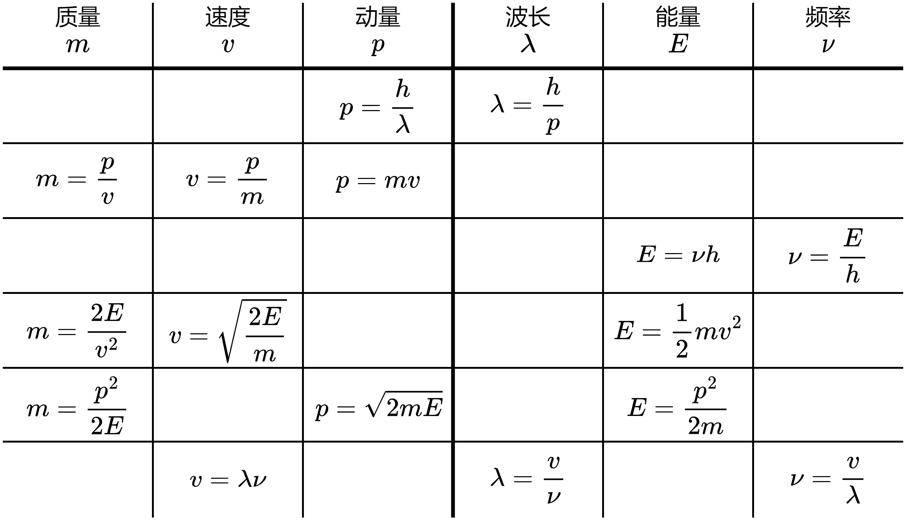

# 量子力学入门

- [Back to Course Home](index.md)

## 物质波

德布罗意认为光有波粒二象性，物质或许也有波粒二象性。他提出物质波假说：一个能量为 $E$、动量为 $p$ 的粒子具有波动性，波长 $\lambda$ 和频率 $\nu$ 分别与粒子的动量和能量成正比，即

$$
\lambda=\frac{h}{p},\nu=\frac{E}{h}
$$

这与光的波粒二象性的关系相同。

- 上式把波的概念与粒子的概念联系起来。第一个关系称为 **德布罗意关系** 。这种与实物粒子相联系的波称为 **德布罗意波** ，或称为 **物质波** 。
- 由于 $h$ 很小，通常实物粒子波长非常短，波动性无法表现。但是在原子世界中，就显现出微观粒子的波动性。

### 微观波粒二象性粒子属性转换

物理量 | 波动性 | 粒子性
--- | --- | ---
波长 $\lambda$ | $h/p$ | $v/\nu$ 
频率 $\nu$ | $E/h$ | $v/\lambda$
动量 $p$ | $h/\lambda$ | $m v$ = $\sqrt{2 m E}$
能量 $E$ | $h \nu$ | $\frac{1}{2}mv^2 = \frac{p^2}{2 m}$

### 相对论公式

$$
\begin{aligned} E &= E_0 + E_k = m_0 c^2 + E_k \\ E^2 &= E_0^2 + p^2 c^2 = m_0^2 c^4 + p^2 c^2 \\ \Rightarrow p &= \frac{1}{c} \sqrt{E^2 - E_0^2} \\ &= \frac{1}{c} \sqrt{(E_0 + E_k)^2 - E_0^2} \\ &= \frac{1}{c} \sqrt{E_k^2 + 2 E_0 E_k} \\ &= \frac{1}{c} \sqrt{E_k^2 + 2 m_0 c^2 E_k} \\ \Rightarrow \lambda &= \frac{h}{p} = \frac{h c}{\sqrt{E_k^2 + 2 E_0 E_k}} \\ &= \frac{h c}{\sqrt{E_k^2 + 2 m_0 c^2 E_k}} \\ \end{aligned}
$$

### 革末实验
晶体的 X 射线衍射实验中，同一晶面上相邻原子散射的光波的光程差等于零，它们相干加强, 反射给出强度最大的方向。一组晶面，可实现多光束相干叠加。若要在该方向上不同晶面上原子散射光相干加强, 满足布拉格公式：

$$
\delta = 2 d \sin \theta = k \lambda
$$

式中，$\delta$ 为光程差，$d$ 为晶面间距，$\theta$ 为入射角，$k$ 为整数。

## 不确定度关系

在经典力学中，一个粒子的位置和动量可以同时确定，而且知道了某一时刻粒子的位置和动量，原则上可以预言以后任意时刻粒子的位置和动量。然后，微观粒子的衍射实验已经表明微观粒子有明显的波性。粒子位置是不确定的，出现在某区域，例如出现在 b $\Delta x \Delta y \Delta z$ 范围内，可以称 $\Delta x$、$\Delta y$、$\Delta z$ 为粒子 **位置不确定量** 。粒子的动量、角动量等力学量也是如此。由 $p=\frac{h}{\lambda}$ 算出动量的可能范围 $\Delta p$，$\Delta p$ 就是动量不确定量。  
海森伯发现物理量的不确定量受到普朗克常量支配。他在 $1927$ 年提出了微观粒子的位置和动量两者的不确定量满足

$$
\Delta x \Delta p_{x} \geqslant \frac{\hbar}{2},\quad \Delta y \Delta p_{y} \geqslant \frac{\hbar}{2},\quad \Delta z \Delta p_{z} \geqslant \frac{\hbar}{2}
$$

上式称为位置和动量的 **不确定度关系** 。它的物理意义是客观上微观粒子不可能同时具有确定的坐标位置和相应的动量，粒子的位置不确定量 $\Delta x$ 越小，动量不确定量 $\Delta p_{x}$ 就越大，反之亦然。

同样，微观粒子能量和时间的不确定量满足

$$
\Delta E \Delta t \geqslant \frac{\hbar}{2}
$$

上式称为时间和能量的 **不确定度关系** 。它的物理意义是客观上微观粒子不可能同时具有确定的能量和相应的时间，粒子的能量不确定量 $\Delta E$ 越小，时间不确定量 $\Delta t$ 就越大，反之亦然。

### 不确定度关系解题步骤

1. 确定已知定值条件、已知差值条件和要求的差值
2. 根据“微观波粒二象性粒子属性转换”，拿到相关的物理量
3. 应用“时间和能量不确定性关系/位置和动量不确定性关系”（最多一次），得到答案

## 波函数（单色平面波）

既然微观粒子具有波动性，应引入描述这种波的波函数。德布罗意认为能量为 $E$、动量大小为 $p$ 的“自由粒子”沿 $x$ 方向运动时，对应的物质波应为“单色平面波”。即对应一列角波数和圆频率分别为 $k,\omega$ 的单色波

$$
\Psi(x,t)=\psi_{0} \mathrm{e}^{-\mathrm{i}(\omega t-k x)}
$$

式中 $\psi_{0}$ 为复数（待定），可见波函数 $\Psi(x,t)$ 为一复变函数。按德布罗意假设，可将波函数用粒子的能量和动量表示为

$$
\Psi(x,t)=\psi_{0} \mathrm{e}^{-\frac{i}{\hbar}(E t-p x)}
$$

式中 $\hbar=h / 2 \pi$，称为约化普朗克常数。  
若粒子为三维自由运动，则波函数可表示为

$$
\Psi(\boldsymbol{r},t)=\psi_{0} \mathrm{e}^{-\frac{i}{\hbar}(E t-p \cdot r)}
$$

的概率密度。

- 微观粒子物质波的波函数只能用复数形式来表达，不能用实数形式来表达
- 在一般情况下，粒子的波函数不是单色平面波的形式，而是空间和时间的复杂函数。
- 波函数既不描述粒子的形状，也不描述粒子运动的轨迹，它只给出粒子运动的概率分布。

### 波函数的统计意义

波函数模的平方代表在时刻 $t$、空间 $r$ 处单位体积中微观粒子出现的概率，即

$$
\rho(\boldsymbol{r},t)=|\Psi(\boldsymbol{r},t)|^{2}=\Psi(\boldsymbol{r},t)^{*} \Psi(\boldsymbol{r},t)
$$

为粒子的 **概率密度** ，其中 $\Psi^{*}(\boldsymbol{r},t)$ 是 $\Psi(\boldsymbol{r},t)$ 的复共轭。波函数是不可观测量，而概率密度可观测量。由于波函数的模方具有概率的意义，故也将德布罗意波称为概率波。在体积元 $\mathrm{d} V$ 中发现粒子的概率为

$$
\rho(\boldsymbol{r},t) \mathrm{d} V=\Psi(\boldsymbol{r},t)^{*} \Psi(\boldsymbol{r},t) \mathrm{d} V=|\Psi(\boldsymbol{r},t)|^{2} \mathrm{~d} V
$$

### 性质

- 连续性
- 有限性
- 单值性

### 归一化条件

由于在全空间一定能找到粒子，故概率密度在全空间积分为 $1$，即

$$
\int_{\Omega} \Psi^{*}(\boldsymbol{r},t) \Psi(\boldsymbol{r},t) \mathrm{d} V=1
$$

式中 $\Omega$ 表示全空间区域，称该式为波函数的归一化条件。

### 波粒二象性

量子力学中微观粒子的“粒子性”和“波动性”含义与经典粒子和经典波的不同

- “粒子性”主要指微观粒子的整体性和不可分性，粒子没有确定的轨道；
- “波动性”主要指描述微观粒子状态的波函数是可以叠加的，像经典波一样可以出现“干涉”“衍射”等现象。但与经典的波不同，波函数并不对应真实物理量的波动。
- “波粒二象性”是指微观粒子可显示出“波动”和“粒子”两种不同属性。在一些情况下，微观粒子突出显示出其粒子特性，而在另一些情况下，则突出显示出波动特性。

### 动量概率分布

$$
\begin{aligned} \Phi(\vec p,t) = \int_\infty\Psi(\vec r,t)\sqrt{\frac{1}{(2\pi\hbar)^3}}e^{-i\ \vec p\cdot \vec r/\hbar} \mathrm{d}x\mathrm{d}y\mathrm{d}z \\ \Psi(\vec r,t) = \int_\infty\Phi(\vec p,t)\sqrt{\frac{1}{(2\pi\hbar)^3}}e^{i\ \vec p\cdot \vec r/\hbar} \mathrm{d}p_x\mathrm{d}p_y\mathrm{d}p_z \end{aligned}
$$

我们发现，由于 $\Psi(\vec{r_{}},t)$ 和 $\Phi(\vec{p_{}},t)$ 可以唯一地互相求出，也就意味着它们包含了同样多的信息。既然 $\Psi(\vec{r_{}},t)$ 描述了体系的状态，那么 $\Phi(\vec{p_{}},t)$ 也描写了体系的状态。$\Phi(\vec{p_{}},t)$ 的物理意义是动量概率振幅，即 $|\Phi(\vec{p_{}},t)|^{2}$ 代表动量概率密度。