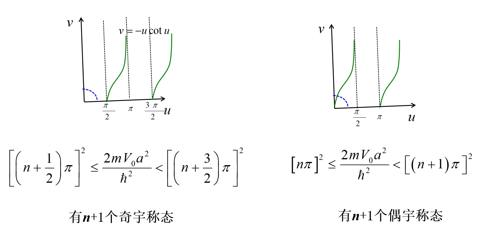

# 量子力学应用

- [Back to Course Home](index.md)

## 一维定态问题

### 一维无限深方势阱

金属中的电子由于金属表面势能（势垒）的束缚，被限制在一个有限的空间范围内运动。如果金属表面势垒很高，可以将金属表面看作一刚性盒子的壁。若只考虑一维运动，金属就是一维的刚性盒子，其势能函数可简化为

$$
U(x)=\left\{ \begin{array}{ll} 0,& 0 \leqslant x \leqslant L \\ \infty,& x<0,x>L \end{array}\right.
$$

称为一维无限深方势阱。
一维无限深方势阻中运动的粒子的哈密顿算符为

$$
\hat{H}=\left\{ \begin{array}{ll} -\frac{\hbar^{2} \mathrm{~d}^{2}}{2 m \mathrm{~d} x^{2}},& 0 \leqslant x \leqslant L \\ -\frac{\hbar^{2} \mathrm{~d}^{2}}{2 m \mathrm{~d} x^{2}}+\infty,& x<0,x>L \end{array}\right.
$$

在势阱内，定态薛定谔方程

$$
-\frac{\hbar^{2} \mathrm{~d}^{2}}{2 m \mathrm{~d} x^{2}} \Phi_{\mathrm{i}}(x)=E \Phi_{\mathrm{i}}(x)
$$

令

$$
k^{2}=\frac{2 m E}{\hbar^{2}}
$$

得

$$
\frac{\mathrm{d}^{2} \Phi_{\mathrm{i}}}{\mathrm{d} x^{2}}+k^{2} \Phi_{\mathrm{i}}=0
$$

该方程的解为

$$
\Phi_{\mathrm{i}}(x)=C \sin (k x+\delta)
$$

待定常数 $C$ 和 $\delta$ 由波函数的自然条件确定。  
在势阱外，

$$
\Phi_{\mathrm{e}}(x)=0
$$

利用波函数的连续性条件，阱内波函数在阱壁上也应为零，即

$$
\begin{array}{c} \Phi_{\mathrm{i}}(0)=\Phi_{\mathrm{e}}(0)=0 \\ \Phi_{\mathrm{i}}(L)=\Phi_{\mathrm{e}}(L)=0 \end{array}
$$

得：$\delta=0$，$k=\frac{n \pi}{L}$，$C$ 由归一化条件确定。
解得波函数

$$
\Phi_{n}(x)=\left\{ \begin{array}{ll} \sqrt{\frac{2}{L}} \sin \frac{n \pi}{L} x,& 0 \leqslant x \leqslant L \\ 0,& 0>x,x>L \end{array}\right.
$$

粒子的能量本征值为

$$
E_{n}=\frac{k^{2} \hbar^{2}}{2 m}=n^{2} E_{1}
$$

式中 $E_{1}=\frac{\pi^{2} \hbar^{2}}{2 m
L^{2}}$，势阱中粒子能量取分立值，能量是量子化的，不同能量对应不同的能级，能量间隔为

$$
\Delta E_{n}=E_{n+1}-E_{n}=(2 n+1) E_{1}=(2 n+1) \frac{\pi^{2} \hbar^{2}}{2 m L^{2}}
$$

能级间隔与粒子的质量有关，微观粒子的质量越小，粒子的能级间隔越大，量子效应越明显。当粒子质量变大，粒子的能级间隔越小，对于宏观粒子，能级间隔趋于零，粒子的能量可以连续取值，量子效应消失。另一方面能级间隔与势阱宽度有关，势阱宽度越小，能级间隔越大，量子效应明显；势阱宽度越大，能级间隔越小，如果 $L \rightarrow \infty$，能级间隔趋于零，粒子的能量可以连续取值，即自由粒子的能量可以取任意值。

束缚在势阱中的粒子，能量的最小值不能任意取值，有一个下限，称其为最低能量或称 **零点能** 。对方势阱中的粒子，零点能为 $n=1$ 时对应的能量为

$$
E_{1} = \frac{\pi^{2} \hbar^{2}}{2 m L^{2}} = \frac{h^{2}}{8 m L^{2}}
$$

可见零点能不为零，这是粒子波动性的必然结果，是另一个量子效应。  
利用能量动量关系将势阱中粒子的动量表示为

$$
p_{n}= \pm \sqrt{2 m E_{n}}= \pm n \frac{\pi \hbar}{L} = \pm n \frac{h}{2 L}
$$

再利用德布罗意关系可将粒子的波长表示为

$$
\lambda_{n}=\frac{h}{\left|p_{n}\right|}=\frac{2 L}{n}
$$

上式也可写成 $L=n \frac{\lambda_{n}}{2}$，势阱宽度正好为半波长的整数倍。说明势阱中粒子的每一个能态 $( n$ 确定 $)$ 对应的波函数为一个特定波长的驻波。将波函数的时间振荡因子与定态波函数相乘，得到粒子在阱内的波函数

$$
\begin{aligned} \Psi_{n}(x,t) & =\Phi_{n}(x) \mathrm{e}^{-\frac{i}{\hbar} E_{n} t} \\ & =\frac{1}{2 \mathrm{i}} \sqrt{\frac{2}{L}}\left[\mathrm{e}^{-\frac{i}{\hbar}\left(E_{n} t-p_{n} x\right)}-\mathrm{e}^{-\frac{i}{\hbar}\left(E_{n} t+p_{n} x\right)}\right] \\ & =C_{1} \mathrm{e}^{-\frac{i}{\hbar}\left(E_{n} t-p_{n} x\right)}+C_{2} \mathrm{e}^{-\frac{i}{\hbar}\left(E_{n} t+p_{n} x\right)} \end{aligned}
$$

泡利根据上式认为，方势阱中粒子波函数为 **两列平面波** 的叠加，这两列波的 **频率相同**、**波长相同**，只是 **传播方向相反**，叠加后形成 **驻波**，而且在阱壁处为 **波节**。

### 一维有限深方势阱
一维有限深方势阱是指粒子被限制在一个有限深度的势阱中。势阱的势能函数为

$$
U(x)=\left\{ \begin{array}{ll} 0,& 0 \leqslant |x| \leqslant a \\ U_{0},& |x|>a \end{array}\right.
$$

粒子的哈密顿算符为

$$
\hat{H}=\left\{ \begin{array}{ll} -\frac{\hbar^{2} \mathrm{~d}^{2}}{2 m \mathrm{~d} x^{2}},& 0 \leqslant |x| \leqslant a \\ -\frac{\hbar^{2} \mathrm{~d}^{2}}{2 m \mathrm{~d} x^{2}}+U_{0},& |x|>a \end{array}\right.
$$

定态薛定谔方程为

$$
\left\{ \begin{array}{ll} -\frac{\hbar^{2} \mathrm{~d}^{2}}{2 m \mathrm{~d} x^{2}} \Phi_{\mathrm{i}}(x)=E \Phi_{\mathrm{i}}(x), & 0 \leqslant |x| \leqslant a \\ -\frac{\hbar^{2} \mathrm{~d}^{2}}{2 m \mathrm{~d} x^{2}} \Phi_{\mathrm{e}}(x)+U_{0} \Phi_{\mathrm{e}}(x)=E \Phi_{\mathrm{e}}(x), & |x|>a \end{array}\right.
$$

讨论 $0<E<U_{0}$ 的情况，令

$$
k^{2}=\frac{2 m E}{\hbar^{2}}, \quad k'^{2}=\frac{2 m(U_{0}-E)}{\hbar^{2}}
$$

得到

$$
\left\{ \begin{array}{ll}\frac{\mathrm{d}^{2} \Phi_{\mathrm{i}}}{\mathrm{d} x^{2}}+k^{2} \Phi_{\mathrm{i}}=0, & 0 \leqslant x \leqslant a \\ \frac{\mathrm{d}^{2} \Phi_{\mathrm{e}}}{\mathrm{d} x^{2}}-k'^{2} \Phi_{\mathrm{e}}=0, & |x|>a \end{array}\right.
$$

该方程的解为

$$
\Phi_{\mathrm{i}}(x)=C \sin (k x+\delta), \quad \Phi_{\mathrm{e}}(x)=A e^{k' x}+B e^{-k' x}
$$

因为波函数在 $x \rightarrow \pm \infty$ 时应趋于零，所以 $x<0$ 时取 $B=0$，$x>a$ 时取 $A=0$。因此波函数化为

$$
\Phi(x)=\left\{ \begin{array}{ll} A e^{k' x}, & x< -a \\ C \sin (k x+\delta), & 0 \leqslant |x| \leqslant a \\ B e^{-k' x}, & x>a \\ \end{array}\right.
$$

利用波函数的连续性条件，阱内波函数及一阶导数在阱壁处连续，则

$$
\begin{aligned} \Phi_{\mathrm{i}}(-a) & =\Phi_{\mathrm{e}}(-a) \\ \Phi_{\mathrm{i}}(a) & =\Phi_{\mathrm{e}}(a) \\ \frac{\mathrm{d} \Phi_{\mathrm{i}}}{\mathrm{d} x}\bigg|_{x=-a} & =\frac{\mathrm{d} \Phi_{\mathrm{e}}}{\mathrm{d} x}\bigg|_{x=-a} \\ \frac{\mathrm{d} \Phi_{\mathrm{i}}}{\mathrm{d} x}\bigg|_{x=a} & =\frac{\mathrm{d} \Phi_{\mathrm{e}}}{\mathrm{d} x}\bigg|_{x=a} \end{aligned}
$$

将波函数代入上式，得到

$$
\begin{aligned} & A e^{-k' a}=C \sin (-k a+\delta) \\ & C \sin (k a+\delta)=B e^{-k' a} \\ & -A k' e^{-k' a}=C k \cos (-k a+\delta) \\ & C k \cos (k a+\delta)=-B k' e^{-k' a} \end{aligned}
$$

则有

$$
\begin{aligned} & k \cot (k a+\delta)=-k' \\ & k \cot (-k a+\delta)=k' \\ \end{aligned}
$$

则

$$
\cot (k a+\delta)=-\cot (-k a+\delta)
$$

因此 $\delta$ 有两组解

$$
\delta= \left\{ \begin{array}{l} n \pi\\ (n + \frac{1}{2}) \pi \end{array}\right., \quad n=0,\pm 1,\pm 2,\cdots
$$

不妨取 $n=0$，则 $\delta=0 或 \frac{\pi}{2}$
当 $\delta=0$ 时，代入上面四条等式得到 $A=-B$，波函数为奇宇称

$$
\Phi(x)=\left\{ \begin{array}{ll} A e^{k' x}, & x< -a \\ C \sin (k x), & 0 \leqslant |x| \leqslant a \\ -A e^{-k' x}, & x>a \end{array}\right.
$$

当 $\delta=\frac{\pi}{2}$ 时，代入上面四条等式得到 $A=B$，波函数为偶宇称

$$
\Phi(x)=\left\{ \begin{array}{ll} A e^{k' x}, & x< -a \\ C \cos (k x), & 0 \leqslant |x| \leqslant a \\ A e^{-k' x}, & x>a \end{array}\right.
$$

常数 $A$ 和 $C$ 由归一化条件和连接条件决定。

**奇宇称** 下，$\delta = 0$，此时 $k \cot (k a)=-k'$，又有 $k^{2} + k'^{2} = \frac{2 m E}{\hbar^{2}} + \frac{2 m (U_{0} - E)}{\hbar^{2}} = \frac{2 m U_{0}}{\hbar^{2}}$，因此令

$$
\begin{aligned} &u=ka, \quad v=k'a>0 \\ &u\cot u=-v \\ &u^{2}+v^{2}=\frac{2 m U_{0} a^{2}}{\hbar^{2}} \end{aligned}
$$

作图求解得：当 $\frac{2 m U_{0} a^{2}}{\hbar^{2}} \geqslant \frac{\pi^2}{4}$ 时，才有第一奇宇称的束缚态存在。

**偶宇称** 下，$\delta = \frac{\pi}{2}$，此时 $k \cot (k a + \frac{\pi}{2})=k \tan(k a)=k'$，又有 $k^{2} + k'^{2} = \frac{2 m E}{\hbar^{2}} + \frac{2 m (U_{0} - E)}{\hbar^{2}} = \frac{2 m U_{0}}{\hbar^{2}}$，因此令

$$
\begin{aligned} &u=ka, \quad v=k'a>0 \\ &u\tan u=v \\ &u^{2}+v^{2}=\frac{2 m U_{0} a^{2}}{\hbar^{2}} \end{aligned}
$$

作图求解得：无论 $\frac{2 m U_{0} a^{2}}{\hbar^{2}}$ 的大小，均有一个偶宇称的束缚态（基态）存在。

### 一维方势垒和隧道效应
一维方势垒的势能函数为

$$
U(x)=\left\{ \begin{array}{ll} U_{0},& 0 \leqslant x \leqslant a \\ 0,& x<0,x>a \end{array}\right.
$$

假设粒子的能量 $E<U_{0}$，则粒子的哈密顿算符为

$$
\hat{H}=\left\{ \begin{array}{ll} -\frac{\hbar^{2} \mathrm{~d}^{2}}{2 m \mathrm{~d} x^{2}},& x<0,x>a \\ -\frac{\hbar^{2} \mathrm{~d}^{2}}{2 m \mathrm{~d} x^{2}}+U_{0},& 0 \leqslant x \leqslant a \end{array}\right.
$$

定态薛定谔方程为

$$
\left\{ \begin{array}{ll} -\frac{\hbar^{2} \mathrm{~d}^{2}}{2 m \mathrm{~d} x^{2}} \Phi_{\mathrm{i}}(x)=E \Phi_{\mathrm{i}}(x), & x<0,x>a \\ -\frac{\hbar^{2} \mathrm{~d}^{2}}{2 m \mathrm{~d} x^{2}} \Phi_{\mathrm{e}}(x)+U_{0} \Phi_{\mathrm{e}}(x)=E \Phi_{\mathrm{e}}(x), & 0 \leqslant x \leqslant a \end{array}\right.
$$

令

$$
k^{2}=\frac{2 m E}{\hbar^{2}}, \quad k'^{2}=\frac{2 m(U_{0}-E)}{\hbar^{2}}
$$

得到

$$
\left\{ \begin{array}{ll}\frac{\mathrm{d}^{2} \Phi_{\mathrm{i}}}{\mathrm{d} x^{2}}+k^{2} \Phi_{\mathrm{i}}=0, & x<0,x>a \\ \frac{\mathrm{d}^{2} \Phi_{\mathrm{e}}}{\mathrm{d} x^{2}}-k'^{2} \Phi_{\mathrm{e}}=0, & 0 \leqslant x \leqslant a \end{array}\right.
$$

该方程的解为

$$
\Psi(x)=\left\{ \begin{array}{ll} A e^{ikx}+ A' e^{-ikx}, & x<0 \\ B e^{k'x}+ B' e^{-k'x}, & 0 \leqslant x \leqslant a \\ C e^{ikx}+ C' e^{-ikx}, & x>a \end{array}\right.
$$

其中，$e^{ikx}$ 和 $e^{-ikx}$ 分别表示向右和向左传播的平面波，$e^{k'x}$ 和 $e^{-k'x}$ 分别表示向右和向左衰减的指数波。

从物理条件考虑，$C'=0$，再由波函数和一阶导数的连续性条件，得到

$$
\begin{aligned} & \Psi_1(0)=A + A' = B + B'= \Psi_2(0)\\ & \Psi_1'(0)=ik(A - A') = k' (B - B') = \Psi_2'(0)\\ & \Psi_2(a)=B e^{k'a} + B' e^{-k'a} = C e^{ika} = \Psi_3(a)\\ & \Psi_2'(a)=k' (B e^{k'a} - B' e^{-k'a}) = ik C e^{ika} = \Psi_3'(a) \end{aligned}
$$

解得反射系数

$$
R = \left| \frac{A'}{A} \right|^2 = \frac{(k^2+k'^2)^2 \sinh^2(k'a)}{(k^2+k'^2)^2 \sinh^2(k'a) + 4 k^2 k'^2}
$$

透射系数

$$
T = \left| \frac{C}{A} \right|^2 = \frac{4 k^2 k'^2}{(k^2+k'^2)^2 \sinh^2(k'a) + 4 k^2 k'^2}
$$

势垒 $U_0$ 越高，宽度 $a$ 越大，粒子穿透的概率越小，反射系数 $R$ 越大，透射系数 $T$ 越小，但总有一定几率穿透，这一现象称为 **量子隧道效应**。

透射系数 $T$ 和反射系数 $R$ 满足

$$
R + T = 1
$$

且透射系数 $T$ 对势垒的宽度 $a$ 和粒子质量 $m$ 的变化很敏感。

当 $E > U_0$ 时，透射系数表示为

$$
T = \frac{4 k^2 k'^2}{(k^2-k'^2)^2 \sin^2(k'a) + 4 k^2 k'^2} = \frac{4 E (E-U_0)}{U_0^2 \sin^2(k'a) + 4 E (E-U_0)}
$$

## 谐振子

### 定义

一般而言，任何一个体系在稳定平衡点附近都可以近似地用线性谐振子来表示。谐振子的势能可以表示为

$$
V=\frac{1}{2} \mu \omega^{2} x^{2}
$$

式中，$\omega$ 是常量；$\mu$ 是谐振子的质量。这种体系为线性振子。在经典力学中，线性振子所做的运动是简谐振动。振子满足运动方程 $x=A
\cos (\omega t+\phi)$，$ A $ 是振幅，$\phi$ 是初相位，谐振子能量与振幅的平方成正比。量子理论的结果与经典力学的结果有着根本性的差异。我们用量子力学来解线性谐振子问题，求出能量和波函数。

### 厄密方程

选取适当的坐标系，则体系的薛定谔方程为

$$
\left(-\frac{\hbar^{2}}{2 \mu} \frac{\mathrm{d}^{2}}{\mathrm{~d} x^{2}}+\frac{1}{2} \mu \omega^{2} x^{2}\right) \psi(x)=E \psi(x)
$$

引入无量纲参数 $\xi$ 代替 $x$，即

$$
\xi=\alpha x,\alpha=\sqrt{\frac{\mu \omega}{\hbar}}
$$

令 $\lambda=\frac{E}{\frac{1}{2} \hbar \omega}$，把薛定谔方程改写为

$$
\frac{\mathrm{d}^{2}}{\mathrm{~d} \xi^{2}} \psi(\xi)+\left(\lambda-\xi^{2}\right) \psi(\xi)=0
$$

首先求出 $\xi \rightarrow \pm \infty$ 时的渐进行为。当 $\xi$ 很大时，上式的解应接近

$$
\frac{\mathrm{d}^{2}}{\mathrm{~d} \xi^{2}} \psi(\xi)-\xi^{2} \psi(\xi)=0
$$

其解为

$$
\psi(\xi) \sim \mathrm{e}^{ \pm \frac{1}{2} \xi^{2}}
$$

满足物理边界条件的解为

$$
\psi(\xi) \sim \mathrm{e}^{-\frac{1}{2} \xi^{2}}
$$

因此设 $\psi(\xi)=\mathrm{e}^{-\frac{1}{2} \xi^{2}} u(\xi)$，代入式 $(2-56)$，得到 $u(\xi)$ 满足方程

$$
\frac{\mathrm{d}^{2} u}{\mathrm{~d} \xi^{2}}-2 \xi \frac{\mathrm{d} u}{\mathrm{~d} \xi}+(\lambda-1) u=0
$$

上式是厄密方程。

### 方程的解

可采用幂级数展开求解

$$
\begin{aligned} u(\xi)&=\sum_{k=0}^{\infty} c_{k} \xi^{k} \\ u^{\prime}(\xi)&=\sum_{k} c_{k} k \xi^{k-1} \\ u^{\prime \prime}(\xi)&=\sum_{k} c_{k} k(k-1) \xi^{k-2} \end{aligned}
$$

所以得到

$$
\sum_{k=0}^{\infty} c_{k} k(k-1) \xi^{k-2}-2 \sum_{k} c_{k} k\xi^{k}+(\lambda-1) \sum_{k} c_{k} \xi^{k}=0
$$

比较 $\xi^{j}$ 的系数

$$
c_{j+2}(j+2)(j+1)-2 c_{j} j+(\lambda-1) c_{j}=0
$$

求得

$$
c_{j+2}=\frac{2 j-(\lambda-1)}{(j+2)(j+1)} c_{j}
$$

即系数递推关系式。厄密方程的解或者是偶次幂，或者是奇次幂。这两个解在 $\xi$ 取有限值时都收敛。所有偶次幂系数都可以 $c_{0}$ 表示，所有奇次幂系数都可以 $c_{1}$ 表示。两个线性无关的解分别表示为

$$
\begin{aligned} u_{1}(\xi)&=c_{0}+c_{2} \xi^{2}+c_{4} \xi^{4}+\cdots \\ u_{2}(\xi)&=c_{1} \xi+c_{3} \xi^{3}+c_{5} \xi^{5}+\cdots \end{aligned}
$$

这两个解在 $\xi \rightarrow \infty$ 时取无限项时都发散，因此必须截断，所以当 $\lambda-1=2 n$ 时，系数 $c_{n+2},c_{n+4},c_{n+6},\cdots$ 都为零。

### 能量本征值

上述要求给出的能量有一定限制，即谐振子的能量本征值为

$$
E_{n}=\frac{\lambda}{2} \hbar \omega=\left(n+\frac{1}{2}\right) \hbar \omega = \left(n+\frac{1}{2}\right) h \nu
$$

可以看到，谐振子的能级是量子化且均匀分布的，相邻能级间隔是 $\hbar \omega$。对应的能量本征函数为

$$
\psi_{n}(x)=N_{n} H_{n}(\xi) \mathrm{e}^{-\frac{1}{2} \xi^{2}}
$$

式中，$N_{n}$ 为归一化常数；$H_{n} ( \xi )$ 为厄密多项式。

### 波函数

谐振子波函数表述为

$$
\psi_{n}(x)=\left(\frac{\mu \omega}{\pi \hbar}\right)^{\frac{1}{4}} \frac{1}{\sqrt{2^{n} n !}} H_{n}(\sqrt{\frac{\mu \omega}{\hbar}} x )\mathrm{e}^{-\frac{\mu \omega}{2 \hbar} x^{2}}
$$

其中

$$
H_{n}(\xi)=(-1)^{n} \mathrm{e}^{\xi^{2}} \frac{\mathrm{d}^{n}}{\mathrm{~d} \xi^{n}} \mathrm{e}^{-\xi^{2}}
$$

前面几项厄密多项式如下：

$$
\begin{array}{l} H_{0}(\xi)=1 \\ H_{1}(\xi)=2 \xi \\ H_{2}(\xi)=4 \xi^{2}-2 \\ H_{3}(\xi)=8 \xi^{3}-12 \xi \end{array}
$$

三个能量最低能级的波函数如下。

- 基态：

    $$
    \psi_{0}(x)=\left(\frac{\mu \omega}{\pi \hbar}\right)^{\frac{1}{4}} \mathrm{e}^{-\frac{\mu \omega}{2 \hbar} x^{2}}
    $$

- 第一激发态：

    $$
    \psi_{1}(x)=\left(\frac{\mu \omega}{\pi \hbar}\right)^{\frac{1}{4}} \sqrt{\frac{2 \mu \omega}{\hbar}} x \mathrm{e}^{-\frac{\mu \omega}{2 \hbar} x^{2}}
    $$

- 第二激发态：

    $$
    \psi_{2}(x)=\left(\frac{\mu \omega}{4 \pi \hbar}\right)^{\frac{1}{4}}\left(\frac{2 \mu \omega}{\hbar} x^{2}-1\right) \mathrm{e}^{-\frac{\mu \omega}{2 \hbar} x^{2}}
    $$

## 氢原子

### 定义

氢原子是一个质子（电荷为 $+e$）和一个电子（电荷为 $-e$）组成的两体系统，二者之间存在库仑相互作用。由于质子的质量 $(M)$ 大约是电子质量 $m_{\mathrm{e}}$ 的两千倍，作为近似处理，可以建立以质子为坐标原点的坐标系，电子位置用球坐标 $(r,\theta,\varphi)$ 表示。氢原子如同一个电子的陷阱，它把一个电子限定在某一区域。

### 薛定谔方程

氢原子中电子的势能为

$$
V(r)=-\frac{Z e^{2}}{4 \pi \varepsilon_{0} r}
$$

式中，$Z e$ 是原子核的电荷，对于氢原子核，$Z=1$。设原子核静止，将 $V(r)$ 代入定态薛定谔方程，得

$$
\hat{H} \psi=\left(-\frac{\hbar^{2}}{2 m} \nabla^{2}-\frac{e^{2}}{4 \pi \varepsilon_{0} r}\right) \psi=E \psi
$$

式中，$\nabla^{2}$ 是拉普拉斯算符，$m$ 是约化质量 $M m_{e}/\left(M+m_{e}\right)$。由于哈密顿量有球对称性，在球坐标中讨论比较方便，拉普拉斯算符用球坐标表示为

$$
\begin{aligned} \nabla^{2} & =\frac{1}{r^{2}} \frac{\partial}{\partial r}\left(r^{2} \frac{\partial}{\partial r}\right)+\frac{1}{r^{2} \sin \theta} \frac{\partial}{\partial \theta}\left(\sin \theta \frac{\partial}{\partial \theta}\right) +\frac{1}{r^{2} \sin \theta} \frac{\partial^{2}}{\partial \varphi^{2}} \\ & =\frac{1}{r^{2}} \frac{\partial}{\partial r}\left(r^{2} \frac{\partial}{\partial r}\right)-\frac{L^{2}}{r^{2} \hbar^{2}} \end{aligned}
$$

用分离变量法求解

$$
\hat{H}=-\frac{\hbar^{2}}{2 m r^{2}} \frac{\partial}{\partial r}\left(r^{2} \frac{\partial}{\partial r}\right)+\frac{L^{2}}{2 m r^{2}}+V(r)
$$

式中，第一项是径向动能算符；第二项是离心势能。容易证明，$\hat{H},\hat{\boldsymbol{L}}^{2},\hat{L}_{z}$ 三者是彼此对易的，所以三者构成力学量完全集，有一套 **共同本征函数** 。

在这套本征函数中，能量、角动量、角动量 $z$ 分量有确定值。而 $L^{2}$ 和 $L_{z}$ 的本征函数和本征值如下：

$$
\begin{aligned} &\hat{\mathbf{L}}^{2} Y_{l m}(\theta,\phi)=l(l+1) \hbar^{2} Y_{l m}(\theta,\phi) \\ &\hat{L}_{z} Y_{l m}(\theta,\phi)=m_{l} \hbar Y_{l m}(\theta,\phi) \\ &l=0,1,2,\cdots \\ &m_{l}=-l,-l+1,\cdots,+l \end{aligned}
$$

式中，$l$ 是角量子数；$m_l$ 是磁量子数。对一个确定的角量子数 $l$，$m_l$ 可以取 $2l+1$ 个值。这表明角动量在空间取向只有 $2l+1$ 个可能。

### 氢原子束缚态能量本征函数

所以，氢原子束缚态能量本征函数为

$$
\begin{aligned} &\Psi_{n l m}(r, \theta, \phi)=R_{n l}(r) Y_{l m}(\theta, \phi)\\ &n=1,2,3,\cdots \\ &l=0,1,2,\cdots,n-1 \\ &m_{l}=-l,-l+1,\cdots,0,\cdots,l-1,l \end{aligned}
$$

其中，$R_{n l}(r)$ 是径向波函数，$Y_{l m}(\theta, \phi)$ 是球谐函数，$n$ 是主量子数，$l$ 是角量子数，$m_l$ 是磁量子数。

哈密顿算符 $\hat{H}$ 对应本征函数 $R_{n l}(r)$ 的本征值为

$$
E_{n}=-\frac{Z^{2} e^{4} m_{e}}{8 \varepsilon_{0}^{2} h^{2} n^{2}}=-\frac{e^{4} m_{e}}{8 \varepsilon_{0}^{2} h^{2}} \frac{1}{n^{2}} = -\frac{13.6 \mathrm{eV}}{n^{2}}, \quad n=1,2,3,\cdots
$$

角动量平方算符 $\hat{L}^{2}$ 对应本征函数 $Y_{l m}(\theta, \phi)$ 的本征值为

$$
L^{2} = l(l+1) \hbar^{2}, \quad l=0,1,2,\cdots
$$

则角动量大小为

$$
L=\sqrt{l(l+1)} \hbar, \quad l=0,1,2,\cdots
$$

角动量的 $z$ 分量算符 $\hat{L}_{z}$ 对应本征函数 $Y_{l m}(\theta, \phi)$ 的本征值为

$$
L_{z} = m_{l} \hbar, \quad m_{l}=-l,-l+1,\cdots,+l
$$

### 电子的概率分布

按照波函数的物理解释，对于定态，$\left|\psi_{n l m}\right|^{2}=\left|R_{n l}(r) Y_{lm}(\theta,\phi)\right|^{2}$ 代表电子的概率密度。概率密度乘以球坐标的体积元

$$
\mathrm{d} \tau=r^{2} \sin \theta \mathrm{d} r \mathrm{~d} \theta \mathrm{d} \varphi=r^{2} \mathrm{~d} r \mathrm{~d} \Omega
$$

其中 $\mathrm{d} \Omega=\sin \theta \mathrm{d} \theta \mathrm{d} \varphi,\mathrm{d} \Omega$ 是 $(\theta,\varphi)$ 方向上的立体角元，则电子出现在体积元 $\mathrm{d} \tau$ 中的概率密度

$$
\left|\psi_{n l m}\right|^{2}=\left|R_{n l}(r) Y_{lm}(\theta,\varphi)\right|^{2}
$$

且满足归一化条件

$$
\int\left|\psi_{n l m}(r,\theta,\phi)\right|^{2} r^{2} \mathrm{~d} r \mathrm{~d} \Omega=1
$$

电子沿径向的概率密度为

$$
P_{n l}(r)=\left|R_{n l}(r)\right|^{2} r^{2}
$$

电子沿角向的概率密度为

$$
P_{l m_l}(\theta, \varphi)=\left|Y_{l m_l}(\theta, \varphi)\right|^{2}
$$

定义最可几半径为电子沿径向的概率密度最大值对应的 $r$ 值，即

$$
r_{n l}=\arg \max _{r} P_{n l}(r)=\arg \max _{r}\left|R_{n l}(r)\right|^{2} r^{2}
$$

则有 $r_{1 0}=a_0$，其中 $a_0$ 是玻尔半径。

### 电子自旋角动量
电子自旋角动量是电子的内禀角动量，与电子的轨道角动量不同。电子自旋角动量的大小为

$$
S=\sqrt{s(s+1)} \hbar
$$

$z$ 分量为

$$
S_{z}=m_{s} \hbar
$$

其中，$s$ 是自旋量子数，$m_s$ 是自旋磁量子数，则有 $2s+1$ 个可能的自旋状态。对于电子，$2s+1=2$，即 $s=\frac{1}{2}$，$m_s$ 可以取 $\pm \frac{1}{2}$。

所以有电子自旋角动量的大小

$$
S=\frac{\sqrt{3}}{2} \hbar
$$

$z$ 分量大小为

$$
S_{z}=m_{s} \hbar=\pm \frac{1}{2} \hbar
$$

### 泡利不相容原理

1. 费米子和玻色子
	- 费米子：自旋量子数为半整数的粒子
	- 玻色子：自旋量子数为整数的粒子

2. 泡利不相容原理
	- 不能有两个电子具有相同的四个量子数 $(n, l, m_l, m_s)$

3. 玻色凝聚
	- 玻色子不受泡利不相容原理的限制，一个单粒子态可以容纳多个玻色子

### 原子核外电子排布

同一主壳层可容纳的电子数为 $2 n^{2}$，其中 $n$ 是主量子数。每个次壳层的电子数为 $2(2 l+1)$，其中 $l$ 是角量子数。

$$
N_n = \sum_{l=0}^{n-1} 2(2l + 1) = 2 [1+3+5+\cdots+(2n-1)] = 2n^2
$$

原子核外电子排布遵循以下原则：

1. **能量最低原则**：电子总是先填充能量最低的轨道。
2. **泡利不相容原理**：每个轨道最多只能容纳两个电子，且自旋方向相反。
3. **洪特规则**：在同一能级的轨道中，电子会尽量单独占据每个轨道，直到所有轨道都被占据后才会成对填充。
4. **能级顺序**：电子填充的顺序遵循能级从低到高的原则，通常遵循 $n + l$ 规则，即先填充 $n + l$ 值小的轨道。

## 双态系统

### 薛定谔方程矩阵形式

考虑一个量子系统，它的态空间是二维的，将薛定谔方程表达为矩阵形式，有

$$
\mathrm{i} \hbar \frac{\partial}{\partial t}\left[\begin{array}{l} C_{1}\\C_{2} \end{array}\right]=\left[\begin{array}{ll} H_{11} & H_{12} \\ H_{21} & H_{22} \end{array}\right]\left[\begin{array}{l} C_{1} \\ C_{2} \end{array}\right]
$$

**哈密顿算符** 用矩阵表示。如果选取 **基矢** $\left|\chi_{\alpha}\right\rangle\left(\alpha=\pm\right.$，即 $\left|\chi_{+}\right\rangle$ 和 $\left.\left|\chi_{-}\right\rangle\right)$ 是哈密顿算符的本征矢，则

$$
\begin{aligned} \hat{H}\left|\chi_{+}\right\rangle=E_{1}\left|\chi_{+}\right\rangle \\ \hat{H}\left|\chi_{-}\right\rangle=E_{2}\left|\chi_{-}\right\rangle \end{aligned}
$$

以此为基的表象是 **能量表象** 。由于本征矢的正交归一性，有

$$
\begin{array}{c} H_{11}=\left\langle\chi_{+}|\hat{H}|\chi_{+}\right\rangle=E_{1},H_{22}=\left\langle\chi_{-}|\hat{H}|\chi_{-}\right\rangle=E_{2} \\ H_{12}=\left\langle\chi_{+}|\hat{H}|\chi_{-}\right\rangle=0,H_{21}=\left\langle\chi_{-}|\hat{H}|\chi_{+}\right\rangle=0 \end{array}
$$

所以在能量表象中哈密顿矩阵是对角的：

$$
\left[\begin{array}{ll} H_{11} & H_{12} \\ H_{21} & H_{22} \end{array}\right]=\left[\begin{array}{cc} E_{1} & 0 \\ 0 & E_{2} \end{array}\right]
$$

在能量表象下，哈密顿矩阵是对角的，薛定谔方程有

$$
\mathrm{i} \hbar \frac{\partial}{\partial t}\left[\begin{array}{l} C_{+} \\ C_{-} \end{array}\right]=\left[\begin{array}{cc} E_{1} & 0 \\ 0 & E_{2} \end{array}\right]\left[\begin{array}{l} C_{+} \\ C_{-} \end{array}\right]
$$

由此得到

$$
C_{\alpha}(t)=C_{\alpha}(0) \mathrm{e}^{-\frac{i E_{\alpha} t}{h}} \quad \alpha= \pm
$$

可见，概率幅的模方是不随时间变化的常量。如果初态是哈密顿矩阵的一个本征态 $\left|\chi_{\alpha}\right\rangle$，则概率幅是 $|\psi(t)\rangle=\mathrm{e}^{-i \frac{E_{\alpha} t}{h}}\left|\chi_{\alpha}\right\rangle$，其模方是不变的，系统处于 **定态** 。

一般表象下，哈密顿矩阵不是对角化的，$\left|u_{1}\right\rangle$ 和 $\left|u_{2}\right\rangle$ 不是哈密顿算符本征态，因而不是定态。如果系统初始处于态 $\left|u_{1}\right\rangle$，则这个系统有一定概率 $P_{12}$ 在 $t$ 时刻处于态 $\left|u_{2}\right\rangle$。这是因为 $H_{12}$ 和 $H_{21}$ 引起了两个态之间的跃迁。因此，可以称非对角元为耦合。

### 氨分子的双态模型

氨分子中，三个氢原子分别位于正三角形的三个顶点上，而一个氮原子则位于三角形中心偏左方，整个分子呈四面体结构。因此，氨分子内部可能产生振荡，也就是说，氮原子以三角形平面为对称面在两边来回振动。这个体系的势能 $V(x)$ 是氮原子与氢原子所在平面之间距离 $z$ 的函数。

设两种结构的量子态分别是 $|1\rangle$ 和 $|2\rangle$，它们具有相同的能量，即 $H_{11}=H_{22}=E_{0}$。由于氮原子穿越氢原子中央而翻转到另一侧，即穿透势垒发生量子隧穿，所以 $H_{12}$ 和 $H_{21}$ 不为零。不妨假定它们是负的实数，即 $H_{12}=H_{21}=A(A<0)$，于是得到氨分子双态的薛定谔方程为

$$
\mathrm{i} \hbar \frac{\partial}{\partial t}\left[\begin{array}{l} C_{1}\\ C_{2} \end{array}\right]=\left[\begin{array}{cc} E_{0} & A \\ A & E_{0} \end{array}\right]\left[\begin{array}{l} C_{1} \\ C_{2} \end{array}\right]
$$

令 $C_{ \pm}=\frac{1}{\sqrt{2}}\left(C_{1} \pm C_{2}\right)$，则上式变成

$$
\mathrm{i} \hbar \frac{\partial}{\partial t}\left[\begin{array}{l} C_{+} \\ C_{-} \end{array}\right]=\left[\begin{array}{cc} E_{0}+A & 0 \\ 0 & E_{0}-A \end{array}\right]\left[\begin{array}{l} C_{+} \\ C_{-} \end{array}\right]
$$

由于哈密顿矩阵是对角的，本征值 $E_{ \pm}=E_{0} \pm A$，对应本征矢 $\left|\chi_{+}\right\rangle$ 和 $\left|\chi_{-}\right\rangle$ 为

$$
\left|\chi_{ \pm}\right\rangle=\frac{1}{\sqrt{2}}(|1\rangle \pm|2\rangle)
$$

上式积分后得到

$$
C_{ \pm}(t)=C_{ \pm}(0) \mathrm{e}^{-\frac{i E_{ \pm} t}{h}}
$$

式中，$C_{ \pm}(0)$ 是由初始条件决定的积分常量。  
由 $C_{ \pm}=\frac{1}{\sqrt{2}}\left(C_{1} \pm C_{2}\right)$ 解得

$$
\begin{aligned} C_{1}(t) &=\frac{1}{\sqrt{2}}\left[C_{+}(t)+C_{-}(t)\right] \\ &=\frac{1}{\sqrt{2}}\left[C_{+}(0) \mathrm{e}^{-\mathrm{i} \frac{E_{+} t}{h}}+C_{-}(0) \mathrm{e}^{-i \frac{E_{-} t}{h}}\right] \\ C_{2}(t) &=\frac{1}{\sqrt{2}}\left[C_{+}(t)-C_{-}(t)\right] \\ &=\frac{1}{\sqrt{2}}\left[C_{+}(0) \mathrm{e}^{-\mathrm{i} \frac{E_{+} t}{h}}-C_{-}(0) \mathrm{e}^{-i \frac{E_{-} t}{h}}\right] \end{aligned}
$$

由上面各式可以看出，$C_{ \pm}$ 是定态的概率幅，其模方不变。如果 $C_{-}(0)=0$，氨分子“ $L$ ”或“ $R$ ”的两个状态具有相同的振幅，则氨分子具有确定的能量 $E_{+}=E_{0}+A$。如果初始系统处于 $|1\rangle$ 态，即

$$
\begin{aligned} C_{1}(0)&=\frac{1}{\sqrt{2}}\left[C_{+}(0)+C_{-}(0)\right]=1 \\ C_{2}(0)&=\frac{1}{\sqrt{2}}\left[C_{+}(0)-C_{-}(0)\right]=0 \end{aligned}
$$

由此得

$$
C_{+}(0)=C_{-}(0)=\frac{1}{\sqrt{2}}
$$

于是本征态

$$
\begin{aligned} C_{1}(t)=\mathrm{e}^{-\frac{E_{0} t}{\hbar}} \cos \frac{A t}{\hbar} \\ C_{2}(t)=-\mathrm{ie}^{-\frac{E_{0} t}{\hbar}} \sin \frac{A t}{\hbar} \end{aligned}
$$

两振幅随时间做简谐变化。它们的模方是系统分别处于态 $|1\rangle$ 和 $|2\rangle$ 的概率。由于 $C_{1}(t)$ 和 $C_{2}(t)$ 的模方随时间变化，氨分子处于两个状态的概率是时间相关的。

$$
\begin{aligned} P_{1}(t) &=\left|C_{1}(t)\right|^{2}=\cos ^{2} \frac{A t}{\hbar}\\ P_{2}(t) &=\left|C_{2}(t)\right|^{2}=\sin ^{2} \frac{A t}{\hbar} \end{aligned}
$$

